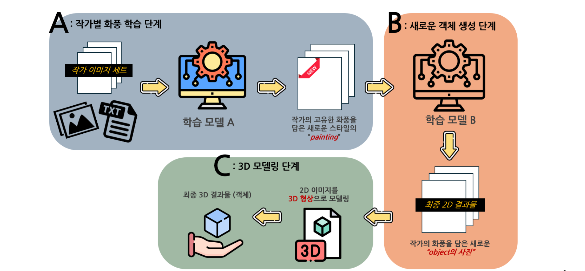
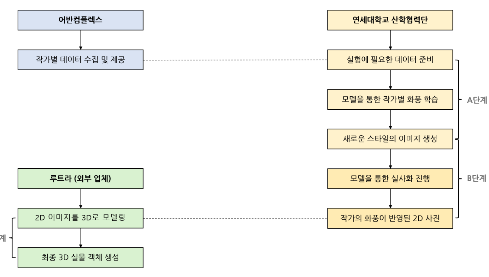
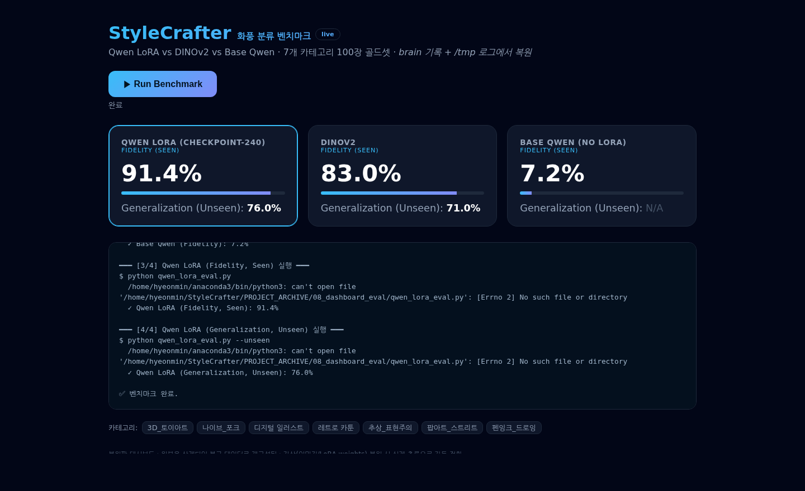
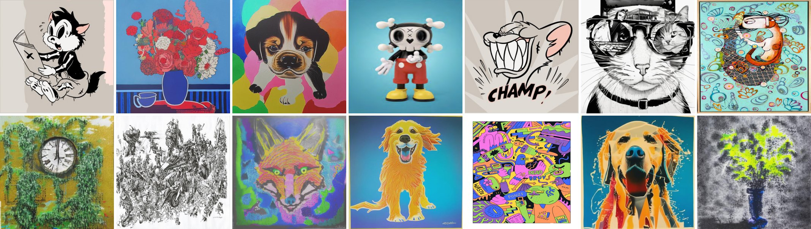
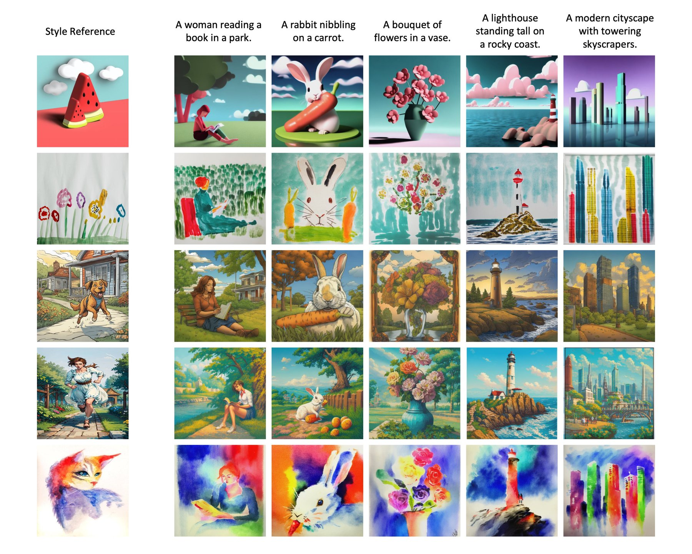

An artist has a way of drawing that is theirs: the line, the palette, how perspective is bent, what the characters are for. The project's question is whether that can be captured from a few works and used — to describe it, to generate new objects in it, and to make those objects into goods an artist could sell. It is a TIPS-funded R&D project of Urban Complex with Yonsei as the research partner; the lab develops the model engine, the company builds the service, collects the data and works with the artists. On the lab side the project is three of us — Jiyoung Jeon, Daehyuk You and me. I joined in March 2025; my parts are listed under "What I built". This page is what was built, month by month, including the month the work vanished.

## Year one (2024–2025): finding a generator that keeps an artist's style

The project started in April 2024. The first months were study — two textbooks on generative models and transformers over the summer, then paper study in the autumn (DDPM, classifier-free guidance, latent diffusion, textual inversion, DreamBooth, ControlNet, multi-concept customisation) with the diffusers library and a minimal Stable Diffusion implementation as the code side — and experiments began in December 2024 once candidate models were chosen, on the partner's own artist dataset from the end of that month. Through spring 2025 Jiyoung Jeon and I ran the candidates side by side on the same artists and the same prompts and kept the results in a shared notebook. What was tried, with the verdict at the time:

| family | model | verdict |
|---|---|---|
| personalisation (fine-tune on the artist) | DreamBooth, HyperDreamBooth, Textual Inversion + LoRA, ZipLoRA, Custom Diffusion / multi-concept | the reference direction; costs a training run per artist |
| personalisation, lighter | StyleDrop, Perfusion, TextBoost, Single-StyleForge, Ada-Adapter | tried; judged not good enough on these artists |
| training-free style conditioning | RB-Modulation (stochastic optimal control) | works, but 80–90 s per image and no train/inference split |
| training-free style conditioning | DEADiff, StyleAligned (shared attention; SDXL, ControlNet-compatible; ~40 s) | tried on four artists; style follows the prompt more than the reference |
| training-free style conditioning | **InstantStyle** (IP-Adapter family; SD1.5, SDXL, inpainting, multi-reference) | kept as a comparison line |
| training-free style conditioning | **StyleCrafter** (style adapter on VideoCrafter; ~9–10 s per image, 40 s for five) | the main line from June 2025; run on every image of 20+ artists, single-reference and all-references, with guidance-scale and step sweeps (6 → 9, 50 → 100) |
| vector / stroke priors | VectorPainter, SuTI (subject-driven) | surveyed |
| base checkpoints | SD1.5, SDXL, later **Toon Sphere 3D** | SDXL replaced VideoCrafter in 2026; the toy checkpoint for toy-art artists |

The notebook also records why some things were not tried: the IP-Adapter and VSP paths were blocked for a while by a CUDA driver version the server could not update, and the limit of the whole family is written down plainly — a style-transfer model has no stage that <i>learns</i> the artist, so there is a ceiling on how far quality can be pushed. That limit, recorded in March 2026, is the one the August 2025 reset (below) had already responded to.

Alongside the generation experiments, the lab's reading in September 2025 — before the artist interviews — went to the literature on what "style" even is: formal decomposition of artworks into palette, brushstroke, composition, line and light; the datasets that label it (WikiArt, ArtBench-10, AI-ArtBench, MultiTaskPainting100k, Art500K, and StyleBabel's expert tags and captions); style-similarity measurement in diffusion models; and the HCI work arguing that style transfer copies colour and texture but not an artist's emergent style, and that "creative ownership" has person, process and system dimensions. That reading is why the memory bank is built from language and the artist's own account, not from a style embedding alone.

## The project and the lab's part

The first year's generators were style-transfer models, and their limit was visible in the results: the outline of the source object could not change, so the output only wore the artist's surface. The direction set in August 2025 was personalisation instead — learn the style from four to ten images (DreamBooth, LoRA and their relatives), generate freely from a prompt, and add a 3D stage so the result can be printed. Six artist interviews run by the company in the autumn shaped what the tool should be: not a generator that forgets the artist every session, but one that keeps the artist's *world* — the recurring characters, the composition habits, the narrative — as a memory that generation draws on. The deliverables for year two became two engines: a **memory bank** that turns an artist's images into structured language (style sentences, visual keywords, recurring motifs) and a **per-artist image engine** fine-tuned on the artist's own works, plus a fast variant for the performance targets.

## Everything that was tried

The page below is organised by stage; this table is the inventory of models, so nothing is hidden inside prose. "Kept" means it is in the delivered pipeline.

| stage | model / method | what it was for | what happened |
|---|---|---|---|
| describe | **Qwen2-VL-7B-Instruct**, fp16, four-section structured prompt | captions a diffusion model can use: tags · line/perspective/paint analysis · narrative · worldview, with a trigger word | kept — the memory-bank captioner |
| describe | **VARCO-VISION-14B** (NCSOFT; Qwen2.5-14B LM + SigLIP, LLaVA-OneVision layout), via HF inference providers | Korean scene description and ten-keyword extraction | kept for the Korean style description in the service |
| describe | **GalleryGPT** (ShareGPT4V-7B, vision encoder frozen, LoRA on the LM; trained on paintings, title/artist withheld) | critic-style reading of mood, composition, brushwork without naming famous look-alikes | compared; best at worldview, English only |
| describe | **Qwen image description + detail pass** (caption → key-object re-check → checklist → position/colour/size/relations → hallucination fix) | the most decomposed account of line, perspective, paint | compared; best for "style DNA" |
| classify | **Qwen2-VL-7B + QLoRA** (4-bit nf4, bf16, 0.48 % params, 480 steps, lr 5e-5, ckpt 240) | 7-family style classifier | kept — 91.4 % seen / 76.0 % unseen |
| classify | **Qwen2-VL base** (no adapter) · **Qwen2.5-VL** zero-shot | control | 7.2 % · 5.0 % |
| classify | **DINOv2** embeddings + logistic regression, 5-fold CV | self-supervised baseline | 83.0 ± 6.8 % (one fold 95.0 %) · unseen 71.0 % |
| classify | **DINOv2 + k-means / t-SNE** | does style separate without labels? | k-means agreement 69.0 %, ARI 0.477, NMI 0.619 |
| classify | **structured JSON descriptions → genre-profile field matching** · LLM direct judgment · ensemble | rule-based classification from the captioner's output | 74.0 % · 65.0 % · 65.0 % |
| classify | **keyword voting** over a 210-keyword library | majority vote baseline | 51.0 % |
| classify | **two-stage fusion**: DINOv2 prior → Qwen3-VL confirms/rejects, grid over α/β | combine image and language | **96.0 %** at α 0.25 / β 0.75; DINO-prior-in-prompt ensemble 93.0 % |
| classify | **Qwen3-VL-30B (MoE, bf16)**, thinking mode, and a 30 KB **chain-of-thought classifier** (reason first, then decide) | does scale or reasoning fix the hard boundaries? | 42.0 % on 100 images, 100 % on a curated 20; CoT kept as the second-opinion stage for ambiguous inputs |
| generate | **StyleCrafter on VideoCrafter** (year-one base) | style adapter, reference-conditioned | replaced — outline could not change |
| generate | **StyleCrafter on SDXL** (`stylecrafter_sdxl.ckpt` + image encoder, style and text fused at cross-attention) | the default generator | kept — better colour and mark-making for illustration artists |
| generate | **Toon Sphere 3D** community SDXL checkpoint + domain keywords (`toy`, `airplane toy`) | toy-art material feel | kept for the toy-art family; one artist clean, one partial, one failed |
| generate | **InstantStyle / IP-Adapter** (SD1.5, SDXL, inpainting, multi-reference) | style–content separation, comparison line | kept as an option, not the default |
| generate | **DreamBooth / LoRA personalisation** | the direction set in August 2025 | surveyed; the per-artist engine is specified as fine-tuning on the artist's originals |
| 3D | **Gemini API** mesh interpretation → watertight STL → **Bambu Lab** slicer | image to printable object | defined and demonstrated in August |

## Results

**What the generators produced.** The sheet below is a sample of the 2025 generation runs — StyleCrafter on VideoCrafter, one or all of an artist's works as the style reference, prompts such as "a puppy", "a bouquet of flowers in a vase", "a teddy bear". Each tile is a different artist's style; the artists are not named here. Where it worked, palette, line weight and the way objects are simplified transfer to a subject the artist never drew; where it did not (the two monochrome tiles, the cluttered sketch) the model kept the medium but lost the artist.

**What the classifiers scored.** 100-image gold set, 7 style families, 14 artists.

| classifier | seen artists | unseen artists |
|---|---:|---:|
| Qwen2-VL-7B + QLoRA (ckpt 240) | 91.4 % | 76.0 % |
| DINOv2 + logistic regression, 5-fold | 83.0 ± 6.8 % | 71.0 % |
| DINOv2 prior → Qwen3-VL confirm (α 0.25 / β 0.75) | **96.0 %** | — |
| structured description → genre-profile match | 74.0 % | — |
| LLM direct judgment / ensemble | 65.0 % | — |
| keyword voting (210 keywords) | 51.0 % | — |
| Qwen3-VL-30B zero-shot, thinking | 42.0 % (100) · 100 % (curated 20) | — |
| Qwen2-VL base, no adapter · Qwen2.5-VL zero-shot | 7.2 % · 5.0 % | — |

Per family after fusion: digital illustration 100 %, retro cartoon 100 %, abstract expressionism 100 %, pen-and-ink 100 %, 3D toy art 95.7 %, naive/folk 90 %, pop/street 80 %. Before fusion the two weakest were digital illustration (37.5 %) and 3D toy art (43.5 %).

**What the descriptions looked like.** The same painting through the three captioners: VARCO-VISION lists what is in the scene ("European-style buildings, half-timbered houses, outdoor café, town square…"); GalleryGPT reads it as a critic ("Romantic style, saturated colour, light and shadow creating depth, balanced composition…"); the Qwen detail pass decomposes it ("crisp outlines, consistent stroke weight; deliberately exaggerated building angles; flat colour with almost no gradient, acrylic-like surface") and then names the worldview ("a nostalgic, idealised town; warmth and community as the theme"). The third is the one the memory bank keeps.

**What the generation routing settled.** On the toy checkpoint with domain keywords: one toy-art artist transferred cleanly across seeds, one partially (style present, intensity diluted), one not at all (large junk-art installations are outside what a toy checkpoint can express). That is the evidence behind the rule that the classifier's verdict chooses the base model.

## What I built

I joined the project in March 2025, during the experiments on the partner's artist dataset. Three parts of the engine are mine end to end: the chain-of-thought prompting on Qwen, from the structured captions to the reasoning-first classifier; the model training, from the QLoRA classifier to the SDXL generation line; and the memory module, the per-artist memory bank described below.

**Describing a style in words a model can use (January–February).** The memory bank starts as captioning, and ordinary captions lose exactly the information that matters. A four-section structured prompt on Qwen2-VL-7B forces (1) Danbooru-style tags with concrete nouns, colours and lighting only, (2) a technical analysis of line crispness, deliberate perspective distortion and flat colour versus gradient, (3) the scene's narrative and how the characters interact, (4) the worldview and theme — with a trigger word inserted so a LoRA can later be called by name. In February I ran three vision-language models over the same images with the same two prompts ("describe this image" / "ten keywords that describe it"). VARCO-VISION-14B — NCSOFT's bilingual model, a Qwen2.5-14B language model behind a SigLIP encoder in the LLaVA-OneVision layout — describes *what is in the scene* with a flat, observational style and environment-and-object keywords: right for catalogue text, low on style. GalleryGPT, a painting-specialised model built on ShareGPT4V-7B with the vision encoder frozen and LoRA on the language model, deliberately withholds title and artist so it cannot fall back on "this looks like a famous painting"; it reads *mood, composition, brushwork and light* like a critic, which is what a worldview description needs, but English only. Qwen with a detail pass — caption, then a key-object re-check, a checklist, per-object position/colour/size/relations, and a hallucination fix — gives the most decomposed account of line, perspective and paint, with the best hallucination control of the three: the "style DNA" tool. The two-prompt design — one for prose, one for ten keywords — became the standard because it keeps free description separate from the tag library.

**Naming the style family (March).** Seven families — 3D toy art, naive/folk, digital illustration, retro cartoon, abstract expressionism, pop/street art, pen-and-ink — labelled on a 100-image gold set from 14 artists. A generative model was turned into a classifier with QLoRA: 4-bit nf4 quantisation puts the 8.3-billion-parameter backbone on one GPU, bf16 compute, 0.48 % of parameters updated, 480 steps at 5e-5 with linear decay, checkpoint 240 chosen before overfitting. Measured separately on artists the model saw and artists it did not — 91.4 % and 76.0 % — against the same base model without the adapter (7.2 %) and a DINOv2 linear probe with five-fold cross-validation (83.0 ± 6.8 %; a single fold said 95.0 %, which is the small-data variance problem stated as a number). Two further lines: structured JSON descriptions matched against genre profiles (74.0 %, better than letting the model judge directly at 65.0 %; keyword voting over a 210-keyword library 51.0 %), and a two-stage fusion where DINOv2 supplies a prior and Qwen3-VL confirms or rejects it — 96.0 % at α = 0.25 / β = 0.75, with digital illustration, retro cartoon, abstract expressionism and pen-and-ink at 100 % and pop/street the weakest at 80 %. A June scale-up to Qwen3-VL-30B (a mixture-of-experts model in bf16, which took its own round of loader fixes — missing chat template and video-preprocessor configs, an unrecognised model class, JSON that broke under thinking mode) taught the opposite lesson: zero-shot it scored 42 % on the 100 images and 100 % on a curated 20, so the bottleneck is the boundary between categories, not the model's size. The chain-of-thought classifier written for it — produce the stepwise reasoning first, then the label, under a schema with retries — stayed in the pipeline as the second opinion for inputs the LoRA classifier finds ambiguous. The k-means picture says the same thing: retro cartoon, pen-and-ink and abstract expressionism form their own islands, while digital illustration and pop/street overlap in the embedding, and those are exactly the families where structured matching dropped to 37 % and 50 % before fusion lifted them to 100 % and 80 %.

**Generating in the style (March, June).** StyleCrafter's style adapter was moved from its VideoCrafter base to SDXL, fusing the text condition and the style reference at cross-attention; for digital-illustration artists SDXL kept colour and mark-making better than the video base. Toy-art artists were a different story: a general SDXL could not reproduce the material feel, a community checkpoint specialised for 3D toy rendering could, and with domain keywords added to every prompt one artist transferred cleanly across seeds, one partially, and one — a maker of large junk-art installations — not at all. That is a result: **no single base model covers every artist**, so the classifier's verdict routes each request to the checkpoint that fits (toy art → the toy checkpoint; the rest → SDXL + StyleCrafter), and adding a domain is one row in a routing table. InstantStyle (IP-Adapter, SD1.5 and SDXL, inpainting, multi-reference) was kept as the comparison line and as a future style/content-separation option.

**Seeing the results in one place (April, June).** Results from five experiment lines lived in separate JSON files and logs. A Flask dashboard collects them into one schema — categories, gold set, per-model fidelity and generalisation, hyperparameters — with three tabs (results, architecture, cluster maps from t-SNE), an image-level prediction-versus-label view with an "incorrect only" filter, and re-run buttons that execute inference in a background worker and stream progress. It runs live when the checkpoints and images are present and shows recorded numbers with a "recovered" badge when they are not; that badge exists because of April.

**From scripts to a service (May–July).** The research code was CLI scripts and an experiment dashboard; the service needs a request. A Next.js client sends a style image, prompt, style scale, seed and count; the backend registers a job and returns an id at once; polling exposes progress through classify → route → Korean style description (VARCO-VISION) → prompt synthesis → generate, and the response carries the verdict, the chosen checkpoint and the final prompt so the decision is traceable. The generation parameters (seed 42, style scale 0.5, guidance 7.5, style guidance 5.0) were first tuned by hand in a Gradio prototype and then frozen as the API contract. Because the real bottleneck is artist material rather than models, July also produced a browser crop tool — drag a box, keep the original resolution, minimum 256 × 256, save to the server — so artists can prepare their own images from their own machines.

**From image to object (August).** The last stage defines the 3D output: a generated image is interpreted for shape and volume through the Gemini API and turned into a watertight STL with scale and units set for a Bambu Lab printer, so a toy-art result is a printable figure rather than a picture. The same month recorded the operating environment (EPYC 7452, 157 GB, three RTX 3090s, CUDA 12.6 / PyTorch 2.7.1) and which component lives where — the classifier resident on GPU, the generator loaded on demand, description and 3D conversion as external calls — with a job-queue concurrency policy.

## How it went

- **2024.04** — Project start (TIPS application, kick-off 04.09); monthly meetings with the partner from May.
- **2024.07 – 11** — Study: generative-model and transformer textbooks, then the diffusion-personalisation papers and code.
- **2024.12 – 2025.06** — Experiments on the partner's artist dataset: personalisation families, RB-Modulation, StyleAligned, InstantStyle, StyleCrafter; 20+ artists, single- and all-reference runs, parameter sweeps.
- **2025.03** — **I joined the project.**
- **2025.08** — Direction reset: personalisation instead of style transfer, 3D stage added.
- **2025.09 – 2026.01** — Weekly meetings; six artist interviews; the memory-bank and per-artist-engine deliverables fixed on 2026.01.26.
- **2026.01** — Structured captioning pipeline on Qwen2-VL.
- **2026.02** — Three vision-language models compared for style description; the two-prompt design adopted.
- **2026.03** — The busiest month (141 files): QLoRA classifier, DINOv2 baseline, clustering, structured descriptions and keyword voting, fusion, the first SDXL and domain-checkpoint generations.
- **2026.04** — Dashboard and pilot evaluation; then the project directory was deleted. The disk is NVMe with ext4 and TRIM, so the blocks were gone at once; nothing was committed to git and there was no second copy.
- **2026.06.05** — Reconstruction from three sources: the coding agent's own records, logs that survived in /tmp until the next reboot, and shell history, which held the full sequence of training commands. Recipes, gold-set composition, per-image results and dashboard code came back; the images and adapters did not.
- **2026.06** — SDXL line completed, classifier → generator routing, the 30B classifier experiments, dashboard rebuilt with live/recovered provenance.
- **2026.07** — Service API and Next.js client; the crop tool.
- **2026.08** — 3D asset output, printer specification, operating environment and component placement reported; year two closed.

## What I learned

- **Commit, and keep a second copy.** A project that existed only on one SSD, with an uncommitted working tree, is one command away from not existing. Everything since is in a separate archive with results duplicated as JSON.
- **The classifier's job is to route.** The most useful thing the style classifier does is not the accuracy number; it is choosing the base checkpoint, because the generation experiments showed the right model differs by artist.
- **Category boundaries beat model size.** A 30-billion-parameter model scored 42 % or 100 % depending on which twenty images you gave it. Ambiguous labels are a data problem.
- **Structured beats free-form for style.** Forcing captions into sections and rules produced tags a diffusion model could use; letting the model judge the category directly was worse than matching its structured output against profiles.
- **The bottleneck is artist material.** Every stage that mattered — captions, style descriptions, keyword dictionaries, cropped originals — depends on how much of the artist's work has been prepared. The crop tool exists for that reason.

## References and repositories

Curated lists the team worked from: [Awesome-Text-to-Image](https://github.com/Yutong-Zhou-cv/Awesome-Text-to-Image) and [Awesome-Controllable-T2I-Diffusion-Models](https://github.com/PRIV-Creation/Awesome-Controllable-T2I-Diffusion-Models). Generators: [StyleCrafter](https://github.com/GongyeLiu/StyleCrafter) and [StyleCrafter-SDXL](https://github.com/GongyeLiu/StyleCrafter-SDXL), [InstantStyle](https://github.com/instantX-research/InstantStyle), StyleAligned, RB-Modulation, DEADiff, [ZipLoRA](https://ziplora.github.io/), [SuTI](https://open-vision-language.github.io/suti/), [Toon Sphere 3D](https://civitai.com/models/283710/toon-sphere-3d). Describers and classifiers: Qwen2-VL / Qwen3-VL, [VARCO-VISION-14B](https://huggingface.co/NCSOFT/VARCO-VISION-14B), GalleryGPT, DINOv2. Data and style literature: [WikiArt](https://huggingface.co/datasets/huggan/wikiart), ArtBench-10, StyleBabel, LAION-400M, [Measuring Style Similarity in Diffusion Models](https://arxiv.org/abs/2404.01292), "Copying Style, Extracting Value" (illustrators' perception of AI style transfer), "A Paradigm for Creative Ownership".

Card thumbnail: README figures from [GongyeLiu/StyleCrafter](https://github.com/GongyeLiu/StyleCrafter), [instantX-research/InstantStyle](https://github.com/instantX-research/InstantStyle), [google/style-aligned](https://github.com/google/style-aligned) and [QwenLM/Qwen3-VL](https://github.com/QwenLM/Qwen3-VL), each by its authors; arranged as a collage, not altered.

## Where it stands

Year two is delivered: the engine components, the service contract and the 3D output path are defined and demonstrated. What remains is on the service side and the data side — the company's database receiving the crop tool's uploads, artist-by-artist keyword dictionaries and style descriptions accumulating, and the three inference hooks (classify, describe in Korean, generate) connected into the platform. The images and adapters lost in April were never recovered; the numbers on this page are from the reconstructed records, and the dashboard says so. The full working record — meeting minutes from the April 2024 kick-off onward, every generation run with its images, the study log and the reading — lives in the team's Notion workspace, which this page summarises.
