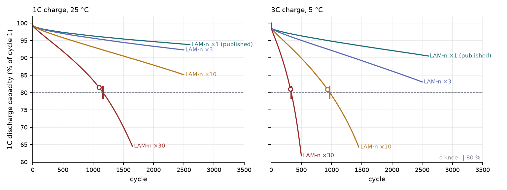

## Abstract

Most battery-life work, including my [companion study](/research/battery-protocol-select/), predicts a number:
how many cycles until the cell reaches 80 % of its capacity. This page asks the question underneath it. **Take
the physics of a real cell, charge it again and again under different protocols, and watch: how long does it
last, and where and why does it collapse?**

The model is PyBaMM's Doyle–Fuller–Newman (DFN) model with the coupled degradation mechanisms of O'Kane et al.
(2022): SEI growth, partially reversible lithium plating, particle cracking with SEI on the cracks,
stress-driven loss of active material (LAM) and a lumped thermal model. The parameters are the published
`OKane2022` set for the LG M50 21700 cell (NMC811 / graphite-SiOx, 5 Ah). Sixteen protocols were simulated:
charge rate 0.5, 1, 2 and 3C × ambient temperature 5, 15, 25 and 45 °C, each for 3,500–5,000 cycles, with a 1C
discharge every cycle.

- **The cell as published does not collapse.** No run reaches 80 % or shows a knee. At cycle 3,500, 86.4–92.8 %
  of the capacity is left, and the fade *slows down* over time (post/pre fade-rate ratio 0.46–0.70). Ambient
  temperature matters far more than charge rate. With natural-convection cooling, a fast charge heats the cell,
  and a warmer cell plates less.
- **The plating driving force grows anyway.** At 3C / 5 °C the lowest anode potential during charge falls from
  −71 mV vs Li/Li⁺ at cycle 1 to −383 mV at cycle 3,825. Most plated lithium strips back, though: only 0.089 Ah
  is lost for good.
- **A what-if cell shows where it breaks.** With one parameter changed, the graphite's stress-driven LAM constant
  × 30, twelve of the sixteen protocols collapse. End of life comes at 311–333 cycles at 5 °C, 609–649 at
  15 °C and 1,150–1,226 at 25 °C. At 45 °C it does not come within 2,500 cycles. The knee appears when LAM has
  shrunk the negative electrode from 5.83 Ah to 4.27–4.38 Ah, against 3.95–4.14 Ah being discharged: the
  electrode's spare capacity is gone.
- **A surrogate decision, checked.** Two Gaussian processes over (charge rate, temperature) pick the fastest
  rate that keeps life ≥ 400 cycles and peak temperature ≤ 60 °C. The simulator confirms the picks at 15 and
  25 °C (23.5 % and 10.5 % faster than the best grid point). At 45 °C it refutes them: the cell peaks at 60.7 °C.

The what-if cell is a parameter change, not a prediction for the LG M50, and it is labelled as such everywhere
on this page.

## 1 Why simulate, rather than predict

In circuits courses a battery is a voltage source behind a resistor. Inside the can it is a porous sandwich:
graphite particles on one side, metal-oxide particles on the other, an electrolyte in between. Charging means
pushing lithium ions out of the oxide and into the graphite. Each cycle, a little of that machinery is lost:
some lithium gets trapped in side reactions, and some particles crack or lose contact. As an electrical
engineer, my first battery question was not *how many cycles* but *which of these losses wins, and when it
starts to run away*.

Data-driven models, like the Gaussian process in my companion study, answer the first question well. They learn
the shape of the fade from cells that have already died, but they cannot say which mechanism shaped it.
A physics model can, because every term in it is a mechanism: you can switch it off, scale it, or plot it
against the measured capacity.

The event I wanted to see is the **knee**. A cell's capacity usually fades slowly and almost linearly for most of
its life. Then the curve bends sharply downward, often near or before the usual 80 % end-of-life line. Past the
knee, fade accelerates and the remaining life is short. Two explanations are common in the literature: lithium
plating takes off, or one electrode loses so much active material that it, rather than the lithium inventory,
limits the capacity. A simulation can test which one happens, and under which protocol.

## 2 The model

### 2.1 What is in the cell model

The **DFN model** treats each electrode as a stack of spherical particles in an electrolyte-filled pore space.
Lithium diffuses inside each particle, ions migrate and diffuse through the electrolyte, and the reaction at
each particle surface follows Butler–Volmer kinetics. It is the standard "pseudo-2D" model: one dimension
across the cell, plus one inside the particles. A **lumped thermal model** adds one cell temperature, heated by
the current and cooled by natural convection (10 W m⁻² K⁻¹, as in the parameter set). The reaction and
transport rates are temperature dependent (Arrhenius).

Five degradation mechanisms run on top of it, and they interact:

- **SEI growth (solvent-diffusion limited).** A film grows on the graphite surface and consumes lithium. Solvent
  must diffuse through the film to react, so the thicker it gets, the slower it grows. This is why
  SEI-dominated fade decelerates. The film also fills pore space.
- **Lithium plating (partially reversible).** If the graphite surface potential falls below 0 V vs Li/Li⁺, which
  happens when charging fast or cold, lithium deposits as metal instead of entering the graphite. Part of it
  strips back on discharge. The rest becomes "dead" lithium, cut off from the reaction, and that part is lost
  for good. Plated lithium also fills pore space.
- **Particle cracking.** Particles swell and shrink as lithium goes in and out. In the negative electrode the
  cyclic stress grows cracks; the positive electrode only swells.
- **SEI on cracks.** Fresh crack surface is bare graphite, so new SEI grows on it and consumes more lithium.
- **Stress-driven loss of active material (LAM).** The same cyclic stress disconnects active material in both
  electrodes. The electrode then simply holds less lithium than before.

The first four consume **lithium** in side reactions; LAM loses **electrode capacity**, and the lithium stored
in the disconnected material is lost with it. These are different inventories. The measured capacity drops when
either runs short, so they do not add up to the measured loss (Figure 4 shows them next to it). In the
published cell the gap is large: at the last simulated cycle the measured loss is 0.41–0.73 Ah, 1.1–2.3 times
the 0.26–0.42 Ah of lithium consumed by side reactions, although the negative electrode still has spare
capacity. The rest is lithium stranded in disconnected material, resistance growth that shortens the 1C
discharge, and the cycle-1 offset described under Limitations; the saved results do not separate these three.

### 2.2 Parameters

The parameter set is PyBaMM's `OKane2022`: the LG M50 21700 cell, NMC811 positive and graphite-SiOx negative,
5 Ah nominal. It builds on Chen et al. (2020, *J. Electrochem. Soc.* 167, 080534), with the degradation
constants of O'Kane et al. (2022, *Phys. Chem. Chem. Phys.* 24, 7909–7922). Those constants are fitted or
borrowed, not measured on this cell. Nothing in the model was re-implemented: options, parameters and solver
are PyBaMM 26.9.0.0 as installed, with the `IDAKLUSolver`, and the mesh of PyBaMM's own coupled-degradation
example (5 points per electrode and separator, 30 per particle).

### 2.3 What was simulated

- **One cycle:** 1C discharge to 2.5 V, rest 5 min, constant-current charge at the protocol rate to 4.2 V,
  constant-voltage at 4.2 V down to C/20 (at most 2 h), rest 5 min. "Capacity" is the measured 1C discharge
  capacity of every cycle.
- **Grid:** charge rate {0.5, 1, 2, 3}C × ambient temperature {5, 15, 25, 45} °C, sixteen runs, 16 worker
  processes on an AMD EPYC 7452 server (CPU only; numpy 2.4.6, casadi 3.8.1).
- **Stopping:** at 65 % of cycle-1 capacity, at 5,000 cycles, or after a 6,000 s wall-clock budget. Runs stopped
  by the cap or the budget are right-censored: their life is only a lower bound. No run failed numerically, but
  one run shows an unexplained step (§3.3).
- **End of life (EOL):** the first cycle at or below 80 % of cycle 1, interpolated.
- **Knee:** a two-line (hinge) least-squares fit to capacity vs cycle, the γ → 0 limit of the Bacon–Watts model
  used by Fermín-Cueto et al. (2020). A knee is declared only if the fade rate after the break is at least 1.5
  times the rate before it.

The published cell took 68,075 simulated cycles in 6,030 s of wall time; one DFN cycle costs 0.82–0.94 s. The
what-if grid took 22,225 cycles in 3,163 s. Two checks on the numerics:

- **Mesh:** a 3× finer mesh in x and 50 instead of 30 points per particle changes capacity by at most 0.03
  percentage points (published cell, 600 cycles) and 0.25 points (what-if cell, 500 cycles). EOL moves from
  332.5 to 333.5 and the knee from 319 to 320. The fine mesh costs 3–4 times as much per cycle.
- **Model choice:** the cheaper single-particle model with electrolyte (SPMe) was tried first. Its solver failed
  in the first constant-voltage hold at 2C and 3C, so everything here uses the DFN.

## 3 Results

The animation runs four protocols side by side up to cycle 1,800. On the left is the published cell at the
harshest protocol, 3C / 5 °C. On the right are three what-if cells: 0.5C / 25 °C, 1C / 5 °C and 3C / 5 °C.
Watch the capacity counters, the knee markers that appear as the curves bend, and the bars below: the loss of
active material in the negative electrode (green) dwarfs the lithium consumed by SEI and plating in every
collapsing run.

<figure class="vid">
  <video src="/projects/battery-degradation-sim/media/collapse.mp4" autoplay loop muted playsinline preload="metadata" poster="/projects/battery-degradation-sim/media/collapse.jpg">
    
  </video>
  <figcaption><b>Video 1</b> — Four simulated protocols, cycle counter to 1,800. Curves: 1C discharge capacity in % of cycle 1. Circle: knee; tick: 80 % end of life. Bars: A·h lost to SEI (incl. cracks), irreversible plating and graphite LAM. The published cell (left) is still at 87.3 % when its run ends at cycle 3,825; the what-if cells reach their knees at cycles 1,100, 312 and 319. <a href="/projects/battery-degradation-sim/media/collapse.gif">GIF version</a>.</figcaption>
</figure>

### 3.1 The cell as published does not collapse

No run reaches 80 % or shows a knee in 3,500–5,000 cycles (Figure 1, top). The fade is fastest in the first few
hundred cycles and then slows; part of the very first drop is a starting-state offset, not ageing (see
Limitations). The hinge fit finds a *smaller* slope after its break than before in every run
(ratio 0.46–0.70), as expected when diffusion-limited SEI growth dominates.

| | 0.5C | 1C | 2C | 3C |
|---|---|---|---|---|
| 5 °C | 86.4 % | 86.8 % | 87.9 % | 88.2 % |
| 15 °C | 90.8 % | 91.0 % | 91.4 % | 91.5 % |
| 25 °C | 92.4 % | 92.7 % | 92.8 % | 92.6 % |
| 45 °C | 91.9 % | 92.5 % | 92.5 % | 92.2 % |

*Capacity left at cycle 3,500, published cell (`grid.json: runs[*].q_frac_at_cycle.3500`).*

**Temperature dominates; charge rate barely matters.** At 25 °C the four charge rates sit within 0.4
percentage points of each other. Cold is clearly worse: by cycle 3,500 the cell has lost 11.8–13.6 % at 5 °C
against 7.2–7.6 % at 25 °C. At 5 °C the
*faster* charge fades slightly *less*. The reason is self-heating: with natural-convection cooling, the cell's
cycle-1 peak temperature is 61.1 °C at 3C / 5 °C and 82.5 °C at 3C / 45 °C, and a warmer cell plates less. That
is a property of this cooling assumption. Above about 60 °C the Arrhenius laws are also extrapolated beyond the
range the parameters were fitted on.

### 3.2 Where it collapses: the what-if cell

Since the published cell does not break within the simulated cycles, I ran the same model, grid and rules
again with **one** parameter changed: the negative electrode's stress-driven LAM constant
(`Negative electrode LAM constant proportional term`). It is a fitted rate, not a measured property of the
cell, and the question is how large it must be for a knee to appear (Figure 2).

| graphite LAM factor | 1C, 25 °C | 3C, 5 °C |
|---|---|---|
| × 1 (published) | 91.6 % left at 4,350, no knee | 87.3 % left at 3,825, no knee |
| × 3 | 92.3 % left at 2,500, no knee | 83.0 % left at 2,500, no knee |
| × 10 | 85.1 % left at 2,500, no knee | knee 932, EOL 969 |
| × 30 | knee 1,096, EOL 1,163 | knee 319, EOL 333 |

*`lam_sweep.json: runs[*]`. The ×3 and ×10 runs were resumed from a 600-cycle checkpoint, which reproduces an
uninterrupted run exactly.*

At × 30, twelve of the sixteen protocols collapse (Figure 3):

| ambient | EOL cycle at 0.5 / 1 / 2 / 3C | knee cycle at 0.5 / 1 / 2 / 3C |
|---|---|---|
| 5 °C | 311 / 313 / 320 / 333 | 314 / 312 / 310 / 319 |
| 15 °C | 609 / 613 / 628 / 649 | 580 / 593 / 585 / 589 |
| 25 °C | 1,150 / 1,163 / 1,190 / 1,226 | 1,100 / 1,096 / 1,097 / 1,109 |
| 45 °C | not reached by 2,500 (85.9–87.0 % left) | none by 2,500 |

*`grid_fragile.json: runs[*].eol_cycle, knee_cycle, q_final_frac`.*

- **Where: on the cold side.** Each step from 5 to 15 to 25 °C roughly doubles the life (EOL 311 → 609 → 1,150
  at 0.5C). At a fixed temperature, charge rate moves EOL by 7 % at most (1,150 against 1,226 at 25 °C), and
  again the faster charge lives slightly longer because it runs warmer.
- **Why there: the graphite runs out of spare capacity.** At cycle 1 the negative electrode can hold 5.83 Ah,
  against a 1C discharge of 4.96–5.05 Ah. That margin is what keeps the early fade gentle. At the knee, LAM has
  cut the electrode to 4.27–4.38 Ah against 3.95–4.14 Ah being discharged. Past that point, every further loss
  of graphite comes straight out of the measured capacity.
- In all twelve collapsing runs, the term whose rate rises most across the knee is LAM in the negative
  electrode. That is partly by construction, since LAM is what I scaled. What the model adds is *when* the loss
  turns into a collapse (once the margin is used up) and *how* temperature and self-heating move that point.

Figure 4 splits the loss into its inventories for a gentle and a harsh protocol. In the published cell, SEI on
cracks and irreversible plating carry the side-reaction lithium loss and LAM grows almost linearly. In the what-if cell,
graphite LAM reaches 1.54–1.63 Ah by end of life in the twelve collapsing runs, while the lithium consumed by
side reactions is only 0.13–0.19 Ah, and the measured loss bends upward once LAM has used up the margin.
(PyBaMM's total loss of lithium inventory, which also counts the lithium stranded in the disconnected graphite,
is 11.8–12.7 % at EOL.) At EOL the largest lithium-loss term is irreversible plating at
5 and 15 °C (and at 0.5–1C, 25 °C), and SEI on cracks at 2–3C, 25 °C.

### 3.3 The plating driving force

Plating needs the graphite surface below 0 V vs Li/Li⁺. Figure 5 tracks that potential at the separator
side of the negative electrode during each charge. At 0.5C / 25 °C it barely touches
zero. At 3C / 5 °C it dips to −71 mV in the first minutes of the first charge. By cycle 3,825 it reaches
−383 mV in the published cell, and in the what-if cell it falls to −308 mV by cycle 500.

The driving force deepens with cycling and with charge rate. At the first charge it is also deeper the colder
the cell: at 3C it reaches −71, −36 and −21 mV at 5, 15 and 25 °C, and about 0 mV at 45 °C. Yet the published cell at 3C / 5 °C has lost only 0.089 Ah of lithium to plating at the end: most of what
plates strips back on discharge. In this parameter set the cell drifts toward a plating-driven failure, but it
has not reached one within the simulated cycles.

One feature of that run is unexplained. Between cycles 3,432 and 3,433 the published 3C / 5 °C cell gains
3.2 mAh of capacity in a single cycle, against a loss of about 0.13 mAh per cycle before and after. Between the
saved cycles 3,426 and 3,450 its peak temperature jumps from 66.1 to 76.6 °C, and its charge shortens from 55.2
to 49.7 min. After that the anode potential deepens much more slowly, which is the bend in Figure 5 (top right)
and the small step in Figure 4 (top right). The solver reported no failure, and I have not traced the cause. It
is the only such step among the 32 runs, so the end-of-run values of this one run (−383 mV, 87.3 %) should be
read with that in mind.

### 3.4 Explore every run

The explorer below holds all 32 runs, both cells × 16 protocols. Pick a cell, a charge rate and an ambient
temperature. It states how long that cell lasts and where it collapses, or that it does not. Then drag the
cycle slider, or press Play, to watch the run unfold. The capacity curve draws in and the knee and EOL
markers appear as you pass them. The loss bars grow with the cycle count. The anode-potential panel compares
the first charge with the latest saved charge before the slider. Every value is a simulation output, copied
from the project's result files; nothing is interpolated between protocols.

<figure class="vid">
  <iframe src="/projects/battery-degradation-sim/explorer.html" title="Cell explorer: capacity, loss breakdown and anode potential for each simulated protocol" loading="lazy" style="display:block;width:100%;height:clamp(1170px, max(calc(1990px - 104.4vw), calc(3158px - 430vw)), 1800px);border:1px solid var(--rule);border-radius:10px;background:#fff"></iframe>
  <figcaption><b>Explorer</b> — 2 cells × 4 charge rates × 4 ambient temperatures. Keyboard: Tab to a control, arrow keys within a group and on the slider. <a href="/projects/battery-degradation-sim/explorer.html" target="_blank" rel="noopener">Open the explorer on its own page ↗</a></figcaption>
</figure>

## 4 From the physics back to a decision

The [companion study](/research/battery-protocol-select/) works from the other end. It uses 124 measured LFP
cells, a Gaussian process that predicts cycle life from the first 100 cycles, and the question of which
charging protocols are still worth testing. There the expensive evaluation is a months-long cycling test. Here
it is a simulator that costs 0.82–0.94 s per cycle, and a 16-run grid takes 6,030 s of wall time. In both, a model
that reports its own uncertainty stands in for the expensive evaluation, and a decision is made through it.

To close that loop here, I fitted two Gaussian processes over (charge rate, ambient temperature) to the what-if
grid. One predicts log life, measured as cycles to 87 % capacity, the lowest round level every run reached, so
nothing is censored. The other predicts the cycle-1 peak cell temperature. At each temperature the decision is
the fastest charge rate in [0.5, 3]C with P(life ≥ 400 cycles) ≥ 0.9 and P(peak ≤ 60 °C) ≥ 0.9. The 60 °C limit
is illustrative, not a datasheet value. In leave-one-out tests the life GP has a median absolute error of 0.39 %
and covers 14 of 16 held-out runs with its 90 % interval. The temperature GP has an RMSE of 0.10 °C. I then
**ran the chosen rates as new DFN simulations**:

| ambient | GP choice | best grid rate | simulated life (GP 90 % interval) | simulated peak | outcome |
|---|---|---|---|---|---|
| 5 °C | none | none | every rate 207–231 cycles < 400 | | no admissible rate |
| 15 °C | 2.47C | 2C | 449 (444–454) | 57.1 °C | both constraints met; 23.5 % faster |
| 25 °C | 2.21C | 2C | 846 (841–860) | 58.5 °C | both met; 10.5 % faster |
| 45 °C | 1.5C | 1C | 2,427 (2,388–2,445) | **60.7 °C** | **temperature limit violated** |

*`surrogate_verify.json: checks[*]`, `surrogate.json: decisions`.*

All three simulated lives fell inside their predicted intervals. The temperature GP did worse. Its 90 % interval
missed the simulated peak at all three temperatures, even though its leave-one-out error on the grid is
0.10 °C. At 15 and 25 °C the cell ran cooler than the interval (57.1 °C against 58.0–60.1 °C, and 58.5 °C
against 59.0–60.0 °C), which is harmless. At 45 °C it ran hotter: the GP put the 1.5C peak at 59.4 °C
(58.8–60.0 °C), and the simulation reached 60.7 °C. The peak
temperature is the larger of a discharge peak, which is flat in charge rate below about 1C, and a charge peak
that rises with rate. A smooth GP fitted to four points per row cannot represent that kink. I would not read
much into the gains either: life barely depends on charge rate here, so the binding constraint is temperature,
and the decision is close to degenerate. The useful part is the loop itself. The surrogate proposes, the
simulator checks, and the check shows that the temperature GP's intervals are too narrow away from the grid
points, including the one place where that broke the constraint.

## 5 Limitations and next steps

**Limitations**
- **The collapse comes from a what-if.** As published, the `OKane2022` LG M50 cell fades slowly and
  decelerates over 3,500–5,000 cycles. Every knee on this page belongs to the cell with graphite LAM × 30, and
  that LAM drives the knee is partly built in by that choice. PyBaMM's own example of this model shortens the
  paper's 1,000-cycle protocol to 10 cycles, and I found no published simulation of these protocols run to
  collapse to compare against.
- **One parameter set, no uncertainty in it.** The degradation constants (SEI solvent diffusivity, plating
  rate, dead-lithium decay, LAM constant, cracking rate) are fitted or borrowed, and their uncertainty is not
  propagated. There is no cell-to-cell variation.
- **Model assumptions.** Pseudo-2D, one particle size per electrode, no separate SiOx and graphite mechanics.
  The thermal model has one temperature, natural convection and no forced cooling. Self-heating is why faster
  charging is not worse here, and peaks above about 60 °C extrapolate the Arrhenius laws.
- **Capacity is the 1C discharge capacity**, which also contains resistance growth; there are no slow
  reference-performance tests, and no calendar ageing beyond the two 5-minute rests per cycle.
- **Cycle 1 is a different starting state.** It starts from PyBaMM's equilibrium full charge, while every
  later cycle starts from a CC-CV charge that stops at C/20. Cycle 2 is already 0.2–2.0 % below cycle 1 (most
  at 5 °C), against about 0.02–0.06 % per cycle afterwards, so most of that first drop is the change of
  starting state rather than ageing. Every percentage and the 80 % line
  on this page are relative to cycle 1. Measured from cycle 2, the what-if EOLs would come 14–25 cycles later;
  the order of the temperatures does not change.
- **The knee threshold was changed after seeing data**, from 2.0 to 1.5 times the pre-break rate. Collapsing
  runs sit at 1.79–2.03 and every other run below 1, so no run is near either threshold.
- **Coarse grid, censored runs.** Sixteen protocols; for the published cell, EOL and knee are only lower bounds.
- **Not validated** against measured ageing data, and the companion study uses another chemistry (LFP), so the
  two cannot be compared number for number.

**Next steps**
- **Carry the parameter uncertainty.** Sample the degradation constants from plausible ranges, run the same
  protocols, and report the *distribution* of knee cycles rather than one curve. That turns the simulator into
  the kind of model my other work uses: one that carries the problem's own uncertainty, through which a
  charging decision can be made and checked.
- **Plating-aware charging.** Compare multi-stage and anode-potential-limited charging protocols in the same
  simulator, using the −mV margin in Figure 5 as the controlled quantity.
- **Fix the surrogate's weak spot.** Model the charge and discharge temperature peaks separately, and sample
  densely near the constraint boundary.
- **Better cooling and validation.** Add forced cooling, then check the published-cell fade against measured
  LG M50 ageing data before trusting any what-if.
