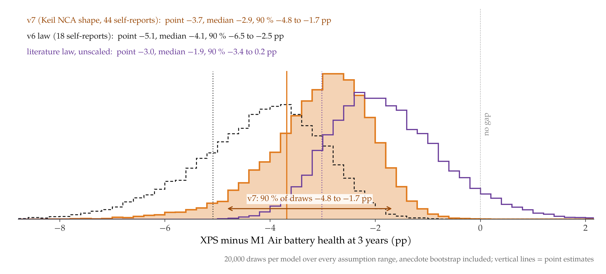
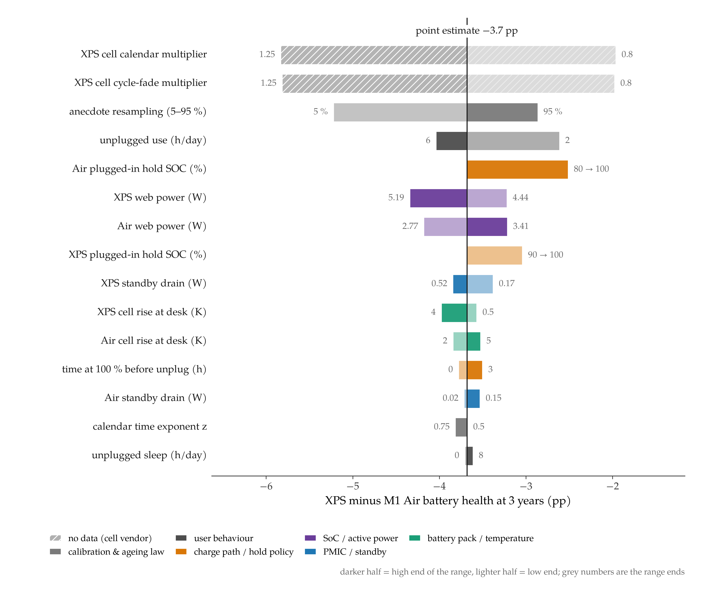

## In short

<figure class="vid">
  <video src="/projects/battery-os-efficiency/media/os_battery.mp4" autoplay loop muted playsinline preload="metadata" poster="/projects/battery-os-efficiency/media/os_battery.jpg"></video>
  <figcaption>One modelled day (left: M1 Air-like, right: XPS 13-like), then battery health over five years; ochre, the gap between them (drawn from the earlier v6 curves). Chip activity is illustrative.</figcaption>
</figure>

**Where it started.** I have used iPhones for years, and battery optimisation was widely rumoured to be one of the core
technologies of Apple's car project. As an electrical-engineering student using a MacBook, I also noticed that its
battery held up unusually well. So I wanted to know two things: how strong the effect of OS-level optimisation really
is, and how tightly Apple's system design couples the OS with the hardware.

**What I noticed first.** I started from a published physics model of a commercial cell (PyBaMM's DFN with O'Kane et
al.'s coupled degradation, LG M50 parameters) and ran one year of laptop use from public specs. The answer was almost
nothing: optimized charging changed capacity after a year by −0.033 pp, the power profile by −0.008 pp. Two reasons. In
this model, SEI growth (the slow loss of lithium that dominates the fade) hardly depends on state of charge, so holding
at 80 % instead of 100 % has little to act on. And the vendors' own battery-life claims imply almost the same power on
battery: 3.29 W for the current (M5) MacBook Air against 3.50 W for a 2025 ThinkPad X1 Carbon.

**What that made me curious about.** If the published model cannot see the effect, which mechanisms could create a gap
at all? I listed four that an OS and its hardware can move: active power (how much charge is cycled per day), standby
drain while asleep, how long the battery is held full on the charger, and cell temperature. To give the charge-hold and
temperature mechanisms something to act on, I switched the SEI model to a reaction-limited form and validated it as a
table: the ageing rate rises 3.8–4.1× from 30 % to 100 % state of charge and 1.32–1.41× per 10 °C.

**A first field calibration.** Long multi-month DFN runs with that model failed in the solver, so I moved to a hybrid
law that takes its calendar term from the validated table and its cycling term from earlier PyBaMM runs. Its absolute
scale was too gentle, so I calibrated two global factors to 18 self-reported M1 Air battery-health values from one
Reddit thread and fed it with Notebookcheck measurements for the M1 Air and the Dell XPS 13 9310. This version (v6)
projected 88.5 % against 83.4 % health after 3 years, a −5.1 pp gap.

**What a second look changed.** I then checked that calendar term against published storage experiments (Keil et al.
2016, Keil & Jossen 2017, Zülke et al. 2021, Schmalstieg et al. 2014). At the same state of charge, temperature and
duration, v6 lost only about a quarter as much capacity as the published values: it understated calendar ageing 2–4×,
most at 40–50 °C, and the small 18-point calibration had hidden that. I replaced the calendar term with the shape of a
Keil-2016 NCA fit and refitted it to 44 M1 Air self-reports pooled from several threads; their calendar magnitude lands
at 0.86× the literature law. Two facts also firmed up the inputs. The pack label in iFixit's photo gives a charge limit
of 13.05 V for three cells in series, i.e. 4.35 V per cell, higher than the 4.1–4.2 V cells behind the literature. And
an archived Apple support page says: "On Mac computers with the Apple M1 chip or the T2 security chip, Optimized
Battery Charging is on by default when you set up your Mac or after updating to macOS Big Sur"
([Apple HT212049, Wayback 2021-06-27](https://web.archive.org/web/20210627181138/https://support.apple.com/en-us/HT212049)).
The live page no longer carries that sentence.

**Where it stands now (v7).** With the same user day, the refit projects 86.6 % health after 3 years for the Air-like
case and 82.9 % for the XPS-like case, a −3.7 pp gap. Active power is still the largest part (−2.2 pp: the XPS draws
4.75 W instead of 3.1 W for the same web use, 0.49 instead of 0.32 cycles a day), but the literature-shaped calendar
term moves weight to the 100 % hold (−1.25 pp); standby drain adds −0.5 pp and temperature +0.2 pp. Over every
assumption range, the Monte Carlo median gap is −2.9 pp, with 90 % of draws between −4.8 and −1.7 pp. The sign is
robust; the size is dominated by how the unknown XPS cell ages. The calibration still rests on unverified anecdotes, so
these are projections of operating conditions, not measurements.

**Where it leads.** Within this model, the OS matters mostly through the power the whole platform draws for a task, and
second through keeping the battery below full on the charger; the charging feature that is usually credited counts,
but less. The next steps are the data the model lacks: health data for the XPS 13 9310 and its cell (none found), a
storage dataset for 4.35 V laptop cells, measured cell temperatures instead of skin temperatures, and a test that
changes only the operating system on the same hardware.

## 1 Background

### 1.1 What Apple says the M1 changed

The M1 (November 2020) put the CPU, GPU and memory into one package. In Apple's words, unified memory "brings together
high-bandwidth, low-latency memory into a single pool within a custom package", so that the SoC's parts can "access the
same data without copying it" ([Apple Newsroom](https://www.apple.com/newsroom/2020/11/apple-unleashes-m1/)). Of the
eight CPU cores, "the four high-efficiency cores deliver outstanding performance at a tenth of the power" (same
release). These are manufacturer claims, not measurements made here.

### 1.2 Where the OS comes in

The hardware only pays off if the OS places work on the right cores and lets them sleep:

- **Quality of service.** "On Apple silicon, a task's QoS class influences whether the system runs that task. For
  example, the system is more likely to run background tasks on lower performance cores to maximize battery life"
  ([Apple developer docs](https://developer.apple.com/documentation/apple-silicon/tuning-your-code-s-performance-for-apple-silicon)).
  Notebookcheck observed the same on the Air: "only the Icestorm cores run under low loads"
  ([review](https://www.notebookcheck.net/Apple-MacBook-Air-2020-M1-Entry-Review-Apple-M1-CPU-humbles-Intel-and-AMD.508057.0.html)).
- **App Nap.** It "conserves battery life by regulating the app's CPU usage and by reducing the frequency with which its
  timers are fired" ([Apple energy guide](https://developer.apple.com/library/archive/documentation/Performance/Conceptual/power_efficiency_guidelines_osx/AppNap.html)).
- **Optimized Battery Charging.** macOS learns the charging routine "so that it can delay charging past 80% in certain
  situations" ([Apple Support](https://support.apple.com/en-us/102338)). Archived copies of the page from 2021 to March
  2026 add that "on Mac computers with the Apple M1 chip or the T2 security chip, Optimized Battery Charging is on by
  default" ([Wayback](https://web.archive.org/web/20210627181138/https://support.apple.com/en-us/HT212049)); the April
  2026 revision dropped the sentence. So the feature is on by default for the era modelled here, but whether it
  actually holds at 80 % on a given day is still an assumption, and the uncertainty analysis lets the Air hold anywhere
  from 80 % to 100 %.

On the Windows side, the defaults that matter here are documented too. Under Modern Standby "the system is still in S0
(a fully running state, ready and able to do work)" ([Microsoft](https://learn.microsoft.com/en-us/windows-hardware/design/device-experiences/modern-standby-vs-s3)).
The XPS 13 9310's BIOS default for battery charging is "Adaptive" ([Dell service manual](https://dl.dell.com/topicspdf/xps-13-9310-laptop_service-manual_en-us.pdf)),
and Lenovo's default "starts charging when the battery drops below 96%, and stops at 100%"
([Lenovo](https://support.lenovo.com/us/en/solutions/ht078208)).

## 2 Hardware: where the battery-relevant parts sit

To see which parts of the machine act on the battery, I annotated iFixit's teardown photos of the M1 MacBook Air
(A2337). Every chip identity comes from iFixit's
[teardown article](https://www.ifixit.com/News/46884/m1-macbook-teardowns-something-old-something-new); the boxes,
the grouping into roles and the link from each role to battery ageing are my own analysis, not iFixit's: I placed
each box from chip markings legible in the full-resolution photos and assigned the role from the part's documented
function. Four roles are marked: the SoC (active and
idle power), the PMICs (sleep and standby drain), the charger and USB-C power path (charge voltage, current and
optimized charging), and the battery pack with its distance to the SoC (cell temperature).

The same roles carry the model's result. Each badge below is how much 3-year health the XPS-like case loses or gains
when only that part's measured behaviour is switched from the Air value to the XPS value (Section 5.3).

The Air has no fan: "Apple nixed the fan in favor of a simple aluminum heat spreader hanging off the left edge of the
logic board" (iFixit). The pack sits in three sections below the board, and the closest cell edge is roughly 2 cm
(21.0 mm, scaled from the 30.4 cm case width) from the SoC centre. The label on the pack reads "11.39Vdc 49.9Wh
4380mAh, 3ICP4/63/120" and gives a charge limit voltage of 13.05 V; for three cells in series that is 4.35 V per cell
(my derivation), a higher top voltage than the 4.1–4.2 V cylindrical cells behind the published ageing laws in Section 5.4.

Photos: [iFixit](https://www.ifixit.com/News/46884/m1-macbook-teardowns-something-old-something-new), licensed
[CC BY-NC-SA 3.0](https://creativecommons.org/licenses/by-nc-sa/3.0/). The annotations are my interpretation and are not endorsed by iFixit.

## 3 Measured inputs

The two machines are compared on independent measurements, not vendor claims. Both rows come from Notebookcheck's
reviews of the [M1 Air](https://www.notebookcheck.net/Apple-MacBook-Air-2020-M1-Entry-Review-Apple-M1-CPU-humbles-Intel-and-AMD.508057.0.html)
and the [XPS 13 9310 (i7-1165G7)](https://www.notebookcheck.net/Dell-XPS-13-9310-Core-i7-Laptop-Review-The-11th-Gen-Tiger-Lake-Difference.499291.0.html);
power values are measured at the wall unless marked as on battery.

| quantity | MacBook Air M1 (2020) | Dell XPS 13 9310 |
|---|---|---|
| battery | 49.9 Wh | 52 Wh ([Dell](https://dl.dell.com/topicspdf/xps-13-9310-laptop_setup-guide_en-us.pdf)) |
| off / standby (wall) | 0.03 / 0.04 W | 0.31 / 0.48 W |
| idle min / avg / max (wall) | 1.9 / 6.4 / 7 W | 3.9 / 5.9 / 6.3 W |
| Wi-Fi web-surfing runtime | 16 h 00 min | 10 h 57 min |
| web power on battery (pack Wh ÷ runtime) | 3.12 W | 4.75 W |
| load avg / max (wall) | 25 / 30.3 W | 39.7 / 47.5 W |
| top surface under load, max / avg | 44 / 36.4 °C | 46.2 / 36.5 °C |
| top surface at idle, avg (room) | 25.8 °C (22 °C) | 20.7 °C (22.6 °C) |
| empty to full | 2 h 40 min (30 W adapter) | "just over 2 hours" (45 W) |

The XPS idle surface average is below the stated room temperature; I treat it as a measurement artefact. The
standby band from Microsoft's SleepStudy thresholds, 1 %/h and 0.333 %/h of a 52 Wh pack, is 0.52 / 0.17 W
([Microsoft](https://learn.microsoft.com/en-us/windows-hardware/design/device-experiences/modern-standby-sleepstudy)).
Microsoft's hardware-certification target of "less than 5% of system battery capacity over an 16 hour idle period" gives
0.16 W for the same pack (my derivation). No lab-controlled sleep-drain measurement in %/h was found for either laptop.

Put together for the modelled day, the XPS needs 28.8 Wh from the wall against 17.9 Wh for the Air, and cycles its
pack 0.49 times a day against 0.32.

## 4 Model

### 4.1 Calendar term: from a PyBaMM table (v6) to a literature shape (v7)

The first calendar term came from PyBaMM's reaction-limited SEI (Tafel-type in the SEI overpotential, Arrhenius in
temperature), calibrated so that a year-long float at 4.2 V and 25 °C loses the same 54.3 mA·h of lithium as the
published model. 20-day floats give the lithium-to-SEI rate $r(\mathrm{SOC}, T)$ in mA·h/day:

| SOC | 25 °C | 35 °C | 45 °C |
|---|---|---|---|
| 30 % | 0.039 | 0.055 | 0.076 |
| 60 % | 0.067 | 0.093 | 0.127 |
| 90 % | 0.140 | 0.189 | 0.251 |
| 100 % | 0.162 | 0.218 | 0.288 |

In v6 this gives the calendar rate $A_{\mathrm{v6}} = \beta \cdot 100 \cdot 365\, r / 5000\ \mathrm{mA\,h}$ with
$\beta = 1.147$ capacity loss per unit of lithium lost and a time exponent $z = 0.577$ fitted to the published model's
own float. Its temperature sensitivity is only 1.32–1.41× per 10 °C, and Section 5.4 shows that its magnitude sits well
below published storage data. The current model (v7) therefore takes its shape from NREL BLAST-Lite's fit to the Keil
et al. 2016 NCA storage data (25 / 40 / 50 °C, 0–100 % SOC), with $T$ in kelvin, SOC as a fraction and $t$ in days:

$$
q_{\mathrm{loss}} = 75.4\, e^{-3340/T}\, e^{353\,\mathrm{SOC}/T}\, t^{0.512}. \tag{1}
$$

### 4.2 Hybrid ageing law

A day is a list of segments $j$ with duration $h_j$, state of charge $\mathrm{SOC}_j$ and cell temperature $T_j$. The
day's mean calendar rate $\bar A$, in percent capacity per year$^z$, averages the calendar law over the segments
(Eq. 1 at $t$ = 365 days in v7; the interpolated table in v6):

$$
\bar A = \sum_j \frac{h_j}{24}\, A(\mathrm{SOC}_j, T_j). \tag{2}
$$

Capacity loss in percent after $t$ years is a calendar term plus a cycling term,

$$
\Delta C(t) = s_{\mathrm{cal}}\,\bar A\, t^{z} + s_{\mathrm{cyc}}\, c_{\mathrm{cyc}}\, \mathrm{EFC}(t), \tag{3}
$$

with $z = 0.512$ in v7 and $c_{\mathrm{cyc}} = 0.0068$ % per equivalent full cycle (from a 0.5C PyBaMM cycling run,
calendar part removed). The cycles per day follow from the measured powers,

$$
\mathrm{EFC}/\mathrm{day} = \frac{P_{\mathrm{web}}\, h_{\mathrm{use}} + P_{\mathrm{sb}} \cdot 4\ \mathrm{h}}{E_{\mathrm{pack}}}. \tag{4}
$$

### 4.3 Calibration and the day

$s_{\mathrm{cal}}$ and $s_{\mathrm{cyc}}$ are fitted by least squares to M1 Air self-reports (macOS "Maximum Capacity",
age and cycle count), with reports below 50 % treated as cell faults. v6 used 18 reports from one
[Reddit thread](https://www.reddit.com/r/macbookair/comments/1fc0qqg/) and found $s_{\mathrm{cal}} = 1.96$,
$s_{\mathrm{cyc}} = 3.48$, RMSE 3.2 pp. v7 pools 44 reports that give a cycle count (that thread plus others) and
finds $s_{\mathrm{cal}} = 0.86$, $s_{\mathrm{cyc}} = 2.33$, RMSE 6.5 pp; the larger pool is noisier, but its
calendar magnitude agrees with the literature law within 14 %. The 5 h/day usage mix used below gives 0.32 EFC/day,
the reports' median.

The assumed day (ambient 22 °C): 1 h at 100 % before unplugging, 5 h of unplugged web use, 4 h of unplugged sleep, then
8 h of desk use and the rest asleep, plugged in at the hold level. The Air holds 80 % (Optimized Battery Charging, on by
default per Apple's archived statement), uses 3.1 W and drains 0.04 W asleep; the XPS holds 100 %, uses 4.75 W and
drains 0.40 W. On that day the Air falls from 100 % to 68.9 % during use and 68.6 % after sleep; the XPS to 54.3 % and
51.3 %. Cell temperatures are estimated from skin temperatures: Air 22 / 25.5 / 25 °C asleep / at the desk / on the
web, XPS 22 / 23.5 / 24.5 °C (its fans keep it slightly cooler).

## 5 Results

### 5.1 First pass: the published model sees almost nothing

One year of laptop use from vendor specs on the published cell: about 4.4 % is lost in every case, almost all of it
SEI growth, which is the same in all four runs (168.1 mA·h per cell). Optimized charging only reduces lithium lost to
plating, by 1.8 mA·h per cell. This is a property of the model, whose SEI growth barely depends on state of charge, not
evidence that holding at 80 % does nothing.

### 5.2 Field-calibrated model: health over the years

| | 1 y | 2 y | 3 y | 4 y | 5 y |
|---|---|---|---|---|---|
| Air-like (80 % hold) | 93.7 % | 89.9 % | 86.6 % | 83.5 % | 80.6 % |
| XPS-like (100 % hold) | 92.3 % | 87.4 % | 82.9 % | 78.7 % | 74.7 % |
| gap | −1.4 pp | −2.6 pp | −3.7 pp | −4.8 pp | −5.9 pp |

The XPS-like case crosses 80 % after about 3.7 years; the Air-like case is still just above it at 5 years. Over the
Monte Carlo draws of Section 5.5, 3-year health spans 85.0–89.9 % for the Air and 81.2–87.4 % for the XPS (5–95 %).
A 90 % cap on the XPS narrows the 3-year gap to −3.1 pp. Against v6, both machines now age faster in absolute terms
(the Air 86.6 % instead of 88.5 % at 3 years), and the gap between them is smaller.

### 5.3 Where the gap comes from

Switching one factor at a time from Air-like to XPS-like at 3 years (Figure 3 shows the same numbers on the board):

| factor | v7 effect at 3 y | v6 (earlier step) |
|---|---|---|
| active power (SoC, 4.75 vs 3.1 W, so more cycles per day) | −2.23 pp | −3.57 pp |
| charge management (100 % vs 80 % hold) | −1.25 pp | −0.91 pp |
| standby drain (0.40 vs 0.04 W) | −0.49 pp | −0.74 pp |
| temperature (XPS slightly cooler in the mapping) | +0.22 pp | +0.08 pp |
| interactions | +0.06 pp | +0.05 pp |
| gap | −3.68 pp | −5.09 pp |

The v7 gap is −2.5 / −3.7 / −4.8 pp at 2 / 3 / 4 years. The literature-shaped calendar term ages a full battery
faster relative to cycling, so weight moves from active power to the 100 % hold; active power stays the largest single
factor.

How much the gap depends on the user: in v7 it runs from −2.6 pp at 2 h/day of unplugged use to −4.0 pp at 6 h/day,
and from −3.4 to −3.8 pp over the XPS standby band of 0.17–0.52 W. The map below shows the same dependence for the
earlier v6 law, which was steeper.

### 5.4 Literature check and refit (v7)

The v6 calendar term was calibrated only to 18 laptops, so I compared it with published storage experiments on
commercial NCA and NMC cells. The per-SOC values in Keil et al. 2016 appear only in figures, so the comparison uses the
values stated in the text (Keil & Jossen 2017: "capacity fade of ca. 2–5% at 25 °C and 5–11% at 50 °C" over 9.5
months; Zülke et al. 2021: about 94 / 92 / 90 % capacity after 12 months at 25 / 40 / 50 °C and 70–80 % SOC) and two
literature laws whose constants are published in NREL BLAST-Lite.

| 1-year storage loss | 25 °C, 50 % | 25 °C, 100 % | 40 °C, 80 % | 50 °C, 80 % |
|---|---|---|---|---|
| v6 law, anecdote-scaled | 0.9 % | 2.7 % | 2.8 % | 3.8 % |
| Keil-2016 NCA fit | 3.8 % | 6.9 % | 8.9 % | 12.0 % |
| Schmalstieg 2014 NMC | 2.7 % | 4.6 % | 12.0 % | 23.9 % |
| published (text values) | Keil & Jossen: 2–5 % | — | Zülke: 8 % | Zülke: 10 % |

Over the seven text-stated storage points, model divided by published (geometric mean) is 0.26× for v6, 0.89× for the
Keil fit and 0.99× for Schmalstieg. The v6 calendar term was 2–4× too gentle, most at 40–50 °C, where its PyBaMM
temperature sensitivity of 1.3–1.4× per 10 °C is far below the roughly 2× of the literature laws.

The refit then keeps the shape of the Keil fit and lets the field data set its magnitude. On the 44 pooled M1 Air
reports the fitted calendar scale is 0.86, so the laptops agree with the literature within 14 %; the v6 law refitted to
the same pool would need 2.4× its v6 scale, consistent with the 0.26× above. On the original 18 reports alone, the
literature magnitude fits worse (RMSE 4.5 against 3.2 pp): the small thread was the outlier, not the literature.
Out of sample, on 27 new M1 Air reports from other threads, v6 was mildly optimistic (median residual −1.6 pp, RMSE
8.5 pp) and the unscaled Keil law was not (+0.1 pp, 7.6 pp). On the Intel side, 11 U-series ultrabook reports sit a
median 2.8 pp below the v7 XPS prediction at the same age (5.2 pp below v6). That is a weak check in the same
direction: the points are few, some look like faulty cells, and none is an XPS 13 9310 with both age and health.

### 5.5 How sure is the gap

Each assumption gets a range (web power from other tests and vendor claims, standby from Microsoft's thresholds, the
Air's hold between 80 % and 100 %, the XPS hold between 90 % and 100 %, cell temperature rise, hours of use and sleep,
the calendar exponent), and the anecdotes are bootstrapped, with the model refitted in each of 20,000 draws.

| model | Air 3 y | XPS 3 y | gap | MC median [90 %] | P(gap < −2 pp) |
|---|---|---|---|---|---|
| **v7** (Keil shape, 44 reports) | **86.6 %** | **82.9 %** | **−3.7 pp** | **−2.9 [−4.8, −1.7]** | **0.88** |
| v6 law (18 reports) | 88.5 % | 83.4 % | −5.1 pp | −4.1 [−6.5, −2.5] | 0.99 |
| v6 law, refitted to the 44 reports | 86.7 % | 82.3 % | −4.4 pp | −3.0 [−4.9, −1.5] | 0.85 |
| Keil NCA law, unscaled | 86.7 % | 83.7 % | −3.0 pp | −1.9 [−3.4, +0.2] | 0.46 |
| Schmalstieg NMC law, unscaled | 87.3 % | 84.8 % | −2.5 pp | −1.6 [−3.4, +0.7] | 0.37 |

The median is smaller than the point estimate because the hold ranges are one-sided: the Air can only move up from
80 % and the XPS only down from 100 %. In every calibrated variant the XPS-like case ages faster in practically all
draws; only the unscaled literature laws, which ignore the laptop data, leave 6–11 % of draws at no gap or a reversed one.

The largest swings come from what has no data at all. The XPS uses a different cell, so I let its calendar and
cycle-fade rates vary by 0.8–1.25×; each multiplier alone moves the gap from −2.0 to −5.8 pp, and with both in the
Monte Carlo the 90 % interval widens to [−6.4, −0.4] pp. Anecdote resampling (−5.2 to −2.9 pp), hours unplugged (−4.0
to −2.6 pp) and whether the Air really holds at 80 % (−3.7 to −2.5 pp) follow. Temperature, room temperature, the
calendar exponent and sleep hours each move the gap by less than 0.4 pp.

## 6 Limitations

- **The calibration rests on anecdotes.** 44 self-reported, unverified, self-selected M1 Air values from Reddit, plus
  33 Intel reports used only as a check; ages are ownership times. The fit error (6.5 pp) is larger than any single
  effect, and the 18-report v6 calibration showed how much a small pool can mislead.
- **Unknown XPS cell.** No health data for the XPS 13 9310 and nothing about its cell vendor or chemistry; the 0.8–1.25×
  cell multipliers are assumptions, and they dominate the uncertainty in the gap's size.
- **Borrowed ageing laws.** The calendar shape comes from 4.1–4.2 V 18650 NCA cells, while the Air pack charges to
  4.35 V per cell; no storage data for such laptop cells was found. Published values are text statements, and no figure
  was digitised. The cycling term is still the PyBaMM LG M50 one, scaled to the field data, and does not depend on
  temperature or rate.
- **Skin temperature as a proxy.** Cell temperatures are estimated from Notebookcheck's surface measurements, not
  measured inside the pack. This is why temperature contributes little here; a hotter real cell would change that.
- **A consequence model, not an OS test.** The model translates measured power, standby drain, charging policy and
  temperature into ageing. It does not test macOS or Windows: different hardware runs each, and whether the Air holds
  at 80 % on a given day is not observed. The question of how much is the OS and how much the silicon stays open.

## 7 Earlier steps

**A degradation twin behind a charging decision (v1).** The same project began with a learned generative model
predicting how a PyBaMM cell fades under a planned charging schedule, used by a rule that picks the charge rate for each
50-cycle block. On 6 held-out cells both twins were over-confident once they saw a history (90 % intervals covered 0.69
and 0.64), and the diffusion-twin rule charged 6.1 min per cycle faster than fixed 1C while one more cell missed the
life target. The physics comes from my [degradation simulation](/research/battery-degradation-sim/).

**What each ingredient buys (v2).** With 40 training and 20 held-out cells, early-cycle BMS features halved the
forecast error, a physics prior did not help as built (coverage 0.58), and a calibration step restored coverage to 0.93.
In closed loop every diffusion-twin rule met the target on the same 17 of 20 cells as fixed 1C while charging about
9 min faster per cycle; the task was too easy to separate the forecasters. The decision side links to my
[protocol-selection study](/research/battery-protocol-select/).

**OS-style optimized charging on a virtual cell (v3).** This is where the present question started. On the published
LG M50 cell, capped charging aged less per cycle (+0.36 pp retention for a 70 % cap after 300 cycles at 1C), but per
kWh actually delivered the benefit reversed: full charging had the lowest fade, 0.444 %/kWh against 0.550 %/kWh for
the 70 % cap. Most of the fade was time-driven SEI growth that accrues whatever the cap, which led to the SOC-sensitive
model above.

