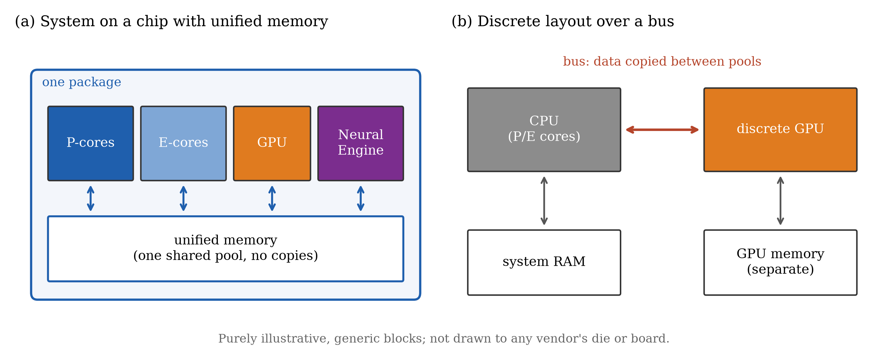
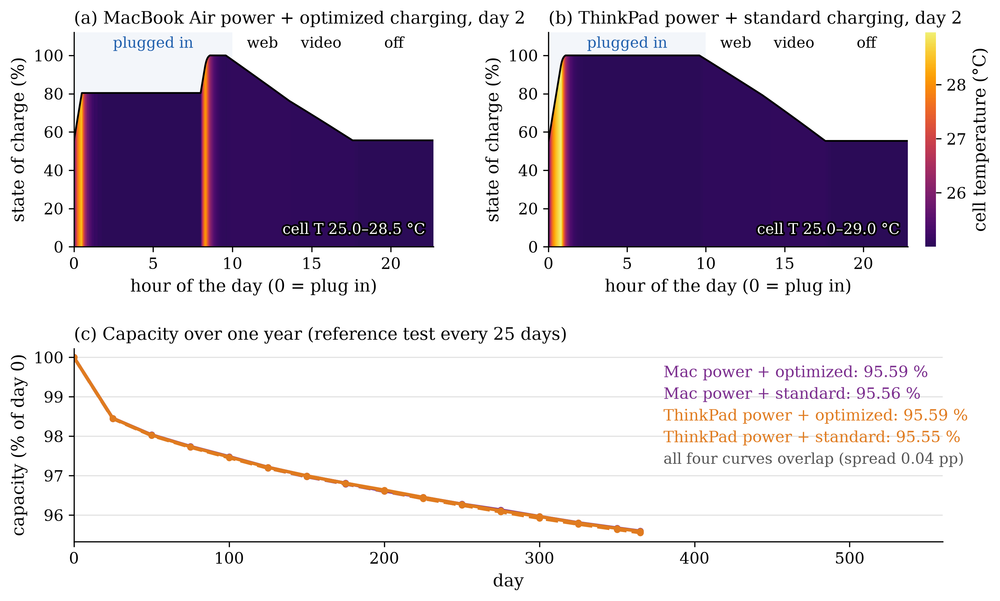
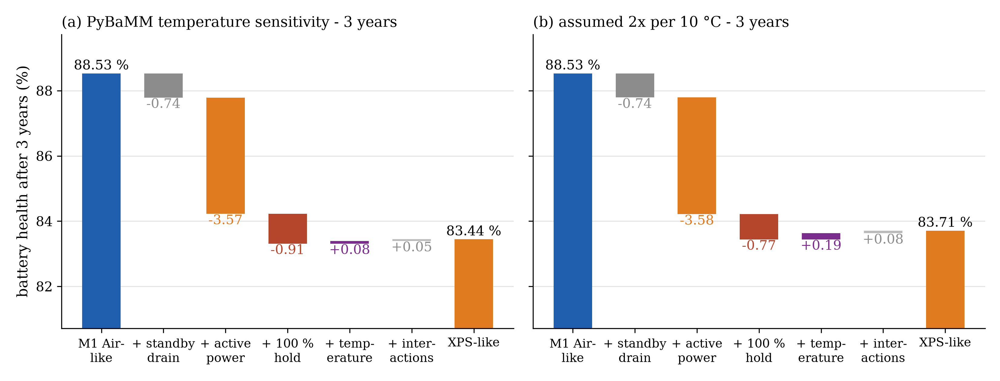
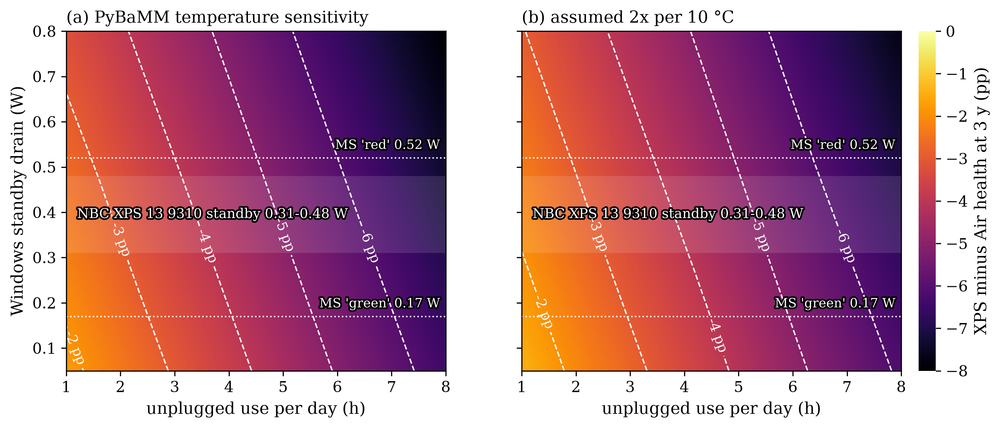
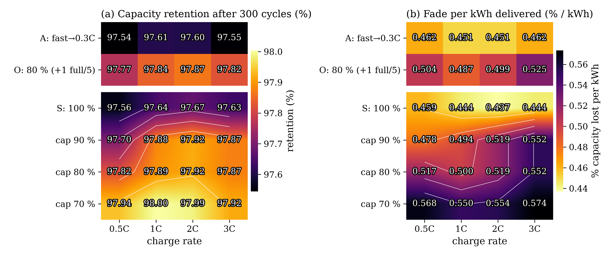

## In short

<figure class="vid">
  <video src="/projects/battery-os-efficiency/media/os_battery.mp4" autoplay loop muted playsinline preload="metadata" poster="/projects/battery-os-efficiency/media/os_battery.jpg"></video>
  <figcaption>One modelled day (left: M1 Air-like, right: XPS 13-like), then battery health over five years; ochre, the gap between them. Chip activity is illustrative.</figcaption>
</figure>

**Where it started.** I have used iPhones for years, and battery optimisation was widely rumoured to be one of the core
technologies of Apple's car project. As an electrical-engineering student using a MacBook, I also noticed that its
battery held up unusually well. So I wanted to know two things: how strong the effect of OS-level optimisation really
is, and how tightly Apple's system design couples the OS with the hardware.

**What I noticed first.** I started from a published physics model of a commercial cell (PyBaMM's DFN with O'Kane et
al.'s coupled degradation, LG M50 parameters) and ran one year of laptop use from public specs. The answer was almost
nothing: optimized charging changed capacity after a year by −0.033 pp, the power profile by −0.008 pp. Two reasons. In
this model, SEI growth (the slow loss of lithium that dominates the fade) hardly depends on state of charge, so holding
at 80 % instead of 100 % has little to act on. And the vendors' own battery-life claims imply almost the same power on
battery: 3.29 W for the current (M5) MacBook Air against 3.50 W for a 2025 ThinkPad X1 Carbon.

**What that made me curious about.** If the published model cannot see the effect, which mechanisms could create a gap
at all? I listed four that an OS and its hardware can move: active power (how much charge is cycled per day), standby
drain while asleep, how long the battery is held full on the charger, and cell temperature. To give the charge-hold and
temperature mechanisms something to act on, I switched the SEI model to a reaction-limited form and validated it as a
table: the ageing rate rises 3.8–4.1× from 30 % to 100 % state of charge and 1.32–1.41× per 10 °C.

**What worked, and what did not.** Long multi-month DFN runs with that model failed in the solver, so I moved to a
hybrid law that takes its calendar term from the validated table and its cycling term from earlier PyBaMM runs. Its
absolute scale was too gentle, so I calibrated two global factors to 18 self-reported M1 Air battery-health values and
fed it with Notebookcheck measurements for the M1 Air and the Dell XPS 13 9310. With the same user day, it projects
88.5 % health after 3 years for the Air-like case and 83.4 % for the XPS-like case. Most of the −5.1 pp gap is active
power (−3.6 pp: the XPS draws 4.75 W instead of 3.1 W for the same web use), then the 100 % hold (−0.9 pp) and standby
drain (−0.7 pp); temperature adds about zero. The calibration rests on unverified anecdotes, so these are projections
of operating conditions, not measurements.

**Where it leads.** Within this model, the OS matters mostly through the power the whole platform draws for a task, not
through the charging feature that is usually credited. The next steps are the data the model lacks: health data for
the XPS (none found), measured cell temperatures instead of skin temperatures, and a test that changes only the
operating system on the same hardware.

## 1 Background

### 1.1 What Apple says the M1 changed

The M1 (November 2020) put the CPU, GPU and memory into one package. In Apple's words, unified memory "brings together
high-bandwidth, low-latency memory into a single pool within a custom package", so that the SoC's parts can "access the
same data without copying it" ([Apple Newsroom](https://www.apple.com/newsroom/2020/11/apple-unleashes-m1/)). Of the
eight CPU cores, "the four high-efficiency cores deliver outstanding performance at a tenth of the power" (same
release). These are manufacturer claims, not measurements made here.

### 1.2 Where the OS comes in

The hardware only pays off if the OS places work on the right cores and lets them sleep:

- **Quality of service.** "On Apple silicon, a task's QoS class influences whether the system runs that task. For
  example, the system is more likely to run background tasks on lower performance cores to maximize battery life"
  ([Apple developer docs](https://developer.apple.com/documentation/apple-silicon/tuning-your-code-s-performance-for-apple-silicon)).
  Notebookcheck observed the same on the Air: "only the Icestorm cores run under low loads"
  ([review](https://www.notebookcheck.net/Apple-MacBook-Air-2020-M1-Entry-Review-Apple-M1-CPU-humbles-Intel-and-AMD.508057.0.html)).
- **App Nap.** It "conserves battery life by regulating the app's CPU usage and by reducing the frequency with which its
  timers are fired" ([Apple energy guide](https://developer.apple.com/library/archive/documentation/Performance/Conceptual/power_efficiency_guidelines_osx/AppNap.html)).
- **Optimized Battery Charging.** macOS learns the charging routine "so that it can delay charging past 80% in certain
  situations" ([Apple Support](https://support.apple.com/en-us/HT212049)). The page does not say whether it is on by
  default on a Mac, so the 80 % hold used below is an assumption.

On the Windows side, the defaults that matter here are documented too. Under Modern Standby "the system is still in S0
(a fully running state, ready and able to do work)" ([Microsoft](https://learn.microsoft.com/en-us/windows-hardware/design/device-experiences/modern-standby-vs-s3)).
The XPS 13 9310's BIOS default for battery charging is "Adaptive" ([Dell service manual](https://dl.dell.com/topicspdf/xps-13-9310-laptop_service-manual_en-us.pdf)),
and Lenovo's default "starts charging when the battery drops below 96%, and stops at 100%"
([Lenovo](https://support.lenovo.com/us/en/solutions/ht078208)).

## 2 Hardware: where the battery-relevant parts sit

To see which parts of the machine act on the battery, I annotated iFixit's teardown photos of the M1 MacBook Air
(A2337). Every chip identity comes from iFixit's
[teardown article](https://www.ifixit.com/News/46884/m1-macbook-teardowns-something-old-something-new); the boxes,
the grouping into roles and the link from each role to battery ageing are my own analysis, not iFixit's: I placed
each box from chip markings legible in the full-resolution photos and assigned the role from the part's documented
function. Four roles are marked: the SoC (active and
idle power), the PMICs (sleep and standby drain), the charger and USB-C power path (charge voltage, current and
optimized charging), and the battery pack with its distance to the SoC (cell temperature).

The Air has no fan: "Apple nixed the fan in favor of a simple aluminum heat spreader hanging off the left edge of the
logic board" (iFixit). The pack sits in three sections below the board, and the closest cell edge is roughly 2 cm
(21.0 mm, scaled from the 30.4 cm case width) from the SoC centre. The label on the pack reads 49.9 Wh.

Photos: [iFixit](https://www.ifixit.com/News/46884/m1-macbook-teardowns-something-old-something-new), licensed
[CC BY-NC-SA 3.0](https://creativecommons.org/licenses/by-nc-sa/3.0/). The annotations are my interpretation and are not endorsed by iFixit.

## 3 Measured inputs

The two machines are compared on independent measurements, not vendor claims. Both rows come from Notebookcheck's
reviews of the [M1 Air](https://www.notebookcheck.net/Apple-MacBook-Air-2020-M1-Entry-Review-Apple-M1-CPU-humbles-Intel-and-AMD.508057.0.html)
and the [XPS 13 9310 (i7-1165G7)](https://www.notebookcheck.net/Dell-XPS-13-9310-Core-i7-Laptop-Review-The-11th-Gen-Tiger-Lake-Difference.499291.0.html);
power values are measured at the wall unless marked as on battery.

| quantity | MacBook Air M1 (2020) | Dell XPS 13 9310 |
|---|---|---|
| battery | 49.9 Wh | 52 Wh ([Dell](https://dl.dell.com/topicspdf/xps-13-9310-laptop_setup-guide_en-us.pdf)) |
| off / standby (wall) | 0.03 / 0.04 W | 0.31 / 0.48 W |
| idle min / avg / max (wall) | 1.9 / 6.4 / 7 W | 3.9 / 5.9 / 6.3 W |
| Wi-Fi web-surfing runtime | 16 h 00 min | 10 h 57 min |
| web power on battery (pack Wh ÷ runtime) | 3.12 W | 4.75 W |
| load avg / max (wall) | 25 / 30.3 W | 39.7 / 47.5 W |
| top surface under load, max / avg | 44 / 36.4 °C | 46.2 / 36.5 °C |
| top surface at idle, avg (room) | 25.8 °C (22 °C) | 20.7 °C (22.6 °C) |
| empty to full | 2 h 40 min (30 W adapter) | "just over 2 hours" (45 W) |

The XPS idle surface average is below the stated room temperature; I treat it as a measurement artefact. The
standby band from Microsoft's SleepStudy thresholds, 1 %/h and 0.333 %/h of a 52 Wh pack, is 0.52 / 0.17 W
([Microsoft](https://learn.microsoft.com/en-us/windows-hardware/design/device-experiences/modern-standby-sleepstudy)).

## 4 Model

### 4.1 Calendar term from a validated SOC × temperature table

With PyBaMM's reaction-limited SEI (Tafel-type in the SEI overpotential, Arrhenius in temperature), calibrated so that
a year-long float at 4.2 V and 25 °C loses the same 54.3 mA·h of lithium as the published model, 20-day floats give the
lithium-to-SEI rate $r(\mathrm{SOC}, T)$ in mA·h/day:

| SOC | 25 °C | 35 °C | 45 °C |
|---|---|---|---|
| 30 % | 0.039 | 0.055 | 0.076 |
| 60 % | 0.067 | 0.093 | 0.127 |
| 90 % | 0.140 | 0.189 | 0.251 |
| 100 % | 0.162 | 0.218 | 0.288 |

### 4.2 Hybrid ageing law

A day is a list of segments $j$ with duration $h_j$, state of charge $\mathrm{SOC}_j$ and cell temperature $T_j$. The
day's mean SEI rate interpolates the table (log-linear in $T$, linear in SOC):

$$
\bar r = \sum_j \frac{h_j}{24}\, r(\mathrm{SOC}_j, T_j). \tag{1}
$$

Capacity loss in percent after $t$ years is a calendar term plus a cycling term,

$$
\Delta C(t) = s_{\mathrm{cal}}\,\beta\,\frac{100\, Q_{\mathrm{cal}}(t)}{5000\ \mathrm{mA\,h}} + s_{\mathrm{cyc}}\, c_{\mathrm{cyc}}\, \mathrm{EFC}(t),
\qquad Q_{\mathrm{cal}}(t) = 365\,\bar r\, t^{z}, \tag{2}
$$

with $z = 0.577$ fitted to the published model's own float (12.9 mA·h at day 30, 54.3 mA·h at day 360), $\beta = 1.147$
capacity loss per unit of lithium lost (from the one-year PyBaMM runs), and $c_{\mathrm{cyc}} = 0.0068$ % per equivalent
full cycle (from a 0.5C PyBaMM cycling run, calendar part removed). The cycles per day follow from the measured powers,

$$
\mathrm{EFC}/\mathrm{day} = \frac{P_{\mathrm{web}}\, h_{\mathrm{use}} + P_{\mathrm{sb}} \cdot 4\ \mathrm{h}}{E_{\mathrm{pack}}}. \tag{3}
$$

### 4.3 Calibration and the day

$s_{\mathrm{cal}}$ and $s_{\mathrm{cyc}}$ are fitted by least squares to 18 M1 Air self-reports (macOS "Maximum
Capacity", age and cycle count) from one [Reddit thread](https://www.reddit.com/r/macbookair/comments/1fc0qqg/); two
reports at 36–37 % are treated as cell faults. Age and cycle columns are nearly uncorrelated ($r$ = 0.09), so both
factors are identified: $s_{\mathrm{cal}} = 1.96$, $s_{\mathrm{cyc}} = 3.48$, RMSE 3.2 pp. The 5 h/day usage mix used
below gives 0.314 EFC/day, the closest to the reports' median of 0.32 cycles/day.

The assumed day (ambient 22 °C): 1 h at 100 % before unplugging, 5 h of unplugged web use, 4 h of unplugged sleep, then
8 h of desk use and the rest asleep, plugged in at the hold level. The Air holds 80 %, uses 3.1 W and drains 0.04 W
asleep; the XPS holds 100 %, uses 4.75 W and drains 0.40 W. On that day the Air falls from 100 % to 68.9 % during use
and 68.6 % after sleep; the XPS to 54.3 % and 51.3 %. Cell temperatures are estimated from skin temperatures: Air
22 / 25.5 / 25 °C asleep / at the desk / on the web, XPS 22 / 23.5 / 24.5 °C (its fans keep it slightly cooler).

## 5 Results

### 5.1 First pass: the published model sees almost nothing

One year of laptop use from vendor specs on the published cell: about 4.4 % is lost in every case, almost all of it
SEI growth, which is the same in all four runs (168.1 mA·h per cell). Optimized charging only reduces lithium lost to
plating, by 1.8 mA·h per cell. This is a property of the model, whose SEI growth barely depends on state of charge, not
evidence that holding at 80 % does nothing.

### 5.2 Field-calibrated model: health over the years

| | 2 y | 3 y | 4 y |
|---|---|---|---|
| Air-like (80 % hold) | 91.9 % | 88.5 % | 85.2 % |
| XPS-like (100 % hold) | 88.5 % | 83.4 % | 78.5 % |

The XPS-like case crosses 80 % after about 3.7 years; the Air-like case stays above it for more than 5 years (81.9 %
against 73.7 % at 5 years, the end of the animation above). At 3 years, a 90 % cap on the XPS gives 83.8 % and the
Lenovo-style 96–100 % policy 83.5 %. Over usage mix, standby drain and charging cap, the XPS spans 81.0–90.9 % at
3 years; the Air spans 87.0–93.2 % over usage mix. An assumed 2× per 10 °C temperature law moves the values in the table
by at most 0.3 pp.

### 5.3 Where the gap comes from

Switching one factor at a time from Air-like to XPS-like at 3 years:

| factor | effect at 3 y |
|---|---|
| active power (4.75 vs 3.1 W, so more cycles per day) | −3.57 pp |
| charge management (100 % vs 80 % hold) | −0.91 pp |
| standby drain (0.40 vs 0.04 W) | −0.74 pp |
| temperature (XPS slightly cooler in the mapping) | +0.08 pp |
| interactions | +0.05 pp |

The gap is −3.5 / −5.1 / −6.7 pp at 2 / 3 / 4 years (−3.3 / −4.8 / −6.4 pp with 2× per 10 °C).

How much the gap depends on the user: from about −2 pp at 1–2 h/day of unplugged use with low standby drain to −6 to
−7 pp at 7–8 h/day with high drain.

## 6 Limitations

- **The calibration rests on anecdotes.** 18 self-reported, unverified, self-selected values from one thread. The fit
  error (3.2 pp) is as large as some of the effects.
- **No XPS field data.** Nothing validates the XPS-side prediction; I found no comparable health reports.
- **Skin temperature as a proxy.** Cell temperatures are estimated from Notebookcheck's surface measurements, not
  measured inside the pack. This is why temperature contributes almost nothing here; a hotter real cell would change
  that.
- **Conditions, not operating systems.** The model translates measured power, standby drain, charging policy and
  temperature into ageing. It does not test macOS or Windows: different hardware runs each, and the 80 % hold on the
  Air is an assumption. The question of how much is the OS and how much the silicon stays open.
- **Borrowed pieces.** The ageing law, its 25 °C cycling term and the SOC × temperature table come from simulations of
  the LG M50 cell, not of the cells in either laptop.

## 7 Earlier steps

**A degradation twin behind a charging decision (v1).** The same project began with a learned generative model
predicting how a PyBaMM cell fades under a planned charging schedule, used by a rule that picks the charge rate for each
50-cycle block. On 6 held-out cells both twins were over-confident once they saw a history (90 % intervals covered 0.69
and 0.64), and the diffusion-twin rule charged 6.1 min per cycle faster than fixed 1C while one more cell missed the
life target. The physics comes from my [degradation simulation](/research/battery-degradation-sim/).

**What each ingredient buys (v2).** With 40 training and 20 held-out cells, early-cycle BMS features halved the
forecast error, a physics prior did not help as built (coverage 0.58), and a calibration step restored coverage to 0.93.
In closed loop every diffusion-twin rule met the target on the same 17 of 20 cells as fixed 1C while charging about
9 min faster per cycle; the task was too easy to separate the forecasters. The decision side links to my
[protocol-selection study](/research/battery-protocol-select/).

**OS-style optimized charging on a virtual cell (v3).** This is where the present question started. On the published
LG M50 cell, capped charging aged less per cycle (+0.36 pp retention for a 70 % cap after 300 cycles at 1C), but per
kWh actually delivered the benefit reversed: full charging had the lowest fade, 0.444 %/kWh against 0.550 %/kWh for
the 70 % cap. Most of the fade was time-driven SEI growth that accrues whatever the cap, which led to the SOC-sensitive
model above.

