## Abstract

An earlier Green AI project of mine compared three Seoul driving routes for fuel and CO₂ in the commercial microsimulator AIMSUN and drew its conclusions from **one run per scenario**. This project re-derives that report, rebuilds its comparison on the real road, and then makes the route choice the way simulation methodology prescribes — with a statistical guarantee instead of a fixed budget of runs. §2 transcribes the report's 62 numbers with page references and lists five places where its wording disagrees with its own tables. §3 rebuilds the three corridors it names on an OpenStreetMap network of southern Seoul, converted by `netconvert` into Eclipse SUMO with real lane counts, real junction geometry and 494 signalised intersections, with CO₂ from SUMO's published HBEFA3 model — whose class, chosen from the car's attributes before any comparison, reproduces its rated 143 g/km to 142.8. Over eight common-random-number replications the least-CO₂ route is the 15.5 km direct path, but the two best arms **cannot be separated**: shortest versus fastest is +10.7 ± 35.0 g. §4 builds the machinery that fixes that, on a synthetic 5 km arterial whose truth is computable — fully sequential indifference-zone selection, sequential feasibility determination under a travel-time constraint, and common random numbers — where one run per plan recommends an infeasible plan 23 % of the time while the sequential procedure with CRN is acceptable in 1,000 of 1,000 macro-replications. §5 applies it to the real problem on a bank of 1,600 SUMO runs: the sequential procedure attains **P(correct selection) = 0.956 against a nominal 0.95** with every selection acceptable, for 490 runs against the 40 the fixed budget spent, and at a 20-minute trip budget it answers "no route qualifies" rather than recommending one that breaks it — which the fixed budget does 7.2 % of the time. The tie is then settled at a stated zone: shortest − fastest = **+13.35 g (95 % CI [+7.87, +18.82])**, which is *inside* the δ = 25 g indifference zone declared in advance, so at that zone the two are reported indistinguishable; tightened to δ = 10 g the guarantee applies and the procedure returns the fastest path in 97.7 % of macro-replications for 83 runs. Finally, CRN buys a median 13.7× on the synthetic corridor and only 1.39× here, and §5.5 measures why: holding the shared demand draw fixed removes none of the ego's variance, because a different route makes SUMO consume its random stream in a different order. The geometry and the emission model are real; the demand is not, and every CO₂ figure on the real network is a free-flow figure.

<figure class="vid">
  <video src="/projects/eco-route-rl/media/drive.mp4" autoplay loop muted playsinline preload="metadata" poster="/projects/eco-route-rl/media/drive.jpg"></video>
  <figcaption>Animation 1 — One car, the whole trip, on the real road. The archived report's reference vehicle drives the
  least-CO₂ route through background traffic while sumo-gui's own follow camera tracks it. The lanes, the junction
  shapes, the signal states at the stop lines and the surrounding vehicles are the simulation, not a drawing of it:
  watch the red and green marks across the lanes as the car reaches each of the network's signalised intersections.
  The panel is SUMO's HBEFA3 output read second by second through TraCI: instantaneous g/s, cumulative g, fuel, g/km,
  and the saving that keeps growing against the same car on the Olympic-daero corridor — the route the archived
  AIMSUN study actually simulated — under the same traffic draw. The saving is read off at the same elapsed trip
  time, so the figure on screen at the finish (330 g) is what the eco car has saved by the moment it arrives, while
  the Olympic-daero car is still 125 s from the destination; over both complete trips the gap is 598 g. The
  cumulative total at the finish is checked against SUMO's own <code>tripinfo</code> emissions output for the
  identical run, and a second identical run reproduces the whole second-by-second trace exactly
  (<code>results/animation_check.json</code>).
  <strong>Read it as a free-flow trip.</strong> The traffic around the car is the assumed demand of §3.5, which never
  congests: the car averages 47 km/h where the archived report measured 23.9 km/h in real traffic. A real Seoul
  arterial at 18:00 would look nothing like this, and the saving shown is a free-flow saving.
  <strong>Two rendering notes.</strong> Lane widths are drawn 1.6× their true width so that lanes stay countable at a
  zoom wide enough to show the surrounding street grid; positions, lane counts and geometry are untouched
  (<code>data/view_settings.xml</code>). And this is the 2D view: the picture this animation was modelled on is
  SUMO's OSG 3D view, and <code>results/osg_availability.json</code> records every way an OSG build could have
  arrived here and why none did — the installed wheel's build-features line carries no OSG and its
  <code>--help</code> offers no <code>--osg</code> option, PyPI's latest <code>eclipse-sumo</code> release ships six
  platform wheels and none is an OSG variant, <code>conda search -c conda-forge eclipse-sumo</code> answers "No match
  found", the Ubuntu package (sumo 1.4.0) needs root and <code>sudo -n</code> answers that a password is required,
  and <code>ldconfig -p</code> lists no OpenSceneGraph library for anything to link against. A source build was out
  of scope.</figcaption>
</figure>

## 1 Introduction

Navigation systems minimise time or distance. Fuel and CO₂ depend on both and on how often the car stops, so the greenest route can differ from the shortest. An earlier Green AI project of mine set out to find the greenest one: measure fuel and CO₂ on candidate routes in the commercial microsimulator AIMSUN, then learn a routing policy. One document survives — a 10-page Korean report on the first stage only, whose last page lists shortest-path algorithms and stops.

<figure class="origin">
  
  <figcaption><b>Where this comes from.</b> The Green AI project above was "Green-Navi", the undergraduate team I led in the
  Carbon-Neutral ESG Practical-Problem Research Group at Chung-Ang University (April–December 2023, MSIT / NRF
  <i>Field-Linked Future-Leading Talent</i> programme), photographed at the research fair on 2023.11.02. Eco-Route RL is
  that project taken up again with the simulation methodology it lacked.</figcaption>
</figure>

That report has a defect that no amount of re-reading fixes. Every figure in it is the output of **one** simulation run. There are no replications, no confidence intervals, and no statement of how likely its rankings are to be right. A microsimulation is a random experiment, and a single draw from one is not a comparison.

This project takes that defect seriously, in three moves:

1. **The report is re-derived** (§2). Its 62 numbers are transcribed with page references and script-checked against the PDF text layer; the totals are recomputed; five places where its wording disagrees with its own tables are listed.
2. **The comparison is rebuilt on the real road** (§3). The corridors the report names, pulled from OpenStreetMap through the Overpass API and converted by `netconvert` into an Eclipse SUMO network with real lane counts, real junction geometry and 494 signalised intersections, with CO₂ from SUMO's published HBEFA3 model instead of three coefficients fitted to the report itself. This stage replicates — eight paired replications per route — and it is honest about where that gets it: its two best routes **cannot be separated**, at +10.7 ± 35.0 g.
3. **The route is then chosen with a guarantee instead of a budget** (§5). Not "eight runs each and take the smallest mean", but a fully sequential indifference-zone procedure with a feasibility check on travel time, which decides when to stop and carries a bound on the probability of being wrong. The machinery for that is built and measured first on a synthetic corridor where the truth is known (§4), then applied to the real network.

The last move is the point of the project. The first two make it possible to state what was actually decided, on what road, under what traffic.

## 2 The archived report, re-derived

### 2.1 What it contains

The report simulates a 2023 Hyundai Grandeur 2.5 (rated 11.7 km/ℓ combined, 10.0 urban, 14.5 highway, 143 g CO₂/km) on three road sequences (p.3–4), all from 개포자이 프레지던스 to 중앙대학교 정문:

| | Route as the report prints it | Character |
|---|---|---|
| **A** | 영동대로 → 역삼로 → 역삼로107길 → 테헤란로115길 → **올림픽대로** → 동작교 → 현충로 → 서달로 → 흑석로 | riverside expressway |
| **B** | 영동대로 → 양재대로 → 강남순환로 → 경부고속도로 → **남부순환로**(낙성대역) → 관악로 → 상도로 | signalised ring arterial |
| **C** | 삼성로 → 양재대로 → **강남순환로** → 신림로 → 관악로 → 상도로 → 상도로53길 | tunnel expressway |

| Route (free flow) | segments | km | fuel ℓ | km/ℓ | IEM CO₂ g | g/km |
|---|---|---|---|---|---|---|
| Olympic-daero | 4 (p.5–7) | 15.325 | 0.835 | 18.35 | 3,065 | 200.0 |
| Nambu Sunhwan-ro | 3 (p.9) | 17.627 | 0.937 | 18.81 | 2,964 | 168.2 |
| Gangnam Sunhwan-ro | — | — | — | — | — | — |

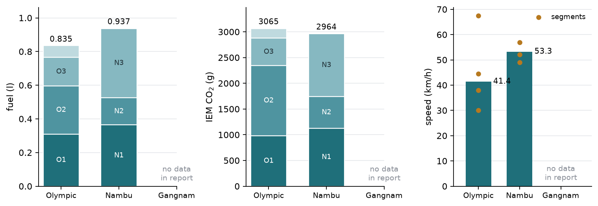

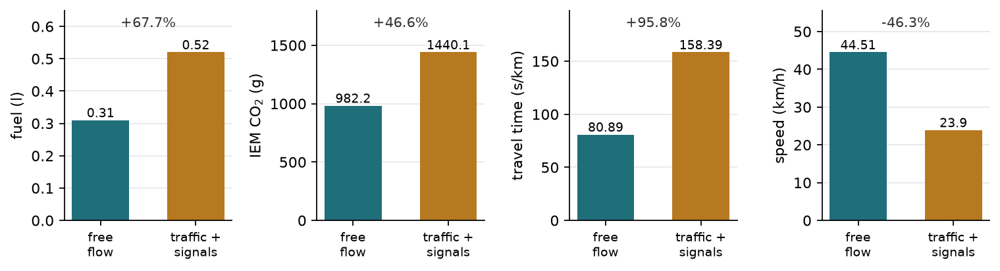

**For the Gangnam route the report gives only the road sequence — no simulation output at all.** The PDF and its map screenshots are not in this repository; every chart above is redrawn from the transcribed numbers (`results/aimsun_report.json`, 62/62 numbers found on their stated pages by `src/verify_transcription.py`).

### 2.2 Where the report disagrees with itself

From `results/report_derived.json`: "about 60 % more fuel" where 0.52 vs 0.31 ℓ is **+67.7 %**; IEM CO₂ per litre ranging 2,701–4,774 g/ℓ against petrol's ≈2,310; free flow called unrealistically economical (18.35 vs 11.7 km/ℓ) while the same runs emit 168–200 g CO₂/km, 18–40 % *above* the rated 143; 158.39 s/km implying 22.7 km/h, not the printed 23.9; and the rating described as a single steady-60 km/h test although the same table prints urban, highway and combined values.

The single most informative comparison it does contain is one 5.5 km urban segment: 0.31 ℓ at 44.51 km/h in free flow, and 0.52 ℓ at 23.90 km/h once surveyed traffic volumes and signals are added. Both are one run.

## 3 The corridors rebuilt on the real network

### 3.1 Recovering the corridors

Origin and destination are OSM features looked up by name, not coordinates I typed: the 개포자이프레지던스아파트 land-use way (357824808) and the 중앙대정문 bus-stop node (4178638914), snapped to the network 135 m and 3 m away.

A corridor is the shortest path that enters the report's named roads **in the report's order**: the search state is (SUMO edge, how many of those roads have been entered), entering the next road advances the index by exactly one, and an edge on none of them costs twice its length. Roads the classified network does not carry are dropped first, with the reason recorded. Two drops matter:

- **동작교** is a bridge name; no way in the extract carries it.
- **강남순환로 and 경부고속도로 in corridor B.** The classified extract has no direct link between them — the shortest connection is 1,498 m of other roads — so forcing both in order detours corridor B to 27.3 km against the report's stated 17.627 km. They are dropped from B's ordering constraint (corridor C still carries 강남순환로 for 7.2 km), and B then comes out at 17.001 km, 3.6 % short of the report's own total. Corridor A comes out 2.2 km long (17.525 vs 15.325 km); the report's four AIMSUN segments were split to fit an educational licence and need not cover the whole door-to-door trip.

Two baselines are found on the same network with no named-road preference: the **shortest** path by distance and the **fastest** path by length ÷ speed limit.

### 3.2 Network: OpenStreetMap → netconvert → SUMO

One Overpass request (2026-09-21, bbox 37.445–37.535 N, 126.905–127.090 E, 5.90 MB of XML, cached gzipped in `cache/`) returns every classified way — motorway/trunk/primary/secondary/tertiary and their links — with all their nodes and tags. `netconvert` then builds the network with `--geometry.remove --ramps.guess --junctions.join --tls.guess-signals --tls.join`, so lane counts, junction shapes and signals all come from the OSM tags.

**Speed limits needed care.** Only 514 of the 3,716 downloaded ways carry `maxspeed`, and SUMO's stock OSM type map falls back to German defaults — 100 km/h on a primary road, which is wrong for Seoul. So the build first measures the tagged speeds *in this extract* and uses the length-weighted mean per class as that class's default: 110 km/h motorway, 77.2 trunk, 54.2 primary, 47.8 secondary, 44.0 tertiary. A class with no tagged way at all falls back to the Korean statutory urban limit (50 km/h, 30 on side streets; 도로교통법 시행규칙 제19조, the 안전속도 5030 scheme). Individual ways keep their own tag wherever they have one.

**No Korean speed or count source would serve us.** `src/seoul_data_sources.py` made exactly one request to each of five, with a truthful user agent, and recorded the answers verbatim in `results/speed_sources.json`:

- 서울 열린데이터광장 OpenAPI, both the speed and the volume service: `<RESULT><CODE>ERROR-300</CODE><MESSAGE><![CDATA[필수 값이 누락되어 있습니다. 요청인자를 참고 하십시오.]]></MESSAGE></RESULT>` — the missing required argument is the API key.
- 국가교통정보센터 (ITS) OpenAPI, HTTP 401: `<resultCode>4005</resultCode><resultMsg>유효하지 않은 인증키입니다. 인증키를 확인해 주시고, 발급받지 않은 경우에는 국가교통정보센터에서 인증키를 발급받아 이용해 주시기 바랍니다.</resultMsg>`
- The 열린데이터광장 dataset page and the TOPIS 자료실 both returned HTML shells with no data.

None was retried, and none was scraped after declining. Everything below therefore rests on OSM tags plus the statutory limits, and says so.

### 3.3 The five routes

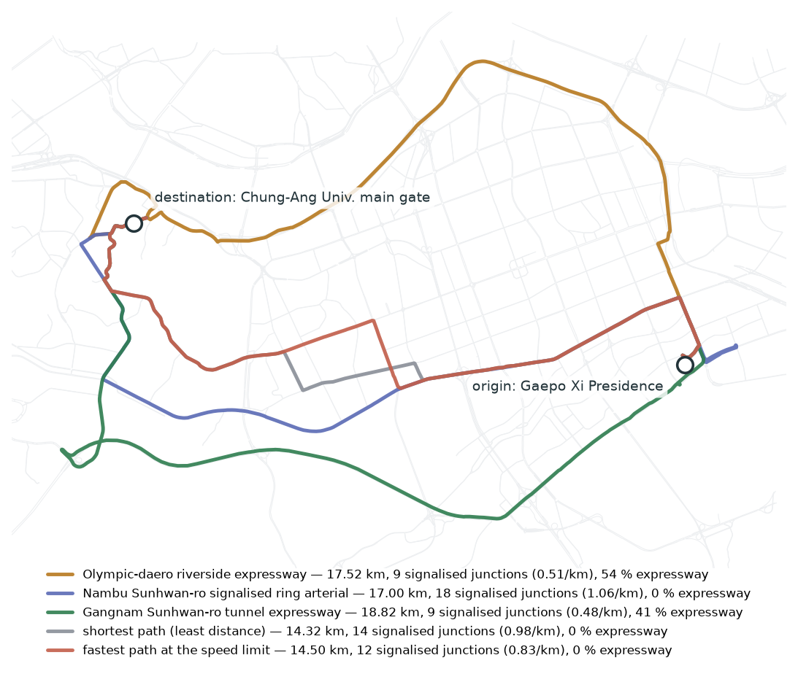

5,047 edges, 2,908 junctions, **494 signalised junctions**, 1,091 edge-km, 2,094 lane-km. The three corridors come out with exactly the characters the report's route names imply, and now as measurements rather than choices:

| Route | km | signalised junctions | per km | expressway share | mean lanes | report's own total |
|---|---|---|---|---|---|---|
| A — Olympic-daero | 17.525 | 9 | 0.51 | 54 % | 3.03 | 15.325 km (+2.20) |
| B — Nambu Sunhwan-ro | 17.001 | 18 | 1.06 | 0 % | 2.14 | 17.627 km (−0.63) |
| C — Gangnam Sunhwan-ro | 18.822 | 9 | 0.48 | 41 % | 2.46 | not simulated |
| shortest | 14.318 | 14 | 0.98 | 0 % | 1.72 | — |
| fastest | 14.499 | 12 | 0.83 | 0 % | 1.87 | — |

Nothing in that table was chosen: the signal counts are `highway=traffic_signals` nodes that survived junction joining, and the lengths are sums over real way geometry.

### 3.4 Emissions: HBEFA3 instead of three fitted coefficients

An earlier version of this project used a model fitted to the report itself,

$$
F \;=\; a\,\frac{L}{v} \;+\; b\,L \;+\; d\,n_{\text{stop}},
\qquad
C \;=\; 2310\ \text{g}/\ell\times F ,
\tag{1}
$$

with $a,b,d$ from non-negative least squares on eight AIMSUN points and $d$ resting on an assumed stop count. That is calibration, not validation. SUMO ships **HBEFA3**, a published emission-factor family, and its class names encode exactly three vehicle attributes: category, fuel, emission standard. The report's car (p.2) is a passenger car, petrol, first registered 2023 — so Euro 6 — giving `HBEFA3/PC_G_EU6`. The class was chosen on those grounds *before* any comparison. Evaluated at a constant 60 km/h, the speed of the Korean rated-economy test the report explains on p.2, it gives **142.8 g CO₂/km against the car's rated 143** (ratio 0.999) and 16.3 km/ℓ against a rated 11.7 combined / 10.0 urban. The CO₂ agreement and the km/ℓ disagreement are consistent with each other: §2.2 already showed the rated pair is internally inconsistent (143 g/km × 11.7 km/ℓ = 1,673 g per litre, well below the ≈2,310 g/ℓ of petrol combustion).

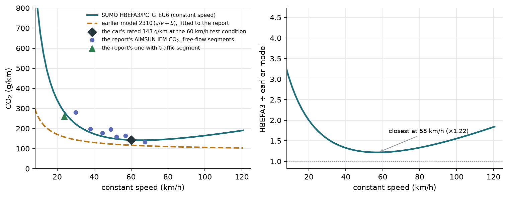

| constant speed | HBEFA3 g/km | earlier model g/km | ratio |
|---|---|---|---|
| 10.8 km/h | 675.5 | 239.2 | 2.82 |
| 19.8 | 344.7 | 171.4 | 2.01 |
| 30.6 | 218.2 | 142.6 | 1.53 |
| 50.4 | 150.3 | 121.9 | 1.23 |
| 79.2 | 146.3 | 110.3 | 1.33 |
| 109.8 | 176.4 | 104.6 | 1.69 |

The two agree best around 50–70 km/h and diverge badly at both ends. The earlier model's $a/v + b$ form is monotonically decreasing in speed and therefore cannot produce the U shape HBEFA3 has — it misses the rise above 80 km/h entirely — and at crawling speed it under-reads by a factor of 2.8. That matters here precisely because the earlier model was fitted to free-flow AIMSUN segments at 30–67 km/h, the range where it happens to be least wrong. HBEFA3 also gives an idle rate the old model could not: 2.298 g CO₂ per second at rest.

### 3.5 Demand — the assumption that remains

There is no measured demand. Background trips are drawn at random between network edges with `randomTrips.py`, a fixed seed, a fringe factor of 10 and a 1.5 km minimum trip length. The insertion rate was chosen by a sweep scored against a number the report itself measured: the 23.90 km/h mean speed of its one with-traffic AIMSUN run (p.9), against 44.51 km/h in free flow. **The sweep failed to reach it.** At one insertion every 2.0 s (2,100 vehicles completing) the ego car averages 50.55 km/h; at 1.0 s (4,200 vehicles) 50.86 km/h. Random origin-destination demand spread over 1,091 edge-km does not concentrate on the corridors, so the arterials never congest. Heavier levels (0.5, 0.3, 0.2 s) were attempted and abandoned — at those rates single runs no longer finish in the time this shared machine gives a job. The experiment therefore runs at 2.0 s, **near free flow**, and every result below is a free-flow result. Driver behaviour is SUMO's default Krauss car-following and lane-changing: also an assumption.

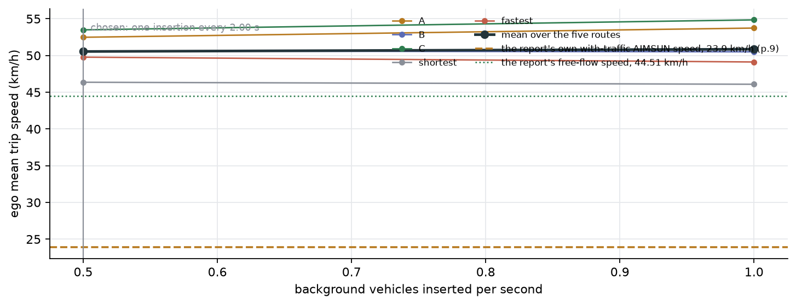

### 3.6 The routing comparison, on a fixed budget

Five arms × 8 background-traffic replications = 40 SUMO runs, 4,200 s of simulated time each, the ego departing at 600 s after a warm-up; emissions from the ego's emission device, read out of SUMO's `tripinfo` output. Background traffic is generated once per replication seed and re-used by every arm, and SUMO's own seed is the same across arms, so within a replication the five arms differ only in the ego's route — common random numbers. Differences are reported paired, against a mis-paired control in which the same runs are re-paired across different traffic draws.

| Route (8 replications) | CO₂ g | ±95 % | g/km | km driven | min | km/h |
|---|---|---|---|---|---|---|
| A — Olympic-daero | 3,336.5 | 39.2 | 177.7 | 18.778 | 21.51 | 52.5 |
| B — Nambu Sunhwan-ro | 3,247.6 | 47.4 | 175.6 | 18.491 | 23.07 | 48.3 |
| C — Gangnam Sunhwan-ro | 3,426.3 | 24.4 | 172.8 | 19.823 | 22.25 | 53.6 |
| shortest | 2,778.1 | 40.8 | 181.9 | 15.274 | 20.14 | 45.6 |
| **fastest** (least CO₂) | **2,767.4** | 16.2 | 178.1 | 15.542 | 19.62 | 47.7 |

(The kilometres driven exceed the route lengths of §3.3 by about 1.25 km because SUMO's `routeLength` counts the internal lanes inside junctions, which the route description does not.)

| Difference vs the fastest path | paired g | ±95 % | % | mis-paired ±95 % | variance reduction | time |
|---|---|---|---|---|---|---|
| A − fastest | +569.1 | 45.3 | +20.6 | 49.5 | 1.19× | +113.4 ± 14.2 s |
| B − fastest | +480.3 | 56.6 | +17.4 | 47.6 | 0.71× | +207.1 ± 25.4 s |
| C − fastest | +659.0 | 37.1 | +23.8 | 25.7 | 0.48× | +157.8 ± 16.5 s |
| shortest − fastest | **+10.7** | **35.0** | +0.4 | 52.8 | 2.28× | +31.2 ± 10.6 s |

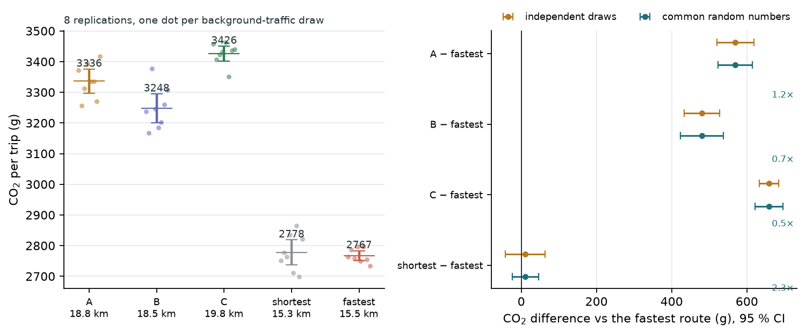

<figure class="vid">
  <video src="/projects/eco-route-rl/media/sumo_race.mp4" autoplay loop muted playsinline preload="metadata" poster="/projects/eco-route-rl/media/sumo_race.jpg"></video>
  <figcaption>Animation 2 — The same five routes driven simultaneously in one background-traffic draw, on the real
  network geometry, with each car's running CO₂ beside it. The three corridors of the archived report are 17–20 km and
  the two direct paths 15 km; at this demand level the extra distance is never repaid by the expressways' higher speed.</figcaption>
</figure>

At this demand the ranking is set by distance: the direct 15.5 km path emits 17–24 % less CO₂ than any of the report's three corridors and also arrives 2–3.5 minutes earlier, so there is no eco-versus-fast trade-off to find here. Corridor C, the tunnel expressway, is both the longest and the highest-emitting despite having the fewest signals and the highest mean speed. Per kilometre the ordering reverses — C is the *most* efficient route at 172.8 g/km against the fastest path's 178.1 — which is the expressway effect the report was looking for; it is simply swamped by 4.3 extra kilometres.

**Two things this table cannot do, and does not pretend to.** The shortest and fastest paths differ by +10.7 ± 35.0 g: the interval covers zero and both signs, so the winner is *not* established. And common random numbers bought almost nothing — the variance reduction ranges from 0.48× to 2.28×, i.e. sometimes less than nothing. Both are questions about how the eight runs were spent, and eight runs chosen in advance cannot answer either. §4 builds the machinery that can; §5 applies it.

## 4 Building the machinery: selection under a constraint, on a synthetic corridor

**This section is method development, and its road is not real.** The corridor below is a stylised 5 km arterial written from scratch in NumPy: its geometry, demand, turning shares and driver parameters are all assumed, and none of its numbers describes any Seoul street. Its purpose is a setting where the truth can be computed exactly, so that a selection procedure can be *measured* rather than trusted — and then carried to the real network in §5, where the truth cannot be computed.

### 4.1 The corridor simulator

One-way, two lanes, 5,000 m, with ten signals at irregular spacings of 330–610 m. Vehicles follow the Intelligent Driver Model (Treiber, Hennecke & Helbing, 2000):

$$
\dot v_i = a\left[1-\left(\frac{v_i}{v_{0,i}}\right)^{4}-\left(\frac{s^{*}(v_i,\Delta v_i)}{s_i}\right)^{2}\right],\qquad
s^{*}=s_0+\max\!\left(0,\;v_iT_i+\frac{v_i\,\Delta v_i}{2\sqrt{ab}}\right)
\tag{2}
$$

with a = 1.4 m/s², b = 2.0 m/s², s₀ = 2 m, desired speeds N(54, 5²) km/h clipped to [40, 68] and headways T uniform on [1.0, 1.5] s. A non-green signal is a standing virtual leader at the stop line; a driver who could not stop at 3 m/s² when amber begins passes. There is no lane changing. Updates are ballistic with Δt = 0.5 s.

Arrivals are Poisson with a time-varying rate (15-minute peak of 1,500 veh/h). Each side street receives 350 veh/h at peak into a point queue that discharges during the side-street green; 17 % of these vehicles turn into the arterial when a gap exists, and arterial vehicles turn off with probability 0.04 per intersection. Signals are fixed-time and two-phase. Every random input of replication r comes from `SeedSequence(seed_r)`, in separate streams for arrivals and driver attributes, so two plans run with the same seed face the same vehicles at the same times — which is what makes CRN effective here. State lives in arrays sorted by (lane, position), and 16 replications advance together in one array. A replication covers 50 simulated minutes; statistics use arrivals in minutes 5–35.

**Validation** (`results/corridor_validation.json`). Vehicle counts balance exactly in all 96 checked runs (48 plans × 2 seeds, demand ×1.15); the smallest net gap was 1.91 m, with no negative speeds and no uncommitted driver crossing a non-green stop line. Queue discharge settles at a 2.24 s headway — 1,606 veh/h/lane, at the low end of the usual 1,600–2,000 range. Cell flows stay under the IDM equilibrium curve (maximum 1,665 vs 1,700 veh/h/lane). A replication takes 0.26 s in a batch of 16 and 1.1 s alone.

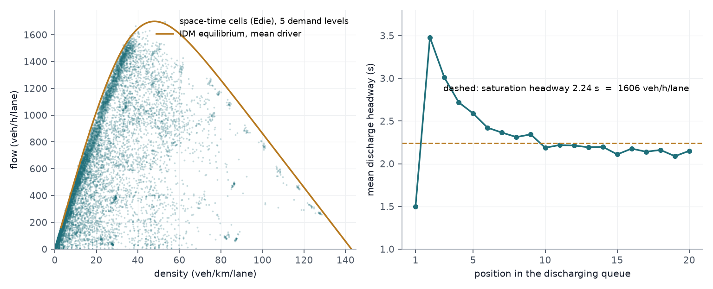

### 4.2 A fuel and CO₂ model for the corridor

$$
P=\big(m(1+\epsilon)\,\dot v+m g C_r+\tfrac12\rho\,C_dA\,v^{2}\big)\,v+P_{\text{acc}},\qquad
f=\alpha+\frac{\max(P,0)}{\eta\,\mathrm{LHV}}
\tag{3}
$$

with m = 1,770 kg (the report's 1,620 kg kerb weight plus load) and assumed C_r = 0.009, C_dA = 0.58 m², P_acc = 0.5 kW, LHV = 32.2 MJ/ℓ. Idle rate α and lumped efficiency η are free. CO₂ = fuel × 2,347.7 g/ℓ (US EPA: 8,887 g per gallon of gasoline). A third free parameter κ maps laboratory km/ℓ to the rated label values — as I understand the Korean label, its km/ℓ is adjusted for real-world driving while its g/km is not (143 g/km corresponds to 16.4 km/ℓ, not 11.7). κ never enters the simulator.

The fit gives α = 0.357 mL/s (1.29 ℓ/h idle), η = 0.388 and κ = 0.746, with all six anchors inside 10 % (RMS 5.8 %). **This is a calibration, not a validation**: three parameters against five effectively independent numbers, on speed traces I had to invent (surrogates of FTP-75 and HWFET matched to published summary statistics, plus two stylised AIMSUN traces), cannot show that the model predicts emissions.

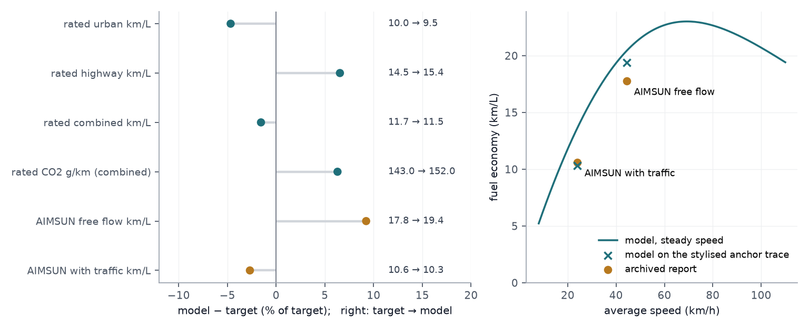

Inside the corridor, (3) is evaluated once per vehicle per 0.5 s step on the speed and acceleration the car-following model has just produced, so what the fuel model consumes is literally one vehicle's trajectory. That is easiest to see on a single car:

<figure class="vid">
  <video src="/projects/eco-route-rl/media/probe_car.mp4" autoplay loop muted playsinline preload="metadata" poster="/projects/eco-route-rl/media/probe_car.jpg"></video>
  <figcaption>Animation 3 — What equation (3) actually eats, <strong>on the simulated corridor of §4, not a real road</strong>. One vehicle followed from the moment it joins the upstream queue until it leaves the corridor 5 km later, under the two signal plans compared in §4.4 and the same demand seed (4242). The car was picked by a rule fixed before any outcome was looked at — among vehicles that drive the whole corridor, the one whose Poisson arrival time is closest to the clock time t = 1,200 s — and since both plans are driven by the same random streams the rule returns the <em>same</em> vehicle (id 423, arriving at 1,200.5 s) in both: one driver, one arrival instant, two sets of signals. Each strip is the 5 km arterial with the ten signals switching green / amber / red, the rest of the traffic in grey and the probe car in colour; below it is that car's speed against distance, so every stop at a red signal is a dip to zero. The read-outs — speed, distance, elapsed time, stops, cumulative fuel and CO₂, running km/ℓ — are accumulated step by step from the car's own recorded speed and acceleration through (3); none of them is re-enacted. Under the uncoordinated plan this car takes 612.5 s, stops 6 times and burns 395.7 mL (928.9 g CO₂, 12.64 km/ℓ); under the green wave, 408.0 s, 1 stop, 260.2 mL (610.8 g CO₂, 19.22 km/ℓ) — the same trip for 318.1 g less CO₂, −34.2 %. These are one car's totals over the full 5 km and are not the fleet figures reported below, which divide all corridor fuel (including side-street idling) by all arrivals, most of which never drive the whole corridor. The trace is stored in <code>results/corridor_probe_trace.json</code>, and every total on screen is checked against the simulator's own per-vehicle accumulator in <code>results/corridor_animation_check.json</code> (maximum absolute difference 0).</figcaption>
</figure>

### 4.3 The decision problem and the procedures

K = 48 signal plans: cycle {60, 90, 120 s} × offsets {uncoordinated, one-way green wave at 40, 50, 60 km/h} × arterial green share {0.55, 0.65} × speed advisory {none, 45 km/h with 85 % compliance}. The problem is to minimise mean CO₂ per vehicle subject to a constraint on a *second, also random* output:

$$
\underset{i\in\{1,\dots,K\}}{\text{minimise}}\ \ \mathbb E[\mathrm{CO_2}_i]\quad\text{subject to}\quad \mathbb E[\mathrm{TT}_i]\le q
\tag{4}
$$

with q = 475 s (37.9 km/h over the corridor). A second variant replaces the constraint by P(TT > 540 s) ≤ 0.012.

Comparison uses the fully sequential KN procedure (Kim & Nelson, 2001). After n₀ = 10 replications per plan, plan i is eliminated at stage r when, for some surviving l,

$$
\sum_{j=1}^{r}\big(Y_{ij}-Y_{lj}\big)>\max\!\Big(0,\ \frac{h^{2}S_{il}^{2}}{2\delta}-\frac{\delta r}{2}\Big),\qquad
h^{2}=(n_0-1)\Big[(2\beta)^{-2/(n_0-1)}-1\Big]
\tag{5}
$$

where $S_{il}^{2}$ is the first-stage variance of the *difference* — so the procedure stays valid, and gets cheaper, under CRN. Feasibility uses the same triangular region on Σ(TTᵢⱼ − q) with tolerance ε (Andradóttir & Kim, 2010). In the simultaneous variant both checks share observations and only a rival already declared feasible can eliminate a plan. The error budget α = 0.05 is split evenly, with Bonferroni constants β = α/(2K) per feasibility decision and β = α/(2(K−1)) per pairwise comparison in (5), valid under CRN.

The procedures come from `rsel`, a library from the sibling project `rs-lab`, copied unmodified after its 23 tests passed from inside this project; `src/rsel_min.py` is my own minimal implementation, kept as a cross-check. Before use, both were run on normal slippage configurations (k = 10, σ = 3, δ = ε = 1; 2,000 macro-replications): empirical PCS was 0.958–0.987 against the nominal 0.95 in all six cases, with identical KN and feasibility decisions on identical data (`results/corridor_rsel_verification.json`).

**Two cautions.** The guarantee P(correct selection) ≥ 1 − α assumes every rival of the best feasible plan is infeasible by at least ε or worse by at least δ. δ = 2.5 g and ε = 5 s (each about 1 %) were set as differences that would not matter in practice, but **after** seeing a 32-replication pilot, and the ground truth puts the runner-up only 0.71 g behind the best. The assumption thus fails for exact selection; what the procedure can be expected to control here is the probability of an *acceptable* selection. Both are reported. And for several thresholds the library's recycled procedure uses β = α/(2K); that bound is the library author's own derivation, not a constant from the literature.

### 4.4 What one run per plan costs

**Ground truth**: 2,000 replications of each plan on the same 2,000 seeds (96,000 runs, 29 min wall on 56 processes), plus 600 per plan at demand ×0.85 and ×1.15. **Macro-replications**: each procedure receives observations drawn with replacement from this bank — one common index for all plans under CRN, separate indices otherwise — so it faces i.i.d. draws from a distribution whose means are known exactly. 1,000 macro-replications per configuration.

Mean CO₂ per vehicle spans 246.0–326.3 g and mean travel time 450–759 s; five plans are feasible. The lowest-CO₂ plan overall (90 s cycle, 40 km/h wave, advisory; 246.0 g) takes 481.8 s and is **infeasible**. The best feasible plan is the 120 s cycle with a 50 km/h wave (246.4 g, 450.1 s, 1.0 stops per vehicle); against an uncoordinated 90 s plan (308.3 g, 632 s, 6.6 stops) it saves 61.8 g per vehicle, 20.1 % (95 % paired CI 61.62–62.05 g).

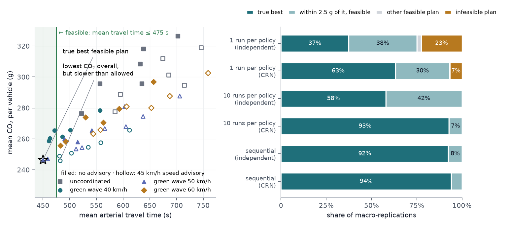

<figure class="vid">
  <video src="/projects/eco-route-rl/media/corridor.mp4" autoplay loop muted playsinline preload="metadata" poster="/projects/eco-route-rl/media/corridor.jpg"></video>
  <figcaption>Animation 4 — The same two signal plans watched from above, <strong>on the simulated corridor of §4</strong>, each running one replication on the <em>same</em> demand seed (4242), so both strips carry the same vehicles arriving at the same instants. Each strip is the 5 km arterial: the bars are the ten signals switching green / amber / red, and every dot is a vehicle coloured by its instantaneous speed on a two-colour ramp (amber = stopped, teal = 54 km/h). Watch the top strip grow standing queues behind almost every signal while the bottom strip moves the same demand through in platoons, and watch the read-outs — they are the simulator's own running means. After 50 simulated minutes this seed ends at 297.7 g against 240.6 g of CO₂ per vehicle (−57.1 g, −19.2 %; the paired mean over 2,000 seeds is −61.8 g, −20.1 %) and 620 s against 450 s of mean travel time. The end-of-run read-outs are checked against a direct evaluation of the same seed in <code>results/corridor_animation_check.json</code> (they agree exactly).</figcaption>
</figure>

| Method (1,000 macro-replications) | Replications | P(exact best) | P(acceptable) | P(infeasible) |
|---|---|---|---|---|
| One run per plan, independent | 48 | 0.374 ± 0.015 | 0.750 | 0.226 ± 0.013 |
| One run per plan, CRN | 48 | 0.632 | 0.931 | 0.067 |
| Equal allocation n = 10, independent | 480 | 0.579 | 1.000 | 0.000 |
| Equal allocation n = 200, independent | 9,600 | 0.818 | 1.000 | 0.000 |
| Equal allocation n = 10, CRN | 480 | 0.928 | 1.000 | 0.000 |
| Equal allocation n = 20, CRN | 960 | 0.972 | 1.000 | 0.000 |
| Sequential (simultaneous), CRN | 560 (p90 666) | 0.941 ± 0.007 | 1.000 | 0.000 |
| Sequential (two-phase), CRN | 1,026 | 0.941 | 1.000 | 0.000 |
| Sequential (simultaneous), independent | 1,673 (p90 2,242) | 0.925 | 1.000 | 0.000 |

The single-run comparison — the archived report's habit — recommends a plan that violates the travel-time limit in more than one case in five; merely sharing the seed across plans cuts that to 6.7 %. Without CRN even 9,600 replications leave equal allocation at 82 % exact selections, because the top two plans differ by 0.71 g while one replication has a standard deviation of about 7 g. The sequential procedure is acceptable every time; its exact-best rate (94.1 %) sits just under 95 %, consistent with the violated indifference-zone assumption of §4.3. It is not more efficient than equal allocation under CRN here — n = 10 reaches 92.8 % with 480 runs — **its value is that it stops by itself with an error bound, whereas "n = 10 is enough" is known only in hindsight.** The 20 live-simulator runs agree with the bank: 18 exact best, 2 runner-up, none infeasible, 542 replications on average.

<figure class="vid">
  <video src="/projects/eco-route-rl/media/selection.mp4" autoplay loop muted playsinline preload="metadata" poster="/projects/eco-route-rl/media/selection.jpg"></video>
  <figcaption>Animation 5 — The procedure of the row "Sequential (simultaneous), CRN" at work on one macro-replication (the first, m = 0; δ = 2.5 g, ε = 5 s, α = 0.05, n₀ = 10), <strong>on the simulated corridor of §4</strong>. Every point is one of the 48 plans at its current pair of estimates with 95 % intervals, the dashed line is the travel-time limit q = 475 s and the shaded half is the feasible side; the right panel magnifies the contending corner. Watch the intervals shrink as replications accumulate, plans turn green when the feasibility check declares them feasible and fade out as they are eliminated, and the replication counter climb; the orange ring is the plan that one run per plan would have chosen, redrawn from fresh independent replications — 16 such draws gave 5 different answers, 3 of them infeasible. This macro-replication stops after 540 replications on the runner-up, 0.71 g behind the true best and inside δ: an acceptable but not an exact selection, which is the 5.9 % case of the table. The per-stage means, variances and eliminations are logged in <code>results/corridor_selection_trace.json</code>, and the traced run reproduces <code>rsel.constrained_select</code> exactly on the same observations.</figcaption>
</figure>

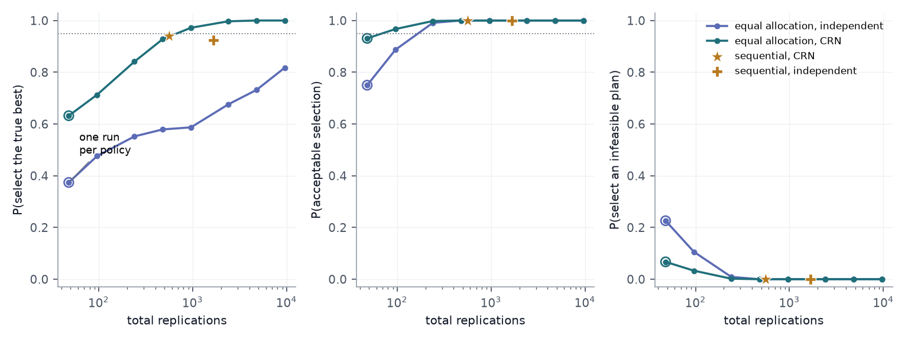

**Probability constraint.** With P(TT > 540 s) ≤ 0.012, the sequential procedure selected a clearly infeasible plan in 9.4 % of macro-replications (CRN, 1,591 runs) — above α. The per-replication exceedance share is mostly zero with occasional spikes, far from normal. Batch means of 10 replications restored the behaviour (0.4 % infeasible) at 5,798 runs. The single-run approach picked an infeasible plan 38.5 % of the time.

**CRN and recycled observations.** Over the 1,128 plan pairs the median CO₂ correlation under CRN is 0.95 and the median variance-reduction factor of a difference is 13.7 (IQR 8.1–23.3, minimum 2.6); for best vs runner-up it is 37.8 (s.d. 1.74 g vs 10.70 g). With 50 replications per plan the 95 % half-width for that difference is 0.49 g paired vs 2.98 g independent; only the former resolves a 0.71 g gap. For four thresholds, recycling cut feasibility determination from 6,131 to 2,325 replications and constrained selection from 2,805 to 979 (CRN; 11,043 to 3,898 independent), with every feasibility decision correct in ≥ 99.9 % of macro-replications.

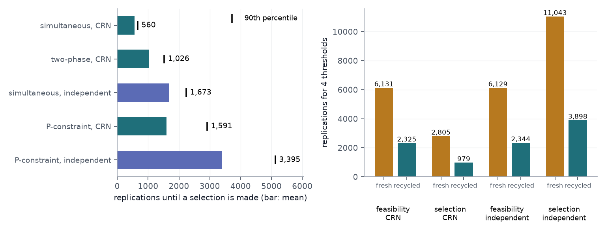

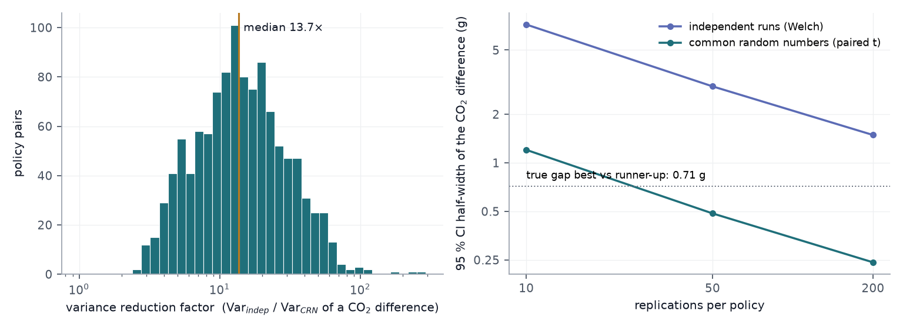

**Demand.** At demand ×0.85 the best plan switches to the 90 s cycle (saving 19.96 %; sequential: 99.8 % exact, 492 runs). At ×1.15 a single plan is feasible (120 s cycle, 40 km/h wave; 474.4 s; saving 17.76 %), inside the tolerance band: the procedure selected it in 77.8 % of macro-replications and reported "no feasible plan" in 22.2 % — allowed by the ε-tolerance, never an infeasible pick — while the single-run approach chose an infeasible plan 64.6 % of the time.

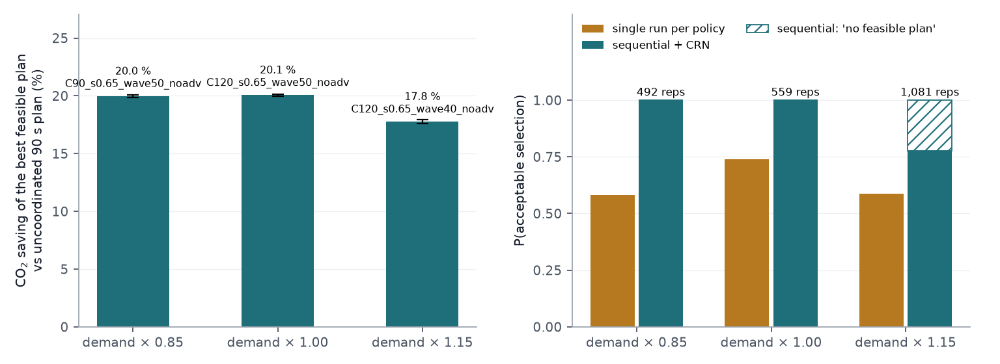

**What §4 establishes, and what it does not.** It establishes that these procedures, as implemented here, attain their nominal guarantee on a problem whose truth is known, and it quantifies what CRN is worth when the competing systems share their entire random input. It establishes nothing about Seoul: the corridor is invented.

## 5 The route choice, with a statistical guarantee

§3.6 chose a route the way the archived report chose one, only with eight replications instead of a single run: simulate every arm a fixed number of times, take the smallest mean, report an interval afterwards. That design cannot say how likely its answer is to be right, cannot say when it has run enough, and on this problem it ran out of resolution exactly where the decision was interesting. This section replaces it with the machinery of §4, applied to the same five routes on the same real network.

### 5.1 The decision problem on the real network

A driver's question is not "which route has the lowest CO₂" but "which has the lowest CO₂ among those I would actually accept". That is a constrained selection problem, with both outputs random and both read from the same SUMO run:

$$
\underset{i\in\{\mathrm{A,\,B,\,C,\,shortest,\,fastest}\}}{\text{minimise}}\ \ \mathbb E[\mathrm{CO_2}_i]
\quad\text{subject to}\quad \mathbb E[\mathrm{T}_i]\le q
\tag{6}
$$

where $\mathrm{T}_i$ is the door-to-door trip time. **q is an input from the driver, not an estimate**, so it was fixed in advance as a grid of round numbers — 20, 21, 22, 23 and 24 minutes — and all five are answered from one pool of replications; the headline below is the middle of that stated range by rule, not by which answer it gives. The indifference zone is δ = 25 g of CO₂ (0.9 % of a trip, 1.6 g/km) and the feasibility tolerance ε = 10 s on a trip of about twenty minutes, with α = 0.05 and n₀ = 10, so the nominal guarantee is P(correct selection) ≥ 0.95. Both were fixed before the 320-replication bank was built — but with the eight-replication table of §3.6 already in view, so they are not innocent of the data, and §5.4 reports the whole δ sweep rather than resting on the one value.

One replication is one background-demand draw: `randomTrips.py` with seed *j*, and SUMO's own seed *j*. Every arm of replication *j* is that one draw with a different ego route — the same CRN implementation as §3.6. Macro-replications bootstrap rows of the bank with replacement; under CRN all five arms take the same rows, which is exactly what one demand draw does.

### 5.2 Ground truth: 320 replications instead of 8

The bank is 5 arms × 320 background-demand draws = 1,600 SUMO runs (`results/sumo_truth.json`). It is the same experiment as §3.6 with forty times the replications, and it is what the selection results below are scored against. **It inherits §3.5's demand assumption unchanged: the background traffic never congests, the ego averages 47 km/h where the archived report measured 23.9 km/h in real traffic, and every CO₂ and trip-time figure in this section is therefore a free-flow figure.** What is being demonstrated here is a decision procedure on a real network, not a claim about how much CO₂ a Seoul commuter would actually save.

| Route (320 replications) | CO₂ g | ±95 % | s.d. | trip time s | ±95 % | s.d. | g/km |
|---|---|---|---|---|---|---|---|
| A — Olympic-daero | 3,354.5 | 9.1 | 82.7 | 1,333.4 | 13.7 | 125.4 | 178.6 |
| B — Nambu Sunhwan-ro | 3,285.3 | 8.6 | 78.1 | 1,432.0 | 15.6 | 142.5 | 177.7 |
| C — Gangnam Sunhwan-ro | 3,458.0 | 6.9 | 62.9 | 1,386.2 | 15.2 | 138.3 | 174.4 |
| shortest | 2,765.3 | 6.9 | 63.2 | 1,241.0 | 13.3 | 121.1 | 181.1 |
| **fastest** | **2,752.0** | 6.7 | 60.8 | **1,208.3** | 12.9 | 118.2 | 177.1 |

The means barely moved from §3.6 — the fastest route goes from 2,767.4 to 2,752.0 g — but the intervals shrank about six-fold, and that is the whole difference between a table that can decide something and one that cannot.

| Budget q | feasible routes | least-CO₂ feasible | runner-up | gap |
|---|---|---|---|---|
| 1,200 s (20 min) | *none* | *none* | — | — |
| 1,260 s (21 min) | shortest, fastest | **fastest** | shortest | 13.3 g |
| 1,320 s (22 min) | shortest, fastest | **fastest** | shortest | 13.3 g |
| 1,380 s (23 min) | A, shortest, fastest | **fastest** | shortest | 13.3 g |
| 1,440 s (24 min) | A, B, C, shortest, fastest | **fastest** | shortest | 13.3 g |

The constraint does real work, but not the work one might expect: it removes the report's three corridors, which are slower *and* higher-emitting, so it never binds at the optimum. The fastest path is the answer at every budget that admits anything at all — and at a 20-minute budget the answer is that **no route qualifies**, which is a third kind of answer a fixed-budget comparison has no way to give.

### 5.3 What the procedures attain, and what they cost

At the headline budget q = 1,320 s the true best feasible route is `fastest` and the runner-up `shortest` is 13.3 g behind — **inside** the δ = 25 g indifference zone, so as in §4.3 the indifference-zone assumption fails for *exact* selection and what the procedure is entitled to control is an *acceptable* one.

| Method (1,000 macro-replications) | SUMO runs | P(exact best) | P(acceptable) | P(infeasible) | hit the ceiling |
|---|---|---|---|---|---|
| One run per arm, independent | 5 | 0.544 | 0.965 | 0.027 | — |
| One run per arm, CRN | 5 | 0.476 | 0.842 | 0.000 | — |
| Flat 8 per arm, independent | 40 | 0.695 | 0.998 | 0.001 | — |
| **Flat 8 per arm, CRN — the budget §3.6 spent** | **40** | **0.742** | 0.986 | 0.000 | — |
| Flat 30 per arm, CRN | 150 | 0.925 | 1.000 | 0.000 | — |
| **Sequential KN + feasibility (simultaneous), CRN** | **490** (p90 895) | **0.956** | **1.000** | **0.000** | 0.000 |
| Sequential (simultaneous), independent | 429 (p90 687) | 0.958 | 1.000 | 0.000 | 0.000 |
| Sequential (two-phase), CRN | 1,716 (p90 6,000) | 0.833 | 0.873 | 0.000 | 0.127 |

**The attained probability of correct selection is 0.956 against a nominal 0.95**, with every selection acceptable, at a cost of 490 SUMO runs against the 40 of §3.6 — which themselves attain 0.742. Three things in that table are worth saying plainly.

*The guarantee is not free, and it is not cheapest.* A flat 30 replications per arm reaches 0.925 on 150 runs, less than a third of the sequential budget. The sequential procedure's value is not efficiency: it is that it stops by itself with an error bound attached, whereas "thirty is enough" is a statement only available after the truth is known. This is the same conclusion §4.4 reached on the synthetic corridor, and it survives the move to a real network.

*CRN does not make the sequential procedure cheaper here* — 490 runs with it against 429 without. The dominant cost on this problem is the feasibility check, and feasibility is a statement about one arm's own mean against q, not about a difference between arms, so sharing a draw cannot sharpen it. §5.5 shows that CRN does little for the differences either, and why.

*The simultaneous variant matters.* Running feasibility to completion first (two-phase) costs 1,716 runs and hits the replication ceiling in 12.7 % of macro-replications, because it insists on settling every arm's feasibility even when that arm has already lost on CO₂ to a rival already declared feasible. The simultaneous variant lets such an arm leave without its feasibility ever being resolved.

| Budget q | true best | sequential CRN runs | P(exact) | P(acceptable) | P(infeasible) | P(reports "none") | flat 8/arm: P(exact) / P(infeasible) |
|---|---|---|---|---|---|---|---|
| 1,200 s | *none* | 2,069 | 0.772 | 0.772 | **0.000** | 0.772 | 0.562 / **0.072** |
| 1,260 s | fastest | 784 | 0.956 | 0.999 | 0.000 | 0.000 | 0.679 / 0.000 |
| 1,320 s | fastest | 490 | 0.956 | 1.000 | 0.000 | 0.000 | 0.742 / 0.000 |
| 1,380 s | fastest | 329 | 0.956 | 1.000 | 0.000 | 0.000 | 0.753 / 0.000 |
| 1,440 s | fastest | 252 | 0.956 | 1.000 | 0.000 | 0.000 | 0.753 / 0.000 |

The 20-minute budget is the interesting failure. No route is quick enough, and the fastest one misses by 8.3 s — less than the ε = 10 s tolerance, so it sits inside the band where the procedure is allowed to decide either way, against a trip-time standard deviation of 118 s. The sequential procedure answers "no route meets this budget" in 77.2 % of macro-replications and runs into the 1,200-replication ceiling in the remaining 20.9 %; what it never does, in a thousand macro-replications, is recommend a route that breaks the budget. The fixed budgets do: one run per arm recommends one 35.4 % of the time, and the eight-per-arm design of §3.6 still does so 7.2 % of the time. That is the same behaviour §4.4 measured on the synthetic corridor at demand ×1.15, reappearing on a real network for the same reason.

### 5.4 Shortest versus fastest, settled — at a stated zone

§3.6 reported +10.7 ± 35.0 g and had to leave it there. Over 320 paired replications the difference is

**shortest − fastest = +13.35 g, 95 % paired CI [+7.87, +18.82]** (`results/sumo_truth.json`).

The interval excludes zero, so the fastest path really is the lower-CO₂ route — by 0.49 % of the trip, 0.86 g/km — and it also arrives 32.7 s earlier, so nothing is traded away. That settles the direction. It does not by itself settle the *decision*, because a decision needs a zone:

| δ (g) | indifference-zone assumption | P(procedure returns `fastest`) | SUMO runs | p90 |
|---|---|---|---|---|
| 50 | violated (δ > 13.3) | 0.807 | 20 | 20 |
| **25 — the stated zone** | **violated** | 0.882 | 27 | 44 |
| 20 | violated | 0.909 | 36 | 62 |
| 15 | violated | 0.940 | 50 | 90 |
| **10** | **holds (δ < 13.3)** | **0.977** | **83** | 152 |
| 5 | holds | 0.998 | 189 | 334 |
| 2.5 | holds | 1.000 | 407 | 668 |

**At the indifference zone this project stated in advance, the two routes are not separated.** δ = 25 g was chosen as a difference a driver would not care about, and the true difference — 13.3 g, about a fifth of a gram per second of idling — is smaller than that. Inside its own zone the procedure is entitled to return either arm, and reporting them as indistinguishable at that zone is the correct answer, not a failure. It is also the answer a fixed budget could never have justified: §3.6 did not know whether the gap was 0 g or 45 g.

**Tighten the zone to δ = 10 g and the guarantee applies, and the procedure separates them**: it returns `fastest` in 97.7 % of 1,000 macro-replications, against the nominal 0.95, for 83 SUMO runs — roughly twice what the entire five-arm fixed design of §3.6 spent, on a two-arm question it could not answer at all. Below that the cost climbs steeply for very little: 189 runs at δ = 5 g, 407 at δ = 2.5 g.

So the honest statement of the result is a sentence with a number in it: *the fastest path emits 13.3 ± 5.5 g less CO₂ than the shortest path; at an indifference zone of 25 g they are the same route, and at a zone of 10 g the fastest path wins with probability at least 0.95 for about 83 simulation runs.*

### 5.5 Why common random numbers worked on the corridor and barely work here

§4.4 measured a median variance-reduction factor of 13.7× on the synthetic corridor. §3.6 measured 0.48×–2.28× on the real network — "sometimes nothing at all". That contrast is a genuine finding, and with 320 replications it can be taken apart rather than asserted (`results/sumo_crn_gap.json`).

**First, the §3.6 range was mostly measurement noise.** A variance-reduction factor is a ratio of two estimated variances, and eight replications do not estimate either one well:

| replications used to estimate the VRF | min | median | max | pairs reading below 1× |
|---|---|---|---|---|
| 8 | 0.63× | 1.08× | 1.95× | 4 of 10 |
| 16 | 1.41× | 2.39× | 4.95× | 0 |
| 32 | 1.50× | 2.04× | 4.70× | 0 |
| 64 | 1.34× | 1.86× | 4.36× | 0 |
| 128 | 1.36× | 1.53× | 3.23× | 0 |
| 256 | 1.18× | 1.40× | 3.20× | 0 |
| 320 | 1.16× | 1.39× | 3.10× | 0 |

At eight replications four of the ten route pairs read below 1×, which is what produced §3.6's "sometimes less than nothing". At 320 none do. **CRN does help on the real network — by a median factor of 1.39×, never less than 1.16× — it is simply about ten times weaker than on the corridor, and the eight-replication estimate of it was not to be trusted.** The §3.6 numbers stand as what eight replications showed; this is what they were estimating.

**Second, the shared draw is shared in name more than in effect.** Every arm of replication *j* loads the same demand file and passes SUMO the same seed. If that produced a common traffic state, a statistic of the *background fleet* would be nearly identical across arms. It is not: the fleet's mean time loss averages 74.54 s with a standard deviation of 2.15 s between replications, but changing only the ego's route moves it by 0.94 s within a replication — 44 % of the between-replication spread, from re-routing one car out of 2,100.

**Third, and decisively: holding the shared draw fixed removes none of the ego's variance.** Running one arm 24 times with the background demand file held fixed and only SUMO's own seed varying gives a CO₂ standard deviation of **67.6 g** — against 53.5 g when the demand seed varies too, and 60.8 g over the full bank. Within the noise of 24 runs these are the same number. Essentially all of the ego's variability is SUMO's internal randomness *given* the demand, not which demand was drawn; and that internal randomness is not shared across arms, because a different ego route makes SUMO consume its random stream in a different order. This is the classic synchronisation failure: a common seed is not common random numbers unless the competing systems use the draw the same way at the points that matter to the output.

**Fourth, what correlation there is tracks how much road two routes have in common.**

| pair | shared road | Jaccard by length | ρ(CO₂) | VRF |
|---|---|---|---|---|
| shortest vs fastest | 11.28 km | 0.643 | +0.678 | 3.10× |
| B vs fastest | 6.76 km | 0.273 | +0.286 | 1.38× |
| B vs shortest | 6.37 km | 0.255 | +0.164 | 1.19× |
| B vs C | 3.27 km | 0.101 | +0.200 | 1.24× |
| C vs shortest | 2.30 km | 0.075 | +0.258 | 1.35× |
| C vs fastest | 2.30 km | 0.074 | +0.339 | 1.51× |
| A vs B | 2.28 km | 0.071 | +0.141 | 1.16× |
| A vs shortest | 1.96 km | 0.066 | +0.292 | 1.39× |
| A vs fastest | 1.96 km | 0.065 | +0.419 | 1.67× |
| A vs C | 1.11 km | 0.031 | +0.496 | 1.92× |

The one pair that shares a lot of road — the two direct paths, 11.28 km in common — is also the only pair with a correlation above 0.5 and the only VRF above 2×. Across all ten pairs the linear relationship is r = 0.543, but the rank correlation is −0.176: **it is that single high-overlap pair carrying the relationship, not a smooth trend**, and among the eight pairs that share under 3 km the correlation wanders between 0.14 and 0.50 with no ordering by overlap at all. Nor is the residual a network-wide "busy draw" factor: the correlation between an arm's CO₂ and the replication's own background-fleet time loss is between −0.01 and +0.11 for all five arms.

Put together, the mechanism is not mysterious. On the synthetic corridor the competing systems are signal plans, every plan faces literally the same vehicles arriving at the same instants, and the output is a fleet average over those same vehicles — the shared draw *is* the dominant input to the output, and ρ = 0.95 follows. On the real network the competing systems are routes, the output is one car's trip, that car meets a nearly disjoint set of background vehicles on each route, and SUMO's stream desynchronises as soon as the routes diverge. The demand file is shared; almost nothing that determines the answer is. **CRN is not a property of the seed; it is a property of how the systems consume the draw** — and that is a lesson the synthetic corridor, where synchronisation is easy, could not have taught on its own.

## 6 The earlier toy-network RL stage

An earlier version of this project rebuilt the report's second stage on a **hand-made** eleven-node graph whose lengths and signal densities were round numbers I chose. That graph is not the headline of anything any more, but its code and results are kept unchanged (`src/network.py`, `src/rl.py`, `src/planners.py`, `results/experiments.json`): on that toy, Q-learning closed 99.3 % of the static-to-optimal CO₂ gap over 64 seeds and beat the best static path by 44.06 ± 0.32 g per trip, with CRN variance reductions of 2.7× to 309×. Those numbers describe a graph I invented and are labelled as such; `media/route_race.*` and `media/policy_map.*` animate that stage, and `media/toy_drive.*` is its single-car animation, superseded on the real road by Animation 1. The real-network stages above have no learning in them — with five candidate routes and a near-free-flow network there is nothing for a policy to adapt to.

## 7 Limitations & next steps

- **The demand on the real network is not real and does not congest.** The simulation sits near free flow at 47–50 km/h where the report measured 23.9 km/h in traffic, so **every CO₂ figure in §3.6 and §5 is a free-flow figure.** Concentrating demand on the corridors — or obtaining the 2022 Seoul traffic-volume survey the report itself used, which needs an API key I do not have — is the single change that would matter most, and it would change the selection problem too: a congested network would give CRN something to cancel.
- **The synthetic corridor of §4 is not a road.** Geometry, demand, turning shares and driver parameters are assumed; traffic is one-way with no lane changing, pedestrians, buses or spillback, and side streets are point queues. Its 20 % saving is a property of that model, and its emissions model rests on six anchor values and invented speed traces.
- **Corridor B is not quite the report's route B.** Two of its named roads had to be dropped because the classified extract carries no direct link between them; the resulting route is 3.6 % shorter than the report's stated total but omits the 강남순환로/경부고속도로 hop.
- **Corridor A is 2.2 km longer than the report's four simulated segments.** Whether the report's segments cover the whole door-to-door trip cannot be established from the document.
- **HBEFA3 is a fleet-average curve.** `PC_G_EU6` carries no displacement or kerb weight; the Grandeur's 1,620 kg is above the European fleet average behind that curve. The 60 km/h agreement with the rated 143 g/km is one point of contact, not a validation.
- **Driver behaviour, lane choice and signal programs are SUMO defaults.** The signals are real intersections but their timings are guessed by `netconvert`, not measured.
- **Statistics.** Macro-replications resample a finite bank rather than running fresh simulations, on both networks. On the synthetic corridor δ and ε were fixed after a 32-replication pilot; on the real network they were fixed before the bank was built but after the eight-replication table of §3.6 — neither is innocent of the data, which is why §5.4 reports a δ sweep. The probability-constraint variant of §4.4 shows that normality matters and that batching is a blunt fix; Rinott's two-stage procedure was not run.
- **The real-network "truth" is itself an estimate.** The 320-replication bank gives the best arm a 95 % interval of ±6.7 g, and the shortest-versus-fastest gap it resolves is 13.3 g — 2.4 times its own interval half-width. That is enough to call the direction settled and not enough to make the bank means exact; a procedure scored against them inherits that.
- **The 20-minute budget is unresolvable, not merely expensive.** The fastest route misses it by 8.3 s, inside the ε = 10 s tolerance, so no number of replications is required to decide it and none would. The procedure is right to stop and say so, but the result is a property of where the budget was placed.
- Next: corridor-weighted demand, the selection re-run on a congested network, a time-dependent routing baseline, and a learning agent only once the network is congested enough for one to have something to learn.
