## Abstract

*Course project submitted with Jaemin Kim and Youngjin Son as co-authors (IIE 6103, Yonsei).
I carried out the original work — data collection, queueing model, simulation, cost analysis,
figures and write-up — and the audit and reanalysis below are mine, done in September 2026.
So Part A is a re-examination of my own analysis, not of someone else's.*

The 2025 report **Stochastic Modeling of Cryptocurrency Exchange Traffic** argues that raw
BTC/USDT arrivals are far too bursty for M/M/c, that an adaptive transaction-time rule
$K^*(\lambda)\propto\lambda^{-1}$ restores near-Poisson behaviour, that Erlang-C then sizes
an exchange at one to three nodes under a 100 ms SLA, and that dynamic provisioning avoids
millions of dollars of slippage for a few dollars a day. **Part A** recomputes fifteen of its
numbers from the project's own shipped CSVs: eleven reproduce exactly, four do not, and two
of those — CV 2.72 and variance-to-mean ratio 111 — exist nowhere in the repository except as
literals in two figure scripts. **Part B** re-runs the statistics on 1.30 GB of the tick
data. The over-dispersion is not the intraday rate: inside a single minute the 1 s counts are
still 36.6 times over-dispersed. The binning exponent, fitted within a day rather than across
seven, is $+0.62$, not $-1$. And on the real arrival stream the SLA the report declares
comfortably met needs about 48 nodes rather than one.
**Parts C and D** size capacity under a posterior instead of a point rate. A Cox model
with a filtered posterior is either over-confident or, with a heavy-tailed burst law, about
four times too generous. Modelling same-millisecond trades as batches, with a size law that
adapts block by block and a learned surrogate of the queue simulator, brings capacity close
to the after-the-fact minimum and makes the decision cheap enough to re-solve every minute.
It still promises about 97 % and delivers 63–95 %: the batch sizes are not independent in
time, and the model treats them as if they were.

## 1 Introduction

An exchange is a queue: orders arrive, wait, and are matched. That framing is what lets an
operator turn a latency target into a server count through Erlang-C, and it depends entirely
on the arrivals being Poisson — which crypto trade flow obviously is not, a fact the original
report establishes in its own first result and then repairs with a change of clock.

**Part A** transcribes its claims with section references into
`results/original_report.json` and recomputes every derived quantity from
`results/original_csv/`, 23 files copied verbatim from the course project. The audit is
deliberately data-free: it asks only whether the report's sentences follow from the files it
shipped with. **Part B** is my own diagnostics, binning re-derivation, sizing and cost
rebuild on a subset of the tick data, run on the lab server.

**Parts C, D and D2** follow one question. If the model carries the uncertainty the problem
actually has, can a surrogate then control the decision and adapt it as the day moves? Part
C puts a posterior on the rate and dispersion of a Cox process. Part D moves the uncertainty
to where §4.4 and §4.7 found it, the size of the bursts: same-millisecond batches with a
size posterior that forgets old blocks, and a surrogate that makes the chance-constrained
choice of $c$ cheap enough to re-solve for every one-minute block. Part D2 adds sub-second
clustering of the batch epochs and a diagnostic of what is still missing.

## 2 Method

### 2.1 Dispersion, and dispersion a regime model could not remove

For counts $N$ in bins of width $w$,

$$
D(w) \;=\; \frac{\operatorname{Var}(N)}{\mathbb{E}[N]},
\qquad
\mathrm{CV}(w) \;=\; \frac{\sqrt{\operatorname{Var}(N)}}{\mathbb{E}[N]},
\tag{1}
$$

equal to 1 and $1/\sqrt{\mathbb{E}[N]}$ for a homogeneous Poisson process. Counts are strongly
dependent, so every interval is a moving-block bootstrap over 10-minute blocks. $D$ over a
whole day conflates clustering with the drift of $\lambda(t)$, so I also compute it *inside*
each 60 s and 300 s window — the part a regime-conditional M/M/c would still have to explain.

### 2.2 A test that allows the rate to move

The report's KS test is applied to raw gaps, which rejects a non-stationary Poisson process
as readily as a clustered one. I use time rescaling instead: with $\lambda(t)$ piecewise
constant on $b$-second blocks, the compensator increments

$$
e_i \;=\; \int_{t_{i-1}}^{t_i}\hat{\lambda}(u)\,\mathrm{d}u
\tag{2}
$$

are iid $\mathrm{Exp}(1)$ under the *inhomogeneous* Poisson null, so KS and Ljung–Box tests on
$\{e_i\}$ separate "the rate moves" from "arrivals cluster". At $n\sim10^7$ every $p$-value is
zero, so beside each KS statistic I report the statistic a genuine Poisson sample of the same
size gives — the only honest scale. Timestamps sit on a 1 ms grid with 37–61 % tied gaps, so
they are dithered inside their millisecond first, the undithered statistic kept alongside.

### 2.3 What the binning rule certifies

The rule takes every $K$-th trade as a bin edge and picks

$$
K^* \;=\; \arg\min_{K\in\mathcal{K}}\bigl|\,\mathrm{CV}(\Delta t_K) - 1\,\bigr| ,
\tag{3}
$$

$\Delta t_K$ being the clock duration of $K$ consecutive trades. For a Poisson process
$\Delta t_K\sim\mathrm{Erlang}(K)$, whose CV is $1/\sqrt{K}$ — so CV $=1$ is the Poisson value
only at $K=1$, and at $K=400$ it asks for a process twenty times more variable than Poisson.
What (3) certifies is that *batches* of $K$ trades arrive as a Poisson stream: an
$M^{[K]}/M/c$ model, not $M/M/c$. Exponential margins are not enough either — the durations
must be independent, which I test with Ljung–Box and the original never did. I solve (3) per
30-minute block, interpolated in $\log K$ so it is not snapped to a grid (four of the
original's seven day-level values sat on its floor of 25), fit
$\log K^* = a + b\log\lambda$ on one day, and apply the rule to the others.

### 2.4 Sizing, and the tail rather than the mean

With offered load $a=\lambda/\mu$ and Erlang-C $C(c,a)$,

$$
\mathbb{E}[W_q]=\frac{C(c,a)}{c\mu-\lambda},
\qquad
P(W_q>t)=C(c,a)\,e^{-(c\mu-\lambda)t},
\qquad
c^{*}=\min_{c\in\mathbb{Z}_{+}}\{c:\rho<1,\;P(W_q>t)\le\epsilon\},
\tag{4}
$$

$C$ from the Erlang-B recursion. Three things the report does not do are added: $c^*$ as a
function of the assumed $\mu$; the Allen–Cunneen correction
$\mathbb{E}[W_q]_{G/G/c}\approx\mathbb{E}[W_q]_{M/M/c}\,(c_a^2+c_s^2)/2$ with $c_a^2$
*measured*; and a trace-driven FCFS $G/G/c$ simulation fed the actual timestamps, with
deterministic, exponential and heavy-tailed ($c_s^2=4$) service.

### 2.5 Waiting time into dollars

The source computes $\text{cost}=V\sigma\sqrt{W}$ per order with $V$ = \$10,000 and
$\sigma=10^{-4}$ per $\sqrt{\text{s}}$ hard-coded. I keep the form and expose the inputs:

$$
\text{cost}_i \;=\; V_i\,\sigma\,\kappa\,\phi\,\sqrt{W_i},
\qquad
\kappa\in\{1,\;\mathbb{E}|Z|\},\quad \phi\in\{1,\;0.5\}.
\tag{5}
$$

$V_i$ is the measured notional of trade $i$; $\sigma$ is measured per day at five sampling
intervals; $\mathbb{E}|Z|=\sqrt{2/\pi}$ is a random walk's expected *absolute* displacement,
where the source charges the full $\sigma\sqrt{W}$ and so assumes every move is adverse; and
$\phi$ is the adverse fraction. With two baselines and two targets that is a 144-point
factorial, reported as a band.

### 2.6 A posterior for the arrival process, and a chance constraint on $c$

Everything above sizes against a *point* rate. Part C replaces it with a posterior and asks
whether the posterior's uncertainty is the uncertainty that matters. The day is cut into
60 s blocks and each block into bins of width $w$; counts are gamma-mixed Poisson,

$$
n_t \mid \Lambda_t \sim \mathrm{Poisson}(\Lambda_t),\qquad
\Lambda_t \sim \mathrm{Gamma}\!\left(r,\; \tfrac{r}{\lambda w}\right),
\qquad \mathbb{E}\,n_t=\lambda w,\quad \frac{\mathrm{Var}\,n_t}{\mathbb{E}\,n_t}=1+\frac{\lambda w}{r},
\tag{6}
$$

a Cox process whose intensity is redrawn every bin — negative-binomial counts, over-dispersed
down to the bin width and independent below it. The posterior over $(\log\lambda,\log r)$ is
exact on a $128\times64$ grid: the only term coupling counts to $r$ is
$\sum_t\log\Gamma(n_t+r)$, which comes from the histogram of counts. Block $b{+}1$'s prior is
a **discount filter**, $\log\pi_{b+1}=\delta\,\log p_b+(1-\delta)\log\pi^{\text{tod}}_{b+1}$
with $\delta=0.5$ and a time-of-day log-normal prior ($\sigma=1$) fitted on the in-sample day,
so sizing for a block uses only what was observable at its start. Because the trace clusters
at every scale (§4.2), a **nested** variant redraws the intensity twice — per second with
shape $r_1$, then per fine bin (10 ms or 1 ms) around the second's level with either a gamma
law (shape $r_2$) or a **log-normal** law ($\sigma_2$, mean-preserving); $r_2$ or $\sigma_2$
gets its own grid posterior from the fine counts conditioned on each second's observed total,
so the coarse dispersion cannot leak into it. For each block, $S=48$ parameter draws from the
predictive prior generate 60 s of arrivals, the FCFS $G/G/c$ simulator of §2.4 runs on a
ladder of $c$, and the Bayesian capacity is the chance-constrained

$$
c_{\text{Bayes}}=\min\{c:\;P_{\text{post}}\big[\,P(W_q>100\,\text{ms}\mid c)\le 0.01\,\big]\ge 0.95\},
\tag{7}
$$

scored against the **oracle** — the smallest ladder $c$ that actually held the SLA on that
block's real arrivals, knowable only afterwards — a plug-in at the posterior-mean parameters,
and Erlang-C at the predictive-mean rate. Three things are measured per block: whether the
chosen $c$ held on the real trace, how far it sits above or below the oracle, and whether the
real $P(W_q>100\,\text{ms})$ at $c_{\text{Bayes}}$ falls inside the 95 % posterior-predictive
interval. Nominal coverage is 95 %; anything far below it means the posterior is sharper than
the model is right.

### 2.7 Batches as the uncertainty this process has, and a surrogate to act on it

Part C ended with the burst-size distribution as the missing quantity. Part D models it
directly. Trades that carry the same millisecond timestamp are one **batch**, for example one
taker order sweeping several price levels, or several orders matched in one engine cycle. Each
day becomes a sequence of batch epochs with sizes $X_i\ge1$. The arrival process is then a
batch-arrival $M^{[X]}$-type stream, and the uncertainty that matters splits into two parts:
when batches come, and how large they are.

**Epochs** keep Part C's gamma-Cox law at 1 s bins, with the same exact grid posterior over
$(\log\lambda,\log r)$, the same discount filter ($\delta=0.5$) and the same time-of-day prior,
now fitted to batch epochs instead of trades. **Sizes** get a Dirichlet posterior over
$\{1,\dots,K_{\max}\}$, $K_{\max}=1024$, that forgets old blocks:

$$
p_b\sim\mathrm{Dir}(\alpha_b),\qquad
\alpha_b=\alpha_0\,p_0+C_b,\qquad
C_b=\gamma\,C_{b-1}+h_{b-1},
\tag{8}
$$

where $h_{b-1}$ is the size histogram of block $b{-}1$, $\gamma=0.5$ halves the weight of each
older block, and $\alpha_0=200$ pseudo-counts tie the posterior to $p_0$: the in-sample day's
empirical size law with a discrete Pareto tail of mass $10^{-3}$ above size 10 (Hill
exponent fitted on that day). This is where the model adapts: each block's histogram moves
the size law for the next block, and the epoch posterior moves with it. The size law for
block $b$ reads only blocks before $b$. On every day the code checks this at the middle
block: truncating the day there, or zeroing every later histogram, must leave its $\alpha_b$
unchanged.

One predictive draw is $\theta=(\lambda_b, r, p)$. It simulates a 60 s block: epochs from the
Cox law, sizes from $p$, every trade of a batch arriving at its epoch, then the FCFS $G/G/c$
queue of §2.4 ($\mu=100$/s, $c_s^2=1$) on the ladder of $c$. The capacity is still Eq. (7). It
is chosen by three controllers:

- **D-sim** estimates Eq. (7) by direct simulation, $S=48$ draws, as in Part C. It is run on
  Part C's 120-block subset (every 12th block) because it is the expensive one.
- **D-sur** replaces the simulator by a learned surrogate
  $g(\theta,c)\approx P(\text{SLA met in one simulated 60 s block}\mid\theta,c)$ and picks
  the smallest $c$ with $\frac{1}{S}\sum_{s} g(\theta_s,c)\ge0.95$ over $S=256$ predictive
  draws, the average made monotone in $c$. It runs on every block of every day. The surrogate
  sees only simulator output, never the real trace: 9,000 parameter vectors drawn over the
  in-sample day's range (rate from a tenth of the smallest to ten times the largest
  posterior-mean rate, $r$ over its whole grid, size laws taken from the posterior of a random
  busy in-sample block and tilted by $k^{\tau}$, $\tau\in[-0.5,0.5]$). Each is simulated once
  and labelled at all 16 ladder values, which gives 144,000 rows (the 11,219 whose job rate exceeds
  1.2 times the capacity of $c$ are labelled as missed without running the queue), split by parameter vector
  into 96,000 / 24,000 / 24,000. A small MLP on 11 summary features (rate, dispersion, size
  mean, second moment and 99th percentile, $P(X\ge10)$, $\log c$, load, overflow share,
  expected overflow jobs, expected epochs) is trained with cross-entropy, stopped early on the
  validation split, and recalibrated by isotonic regression on that split.
- **D-phys** uses no simulation at all. It takes the smallest $c$ with
  $\mathbb{E}[(X-\mu t\,c)^+]/\mathbb{E}X\le\epsilon$ under the size posterior, the share of
  jobs in a batch that $c$ servers cannot start within $t=100$ ms. It ignores both the
  clustering of epochs and the queue carried between batches, so it isolates what the size
  law alone can explain.

The plug-in (one simulated block at the predictive means) and Erlang-C (at
$\lambda_b\,\mathbb{E}X$) are kept from Part C. The oracle is unchanged, and the code asserts
that it equals Part C's on its subset. Besides whether the chosen $c$ held, D-sur reports the
probability it **promised** at that $c$, so the controller can be checked against the real
trace as a forecast.

### 2.8 Nested batch epochs (Part D2)

A 1 s Cox law spreads the epochs of a busy second uniformly over that second, so any clustering
of batches below one second is missing from Part D's simulator. Part D2 keeps Part D's coarse
filter and its size law unchanged and adds Part C's nested fine scale to the epochs. Inside
second $t$, the epoch count in 10 ms bin $j$ is

$$
n_{t,j}\mid\Lambda_t,M_{t,j}\sim\mathrm{Poisson}\!\bigl(\Lambda_t\,M_{t,j}\,w_f\bigr),
\qquad w_f=10\ \text{ms},\qquad \mathbb{E}M_{t,j}=1,
\tag{9}
$$

with $M$ either gamma (shape $r_2$) or mean-one log-normal ($\sigma_2$). The fine parameter
gets its own grid posterior and discount filter from the 10 ms epoch counts, conditioned on
each second's observed total, and its prior for block $b$ also uses only earlier blocks
(asserted for both laws). Both laws are run, and a one-step predictive log score on the
fine bins compares them.

D2-sim is D-sim on the nested simulator. D2-sur is retrained once per fine law on the same
design rules: 12,000 parameter vectors, 192,000 rows split 128,000 / 32,000 / 32,000, and
three more features (the fine parameter, its excess 10 ms dispersion, and the implied 10 ms
dispersion of jobs). The fine parameter is drawn over the range of the in-sample busy blocks'
posterior means, widened three-fold each way. Two controls test whether the retraining
matters: Part D's surrogate scored on the nested labels, and the same MLP trained without
the three fine features.

To find where the remaining error comes from, a **decomposition** runs two diagnostics. Both
use look-ahead on purpose and are not controllers:

- **Known parameters.** D-sim and D2-sim are re-run with the block's own posterior, after
  seeing the block, in place of the forecast. If this closes the gap, the forecast step is to
  blame. If it does not, the model's form is.
- **Size shuffle.** The real batch sizes of a block are permuted among its real epochs, within
  windows of 10 ms, 100 ms, 1 s or 60 s, and the oracle is recomputed. If sizes were
  independent of time, as every Dirichlet law in (8) assumes, permuting them would not change
  the servers needed on average.

## 3 Experiments

**Data.** Four BTCUSDT `aggTrades` days, 1.30 GB, 16.8 M trades, sha256 and row count per
file in `results/data_manifest.json`: **2024-10-01** (2,113,873 trades, λ = 24.47/s — the
original calibration day), **2024-10-05** (490,636, 5.68/s — calm Saturday, held out),
**2020-03-12** (1,654,839, 19.15/s — COVID crash, held out) and **2023-03-13** (12,578,777,
145.59/s — SVB, the report's headline stress window). The original corpus is 7.1 GB across
43 files and the shared server allows 2 GB per project; FTX (0.98 GB) and SVB (1.05 GB)
cannot both fit, so **the FTX, China-crackdown, Terra/Luna and 2024-Q1 claims are checked
only arithmetically** against the shipped CSVs, never against their trades.

**Compute.** `felabworkstation`, CPU only, 16 workers, `nice -n 10`, seeds fixed;
`step3_sizing.py` runs 168 trace simulations in 17.5 s at load average 3.50, and every JSON
records `/proc/loadavg`. Whole pipeline, about 3 minutes. Part C (`step5_bayes_sizing.py`,
2026-10-02, 64-core server, 16 workers, load average 13.95 at the end): 8 model variants
× 4 days × 120 blocks = 3,840 chance-constrained sizings, each 48 posterior draws on a
16-step ladder, 302 s wall; the filters run over all 1,439 blocks of every day. Part D
(`step6_batch_surrogate.py`, same server and workers, CPU only, load average 13.91 at the
end): surrogate training 54 s, of which 42 s is simulating its 9,000 labelled blocks, then
36–54 s per day to run D-sur, D-phys and Erlang-C on all 1,438 blocks and D-sim on 120.
Part D2 (`step7_nested_batch.py`): two surrogates in 93 s and 95 s, eight day × fine-law
evaluations and four decompositions, 862 s in all, load average 22.52 at the end. The
host's three RTX 3090s were not used; the MLP is small enough for the CPU.

**Tests.** 85 pytest checks, all passing on the server in 7.8 s, including Erlang-C against hand-worked table values, a
factorial-sum implementation and the M/M/1 and M/M/2 closed forms; the response-time tail at
its removable singularity; the simulator on hand-computed deterministic cases and against
Erlang-C on Poisson input; $\mathrm{CV}(\Delta t_K)=1/\sqrt{K}$ for a Poisson process; the
dispersion index against a negative binomial of known variance-to-mean ratio; time rescaling
accepting an inhomogeneous Poisson process and rejecting a clustered one; and a job-for-job
match between the animation's time-varying-$c$ queue and the fixed-$c$ simulator. For
Parts D and D2: same-millisecond grouping; the forgetting recursion (8) and its freedom from
look-ahead; the overflow statistic and the isotonic fit; the fine-mixing variance; the nested
simulator's mean and 10 ms dispersion; the jobs of a batch arriving together; no look-ahead
in the fine filter under either law; the predictive score preferring the law that generated
the data; the surrogate wrapper; and the windowed size shuffle keeping epochs fixed.

## 4 Results

### 4.1 Part A — the report against its own repository

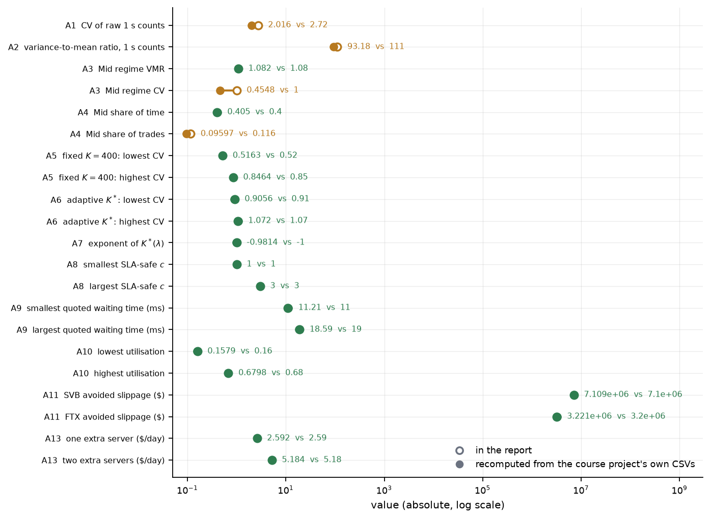

Eleven of fifteen reproduce, several exactly: the SLA-safe counts $c=1,2,1,2,3,1,1$, the
fixed-$K=400$ collapse to CV 0.516–0.846, the adaptive range 0.906–1.072, \$2.592 and \$5.184
a day for one and two extra `c5n.large` nodes, and the headlines \$7,109,157 (SVB) and
\$3,220,779 (FTX). The four that do not:

| | report | shipped CSV |
|---|---|---|
| CV of raw 1 s counts | 2.72 | **2.016** (`bin_dispersion.csv`) |
| variance-to-mean ratio | 111 | **93.18** (same file) |
| Mid-regime CV | 1.000 | **0.455** on the report's own count definition |
| Mid share of trades | 11.6 % | **9.60 %** |

`2.72` and `111.1` appear only in `figs_slide05_motivation.py` and `stock_vs_crypto_fig.py`,
labelled there as an *inter-arrival* CV — a different statistic from the count CV the report
defines in Eq. (5); the repository's own `FINDINGS.md` quotes 93. Six further items sit in
`results/original_report.json` as reproducible-but-mislabelled or contradicted:

| what the report says | what the repository does |
|---|---|
| p99 SLA with $\epsilon=0.01$ (§4.3) | `phase2_final.py` uses $10^{-3}$; at $0.01$ the same rates give $c=1,2,1,2,2,1,1$ |
| "theoretical waiting time 11–19 ms" | that column is the *response* time $\mathbb{E}[W_q]+1/\mu$; Eq. (11)'s queueing delay is **1.21–8.59 ms**, the rest is assumed service |
| "after recovering Poisson-like regions using $K^*(\lambda)$, we apply Erlang-C" | $K^*$ is a hard-coded column, printed and never used; $\lambda$ is the raw clock rate |
| "all seven stress regimes" recovered | the pass criterion coded in `multi_year_adaptive_K.py` flags **2 of 7**, and that script's own figure caption says so; neither FTX nor SVB is among them |
| \$7.1 M saved vs \$2.59/day | 300,000 orders spanning **25.5 minutes** against a *daily* cost, and $c=1\to3$ is two extra nodes, not one |
| $c=1$ as the comparison baseline | $\rho=1.46$ on SVB and 1.36 on FTX, so the "saving" is an unstable queue whose backlog grows with the simulated span |

Unverifiable from the repository at all: $\mu$ (never measured — a throughput column in an AWS
price list, and every $c$ scales with it) and $\beta$, $\sigma_{r,s}$ of Eq. (18), one constant
for all regimes fused with the order size. Its own `optimal_c_empirical_vs_theory.csv` records
$c=15$ from trace simulation against $c=4$ from Erlang-C — a gap the report never mentions and
that §4.4 reproduces at much larger scale.

### 4.2 The over-dispersion is not the intraday rate

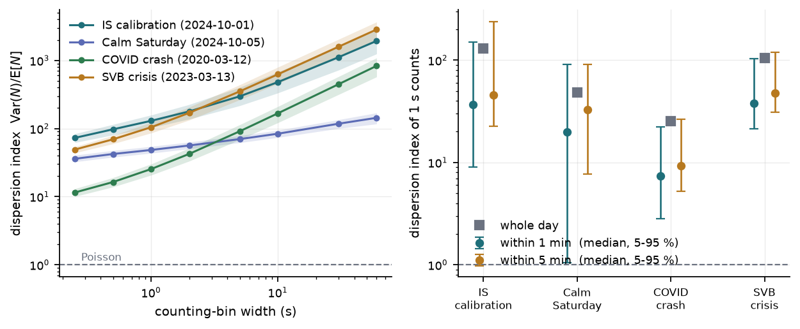

At 1 s bins the calibration day gives $D = 129.7$ (95 % CI 103.2–157.6) and CV $= 2.30$
(2.10–2.53): the report's 111 sits inside that interval, its 2.72 outside on all four days.
But $D$ climbs with bin width everywhere — 72.9 at 0.25 s, 129.7 at 1 s, 1,930 at 60 s here,
2,839 at 60 s on SVB — so a variance-to-mean ratio quoted without its bin width is not a
well-defined quantity.

The decisive number is local. Restricting the variance to a single minute, which removes
essentially all of the session's rate drift, still leaves a median $D$ of **36.6** on
2024-10-01, 19.8 on the calm Saturday, 7.4 on the COVID day and 38.1 on SVB, with 0.2 % of
minutes consistent with Poisson.

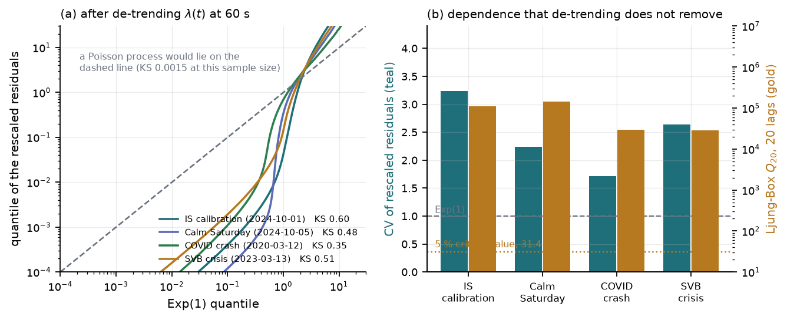

Rescaling confirms it. After removing $\lambda(t)$ at 10 s, 60 s or 300 s — the KS statistic
barely moves between them — the residuals have CV 1.7–3.4 against 1.0 for $\mathrm{Exp}(1)$,
KS 0.35–0.60 where a true Poisson sample of the same size gives 0.0004–0.0014, and
Ljung–Box $Q_{20}$ from $2.8\times10^4$ to $1.4\times10^5$ against a 5 % critical value of
31.4. This is not a Poisson process with a moving rate; it clusters.

### 4.3 The binning rule does not transfer

Panel (a) is the methodological point: the target CV $=1$ sits far above the $1/\sqrt{K}$
curve a Poisson process obeys. At the $K^*$ the fitted rule selects the normalised CV is still
3.9–7.0 — four to seven times more variable than Poisson even where the criterion is satisfied
— and in 98–100 % of blocks Ljung–Box rejects independence of the very durations the rule has
just made exponential.

Fitting $\log K^*$ on $\log\lambda$ across 47 half-hour blocks of 2024-10-01 gives
$b = +0.62$, bootstrap 95 % CI $[0.35,\,0.90]$, $R^2=0.34$: at this resolution the report's
$\lambda^{-1}$ has the opposite sign. The day-level exponent does come out at $-0.98$ on the
seven shipped points, but with $r=-0.65$ and four values censored at the grid floor — what it
tracks is the amplitude of each day's intraday swing, not its rate.

| day | median CV under the fitted rule | in [0.95, 1.05] | fixed $K=400$ |
|---|---|---|---|
| 2024-10-01 (in sample) | 1.003 | 30 % | 0.517 |
| 2024-10-05 calm | 0.967 | 21 % | 0.595 |
| 2020-03-12 COVID | 0.633 | **2 %** | 0.412 |
| 2023-03-13 SVB | 0.574 | **0 %** | 0.439 |

It beats fixed-$K$ everywhere and still misses its own band on 70 % of in-sample blocks and
every SVB block. The median bin duration $K^*/\lambda$ it picks is 1.2–4.0 s across days, so
in practice the rule amounts to "count in a clock window of a few seconds" — not the
volume-clock subordination the method section invokes.

### 4.4 Sizing: the formula and the trace disagree by a factor of forty

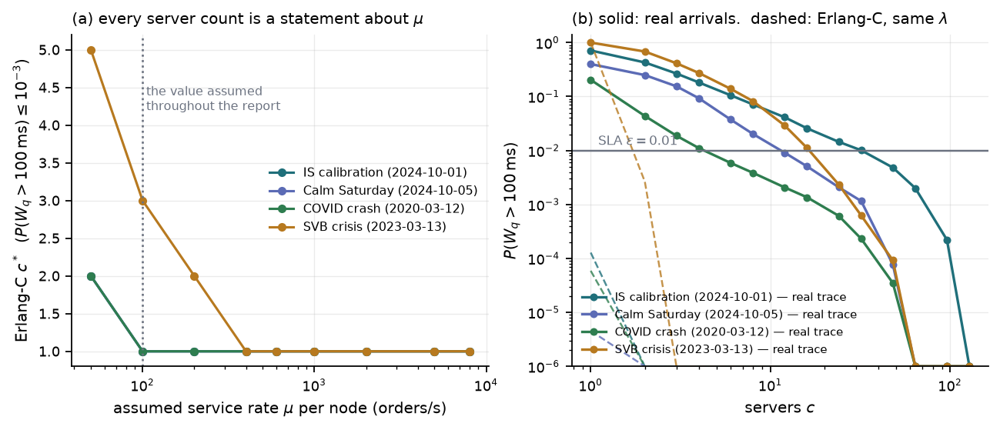

Erlang-C reproduces the report exactly, and panel (a) shows what it rests on: at $\mu=50$ the
SVB day needs $c=5$, at 100 it needs 3, at 200 it needs 2, and from 400 upward one node is
enough. Since $\mu$ is never measured, "$c=1$ to $c=3$" restates the assumption. Panel (b) is
the result that matters — the real timestamps in an FCFS $G/G/c$ queue at $\mu=100$:

| day | Erlang-C $c^*$ | mean $W_q$ there, Erlang-C | mean $W_q$ there, real trace | $c$ for $P(W_q>100\,$ms$)\le0.01$ on the trace |
|---|---|---|---|---|
| 2024-10-01 | 1 | 3.24 ms | **34,631 ms** | **≈ 48** |
| 2024-10-05 | 1 | 0.60 ms | 254 ms | ≈ 12 |
| 2020-03-12 | 1 | 2.37 ms | 734 ms | ≈ 6 |
| 2023-03-13 | 3 | 1.43 ms | 8,916 ms | ≈ 24 |

A synthetic Poisson control at the identical $\lambda$ lands on the formula (3.244 ms against
3.239 ms on 2024-10-01), so the gap is the arrival process, not the simulator. The service
distribution barely matters — $c_s^2 = 0$, 1 and 4 agree to within one ladder step — so the
usual M/G/c refinement is second-order and the burstiness is everything; Allen–Cunneen with
the measured $c_a^2 = 11.35$ predicts 20.0 ms where the trace gives 34.6 s, so a first-order
correction does not rescue the mean either. The $M^{[K]}/M/c$ model the binning rule actually
certifies fits far better: at $K^*=37$, $c=1$ it gives a 243 ms mean wait and
$P(W_q>100\,\text{ms})=0.77$ against the trace's 0.71. The transaction clock was the right
idea; carrying its output back into an $M/M/c$ formula is where it was lost.

### 4.5 The dollar argument, as a band

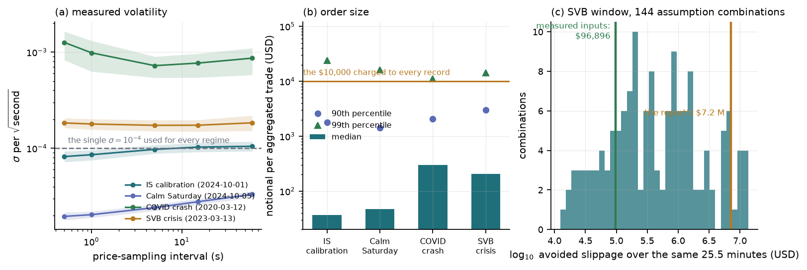

Two hard-coded inputs can be measured from the same files. The assumed $\sigma=10^{-4}$ per
$\sqrt{\text{s}}$ is close to right on the calibration day ($8.6\times10^{-5}$ at 1 s,
$1.03\times10^{-4}$ at 15 s) and wrong by five times on the calm Saturday and ten on the COVID
day — accurate exactly where it was chosen. The order size is not close: the median notional
of an aggregated trade is \$37 on the calibration day and \$205 on SVB, against the \$10,000
charged to every record.

Across the 144 combinations the SVB saving runs from **\$12,482 to \$13,709,943**, a factor of
1,098, median \$383,834, with the report's \$7.16 M one point in that band. By influence:
\$2.86 M median with the assumed notional against \$82 k with the measured median; \$824 k
against the $c=1$ baseline against \$160 k against the smallest stable $c$; \$554 k with every
move adverse against \$277 k with half. Measured notional, 15 s volatility, half the moves
adverse, the $\mathbb{E}|Z|$ factor and a feasible baseline give **\$96,896**, 74 times below
the headline. The operator side on the same window is **\$0.092**; even at \$96,896 the ratio
favours provisioning by six orders of magnitude, so the report's *conclusion* survives
comfortably. The precision of "\$7.1 million" does not.

### 4.6 Watching it

<figure class="vid">
  <video src="/projects/exchange-queueing/media/queue.mp4" autoplay loop muted playsinline preload="metadata" poster="/projects/exchange-queueing/media/queue.jpg"></video>
  <figcaption>Animation — real BTCUSDT arrivals driving two matching engines, 12.5 s. Act 1
  is a 90th-percentile 15-second window of the calm Saturday (12.4 trades/s), act 2 the same
  percentile window of the SVB day (247.6 trades/s). <em>Static</em> is the report's own
  calm-regime answer, Erlang-C at the calm day's λ, giving c = 1; <em>dynamic</em> re-runs
  that rule every second on the trailing one-second rate. In act 2 static reaches 2,252
  waiting orders and an 11.3 s mean delay with 99.3 % of orders past the 100 ms line, while
  dynamic climbs to c = 4 and holds the mean at 134 ms — then watch what dynamic does
  <em>not</em> do: 45 % of its orders are still over the SLA, because the rule choosing c is
  an Erlang-C rule and the arrivals are not Poisson. For the calm act Erlang-C predicts a
  1.4 ms mean wait and a 0.002 % breach rate at c = 1; the real window gives 224 ms and 53 %.
  Every statistic is re-derived in <code>results/animation_check.json</code>.</figcaption>
</figure>

### 4.7 Bayesian sizing: calibrated only with a heavy-tailed burst law, and then four times the oracle

The oracle here is smaller than the whole-day figure of §4.4 (8.7 servers on average for
2024-10-01 against ≈ 48) because every block starts empty: a one-minute block cannot inherit
the backlog an eight-hour queue carries. That is the right comparison for a rule that is
re-sized every minute, and it is already a hard target — Erlang-C holds it on 0 % of the
in-sample blocks.

The single-scale model fails in the same way at every bin width. At 1 s bins the 95 %
chance constraint picks 2.7 servers where the oracle wants 8.7, holds the SLA on 7 % of
blocks, and the real tail probability lies **above** the 95 % predictive interval on 427 of
480 blocks across the four days — never below it. Going to 100 ms, 10 ms or 1 ms bins moves
coverage between 3 % and 31 %; at 1 ms it is worst, because a Cox process redrawn every
millisecond has no memory across milliseconds and the bursts last longer than that. The
posterior is not the problem: by block 100 the grid posterior on $(\lambda, r)$ is sharp,
and the filter tracks the day cleanly (Figure 9 — the 1 s dispersion index runs from 7 to 78
across the day, median 24). The problem is that *everything the posterior is uncertain about
is the wrong thing*. Nesting a second gamma scale inside the second helps — coverage 30–53 %,
SLA held on 39–57 % of blocks — but gamma mixing gives negative-binomial burst sizes, whose
tail is geometric, and the burst that breaks a block is far out in that tail.

| variant (2024-10-01, 120 blocks) | mean $c$ chosen | SLA held | excess over oracle | shortfall | 95 % interval coverage |
|---|---|---|---|---|---|
| gamma-Cox, 1 s | 2.72 | 7 % | 0.0 | 6.0 | 7 % |
| gamma-Cox, 100 ms | 4.47 | 31 % | — | — | 27 % |
| nested gamma, 1 s + 10 ms | 7.53 | 57 % | 2.0 | 3.2 | 53 % |
| nested log-normal, 1 s + 10 ms | 37.30 | 95 % | 29.4 | 0.9 | 96 % |
| nested log-normal, 1 s + 1 ms | 58.14 | 95 % | 50.1 | 0.6 | 94 % |
| oracle (after the fact) | 8.72 | — | — | — | — |

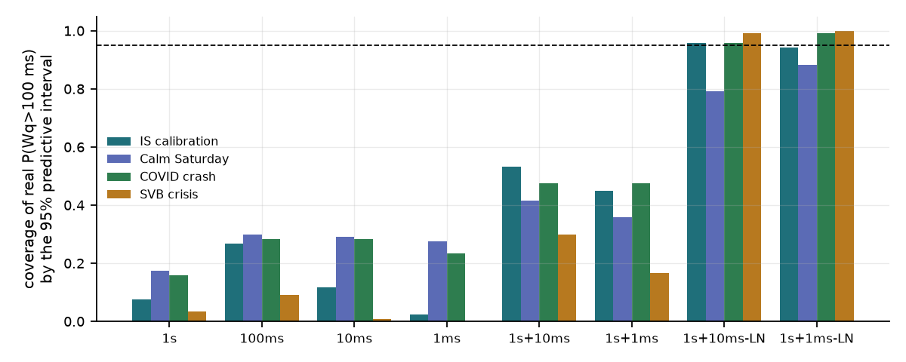

Replacing the fine-scale gamma with a log-normal is the one change that reaches nominal
coverage: 96 %, 79 %, 96 % and 99 % on the four days at 1 s + 10 ms, with the SLA held on
95 %, 79 %, 97 % and 99 % of blocks. The price is the row above it: 37 servers on average
where 9 would have done, an excess of 29 per block, 4.3× the oracle; at 1 ms the same rule
spends 58, and on the SVB day 108. The plug-in at the posterior mean of the same model
lands between (10.8 servers, SLA held 63 %), which says where the capacity goes — not into
the parameter posterior but into the 95th percentile of a burst law whose tail is now heavy
enough to cover the real bursts and heavier than most of them. Figure 10 shows the two rules
over the in-sample day: the Bayesian path sits a fixed factor above the oracle through the
calm night and opens to ten times above it during the 14:00–20:00 UTC session, exactly where
the filter's dispersion estimate climbs.

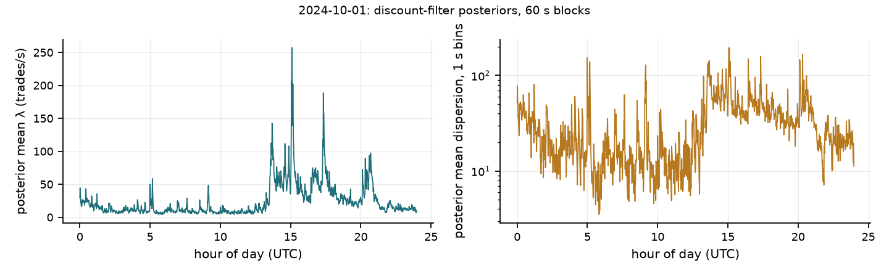

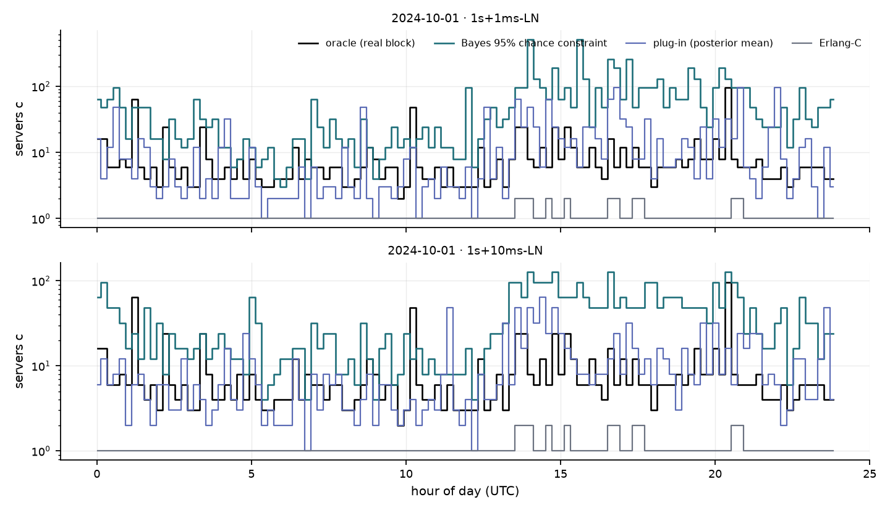

So the Bayesian treatment does what it should and the result is a negative one worth
stating plainly: with the arrival model held in the Cox family, posterior uncertainty over
the rate and dispersion is small and beside the point; the credible interval is honest only
once the burst-size law is heavy-tailed, and the heavy tail — not the data — then sets the
capacity. The number that is missing is the one the next model must carry: the empirical
distribution of burst sizes at the millisecond scale, which §4.4's $M^{[K]}/M/c$ already
pointed at, and which a Hawkes or batch-arrival likelihood would put a posterior on directly. Part D
(§2.7, §4.8) builds the second.

### 4.8 Batches and a surrogate controller: near the oracle, but over-confident on busy days

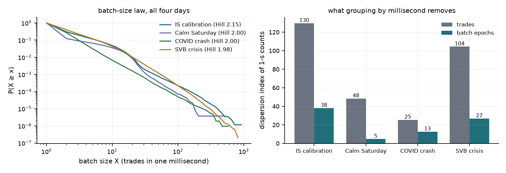

Grouping by millisecond changes the problem. On 2024-10-01 the 2,113,873 trades form 865,237
batches with mean size 2.44, median 1, 99th percentile 20 and maximum 916. Batches of ten or
more carry 34 % of the trades on that day, 33 % on the calm Saturday, 30 % on SVB and 8 % on
the COVID day. The tails are close to a power law with Hill exponent 2.15, 2.00, 2.00 and
1.98, at the edge of infinite variance. Most of the over-dispersion of §4.2 sits in these
sizes. The 1 s dispersion index falls from 130 for trades to 38 for batch epochs in sample,
from 48 to 5 on the calm day, from 25 to 13 on the COVID day and from 104 to 27 on SVB. The
epochs are still clustered, which is why they keep a Cox law, but far less than the trades.

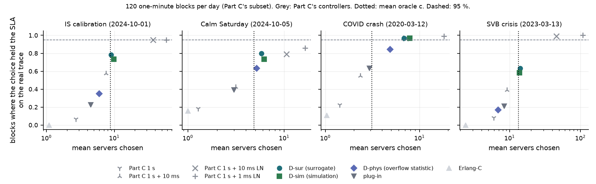

On Part C's subset, the batch model moves capacity to the oracle. Each cell is the share of
the 120 blocks on which the choice held the SLA, and the mean $c$ chosen:

| controller (120 blocks per day) | 2024-10-01 | 2024-10-05 calm | 2020-03-12 COVID | 2023-03-13 SVB |
|---|---|---|---|---|
| Part C nested log-normal, 1 s + 10 ms | 95 % at 37.30 | 79 % at 10.58 | 97 % at 7.13 | 99 % at 45.67 |
| D-sim (simulation, 48 draws) | 73 % at 9.75 | 73 % at 6.20 | 97 % at 7.88 | 58 % at 13.82 |
| D-sur (surrogate, 256 draws) | 78 % at 8.98 | 80 % at 5.80 | 97 % at 6.82 | 63 % at 14.13 |
| D-phys (overflow statistic) | 35 % at 5.99 | 63 % at 5.19 | 84 % at 4.87 | 17 % at 6.86 |
| plug-in | 23 % at 4.50 | 39 % at 3.01 | 63 % at 2.94 | 21 % at 8.39 |
| Erlang-C | 0 % at 1.09 | 16 % at 1.00 | 11 % at 1.03 | 0 % at 2.39 |
| oracle (after the fact) | 8.72 | 4.85 | 3.10 | 13.38 |

Part C's calibrated rule spent 37.30 servers in sample where 8.72 would have done. D-sim
spends 9.75 and D-sur 8.98. On SVB the batch controllers choose 13.82 and 14.13 against an
oracle of 13.38, where Part C's rule chose 45.67. The cost is reliability. The share of
blocks held drops from 95 % to 73–78 % in sample and from 99 % to 58–63 % on SVB. The 95 %
predictive interval of D-sim covers the real tail probability on 73 %, 73 %, 97 % and 56 % of
blocks. That is far better than the single-scale gamma-Cox of §4.7, but below nominal on
three of four days. The batch model is a different point on the trade-off, not a free gain:
much closer to the oracle in servers, and over-confident again where the traffic is busiest.
Only on the COVID day, where batches are smallest, is it reliable, and there it is generous
(7.88 against 3.10).

D-phys answers a narrower question, and the answer is no. The size law alone, with no
epoch clustering and no queue carried between batches, holds the SLA on 35 % of in-sample
blocks and 17 % on SVB. When batches come matters as much as how large they are.

**Every block, against the real trace.** D-sur makes a decision for all 1,438 blocks of each
day. It holds the SLA on 77 %, 80 %, 95 % and 63 % of them (in sample, calm, COVID, SVB), with
mean $c$ of 9.39, 5.75, 6.49 and 14.10 against mean oracles of 8.41, 4.51, 3.26 and 14.08,
which is 1.12, 1.28, 1.99 and 1.00 times the oracle. At the chosen $c$ it promised 97 %, 97 %,
97 % and 98 % on average. Blocks promised more are mostly held more often, but the promise is too
high everywhere except on the COVID day. There the bins promised
0.95–0.97, 0.97–0.99 and above 0.99 hold 94 %, 96 % and 98 % of the time. In sample they hold
71 %, 79 % and 91 %, and on SVB 59 %, 57 % and 78 %. On all blocks D-phys holds 42 %, 67 %, 82 %
and 15 %, and Erlang-C 1 %, 18 %, 12 % and 0 %.

**The surrogate is faithful to the simulator.** On held-out simulations the recalibrated
surrogate has Brier score 0.060 and expected calibration error 0.008 against a base rate of
0.72. The stronger check uses the decision-time draws themselves. On the same 48 posterior
draws that D-sim simulated, 92,160 draw-and-ladder pairs per day, the surrogate scores Brier
0.034, 0.031, 0.034 and 0.027. At the $c$ that D-sim chose, its estimate of $P(\text{SLA met})$ differs from the simulator's by 0.019, 0.020, 0.017 and 0.027 on average. In the subset
table D-sur holds the SLA on as many blocks as D-sim or up to 7 points more. So the gap between promise
and reality on the busy days is the simulator's, that is, the model's. The surrogate copies
it faithfully.

**It is cheap enough to re-solve every block.** One D-sur decision, 256 posterior draws on 16
ladder values, takes 0.021–0.022 s. One D-sim decision with 48 draws takes 0.06 s of CPU on
the calm day and 1.66 s on SVB, and its cost grows with the traffic it has to simulate. This is
what makes the controller adaptive in practice. The posterior moves block by block through
(8) and the epoch filter, and the chance constraint is re-solved at each step for a few
hundredths of a second, so it can run every minute of every day rather than on a subset.

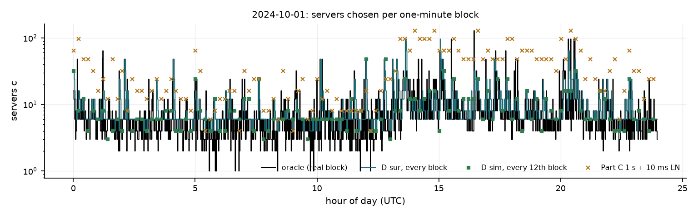

Figure 14 shows what the numbers mean over a day. D-sur follows the oracle's level through
the quiet hours and the 14:00–20:00 UTC session, where Part C's rule sits several ladder steps
above it. Its misses are mostly minutes where the oracle jumps above the minute before:
bursts that a forecast made from earlier blocks cannot see coming.

### 4.9 Nested batch epochs: a few more blocks held, and where the rest is lost

**The fine scale is clear on the in-sample and calm days and weak on the stress days.** The 10 ms
dispersion index of batch epochs is 2.13 in sample, 1.30 on the calm day, 1.20 on the COVID
day and 1.60 on SVB. The median posterior excess variance of the 10 ms gamma mixing is 3.5,
2.5, 0.44 and 0.60 (log-normal: 4.8, 2.5, 0.47, 0.64). Per bin the two fine laws fit almost
equally well: their one-step predictive log scores differ by −0.00056, −0.00006, +0.00024 and
+0.00042 nats per 10 ms bin (log-normal minus gamma). Summed over the 720,000 fine bins of the
subset that is −406, −42, +171 and +304 nats, so the data do prefer the gamma law on the
in-sample and calm days and the log-normal on the two stress days, but neither wins
everywhere. Both are carried forward.

**The surrogate has to be retrained.** On held-out nested simulations the D2 surrogates reach
Brier 0.064 (gamma) and 0.068 (log-normal), with calibration error 0.006 and 0.010. Part D's
surrogate scored on the same nested labels gets 0.073 and 0.101, with calibration error 0.027
and 0.061. The same MLP trained without the three fine features gets 0.069 and 0.088. The fine
parameter carries information the queue outcome depends on, most clearly under the
log-normal law.

On Part C's subset, the fine scale adds a few blocks at a small cost in servers. Each cell
gives the share of blocks held, the mean $c$ and, for the simulation controllers, the
coverage of the 95 % predictive interval:

| controller (120 blocks per day) | 2024-10-01 | 2024-10-05 calm | 2020-03-12 COVID | 2023-03-13 SVB |
|---|---|---|---|---|
| D-sim, 1 s epochs | 73 % at 9.75 (73 %) | 73 % at 6.20 (73 %) | 97 % at 7.88 (97 %) | 58 % at 13.82 (56 %) |
| D2-sim, 10 ms gamma | 75 % at 10.09 (73 %) | 74 % at 6.42 (76 %) | 97 % at 7.81 (97 %) | 59 % at 13.77 (59 %) |
| D2-sim, 10 ms log-normal | 80 % at 10.44 (78 %) | 78 % at 6.62 (78 %) | 96 % at 7.28 (96 %) | 62 % at 13.67 (58 %) |
| D2-sur, 10 ms gamma | 79 % at 9.37 | 85 % at 6.63 | 98 % at 7.62 | 67 % at 14.83 |
| D2-sur, 10 ms log-normal | 84 % at 10.28 | 84 % at 6.45 | 97 % at 6.82 | 75 % at 14.50 |
| oracle (after the fact) | 8.72 | 4.85 | 3.10 | 13.38 |

The gains are real but small. With the log-normal fine law, the simulation controller holds 8,
5 and 4 more of the 120 blocks than D-sim on the in-sample, calm and SVB days. D2-sim coverage
stays between 58 % and 97 %, close to Part D's.

**Every block.** On all 1,438 blocks per day:

| D-sur / D2-sur, all blocks | 2024-10-01 | 2024-10-05 calm | 2020-03-12 COVID | 2023-03-13 SVB |
|---|---|---|---|---|
| Part D, 1 s epochs | 77 % at 9.39 (1.12×) | 80 % at 5.75 (1.28×) | 95 % at 6.49 (1.99×) | 63 % at 14.10 (1.00×) |
| D2, 10 ms gamma | 80 % at 9.80 (1.17×) | 87 % at 6.60 (1.47×) | 96 % at 7.09 (2.17×) | 67 % at 15.04 (1.07×) |
| D2, 10 ms log-normal | 84 % at 10.60 (1.26×) | 86 % at 6.42 (1.43×) | 95 % at 6.47 (1.98×) | 72 % at 14.78 (1.05×) |
| promised by D2 log-normal | 97 % | 97 % | 97 % | 98 % |
| oracle (after the fact) | 8.41 | 4.51 | 3.26 | 14.08 |

The parenthesis is mean $c$ over mean oracle. D2 holds the SLA more often than Part D on
every day except the COVID day, where all three sit at 95–96 %. It does so near Part D's
capacity, far from the two- to four-fold excess of Part C's calibrated rule. It still does not deliver what it promises. In
sample it holds 84 % against 97 %, and on SVB 72 % against 98 %.

The D2 surrogates stay close to the nested simulator on the decision-time draws: the mean
absolute gap at the simulation controller's choice is 0.022, 0.028, 0.020 and 0.037 (gamma)
and 0.026, 0.025, 0.021 and 0.042 (log-normal), largest on SVB. A D2-sur decision takes
0.024–0.027 s. A D2-sim decision takes 0.09–2.35 s of CPU. One caveat applies to the COVID
day. There 30 % (gamma) and 20 % (log-normal) of the decision draws fall outside the fine
parameter's training range, toward weaker clustering, so D2-sur extrapolates. On the other
days about 5 % or fewer do.

**Where the rest is lost.** The decomposition separates the forecast from the model form.
Giving the simulation controller the block's own posterior, after seeing it, does not close
the gap:

| share of 120 blocks held | 2024-10-01 | 2024-10-05 calm | 2020-03-12 COVID | 2023-03-13 SVB |
|---|---|---|---|---|
| forecast, D / D2 gamma / D2 log-normal | 73 / 75 / 80 % | 73 / 74 / 78 % | 97 / 97 / 96 % | 58 / 59 / 62 % |
| block's own parameters (look-ahead) | 68 / 70 / 75 % | 69 / 72 / 74 % | 100 / 99 / 98 % | 62 / 60 / 59 % |

Knowing the block's own posterior moves the result by at most six points and lifts no busy
day toward 95 %. In sample it is even slightly worse, probably because the posterior after
seeing a block is sharper than the tempered predictive prior and so less cautious; on 120
blocks that difference is a handful of blocks. The error is in the
model's form, not in its forecast.

The size shuffle shows which part of the form. Permuting the real batch sizes among the real
epochs of a block lowers the servers the block needs:

| mean oracle $c$ | 2024-10-01 | 2024-10-05 calm | 2020-03-12 COVID | 2023-03-13 SVB |
|---|---|---|---|---|
| real trace | 8.41 | 4.51 | 3.26 | 14.08 |
| sizes permuted within 10 ms | 8.37 | 4.50 | 3.26 | 14.02 |
| within 100 ms | 8.08 | 4.45 | 3.23 | 13.20 |
| within 1 s | 7.23 | 4.03 | 3.10 | 10.53 |
| within 60 s | 5.98 | 2.87 | 2.96 | 8.96 |

Within the minute, the permutation lowers the oracle on 64 %, 60 %, 33 % and 80 % of blocks.
If sizes were independent of when they arrive, it would not move on average. The lag-1
autocorrelation of log batch size is 0.31, 0.43, 0.07 and 0.10. The correlation between a
batch's log size and the log number of epochs in its 100 ms window is 0.21, 0.42, 0.03 and
0.07. On the calm day, then, large batches come when batches are dense. On SVB the size
autocorrelation is small, yet permuting only within each second already takes the oracle from
14.08 to 10.53. Large batches arrive close together at the scale of 100 ms to a minute, more
than their neighbour-to-neighbour correlation shows. The COVID day, with the weakest
dependence, is the one day on which the controllers come close to their promise (95–96 % of blocks
held against 97 % promised). Every size law in (8) is
i.i.d. given the block, however quickly it adapts, so none of them can represent this.

So the direction holds, with numbers attached. Putting the problem's own uncertainty, the
batch structure, into the model turned the posterior into something a cheap surrogate can
control and re-solve every minute. Capacity came down from the 2.2–4.3 times the oracle of Part C's
calibrated rule to 1.00–1.47 times it on three days and about twice on the COVID day. What did not work is the promise. On the three days with dependent batch sizes the
controller says 97–98 % and delivers 63–87 %. Sub-second clustering of the epochs, the
obvious candidate, recovers up to 8 points of that. The rest sits in a quantity the model
does not yet have: how batch size depends on time and on intensity.

## 5 Limitations & next steps

- **Four of the seven original stress windows are not in the subset**, FTX among them; their
  Part A rows are arithmetic checks of shipped CSVs, nothing more. A 2 GB server budget and a
  1.05 GB SVB file forced the choice, stated per file in `results/data_manifest.json`.
- **$\mu$ is still an assumption.** Everything in §4.4 is conditional on 100 orders/s per
  node; the sensitivity curve is the honest response, not a fix.
- **The trace queue is FCFS with an infinite buffer.** A real engine sheds load rather than
  holding an eight-minute backlog, so "c ≈ 48" prices the *modelling* choice the report
  makes, not hardware. An M/M/c/N variant with a rejection cost is the right next model.
- **The ladder is coarse** (…24, 32, 48, 64…), so counts are bracketed, and one day's trace
  is one realisation with no interval.
- **Dithering assumes uniformity inside a millisecond** — correct under a locally constant
  rate, but the sub-millisecond structure is exactly what is in dispute, which is why the
  undithered statistics are reported alongside.
- **The Bayesian model family is the limitation of §4.7, not the inference.** Grid posteriors
  are exact, but every variant assumes conditionally independent intensities below its finest
  scale and a gamma or log-normal mixing law; neither has the burst-size tail of the trace, so
  the credible interval is either too narrow (gamma) or wide for the wrong reason
  (log-normal). The chance constraint is also evaluated on a 16-step ladder, so "4.3× the
  oracle" is bracketed, and $S=48$ draws resolve the 95th percentile coarsely.
- **Parts D and D2 promise more than they deliver.** The surrogate controller promises
  97–98 % and holds the SLA on 63–87 % of blocks on the in-sample, calm and SVB days. It is
  calibrated only on the COVID day. The decomposition locates the gap in the model's form,
  batch sizes that are not independent of time, and not in the forecast or the surrogate.
- **The surrogate is trained on one day's ranges.** Its design covers the in-sample day's
  rate, dispersion, size laws and fine-scale parameter. On the COVID day 20–30 % of the D2
  decision draws fall outside the fine range, so D2-sur extrapolates there. D-sim and D2-sim
  do not depend on it.
- **Batches are defined by the millisecond grid.** Same-millisecond trades are one batch by
  construction, so a batch split across two milliseconds counts as two. The D2 simulator
  places epochs uniformly inside a 10 ms bin, where two may fall closer than the 1 ms that
  separates real epochs; this matters only in bins with many epochs.
- **The decomposition uses look-ahead on purpose.** The known-parameter and size-shuffle
  numbers say where the error is. They are not achievable performance, and the subset
  comparisons rest on 120 blocks per day, where one block is just under one point.
- **Next:** a batch-size law that depends on time and on intensity. Candidates are a size law
  conditioned on recent batch sizes and on the local epoch rate, or a marked self-exciting
  process in which large batches raise the chance of more large batches. Its state would be
  filtered block by block like (8) and added to the surrogate's features, so the controller
  stays cheap enough to re-solve every minute. After that, a finite-buffer engine with a
  rejection cost, so that over-provisioning has a price on the same axis as the SLA.
