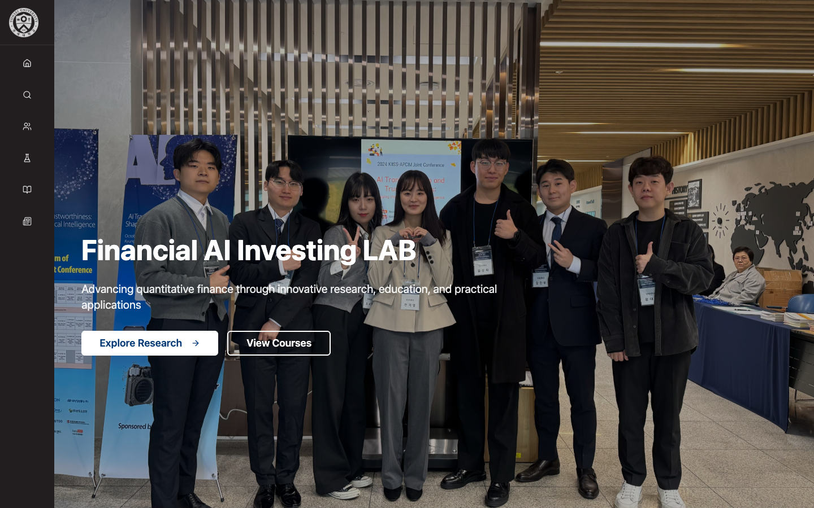
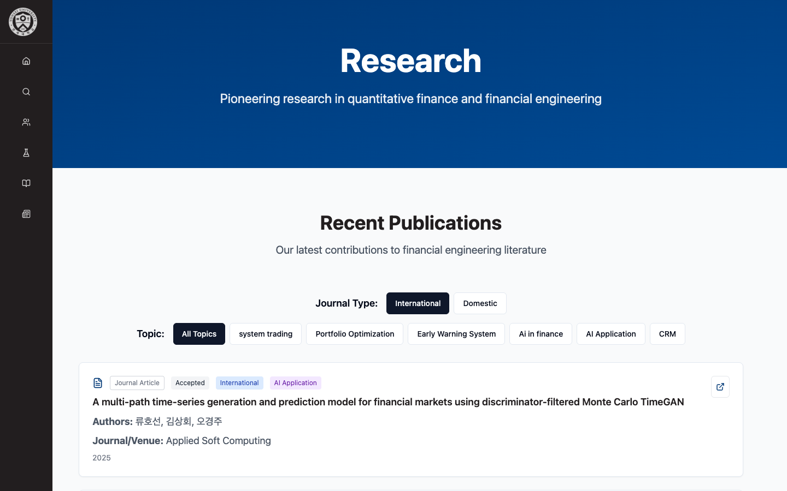
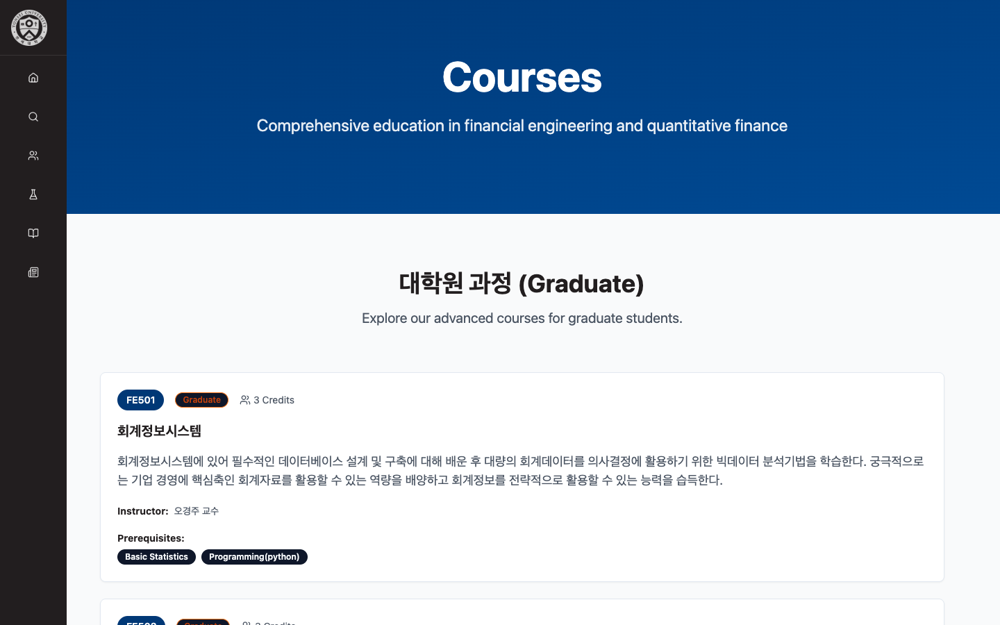

A lab website has one job: let a prospective student, collaborator or reviewer find out in a minute what the lab does, who is in it, what it has published and what it teaches. The Financial AI Investing Lab (Prof. Kyong Joo Oh, Department of Industrial Engineering, Yonsei University) did not have one that did that, so I built it. The site is a single-page React application built with Vite, served at fai.yonsei.ac.kr, bilingual where the content is (the introduction and course descriptions are in Korean; navigation, section titles and the publication metadata are in English).

## What is on it

- **Home** — the lab's four research areas as stated by the lab: futures and options system trading, fintech and digital-bank strategy, portfolio optimisation, and big-data early-warning systems for financial markets — with entry points to research and courses and a news strip.
- **About** — the director's introduction to twenty years of "Artificial Intelligence in Finance": pattern-recognition-based real-time strategies combining futures and options on underlying assets, OTC derivative design, machine-learning trading systems, and deep learning for non-linear portfolio optimisation.
- **People** — members of the lab.
- **Research** — the publication list with two filters that compose: journal type (international / domestic) and topic (system trading, portfolio optimisation, early-warning system, AI in finance, AI application, CRM). Each entry carries type, status, venue and year, and a link out.
- **Courses** — the graduate courses (e.g. FE501 Accounting Information Systems, FE502 Advanced Investment Engineering) with credits, instructor, prerequisites and a description.
- **News**, **Contact**.

## How it is built

A Vite + React single-page application: one production JavaScript asset, client-side routing for the seven sections, content held as data so a publication or a course is added by editing a record rather than a page. A left icon rail is the navigation on desktop; the hero on the home page is a full-bleed photograph of the lab with the name overlaid.

## Notes

This write-up is descriptive on purpose. The site's value is that it exists and is kept current; the engineering decisions were small (Vite for a fast static build, a data-driven publication list so the filters stay correct as entries are added, no runtime dependency on external CDNs).
