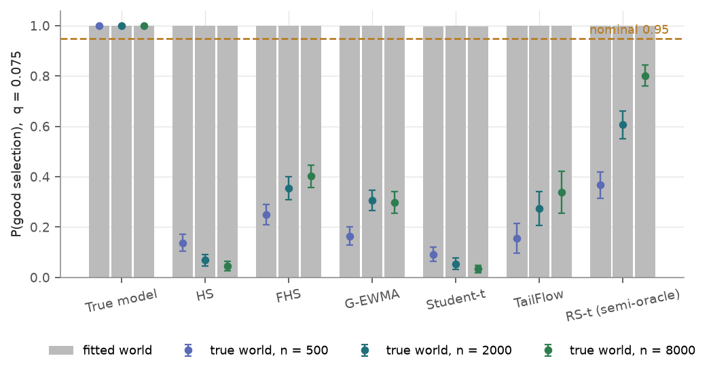
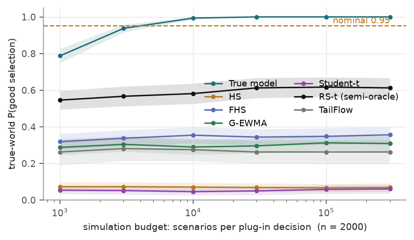
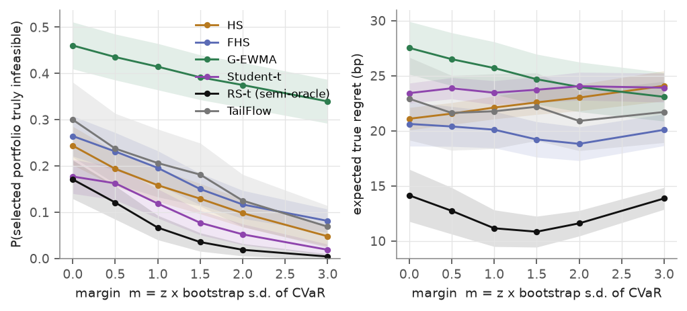
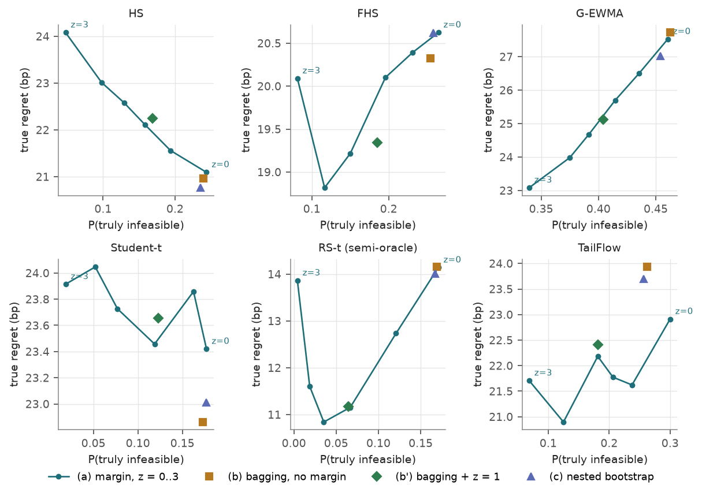
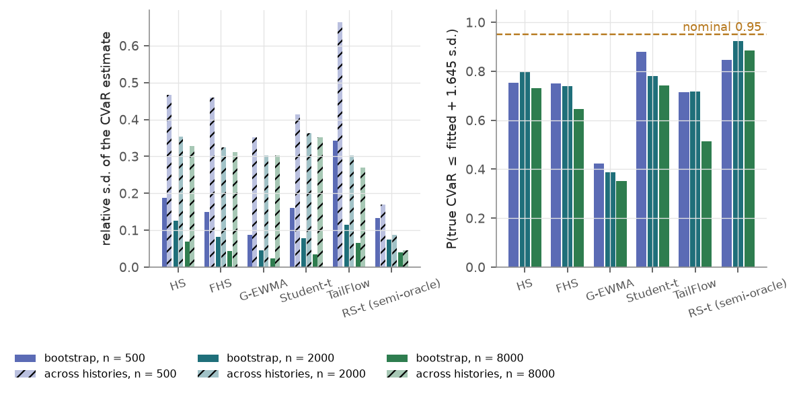

## Abstract

A ranking-and-selection (R&S) procedure controls *simulation* error: it returns a good system with probability at
least $1-\alpha$ in the world the simulator describes. When the simulator's input distribution was itself estimated
from $n$ days of data, that guarantee is conditional on the fitted input model. On a synthetic regime-switching market
where the true best portfolio and the true feasible set are known by brute force, I run one constrained selection
problem — highest expected 10-day return among 15 long-only portfolios subject to a 10-day CVaR(95%) cap — and judge
every decision twice. In the fitted world the procedure meets its nominal 0.95 (P(good
selection) $=1.000$ for every input model); against the true market it delivers 0.03 to 0.80, and 17%–61% of the
selections violate the risk cap. The gap is not simulation error — an infinite-budget plug-in oracle scores the same.
Of three remedies, only a bootstrap feasibility margin helps, and it buys feasibility with return without restoring
the guarantee.

## 1 Introduction

Sequential R&S procedures are among the few simulation-optimization tools with a finite-sample statistical guarantee:
with probability $1-\alpha$ the returned system satisfies the constraint to a tolerance $\epsilon$ and is within an
indifference zone $\delta$ of the best feasible system. That statement is about the sampling noise of the simulator,
and it is conditional on the simulator being right — which, in finance, it never is. A risk system draws scenarios
from an input model estimated from a finite history, so the guarantee describes a world that is itself an estimate.
How much of the nominal level survives, whether more simulation or more data helps, and whether bootstrap margins,
bagging or nested sampling close the gap are all questions this project answers by measurement, reusing the decision
problem and market from `tailflow` and the R&S library from `rs-lab`, both copied verbatim so the truth is computable.

## 2 Method

### 2.1 The decision problem and its truth

The market is a two-regime (calm / stressed, volatility multiplier 2.6) Student-t factor model on 6 assets with a
persistent Markov regime ($P_{11}=0.985$, $P_{22}=0.96$); the $K=15$ candidates are 5 long-only weight vectors at
3 leverages, and what matters is the mean and 95% CVaR of the 10-day return $R_k=\sum_{u=1}^{H}w_k^\top r_{t+u}$.
Because the market is Markov in the regime, the true conditional law depends on the past only through the filtered
probability $p=\mathbb{P}(\text{stressed on } t{+}1\mid r_{1:t})$, so the whole truth is one table: the true CVaR of
each base portfolio on a 51-point grid in $p$, from two independent runs of $2\times10^6$ paths (largest relative
disagreement $2.8\times10^{-3}$), scaled by homogeneity to the levered candidates. Each decision solves

$$
\text{maximise}_{k}\;\mathbb{E}[R_k]\quad\text{subject to}\quad\mathrm{CVaR}_{0.05}(-R_k)\le q,
\tag{1}
$$

with $q\in\{0.055,0.075,0.102\}$ (0.075 is the headline), $\delta=2$ bp and $\epsilon=25$ bp.

### 2.2 Turning a CVaR constraint into an observation

The feasibility procedure tests $\mathbb{E}[Y_k]\le q$ from i.i.d. observations, and CVaR is not an expectation, so
the choice of $Y$ must be made and verified before anything else. I use the Rockafellar–Uryasev representation: for
losses $L=-R$ and any fixed level $v$,

$$
F_\alpha(v)\;=\;v+\frac{1}{\alpha}\,\mathbb{E}\big[(L-v)^{+}\big]\;\ge\;\mathrm{CVaR}_\alpha(L),
\qquad\text{with equality at } v=\mathrm{VaR}_\alpha(L).
\tag{2}
$$

One observation is a batch of $b=500$ scenarios — all $K$ candidates share the scenarios (common random numbers) —
giving

$$
X_k=\frac{1}{b}\sum_{i=1}^{b}R_{k,i},
\qquad
Y_k=v_k+\frac{1}{\alpha b}\sum_{i=1}^{b}\big(L_{k,i}-v_k\big)^{+},
\tag{3}
$$

with $v_k$ frozen by a first stage of $m_0=20{,}000$ scenarios. Because $v_k$ is fixed, $Y_k$ is a plain batch mean,
so $\mathbb{E}[Y_k]$ is an expectation in exactly the sense the procedure requires, and by (2) it is an *upper* bound
on the CVaR: the gap is second order in $v_k-\mathrm{VaR}$, so the check errs conservatively. The obvious
alternative, the empirical CVaR of a batch, is not a batch mean and is biased downwards by $O(1/b)$.

Both were measured on the **true** model before being used anywhere ($4\times10^6$ scenarios per cell). Batch CVaR is
biased low by 14–27 bp at $b=100$; RU is within $\pm1.8$ bp at every batch size and regime probability tested. With
the threshold exactly $\epsilon$ above or below the true CVaR (500 replications per cell, nominal 0.95), the
feasibility check is correct 0.975 / 0.975 of the time under RU, versus 0.991 / 0.949 under the batch version, which
buys safety on the feasible side by being anti-conservative on the infeasible side.

### 2.3 Plug-in R&S with a fitted input model

For each $n\in\{500,2000,8000\}$ and each simulated history, the input model is fitted on the $n$ days ending at the
decision date and materialised as a pool of $4\times10^5$ scenarios. That pool's empirical distribution *is* "the
fitted world", so its mean and CVaR are known exactly and a selection can be judged against it without extra noise;
the procedure samples from the pool. Seven input models are used: the **true model** (control — fresh paths, nothing
estimated), **historical simulation** (HS), **filtered HS** (FHS, EWMA-standardised residuals rescaled by the real
volatility forecast), **Gaussian EWMA**, a **Student-t** fit, a **semi-oracle regime-switching t** (RS-t — structure
known, moments estimated), and **TailFlow**, the copied conditional DDPM. Each selection is judged twice with the same
rule, against the world it was drawn from and against the true world, reporting P(good selection) — not infeasible by
more than $\epsilon$, within $\delta$ of the best *clearly* feasible candidate — strict P(correct selection),
P(truly violating the cap), and expected true regret in bp.

### 2.4 Remedies

Let $\hat c_k$ be the fitted CVaR and $s_k$ the standard deviation of $\hat c_k^{(1)},\dots,\hat c_k^{(B)}$ from
re-fitting the model on $B$ **circular block bootstrap** resamples of the training window ($\ell=50$ days; $B=30$
classical, $B=6$ for TailFlow, fine-tuned from the base network). What is resampled is what the model estimates — the
10-day blocks for HS, the standardised residuals for FHS, the window mean for Gaussian EWMA, the whole fit for the
Student-t — while the conditioning state at the decision date stays real, since a resampled history has no meaningful
"today". The remedies: (a) **margin**, the plug-in procedure against the tightened cap $q-z\,s_k$ for
$z\in\{0,0.5,1,1.5,2,3\}$; (b) **bagging**, every scenario from a uniformly chosen bootstrap model; (c) **nested**,
every *observation* from one bootstrap model, so the between-model spread enters the variance the procedure estimates.

## 3 Experiments

240 independent histories per classical $(n,\text{model})$ cell, 2 decision dates 25 days apart per history — 480
decisions per cell; TailFlow uses 80 histories per $n$; all standard errors are clustered by history. Each decision
consumes 322–654 sequential observations (38–95 k scenarios) and no run hit its budget cap. The budget curve uses
fixed-budget plug-in picks ($10^3$–$3\times10^5$ scenarios) on the same pools; block-length sensitivity is a separate
60-history run at $\ell\in\{10,200\}$. Everything ran on the lab server (3× RTX 3090, 64 cores): classical cells as
16 single-threaded CPU workers, TailFlow as 8 workers on the assigned GPU.

## 4 Results

### 4.1 The guarantee holds in the fitted world and fails in the true one

| $n$ | model | fitted-world PGS | true-world PGS | truly infeasible | regret (bp) |
|---|---|---|---|---|---|
| 2000 | True model (control) | 1.000 (0.000) | 1.000 (0.000) | 0.021 (0.006) | 1.3 (0.4) |
| 2000 | Historical sim. | 1.000 (0.000) | 0.069 (0.012) | 0.244 (0.021) | 21.1 (0.5) |
| 2000 | Filtered HS | 1.000 (0.000) | 0.354 (0.023) | 0.265 (0.022) | 20.6 (1.0) |
| 2000 | Gaussian EWMA | 1.000 (0.000) | 0.306 (0.021) | 0.460 (0.026) | 27.5 (1.2) |
| 2000 | Student-t | 1.000 (0.000) | 0.054 (0.011) | 0.177 (0.019) | 23.4 (0.5) |
| 2000 | TailFlow | 1.000 (0.000) | 0.275 (0.034) | 0.300 (0.041) | 22.9 (1.9) |
| 2000 | RS-t (semi-oracle) | 1.000 (0.000) | 0.606 (0.028) | 0.171 (0.021) | 14.1 (1.2) |

The control confirms the machinery: the true input model gives 1.000 P(good selection) and 0.956 strict P(correct
selection) against a nominal 0.95. With a fitted model the fitted-world column stays at 1.000 — the procedure is
doing its job perfectly — while the true-world column falls to 0.05–0.61 and one selection in four breaches the cap.

More data does not fix this. From $n=500$ to $n=8000$ the semi-oracle RS-t improves from 0.367 to 0.802 and TailFlow
from 0.156 to 0.338, but HS *deteriorates* from 0.138 to 0.046 and the Student-t fit from 0.092 to 0.033: as
estimation noise shrinks the procedure grows confident about a world that is systematically wrong. HS's relative CVaR
bias stays near $+0.2$ and the Student-t fit's near $+0.35$ at every $n$, while the semi-oracle's RMSE falls to 0.047.

### 4.2 The shortfall is input error, not simulation error

Raising the simulation budget at fixed $n$ produces the expected plateau, and it is a low one. The true-model control
crosses the nominal level between $3\times10^3$ and $10^4$ scenarios and reaches 1.000; every fitted model is flat
from $10^3$ scenarios onwards — HS 0.07, Student-t 0.05, TailFlow 0.27, Gaussian EWMA 0.30, FHS 0.35, RS-t 0.61 — and
300× more scenarios move none of them. The `inf-budget true PGS` column of `results/summary_main.md` agrees: it judges
the fitted world's *exact* best feasible candidate — the infinite-budget plug-in oracle — against the true market, and
matches the sequential result in every cell to within one standard error (HS at $n=2000$: 0.067 vs 0.069).

### 4.3 Remedies

The margin does one thing well: it buys feasibility with return. At $n=2000$, $q=0.075$, going from $z=0$ to $z=3$
takes HS from 0.244 to 0.048 infeasibility for 3.0 bp of extra regret, the Student-t fit from 0.177 to 0.019 for
0.5 bp, TailFlow from 0.300 to 0.069 while *reducing* regret from 22.9 to 21.7 bp, and RS-t from 0.171 to 0.004 with
regret bottoming at 10.8 bp ($z=1.5$). Gaussian EWMA is the failure case: $z=3$ moves it only from 0.460 to 0.340,
because its CVaR is biased *low* by 8% and its bootstrap spread is the smallest of all models. And no margin restores
P(good selection) — the objective half of the guarantee is untouched, so HS stays at 0.06 at $z=3$.

Bagging and the nested procedure do essentially nothing. In Figure 4 both sit on the $z=0$ point of the margin curve
for every input model — each changes infeasibility by at most 0.04 — and the bagged mixture's CVaR differs from the
plug-in's by under 0.7% for the classical models (2.2% for TailFlow). Block resampling perturbs the *estimated
parameters*, but every resample is the same model class fitted to the same regime history, so the mixture is barely
wider than its members and cannot manufacture a tail the class cannot represent. The nested draw does inflate the
variance the procedure sees — it needs up to 5.6× more scenarios to reach its stopping rule — but it has almost
nothing to widen. None of this is cheap: the $B=30$ bootstrap pools add about 1.2 M scenarios to a 38–95 k decision,
roughly 25× its cost, all spent on an uncertainty estimate that is far too small. At equal compute the margin remains
the better purchase, since Figure 2 shows the plug-in at its plateau from $10^3$ scenarios.

### 4.4 Why the bootstrap cannot carry the load

Standardising the actual error by the bootstrap spread, $(c^{\text{true}}-\hat c)/s$, should have standard deviation
near 1 if the bootstrap measured the right uncertainty. It gives 1.6–5.6 at $n=500$, 1.2–8.9 at $n=2000$ and 1.2–15.9
at $n=8000$; only the well-specified RS-t stays near 1.2. The one-sided bound $\hat c+1.645s$ therefore covers the
true CVaR in 35%–92% of decisions instead of 95%, and gets *worse* as $n$ grows, because $s$ shrinks like $n^{-1/2}$
while the misspecification bias does not shrink at all. Figure 5 (left) says the same structurally: the spread across
genuinely independent histories is 1.9×–12.5× the bootstrap spread for every model except the semi-oracle.

Block length is not the explanation. Refitting the $n=2000$ experiment on 60 histories at $\ell=10$ and $\ell=200$
changes the mean bootstrap relative s.d. by at most 0.022 and the remedy outcomes by under two standard errors
(infeasibility at $z=3$: 0.100 vs 0.075 for HS), while coverage stays in 0.36–0.91 at every block length. The tests
confirm $\ell=50$ preserves the lag-1 autocorrelation of squared returns to within 15%; an i.i.d. resample destroys it.

## 5 Limitations & next steps

- **Synthetic market only.** The "true" world is a regime-switching Student-t factor model, so every number measures
  behaviour under *that* misspecification. No market data was used here or in TailFlow.
- **One family of decision problems**: 15 long-only portfolios, one objective, one constraint form. Problems where the
  constraint binds differently, or with far more systems, may behave differently.
- **Bootstrap validity under regime switching is not proven here**, only checked empirically (the block bootstrap
  preserves the lag-1 autocorrelation of squared returns; its spread is compared with the spread over independent
  histories). Under a persistent latent regime a resampled window is not a draw from the true sampling distribution
  of the fitted parameters; Section 4.4 is the consequence, not a proof.
- **TailFlow's ensemble under-states its own uncertainty** — its members are fine-tuned from a common base network
  rather than retrained, which was outside the compute budget.
- **Next steps.** A margin calibrated on the *model-selection* spread — the disagreement between input model classes
  fitted to the same window — and a feasibility test stated over a set of input models rather than one.
