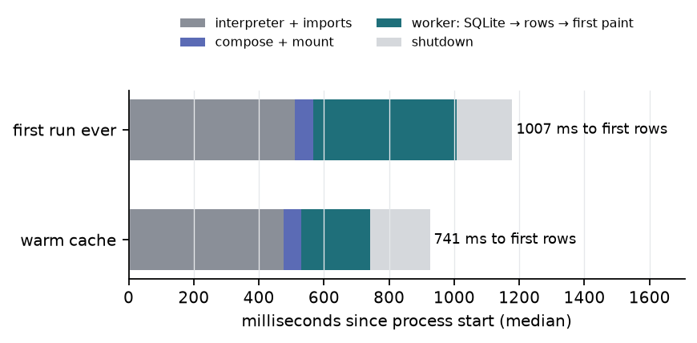
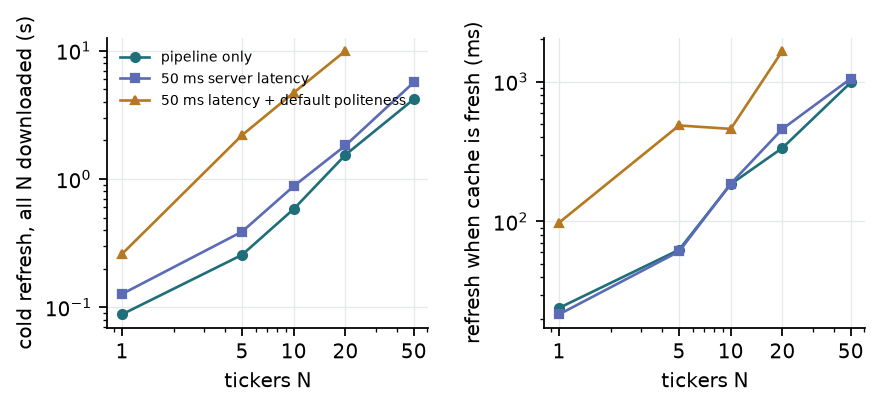
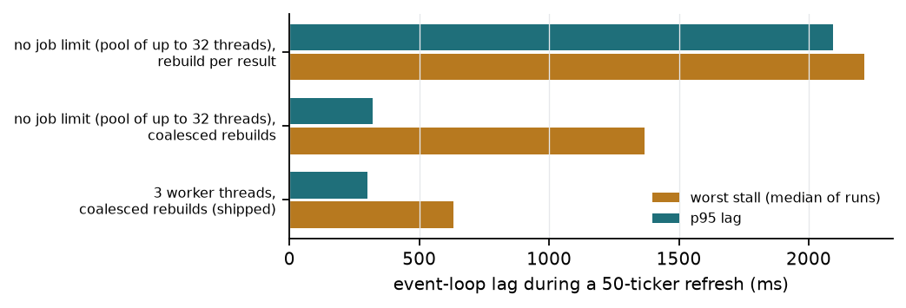
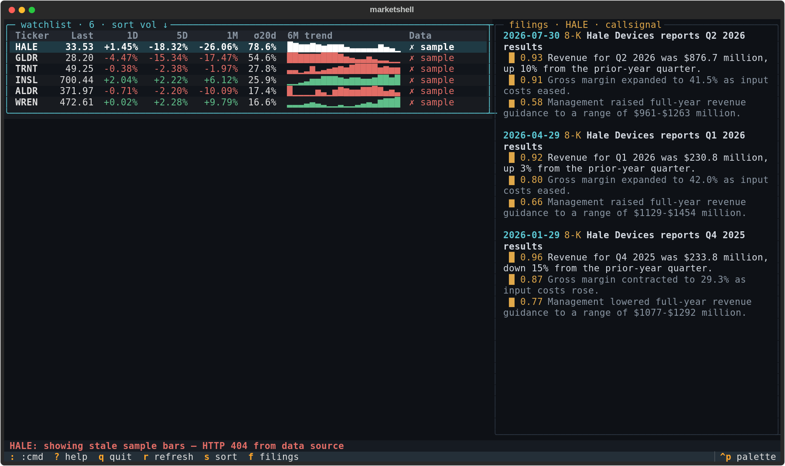
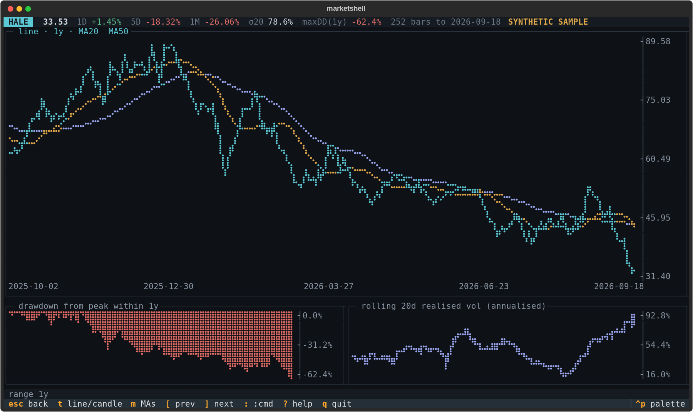
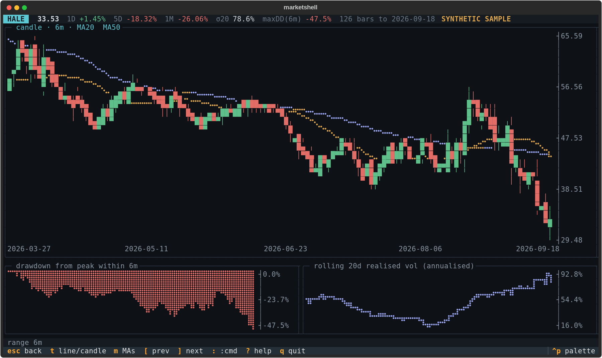
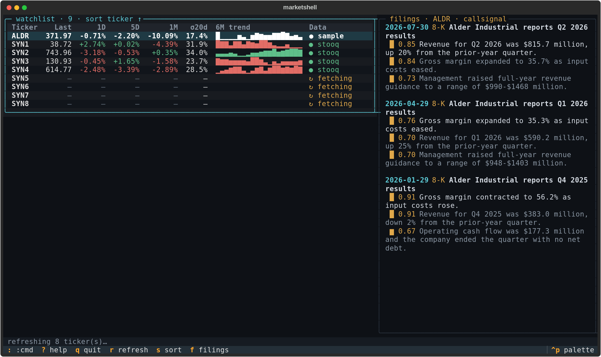

## In short

**Where it started.** My research loop alternates between a shell, where models train and logs scroll, and a browser tab that exists only to answer "what did this ticker do, and is that unusual?". The browser costs a context switch, a mouse and megabytes of page to show six numbers that fit in a 120×36 character grid. So I wrote a keyboard-only terminal app in Python on Textual 8 that runs where the work already is, including over SSH on a lab server with no display.

**What I learned building it.** A character grid makes the rendering problem small enough to own completely, so the charts come from a hand-written rasteriser: braille cells as 2×4 dot bitmaps, min–max column binning so a one-day crash stays visible on a five-year chart, half-block candles. The first version took 20.9 ms for a 136×28 panel; vectorising the binning brought it to 10 ms on the loaded server.

**What that made me curious about.** The first version never did I/O on the UI thread and still stalled badly during a refresh. I wanted to know which change actually fixes that.

**What worked, and what did not.** Coalescing redraws into one table rebuild per 50 ms was the clear win: median event-loop lag during a 50-ticker refresh fell from 622 ms to 4.4 ms. Limiting downloads to three worker threads was less clear-cut than I expected: it halved the typical worst stall but did not move p95, and on the oversubscribed server it slowed the refresh (11.9 s vs 7.0 s). Cached rows appear 741 ms after process start. The intended live source, Stooq's keyless CSV endpoint, refused every scripted request on 2026-09-21; the app reports that and does not try to get around it, so every price shown is synthetic.

**Where it leads.** A second keyless source behind the same client, in-place cell updates to remove the O(N) table rebuild, and wiring the filings panel to the real *callsignal* database, which so far it has met only as my fixture.

## 1 Introduction

**Problem.** My research loop alternates between a shell, where models train and logs scroll, and a browser tab that
exists only to answer "what did this ticker do, and is that unusual?". The browser costs a context switch, a mouse
and megabytes of page to show six numbers that fit in a 120×36 character grid.

**Why a TUI.** First, locality: it runs where the work already is, including over SSH on a lab server with no
display. Second, the interaction model: a watchlist is a table, and a command language (`add`, `rm`, `sort vol desc`,
`range 1y`) is faster than a form; both are native to a terminal. Third, the constraint is productive: a character
grid makes the rendering problem small enough to own completely, which is how the rasteriser in §2.2 came to exist.
The costs are real: one foreground colour per cell, no sub-cell typography, no hover.

**What is built.** A watchlist (last, 1D/5D/1M change, 20-day realised volatility, sparkline, data-source state); a
detail screen (line or candlestick chart with moving averages, drawdown, rolling volatility); a `:` command line
with history plus a fuzzy palette; a filings panel showing the top-scored sentences of recent earnings releases
from the sibling project *callsignal*; a help overlay. State is one SQLite file and one TOML file. The source is
1,825 non-blank lines with 53 tests.

## 2 Method

### 2.1 Pure core, thin shell

Code is split by whether it can be tested without a terminal. Analytics, rasteriser, command parser, cache policy
and CSV parser are pure functions. `chart.py` returns a grid of `(glyph, layer)` cells and knows nothing about
colour; `ui/render.py` maps layers to colours; `ui/app.py` is the only module that imports Textual widgets. With
closes $c_t$ and log returns $r_t = \ln c_t - \ln c_{t-1}$, the volatility and drawdown panels use

$$
\hat\sigma_t^{(w)} = \sqrt{\frac{252}{w-1}\sum_{i=t-w+1}^{t}\bigl(r_i-\bar r_t\bigr)^2},
\qquad
\mathrm{DD}_t = \frac{c_t}{\max_{s\le t} c_s} - 1
\tag{1}
$$

with $w=20$, computed from cumulative sums so the cost is $O(n)$ for any window, and NaN-padded so every series
shares one x-axis.

### 2.2 The chart rasteriser

A braille character is a 2×4 dot matrix whose code point is `0x2800` plus an 8-bit mask. A panel of $W\times H$
cells is therefore a $2W\times 4H$ bitmap, eight times the resolution of whole characters.

*Scaling.* The series and its overlays share one padded range $[v_{\text{lo}}, v_{\text{hi}}]$; a value maps to pixel row

$$
y(v) = \operatorname{round}\!\left(\frac{v_{\text{hi}} - v}{v_{\text{hi}} - v_{\text{lo}}}\,(4H-1)\right)
\tag{2}
$$

*Column binning.* If the $n$ bars fit into the $2W$ pixel columns, points are spread out and joined with integer
Bresenham segments. Otherwise bars are split into $k=2W$ bins with integer edges $e_j=\lfloor jn/k\rfloor$ and each
column draws a vertical span:

$$
\text{span}_j = \Bigl[\,y\bigl(\max(M_j,\,\ell_{j-1})\bigr),\; y\bigl(\min(m_j,\,\ell_{j-1})\bigr)\Bigr]
\tag{3}
$$

where $m_j$, $M_j$, $\ell_j$ are the minimum, maximum and last value of bin $j$. Min–max rather than mean or last is
what keeps a one-day crash visible on a five-year chart; stretching the span to $\ell_{j-1}$ keeps the trace
connected when neighbouring bins do not overlap vertically. The reductions use `ufunc.reduceat` with `fmin`/`fmax`,
which skip the NaN warm-up of moving averages.

*Layers.* A cell has one foreground colour, so two series crossing inside a cell cannot both keep theirs. The canvas
holds one `uint8` bit-plane $P_k$ per series; no dots are lost, and the most important series wins the colour:

$$
\text{glyph}(r,c) = \texttt{0x2800} + \bigvee_{k} P_k(r,c),
\qquad
\text{colour}(r,c) = \text{palette}\Bigl[\min\{k : P_k(r,c)\neq 0\}\Bigr]
\tag{4}
$$

*Candles.* Braille dots are too thin to read as bodies, so candles use another alphabet at half-cell resolution:
`█ ▀ ▄` for bodies, `│ ╵ ╷` for wicks, one candle per column, aggregated per bin (first open, max high, min low, last
close) when bars outnumber columns. Moving averages are drawn on a braille canvas with the same range and fill only
cells the candles leave empty. The drawdown panel is the same canvas used as an area fill hanging from zero. The
widget rasterises at its own size on render, so a terminal resize re-rasterises; results are cached per size.

### 2.3 The async model

The event loop only renders and handles keys. Anything touching SQLite, the network or the callsignal database runs
in a Textual thread worker, builds an immutable result, and hands it over with `call_from_thread`. Start-up follows
the same rule: `mount` does no I/O, a worker reads SQLite, the table fills on the next frame, and `requests` is
imported lazily so a start that needs no download never pays for it. Three details mattered:

- *Staleness guards.* Holding `j` starts a filings query per row; the worker group is `exclusive` and callbacks drop
  results for a ticker that is no longer selected.
- *Coalesced redraws.* Rebuilding the table is $O(N)$; doing it per finished ticker made a refresh $O(N^2)$ on the
  UI thread. Results are merged into one rebuild per 50 ms; the last result of a batch is drawn immediately.
- *Bounded workers.* One thread per ticker looks harmless because threads mostly wait on the network, but CSV
  parsing and SQLite marshalling hold the GIL. Jobs now pass through a queue with at most three live threads.
  Network politeness is separate: one request start per 0.5 s and two in flight, enforced inside the client.

### 2.4 Cache policy

Daily bars change once per session, so refresh should usually cost nothing. `decide()` is a pure function of (last
cached bar, fetch log, clock): **fresh** if the newest bar is the latest completed US session (weekday, after 18:00
New York) or the last success is younger than a 6 h TTL, which covers holidays the first clause does not model;
**backoff** if the last attempt failed under 15 minutes ago; otherwise **fetch**, and only the tail (last cached
date minus 7 days, so late corrections are upserted). A failed fetch deletes nothing: the row keeps its bars and
carries the error. The bundled sample is six *synthetic* series with fictional tickers, always treated as stale and
deleted, never merged, when real bars arrive. SQLite runs in WAL mode with one short-lived connection per call.

### 2.5 The callsignal adapter

The panel reads `../callsignal/results/callsignal.db` (or `$MARKETSHELL_CALLSIGNAL_DB`) with `mode=ro`. Expected
schema: `filings(filing_id, ticker, filed_at, form, title, url)`, `sentences(sentence_id, filing_id, position, text)`,
`scores(sentence_id, importance)`. That database did not yet exist on 2026-09-21, so the adapter resolves names through
`PRAGMA table_info` against a documented alias list and returns a status (`ok`, `missing`, `schema`, `error`) with a
sentence for the panel instead of raising. Tests and screenshots use a fixture of fictional filings.

## 3 Experiments

**Conditions.** Everything ran on 2026-09-21 (KST) on one server: AMD EPYC 7452, 64 logical cores, 157 GB RAM,
Linux 5.15, no display, Python 3.11.11, Textual 8.2.8, NumPy 2.4.6. Nothing ran on a laptop. The server was
oversubscribed by other jobs all session (1-minute load 72–100 during the reported run), so the numbers include
that contention; earlier runs are kept in
`results/` to show how much it matters.

**Start-up.** `python -m marketshell --bench` runs the real app headless at 120×36, timestamps from the first line
of `__main__`, exits after the first frame with populated rows and reports peak RSS. First run: empty home
directory (5 launches). Warm: populated database (10 launches).

**Refresh.** Textual's pilot drives the app against a local HTTP server that speaks the same CSV dialect (750
synthetic bars per symbol) with configurable delay. `add T00 …` starts the clock; the last returned row stops it. A
second refresh must make zero requests. A probe coroutine sleeps 5 ms in a loop and records how late it wakes: the
lag a key press would see. Three repeats per setting, medians reported. **Ablation:** the 50-ticker zero-latency
refresh, 5 interleaved runs under three scheduling policies.

**Rasteriser.** 30 calls of the full price-panel path per size, on 520 sample bars and a 5,000-bar random walk.
**Live source.** One real request per run, recorded verbatim. **Tests.** 53: analytics against closed forms and naive
references, rasteriser invariants, the policy truth table, parser failure modes, adapter schemas, and eight pilot
flows through the real app.

## 4 Results

### 4.1 Start-up and memory

| Median, ms since process start | First run ever | Warm cache |
|---|---|---|
| imports done | 511 | 476 |
| widgets mounted | 567 | 531 |
| **first frame with populated rows** | **1007** | **741** |
| peak RSS (MB) | 52.1 | 51.8 |

About two thirds of a warm start is Python importing Textual, Rich and NumPy; `requests` was absent from
`sys.modules` on every warm start. The same measurement earlier in the session, on a less busy machine, gave 351 ms
to first rows, and a run at load ≈ 100 gave 1,009 ms: contention is the largest factor in this number.

### 4.2 Refresh and responsiveness

| Median of 3 runs | N=1 | N=5 | N=10 | N=20 | N=50 |
|---|---|---|---|---|---|
| refresh, 0 ms server (s) | 0.09 | 0.26 | 0.58 | 1.54 | 4.18 |
| refresh, 50 ms server (s) | 0.13 | 0.39 | 0.88 | 1.82 | 5.67 |
| refresh, 50 ms + default politeness (s) | 0.26 | 2.20 | 4.71 | 9.98 | — |
| refresh when cache is fresh (s) | 0.02 | 0.06 | 0.18 | 0.34 | 0.99 |
| requests when cache is fresh | 0 | 0 | 0 | 0 | 0 |
| loop lag p95, 0 ms server (ms) | 9.9 | 20.0 | 39.2 | 61.5 | 85.1 |
| loop lag p95, default politeness (ms) | 17.4 | 9.4 | 8.9 | 16.9 | — |

| Scheduling, 50 tickers, 0 ms server, 5 runs | refresh, s | lag p50, ms | lag p95, ms | worst stall: median / worst run, ms |
|---|---|---|---|---|
| no job limit (≤32 pool threads), rebuild per result — first version | 9.04 | 621.6 | 2,094 | 2,213 / 3,150 |
| no job limit, coalesced rebuilds | 6.98 | 5.9 | 319 | 1,369 / 1,987 |
| 3 worker threads, coalesced rebuilds — shipped | 11.90 | 4.4 | 300 | 632 / 2,448 |

The first version never did I/O on the UI thread and still stalled badly. Coalescing is the clear win: median lag
falls by two orders of magnitude and the refresh gets faster because the UI thread stops competing with the
workers. The job limit is less clear-cut than I expected. It halves the typical worst stall but does not move p95,
and on an oversubscribed machine it slows the refresh (11.9 s vs 7.0 s), because three threads get a smaller share of
a contended scheduler than thirty-two. In earlier, less contended single runs the same change took the worst stall
from 752 ms to 102 ms (`bench_v2…` vs `bench_v3…`), so it stays the default but is a config value. With default
politeness, which is how the app is really used, p95 lag stays under 20 ms at every N.

### 4.3 Rasteriser cost

| Panel (cells) | 520 bars, line | 520 bars, candle | 5,000 bars, line | 5,000 bars, candle |
|---|---|---|---|---|
| 80×20 | 5.2 ms | 7.4 ms | 6.0 ms | 8.2 ms |
| 136×28 | 10.0 ms | 15.6 ms | 12.0 ms | 16.7 ms |
| 236×60 | 31.9 ms | 50.1 ms | 35.3 ms | 54.8 ms |

The first version took 20.9 ms for the 136×28 line panel; profiling showed a Python loop calling NumPy reductions
on two-element bins. After `reduceat` it measured 4.4 ms right after the change and 10.0 ms in the loaded reported
run. Ten times more bars costs about 15% more: cost follows cells, not history length.

### 4.4 Screens

Screenshots are SVGs from
Textual's `save_screenshot` under the headless pilot, converted to PNG on the server with CairoSVG. No monospace
font there covers braille and cairo does no glyph fallback, so the converter redraws braille runs as vector dots from
each code point's bit mask; the SVGs are untouched.

### 4.5 The live data source

Every scripted request to the Stooq endpoint from the server was refused: `requests` got `HTTP 404` with an empty
body, `curl` got a JavaScript browser-verification page. The client recognises both, reports them (Figure 4), backs
off, and does not try to get around the check. **No real market data appears in this write-up**; all prices are
synthetic and labelled. For real use I added `:import TICKER PATH`, which loads a browser-downloaded CSV through the
same strict parser and worker path.

## 5 Limitations & next steps

- **Live data was never exercised end to end.** The fetch path is tested against a local imitation, including
  failure modes. A second keyless source behind the same `Client` protocol is the obvious next step.
- **Benchmarks ran on an oversubscribed server** with few repeats; treat them as order-of-magnitude.
- **Worst-case stalls remain**: about 100 ms on a calmer machine, over 600 ms on the loaded one. The table rebuild
  is still $O(N)$; updating cells in place when the order is unchanged would remove most of it.
- **The rasteriser is half vectorised.** Span filling and cell assembly are Python loops; 236×60 costs 30–50 ms.
- **No exchange calendar**: holidays cost one redundant request per TTL window.
- **The filings schema is an expectation.** The adapter has only met my fixture, not the real database.
- **Font dependence.** A terminal font without braille shows boxes, exactly as the PNG converter first did.
