## Abstract

Huang & Shi (*Journal of Econometrics*, 2025) measure model uncertainty in the cross-section of stock returns
as the entropy of the posterior probabilities over factor subsets, computed under a mixture of g-priors. The
prior is where the subjectivity sits, and the programme this project continues is to **learn** it. The page
treats a learned prior as a *surrogate that carries model uncertainty in its architecture*: a normalizing flow
over the SDF loadings whose exact density turns any candidate prior into a posterior over models, an entropy
and a model-averaged SDF in about a second. Three things are asked of that surrogate, in order.

**Can it be checked?** The mixture of g-priors has a closed form only because this setup is conjugate, so the
exact machinery is rebuilt (closed-form g-prior, hyper-g/n mixture by quadrature, posterior probabilities over
all $2^{10}$ subsets of a simulated panel with known truth) and used as a measuring stick. The flow reproduces
the exact posterior: the paired difference in entropy is $-0.0008$ $[-0.0017, +0.0001]$ and the total
variation from the exact model posterior is 0.0159. A GAN cannot pass the same check, and the reason is
measurable. Having no density, it must estimate the marginal likelihood by sampling the prior, and that
estimator's effective sample size decays like $T^{-d/2}$, from 20,000 draws to 1.0. Its posterior lands 0.7958
away in total variation, its entropy is understated by 71% and its expected calibration error is twelve times
the baseline's. Using the *correct* prior without its density is 37 times worse than using an approximate prior
with one: what fails is the route, not the fit.

**Can it be controlled?** Bayesian optimisation over the prior's shape, scored by the out-of-sample pricing
error of the model-averaged SDF, works as an optimiser and buys almost nothing. Over a 21 × 21 grid of the
hyper-g/n hyperparameters the objective spans only 0.25614 to 0.25794. Tilting the flow lowers the training error from 0.25733 to
0.24352, but the held-out error moves only from 0.25135 to 0.25045, while the held-out posterior entropy falls
from 0.783 to 0.321. The pricing objective is nearly flat in the prior; the uncertainty measure is not, and an
optimiser free to change the prior spends that freedom on the measure.

**Can it be adapted?** Re-tuning the flow at every refit on past data only did not improve the decision.
Against the flow as trained, the change in pricing error is $-0.00235$ $[-0.00822, +0.00372]$ in a stationary
simulation and $+0.00680$ $[-0.00117, +0.01549]$ with a structural break. On the real Fama–French panel it is
$+0.02025$ $[-0.00018, +0.04385]$, the worst controller ($p = 0.054$). Meanwhile the entropy falls by 0.343,
0.321 and 0.111. A fixed tilt chosen with hindsight on the evaluation data would have changed the error by
$-0.01209$ $[-0.01989, -0.00430]$ in the stationary case, so some room existed; the diagnostics point to a
controller whose internal objective was too noisy to find it.

The seminar's empirical rankings reproduce: the cGAN model average tops the out-of-sample Sharpe table on the
real Fama–French panel, and the GAN prior lowers measured uncertainty. With error bars, though, the winning
margin is $+0.0037$ $[-0.0081, +0.0148]$, the GAN prior makes the portfolio significantly worse, and the
lowered uncertainty is overconfidence rather than information. Taken together, a tractable density is what
makes a learned prior checkable, controllable and adaptable at all. It is not sufficient: under a pricing
objective, the cheapest thing for the loop to move is the uncertainty measure itself.

<figure class="vid">
  <video src="/projects/model-uncertainty-priors/media/posterior_space.mp4" autoplay loop muted playsinline preload="metadata" poster="/projects/model-uncertainty-priors/media/posterior_space.jpg"></video>
  <figcaption>Posterior over all 1,024 factor subsets as T grows: the flow's density route (teal) tracks the exact posterior (ink); the same exact prior used only by sampling (ochre) collapses onto a few models.</figcaption>
</figure>

## 1 Introduction

### 1.1 Topic — the factor zoo, and where model choice enters

Asset pricing explains the cross-section of expected returns with a stochastic discount factor built from a few
tradable factors. The literature has proposed hundreds of candidates, most of them correlated, and the data are
rarely sharp enough to say which subset belongs in the SDF. A frequentist test answers "in" or "out" one factor
at a time and hides the fact that dozens of factor sets fit about equally well. The quantity that matters to
anyone using a factor model — how much of my answer is the data and how much is my choice of model? — never
appears.

Huang & Shi (*Journal of Econometrics*, 22 July 2025) make it explicit: put a prior on the SDF loadings,
enumerate the model space of factor subsets, compute posterior model probabilities from Bayes factors, and
define **model uncertainty as the entropy of those probabilities**. Entropy zero means one factor set has
probability one; entropy one means the notion of "the" factor model is empty.

### 1.2 Prior work

Two things in Huang & Shi are load-bearing here. The **mixture of g-priors**: rather than fixing the prior
scale $g$ by hand, $g$ is a random variable with a hyperprior, following Liang, Paulo, Molina, Clyde & Berger
(2008). A fixed $g$ leaves a constant complexity penalty while the evidence for a spurious factor stays
$O_p(1)$, so the probability of keeping a redundant factor converges to a positive constant however much data
arrives; letting the penalty grow with the sample restores consistency. And the entropy measure is built from
*ratios of marginal likelihoods*, so it exists only if those marginal likelihoods do.

The seminar of 2026-01-08 that this project starts from reviews that paper and extends it in its section 04.
**Prior Change**: replace the g-prior with a GAN's representation and approximate the posterior by Monte Carlo,
weighting prior draws by the pricing-error likelihood — the deck notes closed-form integration is no longer
possible and that the sampler must admit the reparameterisation trick, listing flow-based and consistency
models as candidates. **Process Change**: train a conditional GAN to emit the posterior of the SDF loadings
given market data, by minimising pricing error. Reported outcome: the cGAN's redundant-factor probability was
flat in $T$ — robust but *not improving*, and called a problem — the GAN prior's theoretical basis was
described as weak, and the deck closes by asking whether lowering model uncertainty is even desirable.

### 1.3 Idea — a learned prior as a surrogate for model uncertainty

The prior is where the subjectivity sits, so learning it rather than assuming it is the natural move. Nothing
in the selection machinery depends on the *shape* of the prior; the mixture of g-priors is a scale mixture of
Gaussians because that is what integrates, not because anyone believes it.

The direction this project follows is broader than replacing one prior with another. If a model carries the
uncertainty inherent to the problem in its architecture, it can serve as a surrogate through which the
decision is controlled or adapted. Here the decision is the model-averaged SDF, the uncertainty is the
posterior over factor models, and the architecture that carries it is a prior with an exact density. Such a
surrogate has to pass three tests, and each depends on the one before:

- **check** — does it reproduce the exact posterior where one exists? Without this, everything downstream is a
  substitution taken on trust;
- **control** — can its shape be tuned against a decision objective, and does the tuning improve the
  decision rather than only the measured uncertainty?
- **adapt** — can it be re-tuned as data arrive, using only the past, and does that track a changing market?

The destination is not this simulation. A learned prior earns its keep where the analytic one runs out — a
non-conjugate likelihood, an SDF whose loadings move with a regime, a prior with structure estimated from data
— and in none of those places is there an exact answer to check against. That is why the conjugate case comes
first: it is the only setting in which a learned prior can be *validated* rather than merely fitted.

### 1.4 How this extends the base work — the seam, stated precisely

A marginal likelihood is an integral of the likelihood against the prior **density**. A GAN defines its
distribution implicitly, as the pushforward of noise through a generator, and has no density. A flow is a
diffeomorphism and has an exact one — my own companion deck on normalizing flows says it plainly:
implicit density models "cannot compute the likelihood", while flows maximise an exact log-likelihood and so
cover the whole support.

The seminar's requirement on a candidate sampler was the reparameterisation trick. That is a requirement about
*sampling*, strictly weaker than having a density, and whether the difference matters is testable. Section 2.4
shows the marginal likelihood can be written two ways: as an average of the likelihood over prior draws, which
needs only a sampler, or as an average of the prior density over likelihood draws, which needs only a density.
The first is open to a GAN, degrades at a rate that can be derived and measured, and is the concrete cost of
giving up a tractable density. The same seam decides whether the prior can be a control variable at all: a
flow can be reshaped by an invertible map and still has an exact density, while a GAN has no density to
reshape and only the slow, noisy sampling route to score each candidate with (section 4.9).

### 1.5 Questions, and where they are answered

1. Does a learned prior with a density reproduce the exact posterior, and what does the density-free route
   cost? Sections 4.1–4.5.
2. Does the uncertainty measure earn its keep out of sample, and do the seminar's claims survive error bars?
   Sections 4.6–4.8.
3. Can the prior be **controlled**: does Bayesian optimisation over its shape improve the decision? Section 4.9.
4. Can it be **adapted**: does re-tuning it at every refit help in a stationary market, after a structural
   break, or on real data? Section 4.10.

## 2 Method

### 2.1 The SDF, and what a model is

With $K$ tradable factors $f_t$ and the SDF $m_t = 1 - b'(f_t - \mathbb{E} f_t)$, correct pricing of the factors
themselves, $\mathbb{E}[m_t f_t] = 0$, is the restriction

$$
\mu \;=\; \Sigma_{\cdot\gamma}\, b_\gamma ,
\tag{1}
$$

where $\gamma \subseteq \{1,\dots,K\}$ is the set of factors carrying a non-zero SDF loading, $\mu = \mathbb{E}
f_t$ and $\Sigma = \operatorname{Var} f_t$. Factors outside $\gamma$ are still priced — by their covariance with
the included ones — so a model that omits them is *true*, and one that includes them is over-fitted. The model
space is all $2^K$ subsets.

### 2.2 One object, and its exact value

Conditioning on $\Sigma$, the sample mean satisfies $\bar f \sim N(\mu, \Sigma/T)$. Writing $A = \Sigma_{\cdot
\gamma}$ and $V = \Sigma/T$, the identity $\Sigma_{\gamma\cdot}\Sigma^{-1}\Sigma_{\cdot\gamma} =
\Sigma_{\gamma\gamma}$ collapses the two quantities a Gaussian likelihood needs to $A'V^{-1}A = T
\Sigma_{\gamma\gamma}$ and $A'V^{-1}\bar f = T \bar f_\gamma$. After the whitening

$$
x \;=\; \Sigma_{\gamma\gamma}^{1/2}\, b_\gamma , \qquad
q \;=\; \sqrt{T}\,\Sigma_{\gamma\gamma}^{-1/2}\, \bar f_\gamma , \qquad
\|q\|^2 \;=\; T\,\widehat{\mathrm{SR}}^2_\gamma ,
\tag{2}
$$

the marginal likelihood of model $\gamma$ is, up to a constant shared by every model,

$$
L(\gamma) \;=\; \mathbb{E}_{x \sim \pi_d}
\Big[\, \exp\big(\sqrt{T}\,x'q - \tfrac{T}{2}\|x\|^2 \big) \,\Big],
\qquad d = |\gamma|, \qquad L(\varnothing) = 1 .
\tag{3}
$$

The sufficient statistic is the sample squared Sharpe ratio of the factors in $\gamma$, which is why the
seminar describes this as Sharpe-ratio-based selection. And since $\sqrt{T}x'q - \tfrac{T}{2}\|x\|^2 =
\tfrac{1}{2}(\|q\|^2 - \|q - \sqrt{T}x\|^2)$, with $\|q-\sqrt{T}x\|^2$ exactly $T$ times the squared SDF
pricing error, equation (3) *is* "weight the prior by the pricing-error likelihood" — the Monte-Carlo recipe
the seminar describes, written exactly.

Equation (3) is the single object every prior here has to supply. Posterior model probabilities and the
uncertainty measure follow:

$$
p(\gamma \mid D) \;=\; \frac{\;L(\gamma)\,p(\gamma)\;}{\sum_{\gamma'} L(\gamma')\,p(\gamma')} ,
\qquad
\mathcal{E} \;=\; \frac{-\sum_\gamma p(\gamma\mid D)\,\log p(\gamma\mid D)}{\log 2^K} \in [0,1] ,
\tag{4}
$$

with a uniform prior over models throughout.

### 2.3 The analytic priors

Following Liang et al. (2008), the g-prior is $x \sim N(0, (g/T) I_d)$, equivalently $b_\gamma \sim N(0,
g(T\Sigma_{\gamma\gamma})^{-1})$, and (3) is closed form:

$$
\log L(\gamma \mid g) \;=\; -\frac{d}{2}\log(1+g) \;+\; \frac{g}{1+g}\cdot\frac{\|q\|^2}{2} .
\tag{5}
$$

**Fixed g** holds $g$ at a constant — the heuristic choice. **Mixture of g** puts a hyperprior on it. Plain
hyper-g inherits the same information paradox, so the baseline here is hyper-g/n: $g = T h$ with $p(h) \propto
(1+h)^{-a/2}$ truncated to $(0, h_{\text{max}}]$, making the complexity penalty grow like $\tfrac{d}{2}\log T$.
Substituting $u = h/(1+h)$ turns (3) into a one-dimensional integral on a bounded interval, evaluated by
1024-node Gauss–Legendre quadrature and checked against `scipy.integrate.quad` in `tests/`. Writing the prior
on $x$ rather than on $b$ makes it free of $T$, which is what lets the learned priors be trained once and
reused at every sample size.

### 2.4 The two Monte-Carlo routes, and why only one needs a density

Let $\ell(x) = \exp(\sqrt{T}x'q - \tfrac{T}{2}\|x\|^2)$. Then

$$
L \;=\; \mathbb{E}_{x\sim\pi}\big[\ell(x)\big]
  \;=\; \Big(\tfrac{2\pi}{T}\Big)^{d/2} e^{\|q\|^2/2}\;
        \mathbb{E}_{x \sim N(q/\sqrt{T},\, I/T)}\big[\pi(x)\big] .
\tag{6}
$$

The left form averages the likelihood over prior draws and needs only a sampler; it is the only route a GAN
has. The right averages the prior density over likelihood draws and needs only a density; it is open to a flow
and not to a GAN.

They are not equally well conditioned. Read as a function of $x$, $\ell$ is proportional to
$N(x; q/\sqrt{T}, I/T)$: the likelihood concentrates at rate <em>T</em>−1/2 per coordinate while the prior stays
put. A short calculation with $m = q/\sqrt{T}$ gives the effective sample size of the prior-sampling estimator,

$$
\frac{\mathrm{ESS}}{n} \;=\; \frac{(\mathbb{E}_\pi \ell)^2}{\mathbb{E}_\pi \ell^2}
\;\simeq\; \pi(m)\,\Big(\frac{4\pi}{T}\Big)^{d/2}
\;\propto\; T^{-d/2} ,
\tag{7}
$$

because $m = \Sigma_{\gamma\gamma}^{-1/2}\bar f_\gamma$ converges to a constant. The draws needed to hold
accuracy fixed therefore grow like $T^{d/2}$; and since $\log$ of an unbiased estimator is biased by roughly
$-\operatorname{Var}/(2L^2)$, the bias in $\log \hat L$ grows with both $T$ and the model dimension $d$, so it
falls unevenly across the model space — which is what corrupts the posterior probabilities and the entropy. The
density route instead averages a smooth density over a shrinking ball on which it is nearly constant, and its
relative variance improves with $T$. This is a statement about estimator conditioning, and it is checkable
against an exactly computable answer.

<figure class="vid">
  <video src="/projects/model-uncertainty-priors/media/prior_minimal.mp4" autoplay loop muted playsinline preload="metadata" poster="/projects/model-uncertainty-priors/media/prior_minimal.jpg"></video>
  <figcaption>Why the sampling route fails: the prior (teal) stays put while the likelihood (ochre) narrows as T grows; below, prior draws sized by their importance weight collapse onto one.</figcaption>
</figure>

### 2.5 The learned priors

All three are trained against the same target — the truncated hyper-g/n mixture of section 2.3 — one model per
dimension $d = 1,\dots,K$, so the exact answer stays available as ground truth and any discrepancy is
attributable to the learned prior and nothing else.

**Flow.** A RealNVP-style stack: affine coupling layers interleaved with element-wise sinh–arcsinh bijections
$z = \sinh(t\,\operatorname{asinh}((x-m)/s) - k)$, which control tail weight exactly and invertibly — the target
is a heavy-tailed scale mixture — and which also work at $d=1$, where coupling layers do not exist. Trained by
maximum likelihood, i.e. mass-covering forward KL.

<figure class="vid">
  <video src="/projects/model-uncertainty-priors/media/flow_layers.mp4" autoplay loop muted playsinline preload="metadata" poster="/projects/model-uncertainty-priors/media/flow_layers.jpg"></video>
  <figcaption>A flow is a prior with a density: Gaussian draws pushed layer by layer into the learned prior, whose contours land on the mixture-of-g target.</figcaption>
</figure>

**GAN.** A generator $\mathbb{R}^{d}\to\mathbb{R}^{d}$ with a critic, non-saturating loss and an $R_1$ gradient
penalty. Samples only; no density at any point.

**cGAN (the seminar's Process Change).** A generator $(z, q, \log T) \mapsto x$ trained to minimise the pricing
error $\|q - \sqrt{T}x\|^2$ with an adversarial term keeping its output close to the prior. It defines no
normalised density and so yields no Bayes factor. What it leaves available is the same pricing-error average as
(3), taken over the network's own conditional output instead of over a prior — the data then enter twice and
the result is not a marginal likelihood. It is computed anyway, because it is what the construction leaves.

### 2.6 Control — Bayesian optimisation over the prior

<figure class="vid">
  <video src="/projects/model-uncertainty-priors/media/bo_anim.mp4" autoplay loop muted playsinline preload="metadata" poster="/projects/model-uncertainty-priors/media/bo_anim.jpg"></video>
  <figcaption>Bayesian optimisation over the prior's scale, on the real objective (dashed): nine evaluations.</figcaption>
</figure>

<figure class="vid">
  <video src="/projects/model-uncertainty-priors/media/control_entropy.mp4" autoplay loop muted playsinline preload="metadata" poster="/projects/model-uncertainty-priors/media/control_entropy.jpg"></video>
  <figcaption>Tuning the flow prior's shape: training pricing error moves (ochre), the held-out decision barely does (teal), while the posterior's entropy falls by more than half.</figcaption>
</figure>

**The decision objective.** For a candidate prior $\pi_\theta$, fit the model-averaged SDF on a 240-month
training window — posterior probabilities from (4), loadings averaged over models — and price the next 240
months with it. The score is the size of the out-of-sample mispricing,

$$
\mathrm{PE}(b) \;=\; \big\|\,\Sigma_{\text{test}}^{-1/2}\,(\bar f_{\text{test}} - \Sigma_{\text{test}}\, b)\,\big\| ,
\tag{8}
$$

the $\Sigma^{-1}$-weighted norm of the alphas the SDF leaves on the test window, averaged over non-overlapping
windows. Two simulated training panels supply 18 windows; four further panels of 2,400 months, never seen by
the optimiser, supply 36 held-out windows. Every candidate is scored through the density route (6) with 128
likelihood draws and a fixed Monte-Carlo seed, so the objective is deterministic in $\theta$.

**Two families of priors.** The *analytic* family is hyper-g/n itself, with $\theta = (a, \log_{10}
h_{\max}) \in [2.1, 8] \times [0, 3]$. Every evaluation is exact quadrature, so the objective is also tabulated
on a 21 × 21 grid and each search is scored by its simple regret against the grid optimum. The *flow* family
re-shapes the fitted flow with an element-wise sinh–arcsinh tilt. A draw $x_0$ from the flow, in the flow's own
scale $c$, is mapped to

$$
x \;=\; c\,s\,\sinh\!\big(\tau\,\operatorname{asinh}(x_0/c) + \kappa\big),
\qquad \theta = (\log\tau, \log s, \kappa) \in [-1, 1]^3 ,
\tag{9}
$$

with $\tau$ setting tail weight, $s$ scale and $\kappa$ skew; $\theta = 0$ is the flow as trained. The map is
invertible, so the tilted prior keeps an exact density by change of variables, and no candidate needs
retraining. A GAN prior cannot enter this loop: there is no density to tilt.

**The optimiser.** A zero-mean Gaussian process with an ARD Matérn-5/2 kernel on the unit cube, its
hyperparameters fitted by marginal likelihood, and expected improvement maximised over 4,096 Sobol candidates
plus a local polish (`src/mup/bo.py`). The analytic family gets 20 evaluations (5 initial) and 10 seeds,
against random search and a Sobol sequence with the same budget. The flow family gets 40 evaluations (8
initial) and 5 seeds, against random search. A third part times one evaluation and measures its Monte-Carlo
noise across seeds, density route against prior sampling, at $T = 240$ and $T = 960$
(`experiments/run_bo_prior.py`; experiment 6 in the repository).

### 2.7 Adaptation — re-tuning the prior as data arrive

Control tunes the prior once, on a fixed training set. Adaptation treats the prior as a controller re-tuned at
every refit time $t$ with data before $t$ only (asserted in code), and scores the decision it produces on the
months after $t$ (`experiments/run_bo_adapt.py`; experiment 7).

**Controllers.** (a) the flow as trained, $\theta = 0$, never re-tuned; (b) the analytic hyper-g/n prior,
$a = 3$, $h_{\max} = 100$; (c) *tune once*: BO over the tilt (9) at the first refit, then frozen; (d) *adapt
BO*: BO re-run at every refit; (e) *adapt random*: random search at every refit with the same budget; and
(f) a *hindsight* bound, the best fixed tilt on the realised evaluation objective, chosen from 74 candidates
($\theta = 0$, the tune-once tilt, 48 Sobol points and 24 BO steps) using the test data. It is not a
controller and cannot be attained; it shows whether a better tilt existed.

**What the controllers optimise.** Minus the mean pricing error (8) over the most recent ≤ 12 window pairs
(train 240, test 60, step 60) lying entirely before $t$; on the simulated panels that is 4 pairs at the first
refit and 12 from the fifth on, on the real panel 1 pair for the first five refits and at most 8. Budget 16 evaluations per refit, of which 6 are
initial: the previous refit's best tilt as a warm start ($\theta = 0$ at the first refit) plus 5
Latin-hypercube points. The density seed is fixed at 12345 (128 draws) for every $\theta$.

**How the decision is scored.** At each refit the model-averaged SDF is fitted on $[t-240, t)$ under the
controller's prior and priced over the next $R$ months. On simulated panels the score is the *population*
pricing error, with the true $\Sigma$ and the true mean in force, so it carries no test-sample noise. On the
real panel it is (8) with the $R$-month test mean and the training covariance.

**Settings.** Simulated panels use the truth of section 3 (3 true, 3 redundant, 4 useless factors), 2,400
months, three panels per regime: *stationary*, and *break*, in which the SDF loadings rotate by 0.9 rad at
month 1200 (the post-break mean is reconstructed and checked against the simulator to $10^{-12}$). Refits run
every 120 months from 480 to 2280 (16 refits) with $R = 120$. The real panel is the six Fama–French factors
of section 3, refitted every 12 months from 1988-07 to 2025-07 (38 refits) with $R = 12$.

**Inference.** Paired differences per refit against controller (a), stationary bootstrap over refit times
(mean block 2 simulated, 3 real; 5,000 resamples, the same index path for every panel), 95% percentile
intervals.

## 3 Experiments

**Simulated panel with known truth.** Ten monthly factors: three true ones carrying the SDF loading, three
redundant ones (unit-norm linear combinations of the true factors plus an idiosyncratic shock at 25% of their
own volatility) and four useless ones — independent of everything, zero mean, zero covariance with the SDF.
Loadings are scaled so the true model's maximum Sharpe ratio is 1.0 annualised. The mean vector comes from
equation (1), so the SDF prices every factor exactly, including those it omits; the tests verify that adding
the redundant factors to the true set raises the population squared Sharpe ratio by zero. All $2^{10} = 1024$
subsets are enumerated, with a uniform prior over models.

$T$ is swept over $\{120, 240, 480, 960, 1920, 3840\}$ months. Each replication draws one panel of length 3840
and every $T$ uses a prefix, so the sweep is itself a common-random-number design; every prior then sees the
same $(T, \text{panel})$, and the learned priors are frozen across replications.

**The priors compared.** Fixed $g = 100$; the hyper-g/n mixture with $a = 3$, $h_{\text{max}} = 100$, which is
the Huang & Shi baseline; the flow prior through the density route (6); the same flow through the
prior-sampling route, i.e. the way a GAN would have to use it, which isolates the estimator from the prior; the
GAN prior, which has no other option; and the cGAN posterior. Prior-sampling routes get 20,000 frozen draws per
dimension, the density route 256, the cGAN 256 conditional draws per model. The control and adaptation
experiments reuse the same truth and the same fitted flow; their designs are in sections 2.6 and 2.7.

**Real data.** `src/data_real.py` makes one GET per source with a truthful, identifying user agent and records
the outcome verbatim in `results/data_fetch_log.json`. The Ken French library served all three requested files
(HTTP 200) — five factors, momentum, and the 25 size/book-to-market portfolios — giving a six-factor monthly
panel of 757 months, 1963-07 to 2026-07. The Open Source Asset Pricing signal documentation returned
`404: Not Found`; it was not retried, proxied or re-approached with a different user agent, so the
275-portfolio application is not attempted.

**Metrics.** Posterior probability of the true model; whether the MAP model is the true one; mean inclusion
probability for true, redundant and useless factors separately; false discovery rate among factors with
inclusion probability above 0.5; and the normalised entropy (4). For the density experiment: total-variation
distance from the exact posterior, error in the entropy, mean absolute error in $\log L$, and effective sample
size. Out of sample: Spearman correlations against three instability targets and annualised Sharpe ratios, both
with stationary-bootstrap intervals and paired differences. For control and adaptation: the pricing error (8),
the posterior entropy and the probability on the true model, as paired differences.

**Compute.** Everything ran on the lab GPU server (RTX 3090, 64 cores), with the load average recorded next to
every timing in `results/`. The control experiment took 3,379 s of wall time. The
adaptation experiment took 3,300 s summed over seven chunks, on a server shared with other jobs (1-minute load
average 17.0–33.8 at the chunk ends), so its timings are not comparable across chunks.

## 4 Results

### 4.1 The learned priors themselves

Ten flows, ten GANs and ten cGANs were fitted in 864 s on one RTX 3090 (load average 8.88). The flow's forward
KL to the target is small and, crucially, *measurable*: 0.0034 nats at $d=1$ rising to 0.0312 at $d=9$. The
same number for the GAN does not exist — there is no density to take the logarithm of.

What samples do show is that the GAN's tails are systematically too light. At $d=10$ the 99.9th percentile of
$\|x\|$ is 40.22 under the target, 44.80 under the flow and 27.96 under the GAN, and the kurtosis of one
coordinate falls from 12.9 to 9.3. The gap opens with dimension. Up to $d=5$ the GAN's 99.9th-percentile
radius is within about 1 of the target's; from $d=6$ on it stays between 27 and 31 while the target's grows from 34
to 40. Figure 1, right, shows the $d=10$ case. The flow errs the other way, 1 to 7 above the target at every $d$, and its
draws lose rank at $d=6$ and $d=9$ (effective rank 4.7 and 7.3). Such diagnostics work here only because the target happens to be known,
which is exactly what will not be true in the application these priors are meant for.

### 4.2 Recovery and false discovery

50 replications, common random numbers across sample sizes and across priors. At $T = 3840$ months:

| prior | P(true model) | incl. true | incl. redundant | incl. useless | FDR | entropy | median ESS |
|---|---|---|---|---|---|---|---|
| fixed g | 0.1446 | 0.8180 | 0.2958 | 0.1639 | 0.1850 | 0.4986 | — |
| mixture of g (exact) | 0.2029 | 0.8080 | 0.2686 | 0.1241 | 0.1783 | 0.4347 | — |
| flow prior, density route | 0.2032 | 0.8090 | 0.2681 | 0.1236 | 0.1750 | 0.4338 | 251.4 |
| flow prior, sampled | 0.1836 | 0.8100 | 0.2300 | 0.1119 | 0.1983 | 0.2519 | 1.0215 |
| GAN prior | 0.5343 | 0.8100 | 0.1531 | 0.0015 | 0.1133 | 0.1221 | 1.0000 |
| cGAN posterior | 0.0017 | 0.9040 | 0.6353 | 0.5930 | 0.6594 | 0.7095 | 247.8 |

The Huang & Shi ranking reproduces. The mixture of g beats a fixed $g$ once the sample is long — 0.2029
against 0.1446 on the true model, 0.1241 against 0.1639 on useless factors — and its redundant-factor
inclusion falls monotonically with $T$ (0.4665, 0.4368, 0.4085, 0.3775, 0.3337, 0.2686) while the fixed-$g$
series barely moves, which is the inconsistency the seminar's slide 15 describes. One qualification: at short
samples the ordering reverses, because a diffuse constant $g=100$ penalises more heavily than the mixture does
at $T=120$. The mixture's advantage is asymptotic, not uniform.

**The flow prior reproduces the exact Bayesian answer.** Paired against the exact mixture on identical data,
the entropy difference at $T=3840$ is $-0.0008$, 95% interval $[-0.0017, +0.0001]$. A learned prior with a
tractable density is a drop-in replacement, and because the exact answer is computable here, a *validated*
one: the first of the three tests of section 1.3 is passed.

**The GAN prior looks like the best factor selector in the table, and is not.** Highest probability on the true
model, lowest false discovery rate, lowest entropy by a wide margin — on a median effective sample size of
1.0000 out of 20,000 draws. Whatever it computes, it is not the posterior it claims to.

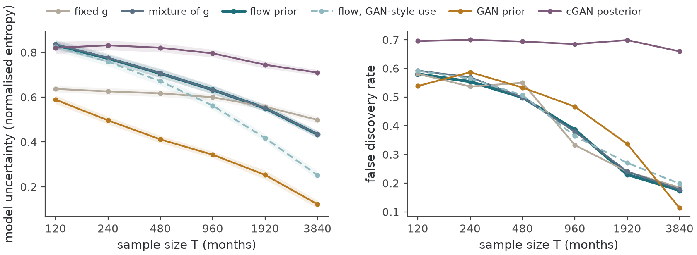

### 4.3 The density question

Thirty fresh panels, every route scored against the exactly computable posterior. At $T = 3840$:

| route | TV from exact posterior | entropy (exact: 0.4369) | mean abs. error in log L | bias in log L |
|---|---|---|---|---|
| flow prior, density route | 0.0159 | 0.4353 | 0.2455 | −0.1260 |
| exact prior, sampled | 0.5968 | 0.2021 | 16.6263 | −16.4545 |
| flow prior, sampled | 0.6031 | 0.2390 | 16.5208 | −16.2928 |
| GAN prior, sampled | 0.7958 | 0.1254 | 152.7042 | −152.6921 |
| cGAN posterior | 0.8612 | 0.7067 | 15.2357 | +15.2357 |

The second row is decisive. It uses the **exactly correct prior** — draws from the very hyper-g/n mixture the
baseline integrates analytically — and estimates the same integral by sampling. Its posterior sits 0.5968 away
in total variation and its entropy is 0.2021 against a true 0.4369, understated by 54%. The first row uses an
*approximate* prior, a flow with a measurable KL error of up to 0.03 nats, and lands 0.0159 away with an
entropy of 0.4353. **Having the density matters roughly forty times more than having the right prior.**

The mechanism is equation (7). The prior-sampling estimator's median ESS falls from 22.3 at $T=120$ to 1.02 at
$T=3840$ for the flow and from 3.36 to 1.00 for the GAN, out of 20,000 draws; the density route runs at 164.5
to 251.4 out of 256, *improving* with $T$ as (6) predicts. Regressing $\log \mathrm{ESS}$ on $\log T$ recovers
the predicted $-d/2$ wherever the estimator has not hit its floor: $-0.480 \pm 0.002$ at $d=1$ against $-0.5$,
$-0.937 \pm 0.007$ at $d=2$ against $-1.0$. From $d \ge 4$ the ESS is pinned at 1 across most of the range, so
the regression is censored and its slope attenuated — the flattening in Figure 5 is that censoring, not a
failure of the rate. The animation at the top of this page shows the consequence on the model space: as $T$
grows, the sampling route's posterior collapses onto a few factor subsets while the density route keeps the exact shape.

The practical version of the same fact, for the three-factor true model at $T=3840$:

| route | draws | RMSE of log L (nats) | bias | median ESS |
|---|---|---|---|---|
| density | 64 | 0.0081 | +0.0001 | 63.6 |
| density | 2048 | 0.0017 | +0.0001 | 2035.8 |
| prior sampling | 1000 | 21.2965 | −16.4128 | 1.0000 |
| prior sampling | 100000 | 0.6106 | −0.1572 | 3.9721 |
| prior sampling | 1000000 | 0.1642 | +0.0243 | 34.6439 |

Sixty-four draws with a density beat a million without one, by a factor of twenty, on a three-dimensional
model — and the budget scales as $T^{d/2}$, so the gap widens with both the sample and the factor set.

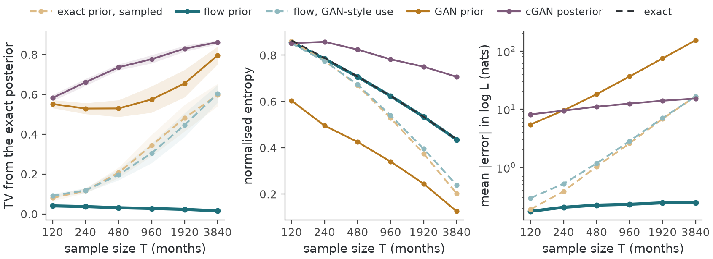

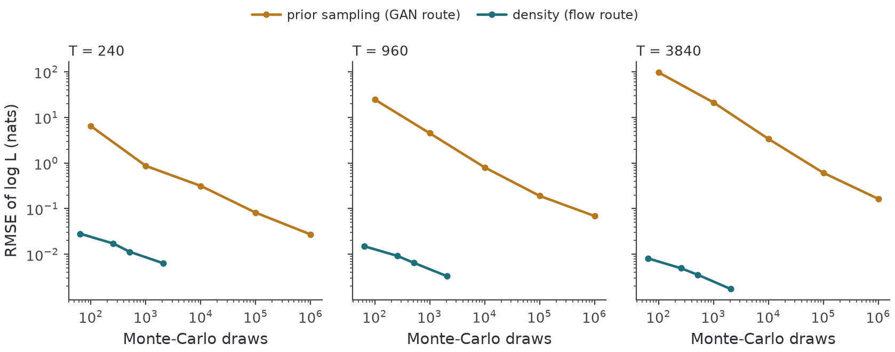

### 4.4 Is the entropy measure calibrated?

Binning replications by the probability each method assigns to its own MAP model, and comparing with how often
that model really is the true one, gives an expected calibration error of 0.0142 for the exact mixture and
0.0164 for the flow. The density-free routes are far worse: 0.0894 for the same flow sampled, and **0.1712 for
the GAN**, which claims 0.779 and delivers 0.591 in its top bin, and claims 0.428 and delivers 0.155 in the
next. The GAN's low entropy is not sharper inference; it is measured overconfidence.

Entropy does carry information about selection error: its correlation with the indicator that the MAP model is
wrong is positive for every method that ever gets the MAP right, from 0.271 for fixed $g$ to 0.575 for the GAN.

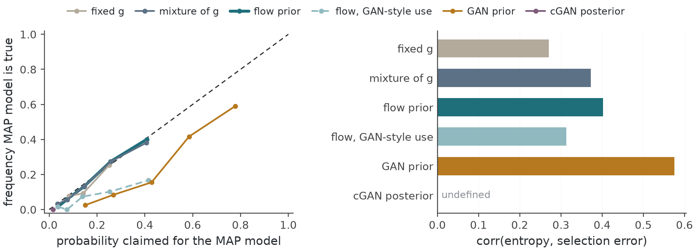

### 4.5 What the cGAN's uncertainty measure does

Its redundant-factor inclusion probability is 0.6848, 0.6757, 0.6642, 0.6544, 0.6473, 0.6353 across a
thirty-two-fold increase in $T$ — flat, and never improving. Its entropy is likewise stuck near 0.71–0.83 while
the true value falls from 0.86 to 0.44. **This reproduces the seminar's own finding** that the cGAN is "robust
to $T$ but does not improve", and supplies the reason: its effective sample size is 247.8 out of 256, because
its conditional output is so concentrated near the maximum-likelihood point that every draw carries almost the
same weight. The pricing-error average then has no complexity penalty scaling with the sample, so nothing in
the construction can respond to $T$. Its log-likelihood bias is $+15.24$ nats, positive, because the data enter
twice.

### 4.6 Does the uncertainty measure earn its keep?

Two answers, one positive and one not.

**Yes for SDF instability.** Over rolling 240-month windows on stationary simulated panels, the Spearman
correlation between measured entropy and the subsequent drift in the model-averaged SDF loadings is 0.3839
$[0.2118, 0.5321]$ for the exact mixture, 0.2950 $[0.1376, 0.4279]$ for the flow and 0.2027 $[0.0320, 0.3498]$
for fixed $g$: high uncertainty really is followed by loadings that move. The cGAN is the exception at
$-0.0915$ $[-0.3070, 0.1108]$ — its measure predicts nothing.

**Not demonstrably for out-of-sample performance.** Splitting the 517 out-of-sample months of the real
Fama–French panel into terciles of measured uncertainty, in the form of Table 5 of the base paper:

| method | full sample | low uncertainty | middle | high | low − high | 95% CI | boot p |
|---|---|---|---|---|---|---|---|
| mixture of g | 1.0060 | 1.2218 | 1.0632 | 0.7818 | +0.4401 | [−0.5284, +1.3713] | 0.3695 |
| flow prior | 1.0060 | 1.3583 | 0.8588 | 0.8637 | +0.4946 | [−0.5605, +1.4764] | 0.3420 |
| GAN prior | 0.6210 | 0.4136 | 0.5002 | 1.3400 | −0.9264 | [−1.7576, −0.2288] | 0.0100 |

The sign of the base paper's result replicates — the model-averaged SDF earns more per unit of risk in
low-uncertainty periods — but on a six-factor panel it does not survive a stationary bootstrap. On the
stationary simulation, where the true SDF never changes and measured uncertainty is pure sampling noise, there
is no relationship at all ($-0.0589$, $[-0.4238, +0.2941]$, $p = 0.7385$) — the control one wants. The GAN row
runs the other way and is nominally significant, best read as a reminder that its entropy is not measuring what
the others measure.

One caution. On the real panel the correlation between entropy and the next-120-month pricing error is strongly
**negative**, $-0.6797$ $[-0.8810, -0.3343]$ for the exact mixture. That is very likely an artefact: entropy is
high exactly when the in-sample maximum Sharpe ratio is low, the Sharpe ratio is persistent, and the pricing
error of a heavily shrunk SDF is close to the realised maximum Sharpe ratio, so measure and target share a
driver. It is reported because it was measured, not because it supports anything.

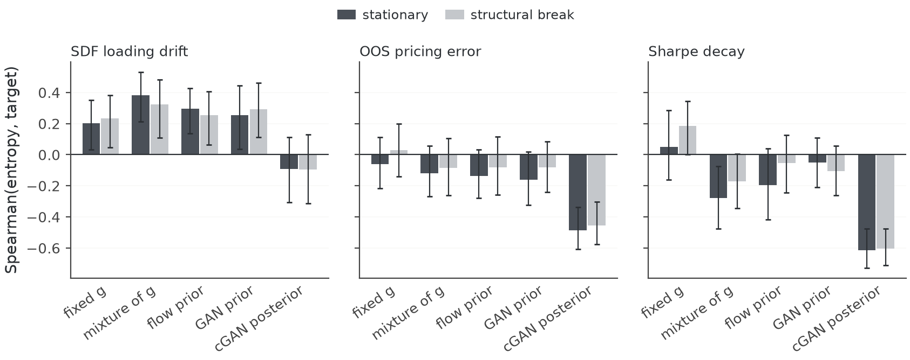

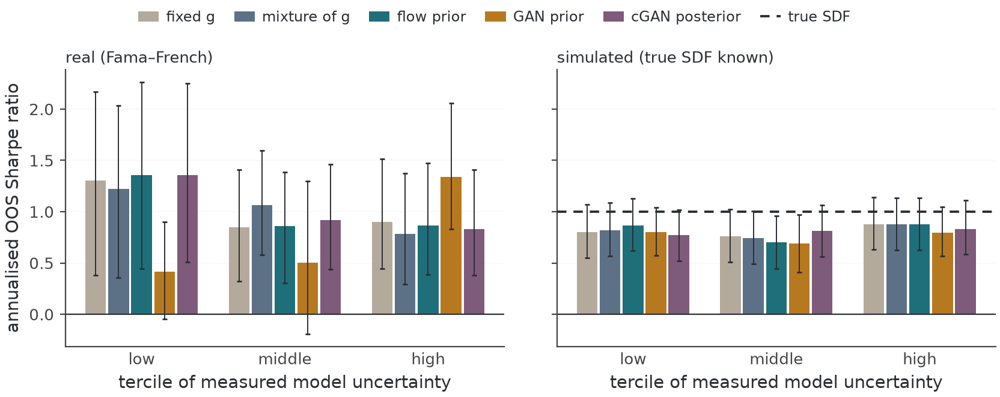

### 4.7 The Sharpe-ratio claim, with error bars

Expanding-window out-of-sample test on the real Fama–French panel, 517 months from 1983-07 to 2026-07, six
factors, refitted every 6 months, 4000 stationary-bootstrap resamples with a mean block of 12 months and the
same index path for every strategy:

| strategy | Sharpe | 95% CI | difference vs all-factors | 95% CI | boot p |
|---|---|---|---|---|---|
| BMA, cGAN posterior | 1.0158 | [0.6786, 1.4114] | +0.0037 | [−0.0081, +0.0148] | 0.5360 |
| all factors (plug-in MVE) | 1.0120 | [0.6746, 1.4150] | — | — | — |
| BMA, flow prior | 1.0041 | [0.6681, 1.3989] | −0.0079 | [−0.0417, +0.0249] | 0.6390 |
| BMA, mixture of g | 1.0034 | [0.6675, 1.3993] | −0.0086 | [−0.0418, +0.0236] | 0.6025 |
| BMA, fixed g | 0.9989 | [0.6646, 1.3898] | −0.0131 | [−0.0563, +0.0262] | 0.5375 |
| equal weight | 0.9792 | [0.6459, 1.3374] | −0.0328 | [−0.3161, +0.2323] | 0.7915 |
| BMA, GAN prior | 0.5987 | [0.3136, 0.9016] | −0.4133 | [−0.6847, −0.1493] | 0.0020 |
| market only | 0.5340 | [0.2282, 0.8728] | −0.4780 | [−0.9273, −0.0529] | 0.0280 |

**The seminar's ranking reproduces; the claim does not.** The cGAN model average does come out on top, as on
slide 27 of the deck — and its margin over simply using all the factors is 0.0037 annualised Sharpe, with an
interval spanning zero and a bootstrap p-value of 0.536. Seven strategies share one return series, so the
Bonferroni-corrected level is 0.0071. The top five are separated by 0.017 of Sharpe while the interval on each
is roughly 0.75 wide.

Two differences *do* survive: the GAN prior makes the portfolio significantly worse ($-0.4133$, $p = 0.0020$,
below the corrected level), matching the direction of the seminar's Prior Change result; and holding the market
alone is worse than model-averaging. On the simulated panel, where the true SDF has an annualised Sharpe ratio
of 1.0, every model-averaged portfolio reaches 0.81 and none beats the plug-in mean-variance-efficient
portfolio significantly (mixture of g: $+0.0236$, $[-0.0113, +0.0578]$, $p = 0.1690$).

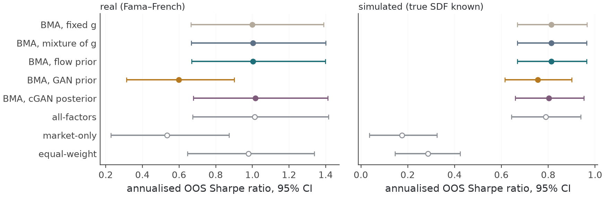

### 4.8 The seminar's own figures, and what reproduced

Three figures from my seminar deck of 2026-01-08 are my own output and are reproduced here for comparison. The other
images on those slides are screenshots of tables from Huang & Shi (2025) — Tables 1, 4 and 5 — or third-party
illustrations, and are not shown; anything that could not be attributed with confidence was left out.

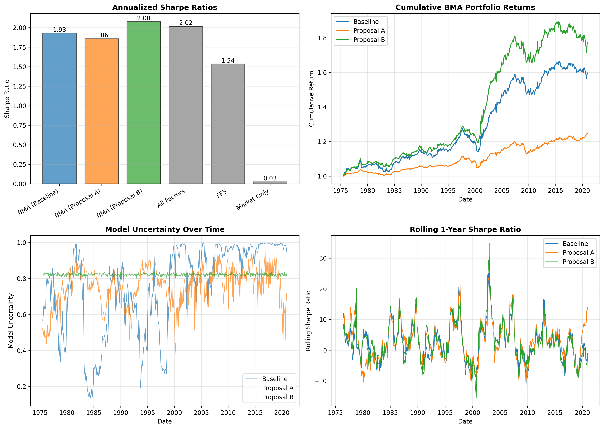

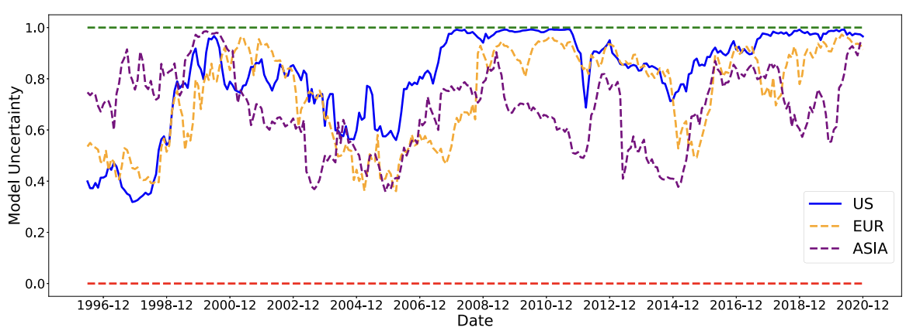

What reproduced: the mixture of g dominating a fixed $g$ asymptotically; the cGAN's redundant-factor
probability flat in $T$ and never improving; the GAN prior lowering measured uncertainty; the GAN prior hurting
the portfolio; the cGAN model average topping the Sharpe table. What did not: the interpretation of the last
two. Lowering the measured uncertainty is not an improvement here but a twelve-fold calibration failure, and
the cGAN's Sharpe advantage, once it carries an interval, is 0.0037 ± 0.011.

### 4.9 Control — what tuning the prior's shape bought

**The analytic family has almost nothing to tune.** Over the whole 21 × 21 grid of $(a, \log_{10} h_{\max})$
the training objective moves between 0.25614 and 0.25794. The default $a = 3$, $h_{\max} = 100$ scores 0.25687,
$7.3 \times 10^{-4}$ from the optimum at the corner $a = 2.1$, $h_{\max} = 10^3$. As an optimiser BO does its
job: across 10 seeds its median regret reaches 0 at evaluation 9, while random search and the Sobol sequence
still have median regrets of $3.7 \times 10^{-4}$ and $2.8 \times 10^{-4}$ after 20. What it finds does not
matter. On the held-out panels the tuned prior prices slightly *worse* than the default (0.25152 against
0.25130), with a held-out entropy of 0.764 against 0.794. On the real Fama–French panel (4 windows) the best
grid point is the opposite corner, $a = 8$, $h_{\max} = 1$, at 0.53287 against 0.53615 for the default. The
optimum belongs to the panel, not to the prior.

**The flow's shape can be tuned, and the gain does not transfer.** Over the three-parameter tilt (9), BO
lowers the training objective from 0.25733 at $\theta = 0$ to 0.24352 (best seed; mean over five seeds
0.24397), ahead of random search with the same budget (best 0.24370, mean 0.24543). Every BO optimum puts the
skew $\kappa$ on its upper bound $+1$, and four of the five also put $\log\tau$ on its lower bound $-1$
(lighter tails) with $\log s$ between $-0.80$ and $-0.71$ (a narrower prior). Held out, the pricing error moves
from 0.25135 to 0.25045 (mean of the five BO tilts, range 0.25018 to 0.25055). The tilt took 0.0134 off the
training error and 0.0009 off the held-out error, about 0.4% of its level. Random-search tilts, which scored
worse in training, do at least as well held out (0.25024). No interval is attached to these held-out numbers: they come
from four panels of one simulated truth.

**What the tuning does move is the uncertainty measure.** The held-out posterior entropy falls from 0.783 at
$\theta = 0$ to 0.321 under the BO tilt (0.336 under random search): the model posterior sharpens by more than
half while the decision moves by a few parts in a thousand. The entropy depends on the prior as much as on the
data, and an optimiser free to change the prior and scored on pricing alone spends that freedom on the
uncertainty measure. Figure 17 puts the two axes side by side. A tilt chosen on pricing error therefore cannot
be read as evidence that model uncertainty is lower, and the probability on the true model, which section 4.10
tracks, does not rise with it.

**The density is what makes the loop affordable.** At $T = 240$, one evaluation of the objective through the
density route (128 draws) takes 1.35 s, with a Monte-Carlo standard deviation of $3.8 \times 10^{-4}$ across
seeds. The prior-sampling route, the only one a GAN has, takes 58.0 s at 20,000 draws for a noisier objective
(sd $6.6 \times 10^{-4}$), 43 times the time. At $T = 960$ the ratio is 42 (0.83 s against 34.9 s). The
optimisation in Figure 16 spent 400 evaluations at 1.58 s each.

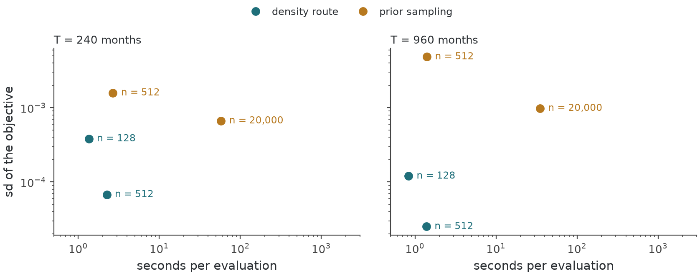

### 4.10 Adaptation — what re-tuning at every refit bought

Pricing error minus that of the flow as trained (controller a), with 95% stationary-bootstrap intervals over
refit times, and the matching change in posterior entropy:

| controller | stationary: Δ error | break: Δ error | Fama–French: Δ error | Δ entropy (stat. / break / FF) |
|---|---|---|---|---|
| (a) flow, $\theta = 0$ — level | 0.13626 | 0.14996 | 0.87498 | 0.774 / 0.769 / 0.459 |
| (b) hyper-g/n, $a=3$, $h_{\max}=100$ | +0.00094 [+0.00015, +0.00185] | +0.00076 [+0.00008, +0.00149] | +0.00030 [−0.00041, +0.00104] | +0.005 / +0.007 / +0.006 |
| (c) tune once | +0.00269 [+0.00006, +0.00536] | +0.00049 [−0.00540, +0.00676] | −0.00138 [−0.00563, +0.00280] | −0.014 / −0.284 / −0.095 |
| (d) adapt, BO every refit | −0.00235 [−0.00822, +0.00372] | +0.00680 [−0.00117, +0.01549] | +0.02025 [−0.00018, +0.04385] | −0.343 / −0.321 / −0.111 |
| (e) adapt, random search | −0.00385 [−0.00984, +0.00213] | +0.00529 [−0.00014, +0.01104] | +0.00065 [−0.00138, +0.00265] | −0.320 / −0.323 / −0.054 |
| (f) hindsight bound (unattainable) | −0.01209 [−0.01989, −0.00430] | −0.00466 [−0.01129, +0.00250] | −0.00183 [−0.00585, +0.00212] | −0.446 / −0.173 / −0.081 |

**In a stationary market, adapting bought nothing measurable.** Re-tuning at every refit changed the
population pricing error by $-0.00235$ $[-0.00822, +0.00372]$ with BO and $-0.00385$ $[-0.00984, +0.00213]$
with random search; both intervals contain zero. Tuning once and freezing was significantly *worse*,
$+0.00269$ $[+0.00006, +0.00536]$. There was room to improve: the hindsight tilt beats $\theta = 0$ by
$-0.01209$ $[-0.01989, -0.00430]$, and adapt BO stays significantly behind it ($+0.00974$
$[+0.00355, +0.01647]$). The hindsight tilt is chosen on the same refits it is scored on, so these two
intervals are optimistic.

**A structural break did not give adaptation a job either.** Over all refits, adapt BO is $+0.00680$
$[-0.00117, +0.01549]$ and adapt random $+0.00529$ $[-0.00014, +0.01104]$: worse as point estimates, with both
intervals including zero, the second only just. Before the break, adapt random is significantly worse,
$+0.00813$ $[+0.00545, +0.01090]$. After it, no controller differs from $\theta = 0$ (adapt BO $+0.00461$
$[-0.00454, +0.01453]$), and even the hindsight tilt, chosen on the whole sample, does not help
($+0.00238$ $[-0.00391, +0.00975]$). Within this tilt family, reshaping the prior did not absorb a rotation of
the SDF loadings.

**On the Fama–French panel, adapting with BO was the worst controller,** at $+0.02025$
$[-0.00018, +0.04385]$ against $\theta = 0$ ($p = 0.054$). From the 2001 refit to the 2023 refit BO held the
skew at or near its lower bound $-1$, with the tail and scale coordinates also at $-1$ for most of that span.
The cumulative difference was against BO through the 1996 refit, in its favour from the 1997 to the 2008
refit (except at 2001), and rose almost steadily from the 2009 refit on (Figures 20 and 21). Tune-once ($-0.00138$ $[-0.00563, +0.00280]$) and adapt random ($+0.00065$
$[-0.00138, +0.00265]$) cannot be told apart from $\theta = 0$.

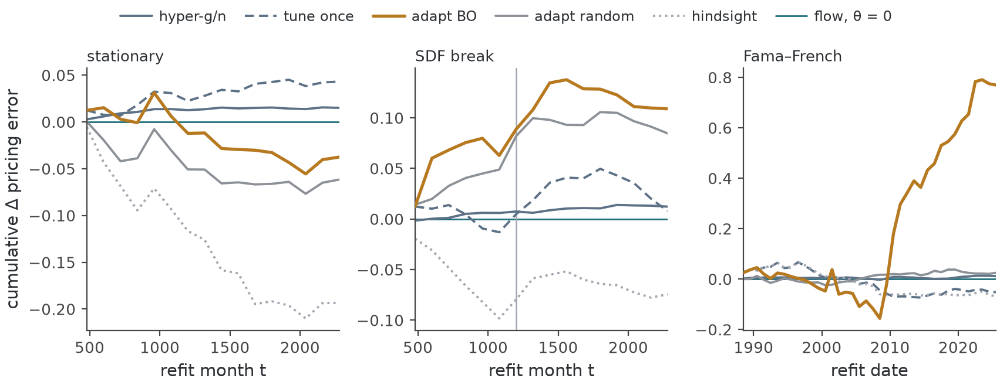

**The one consistent effect is on the uncertainty measure.** Both adaptive controllers lower the posterior
entropy in every setting — adapt BO by 0.343, 0.321 and 0.111, all with intervals excluding zero. Tune-once does
so in the break regime and on real data, but not in the stationary regime ($-0.014$ $[-0.030, +0.003]$). The
probability placed on the true model does not rise: in the stationary regime it is 0.0053 under $\theta = 0$
and 0.0018 under adapt BO. With 1,024 candidate models and 240-month windows that probability stays below 0.02
for every controller, so it is a weak diagnostic, but it does not move in the direction a sharper posterior
would need. As in section 4.9, the lower entropy is produced by the tilt, not learned from the data.

**Why: the controller optimises noise.** At the first refit the warm start is $\theta = 0$, so the
tune-once search records both what the internal objective promised and what the decision then delivered:

| setting | promised at first refit | delivered at first refit | internal pricing-error level | evaluation error level | range within one search | θ jump per refit, BO / random |
|---|---|---|---|---|---|---|
| stationary | +0.0050 | −0.0123 | 0.4837 | 0.1363 | 0.0122 | 0.92 / 0.79 |
| break | +0.0084 | −0.0123 | 0.4712 | 0.1500 | 0.0151 | 0.78 / 0.94 |
| Fama–French | +0.0287 | −0.0251 | 0.6273 | 0.8750 | 0.0939 | 0.36 / 0.19 |

A positive delivery would mean the tuned prior priced better than $\theta = 0$; every setting delivered a loss.
The internal objective scores 60-month test windows with the sample mean, at a level of about 0.48, while the
population error it stands in for is about 0.14, and its whole range across one search is 0.012. In the
stationary regime, where the truth never changes, adapt BO still moves $\theta$ by 0.92 per refit in a box of
side 2: it tracks noise.

**The flow is at least as good as its analytic teacher.** Hyper-g/n minus the flow is $+0.00094$
$[+0.00015, +0.00185]$ (stationary) and $+0.00076$ $[+0.00008, +0.00149]$ (break): significant, but under 1% of
the error level. In practice the two are the same prior, which is what section 4.2 found for selection.

## 5 Discussion — what the surrogate bought

| question | what the density made possible | what it bought | what it did not |
|---|---|---|---|
| check (4.2–4.4) | the exact posterior as a reference, and the density route (6) | posterior within 0.0159 TV of exact; entropy difference −0.0008 [−0.0017, +0.0001] | a consistency theory; the check holds only in the conjugate case |
| control (4.9) | 1.35 s per evaluation of any reshaped prior through its density | BO's median regret on the analytic grid reaches 0 at evaluation 9; training error 0.25733 → 0.24352 | held-out error only 0.25135 → 0.25045, while entropy falls 0.783 → 0.321 |
| adapt (4.10) | re-tuning at every refit on past data only | nothing significant in any setting | Fama–French +0.02025 [−0.00018, +0.04385]; entropy falls regardless |

The surrogate is controllable in exactly the sense the research direction asks for: any candidate prior can be
reshaped and scored through its density in about a second, which a sampler-only prior cannot do at comparable
cost or noise.
The experiments show that controllability is not the bottleneck; the objective is. Out-of-sample pricing error
is nearly flat in the prior and is identified mostly by noise, while the one quantity that responds strongly
to the prior is the model-uncertainty measure itself. An unconstrained control loop therefore manufactures
certainty. This answers, for this setting, the question the seminar closed on: lowering model uncertainty by
tuning the prior is not desirable, because what should accompany a genuinely sharper posterior does not
follow: pricing improves by no more than noise, and the probability on the true model does not rise.

The hindsight bound suggests the negative result belongs to this controller, not to adaptation in general. A
better fixed tilt existed in the stationary regime (though the bound is selected on the data it is scored on)
and was not found by an objective whose noise is of the order of the effect. The next controller has to change the objective, not the optimiser.

## 6 Limitations & next steps

**The consistency theory is missing.** Agreement within 0.0159 in total variation on one conjugate case is what
makes the flow prior a validated drop-in; it is not a substitute for asymptotics. The hyper-g/n consistency
result rests on the prior's tail behaviour, and a flow-based prior needs an analogous condition — a tail index,
or a bounded density ratio to a reference prior — before anything can be claimed asymptotically. This is the
main piece of work remaining.

**The model space is enumerated.** Visiting all $2^{10}$ models exactly is what makes the comparison possible
and also caps the factor set at roughly twenty. A realistic zoo needs a stochastic search, and the error
analysis of section 2.4 has to be redone inside a sampler, where noise in $\log \hat L$ interacts with the
acceptance ratio.

**$\Sigma$ is conditioned on, not integrated out**, so the reported posteriors understate uncertainty at
$T=120$. **One fixed $g$ and one architecture** ($g=100$, six coupling layers). The hyperprior has now been
swept on the 21 × 21 grid of section 4.9 for the pricing objective, which is nearly flat; the selection
metrics of section 4.2 were not swept. **The empirical panel is small** — six Fama–French factors, not the 275
characteristic-sorted portfolios or the 14-factor set of the base paper, and no risk-premium estimate in the
Giglio–Xiu three-pass style; a larger factor set is the way to find out whether the flat tercile result in
section 4.6 is a power problem or a real absence.

**Control and adaptation rest on few panels and one tilt family.** The control experiment's held-out numbers
come from four simulated panels without intervals, and its real-data run uses 4 windows. The adaptation
experiment has three simulated panels per regime; its bootstrap resamples refit times with the panels held
fixed, so panel-to-panel variation is not in the intervals, and no correction is made for the many comparisons.
The tilt (9) has three element-wise parameters, and many chosen tilts sit on the bounds of $[-1, 1]^3$, so the
box acts as an implicit regulariser; a wider box would likely sharpen the entropy collapse. The hindsight bound
is the best of 74 evaluated tilts, not a proven optimum, and is selected on the refits it is scored on. On the
real panel the internal objective of the first five refits rests on a single 60-month test window. **Non-stationarity is still thin**: one simulated
rotation of the loadings, for a problem the seminar itself flagged as central.

**The GAN was trained once per dimension with one set of hyperparameters.** A better-tuned GAN would have
lighter tail error. It would not acquire a density, so section 4.3 would be unchanged — but the GAN rows in
section 4.2 mix estimator degeneracy with fit quality, and only the "flow, sampled" row cleanly isolates the
estimator.

**Next steps, none of them run yet.** (i) A control objective that is sensitive to the prior: the predictive
likelihood of the next window, which the density route estimates with low noise, in place of a noisy sample
pricing error. (ii) An entropy guard: penalise departures from $\theta = 0$, or require the tuned posterior to stay
calibrated in the sense of section 4.4, so the loop cannot buy certainty. (iii) Longer internal test windows
for the adaptive controller, so its objective's noise falls below the effect it is chasing. (iv) The
consistency condition above, and a stochastic model search for a factor set beyond twenty.
