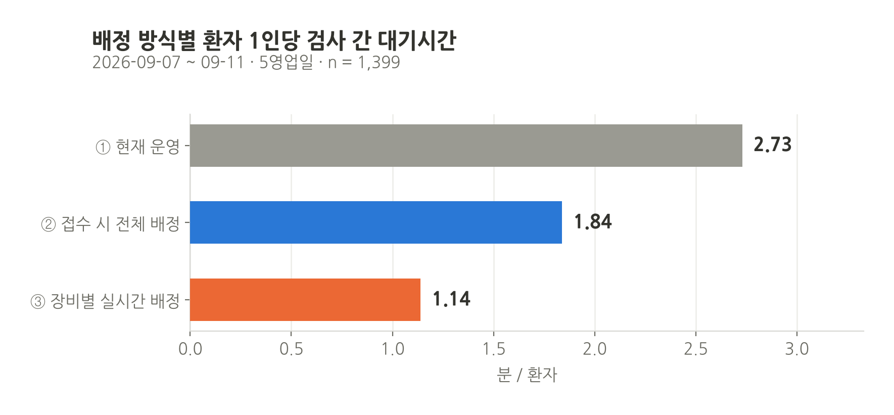
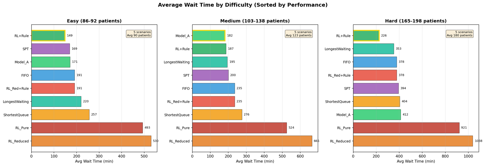
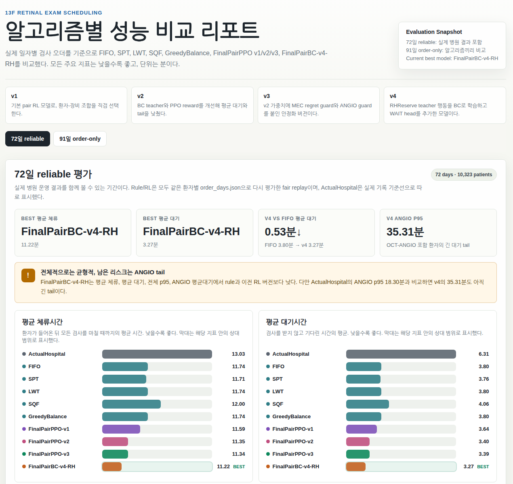
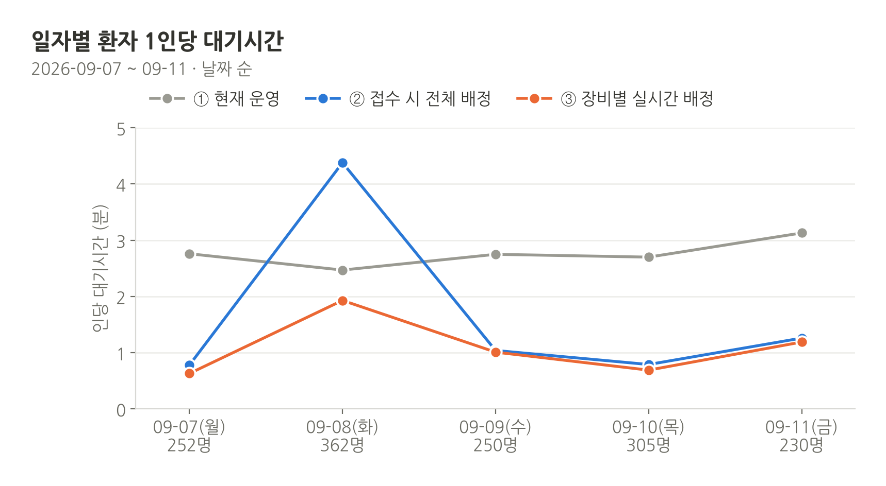
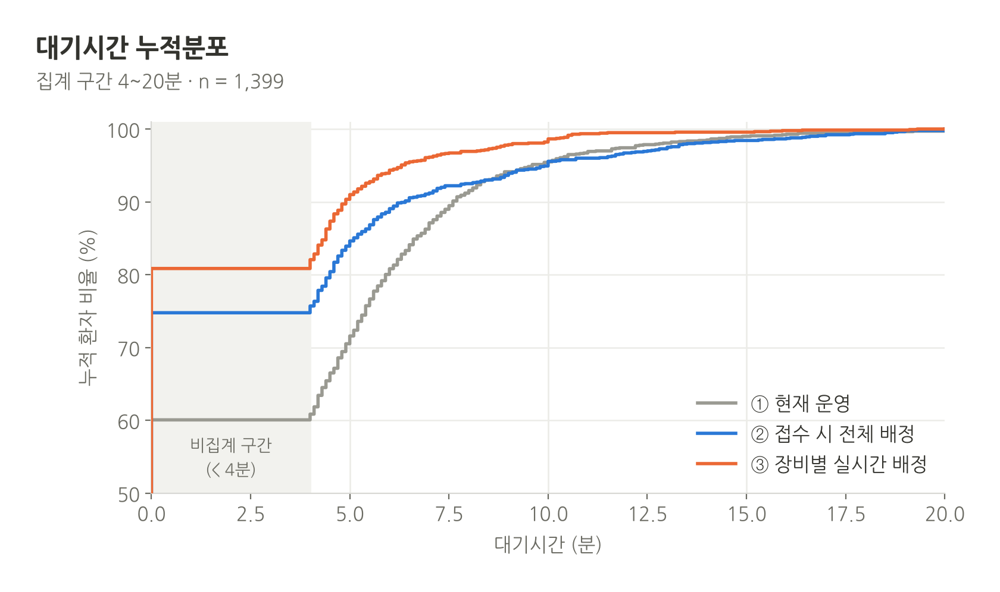
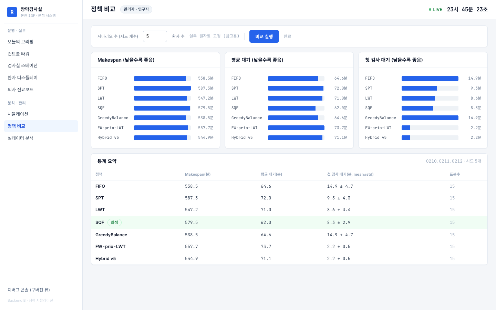
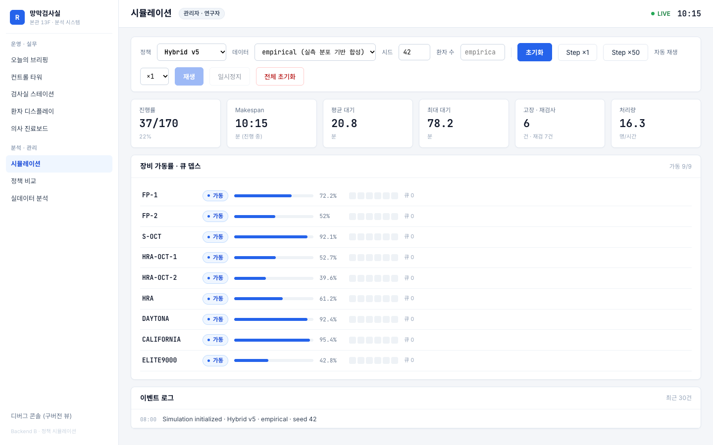

A retina examination room runs eight imaging devices and about 160 patients a day, each ordered one to six exams; a nurse at a desk decides which device each waiting patient goes to next. This is my project with Nune Eye Hospital to make that decision by a policy — and, more carefully, to find out *which kind* of policy, evaluated *how*. It started in February 2026 with a simulator built from the hospital's device list, went through three rounds of the simulator being wrong, connected to the hospital's live records in August, and since September has compared its assignment against current operation on real days. The results are real and so are the parts that failed: pure reinforcement learning over the raw action space, reward shaping, and two settings that quietly favoured the simulation.

## The room and the question

The room is the 13th-floor retina examination suite of Nune Eye Hospital. The device table lists nine devices: two fundus cameras (F/P), one OCT and two HRA-OCT units that also do angiography, one HRA for angiography only, two wide-field cameras (DAYTONA, CALIFORNIA) of which only CALIFORNIA can run wide-field angiography, and one OCT-angiography unit (ELITE9000); in August the second fundus camera turned out to be a backup in another room. A visit orders between one and six exams — 191 distinct combinations were seen — and three exams (F/P, W/P, OCT-S) appear in about 93 % of visits while angiography appears in under 1 %. Two devices are single points of failure: CALIFORNIA for wide-field angiography and ELITE9000 for OCT-angiography (9.6 % of exams, one device).

The decision is local and repeated: whenever a device frees or a patient arrives, choose one (patient, device) pair, or wait. The objectives the hospital cares about are the wait from arrival to first exam, the wait between exams, the total time in the room, and the length of the day. They conflict — a policy that minimises the day's length is not the one that minimises how long a newly arrived patient stands at the desk — and the first-wait rule is about what happens when a metric's definition is read carefully.

**What this is not.** The project scope, agreed with the hospital in April 2026, excludes building or changing the EMR, writing anything back to it, and the examiner UI as a product; the operations screens in the operations section are a research prototype. Everything in this write-up is an aggregate; no patient-level record leaves the lab server.

## The data, and what was unreliable

Five EMR tables already exist and are read as-is: check-in, exam orders, exam items with start and completion times, device capture records, and completion logs. The first extract covered 15 weekdays (2026.02.10–03.05); the full extract used for the final evaluation covers 91 days, 2026.02.10–05.30, 47,134 exam rows.

Two things in that data are not usable at face value. First, from 2026.02.10 to 03.13 a system fault distorted exam start times, so those days' service times and waits are wrong, while their arrivals and exam orders are fine — they are used for arrival and case-mix distributions and excluded from service-time and wait estimates. Second, some days recorded exam types only as daily totals, so the per-visit exam combination had to be reconstructed. The final evaluation therefore keeps two sets: a **72-day reliable set** (10,323 patients, visits with consistent start/end ordering only; 930 visits dropped) that can be compared against the hospital's actual operation, and a **91-day order-only set** (14,385 patients) usable for comparing algorithms against each other but not against reality. Both are regenerated from the raw spreadsheets by script and the regenerated files match the committed ones byte for byte (SHA-256 checked).

Device breakdowns are not logged; the simulator assumes MTBF 150 min and MTTR 20 min. Re-examination reasons are not logged either; a Poisson(0.3) rate is assumed. Both are stated as assumptions, not measurements.

## The simulator, recalibrated

A discrete-event simulator models patients, device queues, exam durations, concurrent exam rules (FAG with ICG, wide-field FAG with ICG) and device breakdowns. Arrivals follow the empirical time-of-day curve (two peaks, 09:00–10:00 and 13:00–14:00), the daily count follows the empirical distribution (median 170, range 64–229; it is over-dispersed relative to Poisson, so a bootstrap over observed days is used rather than a rate), and service times are drawn from per-exam empirical pools — FAG alone and FAG-with-ICG are pooled separately because ICG is only ever measured as part of the pair.

The first version synthesised exam combinations from a configuration table. That put angiography in about 10 % of visits where the room has 0.3 %, a thirty-fold over-representation, and the simulated time in system was 188 minutes against a real 13. Every policy comparison made on that simulator — including the February results below — describes a room that does not exist. The fix (June 2026) samples the actual per-visit combination from the 14,385 real visits, frequency-weighted, with rare exams outside the model (1.6 %) excluded. After it:

| | real (91 days) | simulator, before | simulator, after |
|---|---:|---:|---:|
| patients per day, mean (min–max) | 158 (64–229) | 156 (66–229) | 153 (14–224) |
| time in system, mean / median / p95 (min) | 13.0 / 10.8 / 28.2 | 188.4 / 160.0 / 469.1 | 11.0 / 9.7 / 22.5 |
| exams per patient | 3.28 | 3.42 | 3.26 |
| makespan, mean (min) | 466 | 536 | 532 |

Exam shares after recalibration: F/P 29.2 %, W/P 29.6 %, OCT-S 28.9 %, OCT-angiography 9.9 %, FAG 0.3 % — a mean absolute error of 0.32 %p against the room. The remaining gap is the makespan, which the simulator overstates by about an hour because the room closes queues in ways the model does not capture; it is reported, not hidden. Two other generators built for the same room during the project were checked against the same statistics: one omitted OCT-angiography entirely (so the ELITE9000 bottleneck could not be learned at all) and overstated FAG at 27 minutes; the other got the mix right but inflated OCT-angiography durations. Neither is used.

## The policies

### Rule schedulers

FIFO (earliest arrival, first compatible device), SPT (shortest exam first), LWT (longest current wait first), SQF (shortest device queue), GreedyBalance (least-loaded device) and Random. Each is a patient-priority rule paired with a device-routing rule, and the pairing matters: routing the chosen patient to the *least versatile* compatible device (specialist-first) preserves the multi-function units for patients who need them.

### Reading the metric: the first-wait rule

The 15-day report's headline metric was *first wait*, arrival to first exam. That quantity is fixed the moment a patient's first exam starts; giving a device to a patient who is between exams cannot improve it. Plain LWT sorts on time since last status change and so routinely lets a between-exams patient jump a newly arrived one. Splitting the waiting pool explicitly — patients who have not started, ordered by age, with absolute priority over patients between exams — and only then routing specialist-first, gave a pooled first wait of 1.75 minutes on the 15-day replay where LWT gave 9.1 and the hospital's own record showed 22.3 (recorded during the start-time fault, so only indicative). No learning was involved. The lesson is in "what I learned".

### The pair-action model

The learned policy scores every valid (waiting patient, device) pair rather than choosing an exam type or a patient in isolation. Each pair carries 20 features (remaining exams, compatibility, estimated service time, current and projected device workload, the patient's accumulated and first wait, whether the patient has started) plus 7 global features (time of day, queue lengths, ELITE9000 workload). An actor-critic network produces a logit per pair and a value; from v4 onward it also has a **state-dependent wait head**, because a constant wait logit — the earlier design — cannot learn *when* waiting beats dispatching.

Training is in stages. A teacher rule generates 90,000 labelled decisions on synthetic days from the recalibrated generator (six scenario types: baseline, high volume, service variation, equipment limit, morning peak, afternoon peak, with weekday-conditional arrival curves — Monday/Tuesday morning peaks, Thursday/Friday afternoon peaks, small Saturdays). Behaviour cloning fits the model to the teacher (v4: 90.9 % action accuracy, 99.4 % on wait decisions, 86.2 % on dispatches, wait labels 35.8 % of samples). PPO fine-tuning then runs on the same generator (v1–v3), and at runtime a guard wraps the model: if a free compatible device exists for some waiting patient, a learned <i>wait</i> is overruled by a minimum-expected-completion fallback; a regret cap (v2+) rejects model actions whose estimated cost exceeds the fallback's by more than a threshold.

The v4 teacher, **RHReserve**, exists because of the ELITE9000 tail (the June replay). Rather than dispatching an angiography patient into the ELITE9000 queue as soon as they are eligible, it looks at the device's projected workload: if the queue is long and the patient has another exam that can finish before the projected slot, that exam goes first; if the queue is about to clear, the angiography patient with the largest accumulated wait goes now; and it avoids routing into another long queue that would trap the patient. Three parameters (queue window 8 min, urgency threshold 18 min, reservation buffer 2 min) were chosen by sweep on the 72-day set.

## What happened, in five rounds

### February — synthetic days, before recalibration

Fifteen synthetic days in three difficulty bands (86–92, 103–138, 165–198 patients), five RL variants against four rules. Two things survived the later recalibration as design facts rather than numbers: **pure RL over the raw 451-way (patient × device) action space failed outright** (mean wait 646 min against FIFO's 268), as did the variant that only chose the exam type; the variant that worked, "RL+Rule", let the rule dispatch whenever a device was free and let the model decide only under contention — mean wait 187 min, significantly below FIFO (p = 0.008), SPT (0.011), longest-waiting (0.011) and shortest-queue (< 0.001), while longest-waiting still had the shorter makespan (575 vs 632). The absolute numbers are from the mis-specified simulator and are not comparable to anything below.

### May — the 15-day replay

Fifteen real days replayed five times each (75 episodes per policy) on the partly recalibrated simulator. Four flat-PPO variants trained with different rewards landed between 21.6 and 43.5 minutes of first wait — the reward with an "aging bonus" was the worst — two to five times worse than Random (8.95); a flat behaviour-cloned model reached 11.6, a bipartite-attention BC model imitating LWT-specialist 8.9, the same architecture imitating the first-wait rule 4.4, and the first-wait rule itself 1.75. The rule beat everything it taught. On the two heaviest days (213 and 224 patients) the attention model failed to generalise (first wait 17–28 min) while the rule held at 2–3.

### June — the fair 72-day replay

The final environment fixes the comparison protocol: every policy sees the same patients, arrivals and exam orders from the real spreadsheets, and the same sampled service times (drawn from the empirical pools with a shared seed) — not the actual recorded start/end times, which would leak the hospital's own scheduling into the evaluation. The hospital's actual operation is reported as a reference line from its own records.

| policy, 72 reliable days · 10,323 patients | time in system | mean wait | p95 wait | OCT-angio mean wait | OCT-angio p95 | day end (min) |
|---|---:|---:|---:|---:|---:|---:|
| actual hospital | 13.03 | 6.31 | 18.10 | **6.18** | **18.30** | 454.1 |
| FIFO / GreedyBalance | 11.74 | 3.80 | 21.66 | 10.51 | 41.87 | 455.8 |
| SPT | 11.71 | 3.76 | 21.45 | 10.44 | 41.47 | 455.8 |
| LWT | 11.74 | 3.80 | 21.69 | 10.53 | 41.18 | 455.8 |
| SQF | 12.00 | 4.06 | 21.94 | 10.68 | 42.50 | 455.9 |
| PairPPO-v1 | 11.59 | 3.64 | 20.34 | 10.28 | 41.33 | 455.9 |
| PairPPO-v2 (regret guard) | 11.35 | 3.40 | 18.93 | 9.49 | 38.35 | 456.0 |
| PairPPO-v3 | 11.34 | 3.39 | 18.83 | 9.47 | 38.35 | 456.0 |
| RHReserve-v4 (teacher rule) | 11.29 | 3.34 | 16.54 | 9.25 | 36.54 | 455.7 |
| **PairBC-v4-RH, guarded** | **11.22** | **3.27** | **16.46** | 9.12 | 35.31 | 455.9 |

On the 91-day order-only set the ordering is the same (BC-v4 13.03 / 4.91 / 29.85 against FIFO 13.65 / 5.52 / 35.47 for time in system / mean wait / p95 wait, and OCT-angio p95 57.5 against 63.0).

Three readings. The rules are all within a few seconds of each other — the room under a consistent rule is already efficient, and the gain over FIFO from the best learned policy is 0.5 minutes of mean wait per patient. The best learned policy does beat every rule on every column but the day's end, and v2's regret guard is where most of the gain arrived. And the **angiography tail is not solved**: every policy, rule or learned, leaves OCT-angiography patients waiting roughly twice as long at the 95th percentile as the hospital actually does, because a human desk holds those patients back in ways none of the policies reproduce. The v4 teacher was designed for this and helped — per day, its angiography p95 improved on 43 of the 72 days, worsened on 26 and tied on 3 — but did not close it.

### August — the live records correct the simulator three more times

The read-only connection to the hospital's EMR opened on 2026.08.19 (nine views, TCP 4–5 ms, 15-second polling). Within a week the simulator was wrong in three new ways, each found in the records.

**Timestamps are not physical.** The hospital confirmed (08.17) that exam start and end are the times an order was *processed*, not when a patient arrived or left; 35 % of a patient's consecutive exams overlap in the record. The processing delay cancels in a *gap* between exams, so the metric became the gap between consecutive exams in the 4–20 minute window (below 4 minutes is record noise, above 20 is a patient who has left the floor), and it was validated by checking that the gap responds to congestion: with 12 or more patients in the room the median gap is 2.23 minutes against −0.88 with two or fewer, about 11 seconds per extra patient.

**Capacity.** A second fundus camera existed in the device table but had taken zero images in two weeks; the hospital confirmed it is a backup in another room. Device-minute records showed at most five or six devices active at once, so a concurrency cap K = 6 stands in for the staff. Dilation — F/P and angiography cannot start until the drops have worked — was missing. Adding the three tripled every simulated wait (3.3 → 9.4 minutes for the teacher rule) and left the ranking of policies unchanged; the June replay's numbers are optimistic by that factor. The v5 model was retrained in the corrected world and deployed.

**Three layers of distortion, removed in order.** With the corrected simulator the policy was *worse* than the hospital on a 42-day replay. The causes, found one at a time: (1) dilation waiting is hidden inside "before first exam" in the real record and scored as waiting in the simulation, so the comparison was asymmetric; (2) dilation readiness was a constant 10 minutes for everyone, which sent every patient to the single fundus camera at the same moment and created an artificial rush that the real room, with individually varying drops, never has — readiness became per-patient (recorded drop time + 8 minutes, σ ≈ 9); (3) 1.8 % of recorded service times were 20–60-minute artefacts that occupied a single device in replay — clipped to twice the effective time. After the three: rule 10.2 vs actual 11.4 minutes (−11 %, p90 −20 %), and the policy candidates all beat the hospital.

**A fairness audit, on request.** Asked "is there any setting that favours the simulation?", the answer was yes, twice: patients whose drops were recorded more than three hours before arrival were treated as ready (the hospital re-instils on arrival; six of 7,479 cases, corrected), and the exclusion window for dilation used the constant rather than the per-patient readiness (corrected). A third finding cut the other way — the scheduler only woke on device completion and repair, so a patient whose dilation or consent completed in a quiet hour was left until the next arrival, up to 47 minutes — and was fixed as a stall bug. The hospital's 08.24 reply fixed its own angiography timestamp overlap, confirmed the single camera, and set the dilation window at 3–4 hours; the contrast-exam protocol (consent 3–5 min, FAG 7 min, ICG 7 + 10 wait + 17, wide-field variants) went into the configuration as fixed, interruptible sequences and v7 was trained on that world.

| 44 real days, fair replay | actual operation | rule (MEC) | **v7 (deployed)** |
|---|---:|---:|---:|
| time in the room, mean (min) | 12.2 | 8.3 | **8.2** |
| wait between exams, excluding dilation (min) | 2.72 | 0.68 | **0.61** |
| worst individual wait, mean over days (min) | 16.9 | 11.2 | **10.9** |
| patients waiting 15 min or more, total | 120 | 12 | **5** |
| end of day vs actual, median | — | ±0 | −0.5 min |
| days on which time in the room is lower | — | 44 / 44 | 44 / 44 |

A v8 retrained after the stall fix tied on time in the room and lost on the tail (12 patients over 15 minutes against v7's 5), so v7 stays deployed; the tail is the interpretation rule. A premise audit of the raw tables (08.25) checked the assumptions the simulator makes: an exam is ordered once per visit (0 duplicates in 62,388), the order exists at arrival (orders precede the barcode by a median 4 minutes; 0.07 % after), 8.5 % of visits receive an additional order mid-way (handled by replanning that patient only), 0.5 % of orders are never executed.

### September — three assignment modes on live days

The comparison the hospital asked for (interim report 2026.09.11): on the same five business days (09.07–11, 1,399 patients), with per-patient wait between exams as the metric,

| mode | wait between exams, min / patient |
|---|---:|
| ① current operation | 2.73 |
| ② whole sequence assigned at check-in (fixed priority, least-loaded queue, no learning) | 1.84 |
| ③ per-device real-time assignment (behaviour-cloned model, re-inferred whenever a device frees) | **1.14** |

Two findings changed earlier conclusions. Extending the model's training window from 6 to 12 business days cut the wait from 1.67 to 1.14 minutes and the number of patients waiting over ten minutes from 53 to 11 — an earlier check on three quiet days had concluded that more training did not help; the gain lives on the busy days (excluding the busiest day the two windows differ by two seconds). And on that busiest day (Tuesday 09.08, 362 patients, a single fundus camera handling 282 exams) mode ② got *worse* than current operation (4.38 vs 2.47 minutes) because a sequence fixed at check-in cannot unwind the queue in front of one device, while mode ③ held at 1.93. Over all eleven business days available (2,736 patients) mode ③ beat mode ② every day. The comparison's own caveat, stated in the report: replayed service times longer than twice the effective time are replaced (5 % of records), and without that correction ② and ③ would look worse than ①; absence from the floor is not modelled, which counts only against ①.

## The operations system, and the database-load incident

The integration was designed so that the hospital does nothing new. A poller reads nine read-only views of the hospital's SQL Server (one account, `READ UNCOMMITTED`, `SELECT` only; there is no write path in the code) — check-in, orders, exam items, device captures, completion logs and four reference tables — into a staging schema, a cleaner applies data-quality rules, a mapping resolves exams to the eight real devices by the capture's device code (mapping by exam name alone funnels everything to the first camera), and an ingest step updates a live store whose every mutation is journaled to PostgreSQL so a restart replays the day. A coordinator aggregates the store for the screens and pushes a revision counter over server-sent events; the screens fetch a snapshot only when the counter changes. Measured: a change reaches the browser in 83 ms, and a registration, call, start or completion on one station appears on every other screen in about 200 ms. On arrival the store plans a route for the patient (dilation-free exams first, then the fundus camera, then contrast exams; least-loaded capable device, tail of the queue), an additional order replans that patient alone, and the v7 model's recommendation sits behind the call button on each station. Nothing is written to the EMR; the queue is a proposal, the fact of what happened is the device record.

The screens — a morning briefing (the day's intake against the 45-day same-weekday average, a baseline card from measured effective times, a "check these" list of patients with no progress for 90 minutes), a control tower (device tiles with queue and remaining time, bottleneck alerts with a recommended assignment, projected end of day), per-device stations with call / start / complete and a "device completed" inbox that distinguishes device-signal from button from estimated completions, a patient display, a doctor's board, a simulation tab that replays any day under any policy with a per-patient schedule sheet and an order-ticket diff between the actual and the proposed sequence, a policy comparison, a real-data analysis tab, and system-status and developer-verification tabs for the connection — were rebuilt in July–August on a new UI shell after a mock-data version, with every mock constant replaced by a live adapter and every value that cannot be computed removed (model scores, "vs yesterday" percentages, predicted arrivals). The live screens are not reproduced here because they carry patient chart numbers; the two below are from the analysis server, which runs on synthetic days only.

**The incident.** On 2026.09.09 the hospital asked whether we were monitoring their database, because they were investigating load. Our own poll log answered: since late August the server had polled 24 hours a day at 15–30-second intervals — 2,670 cycles and 13,350 `SELECT`s a day, 42 million rows — because nobody had put a service window on it. The same day the poller gained a window (weekdays 07:40–18:30, Saturdays 08:00–14:00, nothing on Sundays or at night), the two heavy views moved to once every two minutes, and the interval went to 30 seconds: −66 % queries and −75 % rows on a weekday, −73 % over a week. Then, on the decision that the hospital's investigation should not have to work around us at all, polling was stopped entirely behind a file flag that survives restarts, with resumption a single explicit call. The reply to the hospital says exactly this, with the numbers. The September comparison was built from one batch read on 09.11, not from polling.

## What I learned

- **The simulator is the experiment.** Every policy ranking made on the first simulator was wrong, not slightly but categorically, because the case mix was wrong. Validate the generator against the room's own statistics — exam shares, exams per visit, time in system, day length — before comparing anything on it, and re-check every time the generator changes.
- **Read the metric's definition before designing a reward.** The first-wait rule beat four PPO variants by an order of magnitude and the three imitation models by 2.5–6.6×, and it came from noticing that the metric is fixed at first-exam start. Reward shaping in the other direction (an aging bonus) doubled the first wait. If a rule aligned with the metric exists, it is the teacher, and the learned model's job is to beat it under conditions the rule does not see.
- **Shape the action space around what the rule cannot do.** RL over all (patient, device) pairs from scratch failed twice (February, May). What worked was letting the rule act whenever the decision is easy — a free compatible device, an obvious dispatch — and letting the model decide only under contention, then scoring valid pairs with features rather than choosing from a flat index.
- **A model that cannot say "wait" cannot manage a bottleneck.** With a constant wait logit the policy always dispatched; the ELITE9000 tail only moved once waiting became a state-dependent decision (v4) — and only with a runtime guard that forbids waiting when a free compatible device exists, because the learned wait was otherwise 35 % of decisions.
- **Fair replay means fixed inputs and sampled service times.** Comparing policies on the recorded start/end times imports the hospital's own scheduling into the service-time draws. Fixing patients, arrivals and orders from the spreadsheets and sampling service times from empirical pools with a shared seed is what makes the 72-day table a comparison of policies rather than of days.
- **Evaluate on the busy days, and count days, not just means.** Two conclusions reversed when the evaluation moved from quiet days to busy ones (training-window size; assign-at-check-in). The per-day win/loss/tie count for the angiography tail (43 / 26 / 3) says more about whether to deploy than the mean does.
- **Keep the hospital's operation as a row in the table.** It is the only line that tells you whether the simulator is missing something a human does. In June it was angiography; in August it was dilation, staff and record artefacts.
- **Ask for the settings that favour you.** The question "is there anything here that helps the simulation?" found two biases in a day. The same audit found a bug that hurt the simulation, which is how you know the audit was honest.
- **Recorded times are not physical times.** When the hospital said its timestamps are order-processing events, every absolute-time metric became unusable; the gap metric survived because the processing delay cancels, and it was believed only after it responded to congestion.
- **Polling a partner's database is a cost you owe them.** A poller with no service window ran 24 hours a day for two weeks before anyone looked. The audit, the cut and the pause are in the operations section, and so is the letter.

## Where it stands

- The June angiography gap (the June replay) turned out to be mostly record artefacts occupying the single device in replay; after clipping, the tail is better than the hospital's (the August section). What remains is structural: the simulator has no reservation object, so holding a patient for a future slot is approximated at dispatch time.
- Absence from the floor (patients returning to the clinic between exams: 2 % of transitions, but 24 % after a fundus exam, median 42 minutes) is not modelled; it counts against the hospital's row only, so the replays are conservative.
- The contrast-exam protocol is fixed-time in the model (FAG 7 minutes by the hospital's protocol; recorded 12.4); interruptible occupation of the device during the waits is the next simulator change.
- Dynamic re-assignment after every completed exam (mode ③ in the September comparison) depends on a trustworthy completion signal; the hospital fixed its angiography overlap on 08.24 and the two weeks of clean records since are the basis for deciding it.
- Hospital polling is paused (the operations section); the operations system runs on the local copy of the records until the hospital says otherwise.
- Makespan is overstated by the simulator by about an hour; the closing behaviour of the room is not modelled.
- Device breakdowns and re-examination rates are assumed, not measured.
- The September metric (wait between exams, with a 0–4 minute band not counted) is the hospital's, and it differs from the replay metrics; the two evaluations are not on the same scale and are not compared to each other here.
- The learned policy's edge over the best rule on the fair replay is real but small (about half a minute of mean wait per patient); the case for it rests on the busy days and on the tail, which is exactly where it is weakest. The pilot continues.

## Timeline

- **2026.02** — First simulator from the hospital's device list and standard durations; five RL variants against four rules on 15 synthetic days (evaluation 02.03). Pure RL fails; RL-under-contention wins on wait. First 15-day data extract (02.10–03.05).
- **2026.04.27** — Research plan agreed with the hospital; EMR, API and UI development out of scope.
- **2026.05.01** — 15-day replay report: flat PPO fails to beat heuristics; the first-wait rule becomes the recommendation. 05.04: dashboard design and a Flask operations prototype.
- **2026.06.03–05** — Simulator recalibration: real per-visit exam combinations (angiography 10 % → 0.3 %), exam-mix MAE 0.32 %p, validation against 91 real days, weekday-conditional generator; two competing generators audited and rejected.
- **2026.06.25** — Final environment: 72-day reliable and 91-day order-only sets, hash-checked; pair-action PPO v1–v3, RHReserve-v4 teacher, guarded BC-v4 with wait head; official comparison tables.
- **2026.07.22 – 08.12** — Operations screens rebuilt and wired to live data; first written questions to the hospital (07.31) on how patients, orders and device captures are stored; connector adapters (SQL Server, MySQL, PostgreSQL, CSV), a developer-verification tab, a setup-and-diagnostics path for a hospital-side install (later discarded when direct access proved to be 4–5 ms).
- **2026.08.17** — Hospital reply: timestamps are order-processing times; dilation-free exams go first; F/P concentrated on one device by rota. Analysis of three sample days concludes "the improvement cannot be proven with these records" and says why.
- **2026.08.19** — Live read-only connection to the hospital's SQL Server (nine views, 15-second polling); the day's 115 patients and 291 exams on screen; hospital-side install package deleted.
- **2026.08.20–21** — Single camera, K = 6, dilation; v5 retrained and deployed; three simulator distortions removed; 42-day replay: rule 10.2 vs actual 11.4 min.
- **2026.08.24** — Hospital fixes its angiography timestamp overlap, confirms the single camera and the 3–4-hour dilation window; contrast protocol into the model; v7 trained and deployed; fairness audit finds two biases and a stall bug; 44-day replay: 12.2 → 8.2 min, 15-minute-plus waits 120 → 5.
- **2026.08.25–27** — Premise audit of the raw tables; v8 retrained and rejected on the tail; operations loop complete (auto route plan, replan, call / start / complete, SSE 83 ms); sessions keyed by data date; polling 28 s → 3.7 s; two journal bugs that had been silently dropping events; order-cancel detection; live count matches the hospital's exactly (140 = 140).
- **2026.09.03 / 09.07 / 09.11** — Three assignment modes compared on 3, 6 and 5 live days; interim report to the hospital 09.11; operations-screen guide 09.12; system-description slides 09.13.
- **2026.09.09** — Hospital asks about database load; our audit finds 24-hour polling; service window and −73 %; then full pause at our own decision, with a written account.
- **2026.09.28** — Cross-department patients (1.2 %) confirmed handled by the order-physician filter; dilation placeholder times identified; a five-digit time-parsing trap documented.
- **Open** — a reservation object and interruptible contrast exams in the simulator; absence modelling; the hospital's decision on dynamic re-assignment once two weeks of clean completion signals are in; resumption of polling.
