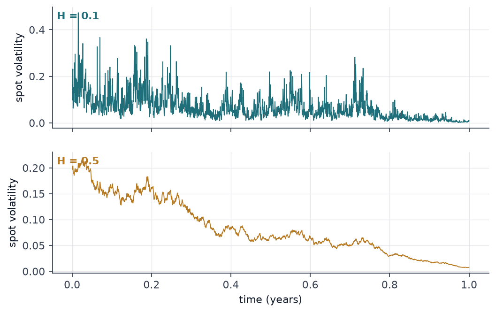
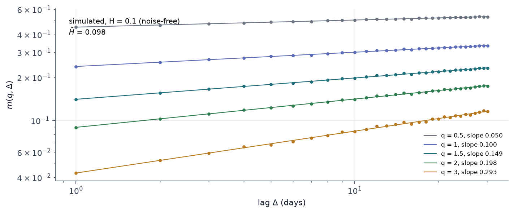
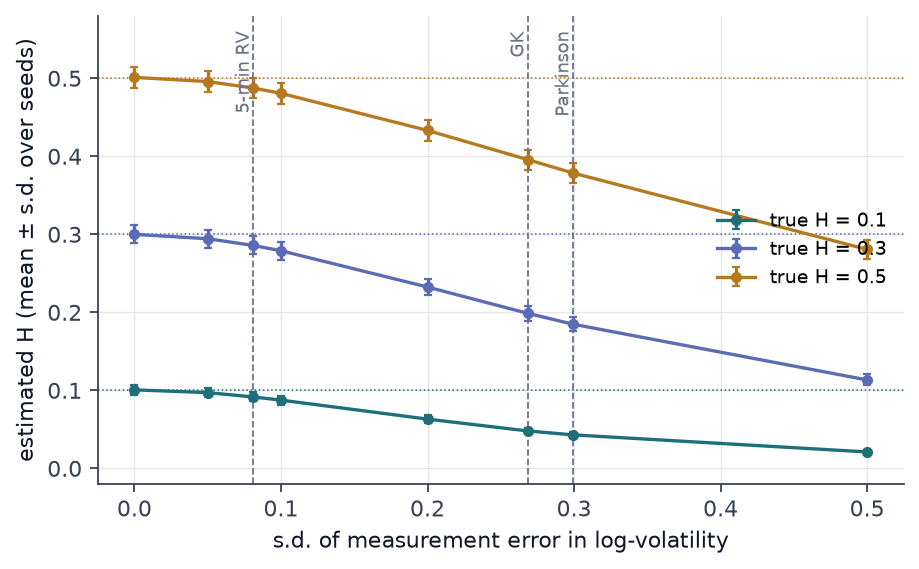
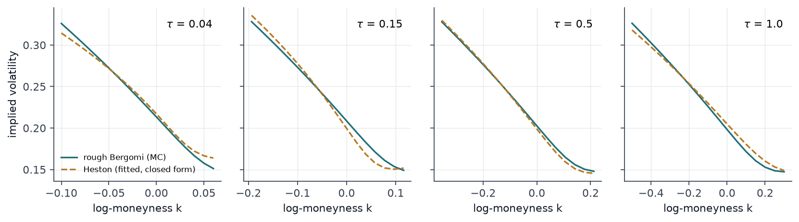
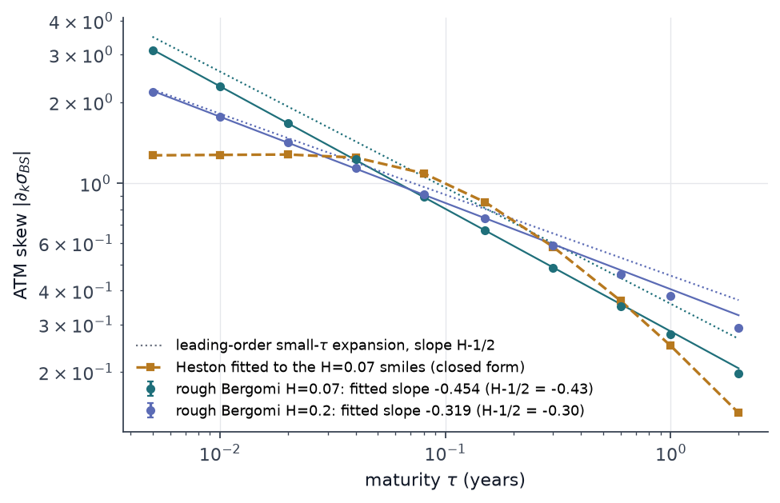
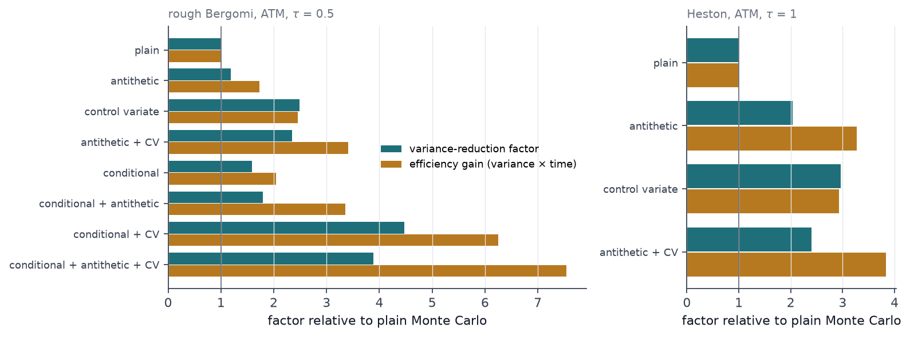
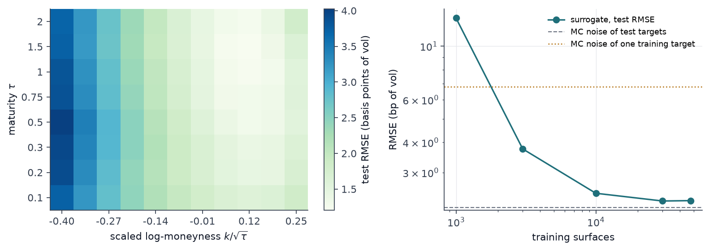
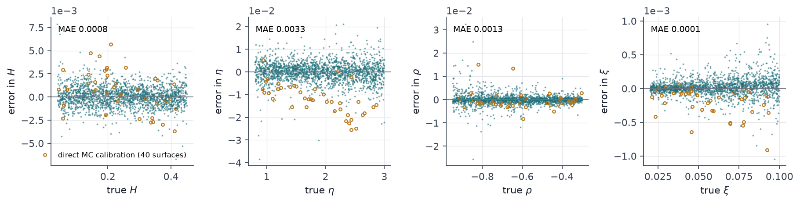

## Abstract

Rough volatility models replace the Brownian driver of log-volatility by a process with Hurst exponent H ≈ 0.1. They explain two stylised facts at once — the scaling of volatility increments and the power-law explosion of the at-the-money (ATM) implied-volatility skew — but they are non-Markovian, have no closed-form prices and are slow to calibrate. This project rebuilds the full tool chain from scratch: fractional Brownian motion (fBm) by exact Cholesky and by Davies–Harte, rough Bergomi and Heston simulators, a Fourier pricer used as ground truth, a moment-scaling Hurst estimator, an implied-volatility solver, and a neural surrogate for calibration. The emphasis is on measurement: each simulator is validated against a known law, each price comes with a confidence interval whose coverage is checked empirically, and each variance-reduction technique is scored by variance *and* by cost.

## 1 Introduction

Gatheral, Jaisson and Rosenbaum observed that moments of log-volatility increments scale as $\Delta^{qH}$ with $H$ near 0.1, far below the 0.5 of diffusions. On the pricing side, Bayer, Friz and Gatheral showed that the rough Bergomi model reproduces the observed ATM skew $\psi(\tau)\propto\tau^{H-1/2}$ with four parameters, while classical stochastic-volatility models produce a skew that flattens as $\tau\to0$.

Three practical problems follow. (i) Simulation: the Volterra kernel $(t-s)^{H-1/2}$ is singular, so naive Euler schemes are badly biased. (ii) Estimation: volatility is not observed; a noisy proxy makes a smooth process *look* rough. (iii) Calibration: every objective evaluation is a Monte Carlo run. Throughout, point estimates are never reported alone.

## 2 Method

### 2.1 Fractional Brownian motion

fBm is the centred Gaussian process with covariance

$$
\operatorname{Cov}(B^H_s,B^H_t)=\tfrac12\left(s^{2H}+t^{2H}-|t-s|^{2H}\right). \tag{1}
$$

Cholesky factorisation of (1) is exact at $O(n^3)$. The Davies–Harte sampler embeds the autocovariance of the increments in a circulant matrix of size $2n$ whose eigenvalues are one FFT away; for fractional Gaussian noise they are non-negative for every $H$, so the method is exact at $O(n\log n)$.

### 2.2 Rough Bergomi and the hybrid scheme

$$
\frac{dS_t}{S_t}=\sqrt{v_t}\,dZ_t,\qquad
v_t=\xi\exp\!\left(\eta \widetilde W_t-\tfrac12\eta^2 t^{2H}\right),\qquad
\widetilde W_t=\sqrt{2H}\int_0^t (t-s)^{H-1/2}\,dW_s, \tag{2}
$$

with $Z=\rho W+\sqrt{1-\rho^2}\,W^\perp$. I simulate $(\widetilde W, W)$ with the hybrid scheme of Bennedsen, Lunde and Pakkanen with one exact cell: the integral over the last step, where the kernel is singular, is drawn jointly with $dW$ from its exact bivariate Gaussian law; older cells use the kernel evaluated at an optimal point. The variance normalisation in (2) uses the variance of the *discretised* process, so $E[v_t]=\xi$ holds exactly on the grid. An exact joint Cholesky sampler of $(\widetilde W,W)$, whose covariance involves a Gauss hypergeometric function, serves as reference.

### 2.3 Heston and its closed form

Heston is simulated by full-truncation Euler and priced exactly by one Fourier integral along $\operatorname{Im}u=-\tfrac12$,

$$
C=S_0-\frac{\sqrt{S_0K}}{\pi}\int_0^\infty \operatorname{Re}\!\left[e^{iu\log(S_0/K)}\,\varphi_T\!\left(u-\tfrac{i}{2}\right)\right]\frac{du}{u^2+\tfrac14}, \tag{3}
$$

with the characteristic function written in the branch-stable form.

### 2.4 Estimators and output analysis

For rough Bergomi, conditional on the path of $W$ the log-price is Gaussian, so the payoff can be replaced by a Black–Scholes price with spot $S_{\text{eff}}=S_0\exp(\rho\!\int\!\sqrt v\,dW-\tfrac12\rho^2\!\int\! v\,dt)$ and variance $(1-\rho^2)\!\int\! v\,dt$ (conditional Monte Carlo). $S_{\text{eff}}$ is an exact martingale of the scheme and serves as control variate; antithetic pairs flip $(W,W^\perp)$. For an estimator with per-path variance $\sigma^2$ and per-path cost $\tau_c$ I report

$$
\text{VRF}=\frac{\sigma^2_{\text{plain}}}{\sigma^2},\qquad
\text{efficiency gain}=\frac{\sigma^2_{\text{plain}}\;\tau_{c,\text{plain}}}{\sigma^2\;\tau_c}, \tag{4}
$$

the second being the ratio of work-normalised variances (Glynn–Whitt). The unit of replication is an antithetic *pair*, not a path; the control coefficient is estimated in-sample. Whether the resulting 95% intervals deserve their name is tested by 1,000 independent macro-replications against a 4-million-path reference computed with the same discretisation.

### 2.5 Hurst estimation

With $m(q,\Delta)=\operatorname{mean}|\log\sigma_{t+\Delta}-\log\sigma_t|^q$, regress $\log m$ on $\log\Delta$ to get $\zeta_q$, then $\zeta_q$ on $q$ through the origin to get $H$. If the observed series is $\log\sigma_t+e_t$ with i.i.d. error of variance $s^2$, then

$$
m(2,\Delta)=\nu^2\Delta^{2H}+2s^2, \tag{5}
$$

so noise adds a lag-independent floor that flattens the log-log slope: $H$ is biased *downward*. Subtracting $2s^2$ gives a corrected estimator.

### 2.6 Implied volatility, surrogate, calibration

The implied-vol solver works on out-of-the-money time value with a bracketed Newton iteration started at the vega peak. The surrogate is an MLP (4-256-256-256-256-88, SiLU) from $(H,\eta,\rho,\xi)$ to an 8×11 surface ($\tau\in[0.1,2]$, $k/\sqrt\tau\in[-0.4,0.25]$). Calibration minimises the squared surface error by a batched Levenberg–Marquardt with a forward-mode Jacobian (four tangents), sigmoid reparametrisation for the box constraints and 8 Sobol starts per surface.

## 3 Experiments

**Hardware.** All runs on one shared server: RTX 3090 (GPU 2), 64 cores, torch 2.10/CUDA 12.8; CPU pools capped at 16 processes. Load averages are stored beside each timing. Seeds are fixed.

**Data.** Synthetic throughout. A real-data check on SPY daily ranges was planned, but the intended keyless source, Stooq, answered scripted requests with a JavaScript browser check; that refusal was respected (log in `data/fetch_log.json`), so no market data is used anywhere in this project. Volatility proxies studied on simulated paths: Garman–Klass and Parkinson.

**Training set.** 50,000 surfaces at 20,000 paths (scrambled Sobol parameters in $H\in[0.04,0.45]$, $\eta\in[0.8,3]$, $\rho\in[-0.95,-0.3]$, $\xi\in[0.02,0.1]$) and 2,000 held-out surfaces at 200,000 paths, 400 time steps, generated on the GPU in 28 min (26 ms and 0.20 s per surface). 47,500 were used for training, 2,500 for validation; no surface had an invalid implied vol.

**Baselines.** Heston closed form (pricing); Heston fitted to the rough Bergomi smiles (skew); plain Monte Carlo (efficiency); trust-region least squares directly on the simulator with common random numbers (calibration).

## 4 Results

**Simulators.** With 5×200,000 paths on 64 grid points the largest covariance error is 0.0081 (Cholesky) and 0.0079 (Davies–Harte); the RMS z-score of all entries is 0.80–1.15, i.e. sampling noise only. The scaling law returns $H$ within $5\times10^{-4}$ for $H$ from 0.05 to 0.7. For 4,096 steps × 1,000 paths Davies–Harte takes 0.35 s against 5.04 s.

**Heston check.** With 2 million paths and 500 steps the five strikes deviate from (3) by 1.8–2.4 standard errors (SE ≈ 4×10⁻⁵), all positive — a visible remnant of Euler bias. With 50 steps the $K=1.2$ call is off by 3.2 SE.

**Hurst estimation.** Noise-free, 6,000 days × 200 seeds: bias at most 0.0011, standard deviation 0.004 ($H=0.05$) to 0.013 ($H=0.5$). A simulated Garman–Klass proxy has log-vol error s.d. 0.268 (5-minute realised variance: 0.081); at that level a true $H$ of 0.1 / 0.3 / 0.5 is estimated as 0.048 / 0.199 / 0.396. Correction (5) restores 0.100 / 0.300 / 0.501.

What this implies for real data: Figure 3 shows that a daily range proxy would make a process with $H\approx0.15$–0.2 look like 0.08, so a raw estimate from daily OHLC says little about $H$ by itself, and the noise-floor correction rests on an i.i.d.-noise assumption that ignores overnight gaps and jumps. I did not run the estimator on market data (see Data), so this project makes no empirical claim about the roughness of any real asset.

**Smiles and skew.** Rough Bergomi ($H=0.07,\eta=1.9,\rho=-0.9,\xi=0.235^2$), 1 million paths per maturity, implied-vol standard errors at most 3.5×10⁻⁴. A five-parameter Heston fitted to four smiles has RMSE 0.59 vol points and cannot match the short end.

| Model | fitted exponent | local slope, shortest τ | theory |
|---|---|---|---|
| rough Bergomi $H=0.07$ | −0.454 (τ ≤ 0.3) | −0.447 | −0.43 |
| rough Bergomi $H=0.2$ | −0.319 | −0.309 | −0.30 |
| Heston (fitted) | −0.008 (τ ≤ 0.04) | — | 0 |

The exponents are steeper than $H-\tfrac12$ by 0.01–0.02 and drift further at long maturities (−0.48 at τ = 2 for $H=0.07$): the power law is a small-τ statement. Discretisation also matters: at τ = 0.08 the skew is −0.825 with 25 steps, −0.898 with 400, −0.889 ± 0.002 with the exact sampler at 200.

**Output analysis.** Rough Bergomi ATM call, τ = 0.5, 400,000 paths, single-core CPU time (load average 17–31 during timing):

| Estimator | price ± 95% half-width (×10⁻⁴) | µs/path | VRF | efficiency gain | coverage |
|---|---|---|---|---|---|
| plain | 570.8 ± 2.19 | 18.2 | 1.00 | 1.00 | 0.952 |
| antithetic | 571.3 ± 2.01 | 12.5 | 1.19 | 1.73 | 0.963 |
| control variate | 570.8 ± 1.39 | 18.4 | 2.49 | 2.46 | 0.955 |
| antithetic + CV | 570.5 ± 1.43 | 12.5 | 2.35 | 3.41 | 0.962 |
| conditional | 571.5 ± 1.74 | 14.1 | 1.58 | 2.04 | 0.956 |
| conditional + antithetic | 570.9 ± 1.63 | 9.7 | 1.80 | 3.36 | 0.944 |
| conditional + CV | 570.8 ± 1.03 | 13.0 | 4.47 | 6.25 | 0.962 |
| all three | 570.0 ± 1.11 | 9.4 | 3.88 | 7.54 | 0.946 |

Reference (4M paths): 571.07 ± 0.35. Two lessons. First, antithetic sampling *lowers* the VRF once a control variate is present (4.47 → 3.88): both remove the same odd component of the payoff. It still wins on efficiency because a pair needs half the Gaussian draws. Ranking by variance alone would pick the wrong estimator. Second, gains depend on moneyness: for $k=-0.2$ the full combination reaches VRF 12.4 and efficiency 24; for $k=0.1$, 3.3 and 6.3. For Heston (ATM, τ = 1) antithetic + CV gives VRF 2.4 and efficiency 3.8. Coverage over all 36 estimator–strike cells lies in 0.939–0.970 (binomial s.e. 0.007), and reported SEs match the empirical spread within 5%.

**Surrogate and calibration.** Test RMSE is 2.29 bp of volatility; the targets themselves carry 2.15 bp of MC noise, leaving 0.81 bp attributable to the network — below the 6.8 bp noise of any single training surface. The learning curve is flat beyond 10,000 surfaces (2.46 → 2.29 bp), so 50,000 was more than needed.

| | H | η | ρ | ξ | time / surface |
|---|---|---|---|---|---|
| surrogate + LM, MAE, 2,000 surfaces | 0.0008 | 0.0033 | 0.0013 | 0.00009 | 2.3 ms batched GPU; 0.26 s single GPU; 0.22 s single CPU (8 threads) |
| direct MC (GPU, 20k paths), MAE, 40 surfaces | 0.0019 | 0.0121 | 0.0025 | 0.00021 | 0.87 s (42 simulator calls) |
| direct MC (NumPy CPU), 4 surfaces | 0.0036 | 0.0095 | 0.0031 | 0.00033 | 22.4 s |

Speed-up: 385× batched, 104× CPU-to-CPU, but only 3.4× for a single surface on the GPU, where the 40-iteration, 8-start LM loop is kernel-launch bound. The surrogate is also *more accurate* than direct calibration, which inherits a fixed-seed bias (visible in η).

## 5 Limitations & next steps

* The hybrid scheme with one exact cell is first order; at $H<0.1$ the short-maturity skew still moves by 1% between 200 and 400 steps. The surrogate reproduces the 400-step model. Richardson extrapolation or the rough-Donsker correction is the next step.
* Calibration is synthetic-to-synthetic; recovery errors say nothing about model misspecification on market surfaces. The forward variance curve is flat.
* No real data. The Hurst study is simulation-only; the proper empirical input would be intraday realised variance from a licensed or openly downloadable source, not a daily range proxy.
* Timings come from a shared machine. CPU-time measurement and round-robin ordering mitigate this; load averages are recorded.
