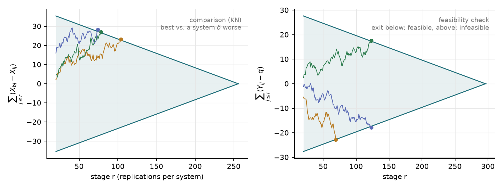
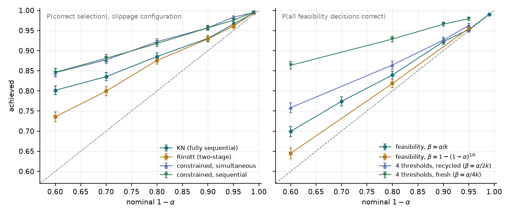
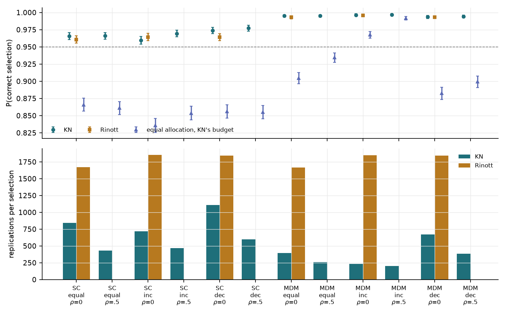
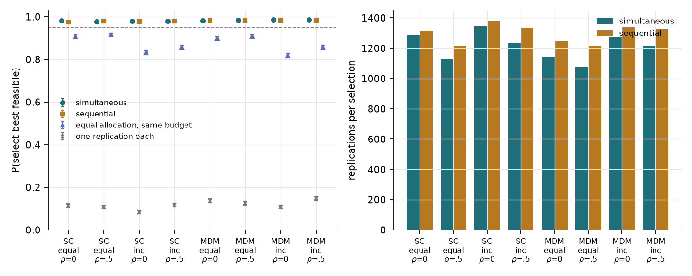
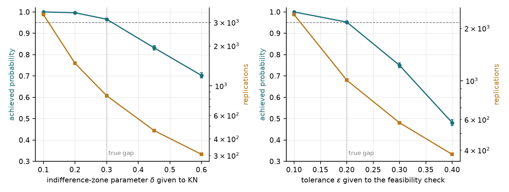
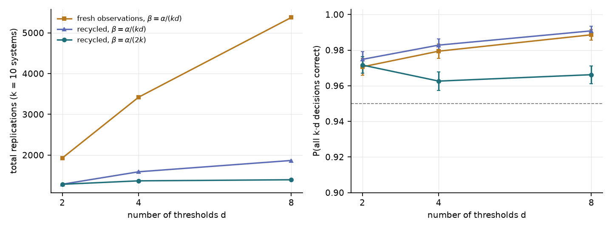
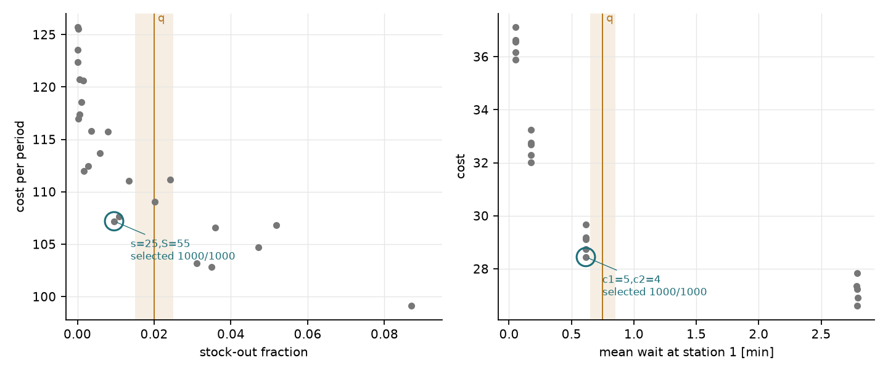
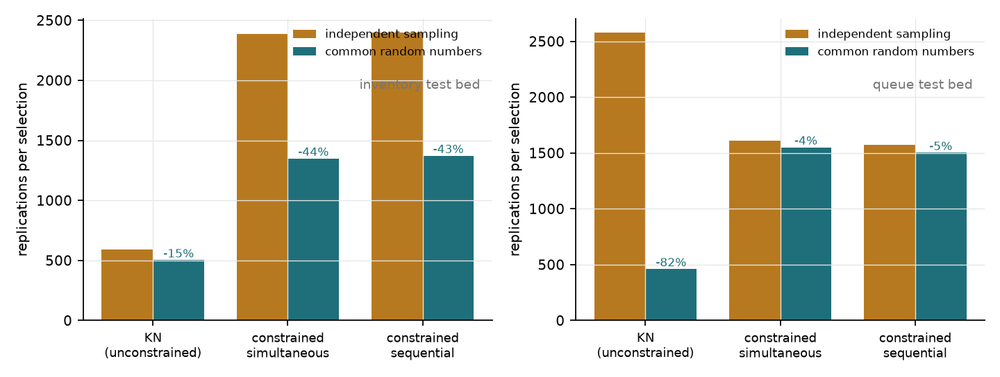

## In short

**Where it started.** When a decision is made by simulating $k$ alternatives, I need to know how many replications
are enough and how likely the pick is to be wrong. Ranking-and-selection (R&S) procedures answer both with a proof
that the best system is selected with probability at least 1 − α. But a proof is about the procedure in the paper,
and what runs is my code, with its own constants, indexing and stopping rules. An off-by-one in the stage counter
or a wrong exponent in η silently turns a 95% procedure into an 85% one, and nothing crashes. So I wrote the main
procedures from scratch as a small NumPy package, `rsel`, that my application projects can import, and put each one
on trial: 5,000 macro-replications per normal-means configuration, and 1,000 on an (s,S) inventory model and a
tandem queue.

**What I noticed first.** Every guarantee held, and the bounds were not loose. The feasibility check in its least
favourable configuration came out at 0.952 against a nominal 0.95, close enough that a region drawn too wide would
have shown up. Sequential elimination paid off: KN needed half of Rinott's budget in the slippage configuration,
while equal allocation with the same budget reached only 0.84–0.87.

**What that made me curious about.** If the guarantee holds, what does it actually cost, and what can be shared?
Several thresholds could reuse the same observations, and common random numbers could make close systems easier to
tell apart.

**What worked, and what did not.** Recycling observations across eight thresholds cut 5,377 replications to 1,395
(−74%). CRN cut KN on the queue from 2,576 to 460 replications (−82%), but did almost nothing for constrained
selection on the same queue (1,608 → 1,550), because that budget is dominated by single-system feasibility checks
that CRN cannot help. The sensitivity runs showed that δ and ε are promises about the problem, not tuning knobs:
set above the true gap, they void the guarantee (δ = 0.6: 0.702; ε = 0.4: 0.481). Two things I cannot claim: the
recycling bound (3) is my own derivation, which held empirically (≥ 0.962 at nominal 0.95) but may be more
conservative than the published one, and the two test beds are too easy to reveal a slightly anti-conservative
implementation.

**Where it leads.** Variance updating, procedures for thousands of systems, Bayesian allocation (OCBA, knowledge
gradient) as a comparison, and the two application projects that import `rsel` (section 5).

## 1 Background

A simulation model returns noisy outputs, so "policy 7 looked cheapest" is a statement about one sample path. The
R&S literature replaces it with a procedure that decides *sequentially* how much to simulate each alternative, drops
clearly inferior ones early, and comes with a proof that the probability of correct selection (PCS) is at least
1 − α whenever the best is better than the rest by at least an indifference-zone parameter δ. With a stochastic
constraint (a service level or a mean wait that is itself only observable through simulation), one also needs a
feasibility decision with its own tolerance ε.

The point of this project is double: (i) a small library that my two application projects can import, and (ii)
evidence, for each procedure, of *what guarantee it gives and whether my code delivers it*. Where I was not certain
of a published constant, I derived a conservative one and let the empirical PCS be the judge.

## 2 Method

### 2.1 Observation sources and common random numbers

Procedures never call a model directly; they read replication `r` of system `i` from a *source*. A
`CallableSource` wraps `simulate(i, n, rng)`; with `crn=True` each system receives an identically seeded generator
for the same batch of replications, so a model that draws its inputs in a fixed order is driven by common random
numbers (CRN). `JointSource` and `ArraySource` cover jointly generated and pre-generated streams. Sources count the
replications a procedure consumes, which is the cost measure reported below.

### 2.2 KN: fully sequential selection

After n0 first-stage replications, KN (Kim & Nelson 2001) computes the sample variance $S_{il}^2$ of the differences
$X_{ij}-X_{lj}$ for every pair and then adds one replication per surviving system at a time. System $i$ is eliminated
at stage $r$ when its partial sum falls out of a triangular continuation region against some survivor $l$:

$$
\sum_{j=1}^{r}\left(X_{ij}-X_{lj}\right) < -\max\left\{0,\ \frac{\delta}{2}\left(\frac{h^2 S_{il}^2}{\delta^2}-r\right)\right\},
\qquad h^2 = (n_0-1)\left[\left(\frac{2\alpha}{k-1}\right)^{-2/(n_0-1)}-1\right]. \tag{1}
$$

This is the c = 1 version. Only differences enter, so the guarantee survives CRN and unequal variances; the $k-1$ is a
Bonferroni split over the comparisons of the best with each rival.

### 2.3 Feasibility determination

For a constraint $E[Y_i]\le q$ with tolerance ε, the check of Andradóttir & Kim (2010) monitors one system at a time:

$$
\text{continue while}\quad \left|\sum_{j=1}^{r}\left(Y_{ij}-q\right)\right| < \max\left\{0,\ \frac{h_F^2 S_i^2}{2\epsilon}-\frac{\epsilon r}{2}\right\}, \tag{2}
$$

declaring *feasible* on exit through the lower boundary and *infeasible* through the upper one. $h_F^2$ is as in (1)
with $2\alpha/(k-1)$ replaced by $2\beta$. The promise: with probability ≥ 1 − α all systems with
$E[Y]\le q-\epsilon$ are declared feasible and all with $E[Y]\ge q+\epsilon$ infeasible. I use β = α/(ks) for $k$
systems and $s$ constraints (valid under CRN) and offer $\beta = [1-(1-\alpha)^{1/k}]/s$ for independent systems
(the allocation of Batur & Kim 2010).

### 2.4 Constrained selection and the error split

`constrained_select` runs (1) and (2) on the same observations, in two variants after Andradóttir & Kim's AK and
AK+. *Sequential*: finish all feasibility checks, then run KN among the systems declared feasible, re-using stored
observations. *Simultaneous*: both at every stage; a system leaves when it is declared infeasible or has lost a
comparison to a system *already declared feasible* — a loss to a still-undecided system is remembered and
takes effect only if that system turns out feasible. The error is split α/2 + α/2:
$\beta_F=\alpha/(2ks)$ per feasibility decision and $\beta_C=\alpha/(2(k-1))$ per comparison. The guarantee I claim
is: if every rival of the best feasible-by-ε system $b$ is either infeasible by ε or worse by at least δ, then
$P(\text{select } b)\ge 1-\alpha$. It follows from a union bound, because each possible failure is a statement
about *one* partial-sum path leaving *its* region on the wrong side; this is also why re-using observations across
the two tasks is harmless.

### 2.5 Several thresholds: fresh versus recycled observations

A decision maker who is unsure about $q$ may ask for feasibility under $q_1<\dots<q_d$. The direct approach runs
(2) $d$ times with new observations and β = α/(kd). Recycling (the idea of Zhou, Andradóttir, Kim & Park 2022)
keeps one stream per system and $d$ running sums. I was not sure of the constant used in that paper, so I derived
one. The sums $\sum(Y_j-q_m)$ are ordered in $q_m$ and share one region; hence if any threshold above the true mean
is wrongly declared infeasible, the *smallest* such threshold is too, and symmetrically below the mean. A system
therefore errs with probability at most 2β whatever $d$ is, and

$$
\beta_{\text{rec}} = \frac{\alpha}{2k} \tag{3}
$$

suffices. Recycling thus saves twice: no new data per threshold, and no growth of $h^2$ with $d$.

### 2.6 Baselines and output analysis

Rinott's two-stage procedure (its constant $h$ solved from the defining double integral by Gauss–Laguerre quadrature
and cross-checked by Monte Carlo in the tests), equal allocation with a fixed budget followed by "best sample mean
among sample-feasible systems", and the naive single-replication pick. Helpers give paired-difference and Welch
confidence intervals and the variance-reduction factor $(\mathrm{Var}X_i+\mathrm{Var}X_l)/\mathrm{Var}(X_i-X_l)$.

## 3 Experiments

**Normal-means configurations** ($k=10$, $n_0=20$, α = 0.05, δ = 0.3 unless varied; 5,000 macro-replications each).
Slippage (SC: all rivals exactly δ below the best — least favourable) and monotone decreasing means (MDM); standard
deviations equal, increasing (0.5 for the best to 1.5) or decreasing; independent or equicorrelated with ρ = 0.5 to
mimic CRN. Feasibility: all systems exactly ε = 0.2 from $q$ ("boundary") or spread out. Constrained: five feasible
systems in SC/MDM plus five infeasible ones whose objective is δ *better* than the best feasible one. Thresholds:
$d\in\{2,4,8\}$, spaced 2ε, every system exactly ε from its neighbouring thresholds.

**(s,S) inventory** (25 policies): Poisson(25) demand, 30 periods, set-up 32, unit cost 3, holding 1 (cost structure
after Koenig & Law 1985), no shortage cost; minimise cost per period subject to stock-out fraction ≤ 0.02
(ε = 0.005, δ = 0.4). **Tandem queue** (20 server allocations $(c_1,c_2)$): Poisson arrivals, exponential services,
first 300 customers; minimise server cost plus time in system subject to mean wait at station 1 ≤ 0.75 min
(ε = 0.1, δ = 0.25). Ground truth: 2,000,000 and 400,000 replications per system. In both beds the cheapest systems
are infeasible, so ignoring the constraint gives the wrong answer. 1,000 macro-replications per setting.

Hardware: lab server, AMD EPYC 7452, 60 worker processes, CPU only; total compute about 23 minutes wall-clock.

## 4 Results

**Guarantees hold, and the bounds are not loose.** Figure 2 plots achieved against nominal probability for α from
0.4 to 0.01. All curves lie above the diagonal. The feasibility check in its least favourable configuration is
nearly exact (0.952 ± 0.003 at 0.95; 0.645 at 0.60 with the independent-systems β), which is reassuring in a
different way: a bug that made the region too wide would show up as strong over-coverage.

| Configuration (nominal 0.95) | KN PCS | KN reps | Rinott PCS | Rinott reps | Equal alloc., KN's budget |
|---|---|---|---|---|---|
| SC, equal var., ρ = 0 | 0.966 | 843 | 0.961 | 1,672 | 0.866 |
| SC, equal var., ρ = 0.5 | 0.966 | 434 | — | — | 0.861 |
| SC, increasing var., ρ = 0 | 0.960 | 719 | 0.964 | 1,853 | 0.836 |
| SC, decreasing var., ρ = 0 | 0.974 | 1,109 | 0.964 | 1,842 | 0.856 |
| MDM, equal var., ρ = 0 | 0.995 | 395 | 0.993 | 1,668 | 0.905 |
| SC, k = 50 | 0.967 | 5,380 | 0.970 | 12,917 | 0.785 |

Standard errors ≤ 0.003 for KN and Rinott. KN needs half of Rinott's budget in SC and a quarter in MDM, because
elimination adapts to the actual gaps while the two-stage rule budgets for the worst case. A single replication per
system finds the best 15% of the time in SC.

**Constrained selection.** Over eight configurations, PCS was 0.977–0.987 (simultaneous) and 0.976–0.985
(sequential) with 1,080–1,340 and 1,215–1,380 replications; the simultaneous variant is 2–11% cheaper. Equal
allocation at the same budget reached 0.82–0.92; one replication each, 0.08–0.15. An infeasible system was picked
in about 1% of runs, well inside the α/2 allotted to feasibility errors.

**Sensitivity.** δ and ε are promises about the problem, not tuning knobs. Setting them below the true gap buys
near-certainty at a steep price (δ = 0.1: PCS 0.9998, 3,428 replications); setting them above it voids the
guarantee (δ = 0.6: 0.702; ε = 0.4: 0.481). Halving ε from 0.2 to 0.1 multiplied the feasibility budget by 2.4.

**Recycling.** With eight thresholds, fresh observations cost 5,377 replications against 1,395 recycled (−74%),
with P(all 80 decisions correct) 0.989 and 0.966, both above 0.95. Recycling with the Bonferroni β = α/(kd) costs
1,869, so about 88% of the saving comes from sharing data and the rest from bound (3). The recycled
procedure is also the less conservative one: at nominal 0.60 it achieves 0.758, fresh 0.864.

**Simulation test beds and CRN.** Both beds were solved correctly in essentially every macro-replication (PCS
0.999–1.000), selecting $(s,S)=(25,55)$ and $(c_1,c_2)=(5,4)$; the unconstrained optimum is infeasible in both.
These problems are far from slippage, hence the over-coverage. The interesting quantity is cost. CRN reduced the
inventory budget from 2,388 to 1,348 replications (−44%) and unconstrained KN on the queue from 2,576 to 460 (−82%;
variance-reduction factor 715 for the two closest allocations). It did almost nothing for constrained selection on
the queue (1,608 → 1,550), where the budget is dominated by single-system feasibility checks that CRN cannot help.
Equal allocation at matched budget reached 0.87 on the inventory bed; a single replication picked an infeasible
policy in 41% of runs. Recycling across three thresholds saved 45% (inventory) and 53% (queue).

## 5 Limitations & next steps

- The guarantees are normal-theory results. The inventory stock-out fraction and the queue waits are skewed;
  correct selection there is evidence of robustness in two easy instances, not a guarantee. `rsel.batched` (batch
  means) is provided but was not needed, so it is tested only for correctness, not for its effect on PCS.
- The test beds are my own parameterisations of textbook models, and their gaps are large relative to δ; they
  cannot reveal a slightly anti-conservative implementation. The slippage experiments carry that burden.
- Bound (3) is my derivation. It held empirically (≥ 0.962 at nominal 0.95) but is not the constant of the published
  recycling procedure and may be more conservative than necessary.
- The constrained-selection guarantee is stated under a preference-zone assumption; I do not claim the broader
  "good selection" guarantees of the original papers when rivals fall inside the tolerance band.
- Only c = 1 regions and first-stage variances; no variance updating, no procedures for thousands of systems, no
  Bayesian allocation (OCBA, knowledge gradient) as a comparison. Those are the natural next additions, together
  with the two application projects that will import `rsel`.
