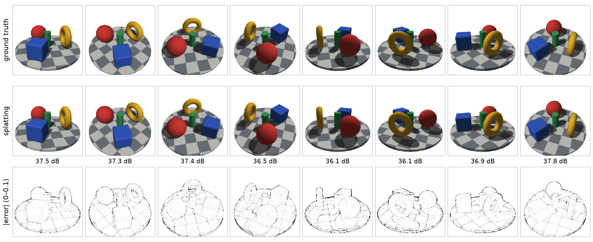
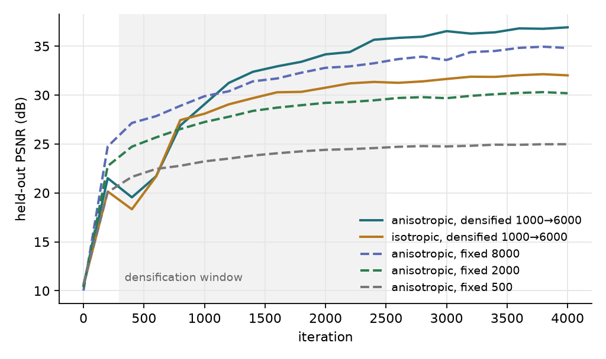
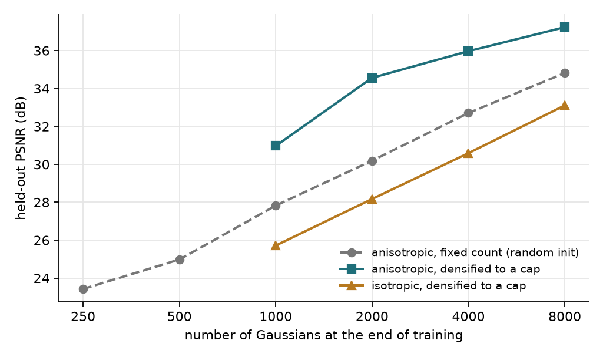
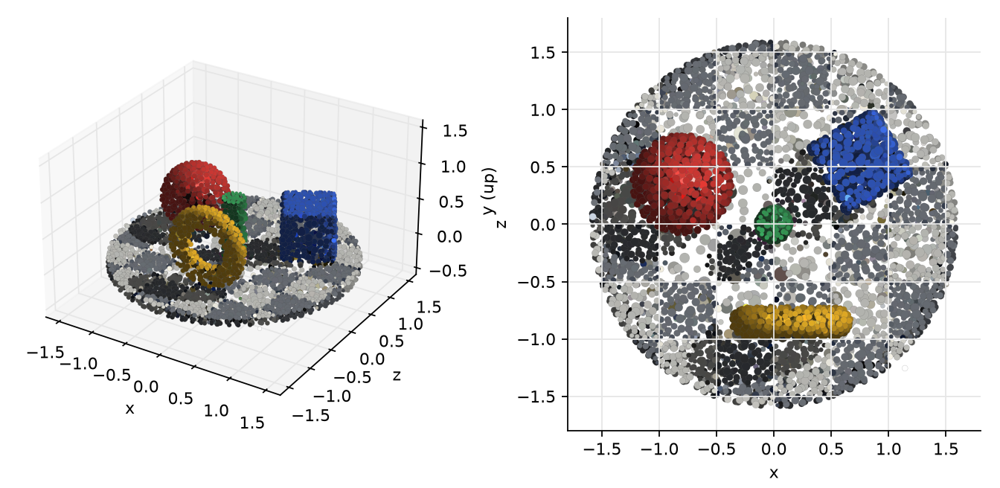
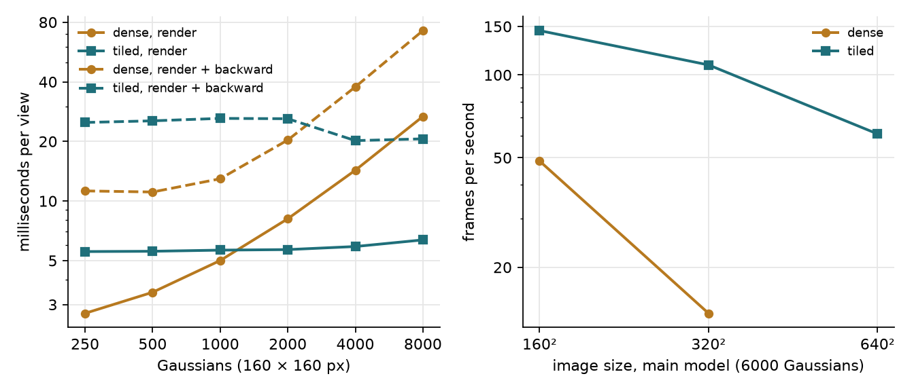

## In short

**Where it started.** Gaussian splatting renders a scene as a cloud of semi-transparent ellipsoids by rasterisation. The published systems owe their speed to hand-written CUDA kernels, which also hide the mathematics: the covariance projection, the compositing recursion and their gradients sit inside a custom backward pass. I wanted a version in which every step is a visible tensor expression that can be checked numerically.

**What I learned building it.** To check it exactly I wrote the data source too: an analytic SDF scene and a sphere tracer, so poses, depth and colour are exact. The rest (EWA projection, depth-sorted alpha compositing, clone/split/prune densification) is about 1,500 lines of ordinary PyTorch. An earlier CPU-only draft (96 px, 1,000 Gaussians) was discarded; every number here comes from re-runs on the GPU server.

**What that made me curious about.** How far a kernel-free version can be pushed on a real GPU before the missing kernels hurt, and whether disagreement between models trained with different seeds tells you where a reconstruction is wrong.

**What worked, and what did not.** 6,000 Gaussians reach 36.93 dB PSNR and 0.993 SSIM on 12 held-out views in 113 s on one RTX 3090; anisotropy is worth 4.9 dB at equal count, densification 2.4–4.4 dB. Culling Gaussians into tiles first made rendering faster but training *slower* than dense (66.5 vs 55.1 ms), because the longest tile list held 809 entries while the average tile needed 204; bucketing tiles by list length fixed that, and the tiled rasteriser, output-equal to the dense one, renders 3.0× faster. A floor of about 6 ms per frame remains, the price of no custom kernel. The seed ensemble ranks colour error usefully (Spearman 0.66) but depth error poorly (0.25): depth error is mostly a bias all seeds share, and an ensemble measures variance, not bias.

**Where it leads.** A reconstructed scene used downstream (robot picking, volume estimation, clearance checks) must know where not to trust itself. Next: a median or transmittance-threshold depth to remove the bias, and a chance-constrained toy decision that values calibrated uncertainty in decision cost.

## 1 Introduction

Gaussian splatting represents a scene as a cloud of semi-transparent ellipsoids and renders it by rasterisation instead of
ray marching. The published systems owe their speed to hand-written CUDA kernels, which also hide the mathematics: the
covariance projection, the compositing recursion and their gradients live inside a custom backward pass. I wanted a version
in which every step is a visible tensor expression and can be checked numerically, and then to find out how far that version
can be pushed on a real GPU before the absence of custom kernels hurts.

The project contains its own data source (an SDF scene and sphere tracer, so poses, depth and colour are exact), two
interchangeable rasterisers, a training loop with a hand-written Adam whose state follows the Gaussians through
densification, ablations of anisotropy, densification and count, and a small per-pixel uncertainty study. An earlier
CPU-only draft (96 px, 1,000 Gaussians) was discarded; every number below comes from re-runs on the GPU server.

## 2 Method

### 2.1 Ground truth: SDF scene and sphere tracing

The scene is the minimum of five signed-distance primitives (checkered ground disc, sphere, rotated rounded box, upright
torus, cylinder) with Lambertian shading, one directional light, hard shadows and an ambient term. Shading is
view-independent, so one RGB colour per Gaussian suffices in principle. Rays are marched in float64 with 4 × 4
supersampling. Training cameras follow a golden-angle spiral over elevations 12°–62°; held-out cameras sit on two rings
(25°, 45°) at azimuths that match no training pose, and their ground-truth depth is stored.

### 2.2 Gaussians and their projection

Each Gaussian has a mean $\mu$, log-scales $s$, a quaternion $q$, an opacity logit and colour logits. Its covariance is

$$
\Sigma = R(q)\,\mathrm{diag}(e^{s})^{2}\,R(q)^{\top}
\tag{1}
$$

so it stays positive semi-definite under any gradient step; the isotropic ablation uses a single scale. With world-to-camera
rotation $W$ and camera-space mean $t=(x,y,z)$, the perspective map is linearised at $t$ (the EWA approximation):

$$
J = \begin{pmatrix} f_x/z & 0 & -f_x x/z^{2} \\ 0 & f_y/z & -f_y y/z^{2} \end{pmatrix},
\qquad
\Sigma' = J W \Sigma W^{\top} J^{\top} + 0.3\, I
\tag{2}
$$

The added $0.3\ \text{px}^2$ is a low-pass filter that keeps sub-pixel Gaussians from aliasing. Per pixel $p$ the
contribution of Gaussian $i$ is

$$
\alpha_i(p) = \min\!\Big(0.99,\; o_i \exp\!\big(-\tfrac12 (p-\mu'_i)^{\top} \Sigma_i'^{-1} (p-\mu'_i)\big)\Big),
\qquad \alpha_i(p) < \tfrac{1}{255} \Rightarrow \alpha_i(p) := 0
\tag{3}
$$

### 2.3 Compositing

Gaussians are sorted by camera depth and blended front to back:

$$
C(p) = \sum_i c_i\, w_i(p) + \Big(1-\sum_i w_i(p)\Big) c_{\text{bg}},
\qquad
w_i(p) = \alpha_i(p) \prod_{j<i} \big(1-\alpha_j(p)\big)
\tag{4}
$$

The product is evaluated as the exponential of an exclusive cumulative sum of $\log(1-\alpha_j)$, which is a single parallel
primitive and is stable because $\alpha \le 0.99$. The same weights give an expected depth $\sum_i w_i z_i / \sum_i w_i$.

### 2.4 Two rasterisers with the same output

The dense rasteriser evaluates the $(N \times P)$ table of all Gaussians against all pixels; since $\log\alpha$ is a quadratic
in the pixel coordinates, the table is one matrix product of $N\times6$ coefficients with $6\times P$ monomials. Cost and
memory are $O(NP)$. The tiled rasteriser cuts the image into 16 × 16 tiles. Because of the hard cut in Eq. (3), Gaussian $i$
can only touch pixels inside the ellipse

$$
(p-\mu'_i)^{\top} \Sigma_i'^{-1} (p-\mu'_i) \le 2 \ln (255\, o_i),
\qquad
|p_x-\mu'_{i,x}| \le \sqrt{2 \ln(255\,o_i)\; \Sigma'_{i,xx}}
\tag{5}
$$

(and likewise in $y$), so assigning it to the tiles that this exact bounding box overlaps loses nothing. (Gaussian, tile)
pairs are generated with `repeat_interleave`, stably sorted by tile — which preserves the global depth order inside each
tile — and scattered into a padded index table, so the whole image is still a handful of batched tensor operations. Padding
every tile to the longest list wastes most of the work, so tiles are sorted by list length and processed in four buckets,
each padded to its own maximum.

### 2.5 Optimisation and densification

The loss is $0.8\,L_1 + 0.2\,(1-\text{SSIM})$ on one random training view per step. Adam is written by hand so that its
moment rows can be deleted and appended together with the Gaussians. Every 100 iterations between 300 and 2,500, Gaussians
whose average view-space positional gradient exceeds $2\times10^{-4}$ are cloned (small) or replaced by two samples drawn
from themselves at scale/1.6 (large); Gaussians with opacity below 0.01 or a world-space scale above 0.6 are pruned. A hard cap
limits the count; when more candidates exist than room, the largest gradients win. Initialisation is uniform random in the
scene's bounding box — no point cloud is given.

## 3 Experiments

**Data.** 100 training and 12 held-out views, 160 × 160 px, focal length 192 px, camera radius 4.2; 47.8 % of pixels are
foreground. **Default run.** 1,000 initial Gaussians, cap 6,000, 4,000 iterations, seed 0. **Ablations.** Isotropic vs
anisotropic at caps 1,000–8,000 (start = cap/4); fixed random counts 250–8,000 without densification; seeds 0–4 of the
default. **Metrics.** PSNR (mean of per-view values) and SSIM (11 × 11 Gaussian window) on held-out views; milliseconds per
view as medians of 30 synchronised calls. **Hardware.** One RTX 3090, PyTorch 2.10, float32. The server is shared: the
ablation runs ran three at a time, so only their quality numbers are used; every timing quoted here was measured with
the GPU to itself, at a 1-minute load average of 8–9 on 64 cores (2.5 for the dense training run), as recorded in the JSON
files. **Tests.** 16 pytest checks: quaternion orthonormality, the Jacobian against finite differences, the projected
covariance against a 400,000-sample Monte-Carlo push-forward, compositing weights against a sequential loop, SSIM against a
loop implementation, tiled = dense in image, depth and gradients (float64, tolerance $10^{-9}$).

## 4 Results

| Model (4,000 iterations) | Gaussians | PSNR (dB) | SSIM |
|---|---|---|---|
| anisotropic, densified (default, seed 0) | 6,000 | 36.93 | 0.9926 |
| same, five seeds | 6,000 | 37.03 ± 0.13 | — |
| isotropic, densified | 6,000 | 32.02 | 0.9782 |
| anisotropic, densified, cap 8,000 | 8,000 | 37.23 | 0.9933 |
| anisotropic, fixed random init | 8,000 | 34.82 | 0.9886 |
| isotropic, densified, cap 8,000 | 8,000 | 33.11 | 0.9827 |

<figure class="vid">
  <video src="/projects/splat-from-scratch/media/orbit.mp4" autoplay loop muted playsinline preload="metadata" poster="/projects/splat-from-scratch/media/orbit.jpg"></video>
  <figcaption>Video 1 — One revolution (168 frames, 7 s) of the trained default model, rendered by the project's own
  tiled rasteriser from <code>results/main_model.pt</code> and wiped against the sphere tracer's output for exactly the
  same camera. Every frame is a novel view: the orbit never comes within 1.4° of any of the 100 training cameras, while
  the 12 held-out views behind the 36.93 dB headline number come as close as 1.6°
  (<code>results/animation_check.json</code>). Watch the moving wipe line — the splatted half and the traced half are
  hard to tell apart, and the error panel says where they are not: silhouettes, checker edges and shadow borders, the
  same residual as Figure 1. The per-frame PSNR read-out stays between 35.20 and 38.17 dB (mean 36.81), i.e. within
  about a decibel of the held-out mean everywhere on the loop.</figcaption>
</figure>

<figure class="vid">
  <video src="/projects/splat-from-scratch/media/training.mp4" autoplay loop muted playsinline preload="metadata" poster="/projects/splat-from-scratch/media/training.jpg"></video>
  <figcaption>Video 2 — The default configuration optimised again from scratch (seed 0, unchanged settings), captured at
  100 iterations — densely while the model forms, sparsely once it only refines — as a render of one fixed held-out
  view, its absolute error, and read-outs of iteration, Gaussian count and held-out PSNR. The final frame reproduces the
  stored 36.92798 dB of <code>results/main.json</code> to every digit (<code>results/animation_check.json</code>). Watch
  the Gaussian counter: it steps 1,000 → 857 → 1,520 → 2,793 → 4,850 → 6,000 between iterations 300 and 700, and every
  step costs 3–4 dB of held-out PSNR (22.3 → 18.0 at 300, 25.0 → 20.8 at 500, 25.6 → 21.7 at 600) which the next 50–80
  iterations win back and more — a sawtooth that the 200-iteration grid of Figure 2 only hints at. After the cap binds
  at iteration 700 the count is flat, and the remaining 3,300 iterations do nothing but sharpen silhouettes and checker
  edges: the error image emptying out from the inside.</figcaption>
</figure>

**Count, densification, anisotropy (Figure 3).** With a fixed random initialisation PSNR rises by roughly 2.3 dB per
doubling (23.4 dB at 250 to 34.8 dB at 8,000). Densification shifts the whole curve up: 30.97 / 34.56 / 35.97 / 37.23 dB at
1,000 / 2,000 / 4,000 / 8,000, i.e. +3.2, +4.4, +3.3 and +2.4 dB at equal count — 2,000 densified Gaussians nearly match 8,000
undirected ones. Isotropic Gaussians lose 4.1–6.4 dB at equal count (25.72 / 28.17 / 30.59 / 33.11 dB) and end up *below*
the fixed anisotropic baseline: flat surfaces and sharp checker edges need flat, elongated primitives, and no placement
strategy compensates for spheres. Train and held-out PSNR differ by under 0.4 dB everywhere, so there is no overfitting
to the 100 views.

**Speed (Figure 5, `results/bench.json`).**

| Default model, 6,000 Gaussians | dense | tiled, one bucket | tiled, four buckets |
|---|---|---|---|
| render 160² (ms / fps) | 20.5 / 49 | 8.9 / 113 | 6.9 / 145 |
| forward + backward 160² (ms) | 55.1 | 66.5 | 23.7 |
| peak memory, forward + backward (MB) | 5,482 | 1,476 | 539 |
| render 320² (fps) | 13.6 | 60.5 | 108.7 |
| render 640² (fps) | out of memory (24 GB) | 26.3 | 61.1 |
| full training run, 4,000 iterations (s) | 200 | — | 113 |

Culling alone made rendering faster but *training slower* than dense (66.5 vs 55.1 ms): the longest tile list held 809
entries while the average tile needed 204, so three quarters of the padded work was wasted; bucketing tiles by list length
fixed that. The gain grows with problem size (8.0× at 320²; 640² only runs tiled), but below about 2,000 Gaussians the dense
matrix product wins (2.7 vs 5.6 ms at 250). The floor of roughly 6 ms per frame is Python and kernel-launch overhead —
the price of having no custom kernel.

**Reconstruction uncertainty (Figure 6, `results/uncertainty.json`).** Five models differing only in seed were rendered on the
held-out views. The per-pixel standard deviation across four seeds was compared with the absolute error of the fifth, which
never entered that standard deviation, and averaged over the five choices.

| Leave-one-seed-out | Spearman ρ | error mass in top-10 % most uncertain pixels | AUSE |
|---|---|---|---|
| colour, all pixels | 0.95 | 59 % | 0.04 |
| colour, foreground only | 0.66 | 37 % | 0.13 |
| depth, foreground | 0.25 | 27 % | 0.31 |

The all-pixel row is inflated by the trivially certain white background; the foreground row is the honest one, and there
seed disagreement is a useful, monotone ranking of colour error. For depth it is weak, and the magnitudes show why: mean
depth error is 0.036 scene units against a mean seed spread of 0.010, and averaging five depth maps barely helps
(0.037 → 0.036), whereas averaging colours gains 0.7 dB (37.03 → 37.71). Depth error is mostly a bias common to all seeds —
alpha-blended expected depth is pulled by semi-transparent Gaussians near silhouettes — and an ensemble measures variance,
not bias.

## 5 Limitations & next steps

- **Synthetic, diffuse, small.** One analytic scene, exact poses, view-independent shading, 160 px. No spherical harmonics,
  real photographs or pose noise: 36.9 dB shows the pipeline is correct, not that it competes with CUDA implementations.
- **Densification always hits the cap.** With threshold $2\times10^{-4}$ the count saturates by iteration 800, so the cap
  sets model size; there is no opacity reset and the threshold was not tuned.
- **Global sort, padded tiles.** Sorting by centre depth can pop for interpenetrating Gaussians, and a fused kernel or a
  segment-wise scan over the flat pair list would be needed to remove the 6 ms overhead floor.
- **One seed per ablation cell.** Seed-to-seed spread (0.13 dB) is far below every reported gap (≥ 2.4 dB), but the cells
  themselves were run once.
- **From reconstruction to decisions.** In operations settings — robot picking, inventory volume estimation, clearance
  checks in a digital twin — a reconstructed scene is a noisy sensor, and the decision downstream must know where not to
  trust it. The experiment above gives a cautious answer: a five-seed ensemble is a serviceable flag for appearance
  error but under-reports geometric error by more than a factor of three, because that error is a shared bias. Next: a
  median or transmittance-threshold depth to remove the bias, view-count and grazing-angle features as extra predictors,
  and a chance-constrained toy decision (accept a clearance only if depth minus $k$ standard deviations exceeds a margin)
  to value calibrated uncertainty in decision cost rather than rank correlation.
