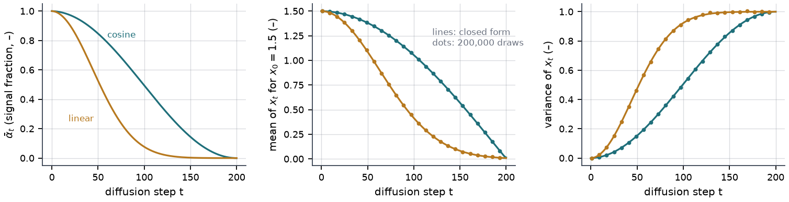
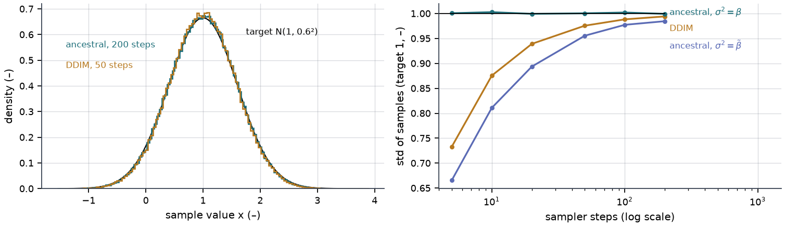
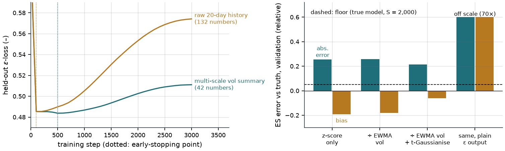
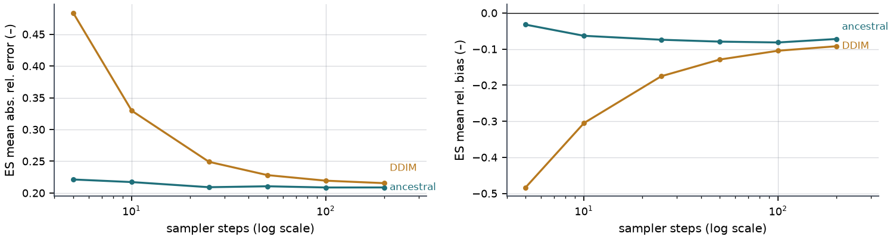
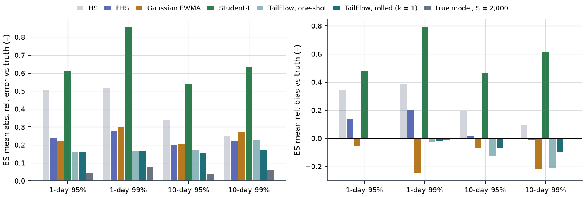
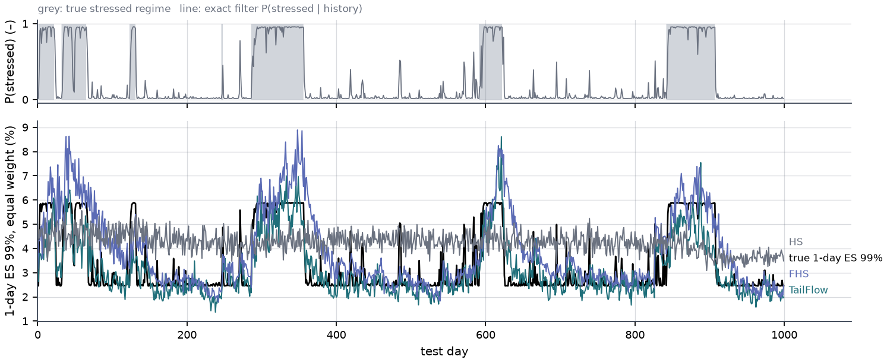
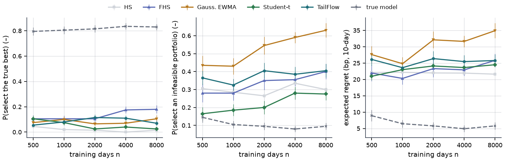
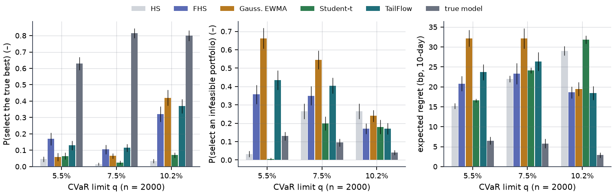
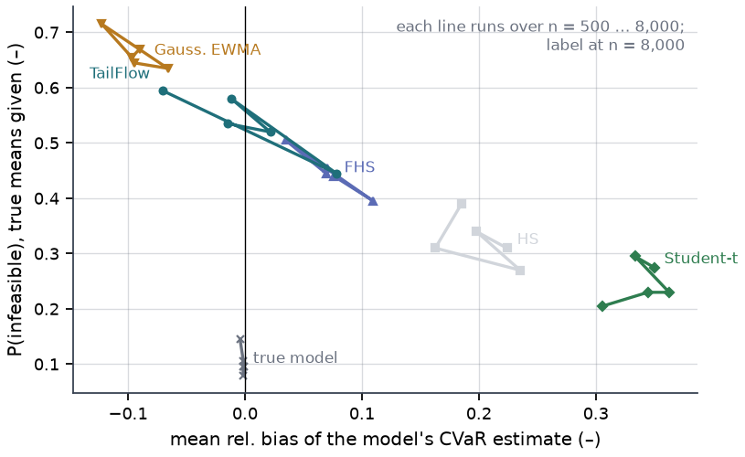

## Abstract

TailFlow is a small conditional diffusion model (≈0.22 M parameters, written from scratch) that generates the next ten
daily returns of six assets given the current volatility state. The page treats it as a *surrogate that carries the
market's uncertainty in its architecture*: the condition embedding holds the volatility state, the heavy-tail transform
holds the shape of the tails, and the whole 10-day distribution comes out as scenarios that any risk measure or decision
can be computed from. Everything is scored on a synthetic regime-switching Student-t market whose true VaR, ES and
optimal decisions are known. No market data is used: the keyless source refused scripted access, and that was respected.
Three things are asked of the surrogate, in order.

**Can it be checked?** Against the known truth, TailFlow has the lowest 1-day ES error of all methods (0.155 / 0.162 at
95 / 99%, mean of three training seeds, against 0.237 / 0.280 for filtered historical simulation), but its 10-day ES is
13.3% / 21.5% too low. The cause is measurable: the one-shot generator draws the whole window from the state at the
origin, so the autocorrelation of squared returns inside a generated window is 0.013, against 0.099 in held-out windows.

**Can it adapt?** Without retraining, the model is run in chunks of one day, and every scenario path re-conditions on
the returns it has just generated, using the same state formula as for observed data. This halves the 10-day bias, to
−6.7% / −9.8%, and brings the 10-day ES error below filtered historical simulation (0.151 / 0.168 against 0.201 / 0.221),
at 301 s instead of 9 s for the test split. It does not remove the bias: filtered historical simulation remains less biased (+1.7% /
−1.2%), and the clustering the rolled generator creates has the wrong shape. On weakly trained models the per-path
feedback can also run away.

**Can it control a decision?** In a CVaR-constrained choice among 15 portfolios, every fitted input model picks the truly
best portfolio in at most 45% of decisions, against 63–85% for the true model with the same simulation budget. Training
11 TailFlows per history (seed members, moving-block bootstrap members) and treating them as a posterior over input
models, a robust rule that takes the largest member CVaR lowers the probability of an infeasible choice in all 12 cells
with $n \ge 1{,}000$ (at $n$ = 2,000 and a 7.51% limit, from 0.405 to 0.155), and lowers regret in 6 of them (raising
it in 2). The same budget spent on more scenarios from one model improves no cell. What the ensemble does not do is find the right
portfolio: no rule exceeds 0.385, the robust rule raises the hit rate in 1 of 12 cells and lowers it in 4, and at the
loosest limit it is over-conservative. The ensemble's spread is also too narrow to be a calibrated uncertainty. The
surrogate can be adapted and used for robust control; neither closes the gap to the true model.

<figure class="vid">
  <video src="/projects/tailflow/media/reverse_minimal.mp4" autoplay loop muted playsinline preload="metadata" poster="/projects/tailflow/media/reverse_minimal.jpg"></video>
  <figcaption>The model's own sampler turning noise into ten-day paths after the observed history; dashed, the true 1 % and 99 % quantiles.</figcaption>
</figure>

## 1 Introduction

### 1.1 Topic — scenario generators are used twice

Scenario generators are used twice: to compute risk numbers (VaR, expected shortfall), and as the input distribution
of a simulation that ranks decisions. Generative models are usually judged by how realistic the samples look. The
questions that matter are different: are the tail numbers right, and if I optimise against these scenarios, do I still
pick the right thing?

The project builds a conditional DDPM (ε-prediction, ancestral and DDIM samplers, explicit heavy-tail treatment); a
synthetic market with known truth; four baselines — historical simulation (HS), filtered HS with EWMA volatility
(FHS), Gaussian EWMA covariance, multivariate Student-t fitted by EM; rolling backtests (Kupiec, Christoffersen, the
FZ0 joint VaR–ES score) on held-out synthetic paths; and an input-uncertainty experiment in which each generator feeds
a constrained selection problem whose true answer is known.

### 1.2 Idea — a model that carries the problem's uncertainty, used as a surrogate

The research direction behind this page is that a model which carries the uncertainty inherent to a problem — through
its architecture, or through the structure of how it is trained — can serve as a surrogate through which a decision is
adapted or controlled. For return scenarios, three kinds of uncertainty sit on top of each other, and each maps to one
place in TailFlow:

- **the market's own randomness given the current state.** This is what the conditional diffusion model represents in
  its architecture: the condition is a summary of recent volatility, and the output is a full joint distribution of the
  next ten days, not a point forecast;
- **the state moving during the horizon.** A large loss on day 2 should raise the volatility of day 3. The one-shot
  generator cannot represent this, because it sees the state only at the origin. The surrogate can be **adapted**
  without retraining by feeding its own generated path back into its condition (section 2.6);
- **uncertainty about the model itself**, because it is estimated from a finite history. An ensemble of re-trained
  models is a crude posterior over input models, and a decision can be **controlled** robustly across it (section 2.7).

As in the companion project on learned priors, a surrogate has to be checkable before anything is built on it. That is
why everything here is done on a synthetic market: it is the only setting in which the true VaR, ES and best decision
are known, so every claim about the surrogate can be scored rather than argued.

### 1.3 Questions, and where they are answered

1. Does the diffusion model get the tail numbers right, against the true values and against classical risk models?
   Sections 4.1–4.3.
2. When it is plugged into an optimiser, does input-model error flip the decision? Section 4.4.
3. Can it be **adapted**: does re-conditioning on its own path fix the 10-day bias, and at what cost? Section 4.5.
4. Can it be used to **control** the decision under input-model uncertainty: does a robust rule over an ensemble choose
   better portfolios? Section 4.6.

## 2 Method

### 2.1 Synthetic market with known truth

Six assets, two volatility regimes $s_t\in\{0,1\}$ following a Markov chain (stay probabilities 0.985 / 0.96),

$$
r_t = \mu + m_{s_t}\, z_t, \qquad z_t \sim t_{\nu=5}(0, \Sigma), \qquad m = (1,\ 2.6), \tag{1}
$$

where $\Sigma$ comes from a two-factor correlation structure and the drift $\mu$ is proportional to volatility and
market beta (daily Sharpe ≈ 0.05). Returns are conditionally independent given the regime path, so the best possible
forecast depends on history only through $p_t = P(s_{t+1}=1 \mid r_{1:t})$, which the Hamilton filter gives exactly. The
true 1-day VaR/ES of a portfolio is then a two-component scaled-$t$ mixture (closed form plus one root-find). The 10-day
truth is tabulated on a grid of $p$ with two independent 2-million-path Monte Carlo runs (they differ by at most 0.76%).

### 2.2 Diffusion model

Forward process and training target are the standard ones,

$$
q(x_\tau \mid x_0) = \mathcal N\!\big(\sqrt{\bar\alpha_\tau}\,x_0,\ (1-\bar\alpha_\tau) I\big), \qquad
\mathcal L = \mathbb E\,\big\| \hat\epsilon_\theta(x_\tau,\tau,c) - \epsilon \big\|^2 , \tag{2}
$$

with $T=200$ steps and a cosine schedule squashed so that $\bar\alpha_T = 10^{-4}$. The denoiser is a residual MLP
(3 blocks, width 128) in which a sinusoidal embedding of $\tau$ and an embedding of the condition $c$ modulate every
block. $x_0$ is the whole $10\times N$ block of future returns, generated jointly.

Plain ε-prediction failed (Section 4.1): near $\tau=T$ the answer is essentially $x_\tau$ itself, and any error is
divided by $\sqrt{\bar\alpha_\tau}$ when converted to $\hat x_0$. The network output $F_\theta$ is therefore wired as

$$
\hat\epsilon_\theta = \sqrt{1-\bar\alpha_\tau}\; x_\tau + \sqrt{\bar\alpha_\tau}\; F_\theta(x_\tau,\tau,c), \qquad
\hat x_0 = \sqrt{\bar\alpha_\tau}\; x_\tau - \sqrt{1-\bar\alpha_\tau}\; F_\theta , \tag{3}
$$

and the loss is divided by $\bar\alpha_\tau$. The samplers still consume an ε-prediction; the trivial part is simply no
longer learned. Both samplers clip $\hat x_0$ to 1.25× the training range. Ancestral sampling uses reverse variance
$\beta$ rather than $\tilde\beta$: for unit-variance targets it is exact at any step count, whereas $\tilde\beta$ and
DDIM are under-dispersed with few steps (Figure 2) — fatal for a risk model.

### 2.3 Conditioning and heavy tails

The condition is, per asset, the log EWMA volatility forecast ($\lambda=0.94$) and the log ratio of realised volatility
over the last 1, 3, 5, 10, 20, 60 days to that forecast (7N numbers). Targets go through three maps:

$$
u = r/\hat\sigma^{\text{EWMA}}, \qquad y = \Phi^{-1}\!\big(T_{\hat\nu}(u/\hat s)\big), \qquad x = L^{-1} y , \tag{4}
$$

volatility scaling, a per-asset Student-$t$ Gaussianisation with $(\hat\nu,\hat s)$ fitted by maximum likelihood, and
whitening by the Cholesky factor $L$ of the training covariance of $y$. A Gaussian-noise diffusion reproduces
near-Gaussian targets well; the tail is re-introduced analytically by the inverse of (4). The whitening matters because
of (3): an untrained $F_\theta=0$ generates $x_0\sim\mathcal N(0,I)$, so without it the model's *default* is
uncorrelated assets. With it, the default is a Gaussian copula with $t$ margins and EWMA volatility, and the network
learns departures from that.

Training uses AdamW, EMA weights, and early stopping on the last 15% of the training windows (held out with a 10-day gap).

### 2.4 Risk measures, tests, score

VaR and ES are empirical (k-th largest loss, mean of the k largest) from $S=2{,}000$ scenarios per date. Backtests use
the Kupiec and Christoffersen likelihood-ratio tests and the FZ0 loss
$L = -\mathbb 1\{y\le v\}(v-y)/(\alpha e) + v/e + \log(-e) - 1$ for VaR $v$ and ES $e$ in return units (lower is better).

### 2.5 Selection under input-model error

Fifteen candidate portfolios (five weight vectors × leverage 0.6/1.0/1.4). For a decision date,

$$
k^\star = \text{argmax}_{k}\ \ \mathbb E[R_k] \quad \text{s.t.} \quad \text{CVaR}_{95\%}(R_k) \le q , \tag{5}
$$

with $R_k$ the 10-day return. An input model replaces both functionals by estimates from its own 10,000 scenarios (if it
believes nothing is feasible it takes the smallest estimated CVaR). Truth comes from Section 2.1. Regret is
$\mu_{k^\star}-\mu_{\hat k}$ if $\hat k$ is truly feasible and $\mu_{k^\star}$ otherwise (an infeasible position is
cut and forfeits the return). A second variant hands every model the true expected returns, isolating the risk constraint.

### 2.6 Adaptation — rolling re-conditioning on the model's own path

The one-shot generator draws $x_0$, the whole $10\times N$ block, from the condition $c_t$ at the origin. Nothing that
happens inside the window can change the volatility later in the same window. The rolled generator keeps the trained
network and changes only how it is called. The window is drawn in chunks of $k$ days; after each chunk every scenario
path $s$ updates its own state from the returns it has just generated,

$$
\hat\sigma^{2,(s)}_{u+1} = \lambda\,\hat\sigma^{2,(s)}_{u} + (1-\lambda)\, r^{(s)\,2}_{u}, \qquad
c^{(s)}_{t+jk} = \text{cond}\big(r_{\le t},\ r^{(s)}_{t+1:t+jk}\big), \qquad
r^{(s)}_{t+jk+1:\,t+(j+1)k} \sim p_\theta\big(\,\cdot \mid c^{(s)}_{t+jk}\big), \tag{6}
$$

where $\text{cond}$ is the same map from a return history to the 7N conditioning numbers (EWMA forecast and the 1 to
60-day realised-volatility ratios) that is applied to observed data, and the first $k$ days of each generated block are
kept. $k = 10$ is the original one-shot generator. The chunk length is a model-selection choice, so it was chosen on the
**validation** split with the original criterion (average ES error against the truth), and the test split was used
only for the final scores. Two tests guard against leakage: with $k = H$ the rolled code reproduces the one-shot sampler (to 0.1% of the largest return),
and rolled scenarios are bit-identical when every return after the origin is replaced.

### 2.7 Control — an ensemble as a posterior over input models

The selection problem (5) is solved from one fitted model, so all of its error is in the input model. For each
simulated history, 11 TailFlows are trained:

- the single full-data model, which also draws $5\times$ the scenarios to give a same-budget control with no ensemble;
- $M = 5$ **seed members**: same data, different initialisation, which measures optimisation spread;
- $M = 5$ **moving-block bootstrap members** (blocks of 50 days), which measures the estimation uncertainty of the input
  model from a finite history.

Each model is used with both the one-shot and the rolled ($k = 1$) generator. With member estimates
$\hat\mu^{(m)}_k$ and $\widehat{\text{CVaR}}{}^{(m)}_k$, every rule uses the member-average mean and robustifies only the
constraint,

$$
\bar\mu_k = \frac1M\sum_m \hat\mu^{(m)}_k, \qquad
\widehat{\text{CVaR}}{}^{\text{rob}}_k \in \Big\{\ \tfrac1M\textstyle\sum_m \widehat{\text{CVaR}}{}^{(m)}_k,\ \
\max_m \widehat{\text{CVaR}}{}^{(m)}_k,\ \ \text{mean}_m + \kappa\, \text{sd}_m \Big\}, \tag{7}
$$

that is, bagging, worst-case, and mean plus $\kappa$ standard deviations across members ($\kappa = 1$, or a
cross-fitted $\kappa\in\{0, 0.5, 1, 2, 3\}$ chosen on one half of the replications and scored on the other). All rules
were declared before the run. The cross-fitted $\kappa$ uses the known truth of *other* replications, so it is a
simulation-calibrated rule, not one a desk could run as it stands. Every rule is compared with the single one-shot model
on the same decisions, as a paired difference with a 95% interval clustered by replication.

### 2.8 The animation

The animation replays the ancestral sampler of the trained model (seed 0, 25 steps) at one stressed test date and records,
at every step, the chain state $x_\tau$ and the denoiser's $\hat x_0$ from (3), both pushed through the inverse of (4).
It is a direct view of the surrogate at work: the untrained default it starts from, the conditional distribution it
ends at, and the ES it would report at every intermediate step. No number on screen is drawn by hand.

## 3 Experiments

**Synthetic track.** One path: 8,000 training days, 500 validation, 1,000 test (23% stressed). Everything that is chosen
— target transform, sampler, step count, chunk length — is chosen on validation against the true ES; the test split is
touched once. The rolling experiment uses the cached model (seed 0) and two further training seeds, and scores all
three at $k$ = 1 and 10, plus seed 0 at $k$ = 2 and 5, on the 1,000 test dates with $S$ = 2,000.

**No real-data track.** A rolling backtest on US ETF prices was planned. The intended keyless source, Stooq, answered
scripted requests with a JavaScript browser-verification page; that refusal was respected (logged in
`results/data_fetch_log.json`). An earlier revision then pulled ETF history from an unofficial endpoint while sending a
browser-like User-Agent; on review that was judged to be working around an access control, so the download, the data and
every number derived from it were removed. `src/run_real.py` still runs the same rolling backtest on a user-supplied CSV.

**Decision track.** Training length $n\in\{500, 1000, 2000, 4000, 8000\}$, 40 independent histories per $n$, 5 decision
dates per history (200 decisions per cell; standard errors clustered by history). Thresholds $q$ = 5.51%, 7.51%, 10.16%
(quartiles of the candidates' true CVaR at the stationary regime probability). Baselines use all $n$ days and the window
sample mean. The ensemble experiment re-uses exactly the same simulated histories (largest difference in the decision
dates' regime probabilities from the original run: 0.0) and completed all 2,200 model files for the 200 histories.

**Hardware and checks.** One RTX 3090 on a shared server (64 CPU cores, load averages recorded in the upgrade's results files),
torch 2.10, at most 16 workers. The original pipeline took 24 minutes; the rolling test runs 1,496 s; the ensemble
experiment 74,978 worker-seconds. Seventeen pytest checks pass: forward-noising moments, oracle-score samplers recovering
a Gaussian, a hand-computed Kupiec statistic (LR = 1.9568, p = 0.1619), ES ≥ VaR, FZ0 minimised at the truth, exact
1-day truth against Monte Carlo, the GPU inverse transform against scipy, the two rolling-leakage checks of section 2.6,
and others.

## 4 Results

### 4.1 What the denoiser needs (validation split)

| variant | ES abs. rel. error | ES rel. bias | DDIM-50 error |
|---|---|---|---|
| z-score only | 0.256 | −0.193 | 0.280 |
| ÷ EWMA vol | 0.258 | −0.180 | 0.266 |
| ÷ EWMA vol + t-Gaussianise (**selected**) | **0.214** | **−0.062** | 0.221 |
| same, raw 20-day history as condition | 0.275 | +0.074 | 0.268 |
| same, plain ε output | 70.0 | +70.0 | 7,811 |

Sampling floor (true model, same $S$): 0.052. The tail transform matters: it removes two thirds of the ES bias. The raw
return history is memorised within 100 steps (Figure 3, left). Plain ε-prediction produces a handful of exploding
scenarios that destroy ES. Ancestral-25 was selected (error 0.209); DDIM is biased low below 50 steps and
stays slightly worse even at 200 (0.216; Figure 4).

### 4.2 Synthetic test split: ES against truth, and backtests

| method | ES error 1d 95 / 99 | ES error 10d 95 / 99 | ES bias 10d 95 / 99 | FZ0 1d 99 | FZ0 10d 99 | Kupiec rej. /16 |
|---|---|---|---|---|---|---|
| Historical sim. | 0.506 / 0.521 | 0.340 / 0.251 | +0.19 / +0.10 | −3.363 | −2.399 | 1 |
| Filtered hist. sim. | 0.237 / 0.280 | 0.201 / 0.221 | +0.02 / −0.01 | −3.374 | −2.553 | 0 |
| Gaussian EWMA | 0.221 / 0.300 | 0.205 / 0.270 | −0.07 / −0.22 | −3.133 | −2.504 | 4 |
| Student-t | 0.613 / 0.856 | 0.540 / 0.634 | +0.47 / +0.61 | −3.299 | −2.295 | 6 |
| **TailFlow (ancestral-25)** | 0.162 / **0.167** | 0.174 / 0.228 | −0.13 / −0.21 | −3.376 | −2.530 | 1 |
| TailFlow (DDIM-25) | 0.172 / 0.194 | 0.233 / 0.306 | −0.22 / −0.30 | −3.308 | −2.373 | 5 |
| **TailFlow, rolled k = 1** (section 4.5) | **0.161 / 0.167** | **0.158 / 0.171** | −0.07 / −0.10 | **−3.415** | **−2.567** | 0 |
| true model, sampled | 0.041 / 0.076 | 0.037 / 0.061 | 0.00 / −0.01 | −3.506 | −2.611 | 0 |

All TailFlow rows are training seed 0, the model every earlier result used; section 4.5 averages three seeds. Bold marks
the best fitted method in each ES-error and FZ0 column.

The one-shot TailFlow is the most accurate 1-day model (its FZ0 is level with FHS) and its 1-day ES is nearly unbiased
(−0.0% / −2.9%). That aggregate hides an offsetting pattern: on calm dates it over-states 1-day ES at 95% by 4.4%, and
on stressed dates it under-states it by 15.2% (section 4.5). Its 10-day ES is 13–21% too low. The cause is visible in
Figure 7: the autocorrelation of squared returns inside generated windows is 0.011, against 0.099 in held-out windows —
the model treats the ten days as nearly independent, so it misses the regime persistence that fattens multi-day tails.
FHS, which propagates its EWMA recursion along each path, is less biased at ten days. The rolled TailFlow row does the
same thing with the diffusion model (section 4.5), and its bars are included in Figure 5 for
comparison.

### 4.3 Why there is no market-data section

The Kupiec, Christoffersen and FZ0 backtests above are run on the held-out synthetic path, where the true VaR and ES are
known, so every test type is still exercised. What is missing is evidence on real prices: time-varying correlation,
jumps and structural breaks are absent from the synthetic market, and nothing here says how TailFlow would rank against
filtered historical simulation on them. I expect the static whitening matrix to be its weakest point there (Section 6).

### 4.4 Does input-model error flip the decision?

Yes. Full variant, $q$ = 7.5%, as P(true best) / P(infeasible) / regret in bp (SE of regret in brackets), original run:

| input model | n = 500 | n = 2000 | n = 8000 | CVaR bias, n = 8000 |
|---|---|---|---|---|
| Historical sim. | 0.04 / 0.30 / 22.1 (1.6) | 0.01 / 0.27 / 22.0 (0.8) | 0.01 / 0.30 / 21.6 (0.6) | +22% |
| Filtered hist. sim. | 0.10 / 0.28 / 22.0 (2.5) | 0.10 / 0.35 / 23.3 (2.6) | 0.18 / 0.40 / 25.8 (2.0) | +8% |
| Gaussian EWMA | 0.07 / 0.43 / 27.6 (2.6) | 0.07 / 0.55 / 32.1 (2.5) | 0.10 / 0.63 / 34.9 (2.3) | −10% |
| Student-t | 0.10 / 0.17 / 21.0 (1.2) | 0.03 / 0.20 / 24.1 (0.7) | 0.03 / 0.28 / 24.5 (0.4) | +35% |
| TailFlow | 0.06 / 0.36 / 26.1 (1.9) | 0.12 / 0.41 / 26.4 (2.3) | 0.07 / 0.41 / 25.8 (1.8) | −7% |
| true model, 10k scenarios | 0.80 / 0.14 / 8.9 (1.7) | 0.81 / 0.10 / 5.8 (1.1) | 0.83 / 0.10 / 5.8 (1.1) | 0% |

Across all thresholds and all $n$, no fitted model selects the true best more than 45% of the time (49% when the
true means are handed over; Gaussian EWMA at the loosest limit both times). The true model with the same simulation
budget manages 63–85%. Three observations:

1. **The sign of the bias decides the failure mode** (Figure 11). Models that over-state CVaR (HS, Student-t) rarely
   violate the tight limit (0–5% for $n\ge 2000$) but leave 15–17 bp on the table. Nearly unbiased models violate it
   far more often (TailFlow 36–54%, FHS 23–36%): the optimiser picks whichever candidate the model happens to flatter. Gaussian
   EWMA, biased low, violates most (up to 71% with true means given).
2. **More data does not fix it.** TailFlow's CVaR error falls from 37% to 19% between $n$=500 and 8,000, and its
   infeasibility rate at the tight limit from 0.54 to 0.38, but no model's regret improves materially. The dominant
   error is identifying the current volatility state from recent returns, which does not shrink with $n$.
3. **TailFlow does not win.** Its regret is within one standard error of FHS at $n$=8,000 and worse than HS at the two
   tighter limits. Its estimated expected returns are also much noisier (RMSE 48–237 bp against 15–58 bp for the
   sample-mean-based baselines), because heavy-tailed scenario draws dominate a Monte Carlo mean.

### 4.5 Adaptation — what re-conditioning on the model's own path bought

On validation the ES error, averaged over the four horizon–level cells, falls monotonically with the chunk length:
0.2165 at $k$ = 10, 0.2040 at 5, 0.2036 at 2 and 0.2010 at 1 (the true model with the same $S$: 0.0577), so $k$ = 1 was
selected. On the test split, mean over three training seeds (seed range in brackets):

| metric | one-shot ($k$ = 10) | rolled ($k$ = 1) | true model, sampled | reference |
|---|---|---|---|---|
| 10-day ES bias 95% | −13.3% (−14.4 … −12.6) | **−6.7%** (−7.8 … −5.9) | −0.1% | FHS +1.7% |
| 10-day ES bias 99% | −21.5% (−22.5 … −20.8) | **−9.8%** (−10.5 … −9.2) | −0.6% | FHS −1.2% |
| 10-day ES abs. rel. error 95 / 99% | 0.173 / 0.233 | **0.151 / 0.168** | 0.037 / 0.061 | FHS 0.201 / 0.221 |
| 1-day ES abs. rel. error 95 / 99% | 0.155 / 0.162 | 0.154 / 0.162 | 0.041 / 0.076 | FHS 0.237 / 0.280 |
| 1-day ES bias 95 / 99% | −0.7% / −3.7% | −0.4% / −3.1% | −0.1% / −0.8% | |
| ACF of $r^2$ inside window, lag 1 | 0.013 | 0.110 | 0.058 | held-out 0.099 |
| ACF of $r^2$, lags 1–5 mean | 0.014 | 0.138 | 0.052 | held-out 0.093 |
| ACF of $\lvert r\rvert$, lags 1–5 mean | 0.099 | 0.182 | 0.158 | held-out 0.144 |
| FZ0 10-day 99% (lower is better) | −2.521 | −2.577 | −2.611 | FHS −2.553 |

FHS and the true model are single runs.

**What it bought.** Re-conditioning on the generated path roughly halves the 10-day under-statement at both levels, for
all three seeds, with no retraining. The 1-day numbers do not move, as they should not: day 1 is drawn from the same
state. The 10-day ES error drops below FHS, and so does the 10-day FZ0 score. Volatility clustering appears inside the
window where there was none (lag-1 ACF of squared returns 0.013 → 0.110), and the bias shrinks steadily as $k$ falls on
seed 0: −12.6% / −20.8% at $k$ = 10, −10.4% / −15.6% at 5, −7.4% / −10.8% at 2, −6.5% / −9.6% at 1 (Figure 12). With
seed 0 the rolled generator has no Kupiec rejection at 5% at any horizon or level, against one for the one-shot
generator.

**What it did not.** The bias is halved, not removed: −6.7% / −9.8% remain, and FHS is still less biased at ten days.
Split by state (seed 0; calm means a filter probability of stress below 0.5, 77.6% of test dates), the remaining
error sits in two places. On calm dates the 10-day 99% bias is still −10.7% (one-shot −22.8%; Figure 13). At one calm date, the true model
gives a 1.2% chance of losing more than 6% in ten days, the rolled generator 0.15% and the one-shot generator 0.05%. On stressed dates
the **1-day** 99% bias is −13.3% (one-shot −14.1%), a 1-day calibration problem that re-conditioning cannot reach,
because it changes nothing before day 2.

The clustering it creates also has the wrong shape. The ACF of absolute returns is too high (0.182 against 0.158 for
the true model) and barely decays (Figure 7). The ACF of squared returns for seed 0 jumps at lags 3 and 5 (0.203 and
0.183, against 0.110 at lag 1), and seeds 1 and 2 show the same pattern. My reading is that the network reacts
unevenly as a shock leaves the 3- and 5-day windows of the condition, rather than producing the geometric decay of
the true process; this is a hypothesis, not a tested claim.

The cost is real: 301 s against 9 s for 1,000 dates × 2,000 paths (seed 0), because the network runs ten reverse
chains instead of one. And the feedback loop in (6), a large generated return raising the state that the next draw is
conditioned on, can run away on weakly trained models (section 4.6).

### 4.6 Control — what a robust rule over an ensemble bought

**Nothing finds the right portfolio more often.** When means and CVaR both come from the models, no rule in the
ensemble experiment — single, member, ensemble, one-shot or rolled, or the FHS reference — selects the true best
portfolio more than 38.5% of the time (FHS, $n$ = 8,000, $q$ = 10.16%). With the true means handed over the best is
46.5%. The true model with 10,000 scenarios reaches 0.63–0.85. Ensembles do not close that gap.

**What the robust rules buy is feasibility.** Counting the cells in which the 95% interval of the paired difference
against the single one-shot model lies entirely on one side of zero (full variant; rolled rules exclude $n$ = 500,
see below):

| rule (full variant) | cells | P(infeasible) lower | P(true best) higher / lower | regret lower / higher |
|---|---|---|---|---|
| bootstrap ensemble, worst-case, rolled | 12 | 12 | 1 / 4 | 6 / 2 |
| bootstrap ensemble, mean + 1 sd, rolled | 12 | 12 | 1 / 3 | 6 / 2 |
| bootstrap ensemble, worst-case, one-shot | 15 | 13 | 1 / 3 | 8 / 3 |
| seed ensemble, worst-case, rolled | 12 | 11 | 1 / 2 | 6 / 0 |
| bootstrap ensemble, average, rolled | 12 | 9 | 1 / 2 | 5 / 1 |
| seed ensemble, average, rolled | 12 | 4 | 2 / 0 | 3 / 0 |
| single model, rolled | 12 | 3 | 0 / 0 | 2 / 0 |
| single model, 5× scenarios, one-shot (same budget, no ensemble) | 15 | 0 (1 higher) | 0 / 0 | 0 / 1 |

The counts are descriptive (12–15 cells per rule, no correction for multiplicity). The single one-shot model here is
re-trained with the original seed and sampled with a new noise stream, so it differs slightly from section 4.4: at
$n$ = 2,000 and $q$ = 7.51% it picks the true best in 0.085 of decisions against 0.115 in the original run (P(infeasible)
0.405 and regret 26.4 bp in both). Representative cells:

- **$n$ = 2,000, $q$ = 7.51%.** P(infeasible) falls from 0.405 for the single one-shot model to 0.155 for the bootstrap
  worst-case rule, rolled: Δ −0.250 [−0.317, −0.183]. The one-shot version of the same rule gives 0.175, Δ −0.230
  [−0.294, −0.166]. Regret falls from 26.4 to 19.0 bp, Δ −7.4 [−11.5, −3.4], because an infeasible pick forfeits its
  whole return. P(true best) does not move: 0.085 → 0.075, Δ −0.010 [−0.062, +0.042]. The true model in the same cell:
  0.815 / 0.095 / 5.8 bp.
- **$n$ = 8,000, $q$ = 7.51%** is the one cell where the robust rule also picks the true best more often: 0.080 → 0.180,
  Δ +0.100 [+0.031, +0.169], with P(infeasible) 0.385 → 0.270.
- **Loose limit, $n$ = 2,000, $q$ = 10.16%.** The worst-case rule is over-conservative: P(true best) 0.375 → 0.160,
  Δ −0.215 [−0.294, −0.136], and regret rises by 3.8 bp [+0.6, +6.9], while P(infeasible) falls from 0.170 to 0.070.
- **The same budget without an ensemble** (one model, 50,000 scenarios) improves no cell and worsens one, so the
  feasibility effect comes from model uncertainty, not from Monte Carlo noise.

The mechanism is the one of Figure 11. At $n$ = 2,000 the single one-shot model's CVaR is nearly unbiased (−0.9%); the
bootstrap worst-case rule, rolled, over-states it by 29.5%. The robust rule moves TailFlow from the "nearly unbiased,
often infeasible" corner to the "over-stating, rarely infeasible" corner that HS and Student-t occupy, and it pays for
that where the limit is loose. Bootstrap members spread far more than seed members (mean member CVaR sd/mean 0.145
against 0.058 at $n$ = 2,000), which is why the bootstrap rules have the stronger effect. Averaging over bootstrap
members does not make the expected-return estimates better either: their RMSE is 84.3 bp rolled and 91.3 bp one-shot,
against 64.9 bp for the single one-shot model, which is one reason the hit rate does not improve.

**The spread is not a calibrated uncertainty.** At $n$ = 2,000 the true CVaR lies inside the range of the bootstrap
members (rolled) on only 49% of (date, portfolio) cells, and within one member standard deviation on 41%; at
$n$ = 8,000 the figures are 25% and 21%. The members share one architecture and its biases, so they disagree too little.

**The rolled generator diverges at $n$ = 500.** With 500 training days the per-path feedback of (6) runs away: 36.5% of
bootstrap members and 22% of seed members give a CVaR estimate above three times the truth somewhere, and the largest
ratio is 4.3 × 10¹⁰. The $n$ = 500 cells of every rolled rule are therefore not calibrated risk estimates, and their low
P(infeasible) is partly an artefact of exploded CVaRs; they are marked in Figures 14 and 15 and excluded from the counts
above. From $n$ = 1,000 the largest ratio for rolled bootstrap members is 7.8, against 3.9 for one-shot bootstrap
members, and at $n$ = 2,000 and 8,000 the single rolled model never exceeds three times the truth. Capping the
conditioning state at its training range is the obvious fix; it was not run.

A caveat on what "TailFlow" means here: in the selection experiment early stopping fires at the first check (step 100)
for 99–100% of the models with $n \le 4{,}000$, and for every bootstrap member even at $n$ = 8,000. In this experiment
TailFlow is therefore close to its default, a Gaussian copula with fitted $t$ margins and EWMA scaling. That was already
true in the original run.

### 4.7 The animation

The animation shows the step the rest of the page takes on trust: how a single conditional draw turns noise into a tail.
At the stressed date it uses, the chain starts at the model's untrained default, whose 10-day ES(95%) is 12.46%, and
the network moves it to 11.22%, against a true 10.41%. The denoiser's own estimate $\hat x_0$ starts with almost no
spread (−0.18% after the first step) and only reaches the true ES between steps 20 and 21 of 25. Early in the chain the
denoiser's estimate carries almost none of the spread; the spread of the final scenarios is carried by the chain
itself, the initial noise and the noise injected at every step, which is why the reverse variance matters (Figure 2). At this single date the model over-states ES; the
under-statement in section 4.5 is an average over 1,000 dates.

## 5 Discussion — what the surrogate bought

| question | what made it possible | what it bought | what it did not |
|---|---|---|---|
| check (4.1–4.3) | a market with exact VaR/ES; the tail transform (4) and the wired output (3) | best 1-day ES error of all methods, 0.155 / 0.162 (3 seeds) | a correct 10-day tail: −13.3% / −21.5% one-shot |
| adapt (4.5) | the condition is computed from a return history, so the model can be fed its own path (6) | 10-day bias −6.7% / −9.8%; 10-day ES error 0.151 / 0.168, below FHS | an unbiased 10-day tail; the right clustering shape; stability at $n$ = 500; cost 301 s against 9 s |
| control (4.6) | cheap re-training, so an ensemble can stand in for a posterior over input models (7) | P(infeasible) lower in 12 of 12 cells ($n \ge 1{,}000$); e.g. 0.405 → 0.155 | P(true best) up in 1 of 12, down in 4; calibrated spread (49% range coverage at $n$ = 2,000) |

The surrogate can be adapted and controlled in the sense the research direction asks for. Because the condition
is a function of a return history, the trained model can be re-conditioned on paths it generated itself, and that alone
recovers half of the missing 10-day risk. Because re-training is cheap, an ensemble over histories gives a decision rule
something to be robust against, and the robust rule consistently makes a choice outside the true risk limit less likely.

The experiments also show where the bottleneck is. The ensemble moves the decision along a trade-off between
feasibility and return that already existed (Figure 11); it does not make the model better at telling the portfolios
apart, and the gap to the true model in the probability of choosing the best portfolio (0.63–0.85 against at most
0.385) is untouched. That
gap sits in the ranking of expected returns and of CVaRs near the limit, both dominated by how well the current
volatility state is identified, and no robustification of the constraint addresses it. The ensemble's own spread is too
narrow to be read as uncertainty, so "robust" here means "conservative by an uncalibrated amount", which is why it
over-shoots at the loose limit.

## 6 Limitations & next steps

**The synthetic market is simple** (constant drift and correlation, two regimes): a fair test of tail and
volatility-state modelling, not of everything real data does. **No market data** (section 3): the ranking of methods
on real prices is unknown. **Static whitening**: a conditional (EWMA) Cholesky factor in (4) would give the model
time-varying correlation, which the synthetic market never demands and real markets would.

**Seeds and runs.** The risk track now uses three training seeds of one architecture; FHS and the other baselines are
single runs, so differences of 0.01–0.02 in ES error between methods are not significant. The decision experiment has
40 histories per cell, with standard errors and paired intervals reported.

**Re-conditioning is a partial fix.** It halves the 10-day bias but leaves −6.7% / −9.8%, produces clustering with the
wrong shape, and does nothing for the 1-day under-statement on stressed dates (−13.3% at 99%). It diverges for weakly
trained models at $n$ = 500, and the state cap that would likely stop that was not run. Conditioning on a latent
volatility path, or training the network on its own rolled windows, are the more principled fixes.

**The ensemble is not a posterior in any calibrated sense.** Five bootstrap and five seed members of one architecture
cover the truth in 49% of cells at $n$ = 2,000 and 25% at $n$ = 8,000. The cross-fitted margin uses the truth of other
replications and is a simulation-calibrated rule, not a deployable one. The paired-cell counts are descriptive, with no
multiplicity correction.

**In the selection experiment TailFlow is close to its default**: early stopping at step 100 for 99–100% of models with
$n \le 4{,}000$ means the decision results mostly measure a Gaussian copula with $t$ margins and EWMA scaling, not
what diffusion adds. Generated day-1 excess kurtosis is 34–54 across the rolling runs against 12.4 for the true model:
the $t$-Gaussianised margins plus clipping over-produce rare extremes.

**Next steps, none of them run yet.** (i) Cap the conditioning state of the rolled generator at its training range and
re-run the $n$ = 500 cells. (ii) Widen the ensemble so its spread is calibrated — more members, differently specified
members, or a conformal correction of the member range on validation dates — and size the CVaR margin from that,
instead of from the raw worst case. (iii) Attack the ranking error rather than the constraint: the expected-return
estimates are the noisiest part of the decision (RMSE 64.9 bp at $n$ = 2,000), and a shrinkage or control-variate
estimator of the mean is the cheapest place to look. (iv) Run the rolling backtest on market data with a permitted source.
