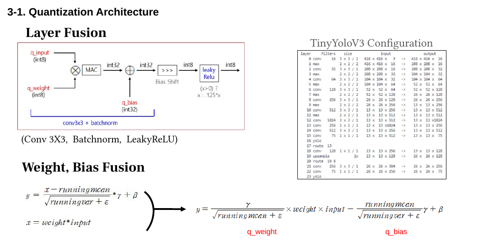
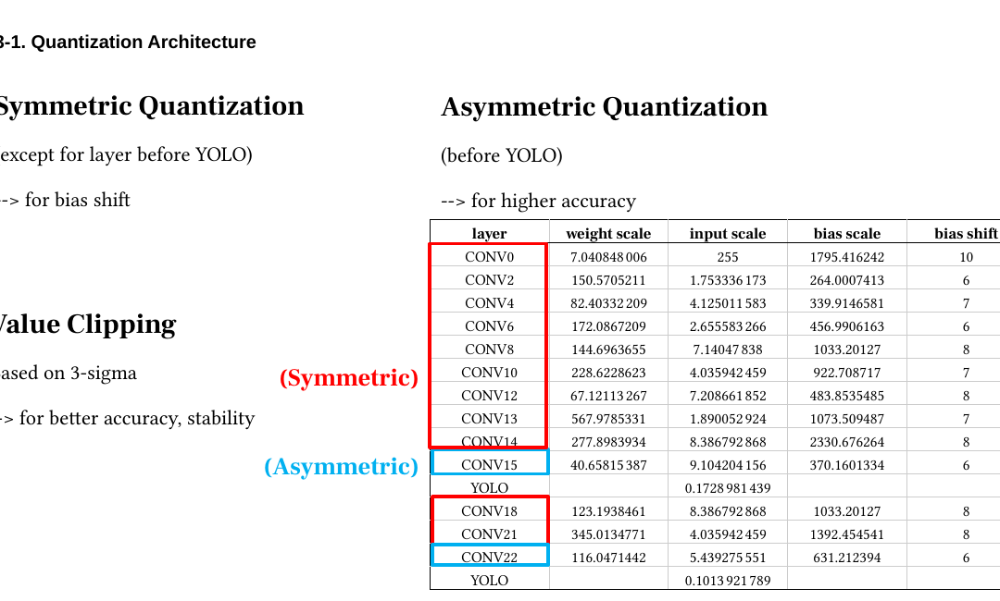
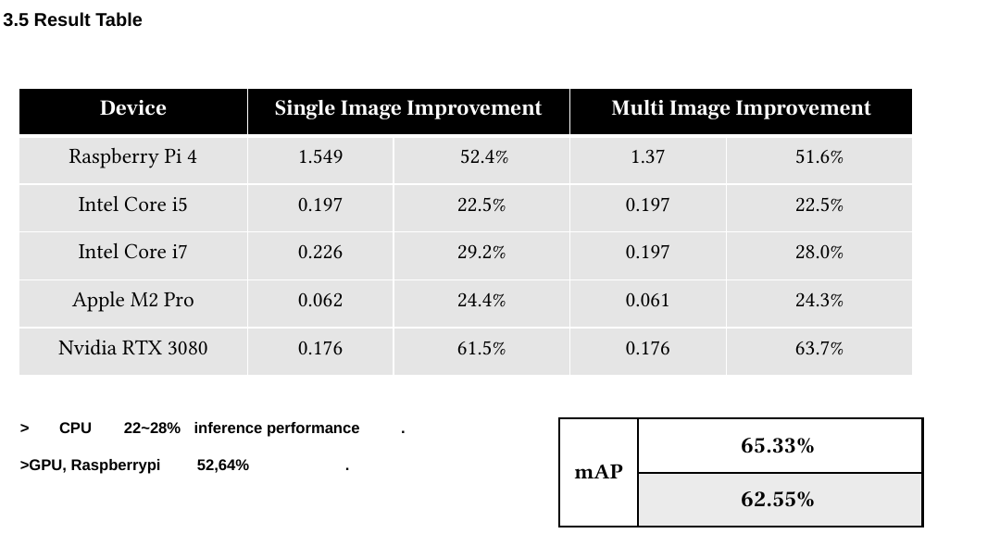

Object detectors are judged on big GPUs, but the places that need them — drones, cameras on a farm, a security box — have a Raspberry Pi's worth of compute and a battery. The graduation project asked a plain question: take the smallest YOLO, quantize it to 8-bit integers, and measure what that is actually worth on hardware people own, from a 55-dollar Pi to a 1,400-dollar GPU. This was my first piece of work on quantisation and the reason the topic is still on my reading list.

## What we did

- **Layer fusion.** Each 3×3 convolution, its batch-norm and the LeakyReLU are folded into one operation — the batch-norm's scale and shift are absorbed into a quantized weight and a quantized bias — so the int8 path is a single multiply-accumulate with a bias shift and no floating-point in between.
- **Two quantizers, by layer.** Symmetric scales everywhere in the body (cheap on hardware, allows a pure bias shift); asymmetric scales for the two layers right before the YOLO detection heads, where the activation range is lopsided and symmetric rounding costs accuracy. Values are clipped at three standard deviations before scaling so outliers do not stretch the int8 range.
- **Per-layer scales from calibration.** A weight scale, input scale, bias scale and bias shift per layer (CONV0 … CONV22), read off the activation statistics on PASCAL VOC.
- **Five machines.** Raspberry Pi 4 (ARM Cortex-A72), Intel i5-10400, i7-13700K, Apple M2 Pro, and an RTX 3080 — the same model, the same images, single-shot and multi-shot timing.

## What it bought

| device | original | quantized | saving |
|---|---:|---:|---:|
| Raspberry Pi 4 | 2.95 s | 1.41 s | 52 % |
| Intel i5-10400 | 0.87 s | 0.66 s | 22 % |
| Intel i7-13700K | 0.77 s | 0.55 s | 29 % |
| Apple M2 Pro | 0.25 s | 0.19 s | 24 % |
| RTX 3080 | 0.29 s | 0.11 s | 61 % |

Single-image times; multi-image averages are within a few percent. mAP on PASCAL VOC dropped from 65.33 % to 62.55 %. The weight file shrank about four-fold and the total footprint from 1.6 GB to about 100 MB, which is what lets the model sit on a device with little memory.

Two readings mattered to us. The gain is largest at the two ends — the weakest device and the GPU — and smallest on ordinary CPUs, so quantization helps most exactly where the deployment problem is hardest or the batch is largest. And the quantized model on an i5 (0.65 s) beat the original on a more expensive i7 (0.77 s): a software change bought more than a hardware upgrade.

## What it did not

Live detection on the Raspberry Pi 4 still ran at about two seconds a frame. Int8 alone does not make a Pi real-time; that needs a smaller network, non-linear quantization or a hardware accelerator, and the report says so. The 2.78-point mAP loss is the price of uniform int8 and is where non-uniform schemes would start.

## Team

Hyeonmin Jeon, Suseong Kim, Heeseok Kim — School of Electrical and Electronics Engineering, Chung-Ang University, 2024 graduation project, advised by Prof. Minhyeok Lee.
