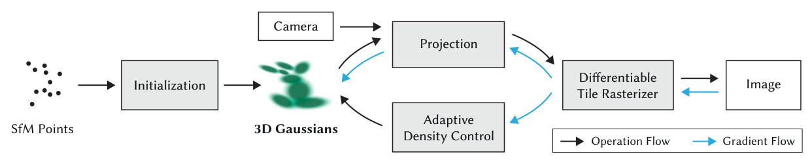
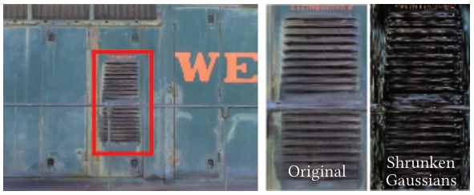
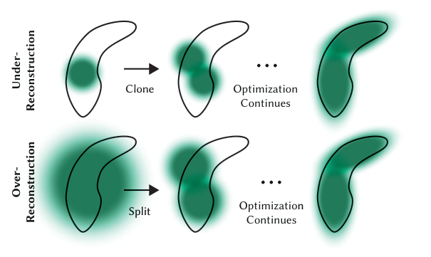

## Abstract

This paper keeps the image formation model of NeRF but throws away both the neural network and ray marching. A scene is a set of 3D Gaussians, each with a position, an anisotropic covariance, an opacity and spherical-harmonic colour coefficients, initialised from the sparse point cloud that structure-from-motion produces anyway. The Gaussians are projected to the screen and alpha-blended in depth order by a custom GPU rasteriser that is differentiable, so all parameters can be fitted to the training photographs by gradient descent. During fitting, the set is periodically grown, split and pruned according to where gradients say the reconstruction is poor. On three real-scene benchmarks the result matches or beats Mip-NeRF360 on most metrics, trains in roughly 25 to 45 minutes instead of 48 hours, and renders at more than 130 fps. The cost is memory: hundreds of megabytes per scene rather than a few.

**Keywords:** novel view synthesis, radiance fields, 3D Gaussians, splatting, tile-based rasterisation, adaptive density control

## 1 Introduction

By 2023 radiance-field methods had split into two camps. The quality leader, Mip-NeRF360, needed up to 48 hours of training and seconds per frame. The fast camp, InstantNGP with hash grids and Plenoxels with sparse voxels, trained in minutes but at visibly lower quality and only reached interactive rates of around 10 to 15 fps. The authors argue that both camps share one bottleneck: they are continuous fields that must be sampled many times along every ray, including through empty space, and the stochastic sampling is both slow and a source of noise.

Meshes and points, by contrast, are explicit and map well to GPU rasterisation, but earlier point-based neural renderers depended on multi-view stereo geometry and inherited its holes and phantom surfaces, and those using a CNN for the final image flickered over time. <mark>The goal stated here is real-time (at least 30 fps) rendering at 1080p for complete, unbounded scenes, with training time comparable to the fastest prior methods and quality comparable to the best.</mark>

## 2 Background

The argument rests on one observation. NeRF's quadrature for the colour of a ray and the blending rule used in point-based rendering are the same formula. For $N$ depth-ordered contributions with colours $\mathbf{c}_i$ and opacities $\alpha_i$,

$$
C=\sum_{i=1}^{N}\mathbf{c}_i\,\alpha_i\prod_{j=1}^{i-1}(1-\alpha_j) \tag{1}
$$

In NeRF, $\alpha_i = 1-\exp(-\sigma_i\delta_i)$ comes from a density $\sigma_i$ sampled over an interval $\delta_i$. In splatting, $\alpha_i$ is a learned per-primitive opacity multiplied by the value of a 2D Gaussian footprint at the pixel. <mark>So the image model is shared; what differs is the algorithm that finds the contributions</mark>: a field has to be searched by sampling, a list of primitives only has to be sorted.

## 3 Method

> **Key idea.** Keep volumetric alpha compositing, because it optimises well, but make the scene an explicit, unstructured set of anisotropic Gaussians that can be rasterised instead of ray-marched, and let the optimiser create, move and delete them.

*Source: Kerbl et al., arXiv:2308.04079, Fig. 2, CC BY 4.0.*

### 3.1 The primitive

Each Gaussian is centred at a mean $\boldsymbol\mu$ with a full 3D covariance $\Sigma$ in world space:

$$
G(\mathbf{x})=\exp\!\Big(-\tfrac12(\mathbf{x}-\boldsymbol\mu)^{\!\top}\Sigma^{-1}(\mathbf{x}-\boldsymbol\mu)\Big) \tag{2}
$$

(the paper writes $\mathbf{x}$ already relative to the mean). This value is scaled by the opacity $\alpha$ during blending. For rendering, the covariance is pushed to camera space following the EWA splatting result of Zwicker et al.:

$$
\Sigma' = J\,W\,\Sigma\,W^{\top}J^{\top} \tag{3}
$$

where $W$ is the viewing transformation and $J$ the Jacobian of an affine approximation to the perspective projection. Dropping the third row and column leaves a 2×2 covariance for the screen-space splat.

Optimising $\Sigma$ directly does not work, since a gradient step can easily leave the set of positive semi-definite matrices. The paper instead stores a scale vector $\mathbf{s}$ and a unit quaternion $\mathbf{q}$, builds a scaling matrix $S$ and rotation $R$ from them, and sets

$$
\Sigma = R\,S\,S^{\top}R^{\top} \tag{4}
$$

which is valid by construction. Opacity passes through a sigmoid and scale through an exponential. View-dependent colour uses four bands of spherical harmonics, introduced one band every 1000 iterations because the higher bands are poorly constrained when parts of the viewing sphere are missing. Gradients for all parameters are derived by hand rather than by autodiff.

*Source: Kerbl et al., arXiv:2308.04079, Fig. 3, CC BY 4.0.*

### 3.2 Optimisation and adaptive density control

The loss mixes an L1 term with a structural-similarity term,

$$
\mathcal{L}=(1-\lambda)\,\mathcal{L}_1+\lambda\,\mathcal{L}_{\text{D-SSIM}},\qquad \lambda=0.2 \tag{5}
$$

Training starts at a quarter of the image resolution and upsamples after 250 and 500 iterations. Initial Gaussians are isotropic, sized from the mean distance to the three nearest SfM points.

A sparse point cloud is nowhere near enough primitives, so after a warm-up the set is revised every 100 iterations. Gaussians whose opacity falls below a threshold $\epsilon_\alpha$ are deleted. Gaussians whose average view-space positional gradient exceeds $\tau_{\text{pos}}=0.0002$ are densified, on the reasoning that a primitive the optimiser keeps trying to move sits in a badly reconstructed region. Small ones are **cloned** and the copy nudged along the gradient, which adds volume; large ones are **split** into two, with scale divided by $\phi=1.6$ and positions sampled from the parent, which keeps volume roughly fixed. Every 3000 iterations all opacities are reset near zero, so that only Gaussians the loss actually needs recover, and the rest, including floaters near cameras, get culled.

*Source: Kerbl et al., arXiv:2308.04079, Fig. 4, CC BY 4.0.*

### 3.3 Tile-based differentiable rasteriser

The screen is divided into 16×16-pixel tiles. Gaussians are culled against the frustum using their 99% confidence extent, duplicated once per tile they touch, and given a key combining tile ID and view-space depth. <mark>A single GPU radix sort over these keys orders everything at once; there is no per-pixel sorting</mark>, so blending order is approximate, which the authors report causes no visible artefacts once splats become small. Each tile then runs one thread block that walks its list front to back and stops a pixel when its accumulated opacity saturates.

The backward pass reuses the sorted lists, traversed back to front. Intermediate transmittances are not stored; only the final accumulated opacity per pixel is kept, and earlier values are recovered by dividing out each $\alpha$ in turn. This keeps the memory overhead constant per pixel and, unlike Pulsar, <mark>places no cap on how many blended primitives receive gradients</mark>.

## 4 Experiments

Evaluation covers 13 real scenes: all of the Mip-NeRF360 dataset, two scenes from Tanks&Temples and two from Deep Blending, with every eighth image held out, plus the synthetic Blender scenes from NeRF. One hyperparameter setting is used throughout. Timings are on an A6000, except that Mip-NeRF360 was trained on four A100s for 12 hours, reported as 48 GPU-hours. Numbers marked † were copied from the Mip-NeRF360 paper; the rest are the authors' own runs.

Mip-NeRF360 dataset:

| Method | SSIM↑ | PSNR↑ | LPIPS↓ | Train | FPS | Memory |
|---|---|---|---|---|---|---|
| Plenoxels | 0.626 | 23.08 | 0.463 | 25m49s | 6.79 | 2.1 GB |
| INGP-Base | 0.671 | 25.30 | 0.371 | 5m37s | 11.7 | 13 MB |
| INGP-Big | 0.699 | 25.59 | 0.331 | 7m30s | 9.43 | 48 MB |
| Mip-NeRF360 | 0.792† | **27.69**† | 0.237† | 48h | 0.06 | **8.6 MB** |
| Ours-7K | 0.770 | 25.60 | 0.279 | 6m25s | **160** | 523 MB |
| **Ours-30K** | **0.815** | 27.21 | **0.214** | 41m33s | 134 | 734 MB |

Tanks&Temples and Deep Blending (SSIM↑ / PSNR↑ / LPIPS↓):

| Method | Tanks&Temples | Deep Blending |
|---|---|---|
| INGP-Big | 0.745 / 21.92 / 0.305 | 0.817 / 24.96 / 0.390 |
| Mip-NeRF360 | 0.759 / 22.22 / 0.257 | 0.901 / 29.40 / 0.245 |
| **Ours-30K** | **0.841 / 23.14 / 0.183** | **0.903 / 29.41 / 0.243** |

<mark>After 30K iterations the method is ahead of Mip-NeRF360 on every metric except PSNR on Mip-NeRF360's own dataset, while rendering at 134 to 154 fps against 0.06 to 0.14.</mark> At 7K iterations, about six minutes, it is already in the range of InstantNGP. On the synthetic Blender scenes, starting from 100K random points rather than SfM, average PSNR is 33.32, against 33.30 for Point-NeRF and 33.18 for INGP-Base.

Ablations, average PSNR over Truck, Garden and Bicycle at 30K iterations:

| Variant | PSNR↑ |
|---|---|
| Gradients limited to 10 front-most splats | 19.19 |
| Random initialisation | 20.42 |
| No split | 23.90 |
| Isotropic Gaussians | 25.23 |
| No spherical harmonics | 25.35 |
| No clone | 25.91 |
| **Full** | **26.05** |

The largest single failure comes from truncating gradients, which destabilises optimisation (an 11 dB loss on Truck). Random initialisation mainly hurts backgrounds in real scenes.

## 5 Discussion

**Strengths.** The paper is as much a systems contribution as a modelling one: the choice of primitive is justified by what a GPU does well, and the ablations show that the engineering decisions (unlimited gradient depth, global sort) are load-bearing. The covariance factorisation is a simple, reusable way to keep a learned matrix valid. Using SfM points that calibration produces for free removes the dependence on multi-view stereo that held back earlier point-based work.

**Weaknesses.** <mark>Memory is one to two orders of magnitude above the implicit methods</mark>: 734 MB against 8.6 MB on the Mip-NeRF360 scenes, with peak training memory above 20 GB on large scenes. The PSNR lead over Mip-NeRF360 is not uniform. The authors list elongated or "splotchy" Gaussians in poorly observed regions, popping when large Gaussians change blending order, and the absence of any regularisation; very large scenes may need a lower position learning rate.

**Not shown.** Accuracy of the recovered geometry is not measured, only image metrics. The heuristics ($\tau_{\text{pos}}$, $\phi$, the reset interval) are fixed by experiment without a sensitivity study. There is no anti-aliasing analysis across rendering scales, and sparse-view behaviour is not tested. The training-time comparison with Mip-NeRF360 crosses hardware, which the paper does state.

## 6 Takeaways

- The NeRF rendering equation and point splatting are the same compositing sum; the speed-up comes from replacing sampling of a field with sorting of primitives.
- Anisotropy is what makes an explicit representation compact enough: a few thin Gaussians cover what would take many spheres.
- Structure can be learned by discrete birth, split and death moves interleaved with gradient descent, triggered by a cheap signal (positional gradient magnitude).
- The trade is compute for memory, the reverse of the one NeRF made.
- For financial modelling the honest overlap is narrow. The $RSS^{\top}R^{\top}$ parameterisation is a clean way to learn a positive semi-definite covariance by unconstrained gradient descent, and clone/split/prune is an adaptive mixture-fitting scheme; both could be borrowed when fitting Gaussian mixtures to return distributions. The rendering machinery itself has no counterpart there.

## References

- Kerbl, B., Kopanas, G., Leimkühler, T., Drettakis, G. *3D Gaussian Splatting for Real-Time Radiance Field Rendering.* ACM Transactions on Graphics 42(4), 2023. arXiv:2308.04079.
- Mildenhall, B. et al. *NeRF: Representing Scenes as Neural Radiance Fields for View Synthesis.* ECCV 2020. arXiv:2003.08934.
- Barron, J. T. et al. *Mip-NeRF 360: Unbounded Anti-Aliased Neural Radiance Fields.* CVPR 2022.
- Müller, T. et al. *Instant Neural Graphics Primitives with a Multiresolution Hash Encoding.* ACM Transactions on Graphics, 2022.
- Zwicker, M. et al. *EWA Volume Splatting.* IEEE Visualization 2001.
