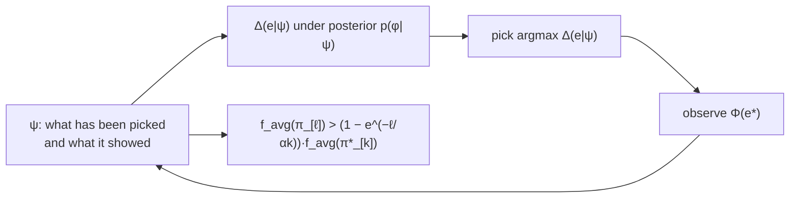

## Abstract

The $1-1/e$ guarantee is for choosing a set in one shot. Many real problems are sequential with feedback: place a sensor and learn whether it works, ask a query and learn the label, treat a patient and observe the response. The optimal object is then a *policy*, not a set, and optimal policies for partially observable stochastic problems are notoriously hard. This paper generalises submodularity to that setting. Fix a prior $p(\varphi)$ over realisations of item states, define the *conditional expected marginal benefit* $\Delta(e\mid\psi)$ of an item given everything observed so far, and call $f$ **adaptive submodular** if $\Delta(e\mid\psi)\ge\Delta(e\mid\psi')$ whenever $\psi$ is a subrealisation of $\psi'$ — the gain from an item never grows as you learn more. Then the *adaptive greedy policy*, which differs from ordinary greedy by exactly one line (observe the state of what you just picked), satisfies $f_{\mathrm{avg}}(\pi_{[\ell]})>\bigl(1-e^{-\ell/\alpha k}\bigr)f_{\mathrm{avg}}(\pi^\ast_{[k]})$, giving $1-1/e$ at $\ell=k$ with exact greedy selection. Lazy evaluation carries over, because the conditional gains are still monotone along a run. Coverage variants get logarithmic-squared guarantees, and the paper's v5 carries an unusually frank historical note correcting an earlier, stronger claim whose proof was wrong.

**Keywords:** adaptive submodularity, conditional expected marginal benefit, adaptive greedy policy, active learning, stochastic set cover, self-certifying instances

## 1 Introduction

*In many problems arising in artificial intelligence one needs to adaptively [make decisions, taking] into account observations about the outcomes of past decisions.* When the outcomes are uncertain and only a prior is known, this is a partially observable stochastic optimisation problem, and *finding optimal policies … is notoriously [hard]*. The programme is the standard one for such situations: *identify classes of planning [problems that admit] (near-) optimal performance*.

The analogy being extended is stated plainly. Submodularity *is an intuitive notion of diminishing returns, which states that adding an element to a small set helps more than adding it to a large set*, and NWF's theorem guarantees greedy is near-optimal for maximising one. The question is what the right generalisation is when "the set so far" is replaced by "the set so far, plus what it told me".

Why this matters for subset selection with feedback — which is most real subset selection. If choosing a factor to test, a feature to acquire, or an experiment to run reveals information that changes what you should choose next, the one-shot guarantee simply does not apply, and the right comparison is against the best *adaptive* strategy, which is a much stronger benchmark than the best fixed set. This paper says when greedy still wins against that benchmark.

## 2 Background: the objects

**Items and realisations.** A finite set $E$ of items, each in an initially unknown state from $O$. A *realisation* $\varphi:E\to O$ gives all states; $\Phi$ is random with known prior $p(\varphi)$. Select an item, observe $\Phi(e)$, select the next, and so on.

**Partial realisations.** After some picks, observations form a *partial realisation* $\psi$: a function from the picked items to their states, written as a relation $\psi\subseteq E\times O$ with $\mathrm{dom}(\psi)$ the items observed. A realisation $\varphi$ is *consistent* with $\psi$, written $\varphi\sim\psi$, if they agree on $\mathrm{dom}(\psi)$; $\psi$ is a *subrealisation* of $\psi'$ if $\psi\subseteq\psi'$ as relations.

*Partial realisations are similar to the notion of "belief states" in Partially Observable Markov Decision Problems, as they encode the effect of all actions taken and observations made, and determine our posterior belief about the state of the world.* The connection is explicit and it frames the contribution: this is a tractable sub-class of POMDP-like problems, carved out by a structural property rather than by an approximation.

**Policies.** $\pi$ maps partial realisations to items (or, if randomised, to distributions over items), with $\mathrm{dom}(\pi)$ closed under subrealisations; $\pi$ terminates on any $\psi$ outside its domain. $E(\pi,\varphi)$ is the set selected under $\varphi$, and each deterministic $\pi$ is a decision tree.

**Three problems.** With $f_{\mathrm{avg}}(\pi)=\mathbb{E}[f(E(\pi,\Phi),\Phi)]$ and $c_{\mathrm{avg}}(\pi)=\mathbb{E}[\lvert E(\pi,\Phi)\rvert]$:

$$
\text{(maximisation)}\quad \max_\pi f_{\mathrm{avg}}(\pi)\ \text{s.t.}\ \lvert E(\pi,\varphi)\rvert\le k\ \forall\varphi; \tag{1}
$$
$$
\text{(min-cost cover)}\quad \min_\pi c_{\mathrm{avg}}(\pi)\ \text{s.t.}\ f(E(\pi,\varphi),\varphi)\ge Q\ \forall\varphi; \tag{2}
$$
$$
\text{(min-sum cover)}\quad \min_\pi c_\Sigma(\pi)=\sum_{t\ge0}\bigl(Q-u(\pi,t)\bigr), \tag{3}
$$

plus the worst-case cost $c_{\mathrm{wc}}(\pi)=\max_\varphi\lvert E(\pi,\varphi)\rvert$, which is *the depth of the deepest leaf in $T^\pi$*. The constraint in (1) and (2) is *for all $\varphi$*, not in expectation — a hard budget and a hard quota.

The baseline difficulty: *even for linear functions $f$ … Problems (1), (2), and (3) are hard to approximate.* So structure is not optional.

## 3 Method

> **Key idea.** Replace "marginal gain at a set" by "expected marginal gain given everything seen so far, under the posterior". Diminishing returns then has to hold in two directions at once — as the selected set grows *and* as the posterior sharpens — and that conjunction is exactly what makes greedy work.

### 3.1 The definitions

**Definition 1 (Conditional expected marginal benefit).**

$$
\Delta(e\mid\psi)=\mathbb{E}\Bigl[f\bigl(\mathrm{dom}(\psi)\cup\{e\},\Phi\bigr)-f\bigl(\mathrm{dom}(\psi),\Phi\bigr)\ \Big\vert\ \Phi\sim\psi\Bigr], \tag{4}
$$

the expectation under the posterior $p(\varphi\mid\psi)$; and analogously $\Delta(\pi\mid\psi)$ for a whole policy. In the sensor example, $\Delta(e\mid\psi)$ is *the expected amount of additional area covered by placing a sensor at location $e$, in expectation over the posterior distribution of whether the sensor will fail or not, and taking into account the area covered by the placed working sensors*.

**Definition 2 (Adaptive monotonicity).** $\Delta(e\mid\psi)\ge0$ for all $e$ and all $\psi$ with $\Pr[\Phi\sim\psi]>0$.

**Definition 3 (Adaptive submodularity).** For $\psi\subseteq\psi'$ and $e\notin\mathrm{dom}(\psi')$,

$$
\Delta(e\mid\psi)\ \ge\ \Delta(e\mid\psi'). \tag{5}
$$

Two remarks the paper makes and that are easy to skate past.

- **The comparison moves two things at once.** *When comparing the two expected marginal benefits, there is a difference in both the set of items previously selected ($\mathrm{dom}(\psi)$ vs $\mathrm{dom}(\psi')$) and in the distribution over realizations ($p(\varphi\mid\psi)$ vs $p(\varphi\mid\psi')$).* Ordinary submodularity has only the first. So (5) is *not* implied by $f(\cdot,\varphi)$ being submodular for each fixed $\varphi$ — information can make an item look better, and adaptive submodularity forbids that.
- **It is a property of the pair $(f,p)$, not of $f$.** *It is possible that $f$ is adaptive submodular with respect to one distribution, but not with respect to another.* Change your prior and you may lose the guarantee.

The decision-tree reading is the intuitive one: at a node $v$ selecting item $e$, the expected marginal benefit of $e$ at $v$ must be no larger than it would have been at any ancestor of $v$.

**What it does not cover.** The paper is explicit that synergistic effects are outside the frame — *an extreme example of synergistic effects between items* is given as a case where the theory does not apply — and that adaptive monotonicity and submodularity *enjoy similar closure properties* to their non-adaptive counterparts, which is what lets objectives be combined.

### 3.2 The algorithm

The adaptive greedy policy $\pi^{\mathrm{greedy}}$: given the partial realisation $\psi$ observed so far, pick

$$
e^\ast\in\arg\max_e\Delta(e\mid\psi)
\qquad\text{or, with costs,}\qquad
e^\ast\in\arg\max_e\frac{\Delta(e\mid\psi)}{c(e)}, \tag{6}
$$

then **observe $\Phi(e^\ast)$**. The paper's own summary of the novelty:

> The only difference to the classic, non-adaptive greedy algorithm studied by Nemhauser et al. (1978), is Line 1, where an observation $\Phi(e^\ast)$ of the state of the selected item $e^\ast$ is obtained.

One line of code, and it turns a set-selection algorithm into a policy.

**Approximate greedy selection.** Maximising $\Delta(e\mid\psi)$ may be intractable — it is an expectation under a posterior — so the theory is stated for *$\alpha$-approximate greedy policies*, which always pick $e'$ with $\Delta(e'\mid\psi)\ge\tfrac1\alpha\max_e\Delta(e\mid\psi)$.

**Robustness to a wrong prior.** This is the most practically important consequence of carrying $\alpha$ through. *If our incorrect prior is such that when we evaluate $\Delta(e\mid\psi)$ we err by a multiplicative factor of at most $\alpha$*, the resulting policy is an $\alpha$-approximate greedy policy with respect to the true prior, and inherits the degraded guarantee. So the requirement of a known prior — the obvious objection to the whole framework — is softened into a requirement of a prior whose induced marginal gains are within a factor $\alpha$ of the truth, with a bound that degrades gracefully as $1-e^{-1/\alpha}$.

**Lazy evaluation carries over.** *The definition of adaptive submodularity allows us to implement an "accelerated" version of the adaptive greedy algorithm using lazy evaluations of marginal benefits as originally suggested for the non-adaptive case by Minoux (1978).* The reason is (5) applied along a single run: writing $\psi^i$ for the partial realisation after $i$ picks, *$i\mapsto\Delta(e\mid\psi^i)$ is nonincreasing for all $e$*, so a stale gain is still an upper bound and the [CELF](/blog/celf/) priority-queue argument applies verbatim, replacing $\Theta(\lvert E\rvert k)$ naive evaluations. This matters more here than in the non-adaptive case, because each $\Delta(e\mid\psi)$ is an expectation rather than a function call.

### 3.3 Algorithm

```text
ADAPTIVE GREEDY  (for the maximisation problem, budget k)
  psi = {}                                  # nothing observed yet
  for i = 1..k:
      for each e not in dom(psi):
          Delta(e | psi) = E[ f(dom(psi)+e, Phi) - f(dom(psi), Phi) | Phi ~ psi ]
          #                 ^ expectation under the POSTERIOR given psi
      e* = argmax_e Delta(e | psi)          # or Delta/c(e) with costs
      observe Phi(e*)                       # <-- THE ONLY NEW LINE vs. NWF greedy
      psi = psi + {(e*, Phi(e*))}           # posterior sharpens
  return the realised set dom(psi)

  # with lazy evaluation: keep Delta values in a max-heap, recompute only the top,
  # correct because i -> Delta(e | psi^i) is nonincreasing along the run.
```



## 4 Results

### 4.1 Maximisation

**Theorem 5.** Fix $\alpha\ge1$. If $f$ is adaptive monotone and adaptive submodular with respect to $p(\varphi)$, and $\pi$ is an $\alpha$-approximate greedy policy, then for all policies $\pi^\ast$ and positive integers $\ell,k$,

$$
f_{\mathrm{avg}}\bigl(\pi_{[\ell]}\bigr)>\Bigl(1-e^{-\ell/\alpha k}\Bigr)f_{\mathrm{avg}}\bigl(\pi^\ast_{[k]}\bigr), \tag{7}
$$

where $\pi_{[\ell]}$ is the level-$\ell$ truncation. At $\ell=k$ this gives $1-e^{-1/\alpha}$, and at $\alpha=1$ the familiar $1-1/e$.

Three things to notice.

1. **The benchmark is the optimal adaptive policy**, not the optimal set. That is a strictly stronger comparison — the optimal policy can exploit feedback — and greedy still gets $1-1/e$ against it.
2. **The bicriteria form is the useful one.** Running greedy for $\ell>k$ steps against an optimum with budget $k$ gives $1-e^{-\ell/k}$: double the budget and the shortfall falls from $37\%$ to $14\%$, quadruple it and it is $2\%$. Exponential improvement in extra budget, and it is the form most applications actually use.
3. **$\alpha$ absorbs three separate imperfections** — intractable greedy selection, sampled expectations, and a mis-specified prior — into one degraded constant $1-e^{-1/\alpha}$. At $\alpha=2$ that is $0.393$; at $\alpha=1.1$, $0.596$. The bound is forgiving near $\alpha=1$ and falls off slowly.

### 4.2 Coverage, and an honest correction

Coverage needs more structure. **Self-certifying instances** (Definition 8) are those where *whenever a policy achieves the maximum possible value for the true realization it immediately has a proof of this fact*: formally, for all $\varphi,\varphi'\sim\psi$, $f(\mathrm{dom}(\psi),\varphi)=f(E,\varphi)$ iff $f(\mathrm{dom}(\psi),\varphi')=f(E,\varphi')$. Proposition 9 gives a checkable sufficient condition — a uniform maximum $Q$ across realisations, and $f$ depending only on the observed states of selected items — and the paper notes that *Stochastic Submodular Cover, Stochastic Set Cover, Adaptive Viral Marketing and Pool-Based Active Learning instances are all self-certifying*.

**Theorem 13** (min-cost cover), under *strong* adaptive monotonicity and submodularity, with $f(E,\varphi)=Q$ for all $\varphi$, $\eta$ such that $f(S,\varphi)>Q-\eta$ implies $f(S,\varphi)=Q$, and $\delta=\min_\varphi p(\varphi)$:

$$
c_{\mathrm{avg}}(\pi)\le\alpha\,c_{\mathrm{avg}}(\pi^\ast_{\mathrm{avg}})\Bigl(\ln\tfrac{Q}{\delta\eta}+1\Bigr)^{\!2}
\quad\text{in general, and}\quad
c_{\mathrm{avg}}(\pi)\le\alpha\,c_{\mathrm{avg}}(\pi^\ast_{\mathrm{avg}})\Bigl(\ln\tfrac{Q}{\eta}+1\Bigr)^{\!2}
\tag{8}
$$

for self-certifying instances. With integer-valued $f$ one may take $\eta=1$.

And then this, in the published v5:

> **Historical Note:** An earlier version of Theorem 13 claimed logarithmic approximation factors rather than the squared-logarithmic factors present here. Unfortunately, the proof was flawed as pointed out by Nan and Saligrama (2017). Determining whether the logarithmic bounds hold remains an interesting open problem. … It also remains open whether the strong adaptive submodularity condition is required.

A published, widely cited theorem, found wrong seven years later, corrected in place with the error attributed and the weaker statement proved, and the original question left explicitly open. This is how it is supposed to work and it almost never happens; it is worth more to a reader than most of the theorems.

**Theorem 14** (worst-case cost) needs only the ordinary adaptive conditions, not the strong ones. And its tightness is inherited: with a deterministic prior there is no distinction between average and worst case, the self-certifying bound reduces to the $(\ln Q+1)$ guarantee for greedy set cover, and Feige's hardness gives *for every constant $\varepsilon>0$ there is no polynomial time $(1-\varepsilon)\ln(Q/\eta)$ approximation algorithm for self-certifying instances* — so the logarithmic dependence is necessary even if the square is not.

### 4.3 Applications

The paper works through Stochastic Submodular Cover, Stochastic Set Cover, adaptive sensing / management of sensing resources, **Adaptive Viral Marketing** (adaptive influence maximisation, where you seed one person, observe who they actually influence, and then seed the next), and **Pool-Based Active Learning**, where the classical generalised binary search / greedy-information-gain heuristics fall out with guarantees. In each case *adaptive submodularity allows us to recover known results and prove natural generalizations* — the framework's claim is unification plus extension, not novelty of algorithm.

## 5 Limitations

**Stated by the authors.**

- **A known prior is assumed.** The footnote is candid: *in some situations, we may not have exact knowledge of the prior $p(\varphi)$. Obtaining algorithms that are [robust to this] remains an interesting source of open problems.* The $\alpha$-approximate machinery is a partial answer, not a full one.
- **Synergistic effects are outside the theory**, as are certain structures where items interact positively.
- **The squared logarithm in Theorem 13**, and whether the plain logarithm holds, is open — as is whether strong adaptive submodularity is needed.
- Computing $\Delta(e\mid\psi)$ may be intractable, hence $\alpha$.

**My reading.**

- **Verifying adaptive submodularity is materially harder than verifying submodularity**, because (5) is a statement about posteriors, not just about sets. The paper supplies proofs for its applications; a practitioner with a new objective has real work to do, and the distribution-dependence means the answer can change when the prior does.
- **The prior does double duty** — it defines the objective ($f_{\mathrm{avg}}$ is an expectation under it) *and* it defines the property. A mis-specified prior therefore corrupts both the thing being optimised and the guarantee, and only the second is covered by the $\alpha$ analysis.
- **The adaptivity gap is discussed but not the headline.** How much better the optimal adaptive policy is than the optimal fixed set — which is the whole reason to go adaptive — is a separate question, and this paper's theorems compare greedy to the adaptive optimum without telling you whether adaptivity was worth the trouble on your problem.
- **The paper is long and variant-rich** — three problem formulations, several strengthened conditions, many applications — and the load-bearing content is Definitions 1–3 and Theorem 5. A reader can extract the useful 15% quickly and should.
- **No experiments in the theory sections.** The applications are worked analytically; the empirical content is limited.

## 6 Extensions

**What was built on this.** Adaptive submodularity became the standard framework for sequential decision problems with diminishing returns: adaptive sensor scheduling, adaptive influence maximisation, Bayesian active learning and generalised binary search, adaptive experimental design, and interactive submodular set cover. Nan and Saligrama's correction is itself part of the lineage. Later work relaxed the requirements in several directions — pointwise submodularity, adaptive submodularity ratios (the adaptive analogue of the [submodularity ratio](/blog/das-kempe/)), and batch/parallel adaptive selection where you must commit to several items before seeing any outcome.

**Open problems.** Whether Theorem 13's logarithmic bound holds. Whether strong adaptive submodularity is necessary. Robustness to prior mis-specification beyond the multiplicative-$\alpha$ result. And characterising the adaptivity gap.

**Research directions.** *These are ideas, not results — none has been run.*

1. **Adaptive factor acquisition under a data budget.** Hypothesis: when factor data must be bought one source at a time and each purchase reveals both the factor's values and something about the data vendor's quality, the objective (explained cross-sectional variance under a nearest-factor assignment) is adaptive submodular with respect to a reasonable prior over data quality, so adaptive greedy beats the best fixed purchase list by a margin that grows with the variance of the quality prior. Data: simulated panels with a quality parameter drawn from a prior, then a real factor panel with a synthetic quality process. Baseline: the best non-adaptive greedy set at the same budget, and an oracle that knows the qualities. Metric: expected objective at matched budget, and the measured adaptivity gap against quality-prior variance. Likely failure mode: the objective is adaptive submodular only for priors under which quality is independent across sources, which is exactly the assumption real data vendors violate.
2. **Test the $\alpha$-robustness bound against prior mis-specification.** Hypothesis: the degraded guarantee $1-e^{-1/\alpha}$ is loose — a prior wrong enough to give $\alpha=2$ in the worst case typically costs far less than the implied drop from $0.632$ to $0.393$, because the worst-case $\alpha$ is attained at partial realisations the policy rarely reaches. Data: stochastic set cover instances with a controlled mismatch between the true and assumed priors. Baseline: adaptive greedy under the true prior. Metric: realised objective ratio against the worst-case $\alpha$ and against an on-path average $\alpha$. Likely failure mode: an on-path $\alpha$ is not a well-defined quantity independent of the policy, so the "tighter" predictor is circular.
3. **Measure the adaptivity gap where it is cheap to measure.** Hypothesis: for stochastic coverage problems the ratio of the optimal adaptive policy's value to the optimal fixed set's value is close to 1 when item states are nearly deterministic and grows towards a small constant as state entropy rises, so there is a measurable entropy threshold below which adaptivity is not worth the implementation cost. Data: small stochastic set cover instances where both optima can be computed by exhaustive policy search. Baseline: optimal fixed set, optimal adaptive policy, adaptive greedy, non-adaptive greedy. Metric: the two gaps against per-item state entropy. Likely failure mode: exhaustive policy search is feasible only at sizes so small that the gap is dominated by boundary effects.

## 7 Takeaways

- Sequential selection with feedback optimises over *policies*, not sets, and the optimal policy is a much stronger benchmark than the optimal set. The result here is that greedy gets $1-1/e$ against that stronger benchmark.
- The generalisation is one definition: replace the marginal gain at a set with the expected marginal gain under the posterior given everything observed, and require it to be non-increasing as observations accumulate.
- That requirement is strictly stronger than "submodular for each fixed realisation", because the comparison moves both the selected set and the posterior. Information is not allowed to make an item look better.
- Adaptive submodularity is a property of the pair (objective, prior). Change the prior and it can fail.
- The algorithm differs from ordinary greedy by one line: after picking, look at what you picked.
- Carrying an approximation factor $\alpha$ through the analysis buys robustness to three different failures at once — intractable selection, sampled expectations, and a wrong prior — at a cost of $1-e^{-1/\alpha}$ instead of $1-1/e$.
- The bicriteria form of Theorem 5 is the one to remember: greedy run for $\ell$ steps against an optimum with budget $k$ gets $1-e^{-\ell/k}$, so extra budget buys exponentially less regret.
- Lazy evaluation still works, and matters more here, because each marginal gain is an expectation rather than a function call.
- The v5 historical note — a cited theorem found wrong, corrected downward, the error attributed and the original question left open — is a model of how this should be done and is worth reading on its own.

## References

1. Golovin, D., Krause, A. *Adaptive Submodularity: Theory and Applications in Active Learning and Stochastic Optimization.* arXiv:1003.3967 (JAIR, 2011; v5 corrects Theorem 13).
2. Nemhauser, G. L., Wolsey, L. A., Fisher, M. L. *An analysis of approximations for maximizing submodular set functions—I.* Mathematical Programming 14, 1978.
3. Minoux, M. *Accelerated Greedy Algorithms for Maximizing Submodular Set Functions.* 1978.
4. Feige, U. *A Threshold of ln n for Approximating Set Cover.* Journal of the ACM 45(4), 1998.
5. Leskovec, J., Krause, A., Guestrin, C., Faloutsos, C., VanBriesen, J., Glance, N. *Cost-effective Outbreak Detection in Networks.* KDD 2007.
6. Nan, F., Saligrama, V. *Comments on the proof of adaptive stochastic set cover based on adaptive submodularity and its implications for the group identification problem in "group-based active query selection for rapid diagnosis in time-critical situations".* IEEE Transactions on Information Theory 63(11):7612-7614, 2017.
