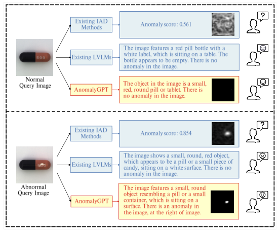
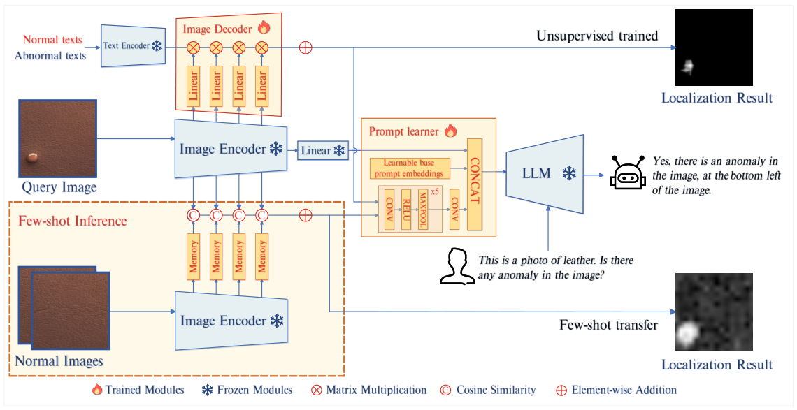
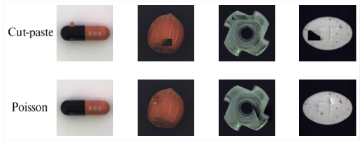

## Abstract

Industrial anomaly detectors output a score, and someone has to pick the cut-off that turns that score into "pass" or "reject", separately for every product. General vision-language chatbots can answer questions about an image but miss small defects and know nothing about inspection. AnomalyGPT combines the two. A lightweight decoder compares intermediate image features with "normal" and "abnormal" text embeddings to produce a pixel map, a prompt learner converts that map into soft prompt tokens, and a frozen LLM reads the image, the tokens, and the user's question and answers in words, including a coarse position. Training uses only synthetic defects pasted onto normal images. With all categories in one model it reaches 93.3% accuracy and 97.4% image AUC on MVTec-AD, and with a single normal example of an unseen dataset it reaches 86.1% accuracy and 94.1% image AUC.

**Keywords:** industrial anomaly detection, large vision-language model, prompt tuning, synthetic anomalies, in-context few-shot learning, threshold-free decision

## 1 Introduction

The paper starts from two complaints. First, methods such as PatchCore or WinCLIP return a continuous anomaly score. AUC summarises ranking quality over all thresholds, but a factory needs one threshold, and the right one differs greatly between product categories. Finding it properly requires labelled defective samples, which contradicts the premise of training on normal data only. The authors quantify this: <mark>PatchCore has 99.3% image AUC on MVTec-AD, yet its accuracy drops to 79.76% when one shared threshold is applied across categories</mark>.

Second, large vision-language models (MiniGPT-4, LLaVA, PandaGPT) describe images fluently but lack domain knowledge and attention to local detail; in the paper's comparison they describe a defective capsule and then report that nothing is wrong. Fine-tuning them directly is risky because inspection datasets hold only a few thousand images, which invites overfitting and loss of general ability.

*Source: Gu et al., arXiv:2308.15366, Fig. 1, CC BY-NC-SA 4.0.*

## 2 Background

**PandaGPT.** The base model couples the ImageBind-Huge image encoder to Vicuna-7B through one linear layer. AnomalyGPT starts from its weights and keeps encoder, linear layer, and LLM frozen.

**WinCLIP and memory banks.** WinCLIP scores image regions by similarity to text embeddings of normal and damaged states; PatchCore scores patches by distance to the nearest stored normal feature. The decoder here reuses both ideas; the authors also cite APRIL-GAN as an influence on its design.

**Synthetic anomalies.** CutPaste creates fake defects by pasting a crop from one image into another, which leaves visible seams. NSA blends the pasted region using Poisson image editing so the boundary is smooth.

## 3 Method

> **Key idea.** Let a small conventional decoder do the fine-grained looking, then hand its heat-map to the LLM as learned prompt tokens, so that the final normal/abnormal decision is made in language and no numeric threshold is ever chosen by the user.

*Source: Gu et al., arXiv:2308.15366, Fig. 2, CC BY-NC-SA 4.0.*

### 3.1 Decoder

The image encoder is split into four stages, giving patch features $F^i_{patch}\in\mathbb{R}^{H_i\times W_i\times C_i}$. These intermediate features never went through image-text alignment, so each stage gets a trainable linear layer mapping it to the text dimension, $\tilde F^i_{patch}$. With $F_{text}\in\mathbb{R}^{2\times C_{text}}$ holding the averaged normal and abnormal prompt embeddings, the localisation map is

$$
M = \mathrm{Upsample}\Big(\sum_{i=1}^{4}\mathrm{softmax}\big(\tilde F^i_{patch}F_{text}^{\top}\big)\Big) \tag{1}
$$

For an unseen product with a few normal images, no text matching is needed. Raw stage features of those images fill memory banks $B^i\in\mathbb{R}^{N\times C_i}$, and each query patch is scored by its best match:

$$
M = \mathrm{Upsample}\Big(\sum_{i=1}^{4}\big(1-\max(F^i_{patch}\cdot B^{i\top})\big)\Big) \tag{2}
$$

This path has no trained parameters, which is why the authors call it in-context learning.

### 3.2 Prompt learner

A small convolutional network turns $M$ into $n_2$ embeddings $E_{dec}$ in the LLM's input space. They are concatenated with $n_1$ freely learnable base embeddings $E_{base}$, and the resulting $n_1+n_2$ tokens are placed after the image embedding $E_{img}$. The LLM input has the form: image token, prompt tokens, an optional sentence describing the object and its expected appearance, then the question "Is there any anomaly in the image?".

### 3.3 Training data and loss

Defects are simulated with the NSA recipe. Answers are templated: either no anomaly, or an anomaly together with its position in a 3×3 grid ("bottom left", "center", and so on), derived from the synthetic mask. Anomaly batches alternate with PandaGPT's original instruction data so that conversational ability is kept.

*Source: Gu et al., arXiv:2308.15366, Fig. 3, CC BY-NC-SA 4.0.*

The objective sums token cross-entropy for the answer text with focal and dice losses on the decoder map:

$$
L = \alpha L_{ce} + \beta L_{focal} + \delta L_{dice}, \qquad L_{focal} = -\frac1n\sum_{i=1}^{n}(1-p_i)^{\gamma}\log p_i \tag{3}
$$

Here $n=H\times W$ pixels, $p_i$ is the predicted probability of the correct class, $\gamma=2$, and $\alpha=\beta=\delta=1$. Focal loss counters the fact that most pixels of a defective image are still normal.

## 4 Experiments

**Setup.** MVTec-AD (3629 normal training images, 1725 test images, 15 categories) and VisA (9621 normal and 1200 anomalous images, 12 categories). Input is 224×224; decoder features come from layers 8, 16, 24, and 32 of ImageBind-Huge. Training runs 50 epochs on two RTX 3090 GPUs with learning rate 1e-3 and batch size 16. Besides image and pixel AUC, the paper reports image-level accuracy computed from the LLM's yes/no answer. For few-shot results the model is trained on one dataset and evaluated on the other.

Few-shot results (mean ± std over five runs; baseline numbers taken from the WinCLIP paper):

| Setup | Method | MVTec Img-AUC | MVTec Px-AUC | MVTec Acc | VisA Img-AUC | VisA Px-AUC | VisA Acc |
|---|---|---|---|---|---|---|---|
| 1-shot | PatchCore | 83.4±3.0 | 92.0±1.0 | – | 79.9±2.9 | 95.4±0.6 | – |
| 1-shot | WinCLIP | 93.1±2.0 | 95.2±0.5 | – | 83.8±4.0 | 96.4±0.4 | – |
| 1-shot | **AnomalyGPT** | **94.1±1.1** | **95.3±0.1** | 86.1±1.1 | **87.4±0.8** | 96.2±0.1 | 77.4±1.0 |
| 4-shot | PatchCore | 88.8±2.6 | 94.3±0.5 | – | 85.3±2.1 | 96.8±0.3 | – |
| 4-shot | WinCLIP | 95.2±1.3 | 96.2±0.3 | – | 87.3±1.8 | 97.2±0.2 | – |
| 4-shot | **AnomalyGPT** | **96.3±0.3** | 96.2±0.1 | 85.0±0.3 | **90.6±0.7** | 96.7±0.1 | 77.7±0.4 |

<mark>Image AUC improves over WinCLIP by about one point on MVTec-AD and three to four on VisA, while pixel AUC is level or slightly behind.</mark> In the unified unsupervised setting on MVTec-AD, AnomalyGPT scores 97.4 image AUC, 93.1 pixel AUC, and 93.3% accuracy; UniAD scores 96.5 and 96.8, so UniAD localises better.

**Ablation** (MVTec-AD unsupervised / VisA 1-shot accuracy). <mark>The LLM with no added module is 72.2% / 56.5% accurate; giving it the decoder but no prompt learner leaves accuracy unchanged, because the map never reaches it.</mark> Using the decoder alone, with the highest score among normal training samples as threshold, gives 90.3% / 75.4%. <mark>The full model reaches 93.3% / 77.4%, whereas replacing prompt tuning with LoRA gives 83.9% / 72.7%</mark> and also lowers image and pixel AUC on MVTec-AD.

## 5 Discussion

**Strengths.** The paper names a real deployment problem, threshold selection, and adds a metric that exposes it. The trainable part is small, the training budget is modest, and one model covers all categories and can take on a new product from a single reference image. The ablation makes a clear case that prompt tokens are a safer way to inject a narrow skill into an LLM than low-rank weight updates when data is scarce.

**Weaknesses.** The accuracy gain over a plain rule is smaller than the framing suggests: 93.3 versus 90.3 on MVTec-AD and 77.4 versus 75.4 on VisA, with a 7B-parameter LLM added to the inference path. No latency or memory figures are given. Few-shot accuracy does not rise with more shots (86.1, 84.8, 85.0 on MVTec-AD) even though AUC does, which suggests the LLM's verdict is not tightly coupled to the quality of the map. The threshold has not disappeared; it has been absorbed into the prompt learner and LLM, where the user can no longer move it to trade missed defects against false rejects. 77% accuracy on VisA is not production-grade.

**Not shown.** Accuracy of the spoken 3×3 position is never measured, and neither precision nor recall is reported separately, which matters when defect rates are low. Per-category object descriptions are added to the prompts, but their contribution is not ablated. Dialogue quality is shown only through selected examples against other LVLMs.

## 6 Takeaways

- AUC can look excellent while the single-threshold decision a factory actually needs is poor; report accuracy (or precision/recall) at a fixed operating point.
- A useful division of labour: a specialised dense module localises, a language model decides and explains, and soft prompt tokens carry information between them.
- When domain data is a few thousand images, tune prompts and keep the LLM frozen; LoRA hurt both accuracy and transfer here.
- Smoothly blended synthetic defects are enough to teach both localisation and a yes/no verdict without any real defective sample.
- Moving the decision into an LLM removes the knob that lets operators choose their own error trade-off, and that cost is not discussed.

## References

1. Gu, Z., Zhu, B., Zhu, G., Chen, Y., Tang, M., Wang, J. *AnomalyGPT: Detecting Industrial Anomalies Using Large Vision-Language Models.* AAAI 2024. arXiv:2308.15366.
2. Jeong, J. et al. *WinCLIP: Zero-/Few-Shot Anomaly Classification and Segmentation.* CVPR 2023. arXiv:2303.14814.
3. Roth, K. et al. *Towards Total Recall in Industrial Anomaly Detection* (PatchCore). CVPR 2022.
4. Su, Y. et al. *PandaGPT: One Model to Instruction-Follow Them All.* arXiv:2305.16355, 2023.
5. Schlüter, H. M. et al. *Natural Synthetic Anomalies for Self-Supervised Anomaly Detection and Localization.* ECCV 2022.
