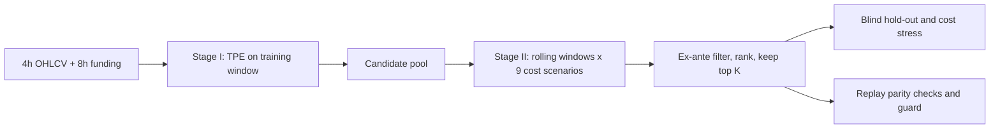

## Abstract

Backtests of crypto perpetual futures are easy to inflate: same-bar fills, funding payments that are ignored or misaligned, fee-only cost models, and repeated reuse of one evaluation window all push results upward. AutoQuant does not propose a new signal. It fixes the evaluation rules as enforceable system policy (next-bar execution, funding visible only when it was visible, fees plus slippage plus funding, leverage caps), runs a Bayesian hyperparameter search under those rules, and then re-scores the candidate pool across rolling windows and a grid of cost mis-specifications before picking a "stable" configuration. Every step writes deterministic ledgers that must reconcile. On BTC/USDT, with replications on ETH, SOL and AVAX, fee-only and zero-cost backtests clearly overstate returns, and two-stage screening tends to pick lower-drawdown, lower-return configurations rather than better ones. Its own overfitting diagnostics stay uncomfortable, arguably the most useful result.

**Keywords:** backtest realism, perpetual futures, funding rate, TPE, robustness screening, probability of backtest overfitting, auditability

## 1 Introduction

A perpetual future has no expiry; periodic funding payments between longs and shorts tie it to spot. P&L therefore depends on fees, slippage, funding and leverage limits, each of which can be mis-modelled in ways that flatter a backtest.

The paper argues that general-purpose frameworks (Backtrader, Zipline, Freqtrade, FinRL) leave these choices to user discipline: next-bar execution is configurable rather than enforced, funding is mostly absent, and parameter search is decoupled from realistic costs. The literature, it adds, is alpha-centric: much work on signals, little on how a signal family becomes a vetted configuration.

The research question is deliberately narrow: <mark>under a strict 4-hour protocol, does execution-aware, double-screened selection reduce the inflation and fragility produced by one-stage tuning with simplified costs?</mark> The expert-system framing (rules as knowledge base, search-and-screen as inference engine) is mostly positioning.

## 2 Background

**TPE.** The Tree-structured Parzen Estimator, used through Optuna, handles mixed and conditional search spaces; the paper treats it as swappable.

**Selection bias.** Reporting the best of many configurations inflates performance even when each backtest is correct. The deflated Sharpe ratio (DSR) discounts for the number of trials; the probability of backtest overfitting (PBO), estimated by combinatorially symmetric cross-validation, measures how often the in-sample winner lands below the median out of sample.

## 3 Method

> **Key idea.** Treat execution timing, funding visibility, costs and screening thresholds as fixed, inspectable rules shared by every evaluation, then separate *searching* (Stage I, one window, one objective) from *accepting* (Stage II, several windows and cost scenarios, ex-ante thresholds). Nothing is re-optimized after Stage I.

### 3.1 Signal family and search space

The alpha model is a black box $f: I_t \times \Theta \to S_t \in \{-1,0,1\}$. In the case study its core is an EMA-spread momentum score squashed into $[0,1]$,

$$
m_t = \tfrac12\left[1 + \tanh\!\left(\frac{\mathrm{EMA}_{\text{fast},t} - \mathrm{EMA}_{\text{slow},t}}{\sigma\,\mathrm{EMA}_{\text{slow},t}}\right)\right], \tag{1}
$$

with $\sigma$ a volatility-scaling parameter, blended with an auxiliary mean-reversion/breakout channel and thresholded into long, short or flat. The auxiliary channel is not specified in the text. $\Theta$ covers EMA spans, Bollinger settings, holding and cooldown times, ATR stops, an exposure cap, and two funding parameters that raise the long-entry threshold when carry is expensive:

$$
\tau_{\text{long}}(t) = \tau_{\text{base}} + \kappa \cdot \max\!\big(|fr_t| - \vartheta_{\text{bias}}/10000,\ 0\big), \tag{2}
$$

where $fr_t$ is the 8-hour funding rate carried forward on the 4-hour grid, $\vartheta_{\text{bias}}$ an activation level in basis points, and $\kappa$ the slope.

### 3.2 STRICT4H accounting

A signal computed at the close of bar $t-1$ sets the exposure $\pi_t$ held during bar $t$; same-bar execution is impossible by construction. With close-to-close market return $r^{\text{mkt}}_t$,

$$
r^{\text{net}}_t = \pi_t\, r^{\text{mkt}}_t - C_{\text{fee},t} - C_{\text{slip},t} - C_{\text{fund},t}. \tag{3}
$$

Fees and slippage scale with turnover $|\pi_t - \pi_{t-1}|$; funding accrues on $\pi_t$ using only rates already published. The decomposition is logged per bar and must reconcile between the backtest engine and a live-style replay wrapper.

### 3.3 Stage I: search

TPE maximizes annualized net return on the training window only:

$$
J(\theta) = r_{\text{ann}}(\theta) = (1 + R_{\text{tot}})^{AF/N} - 1, \tag{4}
$$

with $R_{\text{tot}}$ the compounded return over $N$ bars and $AF = 2190$ four-hour bars per year. Risk preferences are kept out of the objective on purpose and imposed in Stage II. The stated BTC budget is $N_{\text{opt}} = 40$ trials.

### 3.4 Stage II: double screening

Each candidate is re-run, unchanged, over rolling 2,000-bar windows stepped by 500 bars, under nine cost scenarios (taker fee in {3, 4, 6} bps times funding multiplier in {0.5, 1.0, 1.5}). Per scenario $s$, calendar-month returns $R_{m,s}$ are summarized by the monthly geometric mean

$$
g_s = \exp\!\Big(\tfrac1M \sum_m \log(1 + R_{m,s})\Big) - 1. \tag{5}
$$

A candidate passes if mean $g_s \ge 0.005$, worst-scenario $g_s \ge 0$, mean max drawdown $\le 0.30$, and mean switch density (share of bars with an exposure change) $\le 0.12$. Survivors are sorted by return then drawdown and the top $K=5$ kept. <mark>The thresholds are declared before the hold-out is touched and are presented as policy, not as learned quantities.</mark>

## 4 Experiments

**Setup.** Four-hour bars and 8-hour funding for BTC/USDT from 2019-09-08 to 2025-10-14. Training runs to 2021-01-01, validation to 2023-01-01, calendar 2023 is left unused, and 2024-01-01 onward is a blind hold-out. ETH, SOL and AVAX use shorter mirrored splits. Small account, linear costs, no market impact.

**One-stage vs two-stage (BTC/USDT).** Monthly geometric net return in decimal units.

| Method | Window | Monthly geom | Sharpe | MaxDD | Trades |
|---|---|---|---|---|---|
| One-stage | Training | 0.222 | 3.164 | 0.283 | 548 |
| Two-stage | Training | 0.145 | 2.388 | 0.265 | 485 |
| Buy-hold | Training | 0.067 | 1.530 | 0.563 | — |
| One-stage | Validation | 0.051 | 1.238 | 0.318 | 423 |
| Two-stage | Validation | 0.038 | 1.070 | 0.231 | 348 |
| Buy-hold | Validation | -0.024 | 0.005 | 0.771 | — |
| One-stage | Post-2024 | 0.023 | 0.845 | 0.220 | 259 |
| Two-stage | Post-2024 | 0.016 | 0.664 | 0.196 | 223 |
| **Buy-hold** | **Post-2024** | **0.048** | **1.405** | **0.307** | — |

Bold marks the best return and Sharpe on the blind window. <mark>The screened configuration earns less than the naive top-1 in every window and less than buy-and-hold on the hold-out; what it buys is a shallower drawdown and fewer trades.</mark> A moving-block bootstrap on validation months puts the two-stage minus one-stage difference at -0.016 with a 95% interval of [-0.040, 0.008], so the two are not statistically distinguishable.

**Cost ladder.** One fixed configuration on the 2019–2021 core sample:

| Variant | CAGR (dec.) | Sharpe | MaxDD | Trades |
|---|---|---|---|---|
| Rigorous (fees + slippage + funding) | 2.726 | 2.049 | 0.265 | 636 |
| Standard (fee-only) | 4.308 | 2.506 | 0.262 | 636 |
| Naive (zero-cost) | 5.225 | 2.711 | 0.260 | 535 |

<mark>Dropping slippage and funding alone lifts annualized return from 2.726 to 4.308</mark>; the paper reads these magnitudes as a sensitivity diagnostic, not as attainable profit.

**Replications.** On ETH the pattern repeats with a large turnover gap (852 versus 3,880 hold-out trades). On AVAX the one-stage pick shows drawdowns of 0.61 to 0.80 against 0.06 to 0.14 for the screened pick. SOL is the exception, where the screened candidate is also better on validation return. A bar chart of the frozen baseline by window is [Fig. 2 in the paper](https://arxiv.org/pdf/2512.22476#page=28), and the workflow diagram is [Fig. 1](https://arxiv.org/pdf/2512.22476#page=7).

**Optimizer benchmark.** With 60 evaluations each, GP-based Bayesian optimization finds the best training objective (0.2184 versus 0.1870 for TPE), yet <mark>the best training candidate of all five optimizers records a validation drawdown of 1.000, and none of the top-20 pool passes Stage II even under relaxed thresholds.</mark>

**Overfitting diagnostics.** <mark>PBO on the top-40 Stage I pool is 0.586</mark> (8 segments, 70 splits), and a DSR-style check with 360 to 3,240 effective trials also signals non-negligible search risk.

## 5 Discussion

**Strengths.** The paper is unusually candid. It reports that its own selection step lowers returns, that the bootstrap interval spans zero, that PBO exceeds one half, and that a frozen "baseline" configuration loses 24.09% a year over the long window with a 0.95 drawdown. Separating a return-only search objective from an explicit acceptance policy is clean design, enforcing next-bar execution and funding visibility in the engine is the right place for them, and the reconciled per-bar ledger is worth copying.

**Weaknesses.** The central empirical claim is weak by the paper's own numbers: screening yields a different risk profile, not demonstrably better out-of-sample results. The threshold scan shows the selected trial flipping among three IDs as only the drawdown cap moves from 0.25 to 0.35, with validation CAGR ranging from 0.332 to 1.058, so "stable candidate" depends heavily on policy. The validation window is reused inside Stage II, leaving a single blind window per asset as genuine out-of-sample evidence. The funding-aware gating, a headline rule, is near-neutral: 0.218 versus 0.219 monthly return with it disabled, and a median effect of zero in the module ablation.

There are also bookkeeping ambiguities. The case study states 40 Stage I trials, yet the sensitivity scan selects trial IDs up to 108, which suggests (my inference) that the 120-trial budget was used there. Random search scoring exactly -1.0000 at small budgets, with invalid-trial rates of 28% to 67%, implies a largely infeasible search space, so the optimizer comparison partly measures constraint handling. The replay parity evidence is on SOL/USDT one-hour bars, not the 4-hour anchor.

**Not shown.** No live or paper-trading record, no market-impact model, no full signal specification, and no comparison with simple alternatives such as walk-forward re-optimization.

## 6 Takeaways

- In perpetuals, slippage and funding are first-order: a fee-only backtest overstated annualized return by more than half in the paper's ladder.
- Splitting "search" from "accept", with thresholds fixed in advance and logged, makes selection auditable; it does not make it correct. Here it traded return for drawdown with no significant edge.
- Report PBO and a bootstrap interval alongside any tuned strategy. A PBO of 0.586 after all this care is a sober reference point.
- Threshold policies are hyperparameters too; scan them.
- For generative modeling of financial series, the relevance is indirect: the binding constraint in this study is a handful of non-overlapping evaluation windows, which is where realistic synthetic paths could help, but for perpetuals a simulator would have to produce funding jointly with price and be scored under this kind of strict cost accounting. The paper contains no generative or stochastic modeling.

## References

1. K. Deng. *AutoQuant: An Auditable Expert-System Framework for Execution-Constrained Auto-Tuning in Cryptocurrency Perpetual Futures.* arXiv:2512.22476, 2025.
2. J. Bergstra, R. Bardenet, Y. Bengio, and B. Kégl. *Algorithms for Hyper-Parameter Optimization.* NeurIPS, 2011.
3. T. Akiba, S. Sano, T. Yanase, T. Ohta, and M. Koyama. *Optuna: A Next-generation Hyperparameter Optimization Framework.* KDD, 2019.
4. D. H. Bailey and M. López de Prado. *The Deflated Sharpe Ratio.* Journal of Portfolio Management, 2014.
5. D. H. Bailey, J. M. Borwein, M. López de Prado, and Q. J. Zhu. *The Probability of Backtest Overfitting.* Journal of Computational Finance, 2017.
