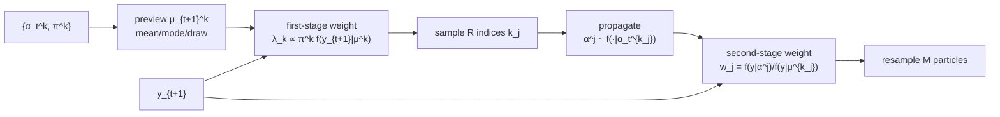

> **Which version this review reads.** The downloadable text is the Nuffield College working paper of 22 October 1997, which is substantially longer than the published *Journal of the American Statistical Association* article (94(446):590-599, 1999) — it carries the fixed-lag filtering, stratification, on-line Bayesian and simulated-maximum-likelihood material that the journal version compresses or drops. All numbers, tables and quotations below are from the working paper.

## Abstract

The [bootstrap filter](/blog/bootstrap-filter/) proposes each particle from the transition density and only afterwards asks whether the new observation likes it. When the observation is surprising — an outlier, or simply a sharply peaked measurement density — almost every proposal lands where the likelihood is negligible, and the resampling step keeps a handful of survivors. Pitt and Shephard diagnose this as *two* distinct failures and attack them separately. The first is a sampling failure: the discrete mixture $\hat f(\alpha_{t+1}\mid Y_t)=\sum_k f(\alpha_{t+1}\mid\alpha_t^k)\pi_t^k$ is not the problem, drawing from the posterior proportional to $f(y_{t+1}\mid\alpha_{t+1})$ times it is. Their fix is to carry the mixture index $k$ as an *auxiliary variable*, sample the pair $(\alpha_{t+1},k)$, and pre-weight each index by $f(y_{t+1}\mid\mu_{t+1}^k)$ where $\mu_{t+1}^k$ is a likely value of $\alpha_{t+1}$ given $\alpha_t^k$ — so particles are selected *before* propagation, in proportion to how well they are expected to explain the observation. The second is an approximation failure: the mixture's tails misrepresent the true prediction density's tails no matter how many particles you draw, which no amount of clever sampling can fix, and which they attack with fixed-lag filtering. On a deliberately brutal 20-standard-deviation outlier the auxiliary filter removes about an order of magnitude of the bias at equal cost; on 946 daily Sterling/Dollar returns it delivers on-line Bayesian estimates of a stochastic volatility model close to a million-iteration MCMC run.

**Keywords:** auxiliary particle filter, adaption, first- and second-stage weights, outlier robustness, stochastic volatility, on-line Bayesian estimation

## 1 Introduction

The model is a state-space one in the econometric idiom: observations $y_t$ conditionally independent given an unobserved Markov state $\alpha_t$, with parametric measurement density $f(y_t\mid\alpha_t)$ and transition density $f(\alpha_{t+1}\mid\alpha_t)$, and the recursion

$$
f(\alpha_{t+1}\mid Y_t)=\int f(\alpha_{t+1}\mid\alpha_t)\,dF(\alpha_t\mid Y_t),
\qquad
f(\alpha_{t+1}\mid Y_{t+1})=\frac{f(y_{t+1}\mid\alpha_{t+1})f(\alpha_{t+1}\mid Y_t)}{f(y_{t+1}\mid Y_t)}. \tag{1}
$$

A sentence in §1 sets the whole design constraint and is worth marking: *the most basic of the methods developed in this paper will only require that we can simulate from $f(\alpha_{t+1}\mid\alpha_t)$ and evaluate $f(y_t\mid\alpha_t)$. If we can evaluate $f(\alpha_{t+1}\mid\alpha_t)$ then this knowledge can be used to improve the efficiency of the procedures.* The method degrades gracefully: with only the bootstrap requirements you get the basic auxiliary filter; with an evaluable transition density you can adapt further; with conjugacy you can adapt fully.

The history in §1 is worth having because this algorithm was invented several times: Gordon, Salmond and Smith (1993); independently by Kitagawa (1996) with smoothing extensions; *it reappears and is then discarded by Berzuini, Best, Gilks and Larizza (1997)*; and again by Isard and Blake (1996) *under the name of the "condensation" algorithm*, with related ideas in Liu and Chen. *The idea of calling this class of algorithm 'particle filters' is due to Carpenter, Clifford, and Fearnhead (1997), although the use of the phrase 'particles' appears in Kitagawa (1996).*

Why this paper matters for the series and for finance in particular: it is where the *proposal* becomes a design variable. The bootstrap filter has exactly one knob, $N$. After this paper a particle filter has a proposal, an adaption strategy, and a stratification scheme, and the model class it can handle in practice widens from tracking problems to stochastic volatility — which is the case study here, on a real exchange-rate series, benchmarked against MCMC.

## 2 Prior work: what is wrong with SIR

### 2.1 The particle filter, stated precisely

A particle filter approximates $\alpha_t\mid Y_t$ by points $\alpha_t^1,\dots,\alpha_t^M$ with masses $\pi_t^1,\dots,\pi_t^M$. The framing is a bootstrap one: *particle filters treat the discrete support generated by the particles as the true filtering density (this is similar to the bootstrap which treats the empirical distribution function as the true data generation process).* Then the **empirical prediction density** is the $M$-component mixture

$$
\hat f(\alpha_{t+1}\mid Y_t)=\sum_{j=1}^{M}f(\alpha_{t+1}\mid\alpha_t^j)\,\pi_t^j, \tag{2}
$$

and the **empirical filtering density** is

$$
\hat f(\alpha_{t+1}\mid Y_{t+1})\propto f(y_{t+1}\mid\alpha_{t+1})\sum_{j=1}^{M}f(\alpha_{t+1}\mid\alpha_t^j)\pi_t^j. \tag{3}
$$

A crisp definition follows: *we will call a particle filter 'exact' if it produces independent and identically distributed samples from the empirical filtering density.* Note carefully what this separates. $M$ controls how well (2) approximates the truth. The sampling method controls how well you draw from (3) *given* (2). These are different errors and the paper's whole structure is built on keeping them apart.

Three uses are listed, and the third is underappreciated. Besides tracking and estimating $f(y_{t+1}\mid Y_t)$ for a prediction-decomposition likelihood, the filter gives

$$
\widehat{\Pr}(y_{t+1}\le y^{\mathrm{obs}}_{t+1}\mid Y_t)=\sum_{j=1}^{M}\left\{\frac1K\sum_{k=1}^{K}\Pr\bigl(y_{t+1}\le y^{\mathrm{obs}}_{t+1}\mid\alpha_{t+1}^{j,k}\bigr)\right\}\pi_t^j, \tag{4}
$$

with $\alpha^{j,k}_{t+1}\sim\alpha_{t+1}\mid\alpha_t^j$. By Rosenblatt's theorem these should be i.i.d. uniform on $(0,1)$ if the model is right, *allowing the development of a whole portfolio of exact diagnostic tests via the routine application of Monte Carlo test*. A particle filter comes with a free, exact, model-specification check — the probability integral transform — and this is the paper that says so in the SMC context.

### 2.2 Why SIR breaks

Following Liu, if $h$ does not vary quickly with $\alpha$ the variance of the self-normalised importance sampler is approximately proportional to

$$
\frac{1+\operatorname{var}_f\{\pi(\alpha)\}}{R}=\frac{\mathbb{E}_f\{\pi(\alpha)^2\}}{R},
\qquad \pi(\alpha)=\frac{f(y\mid\alpha)}{f(y)}. \tag{5}
$$

*Hence the SIR method will become very imprecise when the $\pi_j$ become very variable. This will happen if the likelihood is highly peaked compared to the prior.*

They then compute it exactly for $\alpha\sim\mathcal{N}(0,1)$, $y\mid\alpha\sim\mathcal{N}(\alpha,\sigma^2)$, using the non-central chi-squared moment generating function:

$$
\mathbb{E}\bigl\{\pi(\alpha)^2\bigr\}
=\frac{1+\sigma^{-2}}{\bigl(1+2\sigma^{-2}\bigr)^{1/2}}
\exp\left\{\frac{2y^2}{(\sigma^2+2)(\sigma^2+1)}\right\}. \tag{6}
$$

Two failure directions, both explicit: the variance *increases exponentially in $y^2$*, and it *increases without bound as $\sigma^2\to0$*. Then the appropriately calibrated conclusion — *for many problems the prior will be much more spread out than the likelihood and so the second of these problems should not be typically important. However, the sensitivity to aberrant observations will be important.* Peaked likelihoods are rare in practice; outliers are not.

### 2.3 Two weaknesses, not one

This is the paper's real organising contribution and it is easy to lose.

**Weakness 1 — sampling.** With an outlier the weights are grossly uneven and $R$ must be enormous. *Notice this is not a problem of having too small a value of $M$. That parameter controls the accuracy of (2). Instead, the difficulty is, given that degree of accuracy, how to efficiently sample from (3)?* This is fixable and §3 fixes it.

**Weakness 2 — approximation.** *The tails of (2) usually only poorly approximate the true tails of $\alpha_{t+1}\mid Y_t$ due to the use of the mixture approximation. As a result (3) can only ever poorly approximate the true $f(\alpha_{t+1}\mid Y_{t+1})$ when there is an outlier.* No sampling scheme can repair this, because the object being sampled from is itself wrong where it matters. §4's fixed-lag filter *partially* deals with it; the conclusion admits *it still cannot deal with some problems*.

That a method paper distinguishes "my Monte Carlo is inefficient" from "the thing my Monte Carlo targets is wrong in the tail", and reports partial success on the second, is unusual and is why this paper aged well.

### 2.4 The stress test

$$
y_t=\alpha_t+\varepsilon_t,\ \varepsilon_t\sim\mathrm{NID}(0,1);
\qquad
\alpha_{t+1}=\phi\alpha_t+\eta_t,\ \eta_t\sim\mathrm{NID}(0,\sigma^2),
$$

with $\phi=0.9$, $\sigma^2=0.01$, initialised from the stationary prior, $n=6$, and the series fixed at

$$
y=(-0.65201,\,-0.34482,\,-0.67626,\,1.1423,\,0.72085,\,\mathbf{20.000})^{\!\top}.
$$

*The last observation is around twenty standard deviations away from that predicted by the model.* Because the model is linear-Gaussian, the Kalman filter gives the exact answer, $\mathbb{E}(\alpha_6\mid Y_6)=0.90743$ — a rare luxury: an exactly known truth for a problem designed to break the method. Note the tiny state noise $\sigma^2=0.01$ against measurement noise 1, which is the regime where the prior is *tight* and the likelihood pulls hard.

## 3 Method

> **Key idea.** Choose which particle to propagate *before* you propagate it, using a cheap preview of where it would land. Formally: make the mixture index a random variable, sample the pair, and put the observation into the index's distribution instead of leaving it to the post-hoc weights.

### 3.1 The auxiliary variable

Target the joint density of the state and the mixture index:

$$
f(\alpha_{t+1},k\mid Y_{t+1})\propto f(y_{t+1}\mid\alpha_{t+1})\,f(\alpha_{t+1}\mid\alpha_t^k)\,\pi^k,\qquad k=1,\dots,M. \tag{7}
$$

Sample the pair and discard $k$, and what remains is a draw from (3). *We call $k$ an auxiliary variable as it is present simply to aid the task of the simulation.* Nothing has been approximated yet — (7) is exact, and the auxiliary variable is pure bookkeeping. The approximation comes next, and it is a single, isolated one.

### 3.2 First- and second-stage weights

Replace the intractable $f(y_{t+1}\mid\alpha_{t+1})$ inside the index's marginal with a preview evaluated at a point summary:

$$
g(\alpha_{t+1},k\mid Y_{t+1})\propto f(y_{t+1}\mid\mu_{t+1}^k)\,f(\alpha_{t+1}\mid\alpha_t^k)\,\pi^k, \tag{8}
$$

where $\mu_{t+1}^k$ is *the mean, the mode, a draw, or some other likely value* of $\alpha_{t+1}\mid\alpha_t^k$. The form is chosen precisely so that the index marginalises in closed form:

$$
g(k\mid Y_{t+1})\propto\pi^k\int f(y_{t+1}\mid\mu_{t+1}^k)\,dF(\alpha_{t+1}\mid\alpha_t^k)=\pi^kf(y_{t+1}\mid\mu_{t+1}^k)\ \equiv\ \lambda_k, \tag{9}
$$

because $f(y_{t+1}\mid\mu^k_{t+1})$ does not depend on $\alpha_{t+1}$ and comes out of the integral. These are the **first-stage weights**. Sample $k$ with probability $\propto\lambda_k$, then draw $\alpha_{t+1}\sim f(\cdot\mid\alpha_t^k)$. *The implication is that we will simulate from particles which are associated with large predictive likelihoods.*

Correct for the approximation with the **second-stage weights**:

$$
w_j=\frac{f(y_{t+1}\mid\alpha_{t+1}^j)}{f(y_{t+1}\mid\mu_{t+1}^{k_j})},
\qquad
\pi_j=\frac{w_j}{\sum_{i=1}^Rw_i}. \tag{10}
$$

*The hope is that these second stage weights are much less variable than for the original SIR method* — and the hope is well-founded exactly when $f(y_{t+1}\mid\mu^k)$ is a good stand-in for $f(y_{t+1}\mid\alpha_{t+1})$, i.e. when the transition density is tight relative to the curvature of the likelihood.

**Requirements and cost.** The basic version *requires only the ability to propagate and evaluate the likelihood, just as the original SIR suggestion* — no new assumptions. *In practice, it runs slightly less quickly than the Gordon, Salmond, and Smith (1993) suggestion as we need to evaluate $g(k\mid Y_{t+1})$ and to perform two weighted bootstraps rather than one weighted and one unweighted bootstrap. However, the gains in sampling will usually dominate these small effects.*

### 3.3 When the auxiliary version actually wins

The efficiency comparison is done properly. Define

$$
f_k=\int\left\{\frac{f(y_{t+1}\mid\alpha_{t+1})}{f(y_{t+1}\mid\mu_{t+1}^k)}\right\}^2dF(\alpha_{t+1}\mid\alpha_t^k),
\qquad
f_k^*=\int\left\{\frac{f(y_{t+1}\mid\alpha_{t+1})}{f(y_{t+1}\mid\mu_{t+1}^k)}\right\}dF(\alpha_{t+1}\mid\alpha_t^k),
$$

so that (with $\pi^k=1/M$) standard SIR has $\mathbb{E}\{\pi(\alpha)^2\}=M\sum_k\lambda_k^2f_k\big/\bigl(\sum_k\lambda_kf_k^*\bigr)^2$ while the auxiliary version has $\sum_k\lambda_kf_k\big/\bigl(\sum_k\lambda_kf_k^*\bigr)^2$. The auxiliary filter wins iff

$$
\sum_{k=1}^{M}\lambda_kf_k<M\sum_{k=1}^{M}\lambda_k^2f_k. \tag{11}
$$

*If $f_k$ does not vary over $k$ then the auxiliary variable particle filter will be more efficient*, because $\sum_k\lambda_k/M=1/M\le\sum_k\lambda_k^2$ by Cauchy–Schwarz, with equality only when all $\lambda_k$ are equal. And the condition under which $f_k$ is nearly constant is stated: *$f(\alpha_{t+1}\mid\alpha_t^k)$ will be typically quite tightly peaked (much more tightly peaked than $f(\alpha_{t+1}\mid Y_t)$) compared to the conditional likelihood.*

**This is a conditional result, and it is the honest form of the claim.** The APF is not unconditionally better. It is better when the transition density is tight enough that a point preview of where a particle will land is informative. In a model with large process noise relative to the observation's information, $\mu^k_{t+1}$ says little about $\alpha^j_{t+1}$, $f_k$ varies a lot, and (11) can fail.

### 3.4 Rejection and MCMC variants, and full adaption

**Rejection.** Draw $k$ with probability $\pi^k$, propose $\alpha_{t+1}\sim f(\cdot\mid\alpha_t^k)$, accept with probability $f(y_{t+1}\mid\alpha_{t+1})/f(y_{t+1}\mid\alpha_{t+1,\max})$. Exact for any $M$, but needs the likelihood's maximiser and *is likely to perform quite poorly for some problems as this ratio can be very small*.

**MCMC.** With a proposal $g(\alpha_{t+1},k\mid Y_{t+1})\propto g(k\mid Y_{t+1})f(\alpha_{t+1}\mid\alpha_t^k)$ the Metropolis ratio collapses to

$$
\min\left\{1,\ \frac{f(y_{t+1}\mid\alpha_{t+1}^{(i+1)})}{f(y_{t+1}\mid\mu_{t+1}^{k^{(i+1)}})}\Big/\frac{f(y_{t+1}\mid\alpha_{t+1}^{(i)})}{f(y_{t+1}\mid\mu_{t+1}^{k^{(i)}})}\right\}, \tag{12}
$$

*which is extremely convenient as it involves just the evaluation of the measurement density. Hence this approach is particularly useful when it is not possible to evaluate the transition density.*

**Full adaption.** For a nonlinear Gaussian transition $\alpha_{t+1}\mid\alpha_t\sim\mathcal{N}(\mu(\alpha_t),\sigma^2(\alpha_t))$ with $y_{t+1}\mid\alpha_{t+1}\sim\mathcal{N}(\alpha_{t+1},1)$, the measurement density absorbs into the transition:

$$
f(\alpha_{t+1},k\mid Y_{t+1})\propto g_k(y_{t+1})\,f(\alpha_{t+1}\mid\alpha_t^k,y_{t+1}),
\qquad
\sigma_{p,k}^{-2}=1+\sigma^{-2}(\alpha_t^k),
\quad
\mu_{p,k}=\sigma_{p,k}^2\left\{\frac{\mu(\alpha_t^k)}{\sigma^2(\alpha_t^k)}+y_{t+1}\right\},
$$

with first-stage weights $g_k(y_{t+1})\propto\exp\{\mu_{p,k}^2/2\sigma_{p,k}^2-\mu(\alpha_t^k)^2/2\sigma^2(\alpha_t^k)\}$. Then **the second-stage weights are all equal**, the second bootstrap is unnecessary, and one takes $R=M$: *the auxiliary particle filter has been fully adapted to the problem.* This is the locally optimal proposal, reached constructively. The Gaussian ARCH-with-noise model $y_t\mid\alpha_t\sim\mathcal{N}(\alpha_t,\sigma^2)$, $\alpha_{t+1}\mid\alpha_t\sim\mathcal{N}(0,\beta_0+\beta_1\alpha_t^2)$ is *exactly adaptable*, and the paper notes that *as far as we know no likelihood methods exist in the literature for the analysis of this type of model*.

### 3.5 Fixed-lag filtering — the attack on weakness 2

Propagate $p$ steps from the chosen index and reweight by the product of $p$ measurement-density ratios,

$$
\frac{f(y_{t+p}\mid\alpha_{t+p}^j)\cdots f(y_{t+1}\mid\alpha_{t+1}^j)}{f(y_{t+p}\mid\mu_{t+p}^{k_j})\cdots f(y_{t+1}\mid\mu_{t+1}^{k_j})}.
$$

The three costs are listed rather than hidden: storing $p$ sets of observations and $p\times M$ mixture components; *each auxiliary variable draw now involves $3p$ density evaluations and the generation of $p$ simulated propagation steps*; and *the auxiliary variable method is based on approximating the true density of $f(k,\alpha_{t-p+1},\dots,\alpha_t\mid Y_t)$, and this approximation is likely to deteriorate as $p$ increases.*

### 3.6 Algorithm

```text
ONE STEP OF THE AUXILIARY PARTICLE FILTER
  # ---- stage 1: pre-select indices using a preview of where each particle would land
  for k = 1..M:
      mu[k]     = mean / mode / a draw from f(alpha_{t+1} | alpha_t[k])
      lambda[k] = pi[k] * f(y_{t+1} | mu[k])                 # first-stage weight
  lambda = lambda / sum(lambda)
  draw k_1..k_R from {1..M} with probabilities lambda        # FIRST weighted bootstrap

  # ---- stage 2: propagate the selected particles and correct the preview
  for j = 1..R:
      a[j] = draw from f(alpha_{t+1} | alpha_t[k_j])
      w[j] = f(y_{t+1} | a[j]) / f(y_{t+1} | mu[k_j])        # second-stage weight
  w = w / sum(w)
  resample M particles from {a[j]} with probabilities w      # SECOND weighted bootstrap

  # compare: the bootstrap filter draws k uniformly at stage 1 and weights by f(y|a) at stage 2.
  # FULL ADAPTION (conjugate case): w[j] is constant, so the second bootstrap vanishes; set R = M.
```



## 4 Implementation notes

- **$R$ and $M$ are separate.** $R$ proposals are drawn and $M$ particles retained, with $R\gg M$ in the difficult experiments. The bootstrap filter conflates them.
- **An $O(R)$ multinomial sampler** is given in the appendix, following Carpenter, Clifford and Fearnhead: generate *ordered* uniforms by $u_{(R-1)}=u_{R-1}^{1/R}$ and $u_{(k)}=u_{(k+1)}u_k^{1/(k+1)}$ downwards, *most easily carried out in logarithms*, then walk the cumulative weights once. Linear time, one pass, no sorting.
- **Common random numbers and sorting** are used across strata in the on-line estimation experiments.
- **Diffuse priors are not allowed.** In the SV application the diffuse prior on $\log\beta$ is replaced by $\mathcal{N}(0,10)$ *as particle filters cannot deal with diffuse conditions* — a blunt and correct statement of a real restriction.
- Computations in Ox.

## 5 Experiments

### 5.1 The outlier, quantified

125 independent replications on the fixed six-observation series, all with $\pi^j=1/M$. Reported are mean estimates of $\mathbb{E}(\alpha_6\mid Y_6)$; the exact value from the Kalman filter is **0.90743**. So the table is a *bias* table and lower is worse.

| | Particle $M{=}1{,}000$ | $10{,}000$ | $50{,}000$ | Auxiliary $M{=}1{,}000$ | $10{,}000$ | $50{,}000$ |
|---|---|---|---|---|---|---|
| $R=50$ | .43523 | .42183 | .43504 | .52630 | .54516 | .54920 |
| $R=250$ | .55188 | .55829 | .55579 | .65437 | .65274 | .66682 |
| $R=2{,}000$ | .65164 | .65384 | .66269 | .71899 | .77279 | .76714 |
| $R=10{,}000$ | .71235 | .73396 | .73382 | .72653 | .79637 | .82569 |
| $R=25{,}000$ | .73433 | .77206 | .76071 | .73043 | .81076 | .83324 |
| $R=100{,}000$ | .73083 | .79238 | .81929 | .74424 | .81975 | **.85721** |

What the table shows, in order of importance.

1. **The plain filter is catastrophically biased**, reaching only 0.82 of the true 0.907 at $M=50{,}000$, $R=100{,}000$. *The SIR based particle filter grossly underestimates the values of the states even when $M$ and $R$ are very large.*
2. **The auxiliary filter is uniformly better** at every one of the eighteen cells, and *for the same value of $R$, [the] auxiliary algorithm is an order of magnitude more efficient than SIR for outlier problems*.
3. **Neither is close to right.** The best auxiliary number is 0.857 against 0.907 — a residual bias of about 5.5%. That gap is weakness 2: the mixture's tails, not the sampling. The paper does not oversell this, and the fixed-lag section exists because of it.
4. **$M$ barely matters for the plain filter at small $R$** (.435 / .422 / .435 at $R=50$), confirming the §2.3 diagnosis that the problem is the sampling from (3), not the accuracy of (2).

**Fixed lag** (Table 2, $p=2$ and $p=3$, same design). The auxiliary version improves further — at $p=3$, $M=50{,}000$, $R=400{,}000$ it reaches 0.8946 — while *a fall in the efficiency of SIR based particle filters as $p$ increases due to the poor sampling behaviour of the algorithm* is visible. The summary claim: *the fixed lag auxiliary filter is now 50 to 500 times as efficient, in terms of reducing the bias, as the plain particle filter for the $p=3$ case.*

**On the design.** A 20-sigma outlier with $\sigma^2_\eta=0.01$ against measurement variance 1 is an adversarial setting, chosen to make the point rather than to represent typical practice, and the paper says as much in §2.3 (*for many problems the prior will be much more spread out than the likelihood*). What makes it a good experiment anyway is that the truth is known exactly, the comparison is at matched $(M,R)$, and it is averaged over 125 replications.

### 5.2 Stochastic volatility on Sterling/Dollar

Weekday log-differences of the Pound Sterling/US Dollar rate, 1 October 1981 to 28 June 1985, $n=946$ — the series of Harvey, Ruiz and Shephard and of Kim, Shephard and Chib, so the benchmark is a real one.

**The MCMC benchmark** (Kim–Shephard–Chib single-move Gibbs sampler, **1,000,000 iterations** with the first 50,000 discarded):

| | Posterior mean | MC s.e. | Inefficiency |
|---|---|---|---|
| $\phi\mid y$ | 0.97762 | 0.00013754 | 163.55 |
| $\sigma_\eta\mid y$ | 0.15820 | 0.00063273 | 386.80 |
| $\beta\mid y$ | 0.64884 | 0.00036464 | 12.764 |

with priors $\phi\sim2\,\mathrm{Beta}(20,1.5)-1$, $\sigma_\eta^2\sim0.01\times5/\chi_5^2$, and $\log\beta$ given a $\mathcal{N}(0,10)$ prior in place of the diffuse one. "Inefficiency" is the factor by which the sampler is worse than a hypothetical i.i.d. sampler using the same computer time — so the single-move Gibbs sampler needs of order 160–390 iterations per effective draw for $\phi$ and $\sigma_\eta$.

**On-line particle estimates**, using SIR with stratification over 840 parameter values, $R=1785$ and $M=892$ within each stratum:

| | Posterior mean | MC s.e. | Inefficiency |
|---|---|---|---|
| $\phi\mid y$ | 0.97466 | 0.00169 | 32.4 |
| $\sigma_\eta\mid y$ | 0.15988 | 0.00467 | 22.1 |

*The results are very slightly different from* the MCMC table — 0.97466 against 0.97762 for $\phi$, 0.15988 against 0.15820 for $\sigma_\eta$, differences of roughly two and 0.4 MCMC standard errors respectively. The inefficiency factors are an order of magnitude *smaller* than MCMC's, although the two are not measuring the same thing and no wall-clock comparison is given.

**The number to notice, which the paper reports in one clause and does not dwell on:** the parameter support starts at 840 distinct values and *at the end of the sample we have 216 remaining points of support*. Three quarters of the parameter particles have been resampled away over 946 steps. That is parameter degeneracy — the well-known failure of naive particle-based parameter learning, since the parameter never moves and can only be pruned — and it is visible here in 1997. The on-line posterior is being reported from 216 atoms. Reporting the count is honest; treating the resulting quantiles as a posterior is optimistic.

Also worth noting: this application deliberately uses *the simplest of particle filters based on a SIR algorithm*, with the remark that *the simulation efficiency of this procedure could be very significantly improved by using the auxiliary variables rejection algorithm which is available for the SV model*. So the flagship applied result does not use the paper's own method.

## 6 Limitations

**Stated by the authors.**

- Two weaknesses, one solved and one only reduced: *we believe we have largely solved the first problem and have reduced the order of magnitude of the second*, and the conclusion repeats that fixed-lag filtering *still cannot deal with some problems*.
- The auxiliary filter is slightly slower per step (two weighted bootstraps rather than one weighted and one unweighted).
- Fixed-lag costs memory, $3p$ density evaluations per draw, and an approximation that *deteriorates as $p$ increases*.
- Rejection sampling *is likely to perform quite poorly for some problems as this ratio can be very small*.
- Particle filters *cannot deal with diffuse conditions*.
- Adaption is not always available and *comes at quite a considerable cost* when it requires evaluating the $M$-component mixture density.

**My reading.**

- **The efficiency gain is conditional and the condition is not tested.** (11) holds when $f_k$ is roughly constant across $k$, which holds when the transition density is tight. The experiments are all in that regime ($\sigma^2_\eta=0.01$ in §5.1; an SV model with a persistent, smooth log-volatility). A companion experiment with large process noise, where a point preview $\mu^k$ is uninformative, would show where the method stops helping, and there isn't one.
- **The preview $\mu^k_{t+1}$ is left unspecified** — *the mean, the mode, a draw, or some other likely value* — and no comparison between these choices is reported. Using a *draw* makes $\lambda_k$ itself random, which is a materially different algorithm from using the mean.
- **Parameter degeneracy, 840 to 216, goes essentially unremarked.** The on-line Bayesian result is the paper's most attractive application and is the one most undermined by a defect it reports and does not analyse.
- **The flagship application does not use the flagship method.** §6 uses plain SIR with stratification.
- **No effective-sample-size diagnostic** anywhere, and resampling is unconditional.
- **Later work qualified the two-stage structure.** Johansen and Doucet subsequently argued that the auxiliary particle filter is an ordinary SMC algorithm with a particular proposal, and that the conventional two-resampling implementation performs an avoidable extra resampling step that can *increase* variance relative to a single-resampling formulation. *(From general knowledge and a literature search — Johansen & Doucet, "A note on auxiliary particle filters", Statistics & Probability Letters, 2008. I have not read that paper, and it is of course not cited here.)*
- **Path degeneracy is not discussed**, and with two resampling steps per time index it is if anything worse than in the bootstrap filter.

## 7 Extensions

**What was built on this.** The idea that the proposal should see the current observation became the central design principle of practical SMC: the *locally optimal* proposal $p(\alpha_{t+1}\mid\alpha_t,y_{t+1})$, which §3.4's fully adapted case realises exactly in the conjugate setting, and the EKF/UKF/Laplace approximations to it when it is intractable. The probability-integral-transform diagnostic of (4) became standard practice for particle-filter model checking. The on-line parameter-learning experiment of §6 is the problem that [particle MCMC](/blog/particle-mcmc/) eventually solved properly, by putting the particle filter *inside* an MCMC kernel over parameters instead of putting the parameters inside the particle filter — which is exactly the right way round given the 840-to-216 degeneracy here. Stratification over parameters is a precursor of the [SMC sampler](/blog/smc-samplers/) view, and $\mathrm{SMC}^2$ is the eventual synthesis. And the resampling schemes the appendix implements naively were then compared properly by [Douc and Cappé](/blog/resampling-schemes/).

**Open problems the paper leaves.** How to choose $\mu^k_{t+1}$. When the auxiliary filter is worse than the plain one, i.e. the empirical content of condition (11). How to do on-line parameter learning without degeneracy. And weakness 2 in general: how to represent the tails of the prediction density when they are not populated by particles.

**Research directions.** *These are ideas, not results — none has been run.*

1. **Map where condition (11) fails.** Hypothesis: the auxiliary filter's advantage over the bootstrap filter is monotone decreasing in the ratio of process-noise scale to the curvature scale of the likelihood, and reverses sign once the transition density is wide enough that $\mu^k_{t+1}$ carries little information about $\alpha^j_{t+1}$. Data: the §2.4 linear-Gaussian design with $\sigma^2$ swept over several orders of magnitude and the outlier size swept independently, so that the exact answer is always available from the Kalman filter. Baseline: bootstrap filter and APF with $\mu^k$ taken as mean, mode and a draw. Metric: bias and variance of $\mathbb{E}(\alpha_n\mid Y_n)$ at matched $(M,R)$, plotted against the measured $\operatorname{var}_k(f_k)$. Likely failure mode: $f_k$ is not directly estimable at reasonable cost, so the $x$-axis has to be a proxy and the resulting map is qualitative.
2. **A learned preview.** Hypothesis: replacing the point summary $\mu_{t+1}^k$ with a conditional density model — a conditional [normalizing flow](/blog/maf/) trained offline on simulated $(\alpha_t,y_{t+1},\alpha_{t+1})$ triples — approximates the locally optimal proposal in models where §3.4's conjugate adaption is unavailable, and recovers most of the fully-adapted efficiency at the cost of an offline training run. Data: a discretised stochastic-volatility model with leverage, where full adaption is not available in closed form. Baseline: bootstrap, APF with the mean preview, and the exactly adapted filter on a conjugate sub-case where it exists. Metric: effective sample size per step and variance of the log-likelihood estimate at fixed particle count. Likely failure mode: the learned proposal has lighter tails than the optimal one, so weights blow up exactly on the outliers this paper is about — the failure would have to be measured on the tail, not on average.
3. **Turn the 840-to-216 observation into a diagnostic.** Hypothesis: the rate at which the number of distinct parameter values declines is a usable online warning that on-line parameter estimates have stopped being posterior draws, and it crosses any sensible threshold long before the posterior summaries look wrong. Data: the SV setup of §6 on simulated data with known parameters, and on the Sterling series. Baseline: offline MCMC posteriors as ground truth. Metric: distinct-support count and unique-particle ESS over time, against the divergence between the on-line and offline posteriors. Likely failure mode: the decline is so fast that the diagnostic fires immediately and says only "do not do this", which is arguably the correct answer and is what [particle MCMC](/blog/particle-mcmc/) concluded.

## 8 Takeaways

- The bootstrap filter's proposal is blind to the new observation. Every particle is propagated first and judged afterwards, so a surprising observation wastes almost all of them.
- Making the mixture index an explicit auxiliary variable costs nothing — the joint (7) is exact — and creates the slot in which the observation can influence *which* particles get propagated.
- The one approximation is replacing $f(y_{t+1}\mid\alpha_{t+1})$ by $f(y_{t+1}\mid\mu^k_{t+1})$ inside the index distribution, and the second-stage weight (10) corrects it exactly. Low variance in that correction is the whole benefit.
- The method wins when the transition density is tight relative to the likelihood's curvature, which the paper states as an inequality rather than asserting unconditionally. That is the right form for the claim and it is also the limit of the method.
- In the conjugate case the second-stage weights are constant, the second resampling disappears, and the filter is *fully adapted* — which is the locally optimal proposal, derived rather than postulated.
- The paper separates "my sampler is inefficient" from "the density my sampler targets has wrong tails", fixes the first, and reports partial progress on the second. Most method papers do not make the distinction.
- The particle filter gives a free exact model check through the probability integral transform, which is underused.
- Putting parameters into the particle cloud does not work: 840 distinct parameter values become 216 over 946 observations. The right architecture came later, with the particle filter nested inside an MCMC over parameters.

## References

1. Pitt, M. K., Shephard, N. *Filtering via Simulation: Auxiliary Particle Filters.* Nuffield College working paper, October 1997; JASA 94(446):590-599, 1999.
2. Gordon, N. J., Salmond, D. J., Smith, A. F. M. *Novel Approach to Nonlinear/Non-Gaussian Bayesian State Estimation.* IEE Proceedings-F 140(2), 1993.
3. Kitagawa, G. *Monte Carlo Filter and Smoother for Non-Gaussian Nonlinear State Space Models.* JCGS 5(1), 1996.
4. Carpenter, J., Clifford, P., Fearnhead, P. *Improved Particle Filter for Nonlinear Problems.* IEE Proceedings — Radar, Sonar and Navigation, 1999.
5. Isard, M., Blake, A. *Contour Tracking by Stochastic Propagation of Conditional Density.* ECCV 1996.
6. Kim, S., Shephard, N., Chib, S. *Stochastic Volatility: Likelihood Inference and Comparison with ARCH Models.* Review of Economic Studies 65(3), 1998.
7. Harvey, A. C., Ruiz, E., Shephard, N. *Multivariate Stochastic Variance Models.* Review of Economic Studies 61(2), 1994.
8. Liu, J. S. *Metropolized Independent Sampling with Comparisons to Rejection Sampling and Importance Sampling.* Statistics and Computing 6, 1996.
9. Rosenblatt, M. *Remarks on a Multivariate Transformation.* Annals of Mathematical Statistics 23(3), 1952.
