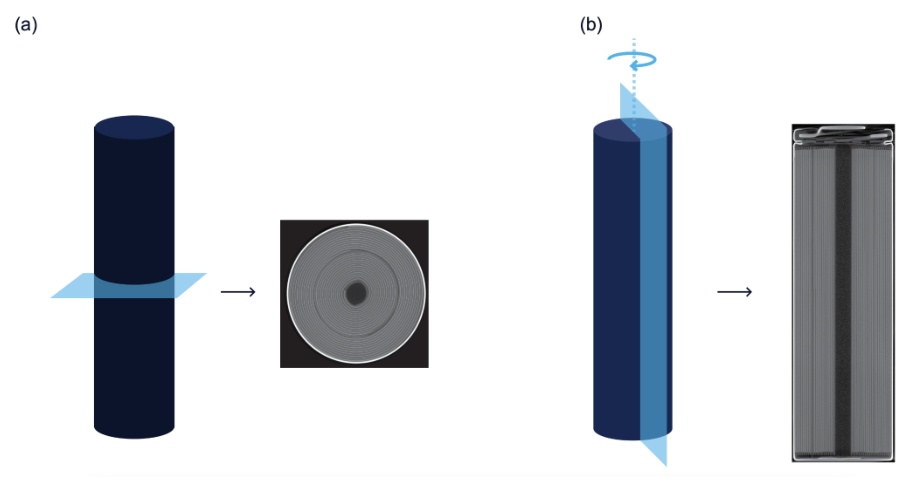
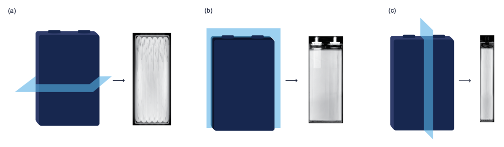

## Abstract

This is a data descriptor, not a methods paper. A CT inspection company bought 1,015 commercial battery cells from ordinary online retailers, scanned every one on an industrial X-ray CT system, and published the processed slices. Seven cell models are covered, spanning lithium-ion and sodium-ion chemistry and cylindrical, pouch and prismatic formats. Two models were bought in bulk, 400 and 500 cells, so the spread between nominally identical cells can be examined directly. The release consists of lossless PNG slices in a few fixed orientations; raw projections, reconstructed volumes, processing code and defect labels are not included. The paper offers scale and open access, and it withholds ground truth.

**Keywords:** lithium-ion battery, sodium-ion battery, X-ray computed tomography, manufacturing variability, quality inspection, open dataset

## 1 Introduction

Batteries are unforgiving of small assembly errors. A misplaced electrode or a fold in the wound stack can become a safety problem much later, and none of it is visible from outside the can. CT is the obvious non-destructive way to look inside, and the battery literature has used it for years. The authors' complaint is about sample size: <mark>the eighteen prior CT studies they cite each examined between one and ten cells</mark>. That is enough to study a degradation mechanism, but it says nothing about how much a production lot varies.

They give three reasons CT has not scaled. Scans on general-purpose hardware take hours. One reconstructed volume runs to tens of gigabytes, enough that scanning services reportedly mail hard drives instead of uploading. And standard analysis software is built for an expert studying one volume, with tens of minutes spent per scan. The dataset is meant to show that these limits can be pushed: <mark>most scans here were acquired in roughly two minutes each</mark>.

## 2 Background

A cylindrical cell contains a *jellyroll*: anode, separator and cathode sheets wound into a spiral, with a header region on top holding tabs and safety hardware. Pouch and prismatic cells hold the sheets in a rectangular envelope. One quality rule CT can check is anode overhang, the requirement that the anode extends slightly past the cathode at every edge; the paper invokes it when describing the counterfeit cells below.

A CT scan reconstructs a 3D grid of attenuation values (voxels) from X-ray projections taken as the object rotates. Voxel size sets the smallest resolvable feature, and storage grows with the cube of resolution.

## 3 Dataset

> **Key idea.** Buy retail cells in lots large enough to show within-model spread, scan each in about two minutes, and publish a thinned set of 2D slices instead of full volumes, so that a thousand scans fit in a few hundred gigabytes and not tens of terabytes.

### 3.1 What was scanned

Table I of the paper, retyped. The two bulk purchases are in bold because they are what supports statistical work.

| Producer | Cell model | Chemistry (as printed) | Form factor | Cells | Voxel (µm) |
|---|---|---|---|---|---|
| **EVE** | **INR18650/33V** | Lithium-ion | Cylindrical 18650 | **400** | 14.4 |
| HAKADI | SIB18650/3V | Lithium-ion | Cylindrical 18650 | 49 | 14.4 |
| **Samsung** | **50E** | Lithium-ion | Cylindrical 2170 | **500** | 16.4 |
| Vapcell | F56 | Sodium-ion | Cylindrical 2170 | 25 | 16.4 |
| BYD | FC4680 | Lithium-ion | Cylindrical 4680 | 25 | 35.0 |
| Tenergy | 6050100 | Lithium-ion | Pouch | 10 | 18.5 |
| PowerSonic | PSL-FP-IFP2770180EC | Lithium-ion | Prismatic | 5 | 34.0 |

The text says both main lithium-ion cathode families, NMC and LFP, are represented. For the two bulk lots the paper also lists which shipping box each serial-number range came from, and states that boxes were scanned one after another. Box is a plausible proxy for production sub-lot, but it is therefore also confounded with scan day.

### 3.2 Acquisition and processing

Each cell was scanned individually on a Nikon XT H 225 ST 2x with a 225 kV rotating-target source, reconstructed in Nikon's software, then passed through the company's proprietary pipeline for intensity adjustment, cropping and denoising, with settings fixed per form factor. The paper's worked example shows why raw volumes were not released:

$$
1500 \times 1500 \times 4000 \ \text{voxels} \times 4 \ \text{bytes} = 36 \ \text{GB} \tag{1}
$$

for one cell stored as 32-bit floats. The raw data would come to several dozen terabytes by the authors' estimate.

### 3.3 Slicing convention

The directory tree goes cell type, scan, slice orientation, then PNG files indexed by position. Cylindrical cells get two orientations: radial slices perpendicular to the cylinder axis, showing the spiral, and axial slices containing the axis, showing the layers from bottom to header. $Z=0$ is the bottom of the cell; the angular origin is arbitrary because it depends on how the cell sat in the scanner.

*Source: Condon et al., arXiv:2403.02527, Fig. 1, CC BY-NC-SA 4.0.*

Pouch and prismatic cells get three orthogonal orientations named by their in-plane axes.

*Source: Condon et al., arXiv:2403.02527, Fig. 2, CC BY-NC-SA 4.0.*

Slices are not evenly spaced: the slowly varying jellyroll body is sampled coarsely and regions such as the header finely. (The paper attaches the same "low variation" parenthetical to both regions, which looks like a slip.)

## 4 What the data supports

The paper contains no experiments, so this section covers what it reports and what the release enables.

**Within-model variation.** <mark>The authors claim this is the largest public collection of both battery-quality data and industrial CT scans.</mark> Any geometric feature extractable from a slice, such as core diameter, layer count or electrode edge position, becomes a distribution over hundreds of cells of one design.

**One real finding.** <mark>Four cells sold as sodium-ion turned out to be lithium-ion, identified by copper foil on the anode.</mark> They looked identical to the rest from outside and were badly built, with overhang violations. They remain in the sodium-ion folder, a small but genuine set of out-of-distribution samples with a physical explanation.

**Incoming checks.** On a subset, open-circuit voltage was measured to rule out shipping shorts, and dimensions were recorded. Measured size departed from nominal (Vapcell cells measured 21.5 mm by 71.0 mm against 21.0 by 70.0) but was consistent within a model.

## 5 Discussion

**Strengths.** The sampling is honest about what it is: retail cells, as produced, never cycled. Serial numbers or scan-order IDs tie each scan to a physical cell, and PNG means nobody needs a volume renderer to open the data.

**Weaknesses.** <mark>There are no labels.</mark> The company's portal shows automated defect detections and measurements, and the paper states that these are excluded. The data therefore suits unsupervised work or user-built metrology, but it is not a benchmark as released. The closed pipeline means the denoising and intensity mapping cannot be reproduced or undone, so a model trained here learns that pipeline's look. Scans were taken over several days, and the authors acknowledge possible day-to-day drift from source conditioning and shading correction; beam hardening and metal streaks are visible in some scans. They also warn against treating seven models as representative. All authors disclose a financial interest in the company.

**Things I could not reconcile.** The counts in Table I sum to 1,014, one short of the stated 1,015. The table also prints the HAKADI model, whose name begins with "SIB", as lithium-ion and the Vapcell F56 as sodium-ion; I retyped it as printed, but the chemistry column should be checked against the repository.

**Not shown.** No example defect, no histogram of any measured quantity, and no electrical data beyond the spot voltage check, so nothing links structure to performance or lifetime.

## 6 Takeaways

- The contribution is scale: about a thousand cells where earlier CT studies had at most ten, with two lots large enough to estimate a distribution.
- The release is thinned, non-uniformly spaced 2D slices after proprietary enhancement, not volumetric data.
- Without labels it serves unsupervised anomaly detection and metrology; the four counterfeit cells are the only documented anomalies.
- Box order and scan day are confounded, so lot-level conclusions need care.

## References

1. A. Condon, B. Buscarino, E. Moch, W. J. Sehnert, O. Miles, P. K. Herring, P. M. Attia. *A dataset of over one thousand computed tomography scans of battery cells.* arXiv:2403.02527, 2024. Data: doi:10.25452/figshare.plus.25330501.
2. M. D. R. Kok et al. *Tracking the Lifecycle of a 21700 Cell: A 4D Tomography and Digital Disassembly Study.* J. Electrochem. Soc. 170, 090502, 2023 (one of the small-sample CT studies the paper cites).
