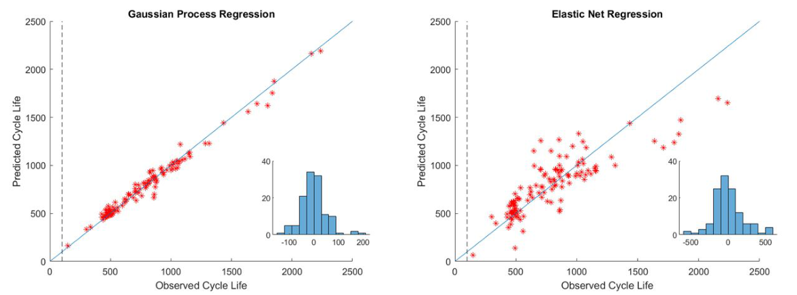
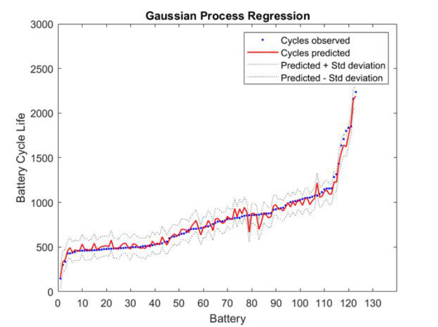
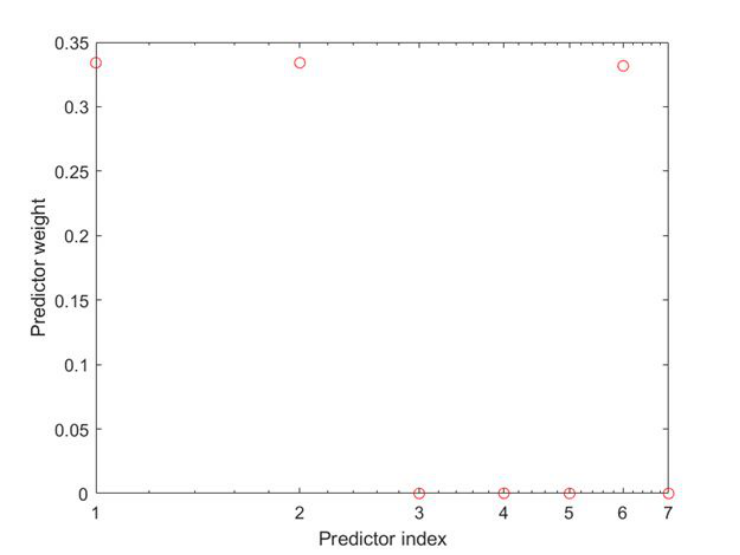

## Abstract

This report revisits the well-known Severson et al. dataset of 124 fast-charged LFP/graphite cells and asks whether the lifetime of a cell can be predicted from its first 100 cycles, a window in which capacity has barely moved. The authors build seven scalar features from early-cycle summaries, then compare two regressors in MATLAB: a Gaussian process with an ARD exponential kernel and an elastic net with four-fold cross-validation. The Gaussian process reaches an RMSE of 52 cycles and about 5% mean percentage error, against 197 cycles and 18% for the elastic net. The Gaussian process also gives a predictive standard deviation, and observed lifetimes mostly sit inside that band. The numbers are reported on the fitting data, so the report is best read as a worked example of the pipeline and not as a benchmark result.

**Keywords:** lithium-ion battery, cycle life, early prediction, Gaussian process regression, elastic net, ΔQ(V) features

## 1 Introduction

Cycle life here means the number of charge/discharge cycles before capacity drops under 80% of nominal. Measuring it directly is slow: the report cites roughly five hours per cycle, and the cells in question live for hundreds to thousands of cycles. A model that reads the first few days of a test and forecasts the endpoint would shorten R&D loops and help a battery management system flag end of life.

The difficulty is that degradation is nonlinear and nearly invisible early on. Capacity curves of different cells cross each other, so <mark>initial capacity and early capacity fade correlate only weakly with final lifetime</mark>. Mechanistic models of SEI growth, lithium plating, or active-material loss have had some predictive success, but they are tied to a chemistry and struggle with full cells under fast charging, where several mechanisms couple with thermal and mechanical heterogeneity. Severson et al. answered with a mechanism-agnostic approach: engineered features plus a regularized linear model. This report keeps their data and feature ideas and changes the regressor.

## 2 Background

**Dataset.** 124 A123 APR18650M1A cells (1.1 Ah nominal) cycled at 30 °C under 72 fast-charging policies, from 3.6C up to 6C, with an identical 4C discharge to 2.0 V. Lifetimes span about 150 to 2,300 cycles, with a mean near 806 and a standard deviation of 377, for roughly 96,700 cycles in total. The three batches hold 41, 43 and 40 cells.

**Why voltage curves.** Because every discharge sweeps the same voltage window, discharged capacity can be written as a function of voltage, $Q(V)$, and compared across cycles on a common axis. Severson et al. found that the spread of the cycle-to-cycle change in $Q(V)$ tracks lifetime closely on a log scale: <mark>cells whose discharge curve changes less, and more uniformly, between cycle 10 and cycle 100 live longer</mark>. The report illustrates this with a scatter reproduced from the original paper ([Fig. 3, page 5](https://arxiv.org/pdf/2110.09687#page=5)).

## 3 Method

> **Key idea.** Keep the physically motivated early-cycle features from Severson et al., but replace the sparse linear map with a nonparametric Gaussian process, so the feature-to-lifetime relation can bend and every prediction comes with an uncertainty.

### 3.1 Features

The central quantity is the difference between two discharge curves,

$$
\Delta Q(V) = Q_{100}(V) - Q_{10}(V), \tag{1}
$$

where $Q_n(V)$ is discharged capacity at voltage $V$ in cycle $n$. Two features summarize it, both in $\log_{10}$:

$$
f_{\min} = \log_{10}\left|\min_V \Delta Q(V)\right|, \qquad f_{\mathrm{var}} = \log_{10}\left|\frac{1}{p-1}\sum_{i=1}^{p}\big(\Delta Q(V_i) - \overline{\Delta Q}\big)^2\right|, \tag{2}
$$

with $p$ the number of points and $\overline{\Delta Q}$ their mean. A third feature is the slope of a straight line fitted to capacity versus cycle number over cycles 2–100,

$$
b^{*} = \arg\min_{b}\ \tfrac{1}{d}\,\lVert q - Xb\rVert_2^2, \tag{3}
$$

where $q\in\mathbb{R}^{d}$ holds the capacities, $X\in\mathbb{R}^{d\times 2}$ has cycle numbers and a column of ones, $d=99$, and the slope is the first entry of $b^{*}$. The remaining four features are the mean charge time over cycles 2–6, the maximum temperature over cycles 2–100, the internal-resistance change between cycles 2 and 100, and the integral of average temperature over cycles 2–100.

### 3.2 Two regressors

The Gaussian process places a prior $f(x)\sim\mathcal{GP}\big(m(x),\kappa(x,x')\big)$, so any finite set of cells has jointly Gaussian lifetimes with covariance $K_{ij}=\kappa(x_i,x_j)$. The kernel is MATLAB's `ardexponential`; its formula is an image in the PDF, so I give the documented form:

$$
\kappa(x,x') = \sigma_f^2 \exp\!\Big(-\sqrt{\textstyle\sum_{m=1}^{7} (x_m-x'_m)^2/\sigma_m^2}\Big), \tag{4}
$$

with signal scale $\sigma_f$ and one length scale $\sigma_m$ per feature. The fit is initialized with $\beta=1000$ and $\sigma=100$. Feature "weights" are then defined as $\exp(-\sigma_m)$, normalized to sum to one.

The elastic net is the baseline from the original paper. In the usual notation it solves

$$
\hat\theta = \arg\min_\theta\ \lVert y-\Phi\theta\rVert_2^2 + \lambda\Big(\tfrac{1-\alpha}{2}\lVert\theta\rVert_2^2 + \alpha\lVert\theta\rVert_1\Big), \tag{5}
$$

with $\alpha=0.5$ and $\lambda=0.0438$ chosen by four-fold cross-validation. Accuracy is scored by RMSE in cycles and by mean absolute percentage error.

## 4 Experiments

All three batches are pooled, and the outlier removal of the original study is reused. Each model is fitted on the seven features and then evaluated on the same cells.

| Model | RMSE (cycles) | Mean percent error (%) |
|---|---|---|
| **Gaussian process regression** | **52** | **5** |
| Elastic net regression | 197 | 18 |

*Source: Feltner et al., arXiv:2110.09687, Figs. 10–11, CC0 1.0.*

<mark>The elastic net fails mainly on cells that last more than 1,500 cycles</mark>, where it predicts far too short a life; the Gaussian process follows both the short-lived (<500) and long-lived ends.

*Source: Feltner et al., arXiv:2110.09687, Fig. 6, CC0 1.0.*

On feature relevance, the two models disagree. The GP weights concentrate on $f_{\min}$, $f_{\mathrm{var}}$ and the fade slope and ignore the temperature integral; the elastic net keeps the slope but drops both $\Delta Q$ features.

*Source: Feltner et al., arXiv:2110.09687, Fig. 5, CC0 1.0.*

## 5 Discussion

**Strengths.** The report is a clear, reproducible walk through the Severson pipeline, with the full MATLAB script in the appendix. Using a GP is a sensible move: it handles nonlinearity with 124 samples and gives calibrated-looking error bars, which matter when a prediction triggers a warranty or replacement decision.

**The headline comparison is in-sample.** The text states the 5% and 18% errors are on the training dataset, and the appendix code calls `predict` on the same matrix used for fitting. <mark>A GP with an exponential kernel can interpolate its training points almost arbitrarily well, so 52 versus 197 cycles says little about generalization.</mark> For context, the companion tutorial by Schaeffer et al. quotes the original elastic net at RMSE 76 (train), 91 (primary test) and 173 (secondary test) with a batch-wise split. No such split is tried here.

**The ΔQ features may not be what they seem.** This is my reading of the appendix code, not a claim in the report: `delQ` is built from the per-cycle summary capacity (one scalar per cell), and `min_delQ` and `var_delQ` are then computed across cells and copied to every row with `repmat`. If so, <mark>features 1 and 2 are constant columns and carry no information</mark>, which would explain why the elastic net zeroes them. It would also explain Figure 3: the weight $\exp(-\sigma_m)$ is not scale-free, so any feature whose length scale is numerically tiny (a constant column, or a slope of order $10^{-4}$) gets weight near one, and large-scale features like a temperature integral get zero. Three equal weights of one third look more like an artifact of units than a ranking. One code line is truncated in the PDF, so I could not confirm this fully.

**Not shown.** No held-out test, no kernel comparison (the authors list this as future work), no feature standardization, and no check of whether the GP's intervals are calibrated.

## 6 Takeaways

- Early-cycle prediction works because of feature design: the change in the discharge voltage curve between cycles 10 and 100 carries lifetime information before capacity fade is visible.
- A GP is a natural upgrade over a sparse linear model for ~100 samples, mostly because it returns a predictive variance.
- In-sample error of a flexible kernel model is not evidence. The comparison needs the original train / primary / secondary split before the 52-cycle figure means anything.
- ARD length scales are only interpretable as importance after features are standardized; read the appendix code before trusting a feature-importance plot.
- A loose but honest link to financial time series: a capacity-fade curve is a short, non-stationary path whose early segment looks flat, and the target is a first-passage time (crossing 80%). The same cautions apply — in-sample fit flatters flexible models, and group-wise (batch or regime) splits are the only fair test.

## References

1. C. Feltner, K. I. Kuhn, J. Peck, A. Singh. *Data Driven Prediction of Battery Cycle Life Before Capacity Degradation.* arXiv:2110.09687, 2021.
2. K. A. Severson et al. *Data-driven prediction of battery cycle life before capacity degradation.* Nature Energy 4, 383–391, 2019.
3. J. Schaeffer et al. *Cycle Life Prediction for Lithium-ion Batteries: Machine Learning and More.* ACC 2024, arXiv:2404.04049.
4. MathWorks. *fitrgp — Fit a Gaussian process regression model.* MATLAB documentation.
