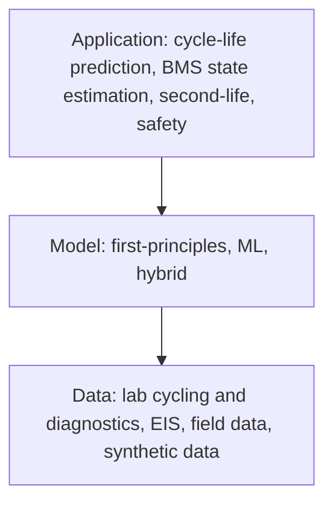

## Abstract

This short tutorial, written by a group that includes one of the senior authors of the original early-prediction study, surveys how battery lifetime is modeled and where machine learning fits. It sorts models into first-principles, data-driven and hybrid families, then uses cycle-life prediction from early laboratory cycling as a worked example: data generation, feature design, regularized regression, validation, and interpretation. The reference elastic-net model reaches RMSEs of 76, 91 and 173 cycles on the training, primary-test and secondary-test sets of the 124-cell LFP dataset. The authors use the weak secondary-test result to discuss generalization, and warn about data leakage, neglected calendar aging, and the limited physical insight available from fast-cycling data alone. Their remedy is richer diagnostic cycles and hybrid physics-plus-ML models.

**Keywords:** lithium-ion battery, cycle life, state of health, elastic net, fused LASSO, hybrid modeling, data leakage, grouped cross-validation

## 1 Introduction

Lithium-ion cells degrade while cycling and while resting. Many mechanisms interact and show up as degradation modes — loss of lithium inventory and loss of active material — which in turn produce capacity and power fade. Because this chain is hard to model from physics, lifetime forecasting became a popular ML target, and one success story is the closed-loop optimization of fast-charging protocols.

The paper's opening position is cautious. <mark>Many published battery ML models generalize poorly because open training data are scarce</mark>, and cell chemistries and usage patterns are too varied for any dataset to cover. It also argues that a capacity forecast alone is not enough for R&D or second-life decisions; one needs to know *how* a cell is degrading. A battery management system, meanwhile, must estimate state of charge, state of health and ideally end of life online, which frames the task as model-based diagnostics and prognostics.

## 2 Background

The overview figure ([Fig. 1 in the paper](https://arxiv.org/pdf/2404.04049#page=2)) stacks three layers: data sources at the bottom, model families in the middle, applications on top. The recommended workflow runs top-down. My own sketch of it:

**First-principles models** (porous electrode theory, single particle model, multiphase PET) describe short-term dynamics through reaction, diffusion and conduction laws and can involve hundreds of differential-algebraic equations. They extrapolate and transfer across chemistries, but degradation physics is still an open research area and parameters are often not identifiable from the available data.

**Machine-learning models** skip the physics. Examples cited include the ΔQ features with a regularized linear model (Severson et al.), the BEEP feature library, fused LASSO applied directly to ΔQ, histogram features that extend prediction to the whole fade trajectory, and models on impedance spectroscopy or acoustic signals. Their cost: large data needs, little physical insight, weak transfer beyond the training cell type.

**Hybrid models** come in several flavors: a data-driven model for the slow drift of physical parameters estimated cycle by cycle from a PET model; an ML model that learns the residual of a physics model; physics-informed neural networks that add physical laws to the loss; and training on a mix of real and physics-simulated data. One cited study fits PET kinetic and transport coefficients to 95 NCA cells taken from a Tesla Model 3, after identifiability is handled with maximum-a-posteriori estimation.

## 3 Method

> **Key idea.** Treat cycle-life prediction as a small-$n$, wide-$p$, highly collinear regression problem: spend the effort on feature design from domain knowledge, fit a regularized linear model, and validate with splits that respect the batch structure of the data.

### 3.1 Data and features

The dataset varies only the fast-charging protocol. All cycles are full cycles, discharge is fixed at 4C, temperature is constant, and all cells are cylindrical LFP cells from one manufacturer. The key input is

$$
\Delta Q_{100-10}(V) = Q_{100}(V) - Q_{10}(V), \tag{1}
$$

the change in discharged capacity as a function of voltage between cycles 10 and 100, which captures evolving capacity and resistance before visible fade. Stacked over cells it forms a wide matrix $\Delta Q \in \mathbb{R}^{124\times 1000}$: one row per cell, one column per voltage grid point. Two routes follow. Latent-variable methods (PCA, PLS) regress in a low-dimensional projection and can use $\Delta Q$ directly. Or a nonlinear map $f:\mathbb{R}^p\to\mathbb{R}$ compresses each row to a scalar, such as its variance or mean. <mark>The variance of $\Delta Q_{100-10}$ is reported as the single most predictive feature.</mark> Scaling and monotone transforms (log, root, reciprocal) reduce skew and improve linear correlation with the target.

### 3.2 Regularized regression

The model is linear in its parameters,

$$
\hat y = \Phi\theta, \tag{2}
$$

with $\hat y$ the predicted cycle lives, $\Phi$ the $n\times p$ feature matrix (which may hold nonlinear transforms of inputs), and $\theta$ the coefficients. Ordinary least squares needs $n\gg p$ and $\operatorname{rank}(\Phi)=p$; battery data rarely satisfy either, and engineered features add collinearity. The elastic net estimate is

$$
\hat\theta_{\mathrm{EN}} = \arg\min_\theta\ \lVert y-\Phi\theta\rVert_2^2 + \lambda\Big(\tfrac{1-\alpha}{2}\lVert\theta\rVert_2^2 + \alpha\lVert\theta\rVert_1\Big), \tag{3}
$$

where $\lambda$ sets the penalty strength and $\alpha$ mixes the LASSO term, which zeroes coefficients, with the ridge term, which shrinks groups of collinear features together. Both are chosen by cross-validation, and <mark>the splits should be grouped — by production batch or test campaign — so that the model cannot fit batch-level bias</mark>.

### 3.3 Checking the model

Beyond RMSE, $R^2$ and percentage error on one or more test sets, the tutorial asks for residual analysis: residuals $\varepsilon = y-\Phi\theta$ should be zero-mean, roughly normal and unrelated to $y$ (histogram, Q-Q plot, $\chi^2$ test). Parameter uncertainty matters too: a coefficient whose confidence interval straddles zero can be dropped. And a predictive feature is not a causal one; causal readings need physics to back them.

## 4 Experiments

The paper reports no new experiments. Its case study restates the elastic-net discharge model of Severson et al. ([Fig. 3b](https://arxiv.org/pdf/2404.04049#page=4)), split as 41 training, 43 primary-test and 40 secondary-test cells.

| Split | Cells | RMSE (cycles) |
|---|---|---|
| **Train** | 41 | **76** |
| Primary test | 43 | 91 |
| Secondary test | 40 | 173 |

The error nearly doubles on the secondary set, driven by long-lived cells. Two reasons are given: those cells were cycled about ten months later and so carried more calendar aging, and the training set holds few cells above 1,200 cycles. A fused-LASSO model learned directly on $\Delta Q$ gives piecewise-constant, easy-to-read coefficients and similar accuracy for cells under 1,200 cycles; no number is quoted.

## 5 Discussion

**Strengths.** For six pages, this is a dense and honest map. It names the failure modes that inflate battery ML results: leakage through charging-side features on a dataset where the charging protocol *is* the experimental variable, random instead of grouped splits, and extrapolation past the training range of lifetimes. The secondary-test number is shown plainly instead of hidden.

**Weaknesses.** As a tutorial it is more checklist than demonstration. There is no code, no side-by-side of grouped versus random CV, and no quantified leakage example; the reader is sent to the references. Hybrid models are promoted but only described. The case study is a single chemistry under accelerated cycling, which the authors themselves say generalizes poorly.

**Not shown.** <mark>Calendar aging is absent from accelerated-cycling data, yet most deployed batteries sit idle most of the time</mark>, so lifetime projections from such models are likely optimistic. The authors also concede that even the most interpretable model on high-rate data supports only speculation about mechanisms. They propose diagnostic cycles — slow C/25 (pseudo-OCV) sweeps for differential voltage analysis of degradation modes, and pulse tests across states of charge and temperatures for resistance — as the data that hybrid models need.

## 6 Takeaways

- Start from the application, pick the model family, and only then decide what data to collect; most groups are forced to go the other way.
- On this problem, feature design (the variance of $\Delta Q_{100-10}$) does more work than model choice.
- Use grouped cross-validation and more than one test set; 76 → 91 → 173 cycles shows how much a time-shifted batch can hurt.
- Interpretability is not mechanism: predictive features need physics before any causal story.
- The validation advice carries over to financial time series as is: grouped or blocked splits against regime-level bias, leakage checks on features that encode the label, and suspicion of any model evaluated only inside its training range.

## References

1. J. Schaeffer, G. Galuppini, J. Rhyu, P. A. Asinger, R. Droop, R. Findeisen, R. D. Braatz. *Cycle Life Prediction for Lithium-ion Batteries: Machine Learning and More.* ACC 2024, arXiv:2404.04049.
2. K. A. Severson et al. *Data-driven prediction of battery cycle life before capacity degradation.* Nature Energy 4, 383–391, 2019.
3. J. Schaeffer et al. *Interpretation of high-dimensional linear regression: Effects of nullspace and regularization demonstrated on battery data.* Computers & Chemical Engineering 180, 108471, 2024.
4. A. Geslin et al. *Selecting the appropriate features in battery lifetime predictions.* Joule 7, 1956–1965, 2023.
5. P. M. Attia et al. *Closed-loop optimization of fast-charging protocols for batteries with machine learning.* Nature 578, 397–402, 2020.
