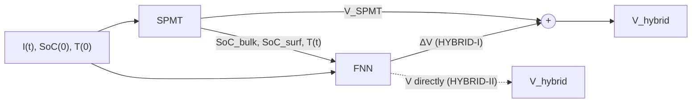

## Abstract

This short control-systems paper asks how to get near-DFN voltage accuracy from a lithium-ion cell model at a fraction of the cost. It couples a reduced electrochemical model, the single particle model with a lumped thermal state (SPMT), to a two-hidden-layer feedforward network. The distinguishing choice is the network's input: besides current and temperature, it receives two aggregate state variables of the physical model, the bulk and surface state of charge of the negative electrode. Two wirings are proposed, one in which the network corrects the SPMT voltage (HYBRID-I) and one in which it predicts voltage outright from SPMT quantities (HYBRID-II). On synthetic data generated by a full DFN simulation, both cut the SPMT's RMSE by over 90% at high discharge rates, and the residual form is the more dependable of the two. Everything is simulation; there is no experimental validation and no quantitative comparison with earlier hybrids.

**Keywords:** lithium-ion battery, single particle model, DFN, hybrid physics–ML, residual learning, feedforward network, high C-rate

## 1 Introduction

Battery management needs a model that maps applied current to terminal voltage, quickly and over a wide range of operating rates. Equivalent-circuit models are cheap but crude. The Doyle–Fuller–Newman (DFN) porous-electrode model is regarded as accurate enough for almost any purpose but is far too heavy for embedded use. Reduced electrochemical models sit in between; the single particle model (SPM) is the leanest, treating each electrode as one sphere and ignoring electrolyte dynamics. That simplification is tolerable only at low to medium current, up to about 1 C for the thermal variant used here, and breaks down at the high rates that fast charging and power applications demand.

Pure ML models have the opposite profile: cheap at run time, but limited by what the training data cover and free to produce physically inconsistent output. Hybrids are the natural compromise, and a few existed: a neural network coupled to a 1-D electrochemical model, an RNN trained on the SPM's voltage residual, and an SPM-plus-thermal model in series with a network. The authors' criticism of these is specific. <mark>When the network sees only the current and the physical model's output voltage, the map from its inputs to the true voltage is not one-to-one, because the cell has internal dynamics the inputs do not reveal.</mark> The same current and the same model voltage can correspond to different internal conditions and therefore different correct answers. Such a network can fit the training set yet predict poorly.

## 2 Background

**SPMT.** Lithium concentration $c_s^\pm(r,t)$ in each spherical particle follows Fickian diffusion,

$$
\frac{\partial c_s^\pm}{\partial t} = \frac{1}{r^2}\frac{\partial}{\partial r}\!\left(D_s^\pm r^2 \frac{\partial c_s^\pm}{\partial r}\right), \tag{1}
$$

with zero flux at the centre and a surface flux proportional to the applied current $I(t)$. Butler–Volmer kinetics with symmetric transfer coefficients give the overpotentials $\eta^\pm$, and the terminal voltage is

$$
V(t) = U^+(c_{ss}^+) - U^-(c_{ss}^-) + \eta^+ - \eta^- - R_{\text{film}}\, I(t), \tag{2}
$$

where $U^\pm$ are equilibrium potentials evaluated at the surface concentrations $c_{ss}^\pm$ and $R_{\text{film}}$ lumps the film resistances. A single lumped temperature $T(t)$ obeys an energy balance between ohmic plus entropic heating and convective loss, and feeds back through Arrhenius scaling of the diffusion coefficients $D_s^\pm$ and reaction rate constants.

**FNN.** A plain multilayer perceptron trained by mean squared error; nothing recurrent.

## 3 Method

> **Key idea.** A correction network can only fix what it can see. Give it a compact summary of the physical model's hidden state, not just that model's output, so that it can tell apart situations that look identical from the terminals.

### 3.1 Which state to expose

Passing the full discretized concentration profile would be expensive to train and run. After what the authors describe as trial and error, two scalars are chosen, both for the negative electrode:

$$
\text{SoC}_{\text{surf}} = \frac{c_{ss}^-(t)}{c_{s,\max}^-}, \qquad \text{SoC}_{\text{bulk}} = \frac{\bar c_s^-(t)}{c_{s,\max}^-}, \tag{3}
$$

where $\bar c_s^-$ is the volume-averaged concentration and $c_{s,\max}^-$ the saturation concentration. Their difference is a direct measure of how steep the concentration gradient inside the particle is, which is precisely the quantity that grows at high current and that the SPM's missing physics interacts with. The network input is $x = [I(t),\, T(t),\, \text{SoC}(0),\, \text{SoC}_{\text{bulk}},\, \text{SoC}_{\text{surf}}]$.

### 3.2 Two wirings

HYBRID-I is residual learning: the network is trained on $\Delta V = V - V_{\text{SPMT}}$ and the prediction is

$$
V_{\text{hybrid}} = V_{\text{SPMT}} + g_\theta(x). \tag{4}
$$

HYBRID-II is a cascade: the same inputs, but the target is $V$ itself and the SPMT voltage is not added back. In both cases the network is 5 inputs → 32 → 32 → 1 with ReLU hidden units and a linear output, built in Keras on normalized inputs. <mark>Because the network is memoryless, all dynamics are carried by the SPMT; the network is a static read-out on top of a physical state estimator.</mark>

## 4 Experiments

**Setup.** Ground truth is a DFN simulation (DUALFOIL) of an LCO/graphite cell between 3.1 and 4.1 V. Training uses constant-current discharges at 0.1, 0.2, 1, 2, 4, 6, 8 and 10 C plus UDDS- and US06-derived drive cycles, from initial SoC 0.27, 0.52, 0.67 and 0.74. Testing uses different rates (0.5, 1, 3, 5, 7, 10 C), a differently modified UDDS profile, US06, and different initial SoC (0.46, 0.58, 0.70). Drive cycles are scaled to peak near 10 C; ambient and initial temperature are 25 °C. The metric is voltage RMSE, with relative error reduction (RER) against SPMT alone.

Test-set results, merged from the paper's Tables II and IV (RMSE in mV, RER in parentheses):

| Test profile | SPMT | HYBRID-I | HYBRID-II |
|---|---|---|---|
| CC 0.5 C | 10.92 | **7.82** (28.39%) | 15.35 (−40.57%) |
| CC 1 C | 19.15 | 5.05 (73.63%) | **3.56** (81.41%) |
| CC 3 C | 76.37 | **9.19** (87.97%) | 12.18 (84.05%) |
| CC 5 C | 101.85 | **7.19** (92.94%) | 7.80 (92.34%) |
| CC 7 C | 137.85 | **8.77** (93.64%) | 9.95 (92.78%) |
| CC 10 C | 207.29 | **10.67** (94.85%) | 11.98 (94.22%) |
| UDDS-B | 17.59 | **6.75** (61.63%) | 8.37 (52.42%) |
| US06 | 35.05 | **9.12** (73.98%) | 10.36 (70.44%) |

<mark>The SPMT's error grows from about 11 mV at 0.5 C to over 200 mV at 10 C, while HYBRID-I stays between roughly 5 and 11 mV across the whole range</mark>, so the hybrid's error is nearly rate-independent. Training and test errors are close, which indicates interpolation across rates and initial conditions works. <mark>HYBRID-I wins on seven of eight test profiles.</mark> HYBRID-II is *worse than the bare physical model* at the lowest rate, in testing (0.5 C) and even in training (0.1 C: 4.24 mV versus 2.31 mV). That is the expected failure of discarding a good prior: where the SPMT is already nearly exact, a residual network only has to output something close to zero, whereas a direct predictor must rebuild the whole voltage curve and pays its approximation error everywhere. Voltage traces on the drive cycles are shown in [Fig. 7](https://arxiv.org/pdf/2103.11580#page=6) and [Fig. 8 in the paper](https://arxiv.org/pdf/2103.11580#page=6): the SPMT error spikes to tens of mV or more at current peaks, and the hybrid error stays in a narrow band around zero.

## 5 Discussion

**Strengths.** The argument is simple and correct in spirit: residuals of a dynamical model are functions of state, not of input and output alone, so a static corrector needs state features. Two scalars suffice, the network is tiny, and the run-time cost is essentially that of the SPMT. The test protocol does vary rates, profiles and initial SoC rather than reusing training conditions.

**Weaknesses.** <mark>The central claim is never isolated.</mark> There is no ablation in which the SoC inputs are removed, and the statement that the design beats earlier hybrids is asserted with reference to unspecified simulations rather than shown. The "measurements" are noise-free output of another model with known parameters, so the study says nothing about sensor noise, parameter mismatch between SPMT and the real cell, or aging. Test rates lie inside the training range, so this is interpolation; extrapolation beyond 10 C or to other temperatures is untested, and only discharge is covered. The state variables were picked by trial and error with no account of the alternatives. Finally, in deployment the SPMT state must itself be estimated from noisy data, and errors in that estimate would flow straight into the network; this is not examined.

## 6 Takeaways

- For a learned correction on top of a dynamical model, expose a low-dimensional summary of the model's internal state to the learner. Output-only features make the target ill-defined.
- Prefer the residual form. It inherits the physical model's accuracy where that model is good and cannot do much harm there; the direct form can end up worse than the physics alone.
- Surface-minus-bulk concentration is a cheap, physically meaningful feature that tracks exactly the regime (high rate) where the reduced model fails.
- The same grey-box pattern carries over to financial time series with a parametric stochastic model as the prior: by the paper's own argument, a network correcting, say, a stochastic-volatility model's output should also be given the filtered latent state (the variance estimate), not only prices and model output. This is an analogy, not a result: the paper offers no evidence for that setting, and a filtered variance is far noisier than a simulated SPMT state.

## References

1. H. Tu, S. Moura, H. Fang. *Integrating Electrochemical Modeling with Machine Learning for Lithium-Ion Batteries.* arXiv:2103.11580, 2021.
2. M. Doyle, T. F. Fuller, J. Newman. *Modeling of galvanostatic charge and discharge of the lithium/polymer/insertion cell.* J. Electrochem. Soc. 140(6), 1993.
3. M. Guo, G. Sikha, R. White. *Single-particle model for a lithium-ion cell: Thermal behavior.* J. Electrochem. Soc. 158(2), 2011.
4. S. Park, D. Zhang, S. Moura. *Hybrid electrochemical modeling with recurrent neural networks for Li-ion batteries.* American Control Conference, 2017.
5. F. Feng et al. *Co-estimation of lithium-ion battery state of charge and state of temperature based on a hybrid electrochemical-thermal-neural-network model.* J. Power Sources 455, 2020.
