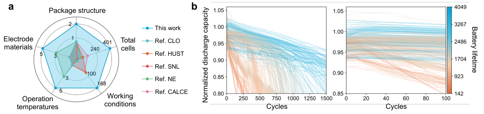
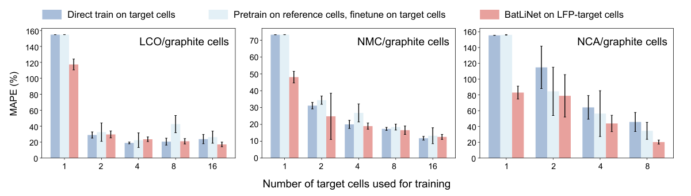

## Abstract

BatLiNet is a lifetime predictor for lithium-ion cells that is meant to work when the training pool mixes chemistries, cycling protocols and temperatures instead of a single well-controlled batch. Next to the usual regression from a cell's own early-cycle curves, it adds a second regression: from the gap between two cells' curves at the same cycle to the gap between their lifetimes. Two separate encoders feed one shared linear output layer, and at test time the pairwise branch is anchored on a group of training cells whose lifetimes are known. The authors pool 401 cells, five cathode materials and 168 cycling conditions into five benchmark splits. BatLiNet has the lowest error on all five, is much less seed-sensitive than a plain CNN, and lets abundant LFP data help chemistries for which only a handful of cells exist.

**Keywords:** battery cycle life, early prediction, inter-cell difference, pairwise regression, low-resource learning, capacity-indexed features

## 1 Introduction

Cycling a cell until it has lost 20% of its capacity takes months, so predicting that end point from the first hundred cycles is valuable for screening materials and charging protocols. Capacity barely moves in those cycles; the signal has to be found in subtler changes of the voltage curve.

The standard recipe, covered in [Early cycle-life prediction](/blog/battery-cycle-life-early-prediction/), subtracts the discharge voltage–capacity curve at cycle 10 from the one at cycle 100 and feeds summary statistics of that difference into a linear model. Its statistical refinements are in [ML and more](/blog/battery-cycle-life-ml-and-more/). Both were designed on one LFP/graphite cell model under fast charging. The paper's complaint is that these methods were *developed and validated* under narrow conditions, so the feature choice is itself fitted to the data. Once chemistries and protocols are mixed, the near-linear relation between the spread of the difference curve and lifetime breaks into scattered clusters with outliers (panel b of Figure 1), and each public dataset remains an island that cannot help the others.

Deep networks are the obvious answer to the non-linearity, but there is one label per cell and only a few hundred cells. The authors show that <mark>off-the-shelf MLP, LSTM and CNN regressors overfit, swing widely with the random seed, and offer no real advantage over random forests or the hand-crafted linear models</mark>. The bottleneck is supervision, not expressiveness.

## 2 Background

**Intra-cell differences.** For a cell with cycle-level feature $x_t$ at cycle $t$, the classical input is $x_t - x_{t_0}$ for a fixed early reference cycle $t_0$. Everything is computed inside one cell.

**Capacity-indexed feature maps.** Raw voltage and current traces differ in length from cycle to cycle. The authors re-index every signal by normalised capacity $Q \in [0,1]$ (capacity divided by the cell's *nominal* capacity, so that cells of different size share an axis) and interpolate onto a fixed grid. This yields four series per cycle, $V_c(Q), V_d(Q), I_c(Q), I_d(Q)$ for charge and discharge, plus two derived ones:

$$
\Delta V(Q) = V_c(Q) - V_d(Q), \qquad R(Q) = \frac{V_c(Q) - V_d(Q)}{I_c(Q) - I_d(Q)} .
\tag{1}
$$

$\Delta V$ is the charge–discharge hysteresis at equal state of charge and $R$ divides it by the current gap, giving a resistance-like quantity. Stacking cycles produces a six-channel image of size cycles × capacity grid.

**Spike filter.** Protocol switches create abrupt jumps. For a raw series $r$ and window $w$,

$$
M = \operatorname{rollmed}(r, w), \quad
\Delta M = \bigl|\operatorname{rollmed}(M, w)\bigr|, \quad
r^{\text{new}}_t =
\begin{cases}
M_t & \text{if } \Delta M_t > 3\,\operatorname{median}(\Delta M),\\
r_t & \text{otherwise.}
\end{cases}
\tag{2}
$$

Flagged points are replaced by the rolling median and all others are left untouched, so this patches outliers and does not smooth. (The second expression is retyped as printed.)


*Source: Zhang et al., arXiv:2310.05052, Fig. 1, CC BY 4.0.*

## 3 Method

> **Key idea.** Turn $N$ labelled cells into $N(N-1)$ labelled *pairs*. A network that maps "how do these two cells differ in their early curves" to "how do their lifetimes differ" sees far more supervision, and a new cell can then be located relative to many training cells of known lifetime.

### 3.1 Starting point: two regression problems

The standard objective fits $f_\theta$ to lifetimes $y$ from intra-cell features $x$ drawn from the data distribution $D$:

$$
\min_\theta \; \mathbb{E}_{(x,y)\sim D}\,\lVert f_\theta(x) - y\rVert_2^2 .
\tag{3}
$$

With a neural $f_\theta$ and $N$ in the tens to low hundreds this overfits.

The second objective draws two cells independently, forms $\Delta x = x - x'$ and $\Delta y = y - y'$, and fits a function $g_\phi$ on differences:

$$
\min_\phi \; \mathbb{E}_{(\Delta x,\Delta y)}\,\lVert g_\phi(\Delta x) - \Delta y\rVert_2^2 .
\tag{4}
$$

$g_\phi$ sees only the difference, never the two cells separately. The assumption, stated openly by the authors, is that feature differences between *any* two cells relate to lifetime differences in one consistent way. That is strong when one cell is LFP and the other LCO, hence a non-linear $g_\phi$.

### 3.2 The linear case, step by step

Take $f(x) = w^\top x$ and $g(\Delta x) = w^\top \Delta x$ with the same $w$, and write the residual of one cell as $e = w^\top x - y$. Because the two cells are independent draws, the pairwise loss expands as

$$
\mathbb{E}\bigl[(w^\top \Delta x - \Delta y)^2\bigr]
= \mathbb{E}\bigl[(e - e')^2\bigr]
= \mathbb{E}[e^2] + \mathbb{E}[e'^2] - 2\,\mathbb{E}[e]\,\mathbb{E}[e'] .
\tag{5}
$$

The first two terms are two copies of the single-cell loss (3); the last is the squared mean residual. The paper writes only the first two terms, after assuming $y$ is zero-centred. For the cross term to vanish at the optimum the mean residual has to be zero, which holds when the features are centred as well or the model has an intercept. Under that condition the step is exact and the optimal $w^*$ of (3) also minimises (4).

Equation (5) says more than the paper draws from it. The right-hand side equals $2\operatorname{Var}(e)$: the pairwise loss measures only the *variance* of the residual and is blind to any constant offset. This is, in my reading, why Figure 1 labels the shared layer "unbiased": a bias would cancel in every difference and could not be learned by the pairwise branch. At inference the offset comes from the reference label $y'$.

### 3.3 From the linear identity to a shared head

With neural encoders no identity like (5) holds. The authors keep the linear link as an inductive bias by giving both branches one output vector $w$ on top of separate encoders $h_\theta$ and $h_\phi$:

$$
f_\theta(x) = w^\top h_\theta(x), \qquad g_\phi(\Delta x) = w^\top h_\phi(\Delta x) .
\tag{6}
$$

$h_\theta$ embeds a cell, $h_\phi$ embeds a pair, and $w$ reads both. This step is a heuristic, not a consequence of (5): the linear argument shares $w$ acting on the *same* feature space, while here $w$ acts on two different learned spaces that are merely pushed to be compatible.

Replacing the expectation in (4) by all ordered pairs of the $N$ training cells and adding the direct term gives the training objective

$$
\min_{w,\theta,\phi}\;
\sum_{i=1}^{N} \bigl(w^\top h_\theta(x_i) - y_i\bigr)^2
+ \lambda \sum_{i=1}^{N}\sum_{j\neq i} \bigl(w^\top h_\phi(x_i - x_j) - (y_i - y_j)\bigr)^2 .
\tag{7}
$$

The first sum is the usual regression; the second is the pairwise regression over $N(N-1)$ pairs; $\lambda$ balances them. The pair sum only approximates the expectation over *independent* draws, since every pair reuses the same $N$ labels. For MATR-1's 41 training cells that is 1,640 pairs, for MIX-100's 205 cells 41,820, but <mark>the number of independent lifetimes is still $N$; pairing adds constraints on the function, not information about new cells</mark>.

### 3.4 Inference with reference cells

For a new cell $x$ and a training cell $(x', y')$,

$$
\hat y_o = w^\top h_\theta(x), \qquad
\hat y_c = w^\top h_\phi(x - x') + y', \qquad
\hat y = \alpha\,\hat y_o + (1-\alpha)\,\hat y_c .
\tag{8}
$$

$\hat y_o$ is the direct prediction, $\hat y_c$ adds the predicted gap to the known reference lifetime, and $\alpha$ mixes them; the main text and Figure 1 describe a plain mean. In practice 32 references are drawn at random from the training set and the *median* of their $\hat y_c$ values is used.

### 3.5 Intuition: a one-dimensional example with two chemistries

This illustration is mine, not the paper's. Suppose lifetime follows $y = a\,x + b_c$ with a common slope $a$ but a chemistry-specific offset $b_c$, and the training pool holds many cells of chemistry A and three of chemistry B. For a pair within one chemistry the offset cancels, $\Delta y = a\,\Delta x$, so every pair from the abundant chemistry teaches the slope that also applies to B. A new B cell referenced to a B training cell then gets $\hat y_c = a(x - x') + y'$, where the offset is inherited from $y'$ without ever being estimated. For a cross-chemistry pair, $\Delta y = a\,\Delta x + (b_A - b_B)$, and $g_\phi$ must infer the offset gap from the shape of $\Delta x$; this is the part that needs a non-linear encoder and the part most likely to fail. The median over 32 references is the defence: badly matched references produce outlying $\hat y_c$ values that a median ignores.

### 3.6 Algorithm

```text
# Training (pair sampling scheme, optimiser and schedule: not stated)
inputs: cells {(X_i, y_i)}, X_i = 6-channel map (cycles x Q-grid); weight lambda
for each step:
    sample a batch B of cells and, for each i in B, reference cells j != i
    x_i   <- X_i - X_i[t0]                # intra-cell difference to a reference cycle
    d_ij  <- X_i - X_j                    # inter-cell difference, same cycle index
    L_o   <- sum_i   ( w . h_theta(x_i)  - y_i        )^2
    L_c   <- sum_ij  ( w . h_phi(d_ij)   - (y_i - y_j) )^2
    update (w, theta, phi) on L_o + lambda * L_c

# Inference
given new cell X, reference set R of K = 32 training cells
y_o <- w . h_theta(X - X[t0])
for each (X_k, y_k) in R:  c_k <- w . h_phi(X - X_k) + y_k
y_c <- median_k c_k
return alpha * y_o + (1 - alpha) * y_c
```

## 4 Implementation notes

| Item | Reported |
|---|---|
| Input | $(B, 6, H, W)$: six capacity-indexed channels, $H$ = cycles (100 or 20), $W$ = capacity grid |
| Encoder (each branch) | two 2-D convolutions, each followed by average pooling and ReLU; then a fully connected layer collapsing $(H, W)$ to 1 |
| Hidden width | 32, for all neural models |
| Output layer | one linear vector $w$ shared by both branches; drawn as bias-free in Fig. 1 |
| References at inference | 32, random from the training set, median-aggregated |
| Seeds | 0–7 for every neural model |
| Hardware | one server with eight RTX-3090-class GPUs (written "GTX 3090" in the paper) |
| Throughput | 353 cells/s with 32 references; 178.8 cells/s with 64 |
| $\lambda$, $\alpha$ | not stated ($\alpha$ implied 0.5 by "average"/"mean") |
| Kernel sizes, strides, pooling sizes | not stated |
| Grid width $W$, filter window $w$, reference cycle $t_0$ | not stated |
| Optimiser, learning rate, epochs, batch size, label scaling | not stated |
| Number of pairs sampled per step | not stated ("randomly assign reference cells") |

Things that are easy to get wrong:

- **Normalise by nominal capacity**, not by each cell's measured initial capacity; this is what puts chemistries with very different capacities on one $Q$ axis.
- **Average pooling is deliberate**: the signal is the overall shape of a difference curve, not alignment spikes.
- **Centre the labels**: the linear argument assumes zero-mean $y$, and a bias-free head cannot absorb a mean lifetime of hundreds of cycles.
- **Memory grows with the reference count**: the maximum batch drops from 512 to 8 cells as references increase.
- **The cell counts do not reconcile.** The source table lists 84 MATR-1 cells and 45 CLO cells, while the split table has 83 and the text speaks of 55 additional CLO cells. The low-resource counts (275 LFP, 37 LCO, 22 NCA, 69 NMC) sum to more than the 342 cells of MIX-100. Reproduce from the released preprocessing code, not from the text.

## 5 Experiments

**Data.** Five splits. MATR-1 and MATR-2 share 41 LFP training cells and test on seen (42 cells) and unseen (40 cells) fast-charging protocols. HUST (55/22) varies the discharge protocol. MIX-100 pools everything that survives past the early window, 205 training and 137 test cells with lifetimes from 148 to 2,691 cycles, and asks for the 80% end of life from 100 cycles. MIX-20 (207/147) asks for the cycle at which capacity reaches 90% of nominal from only 20 cycles. [BatteryML](/blog/batteryml/) covers a closely related benchmark from the same group.


*Source: Zhang et al., arXiv:2310.05052, Fig. 2, CC BY 4.0.*

**Main results.** RMSE in cycles with MAPE (%) in parentheses; neural models as mean ± std over eight seeds.

| Method | MATR-1 | MATR-2 | HUST | MIX-100 | MIX-20 |
|---|---|---|---|---|---|
| Training mean | 399 (28) | 511 (36) | 420 (18) | 573 (59) | 593 (102) |
| "Variance" model | 138 (15) | 196 (12) | 398 (17) | 521 (39) | 601 (95) |
| "Discharge" model | 86 (8) | 173 (11) | 322 (14) | 1743 (47) | >2000 (>100) |
| "Full" model | 100 (11) | 214 (12) | 335 (14) | 331 (22) | 441 (53) |
| Ridge | 125 (13) | 188 (11) | 1047 (36) | 395 (30) | 806 (150) |
| PCR | 100 (11) | 176 (11) | 435 (19) | 384 (28) | 701 (78) |
| PLSR | 97 (10) | 193 (11) | 431 (18) | 371 (26) | 543 (77) |
| SVM | 140 (15) | 300 (18) | 344 (16) | 257 (18) | 438 (46) |
| Random forest | 140 (15) | 202 (11) | 348 (16) | 211 (14) | 288 (31) |
| MLP | 162±7 (12±0) | 207±4 (11±0) | 444±5 (18±1) | 455±37 (27±1) | 532±25 (61±6) |
| LSTM | 123±11 (12±2) | 226±36 (14±2) | 442±32 (20±1) | 266±11 (15±1) | 417±62 (37±7) |
| CNN | 115±96 (9±6) | 237±107 (17±8) | 445±35 (21±1) | 261±38 (15±1) | 785±132 (41±4) |
| **BatLiNet** | **59±2 (6±0)** | **163±12 (11±1)** | **264±9 (10±1)** | **158±7 (10±0)** | **201±18 (18±1)** |

**Ablations.** These are reported only as bar charts (Fig. 5 and Fig. 6 in the paper); no numbers are printed, so the table records the direction the text states.

| Variant | Reported behaviour |
|---|---|
| Intra-cell branch only | highest error and highest seed variance on every split |
| Inter-cell branch only | low variance everywhere; on some splits slightly less accurate than intra-cell |
| Ensemble of two separately trained branches | better on HUST and MIX-100; elsewhere inherits the variance or the bias of one branch |
| Joint training, shared head (BatLiNet) | best and most stable on all five |
| Feature subsets | all six channels best; voltage and discharge channels strong alone; current-only noisy but needed on MIX-20 |
| More reference cells (up to 64) | mean error and seed variance both fall; throughput falls to 178.8 cells/s |


*Source: Zhang et al., arXiv:2310.05052, Fig. 4, CC BY 4.0.*

**Claim-by-claim reading.**

1. *Lowest error on all five splits.* Supported by the main table. The margin over the best baseline works out from the table to 31.4% (MATR-1), 5.8% (MATR-2), 18.0% (HUST), 25.1% (MIX-100) and 30.2% (MIX-20). The paper lists the last two figures in the opposite order, which looks like a swap. <mark>On MATR-2 the claim is weak: 163±12 against 173 is within one seed standard deviation, and MAPE is tied at 11%.</mark>
2. *Hand-crafted features do not survive mixing.* Strong. <mark>The "discharge" model is second best on all three LFP splits and then reaches an RMSE of 1743 on MIX-100, worse than predicting the training mean (573).</mark>
3. *Robust to initialisation.* Supported against the CNN: <mark>the seed spread on MATR-1 shrinks from ±96 to ±2 with the same kind of encoder</mark>. It is not the most stable model everywhere: the MLP has a smaller spread on MATR-2 (±4) and HUST (±5), at much higher error.
4. *About 10% error from 100 cycles across conditions.* Supported: MAPE 10% on MIX-100, with 61.3% of the 137 test cells within 10% and 84.7% within 20% (cell-level figure in the Methods).
5. *Low-resource transfer.* Figure 3 supports the direction: LFP pre-training lowers error by about 10 points on NCA but hurts LCO and NMC, while <mark>BatLiNet trained on LFP–target pairs improves on direct training for all three chemistries</mark> and reaches 20.26% MAPE with two to eight target cells. The evidence is a plot with no table, the only competitors are CNNs, and there is no run of BatLiNet on target cells alone. The gain from LFP data cannot be separated from the gain from pairing as such.
6. *Joint training beats an ensemble.* Supported only qualitatively, by a bar chart.
7. *Inter-cell learning "captures relations between aging conditions".* No direct evidence. There is no analysis of the pair embedding, no error breakdown by same- versus cross-chemistry reference, and no per-chemistry result on MIX-100.

## 6 Limitations

**Stated by the authors**

- Reference choice matters a great deal: between the best and worst single reference the absolute error can differ by more than 1,500 cycles for some cells. The median of 32 recovers more than 1,000 cycles of that for specific cells, but <mark>a substantial gap to the oracle reference remains</mark>, and the rule for a good reference differs from cell to cell.
- MIX-20 remains hard, with large over- and under-estimates at 18% MAPE.
- On MATR-2 long-lived cells are underestimated, attributed to distribution shift between training and test protocols; on HUST one badly underestimated outlier dominates the error of a 22-cell test set.

**My reading**

- The argument for the shared head is exact only for linear models on a common feature space, and even there needs a zero-mean residual that the paper does not spell out. For the actual network the justification is the ablation.
- $\lambda$, $\alpha$, the optimiser and all convolution sizes are absent from the text, and no sensitivity analysis is given for any of them. For a method sold on robustness this is the main missing experiment.
- The pair sum is quadratic in $N$; on thousands of cells it forces subsampling whose effect is untested.
- No predictive uncertainty is reported, although the spread of the 32 anchored predictions is available.
- Every cell follows a fixed laboratory protocol; with irregular field usage the same-cycle alignment of two cells is not even defined.
- Splits are fixed, so the reported spreads reflect initialisation only, not the sampling variability of HUST's 22 test cells.

## 7 Extensions

**What was built on this**

- [PBT](/blog/pretrained-battery-transformer/) groups BatLiNet's pairwise learning with other domain-adaptation remedies and argues for a general pretrained model instead.
- [BatteryLife](/blog/batterylife-benchmark/) builds a much larger life-prediction benchmark but, as that note observes, includes no pairwise method such as BatLiNet.
- [BatteryML](/blog/batteryml/) comes from the same group and shares data sources and baselines; that BatLiNet's released code lives in that platform is from general knowledge, unverified.

**Open problems**

- Choosing or weighting references per target cell instead of sampling them at random.
- Knowing when a cross-chemistry pair is informative and when it is harmful.
- Turning the reference ensemble into a calibrated interval.

**Research directions**

*These are ideas, not results — none has been run.*

1. **Learned reference weighting.** *Hypothesis:* replacing the median over random references with attention weights computed from the pair embedding $h_\phi(x - x_k)$ closes part of the gap between the median and the oracle reference. *Data:* MIX-100 and MIX-20 with the paper's splits. *Baseline:* BatLiNet with 32 random references and median aggregation; a same-chemistry-only reference rule as a cheap control. *Metric:* RMSE, MAPE, and the fraction of the median-to-oracle gap recovered per cell. *Likely failure mode:* with 205 training cells the weighting network overfits, or it collapses onto same-chemistry references and loses the cross-chemistry transfer.
2. **Conformal intervals from the reference spread.** *Hypothesis:* scaling split-conformal scores by the inter-quantile range of the $K$ anchored predictions $\hat y_{c,k}$ yields narrower intervals than a constant width at equal coverage. *Data:* the five splits, with a calibration fold from each training set. *Baseline:* constant-width conformal intervals around the point prediction; an ensemble over the eight seeds. *Metric:* empirical coverage at 80% and 90%, mean interval width, coverage conditional on chemistry. *Likely failure mode:* all $K$ predictions share $w$ and $h_\phi$, so their spread mostly reflects how diverse the references are, not how uncertain the target is; and MATR-2's protocol shift breaks the exchangeability that conformal coverage needs.
3. **Lifetime as a first-passage time.** *Hypothesis:* end of life is the first time a capacity path crosses 80%, so predicting the parameters of a stochastic degradation process from early cycles, and reading lifetime off its hitting-time law, gives a full predictive distribution at little loss in point accuracy. A Wiener process with drift has an inverse-Gaussian hitting time in closed form; the encoder would output drift and diffusion, and the pairwise branch would regress drift differences. *Data:* MIX-100, using the full capacity trajectories as extra supervision. *Baseline:* BatLiNet point prediction plus the interval from idea 2. *Metric:* CRPS and coverage of the lifetime distribution, RMSE of its median. *Likely failure mode:* capacity fade with a knee is not constant-drift, so the inverse-Gaussian law is misspecified for exactly the long-lived cells that matter. A state-dependent drift in the spirit of a [neural SDE](/blog/neural-sde-gan/) would fix the shape but loses the closed form and needs far more than 401 trajectories. This is the only honest bridge I see to stochastic-process modelling; none leads to financial scenario generation.

## 8 Takeaways

- When labels are scarce and conditions heterogeneous, regressing *differences between samples* on *differences between labels* adds many constraints on the function and stabilises training; it does not add independent labels.
- In the linear case the pairwise loss equals twice the residual variance, so it is blind to offsets. That explains both the bias-free shared head and why the reference label must be added back at inference.
- Sharing the final linear layer between the direct and the pairwise branch is what makes the combination better than an ensemble of the two; the support for this is an ablation figure, not a derivation.
- Features tuned on one chemistry can fail worse than the training mean on a mixed pool; re-indexing signals by nominal-capacity-normalised $Q$ gives a representation that transfers across cell types.
- Reference anchoring lets abundant LFP data help scarce chemistries where pre-train/fine-tune did not; reference selection, uncertainty and hyperparameter sensitivity remain open.

## References

1. H. Zhang, Y. Li, S. Zheng, Z. Lu, X. Gui, W. Xu, J. Bian. *Accurate battery lifetime prediction across diverse aging conditions with deep learning.* arXiv:2310.05052, 2023.
2. K. A. Severson et al. *Data-driven prediction of battery cycle life before capacity degradation.* Nature Energy 4, 2019.
3. P. M. Attia, K. A. Severson, J. D. Witmer. *Statistical learning for accurate and interpretable battery lifetime prediction.* J. Electrochem. Soc. 168, 2021.
4. G. Ma et al. *Real-time personalized health status prediction of lithium-ion batteries using deep transfer learning.* Energy & Environmental Science, 2022.
5. P. M. Attia et al. *Closed-loop optimization of fast-charging protocols for batteries with machine learning.* Nature 578, 2020.
