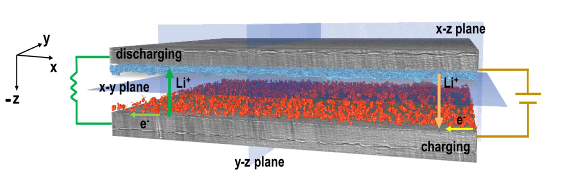
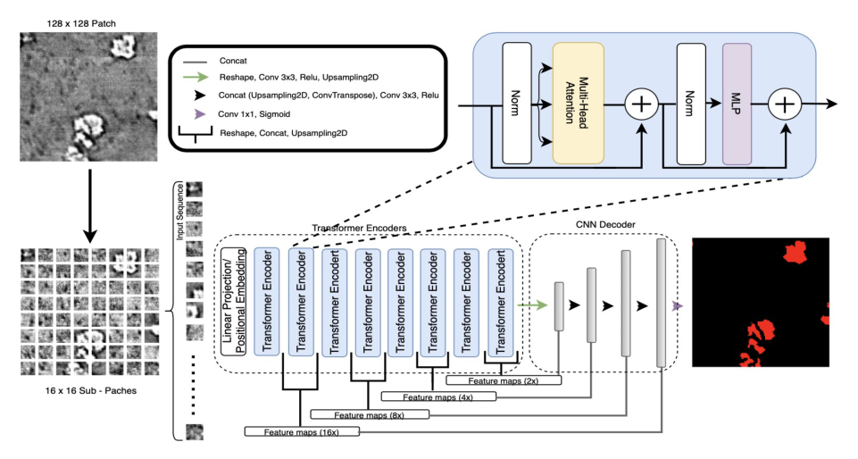

## Abstract

Lithium metal anodes promise high energy density, but uneven plating grows dendrites that can short the cell, and no commercial lithium metal battery exists yet for that reason. Dendrites can be imaged non-destructively with synchrotron X-ray computed tomography (XCT), yet turning a reconstructed volume into a dendrite volume needs pixel-level segmentation, which thresholding does poorly and manual labelling cannot scale to. This paper proposes TransforCNN, a 2D network that encodes each image patch with a stack of Transformer encoders and decodes with a small CNN fed by multi-scale feature maps from the encoder. On one cycled Li–polymer–Li symmetric cell it is compared with U-Net, Y-Net and an ensemble of the three, and scores highest on mean IoU and mean Dice. The authors themselves note that part of the gap may come from imperfect hand labels that reward whichever model copies them most faithfully.

**Keywords:** lithium metal battery, dendrite, X-ray computed tomography, semantic segmentation, Transformer encoder, CNN decoder, U-Net, ensemble, quality control

## 1 Introduction

Lithium is light and has a high theoretical capacity, and with a polymer or ceramic electrolyte the flammable liquid electrolyte can be dropped. The obstacle is dendrite growth: inhomogeneous plating nucleates tree-like, porous lithium structures at the electrode–electrolyte interface. Studying how electrolyte stiffness, current density or surface impurities affect that growth requires measuring dendrites in 3D.

Synchrotron XCT has the micrometre-scale resolution for this, but the images are difficult. Lithium attenuates X-rays weakly, so dendrites look like voids inside the denser polymer. They are porous, so intensity varies within one dendrite. And after repeated cycling, corrosion pits with similar attenuation are easily confused with them.

Earlier operando CT studies of Li–Li cells mostly relied on thresholding — one cited dendrite-volume estimate used a median filter followed by Otsu's method — which the authors say rarely survives beyond a few slices without heavy manual clean-up. Deep segmentation had been applied to battery electrodes (D-LinkNet, U-Net on nano-CT) but not to dendrites. <mark>The gap is narrow and concrete: a reproducible, automatic segmenter for dendrites and redeposited lithium in XCT volumes.</mark>

*Source: Quenum et al., arXiv:2302.04824, Fig. 1, CC BY 4.0.*

## 2 Background

**Sample and scan.** A symmetric cell — two 100 µm lithium foils separated by 140 µm polymer electrolyte membranes, sealed in a pouch — isolates anode behaviour from any cathode chemistry. It was cycled at 1.5 mA/cm² and then scanned at beamline 2-BM of the Advanced Photon Source at 27.5 keV, with 1,500 projections over 180 degrees and 1.33 µm voxels. Three fields of view were stitched and reconstructed with TomoPy's Gridrec algorithm into a raw volume of 3977 × 2575 × 2582. Because that volume was tilted and mostly irrelevant, the authors hand-picked corners on a maximum-intensity projection, rectified each plane with homographies, and cropped to a region of interest of 3849 × 340 × 2071.

**Segmentation models.** U-Net established the symmetric encoder–decoder with skip connections. Y-Net, from the first author's earlier barcode-detection work, runs three branches: regular convolutions, dilated convolutions for sparse targets, and pyramid pooling for multi-scale location cues. ViT showed that self-attention over patch tokens removes the locality bias of convolutions, and later hybrids pair a Transformer on one side with a CNN on the other.

## 3 Method

> **Key idea.** Let self-attention over 16 × 16 sub-patches supply context across the whole 128 × 128 tile, tap the token sequence at several depths to form a feature pyramid, and let a light U-Net-like convolutional decoder turn that pyramid back into a pixel mask.

### 3.1 2D patches instead of a 3D network

The authors deliberately choose a 2D model because it trains faster and needs fewer labelled samples than a volumetric one. Hand-labelled x–y slices are cut into 128 × 128 patches, giving 4,433 patch–mask pairs split 80/10/10 into train, validation and test. Augmentation covers rotations, flips, 2% random crops, shifts, zoom in [0.8, 1], and ±5% brightness and contrast.

### 3.2 TransforCNN

Each patch is divided into 16 × 16 sub-patches, i.e. 64 tokens. Every token is flattened, projected linearly to a 64-dimensional embedding, and summed with a Fourier-feature positional encoding. Eight standard Transformer encoder units follow.

The output of every second encoder unit is reshaped back into a 2D map, concatenated and up-sampled, yielding feature maps at 2×, 4×, 8× and 16× scales. The CNN decoder starts from the final encoder output, applies 3 × 3 convolutions and max-pooling down to 8 × 8, then repeatedly up-samples and concatenates with the encoder-derived map of matching size until it reaches 128 × 128. A 1 × 1 convolution with a sigmoid produces the binary mask.

*Source: Quenum et al., arXiv:2302.04824, Fig. 8, CC BY 4.0.*

### 3.3 Baselines and ensemble

U-Net is resized for 128 × 128 inputs, starting at 16 channels and doubling to 256 at 8 × 8 resolution. Y-Net starts its regular branch at 24 channels and holds its dilated branch at 16. E-Net is a weighted average of model outputs; the best mIoU came from 20% U-Net plus 80% TransforCNN, while the best Dice came from TransforCNN alone.

### 3.4 Losses and metrics

With $y$ the ground-truth label and $\hat y$ the predicted probability, binary cross-entropy is

$$
\mathcal{L}_{\text{BCE}}(y,\hat y) = -y\log\hat y-(1-y)\log(1-\hat y). \tag{1}
$$

The authors also tried a class-balanced version and losses built on the Tversky index, which generalises Dice by weighting false positives and false negatives with $\beta$ and $1-\beta$:

$$
T(y,\hat y)=\frac{y\hat y}{y\hat y+\beta(1-y)\hat y+(1-\beta)\,y(1-\hat y)}, \tag{2}
$$

with the focal Tversky loss defined as $1-T^{\gamma}$, $\gamma=4/3$. <mark>Despite the class imbalance one would expect from sparse dendrites, plain binary cross-entropy gave the best results.</mark>

Evaluation uses Dice and intersection over union, in terms of true positives (TP), false positives (FP) and false negatives (FN):

$$
\text{DSC}=\frac{2\,\text{TP}}{2\,\text{TP}+\text{FP}+\text{FN}},\qquad \text{IoU}=\frac{\text{TP}}{\text{TP}+\text{FP}+\text{FN}}=\frac{\text{DSC}}{2-\text{DSC}}, \tag{3}
$$

averaged over test patches to give mDSC and mIoU.

## 4 Experiments

Each model was trained on a single NVIDIA Tesla V100: U-Net for 450 epochs, Y-Net for 130 and TransforCNN for 300.

| Model | mIoU | mDSC | Latency (ms) | Patch size |
|---|---|---|---|---|
| U-Net | 0.8698 | 0.8998 | 65.36 | 128 × 128 |
| Y-Net | 0.8481 | 0.8790 | 103.62 | 128 × 128 |
| **TransforCNN (T-Net)** | 0.9511 | **0.9647** | 206.75 | 128 × 128 |
| E-Net (ensemble) | **0.9514** | 0.9641 | 473.59 | 128 × 128 |

<mark>TransforCNN improves on U-Net by 8.13 points of mIoU and 6.49 points of mDSC, and on Y-Net by 10.3 and 8.57.</mark> The ensemble adds only 0.03 points of mIoU while more than doubling inference time. <mark>Accuracy has a price: TransforCNN is about 3.16× slower per patch than U-Net, and E-Net 7.24× slower.</mark>

Applied to the whole test volume, the models disagree substantially about how much dendrite there is:

| Model | Segmented volume (voxels) | Share of volume (%) |
|---|---|---|
| U-Net | 54,940,997 | 2.027 |
| Y-Net | 99,389,447 | 3.667 |
| TransforCNN | 82,892,014 | 3.058 |
| E-Net | 80,858,216 | 2.983 |

Y-Net's estimate is roughly 1.8 times U-Net's. For a paper framed around quality control, this spread in the quantity of actual interest arguably matters more than the patch metrics, and there is no independent measurement to judge it against.

*Source: Quenum et al., arXiv:2302.04824, Fig. 11, CC BY 4.0.*

## 5 Discussion

**Strengths.** The problem is real and well motivated, the imaging and preprocessing pipeline is documented well enough to follow, and the architecture is a sensible small-data hybrid: a shallow ViT with 64-dimensional tokens instead of a heavy pretrained backbone. Reporting latency next to accuracy suits an inspection setting.

**The label-noise caveat.** The most interesting passage is the authors' own reading of Figure 3. U-Net and Y-Net segment dendrite-like regions the annotators missed, while TransforCNN and E-Net reproduce the masks as drawn. <mark>The authors speculate that the convolutional models may be "wrongly penalized" by the metrics while TransforCNN is rewarded for matching imperfect ground truth.</mark> If so, part of the 8-point gap measures fidelity to annotator habits, not segmentation quality. A small, carefully relabelled test subset would settle this; none is provided.

**Weaknesses.** Everything comes from one cell, one scan and one plane orientation, and the split is over patches, so neighbouring patches of the same slice can fall on both sides of it. There are no repeated runs or confidence intervals, no ablation of the multi-scale taps, positional encoding or encoder depth, and training lengths differ across models. Baselines are two CNNs only; hybrids the paper itself cites, such as HRNet-OCR, are not run. Training is called weakly supervised with a large unlabelled pool, yet how unlabelled data enter training is not explained.

**Not shown.** No second cell or electrolyte, no comparison with the Otsu thresholding that the introduction criticises, and no separation of dendrites from pits; multi-class segmentation and lower latency are left as future work.

## 6 Takeaways

- A shallow Transformer encoder tapped at several depths plus a convolutional decoder is a workable recipe for small, single-sample scientific imaging datasets.
- On this dataset TransforCNN reaches 0.9511 mIoU against 0.8698 for U-Net at about three times the latency; the ensemble is not worth its cost.
- When labels are incomplete, overlap metrics favour the model that best imitates the annotator. Inspect qualitative disagreements before trusting a leaderboard gap.
- The downstream quantity — dendrite volume fraction — ranges from about 2.0% to 3.7% across models, so the choice of segmenter directly changes the quality-control verdict.

## References

1. J. Quenum, I. Zenyuk, D. Ushizima. *Lithium Metal Battery Quality Control via Transformer-CNN Segmentation.* arXiv:2302.04824, 2023.
2. O. Ronneberger, P. Fischer, T. Brox. *U-Net: Convolutional Networks for Biomedical Image Segmentation.* 2015.
3. J. Quenum, K. Wang, A. Zakhor. *Fast, Accurate Barcode Detection in Ultra High-Resolution Images.* IEEE ICIP, 2021.
4. A. Dosovitskiy et al. *An Image is Worth 16x16 Words: Transformers for Image Recognition at Scale.* ICLR 2021.
5. S. S. M. Salehi, D. Erdogmus, A. Gholipour. *Tversky Loss Function for Image Segmentation Using 3D Fully Convolutional Deep Networks.* 2017.
