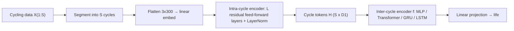

## Abstract

BatteryLife merges thirteen public degradation datasets with three new ones into a single standardised resource for predicting how many cycles a battery will last from its first hundred cycles or fewer. It is about two and a half times larger than the previous largest collection and much broader: besides laboratory lithium-ion cells it contains zinc-ion and sodium-ion cells and large-capacity lithium-ion cells tested by a manufacturer. On top of the data the authors define one preprocessing pipeline, one split protocol and two metrics, and run eighteen models, including architectures that dominate weather, traffic and electricity forecasting. Those imported architectures mostly disappoint. A simple plug-in the authors call CyclePatch, which embeds each cycle as one token, encodes it with a small feed-forward stack and then models the sequence of cycle tokens, gives the best result in every domain. Extra evaluations on unseen aging conditions and on transfer between battery types show that both remain largely unsolved.

**Keywords:** battery life prediction, benchmark dataset, multivariate time series, cycle-level patching, domain shift, zinc-ion, sodium-ion

## 1 Introduction

A battery is conventionally considered spent when its capacity falls to 80% of the initial value. Measuring that point directly means cycling the cell for months or years, so early prediction from the first cycles is valuable for materials screening, protocol optimisation and quality control. The authors argue that the field's empirical footing is weak in three ways.

First, size: the largest prior collection, BatteryML, has 381 end-of-life cells and omits several older and recent datasets. Second, diversity: most datasets contain lithium-ion cells of one format, one chemistry and one temperature, varying only the protocol. Third, comparability: papers differ in datasets, preprocessing, baselines and even task definition, with input lengths anywhere from one cycle to one hundred. As a result <mark>nobody could say whether models such as PatchTST or iTransformer, standard in other time-series fields, are any good for battery life prediction</mark>.

## 2 Background

A degradation test repeats charge–discharge cycles under a preset protocol in a temperature chamber. At each instant either voltage $V$ or current $I$ is imposed by the protocol and the other responds to the cell's internal state. Capacity over a time window is the integrated absolute current,

$$
Q_i = \int_{t_1}^{t_2} \lvert I \rvert \, dt , \tag{1}
$$

and the state of health at cycle $i$ is

$$
\mathrm{SOH}_i = Q_i / Q_0 , \tag{2}
$$

with $Q_i$ usually the discharge capacity and $Q_0$ the nominal capacity (some works use the first-cycle capacity instead). Life is the first cycle at which SOH is no larger than 80%.

**Task.** The input is the voltage, current and capacity series of the first $S \le 100$ cycles, $X_{1:S}$; the output is a scalar life $y$. An *aging condition* is a unique combination of format, anode, cathode, electrolyte, charge protocol, discharge protocol, temperature, nominal capacity and manufacturer. [Fig. 2 in the paper](https://arxiv.org/pdf/2502.18807#page=4) shows a few cycles from a Li-ion, a Zn-ion, a Na-ion and an industrial cell; voltage shapes, charging stages and current magnitudes differ sharply.

## 3 Dataset and benchmark design

> **Key idea.** Battery cycling data are not a generic long multivariate series. They are a sequence of near-repeating units, and the information about lifetime sits in how voltage, current and capacity interact *inside* a unit and how that interaction drifts *across* units. CyclePatch is the minimal architecture that respects this structure.

### 3.1 The dataset

Sixteen sources, all converted to one file format with unified naming. Counts are after preprocessing.

| | Cells | Formats | Chemical systems | Temperatures | Protocols | Source |
|---|---|---|---|---|---|---|
| BatteryML (previous largest) | 381 | 2 | 5 | 5 | 186 | lab |
| **BatteryLife** | **990** | **8** | **59** | **9** | **421** | lab + industrial |

The data are split into four domains that are evaluated separately: Li-ion (837 cells, 13 chemical systems, 406 protocols, the union of the public sets), Zn-ion (95 cells across 45 chemical systems under one protocol), Na-ion (31 cells, one chemistry, 12 protocols) and CALB (27 large-capacity Li-ion cells from an EV battery manufacturer, four temperatures). <mark>The Zn-ion, Na-ion and industrial CALB sets are released here for the first time.</mark> Because every prefix length $S$ from 1 to 100 counts as a sample, the 990 cells yield about 90,000 samples.

**Labels.** For cells that stop above the threshold $\lambda$, life is linearly extrapolated if final SOH is within 2.5 percentage points of $\lambda$; otherwise the cell is dropped rather than labelled with its last recorded cycle. $\lambda$ is 80% except for CALB, where it is 90% and $Q_0$ is the first-cycle capacity, since most of those cells never reach 80%.

**Preprocessing and protocol.** Charge and discharge segments of every cycle are each linearly resampled to 150 points of (voltage, current, capacity), so one cycle is 300 points and a full input up to 30,000. Splits are random 6:2:2, the loss is MSE with Adam, hyperparameters are chosen on validation, and each configuration is run three times. Metrics are MAPE and 15%-accuracy, the share of test samples with relative error at most 15%:

$$
\alpha\text{-acc} = \frac{1}{N}\sum_{i=1}^{N} \mathbf{1}\bigl[\,\lvert y_i - \hat y_i\rvert \le \alpha\, y_i\,\bigr], \qquad \alpha = 0.15 . \tag{3}
$$

### 3.2 Baselines

Seven models customary in the battery literature (MLP, CNN on a $3\times100\times300$ image-like tensor, Transformer encoder, LSTM, BiLSTM, GRU, BiGRU), five general forecasters (DLinear, PatchTST, Autoformer, iTransformer, MICN), and a dummy that predicts the training mean.

### 3.3 CyclePatch

Each cycle $X_i$ is flattened to 900 numbers and embedded, $\hat X_i = W\,\mathrm{flatten}(X_i) + b$ with $W \in \mathbb{R}^{D_1\times 900}$. An intra-cycle encoder of $L$ residual feed-forward blocks refines each token independently:

$$
z_i^{l} = \mathrm{LN}\!\bigl(W_2^{l}\,\sigma(W_1^{l} z_i^{l-1} + b_1^{l}) + b_2^{l} + z_i^{l-1}\bigr), \qquad z_i^{0} = \hat X_i . \tag{4}
$$

The tokens are stacked into $H \in \mathbb{R}^{S\times D_1}$ and passed to an interchangeable inter-cycle encoder, $\hat y = \mathrm{Proj}(f(H))$. Models using it carry the prefix "CP".

## 4 Experiments

Main results, test MAPE / 15%-Acc (means over three runs; the paper also gives standard deviations). Bold marks the best value per column.

| Model | Li-ion | Zn-ion | Na-ion | CALB |
|---|---|---|---|---|
| Dummy | 0.831 / 0.296 | 1.297 / 0.083 | 0.404 / 0.067 | 1.811 / 0.267 |
| DLinear | 0.586 / 0.275 | 0.814 / 0.124 | 0.319 / 0.329 | 0.164 / 0.601 |
| MLP | 0.233 / 0.503 | 0.805 / 0.079 | 0.281 / 0.364 | 0.149 / 0.641 |
| PatchTST | 0.288 / 0.430 | 0.716 / 0.133 | 0.396 / 0.258 | 0.347 / 0.511 |
| Autoformer | 0.437 / 0.287 | 0.987 / 0.106 | 0.372 / 0.177 | 0.761 / 0.329 |
| iTransformer | 0.209 / 0.516 | 0.690 / 0.188 | 0.321 / 0.249 | 0.164 / 0.649 |
| CNN | 0.337 / 0.371 | 0.928 / 0.115 | 0.307 / 0.273 | 0.278 / 0.582 |
| MICN | 0.249 / 0.494 | 0.579 / 0.227 | 0.305 / 0.335 | 0.233 / 0.471 |
| CPGRU | 0.189 / 0.585 | 0.616 / 0.289 | 0.298 / 0.203 | 0.141 / 0.681 |
| CPTransformer | 0.184 / 0.573 | **0.515** / 0.202 | **0.255** / **0.406** | 0.149 / 0.672 |
| CPMLP | **0.179** / **0.620** | 0.558 / **0.297** | 0.274 / 0.337 | **0.140** / **0.704** |

The vanilla Transformer runs out of memory on 30,000-step inputs, and plain GRU/LSTM variants did not converge within 24 hours on eight GPUs; both become usable once cycles are tokens.

<mark>A CyclePatch model is best in every domain</mark>, with CPMLP and CPTransformer sharing the honours. <mark>Models built around trend–seasonal decomposition (DLinear, Autoformer, MICN) do poorly, and a plain MLP beats DLinear by a wide margin</mark>: the period is known and fixed, so learning seasonality is wasted capacity, while the useful signal is fine-grained coupling between the three variables. And CPTransformer without its intra-cycle encoder, which is essentially PatchTST minus reversible instance normalisation, still beats PatchTST in every domain, from which the authors infer that <mark>RevIN damages the cross-variable relationships the task depends on</mark>. iTransformer's one-token-per-variable design loses the temporal locality of those relationships.

**Ablation.** Removing either encoder hurts. For CPMLP on Li-ion, MAPE goes from 0.179 to 0.202 without the intra-cycle encoder and to 0.199 without the inter-cycle encoder; on Na-ion and CALB either half-ablated variant is worse than the plain MLP.

**Input length.** [Fig. 5 in the paper](https://arxiv.org/pdf/2502.18807#page=6) plots error against the number of usable cycles: it falls, then flattens, and the ranking of the top models changes with $S$.

**Unseen aging conditions.** Performance generally drops for conditions absent from training: CPTransformer on Li-ion goes from 0.157 to 0.211 MAPE, and on Na-ion two of the three top models score 0.000 in 15%-accuracy on unseen conditions.

**Cross-domain transfer.** CPMLP pretrained on Li-ion is applied to the other domains. Frozen, it is useless (MAPE 3.153 on Zn-ion, 4.115 on Na-ion, 1.536 on CALB). <mark>Fine-tuning and MMD-based domain adaptation recover, but mostly fail to beat a model trained on the target domain alone</mark>; the one visible gain is CALB 15%-accuracy, 0.767 fine-tuned against 0.704.

## 5 Discussion

**Strengths.** The consolidation work is the main value: a common format, an explicit label policy, and genuinely new chemistries and industrial data. The negative results are informative because they are tied to design choices (decomposition, RevIN, variate tokens) rather than to model names, and the authors report transfer results that make their own method look unfinished.

**Weaknesses.** Splits are random over cells, so the headline table mixes in-distribution and out-of-distribution performance; the unseen-condition table is the more honest measure and is reported only for the top three models. Three runs is few given standard deviations that reach 0.2 on the small domains, where test sets hold a handful of cells and rankings are fragile. Counting every prefix length as a sample makes "90,000 samples" sound larger than 990 independent cells. The RevIN conclusion is inferred from a near-equivalence between two architectures, not from toggling RevIN in one model. The text quotes the best CALB MAPE as 0.141 while the table's best entry is 0.140. No feature-engineered classical baseline and no pairwise method such as BatLiNet is included, so the link to the earlier literature is loose.

**Not shown.** No uncertainty estimates, no field data with irregular usage, and no prediction of the full SOH trajectory; the target is a single scalar.

## 6 Takeaways

- BatteryLife is currently the broadest public testbed for early life prediction: 990 cells, 59 chemical systems, 421 protocols, including Zn-ion, Na-ion and manufacturer-tested cells.
- Tokenise by the physical unit of repetition. One token per cycle, a per-token encoder, then a sequence model beats generic patching and makes Transformers and RNNs tractable on 30,000-step inputs.
- Forecasting tricks are not free: seasonal–trend decomposition and per-instance normalisation discard exactly the level and cross-variable information this task needs.
- Generalisation across aging conditions and transfer across battery types remain open; Li-ion pretraining plus fine-tuning does not beat training from scratch on the target.
- For financial series the cautionary part carries over more honestly than the architecture: instance normalisation and decomposition blocks tuned on weather or electricity benchmarks can erase level and cross-channel structure (volatility level, price–volume coupling), so they should be ablated rather than assumed. The cycle-token idea itself relies on a fixed, known period that markets do not offer beyond the trading day.

## References

1. R. Tan, W. Hong, J. Tang, X. Lu, R. Ma, X. Zheng, J. Li, J. Huang, T.-Y. Zhang. *BatteryLife: A Comprehensive Dataset and Benchmark for Battery Life Prediction.* KDD 2025. arXiv:2502.18807.
2. K. A. Severson et al. *Data-driven prediction of battery cycle life before capacity degradation.* Nature Energy 4, 2019.
3. Y. Nie, N. H. Nguyen, P. Sinthong, J. Kalagnanam. *A Time Series is Worth 64 Words: Long-term Forecasting with Transformers.* ICLR 2023.
4. Y. Liu et al. *iTransformer: Inverted Transformers Are Effective for Time Series Forecasting.* ICLR 2024.
5. T. Kim et al. *Reversible Instance Normalization for Accurate Time-Series Forecasting against Distribution Shift.* ICLR 2022.
