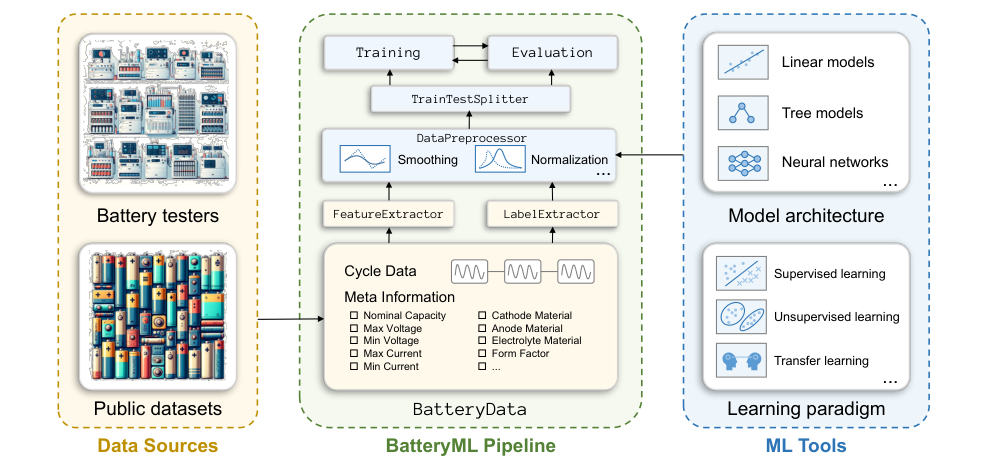
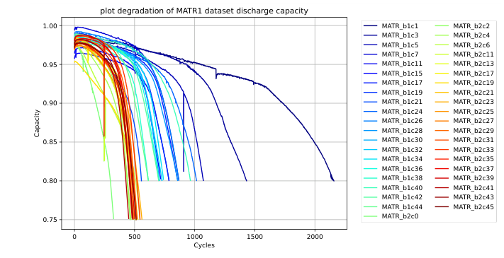
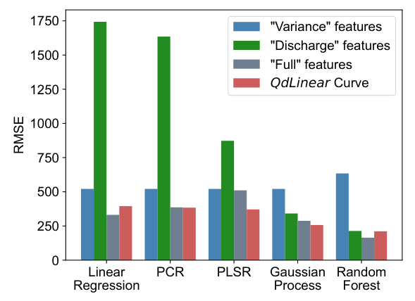

## Abstract

Data-driven battery degradation research is split across incompatible cycler formats, dataset-specific code and problem definitions that change from paper to paper, so results are hard to reproduce and harder to compare. BatteryML is an open-source Python platform that answers this with a single cell-level data structure, a library of expert-designed features, automatic labelling for three standard tasks, and ready-made linear, tree and neural baselines. On top of it the authors build a benchmark from seven public data sources and eight derived datasets, including a merged set they describe as the largest with complete cycling records. The main empirical finding is usefully negative: the best model changes from dataset to dataset, linear models on a raw capacity–voltage curve are hard to beat on small single-chemistry sets, and neural networks are strongly seed-dependent. This is a tooling and benchmarking paper, not a new algorithm.

**Keywords:** lithium-ion batteries, degradation modelling, remaining useful life, state of health, state of charge, unified data format, benchmark, early life prediction

## 1 Introduction

Lithium-ion cells lose capacity with cycling through loss of lithium inventory and loss of active material, and these mechanisms interact non-linearly enough that mechanistic models struggle at the cell level. The field has therefore moved toward learned predictors of remaining useful life (RUL), state of health (SOH) and state of charge (SOC).

The authors argue that progress is held back by three practical obstacles, none of which is a shortage of models:

- **Data heterogeneity.** Testers differ in recorded fields, sampling granularity and file types; even "capacity" may mean areal, total or normalised capacity. LCO, LFP and NMC cathodes also age differently.
- **Domain knowledge.** ML researchers do not know which parts of a high-dimensional cycling record matter.
- **Model development.** Battery scientists know the mechanisms but not the data-cleaning and tuning workflow, and code written for one dataset rarely transfers.

<mark>The central claim is that the missing piece is a shared standard — data format plus evaluation protocol — and not another model.</mark> The closest prior tool, BEEP, targets battery experts who code and offers linear early-prediction models; BatteryML tries to decouple the two communities behind a stable interface.

## 2 Background

SOH compares what a cell delivers now with what it delivered when new:

$$
\text{SOH} = \frac{C_{\text{full}}}{C_{\text{nom}}}\times 100\%, \tag{1}
$$

where $C_{\text{nom}}$ is the nominal capacity and $C_{\text{full}}$ the full discharge capacity in the current cycle. Strictly, $C_{\text{full}}$ should be measured under the nominal protocol, which requires reference cycles that are rarely available. SOC is the within-cycle counterpart,

$$
\text{SOC} = \frac{C_{\text{curr}}}{C_{\text{full}}}\times 100\%, \tag{2}
$$

with $C_{\text{curr}}$ the remaining capacity. SOH needs one prediction per cycle and SOC one per time step, so SOC is the most demanding in real time.

RUL, in the early-prediction form popularised by Severson et al. (2019), is offline: observe the first cycles and predict when capacity falls below a threshold, typically 80% of nominal. The anchor feature of that literature is discharge capacity as a function of voltage, $Q_d(V)$, differenced between a late and an early cycle,

$$
\Delta Q_{100-10}(V) = Q_{d,100}(V) - Q_{d,10}(V), \tag{3}
$$

whose log-variance is the single scalar behind Severson's "Variance" model.

## 3 What the platform provides

> **Key idea.** Put every cell, whatever its source, into one object holding metadata and a list of cycles; then make split, features, labels, preprocessing and model independent modules chosen from a config file, so that swapping one never touches the others.

*Source: Zhang et al., arXiv:2310.14714, Fig. 1, CC BY 4.0.*

### 3.1 BatteryData

Metadata covers cathode, anode and electrolyte materials, form factor, nominal capacity, and voltage and current limits. The cycling record is a list of cycles, each holding the protocol and time series of capacity, voltage, current, time, temperature and internal resistance. Converters exist for raw cycler output and for the public datasets. Everything is tensor-friendly, so one object feeds both scikit-learn and PyTorch, and built-in plotting gives quick views such as per-cell capacity fade.

*Source: Zhang et al., arXiv:2310.14714, Fig. 2, CC BY 4.0.*

### 3.2 Feature library

*Within-cycle* features include `QdLinear` (the capacity–voltage discharge curve resampled by linear interpolation), Coulombic efficiency, and internal resistance. *Between-cycle* features summarise trends: the variance of differenced `QdLinear` curves as in Eq. (3), the slope of early capacity decay, average charging time, temperature dynamics, and minimum internal resistance.

### 3.3 Automatic labels

The label extractor walks through each cycle's charge and discharge stages and computes RUL, SOH or SOC targets from their definitions. <mark>This is the module that most directly removes the need for battery expertise on the ML side.</mark> Because reference performance tests are absent from most public data, the benchmark's SOH and SOC labels are derived from observed discharge capacity, an approximation the authors flag.

### 3.4 Models and splits

Baselines are a dummy mean predictor; the "Variance", "Discharge" and "Full" linear models on hand-crafted features; ridge, PCR, PLSR, Gaussian process, XGBoost and random forest; and MLP, CNN, LSTM and a Transformer, the last introduced as a new neural baseline. The CNN treats cycle index and voltage grid as image height and width. The original train–test splits of MATR and HUST are shipped so numbers stay comparable; random and custom splits are also supported.

## 4 Experiments

**Data.** Seven sources: CALCE (13 cells, LCO), MATR (180, LFP), HUST (77, LFP), HNEI (14, NMC-LCO blend), RWTH (48, NMC), SNL (61, NCA/NMC/LFP) and UL-PUR (10, NCA). Eight RUL datasets follow. MATR1 and MATR2 use the Severson split, with MATR2 testing on unseen charging policies; CLO randomly splits all MATR cells; CRUH pools the four small sources; CRUSH adds short-lived SNL cells and asks for the 90% SOH point from only 20 cycles; MIX pools everything.

**Protocol.** Statistical models take the $\Delta Q_{100-10}$ curve; neural models take the `QdLinear` curves of cycles 1–100 with cycle 10 subtracted. Seed-sensitive models are run ten times. The metric is test RMSE in cycles.

| Model | MATR1 | MATR2 | HUST | SNL | CLO | CRUH | CRUSH | MIX |
|---|---|---|---|---|---|---|---|---|
| Dummy regressor | 398 | 510 | 419 | 466 | 331 | 239 | 576 | 573 |
| "Variance" model | 136 | 211 | 398 | 360 | 179 | 118 | 506 | 521 |
| "Discharge" model | 329 | **149** | **322** | 267 | 143 | 76 | >1000 | >1000 |
| "Full" model | 167 | >1000 | 335 | 433 | **138** | 93 | >1000 | 331 |
| Ridge regression | 116 | 184 | >1000 | 242 | 169 | 65 | >1000 | 372 |
| PCR | **90** | 187 | 435 | **200** | 197 | 68 | 560 | 376 |
| PLSR | 104 | 181 | 431 | 242 | 176 | **60** | 535 | 383 |
| Gaussian process | 154 | 224 | >1000 | 251 | 204 | 115 | >1000 | 573 |
| XGBoost | 334 | 799 | 395 | 547 | 215 | 119 | **330** | 205 |
| Random forest | 168 ± 9 | 233 ± 7 | 368 ± 7 | 532 ± 25 | 192 ± 2 | 81 ± 1 | 416 ± 5 | **197 ± 0** |
| MLP | 149 ± 3 | 275 ± 27 | 459 ± 9 | 370 ± 81 | 146 ± 5 | 103 ± 4 | 565 ± 9 | 451 ± 42 |
| CNN | 102 ± 94 | 228 ± 104 | 465 ± 75 | 924 ± 267 | >1000 | 174 ± 92 | 545 ± 11 | 272 ± 101 |
| LSTM | 119 ± 11 | 219 ± 33 | 443 ± 29 | 539 ± 40 | 222 ± 12 | 105 ± 10 | 519 ± 39 | 268 ± 9 |
| Transformer | 135 ± 13 | 364 ± 25 | 391 ± 11 | 424 ± 23 | 187 ± 14 | 81 ± 8 | 550 ± 21 | 271 ± 16 |

*RUL test RMSE (cycles), mean ± std over ten seeds where applicable; best per column in bold (Table 2 of the paper).*

<mark>Eight datasets produce six different winners, and none of them is a neural network.</mark> Hand-crafted features with a linear model win on the single-chemistry LFP sets (MATR2, HUST, CLO); PCR and PLSR on the raw difference curve win MATR1, SNL and CRUH; tree ensembles win only once the data are large and mixed (CRUSH, MIX), where the expert-feature models exceed 1000 cycles of error.

The CNN row deserves a note. Its MATR1 mean of 102 hides a per-seed breakdown in which nine of ten runs land between 60 and 82 and one reaches 367. <mark>On most seeds the CNN beats every other MATR1 entry, yet a single bad initialisation ruins the average.</mark>

A feature ablation on MIX shows the feature–model interaction from the other side.

*Source: Zhang et al., arXiv:2310.14714, Fig. 5, CC BY 4.0.*

For SOH the paper reports tree-based models as the most consistent, linear models struggling on MATR because of its varied charging policies, and deep models not reliably improving on either. For SOC, LightGBM is best on most tasks and linear models still beat the neural ones. I have not retyped those appendix tables.

## 5 Discussion

**Strengths.** The value is in the unglamorous parts: converters, a stable schema, fixed splits and honest baselines. Printing a dummy regressor and ">1000" failures makes the table trustworthy, and the seed-level CNN breakdown is a detail benchmark papers usually omit. <mark>The cross-dataset view also makes a substantive point: features engineered for LFP/graphite cells do not carry over to mixed chemistries, which argues for learned representations even though current networks do not yet deliver them.</mark>

**Weaknesses.** There is no methodological novelty, and none is claimed. Evaluation is one RMSE per dataset: no relative error, prediction intervals or calibration, although a Gaussian process is among the baselines. Several datasets are tiny (the sources pooled into CRUH have 13, 48, 10 and 14 cells), so gaps of a few cycles between PCR and PLSR are unlikely to be significant, and no tests are given. Neural baselines look lightly tuned, so "deep models lose" describes these configurations only.

**Not shown.** Transfer and multi-task learning are named as things the format enables, but no experiment demonstrates them. SOH and SOC labels are proxies. There is no study of how much early data is needed beyond the fixed 100-cycle (or 20-cycle) window.

## 6 Takeaways

- The contribution is infrastructure: one cell schema, modular feature/label/model stages, and reproducible splits over seven public sources.
- For early life prediction, PCR or PLSR on $\Delta Q_{100-10}(V)$ is the baseline to beat before a deep model is worth reporting.
- Expert features are chemistry-specific; once datasets are pooled, tree ensembles on raw curves take over.
- Neural results need multi-seed reporting — one CNN seed out of ten moved a mean RMSE from the low 70s to above 100.
- For financial time series the link is methodological only: small samples, regime-dependent winners and seed-sensitive deep models are the conditions a forecasting benchmark there must also be designed around, with a trivial baseline and per-seed spread reported.

## References

1. H. Zhang, X. Gui, S. Zheng, Z. Lu, Y. Li, J. Bian. *BatteryML: An Open-source Platform for Machine Learning on Battery Degradation.* ICLR 2024. arXiv:2310.14714.
2. K. A. Severson et al. *Data-driven prediction of battery cycle life before capacity degradation.* Nature Energy, 2019.
3. P. M. Attia, K. A. Severson, J. D. Witmer. *Statistical learning for accurate and interpretable battery lifetime prediction.* Journal of The Electrochemical Society, 2021.
4. P. Herring et al. *BEEP: A Python library for Battery Evaluation and Early Prediction.* SoftwareX, 2020.
5. G. Ma et al. *Real-time personalized health status prediction of lithium-ion batteries using deep transfer learning.* Energy & Environmental Science, 2022.
