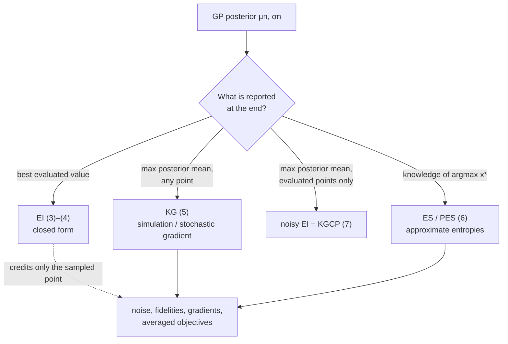

## Abstract

Bayesian optimisation (BayesOpt) maximises a function that is costly to evaluate, gives no gradients, and has a modest number of continuous inputs. It keeps a Gaussian-process (GP) posterior over the function and evaluates wherever an *acquisition function* built from that posterior is largest. Frazier treats the GP only as far as needed and concentrates on the acquisition step, deriving expected improvement (EI), the knowledge gradient (KG) and entropy search (ES/PES) from one question: what is the reward if this is the last evaluation? He then surveys the "exotic" variants — noise, batches, constraints, multiple fidelities, averaged objectives, gradients — and argues for one particular generalisation of EI to noisy observations. There are no experiments.

**Keywords:** Bayesian optimisation, Gaussian process regression, expected improvement, knowledge gradient, entropy search, multi-fidelity optimisation, surrogate models

## 1 Introduction

The problem is $\max_{x\in A} f(x)$ under specific hardships: <mark>a small input dimension (most successful applications have $d\le 20$), a feasible set that is a box or simplex, and a budget of a few hundred evaluations</mark>, each costing hours, money, or a human subject's patience. The function is continuous, has no exploitable structure, returns no derivatives, and a global optimum is wanted.

The approach goes back to Kushner (1964), Žilinskas and Močkus, and was popularised by the Efficient Global Optimization (EGO) algorithm of Jones, Schonlau and Welch (1998): a GP surrogate with EI. Snoek et al. (2012) brought it into machine learning as a hyperparameter tuner. It sits inside a wider family of "surrogate methods" that fit a cheap model and use it to place evaluations; BayesOpt is the member whose surrogate is a Bayesian posterior and whose placement rule is a Bayesian decision.

Where does the standard recipe fail? EI assumes the only way an evaluation helps is by giving a better value *at the evaluated point*. That holds when observations are exact and only seen points may be reported. It breaks when observations are noisy, when an evaluation is a cheap low-fidelity proxy, when it covers one fold of an averaged objective, or when it returns a gradient: then the evaluation's value appears elsewhere in the domain, and <mark>a rule that credits only the sampled point undervalues — sometimes assigns exactly zero to — the evaluations that matter</mark>. Most of the tutorial is about this gap.

## 2 Background

A GP with mean $\mu_0$ and kernel $\Sigma_0$ makes function values at any finite set of points jointly normal:

$$
f(x_{1:k}) \sim \mathcal{N}\!\big(\mu_0(x_{1:k}),\; \Sigma_0(x_{1:k},x_{1:k})\big).
\tag{1}
$$

$\mu_0(x_{1:k})$ stacks prior means; $\Sigma_0(x_{1:k},x_{1:k})$ is the matrix of pairwise kernel values. Conditioning on exact observations gives, at a new $x$,

$$
\begin{aligned}
\mu_n(x) &= \mu_0(x) + \Sigma_0(x,x_{1:n})\,\Sigma_0(x_{1:n},x_{1:n})^{-1}\big(f(x_{1:n})-\mu_0(x_{1:n})\big),\\
\sigma_n^2(x) &= \Sigma_0(x,x) - \Sigma_0(x,x_{1:n})\,\Sigma_0(x_{1:n},x_{1:n})^{-1}\,\Sigma_0(x_{1:n},x).
\end{aligned}
\tag{2}
$$

The mean is the prior mean plus a kernel-weighted residual; the variance is prior variance minus what the data explain. This is exact given the kernel. With noise of variance $\tau^2$ one adds $\tau^2 I$ to the inverted matrix, usually treating $\tau^2$ as a hyperparameter.

Kernels are the power-exponential (Gaussian) kernel, $\alpha_0\exp(-\sum_i\alpha_i(x_i-x_i')^2)$, or Matérn with smoothness $\nu$; the weights $\alpha_{1:d}$ act as inverse squared length-scales and encode how fast $f$ varies ([Fig. 2 in the paper](https://arxiv.org/pdf/1807.02811#page=5) shows sample paths as $\alpha_1$ shrinks). The mean is a constant, optionally plus a polynomial trend. Hyperparameters are set by maximum likelihood, by MAP with a prior that keeps length-scales reasonable, or integrated out by MCMC; MAP is the point-mass approximation of the fully Bayesian route.

## 3 Method

> **Key idea.** Pretend the next evaluation is the last. State what you will report when you stop and what it is worth, take the expected gain under the current posterior, and evaluate where it is largest. EI, KG and ES are this recipe with three definitions of "what you report".

The loop (the paper's Algorithm 1): GP prior; $n_0$ points from a space-filling design; then repeatedly update the posterior, maximise the acquisition, evaluate, until the budget $N$ is spent; report the best evaluated point or the maximiser of the posterior mean.

> **My comment.** When I used this loop to tune the hyper-g/n prior in my factor-selection project, BO did its job as an optimiser (median regret 0 by evaluation 9, while random search and Sobol had not converged after 20), and the tuned prior then priced slightly worse held out than the default. Nothing in the choice between EI, KG and ES addresses that. Before picking an acquisition rule I would now ask whether the objective I can evaluate is the one I actually care about.

### 3.1 Expected improvement: reward = best value seen

Assume exact observations and that only evaluated points may be reported. Stopping now yields $f_n^\ast=\max_{m\le n}f(x_m)$; one more evaluation at $x$ raises this by $[f(x)-f_n^\ast]^+$. Hence

$$
\mathrm{EI}_n(x) = \mathbb{E}_n\big[\,(f(x)-f_n^\ast)^+\,\big],
\qquad
f(x)\mid\text{data}\sim\mathcal{N}\big(\mu_n(x),\sigma_n^2(x)\big),
\tag{3}
$$

with $\mathbb{E}_n$ the posterior expectation. Write $f(x)=\mu_n+\sigma_n Z$ and $\Delta_n=\mu_n(x)-f_n^\ast$. The gain is positive exactly when $Z>-\Delta_n/\sigma_n$, and using $\int_a^\infty\varphi=\Phi(-a)$, $\int_a^\infty z\varphi(z)\,dz=\varphi(a)$,

$$
\mathrm{EI}_n(x)=\int_{-\Delta_n/\sigma_n}^{\infty}(\Delta_n+\sigma_n z)\,\varphi(z)\,dz
=\Delta_n\,\Phi\!\Big(\frac{\Delta_n}{\sigma_n}\Big)+\sigma_n\,\varphi\!\Big(\frac{\Delta_n}{\sigma_n}\Big).
\tag{4}
$$

The first term rewards a high posterior mean (exploitation), the second posterior spread (exploration). Every step is exact given the GP. Because (4) is cheap and smooth, $\arg\max_x\mathrm{EI}_n$ is found with a gradient method; the author reports good results with L-BFGS-B. <mark>EI increases in both $\Delta_n$ and $\sigma_n$, and its level curves in the $(\Delta_n,\sigma_n)$ plane are an explicit exchange rate between exploitation and exploration</mark> ([Fig. 3 in the paper](https://arxiv.org/pdf/1807.02811#page=8)). [Fig. 1 in the paper](https://arxiv.org/pdf/1807.02811#page=4) shows one iteration on a 1-D function: a credible band that pinches to zero at the three observations and an EI curve that vanishes there and peaks where the band is wide and the mean high.

### 3.2 Knowledge gradient: reward = best posterior mean

Now allow reporting *any* point, valued risk-neutrally by its posterior mean. Stopping now gives $\mu_n^\ast=\max_{x'}\mu_n(x')$; after one more evaluation at $x$ the posterior mean becomes $\mu_{n+1}$, and

$$
\mathrm{KG}_n(x)=\mathbb{E}_n\big[\,\mu_{n+1}^\ast-\mu_n^\ast \;\big|\; x_{n+1}=x\,\big],
\qquad \mu^\ast_{n+1}=\max_{x'}\mu_{n+1}(x').
\tag{5}
$$

The expectation is over the unseen observation $y_{n+1}$. <mark>KG credits an evaluation for raising the maximum of the posterior mean anywhere, not for being good itself</mark> — which is how a noisy reading, a cheap fidelity or a gradient earns value.

There is no closed form on a continuous domain. The paper offers a Monte Carlo estimate (draw $y_{n+1}$, update, re-maximise, average; Algorithm 2), exact computation on a discretised $A$ (Frazier et al., 2009; low dimension only), and multistart stochastic gradient ascent (Wu & Frazier, 2016; Algorithms 3–4). The gradient comes from exchanging $\nabla$ and $\mathbb{E}$ (infinitesimal perturbation analysis) and from the envelope theorem: with $Z$ fixed, find the maximiser $\hat x^\ast$ of $\mu_{n+1}$ and differentiate $\mu_{n+1}(\hat x^\ast)$ in $x$ holding $\hat x^\ast$ fixed. Both need regularity conditions that are not spelled out. The gradient is unbiased; the optimum it finds is approximate.

### 3.3 Entropy search: reward = information about the maximiser

Treat the maximiser $x^\ast$ as random under the posterior and evaluate where its entropy is expected to fall most. By the symmetry of mutual information,

$$
\mathrm{ES}_n(x)=H\big(P_n(x^\ast)\big)-\mathbb{E}_{f(x)}\big[H\big(P_n(x^\ast\mid f(x))\big)\big]
=H\big(P_n(f(x))\big)-\mathbb{E}_{x^\ast}\big[H\big(P_n(f(x)\mid x^\ast)\big)\big]=\mathrm{PES}_n(x),
\tag{6}
$$

with $H$ differential entropy. The left form needs the entropy of a GP's argmax, which has no closed form, and has no known stochastic-gradient scheme. In the right form (PES) the first term is a normal entropy; the second uses sampled $x^\ast$ and expectation propagation. <mark>The two agree only if computed exactly; their approximations differ, so in practice they pick different points.</mark>

### 3.4 Noisy EI — the one new argument

With noise, (3) is ill-posed: the best value seen is not observed, and neither is $f(x)$. Common patches substitute the best posterior mean at evaluated points for $f_n^\ast$ and some normal distribution for $f(x)$; the paper calls these heuristic. Its proposal keeps EI's defining restriction — report only evaluated points — and redoes the one-step analysis:

$$
\mathbb{E}_n\big[\,\mu^{\ast\ast}_{n+1}-\mu^{\ast\ast}_n \;\big|\; x_{n+1}=x\,\big],
\qquad
\mu^{\ast\ast}_n=\max_{i\le n}\mu_n(x_i),\quad
\mu^{\ast\ast}_{n+1}=\max_{i\le n+1}\mu_{n+1}(x_i).
\tag{7}
$$

This is KG with the argmax restricted to evaluated points. Scott, Frazier and Powell (2011) introduced it as "KGCP", an approximation to KG; <mark>Frazier argues it is better read as the principled noisy version of EI</mark>. With noise a new observation also moves $\mu_{n+1}$ at old points, so (7) is harder than EI and easier than KG.

### 3.5 Intuition: two alternatives, one noisy measurement

My own calculation, not the paper's. Alternative 1 is known to be worth $1$; alternative 2 has posterior $\mathcal{N}(0.5,1)$, independent. We may measure alternative 2 once, with noise sd $\tau$.

Without noise, the gain from measuring is $(f_2-1)^+$: EI with $\Delta=-0.5$, $\sigma=1$, i.e. $\approx 0.198$, and KG coincides. With noise, the posterior mean of alternative 2 moves by a normal amount with sd $\tilde\sigma=\sigma^2/\sqrt{\sigma^2+\tau^2}$, and KG is (4) with $\tilde\sigma$:

| noise sd $\tau$ | $\tilde\sigma$ | KG of measuring alt. 2 |
|---|---|---|
| 0 | 1.000 | 0.198 |
| 0.5 | 0.894 | 0.161 |
| 1 | 0.707 | 0.100 |
| 2 | 0.447 | 0.030 |
| 4 | 0.243 | 0.002 |

The heuristic that keeps the distribution of $f(x)$ in (3) would say $0.198$ in every row, pricing a measurement that barely moves the posterior as if it revealed the truth. This is Bayesian ranking and selection, where KG originated.

Limiting cases of (4): as $\sigma_n\to0$, EI $\to\Delta_n^+$ (no exploration); at $\Delta_n=0$, EI $=\sigma_n\varphi(0)\approx0.399\,\sigma_n$. So a point with $\Delta=0,\sigma=1$ (0.399) beats $\Delta=0.3,\sigma=0.2$ (0.306), which barely beats the near-certain $\Delta=0.3,\sigma=0.05$ (0.300).



### 3.6 Algorithm

```text
INPUT  box A, budget N, initial design size n0, kernel family, acquisition in {EI, KG}

x_1..x_n0 <- space-filling design on A;  y_i <- f(x_i) (+ noise);  n <- n0
while n < N:
    eta <- fit GP hyperparameters on (x_1:n, y_1:n)            # MLE, MAP, or MCMC
    mu_n, sigma_n via Cholesky of K + (tau^2 + 1e-6) I
    if EI:
        Delta(x) <- mu_n(x) - max_i y_i
        x_next <- multistart L-BFGS-B on Delta*Phi(Delta/sigma_n) + sigma_n*phi(Delta/sigma_n)
    if KG:                                                # paper: R=10, T=100, a=4, J=1000
        for r = 1..R:
            x <- uniform draw from A
            for t = 1..T:
                G <- 0
                for j = 1..J:
                    Z ~ N(0,1);  y <- mu_n(x) + s(x) Z          # s = sigma_n (noise-free) or shrunk sd (noisy)
                    x_hat <- argmax_x' mu_{n+1}(x'; x, y)          # inner L-BFGS
                    G <- G + grad_x mu_{n+1}(x_hat; x, mu_n(x) + s(x) Z) / J    # x_hat held fixed
                x <- project_A( x + a/(a+t) * G )
            score_r <- Monte Carlo KG(x) with J draws
        x_next <- x with best score_r
    y_next <- f(x_next);  append;  n <- n + 1
return argmax of posterior mean  (or best evaluated point)
```

## 4 Implementation notes

| item | as reported |
|---|---|
| typical dimension / budget | $d\le 20$ / "a few hundred" evaluations |
| initial design | space-filling, often uniform; $n_0$ not stated |
| kernel / mean | power-exponential (Gaussian) or Matérn ($\nu$ is part of the hyperparameter vector $\eta$; no default value stated) / constant, optional polynomial trend |
| hyperparameters | MLE, MAP, or MCMC (slice sampling); refit frequency not stated |
| numerics | Cholesky solves; add about $10^{-6}$ to the covariance diagonal |
| EI inner optimiser | L-BFGS-B with gradients |
| KG optimiser (Alg. 3) | $R=10$, $T=10^2$, step $a/(a+t)$ with $a=4$, $J=10^3$ |
| parallel EI | Constant Liar; stochastic-gradient version run up to $q=128$ |
| stopping | fixed budget $N$ |
| software (June 2018) | DiceKriging/DiceOptim, GPyOpt/GPy, MOE, Cornell MOE, Spearmint, DACE, GPflow, GPyTorch, laGP |

**Easy to get wrong.**

- **The printed closed form of EI has a typo in this version.** Eq. (8) of the PDF reads $[\Delta]^+ + \sigma\varphi(\Delta/\sigma) - |\Delta|\,\Phi(\Delta/\sigma)$. It is right for $\Delta\le0$ and wrong for $\Delta>0$; the last argument should be $-|\Delta|/\sigma$, which makes it equal to (4). By numerical integration at $\Delta=\sigma=1$: true EI $1.0833$, printed $0.4006$. Transcribed code would undervalue exactly the most promising points.
- Differential entropy is written as $\int p\log p$, without its minus sign. The next clause (smaller entropy means less uncertainty) shows what is meant, but coded literally it flips the sign of (6) and the argmax becomes the least informative point. The constraint paragraph also says "for all $x$" where "for all $i$" is meant.
- Algorithm 2 is the noise-free version; with noise, $y_{n+1}$ must come from the predictive distribution including noise, giving the shrunken sd of §3.5.
- KG at the suggested settings needs on the order of $R\cdot T\cdot J=10^6$ inner maximisations of $\mu_{n+1}$ per iteration — far more than EI.

## 5 Experiments

There are none, and no tables. The three figures are illustrations (one EI iteration in 1-D, GP sample paths, EI contours). In place of retyped results, here is every quantitative or comparative claim and its support:

| claim | support |
|---|---|
| suited to $d\le20$, a few hundred evaluations | practitioner statement |
| KG gives a small gain over EI in the noise-free problem | cited: Frazier et al. (2009) |
| KG significantly beats EI when noise, fidelities, gradients or integrals matter | cited: Wu et al. (2017), Poloczek et al. (2017), Wu & Frazier (2016), Toscano-Palmerin & Frazier (2018) |
| EI, KG, ES, PES are optimal with one evaluation left | by construction |
| KG within 98% of multi-step optimal in feasibility-determination problems | cited: Cashore et al. (2016) |
| ES multi-step optimal in 1-D stochastic root-finding | cited: Waeber et al. (2013) |
| parallel EI with $q=128$ | cited: Wang et al. (2016a) |
| sampling $f(x,w)$ at a few $w$ beats full quadrature per $x$ | cited: Toscano-Palmerin & Frazier (2018) |
| KGCP is the most natural noisy EI | one-paragraph argument; no theorem, no experiment |
| a rate for EI exists only with periodic uniform sampling | cited: Bull (2011) |

**Claim-by-claim reading.**

- *Prefer KG/ES for exotic problems.* The structural argument is sound: in multi-fidelity problems a literal EI gives zero value to every low-fidelity evaluation, and in averaged objectives one $f(x,w)$ is not an observation of the objective unless every other $w$ has already been seen at that $x$, so a literal EI has no improvement to credit. The size of KG's advantage rests on the author's and collaborators' papers, and nothing in the tutorial lets the reader weigh it against KG's cost.
- *KGCP is the right noisy EI.* The advertised contribution is a framing argument, persuasive on its own terms but untested here against the heuristics or KG.
- *One-step rules are nearly multi-step optimal.* Supported by two special cases; <mark>the general question is left open and labelled as such</mark>.

## 6 Limitations

**Stated by the author.** Multi-step optimal acquisition is intractable in general and approximate versions are not yet practical. There are no finite-time bounds explaining why one-step rules work, and few asymptotic rates. GPs are the default surrogate though other models may suit some problems better. High dimensions are open. ES needs layered approximations; discretised KG scales badly.

> **My comment.** My own failure with a GP surrogate came through a constraint, not the objective. In the battery degradation study the surrogate picked a charge rate at 45 °C that it said would keep the peak temperature under the 60 °C limit, and the simulator reached 60.7 °C. A point chosen to maximise the objective sits on the constraint boundary by design, which is exactly where a confident GP is least trustworthy, so I wonder whether an acquisition rule should spend some evaluations on feasibility near the chosen point before reporting it.

**My reading.**

- Every acquisition rule is optimal *given the posterior*; none is robust to a misspecified GP (non-stationarity, heavy-tailed noise, discontinuities), and diagnosing misspecification is not discussed.
- Noise is homoscedastic Gaussian, with heteroscedasticity in one sentence. Simulation outputs such as tail probabilities have noise that varies strongly with $x$ and is not Gaussian.
- Constraints get one paragraph: the EI version is stated only for noise-free $f$ and $g_i$, and PES for constraints gets a single citation; the noisy or probabilistic constraints of simulation problems are not worked through.
- The cost of the acquisition step and the split of budget between $n_0$ and $N$ are never quantified.

## 7 Extensions

**What was built on this.** The paper itself points to parallel and derivative-enabled KG in Cornell MOE, multi-information-source optimisation (Poloczek et al., 2017), expensive integrands (Toscano-Palmerin & Frazier, 2018), and GP libraries on deep-learning frameworks. BoTorch's Monte Carlo acquisition functions build on the reparameterised sample-average treatment of KG and parallel EI described here (from general knowledge, unverified), and trust-region methods such as TuRBO answered part of the high-dimension problem (from general knowledge, unverified). This series follows the "other statistical models" direction: learned priors and learned surrogates in place of a hand-picked kernel.

**Open problems.** Finite-time guarantees without forced exploration; an empirical test of KGCP against the noisy-EI heuristics; acquisition rules for probability- or quantile-valued objectives and constraints; non-GP surrogates that keep a cheap, differentiable posterior.

**Research directions.** *These are ideas, not results — none has been run.*

1. **Test the paper's one new claim.** Hypothesis: KGCP (7) beats the heuristic noisy-EI variants once noise sd exceeds the posterior spread of $f$, and ties below it. Data: Branin and Hartmann-6 with several Gaussian noise levels, plus GP sample paths where the prior is correct. Baseline: the heuristics the paper lists, KG, random search. Metric: true $f$ at the reported point after $N$ evaluations; wall-clock per iteration. Likely failure mode: hyperparameter drift from MLE refits swamps the differences, so hyperparameters must be held fixed for the comparison to mean anything.

2. **Chance-constrained capacity sizing as feasibility determination** ([Exchange Queueing](/projects/exchange-queueing/)). That project sizes servers by the smallest $c$ whose posterior probability of meeting $P(W_q>100\,\text{ms}\mid c)\le0.01$ is at least 0.95, using a trace-driven $G/G/c$ simulator, $S=48$ parameter draws per block and a 16-step ladder of $c$; its limitations note that the ladder brackets the answer coarsely and 48 draws resolve the 95th percentile coarsely. In the tutorial's terms this is an objective averaged over random environmental conditions (the posterior draws) plus a threshold question on a 1-D input — the feasibility-determination and root-finding settings §4.4 cites. Hypothesis: a GP surrogate over (c, parameter draw) for the simulated exceedance probability, with runs allocated by a KG-type rule aimed at the threshold, brackets the Bayesian $c$ more tightly at equal simulator calls. Data: the page's 120 one-minute blocks of 2024-10-01 and its simulator. Baseline: the ladder with $S=48$; bisection on $c$ with the same budget. Metric: bracket width on $c$ and Monte Carlo error of the 95th percentile. Likely failure mode: the exceedance probability is monotone in an integer $c$, so bisection is already near-optimal; and the page places its binding limitation in the burst-size law, not in the inference, so a sharper $c$ would not fix the coverage it reports.

3. **The missing robustness sweep for a learned prior** ([Model uncertainty and learned priors](/research/model-uncertainty-priors/)). That page validates a normalizing-flow prior against an exactly computable posterior (total variation 0.0159 at $T=3840$) but lists one fixed $g$, hyperprior and architecture ($g=100$, $a=3$, $h_{\max}=100$, six coupling layers) and no robustness sweep. A handful of inputs, a costly training run per evaluation and an exact target make this a textbook BayesOpt problem by the paper's checklist. Hypothesis: EI or KG over these settings, with the total variation as objective and training seed as noise, maps the region where the flow stays a validated drop-in with far fewer runs than a grid. Data: the page's simulated panel with known truth. Baseline: grid and random search at equal runs. Metric: total variation and paired entropy difference at chosen settings; width of the region within tolerance. Likely failure mode: the exact target exists only in the conjugate case, while the page argues the learned prior matters where none exists, so tuned settings may not transfer — the width of the robust region is the useful output, not its best point.

## 8 Takeaways

- BayesOpt is a surrogate (usually a GP, exact given its kernel) plus a one-step Bayes-optimal decision for a stated reward.
- EI, KG and ES differ only in what is reported at the end; that assumption decides which works where.
- EI is closed-form and cheap but blind to evaluations whose value shows up away from the sampled point.
- KG and ES price an evaluation by its effect on the whole posterior, which is why they extend to noise, fidelities, batches, gradients and averaged objectives — at a large computational cost.
- Use $\Delta\Phi(\Delta/\sigma)+\sigma\varphi(\Delta/\sigma)$ for EI; the PDF's eq. (8) has a wrong argument for $\Delta>0$.
- For simulation problems with noisy, probability-valued outputs, the paper's "exotic" section is the relevant one, and its gaps are where the work is.

## References

1. Frazier, P. I. *A Tutorial on Bayesian Optimization.* arXiv:1807.02811, 2018.
2. Jones, D. R., Schonlau, M., Welch, W. J. *Efficient global optimization of expensive black-box functions.* Journal of Global Optimization 13(4), 1998.
3. Frazier, P., Powell, W., Dayanik, S. *The knowledge-gradient policy for correlated normal beliefs.* INFORMS Journal on Computing 21(4), 2009.
4. Scott, W., Frazier, P. I., Powell, W. B. *The correlated knowledge gradient for simulation optimization of continuous parameters using Gaussian process regression.* SIAM Journal on Optimization 21(3), 2011.
5. Hernández-Lobato, J. M., Hoffman, M. W., Ghahramani, Z. *Predictive entropy search for efficient global optimization of black-box functions.* NeurIPS 2014.
