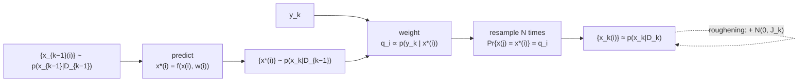

## Abstract

The filtering recursion — predict by integrating against the transition density, update by Bayes' rule — has a closed form only for linear-Gaussian models. Everything else was handled in 1993 by linearising (the extended Kalman filter), by mixture approximation, or by gridding the state space, and all three fail in their own way. This paper replaces the *representation*: the posterior $p(x_k\mid D_k)$ is carried as $N$ random samples rather than as a function over state space. One iteration is then three lines. Push each sample through the system equation with a fresh draw of process noise, which turns samples from $p(x_{k-1}\mid D_{k-1})$ into samples from the prior $p(x_k\mid D_{k-1})$. Weight each by the likelihood of the new measurement and normalise. Resample $N$ times from that discrete distribution. The update step's correctness is Smith and Gelfand's weighted bootstrap, which says exactly that resampling with weights proportional to $L(x)$ converges in distribution to the density proportional to $L(x)G(x)$. On Kitagawa's severely nonlinear scalar model the filter recovers a bimodal posterior the EKF cannot see; on a four-dimensional bearings-only tracking problem it tracks where the EKF diverges. The paper is candid that its justification is asymptotic, that samples collapse, and that its two fixes for the collapse are ad hoc.

**Keywords:** bootstrap filter, particle filter, sequential Monte Carlo, weighted bootstrap, sample impoverishment, bearings-only tracking

## 1 Introduction

The state-space problem: $x_{k+1}=f_k(x_k,w_k)$ with $w_k$ zero-mean white noise of known density, observed through $y_k=h_k(x_k,v_k)$ with $v_k$ likewise, and the task is $p(x_k\mid D_k)$ where $D_k=\{y_i:i=1,\dots,k\}$.

The paper's survey of 1993's options is short and damning.

- **The Kalman filter** is exact only when $f_k$ and $h_k$ are linear and both noises additive Gaussian. *Considerations of realism imply that these assumptions are unreasonable for many applications.*
- **The extended Kalman filter** linearises about the predicted state. *In this case the required PDF is still approximated by a Gaussian, which may be a gross distortion of the true underlying structure and may lead to filter divergence.* Both failure modes show up in the experiments.
- **Gaussian sum filters** and moment-matching methods are analytic approximations with the same character.
- **Grid methods** evaluate the density on a lattice. *The choice of an efficient grid is nontrivial, and in a multidimensional state space a very large number of grid points may be necessary. A significant computation must be performed at each point.*

The move is to stop approximating the *function* and start approximating with *samples*: *as the number of samples becomes very large, they effectively provide an exact, equivalent, representation of the required PDF.* The immediate benefit over a grid is stated in one line and is the whole argument: *the samples being naturally concentrated in regions of high probability density*. A grid spends effort where there is no mass; samples do not.

The reason this paper opens a series rather than sitting in a signal-processing archive is that it is the first practical, general, recursive Monte Carlo filter, and every later development — [resampling schemes](/blog/resampling-schemes/), [auxiliary proposals](/blog/auxiliary-particle-filter/), [SMC samplers](/blog/smc-samplers/), [particle MCMC](/blog/particle-mcmc/) — is a repair or an extension of these six pages. For financial state-space work the appeal is exactly the stated one: stochastic volatility, jump-diffusion and nonlinear term-structure models are nonlinear and non-Gaussian by construction, and the only requirements this filter imposes are that you can *sample* the transition and *evaluate* the observation likelihood.

## 2 Background: the recursion being approximated

**Prediction.** Given $p(x_{k-1}\mid D_{k-1})$,

$$
p(x_k\mid D_{k-1})=\int p(x_k\mid x_{k-1})\,p(x_{k-1}\mid D_{k-1})\,dx_{k-1}, \tag{1}
$$

where the transition density is defined by the system equation and the noise law,

$$
p(x_k\mid x_{k-1})=\int\delta\bigl(x_k-f_{k-1}(x_{k-1},w_{k-1})\bigr)p(w_{k-1})\,dw_{k-1}. \tag{2}
$$

The delta function is there because *if $x_{k-1}$ and $w_{k-1}$ are known, then $x_k$ is obtained from a purely deterministic relationship*. Worth pausing on: (2) says the transition density may be a horrible object with no closed form, while *sampling* from it is trivial — draw $w$, apply $f$. That asymmetry is what the algorithm exploits.

**Update.** On receiving $y_k$,

$$
p(x_k\mid D_k)=\frac{p(y_k\mid x_k)\,p(x_k\mid D_{k-1})}{p(y_k\mid D_{k-1})},
\qquad
p(y_k\mid D_{k-1})=\int p(y_k\mid x_k)\,p(x_k\mid D_{k-1})\,dx_k. \tag{3}
$$

Equations (1) and (3) *constitute the formal solution* — the difficulty was never the mathematics, only the integrals.

## 3 Method

> **Key idea.** You never need the prior density, only samples from it; and you never need the normalising constant, only ratios of likelihoods. Both integrals in the recursion are therefore avoidable: push samples forward through the model, then resample them in proportion to how well they explain the new measurement.

### 3.1 The algorithm

Start from $\{x_{k-1}(i)\}_{i=1}^N$ approximately distributed as $p(x_{k-1}\mid D_{k-1})$.

**Prediction.** Draw $w_{k-1}(i)\sim p(w_{k-1})$ independently and set

$$
x_k^*(i)=f_{k-1}\bigl(x_{k-1}(i),w_{k-1}(i)\bigr). \tag{4}
$$

**Update.** Evaluate the likelihood of each predicted sample and normalise:

$$
q_i=\frac{p\bigl(y_k\mid x_k^*(i)\bigr)}{\sum_{j=1}^{N}p\bigl(y_k\mid x_k^*(j)\bigr)}. \tag{5}
$$

**Resample.** Draw $N$ times with replacement from the discrete distribution putting mass $q_i$ on $x_k^*(i)$, so that $\Pr\{x_k(j)=x_k^*(i)\}=q_i$.

Initialisation draws $N$ samples from the known prior $p(x_1)$ and feeds them straight into the update.

The resampling is implemented by inverse-CDF sampling: draw $u_i\sim\mathcal{U}(0,1]$ and take $x_k^*(M)$ where $\sum_{j=0}^{M-1}q_j<u_i\le\sum_{j=0}^{M}q_j$ with $q_0=0$, repeated independently for $i=1,\dots,N$. Independently, for each $i$ — which makes this **multinomial resampling**, the highest-variance member of the family, and the fact that better schemes exist at the same cost is [a whole later paper](/blog/resampling-schemes/).

### 3.2 Why it works

**Prediction** is immediate: if $x_{k-1}(i)\sim p(x_{k-1}\mid D_{k-1})$ and $w_{k-1}(i)\sim p(w_{k-1})$ independently, then $f_{k-1}$ of the pair is distributed as $p(x_k\mid D_{k-1})$ by construction of (1) and (2). No approximation is introduced here at all.

> **My comment.** This is the step my TailFlow generator was missing in its one-shot form: it drew the whole ten-day window from the state at the origin, so a large loss on day 2 never raised the volatility of day 3. Re-conditioning each path on its own generated history is, in effect, pushing every sample through its own state update, and it halved the 10-day ES bias. Reading this paper, I wonder whether a proper filtering view of the condition, rather than my ad hoc feedback, would also have stopped the runaway I saw on weakly trained models.

**Update** rests on Smith and Gelfand's *weighted bootstrap*: given samples $\{x^*(i)\}$ from a continuous density $G(x)$ and a known function $L(x)$, a draw from the discrete distribution with mass $L(x^*(i))/\sum_jL(x^*(j))$ on $x^*(i)$ *tends in distribution to* the density proportional to $L(x)G(x)$ as $N\to\infty$. Identify $G$ with the prior and $L$ with the likelihood and the update is justified. Note the two things this buys: the normalising constant in (3) never has to be computed, because it cancels in the weight ratio; and $L$ need only be known up to a constant.

### 3.3 What is actually required

Three conditions, and they are the reason the method travels:

- $p(x_1)$ is available for *sampling*;
- the likelihood $p(y_k\mid x_k)$ is a *known functional form* (evaluable, up to a constant);
- $p(w_k)$ is available for *sampling*.

No linearity, no Gaussianity, no differentiability, no closed-form transition density, no invertibility. *The only requirements are that…* — and that list is it. Compare with the EKF, which needs Jacobians of $f$ and $h$.

Two further practical remarks the paper makes and that aged well. *It would also be straightforward to implement this algorithm on massively parallel computers, raising the possibility of real time operation with very large sample sets* — written in 1993, and correct. And the output being samples is itself convenient: *the posterior probability of the state falling within any region of interest may be estimated by calculating the proportion of samples within that region*, along with moments, percentiles, and highest-posterior-density intervals.

### 3.4 The failure mode, named on page 4

This is the most valuable part of the paper and it is the authors criticising their own method:

> If the region of state space where the likelihood $p(y_k\mid x_k)$ takes significant values is small in comparison with the region where the prior $p(x_k\mid D_{k-1})$ is significant, many of the samples $x_k^*(i)$ will receive a very small weighting $q_i$, and will not be selected in the resampling procedure. Thus, samples of the prior remote from the likelihood are effectively wasted, and those nearby are reselected many times. … Through this process, the representation of the PDF may become most inadequate within a few time steps. **Indeed if there is no system noise, all of the N samples may rapidly collapse to a single value.**

That is weight degeneracy and sample impoverishment, diagnosed correctly, with the correct mechanism (an informative likelihood in the tail of the prior) in the paper that introduced the algorithm. The three factors governing how large $N$ must be are listed: the dimension of the state space, the *overlap* between prior and likelihood, and the number of time steps. On dimension, the paper is careful rather than alarmist — $N$ *must be expected to rise rapidly*, at a rate *governed by the interdependencies between the components of the state vector*, and *in the most benign case of independent components, the required number of state vector samples should not increase with the dimension of the space.*

And the honest refusal to over-promise: *the justification for the bootstrap filter is based on asymptotic results. It is most difficult to prove any general result for a finite number of samples. Likewise it is most difficult to make any precise, provable statement on the crucial question of how many samples are required.*

### 3.5 The two fixes

**Roughening.** Add an independent jitter $\varepsilon_i\sim\mathcal{N}(0,J_k)$ to each resampled value, $J_k$ diagonal, with per-component standard deviation

$$
\sigma=K\,E\,N^{-1/d} \tag{6}
$$

where $E$ is the range (max minus min) of that component before roughening, $d$ is the state dimension, and $K$ is a tuning constant. The scaling is chosen so that $\sigma$ is proportional to the node spacing of an equivalent uniform rectangular grid of $N$ points — with $K=0.2$ in the experiments, *the standard deviation of the Gaussian jitter is 20% of the node spacing*. *Clearly the choice of $K$ is a compromise. Too large a value would blur the distribution but too small a value would produce tight clusters of points around the original samples.*

In modern language this is kernel smoothing of the particle set, and (6) is a Scott-type bandwidth rule. It is also a *bias*: the filter now targets the posterior convolved with a Gaussian. The paper does not say so.

> **My comment.** I have the same kind of constant in my own work. The discount filter in the exchange-queueing reanalysis mixes each block's posterior with a time-of-day prior at a fixed $\delta=0.5$, which keeps the posterior from collapsing onto a stale rate, exactly as roughening keeps the cloud from collapsing. I chose it rather than derived it, and I have not reported a sensitivity sweep over it, which is the same thing I would ask of this paper's $K=0.2$.

**Prior editing.** If you are willing to delay the estimate by one step, boost the number of prior samples near the likelihood by a rejection test:

1. Take $x_k(i)$, rough it, push it through the system model to get $x_{k+1}^*(i)$.
2. Assuming $z_{k+1}$ is available, compute $v_{k+1}(i)=z_{k+1}-h(x_{k+1}^*(i))$.
3. If $\lvert v_{k+1}(i)\rvert>6\sqrt{r}$, reject $x_k(i)$ and draw a replacement from the update stage at $k$; otherwise accept.

The authors flag the consequence themselves: *this procedure has the effect of a crude, single stage smoothing operation … the accepted samples $x_k(i)$ are vaguely distributed as $p(x_k\mid D_{k+1})$.* So edited samples do not represent the filtering distribution, and the reported percentile figures are stated to come from *unedited* samples. (The interaction between that statement and the claim that $N=4000$ sufficed *because* of editing is discussed in §5.)

### 3.6 Algorithm

```text
INITIALISE
  for i = 1..N:  x*(i) ~ p(x_1)             # sample the prior; go straight to UPDATE

for k = 1, 2, ...:
  # PREDICT (exact: no approximation introduced)
  for i = 1..N:
      w(i)  ~ p(w_{k-1})
      x*(i) = f_{k-1}( x(i), w(i) )

  # UPDATE (weighted bootstrap; normalising constant cancels)
  for i = 1..N:  q(i) = p( y_k | x*(i) )
  q = q / sum(q)

  # RESAMPLE (multinomial: N independent inverse-CDF draws)
  for i = 1..N:
      u   ~ Uniform(0, 1]
      M   = smallest index with cumsum(q)[M] >= u
      x(i) = x*(M)
      x(i) = x(i) + N(0, J_k)               # optional roughening, sigma = K * E * N^(-1/d)
```



## 4 Implementation notes

- **Resampling is unconditional**, every step. There is no effective-sample-size trigger and no adaptive variant; those come later.
- **The proposal is the transition density.** In the modern vocabulary this is the bootstrap proposal $q(x_k\mid x_{k-1},y_k)=p(x_k\mid x_{k-1})$, which is why the weight is simply the likelihood. Nothing in the paper suggests the proposal could be anything else — that observation is [Pitt and Shephard's](/blog/auxiliary-particle-filter/).
- **The normalising constant is computed and discarded.** $\sum_j p(y_k\mid x_k^*(j))/N$ is an unbiased estimate of $p(y_k\mid D_{k-1})$ and therefore, multiplied across time, of the model likelihood. The paper writes the quantity down in (3), computes it in (5), and never uses it. That unused number is the whole of [particle MCMC](/blog/particle-mcmc/) seventeen years later.
- **Roughening constant** $K=0.2$, chosen without justification or sensitivity analysis.
- **Prior-editing threshold** $6\sqrt r$, i.e. six observation standard deviations, likewise.
- All results are single realisations. No repeated runs, no error bars, no Monte Carlo standard errors on the filter estimates.

## 5 Experiments

### 5.1 A severely nonlinear scalar model

Kitagawa's model:

$$
x_k=0.5x_{k-1}+\frac{25x_{k-1}}{1+x_{k-1}^2}+8\cos\bigl(1.2(k-1)\bigr)+w_k,
\qquad
y_k=\frac{x_k^2}{20}+v_k, \tag{7}
$$

with $w_k,v_k$ zero-mean Gaussian of variance $10.0$ and $1.0$. *This example is severely nonlinear, both in the system and the measurement equation.*

The twist is in the observation: because $y$ depends on $x^2$, for $y_k<0$ the likelihood is unimodal at zero, while **for positive measurements the likelihood is symmetric about zero with modes at $\pm\sqrt{20y_k}$**. The measurement tells you the magnitude of the state and nothing about its sign. Any filter that insists the posterior is Gaussian is guaranteed to be wrong, and this is the point of the example.

Setup: $x_0=0.1$, both filters initialised with $p(x_0)=\mathcal{N}(0,2)$, 50 steps, $N=500$, no roughening needed — *the system noise automatically roughens the prior samples*, since the process noise variance of 10 is large.

Results. The EKF's 95% interval contains the true state on *about 30% of occasions* ([Fig. 2](https://people.bordeaux.inria.fr/pierre.delmoral/gordon-salmond-smith-1993.pdf#page=4)), which is not a small miscalibration but a catastrophic one. The bootstrap filter's intervals contain it nearly always ([Fig. 3](https://people.bordeaux.inria.fr/pierre.delmoral/gordon-salmond-smith-1993.pdf#page=4)), with the caveat the authors themselves attach: *these may not represent the true 95% HPD region, since the posterior can be bimodal in this example* — percentiles of a bimodal distribution are not a credible region. [Fig. 4](https://people.bordeaux.inria.fr/pierre.delmoral/gordon-salmond-smith-1993.pdf#page=4) shows the posterior at $k=21$ as a kernel density estimate from the particles: clearly bimodal, true value near the larger mode, with the EKF's Gaussian sitting somewhere else entirely.

The robustness check is one sentence and is the right one: *running the bootstrap filter with larger sample sets gave results indistinguishable from Fig. 3, and this is taken as confirmation that our sample set size is sufficient.* A convergence check by variation of $N$ is the only convergence diagnostic available for a method with no finite-$N$ theory, and they do it.

### 5.2 Bearings-only tracking

Four-dimensional state $x_k=(x,\dot x,y,\dot y)^{\mathsf T}$ under a standard second-order model $x_k=\Phi x_{k-1}+\Gamma w_k$ with process noise covariance $Q=qI_2$, observed by a fixed observer at the origin through

$$
z_k=\tan^{-1}(y_k/x_k)+u_k,\qquad \mathbb{E}[u_ku_j]=r\delta_{kj}. \tag{8}
$$

A bearing and nothing else: range is unobservable from a single measurement, and the problem is classically hard. Parameters (arbitrary units): $\sqrt q=0.001$, $\sqrt r=0.005$, true initial state $x_1=(-0.05,0.001,0.7,-0.055)^{\mathsf T}$, 24 time steps, $N=4000$.

Results. *After an initial period of uncertainty the bootstrap filter quickly homes onto the target, whereas the EKF rapidly diverges.* Component-wise, *the actual co-ordinate value is practically always within the 95% probability region* for the bootstrap filter, while *the EKF is consistently over-optimistic about its tracking performance, and serious divergence occurs after $k=13$*. [Fig. 7](https://people.bordeaux.inria.fr/pierre.delmoral/gordon-salmond-smith-1993.pdf#page=5) plots 500 of the 4000 particles in the $(x,y)$ plane at $k=24$: visibly skewed towards the lower right, *highlighting the non-Gaussian nature of the PDF*. That figure is the argument — a Gaussian summary of that cloud would misplace the target.

**An unexpectedly good diagnostic.** *The number of samples rejected by the prior editing test is in some sense a measure of the useful information contained in the measurement.* During the fly-past, when the bearing changes fast and the measurements are informative, rejections rise to about **100,000**; before and after, when the target moves along a radius vector and the bearing is nearly constant, rejections are **between about 10 and 100**. Four orders of magnitude, tracking exactly the informativeness of the observation — and the 95% interval width narrows during fly-past correspondingly. This is a rediscovery, in a rejection-rate, of what effective sample size measures, and it is the most interesting empirical observation in the paper.

**The fairness of the EKF comparison, stated by the authors.** *It should be noted that the EKF results are from a naive application of the filter, directly to the given system and measurement model. A reparameterisation of the problem using modified polar co-ordinates (see Aidala and Hammel) … may well have performed better.* They then give the EKF a gating test as the nearest analogue of prior editing: at a $\pm3$ standard deviation threshold, 10 bearing measurements after fly-past were ignored, the EKF became effectively a predictor, and *although the estimation error was then much reduced, the actual state was still only rarely within the 95% probability region.* Arguing your own baseline's case, implementing the improvement, and reporting that it still loses is the right way to do this.

**Where I would push back.** The $N=4000$ figure is presented as the headline efficiency claim — *by employing these techniques of roughening and of accepting only 'useful' samples, the results presented have been obtained by propagating only $N=4000$ samples. In four-dimensional space a grid of this size would have only about 8 points on each co-ordinate.* But the *cost* of prior editing is the rejected draws, and up to 100,000 rejections at a single time step means the algorithm generated and evaluated far more than 4000 candidates there. The comparison with a 4000-point grid counts propagated particles and not proposals. Separately, the percentile figures are stated to come from unedited samples while the $N=4000$ claim is attributed to editing, so it is not fully clear which run each figure describes.

## 6 Limitations

**Stated by the authors.**

- The justification is asymptotic; finite-$N$ results are *most difficult* and no statement about required $N$ is available.
- Samples collapse — *the number of truly distinct values in the sample set may rapidly collapse* — and with no process noise, to a single value.
- The two remedies are *somewhat ad hoc schemes*, their word.
- Prior editing smooths, so edited samples target $p(x_k\mid D_{k+1})$ rather than $p(x_k\mid D_k)$.
- Percentile intervals are not HPD regions when the posterior is multimodal.
- The EKF comparison is naive by construction.

**My reading.**

- **Multinomial resampling is the worst choice available** and the paper resamples unconditionally at every step, which maximises the damage. Stratified and systematic resampling cost the same and have strictly lower variance; adaptive resampling on an ESS threshold avoids most of the resampling altogether. Both are [later work](/blog/resampling-schemes/), and neither is hard.
- **The proposal is not a design variable here.** Using the transition density means the observation never influences *where* particles are placed, only which survive — which is precisely the situation §3.4 identifies as the failure mode. The fix is to propose from something that looks at $y_k$, which is the [auxiliary particle filter](/blog/auxiliary-particle-filter/).
- **Roughening is an unacknowledged bias.** The filter after roughening targets a smoothed posterior, and nothing bounds the smoothing's effect on moments.
- **Path degeneracy is invisible here.** Resampling every step means the ancestral lineages coalesce, so the *joint* distribution of the trajectory degenerates even while the marginal filtering distribution looks fine. With 24 time steps it does not bite; for smoothing or parameter estimation it is fatal.
- **The likelihood estimate is computed and thrown away** (§4). That omission is understandable in 1993 and is the single largest missed opportunity in the paper.
- **No quantitative error metric.** The comparison against the EKF is by eye on trajectory plots and by coverage of a 95% interval on a single realisation. No RMSE, no repeated runs, no Monte Carlo standard errors — so "greatly superior" is a description of two figures.
- **Dimension is discussed and not tested.** The largest state is four-dimensional, and the sentence about independent components implying no growth in $N$ is a best-case remark that reads, out of context, more optimistic than the later literature supports.

## 7 Extensions

**What was built on this.** Essentially the whole field. Resampling variance was analysed and reduced ([Douc and Cappé](/blog/resampling-schemes/)). The proposal became a design variable ([Pitt and Shephard](/blog/auxiliary-particle-filter/)), and with it the locally optimal proposal and its EKF/UKF/Laplace approximations. The construction was generalised from filtering to sampling from any sequence of distributions on a common space ([Del Moral, Doucet and Jasra](/blog/smc-samplers/)), which covers tempering and static Bayesian inference. The discarded likelihood estimate became the engine of exact-approximate MCMC over model parameters ([Andrieu, Doucet and Holenstein](/blog/particle-mcmc/)). Rao-Blackwellisation integrates out the conditionally linear-Gaussian part of the state analytically and samples only the rest. Convergence theory arrived — Crisan and Doucet's survey, Del Moral's Feynman–Kac framework — supplying the finite-$N$ results the authors said were hard. And in the direction of this site's other series, [normalizing flows](/blog/normalizing-flows-survey/) are now one way to learn the proposal the bootstrap filter does without.

**Open problems the paper leaves.** How many particles, as a function of dimension and of prior/likelihood overlap? What is the right amount of roughening, and what does it cost in bias? How should the proposal use the current measurement? And the one the paper cannot even pose, because it lacks the parameter: what do you do when $f$ and $h$ have unknown parameters?

**Research directions.** *These are ideas, not results — none has been run.*

1. **Replace roughening with a defensible kernel.** Hypothesis: the $K=0.2$ rule is close to a plug-in kernel-density bandwidth for a Gaussian target, and replacing it with a shrinkage-corrected kernel — resampling from a kernel density whose mean is shrunk towards the particle mean so that the smoothed cloud has the right *variance*, in the manner of regularised particle filters — removes the bias at the same cost. Data: the Kitagawa model of (7) with the process-noise variance swept down towards zero, where roughening actually matters. Baseline: no roughening, the paper's $K\in\{0.05,0.2,0.5\}$, and shrinkage-corrected roughening. Metric: bias and variance of the posterior mean and variance against a very-long-run reference filter. Likely failure mode: at any reasonable process-noise level the roughening term is negligible compared with the process noise and every variant agrees — which is itself the useful statement of when the hack matters.
2. **Turn the rejection-rate observation into an online information diagnostic.** Hypothesis: the prior-editing rejection rate of §5.2 is a monotone function of the Kullback–Leibler divergence between prior and posterior at each step, and therefore a cheap online measure of observation informativeness that can drive an adaptive particle budget — more particles when the measurement is informative, fewer when it is not. Data: the bearings-only setup of §5.2 and a simulated stochastic-volatility model where informativeness varies with the realised return. Baseline: fixed $N$, and an ESS-triggered scheme. Metric: filtering RMSE at matched total particle-steps. Likely failure mode: the rejection rate and the ESS carry the same information, in which case the contribution is a cheaper estimate of a known quantity rather than a new one.
3. **Use the discarded likelihood estimate for online model comparison of volatility specifications.** Hypothesis: accumulating $\prod_k\bigl(\tfrac1N\sum_ip(y_k\mid x_k^*(i))\bigr)$ across competing nonlinear state-space specifications gives a sequential Bayes factor whose ranking stabilises long before a full offline estimation would, so a practitioner can discard specifications early. Data: simulated data from one of a set of candidate SV models with known truth, then daily index returns. Baseline: offline marginal likelihoods from [particle MCMC](/blog/particle-mcmc/). Metric: how early, in time steps, the sequential ranking matches the offline one, and how the answer degrades with $N$. Likely failure mode: the variance of the log-likelihood estimate grows linearly in the number of time steps, so the sequential Bayes factor is dominated by Monte Carlo error before it is dominated by evidence — which is exactly the quantity PMCMC has to control, and would need measuring rather than assuming.

## 8 Takeaways

- The contribution is a change of representation, not a change of mathematics. The filtering recursion is unchanged; it is carried by samples instead of by a function, and both of its integrals then disappear.
- Prediction is exact. Push each particle through the system equation with a fresh noise draw and you have exact samples from the prior — no approximation at all enters at that step.
- The update is Bayes' rule implemented as a weighted bootstrap, which is why the normalising constant never needs computing and the likelihood need only be known up to a constant.
- The requirements are: sample the initial state, sample the process noise, evaluate the observation likelihood. Nothing about linearity, Gaussianity, differentiability or closed forms.
- The paper diagnoses its own failure mode precisely — an informative likelihood in the tail of the prior wastes almost every particle, and with no process noise the cloud collapses to a point — and fixes it with two admitted hacks.
- The bearings-only rejection-rate observation is a genuine insight in disguise: how hard it is to find particles the measurement likes *is* a measure of how much the measurement says.
- The estimate of $p(y_k\mid D_{k-1})$ falls out of the weights for free and is not used. Seventeen years later that number turns out to be the key to exact Bayesian parameter estimation for these models.
- For nonlinear financial state-space models this is the right default and the right starting point, with the caveat that the three well-known repairs — a better resampling scheme, an ESS trigger, and a proposal that looks at the observation — should all be applied before the filter is trusted.

## References

1. Gordon, N. J., Salmond, D. J., Smith, A. F. M. *Novel approach to nonlinear/non-Gaussian Bayesian state estimation.* IEE Proceedings-F, 140(2):107-113, 1993.
2. Smith, A. F. M., Gelfand, A. E. *Bayesian Statistics Without Tears: A Sampling-Resampling Perspective.* The American Statistician, 46(2), 1992.
3. Kitagawa, G. *Non-Gaussian State-Space Modelling of Nonstationary Time Series.* JASA 82, 1987.
4. Carlin, B. P., Polson, N. G., Stoffer, D. S. *A Monte Carlo Approach to Nonnormal and Nonlinear State Space Modeling.* JASA 87, 1992.
5. Alspach, D. L., Sorenson, H. W. *Nonlinear Bayesian Estimation Using Gaussian Sum Approximation.* IEEE TAC 17, 1972.
6. Aidala, V. J., Hammel, S. E. *Utilization of Modified Polar Coordinates for Bearings-Only Tracking.* IEEE TAC 28, 1983.
7. Pitt, M. K., Shephard, N. *Filtering via Simulation: Auxiliary Particle Filters.* JASA 94, 1999.
