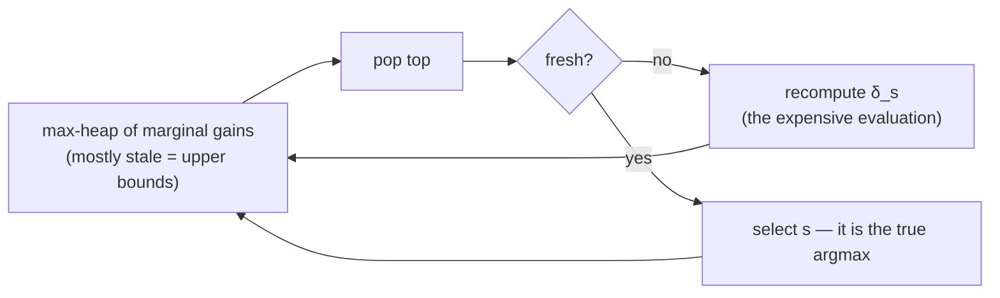

## Abstract

Where should sensors go in a water network to detect a contamination fast? Which blogs should you read to catch stories early? The paper's observation is that these are the same problem — select nodes to detect a process spreading over a network — and that the natural objectives for it are submodular, so [greedy is within $1-1/e$](/blog/nemhauser-wolsey-fisher/). Three contributions follow. **Formulation**: define a *penalty reduction* $R(A)=\pi(\emptyset)-\pi(A)$ rather than a penalty, prove submodularity, and note that the reduction form is also the sparse one, which is what makes a large instance fit in memory. **Cost-aware greedy**: when nodes cost different amounts, benefit-per-cost greedy can be arbitrarily bad, but running it *and* unit-cost greedy and keeping the better gives $\tfrac12(1-1/e)$. **Speed and certification**: because marginal gains never increase, a gain computed earlier is an upper bound on the gain now, so a priority queue over stale gains lets most re-evaluations be skipped — the *lazy forward* idea, giving a **700×** speedup, 23 seconds against 4.5 hours. And the same monotonicity gives an *online* bound, computable for any solution from any algorithm, which on the blog data says the greedy set is within **13.8%** of optimal where the worst-case guarantee only promises 37%.

**Keywords:** lazy greedy, CELF, sensor placement, outbreak detection, online bounds, budgeted submodular maximisation, blog cascades

## 1 Introduction

The unification is the first move and it is a good one. A water utility wants sensors at pipe junctions to catch contaminants quickly; a reader wants a handful of blogs that link to most stories early; an epidemiologist wants a few people to monitor so an outbreak is caught while few are infected. *These seemingly different problems share common structure: outbreak detection can be modeled as selecting nodes in a network, in order to detect the spreading of a virus or information as quickly as possible.*

The motivating deadline is real: the Battle of Water Sensor Networks, *organized as an international challenge to find the best sensor placements for a real (but anonymized) metropolitan area water distribution network*, and this paper presents the entry.

Why it belongs in this series: [NWF 1978](/blog/nemhauser-wolsey-fisher/) supplies the guarantee and ignores what an evaluation of $z$ costs. This paper is about the cost. In the water application one evaluation means *physical simulations*; in the blog application it means scanning millions of posts. The theory says $O(nK)$ evaluations; the practice says that is impossible. The resolution — exploit submodularity a second time, to *skip* evaluations rather than to bound the answer — is the single most useful engineering idea in the applied submodularity literature, and the reason "CELF" appears in the method section of hundreds of later papers.

## 2 Background: formulating the objective

A placement $A\subseteq V$ detects event $i$ at time $T(i,A)=\min_{s\in A}T(i,s)$, with $T(i,\emptyset)=\infty$. A penalty function $\pi_i(t)$, non-decreasing in $t$ — *we never prefer late detection if we can avoid it* — gives the expected penalty

$$
\pi(A)=\sum_iP(i)\,\pi_i\bigl(T(i,A)\bigr). \tag{1}
$$

**The reformulation.** Instead of minimising (1), maximise the *penalty reduction*

$$
R_i(A)=\pi_i(\infty)-\pi_i\bigl(T(i,A)\bigr),
\qquad
R(A)=\sum_iP(i)R_i(A)=\pi(\emptyset)-\pi(A). \tag{2}
$$

Mathematically this is a sign flip and an additive constant. Operationally it is the entire paper, for two separate reasons. First, $R(\emptyset)=0$ and $R$ is non-decreasing, so (2) is in the exact form NWF's theorem requires while (1) is not. Second — and this is the detail that makes the large instances feasible — **$R$ is sparse and $\pi$ is not**. Most nodes contribute nothing to detecting most events, so $R_i(\{s\})=0$ for almost every pair, whereas $\pi_i(s)$ is a number for every pair. The paper is explicit: *this sparsity is only present if we consider penalty reductions. If for each sensor $s$ and scenario $i$ we store the actual penalty $\pi_i(s)$, the resulting representation is [not] sparse.*

**Theorem 1.** For $A\subseteq B\subseteq V$ and $s\notin B$, $R(A\cup\{s\})-R(A)\ge R(B\cup\{s\})-R(B)$. *Add a sensor to a small placement $A$, we improve our score at least as much as if we add it to a larger placement $B\supseteq A$.* The proof is in the appendix; the intuition is the same $\min$-of-detection-times argument that makes facility location submodular.

**Three objectives**, all of this form:

| | $\pi_i(t)$ | meaning |
|---|---|---|
| **DL** detection likelihood | $0$, with $\pi_i(\infty)=1$ | fraction of events detected at all |
| **DT** detection time | $\min\{t,T_{\max}\}$ | time from outbreak to detection |
| **PA** population affected | size of cascade $i$ at time $t$ | people (or blogs) hit before detection |

**Multicriterion.** Since the three can disagree, the paper uses scalarisation, $R=\sum_i\lambda_iR_i$ with $\lambda_i>0$, every optimum of which is Pareto-optimal. The reason this is legitimate rather than convenient: *submodularity is closed under non-negative linear combinations and thus the new scalarized objective is submodular as well*, so the guarantee survives the weighting. Closure under conic combination is what makes submodularity a usable modelling primitive rather than a property you check once and lose.

## 3 Method

> **Key idea.** A marginal gain computed at an earlier, smaller set is an *upper bound* on the gain now. So if the largest stale gain, after recomputation, is still larger than every other stale gain, it is the true maximum — and you never had to recompute the others.

### 3.1 Cost-aware greedy, and why the obvious fix fails

With unit costs, greedy picks $s_k=\arg\max_{s}R(A_{k-1}\cup\{s\})-R(A_{k-1})$ and Theorem 2 (NWF) gives $R(A^G)\ge(1-1/e)\max_{\lvert A\rvert=B}R(A)$.

With costs $c(s)$ and budget $c(A)\le B$, the natural rule is benefit-per-cost,

$$
s_k=\arg\max_{s\in V\setminus A_{k-1}}\frac{R(A_{k-1}\cup\{s\})-R(A_{k-1})}{c(s)}. \tag{3}
$$

And it can be arbitrarily bad. Two locations, $c(s_1)=\varepsilon$, $c(s_2)=B$, one scenario, $R(\{s_1\})=2\varepsilon$ and $R(\{s_2\})=B$. Ratios are $2$ and $1$, so (3) takes $s_1$, exhausts nothing but can no longer afford $s_2$, and ends with reward $\varepsilon$ against an optimum of $B$. *As $\varepsilon$ goes to 0, the performance of the greedy algorithm becomes arbitrarily bad.*

**CEF (Cost-Effective Forward selection)** runs *both* rules — benefit-cost (3) and unit-cost (2), each considering only affordable elements — and returns whichever scores higher.

**Theorem 3.** $\max\{R(A^{GCB}),R(A^{GUC})\}\ge\tfrac12(1-1/e)\max_{c(A)\le B}R(A)$.

*Even though both solutions can be arbitrarily bad, the following result shows that there is at least one of them which is not too far away from optimum.* The two failure modes are complementary: benefit-cost greedy is fooled by a cheap near-worthless element, unit-cost greedy is fooled by an expensive one, and no instance fools both. The paper notes the result was known for budgeted MAX-COVER and proves it here *for arbitrary nondecreasing submodular functions*. Running time is $O(B\lvert V\rvert)$ function evaluations.

### 3.2 Lazy evaluation

Submodularity says $\delta_s(A)\ge\delta_s(B)$ for $A\subseteq B$, where $\delta_s(A)=R(A\cup\{s\})-R(A)$. So a gain computed when the selected set was smaller *overstates* the gain now. Therefore:

> Instead of recomputing $\delta_s\equiv\delta_s(A)$ for every sensor after adding $s'$ (and hence requiring $\lvert V\rvert-\lvert A\rvert$ evaluations of $R$), we perform lazy evaluations: initially, we mark all $\delta_s$ as invalid. When finding the next location to place a sensor, we go through the nodes in decreasing order of their $\delta_s$. If the $\delta_s$ for the top node $s$ is invalid, we recompute it, and insert it into the existing order of the $\delta_s$ (e.g., by using a priority queue). In many cases, the recomputation of $\delta_s$ will lead to a new value which is not much smaller, and hence often, the top element will stay the top element even after recomputation. In this case, we found a new sensor to add, without having reevaluated $\delta_s$ for every location $s$.

*The correctness of this lazy procedure follows directly from submodularity* — and the correctness is exact, not approximate. If after recomputation the top element's true gain still exceeds every other element's *stale* gain, then since each stale gain upper-bounds its true gain, the top element is genuinely the argmax. The algorithm returns exactly what eager greedy returns; only the evaluation count changes.

The same idea applies to the bound computation of §3.3. The result is **CELF, Cost-Effective Lazy Forward selection**, and the paper credits a similar algorithm for the unit-cost case to Robertazzi and Schwartz.

### 3.3 The online bound

The guarantees so far are *offline*: $1-1/e$ and $\tfrac12(1-1/e)$ are known before you run anything and describe the worst instance, not yours.

**Theorem 4** gives an instance-level bound. Given any placement $A$ — *any*, from any algorithm — compute $\delta_s=R(A\cup\{s\})-R(A)$ for each $s\notin A$ and $r_s=\delta_s/c(s)$, sort by decreasing $r_s$, and accumulate cost until the budget is exceeded at position $k$, with $\lambda=(B-C)/c(s_k)$ where $C=\sum_{i\le k}c(s_i)$. Then

$$
\max_{A',\,c(A')\le B}R(A')\ \le\ R(A)+\sum\nolimits_{\text{top items}}\delta_{s_i}+\text{(fractional remainder)}. \tag{4}
$$

This is the fractional-knapsack relaxation of the marginal gains: submodularity says no element can ever be worth more than its gain measured at $A$, so filling the budget greedily with those gains, taking the last item fractionally, can only overshoot the true optimum.

Two properties make it valuable. It is **algorithm-independent** — *it can be computed regardless of the algorithm used to obtain the solution* — so it certifies heuristics too. And it is **tight in practice** in a way the worst-case constant is not.

### 3.4 Algorithm

```text
CELF  (cost-effective lazy forward selection)
  run LazyForward with the unit-cost rule      -> A_UC
  run LazyForward with the benefit/cost rule   -> A_CB
  return the better of the two                 # Thm 3: >= 0.5*(1 - 1/e) * OPT

LazyForward(R, c, B, rule):
  A = {}
  heap = max-heap over nodes keyed by delta (or delta/c), all marked STALE,
         initialised with delta_s({}) = R({s})
  while heap nonempty:
      s = heap.top()
      if s is STALE:
          recompute delta_s = R(A + s) - R(A)     # the only expensive operation
          mark s FRESH; heap.update(s)            # push it back; it may not be top any more
          continue                                # <-- loop, do not select yet
      # s is FRESH and on top: its true gain beats every other node's STALE gain,
      # and stale gains upper-bound true gains, so s IS the argmax.  Exact, not heuristic.
      if c(A) + c(s) <= B:  A = A + s
      heap.pop(s); mark ALL remaining nodes STALE
  return A

ONLINE BOUND for any A:
  sort s by delta_s / c(s) descending; fill the budget B with those gains,
  last item fractionally  ->  upper bound on OPT (Theorem 4)
```



## 4 Implementation notes

- **The inverted index is the second half of the engineering.** *The inverted index is the main data structure of our optimization algorithms.* Scenarios are indexed by the sensors that detect them, so $R(A)=\sum_{i\ \text{detected by }A}P(i)\max_{s\in A}R_i(s)$ is computed *without having to scan the entire data set*. This is what makes each surviving evaluation cheap, and it works only because of the penalty-*reduction* formulation (§2).
- **Compression.** The blog representation goes from *3.5 GB to 50 MB, easily fitting it in main memory*, and all BWSN instances fit in 16 GB.
- **Blog data**: the 2.5-million-blog corpus, with 16.2 million links and 30 GB of raw data.
- **Water data**: BWSN1 (129 nodes), BWSN2 (12,527 nodes) from the challenge, plus NW3, a real metropolitan network with 21,000 nodes and 25,000 pipes — *to our knowledge, this is the largest water distribution network considered for sensor placement optimization so far*. Simulated with EPANET, 48-hour horizon, 5-minute timesteps, contamination possible at any node in the first 24 hours. The challenge target is 20 sensors optimising DT, PA and DL simultaneously.
- **The offline bound $\tfrac12(1-1/e)$ is *roughly 31%***, which is what the online bound is competing against in the cost-sensitive setting.

## 5 Experiments

### 5.1 Speed

**23 seconds for CELF against 4.5 hours for eager greedy — a factor of about 700.** Exhaustive search is off the scale; the paper notes that optimally choosing 5 blogs out of the corpus would require evaluating roughly $2.45\times10^5$ subsets, which is *impractical*.

This is the number the paper is remembered for, and it is worth being precise about what it is and is not. It is a speedup on *one* dataset at *one* budget, with *exactly identical output* — lazy greedy is not an approximation of greedy, it is greedy with the redundant work removed. So it is a pure engineering win with no statistical cost, which is rare. It is also instance-dependent: the gain comes from marginal values not collapsing much between iterations, which holds when the objective is close to modular and fails when it is strongly submodular. The paper reports the factor without characterising when it is attainable.

### 5.2 Solution quality and the two bounds

On the blog data with the PA objective ([Fig. 3a](https://www.cs.cmu.edu/~jure/pubs/detect-kdd07.pdf#page=6)), three curves: the CELF solution, the offline $1-1/e$ bound, and the online bound of Theorem 4. *Notice the discrepancy between the lines is big, which means the bound is very loose* — that is the offline bound. *On the other hand … the gap is much smaller* — the online one. Quantitatively: **after selecting 100 blogs, the solution is at most 13.8% away from optimal.**

Compare: 13.8% against the offline promise of 37% in the unit-cost case, or 69% in the cost-sensitive case. The online bound is roughly three to five times tighter, and it is computed from quantities the algorithm already has. For anyone who actually deploys a greedy selection, this is the more important of the paper's two theoretical contributions.

**Objective comparison** ([Fig. 3b](https://www.cs.cmu.edu/~jure/pubs/detect-kdd07.pdf#page=6)): DL rises fastest, then DT, then PA. The reading is substantive rather than numerical — *one only needs to read a few blogs to detect most of the cascades, or equivalently … most cascades hit one of the big blogs*, whereas PA *increases much slower, which means that one needs many more blogs to know about stories before the rest of population does.* Catching a story and catching it *early* are different problems with different solutions.

### 5.3 Against heuristics

Ranking blogs by number of posts, cumulative out-links, in-links from other blogs in the dataset, or out-links to other blogs in the dataset, and taking the top ones until the budget runs out:

- Unit cost: **CELF beats the best heuristic by 45%.**
- Number-of-posts cost: **by 41%.**
- The best heuristics are in-link and out-link counts; posts, total out-links and random selection do poorly.

The interpretation is careful and includes an admission most papers would omit: *the surprisingly good performance of the number of out-links to blogs in the dataset is an artefact of our "closed-world" dataset, and in real-life we can not estimate this.* Flagging that your second-best baseline is only available because the dataset is closed is the right thing to do. The substantive conclusion — *there are good summarizer blogs that may not be very popular, but which, by using few posts, catch most of the important stories* — is exactly what a diversity-seeking submodular objective should find and a popularity ranking cannot.

### 5.4 Two things the formulation makes possible

**Fractional selection.** Splitting blogs with at least one post per day into seven nodes, one per weekday, lets the optimiser buy a blog *one day a week*. PA improves by **12%** over whole-blog selection, and the framework can then answer "what is the best day of the week to read blogs?" — a question that only exists because the objective was written as a set function over a ground set you are free to redefine.

**Multicriterion trade-offs.** Scalarising DT, PA and DL traces Pareto frontiers ([Fig. 10](https://www.cs.cmu.edu/~jure/pubs/detect-kdd07.pdf#page=9)), and *the efficiency of our implementation allows to quickly generate and explore these trade-off curves, while maintaining strong guarantees about near-optimality of the results.* Speed changes what analysis is possible, not just how long it takes.

### 5.5 Water networks

The qualitative finding is the memorable one ([Fig. 9](https://www.cs.cmu.edu/~jure/pubs/detect-kdd07.pdf#page=9)): optimising **PA concentrates sensors in high-population areas**, while optimising **DL spreads them uniformly over the network** — *intuitively … according to BWSN challenge, the outbreak happens with the same probability at every node. So, the sensors should be as close to all nodes as possible.* The objective function, not the algorithm, determines the shape of the answer, and a utility choosing between "protect the most people" and "notice anything at all" is choosing between two visibly different deployments.

CELF again beats degree, flow, population and diameter heuristics and random selection ([Fig. 11a](https://www.cs.cmu.edu/~jure/pubs/detect-kdd07.pdf#page=9)).

## 6 Limitations

**Stated by the authors.** That benefit-cost greedy alone can be arbitrarily bad (hence CEF). That the offline bound is loose. That the out-link heuristic's performance is a closed-world artefact. That exhaustive search is infeasible, so the "optimum" in every quality claim is the online bound rather than the true optimum.

**My reading.**

- **The 700× is one number from one setting.** No characterisation of when lazy evaluation helps, no distribution of speedups across budgets or objectives, no count of how many evaluations were actually skipped. The mechanism is clear and the measurement is a single anecdote.
- **The lazy trick is older than the paper acknowledges in its main text.** A footnote credits Robertazzi and Schwartz for the unit-cost case; Minoux's 1978 accelerated greedy is the standard attribution. The genuine contributions here are the cost-sensitive version, the lazy computation of the *bound*, and the demonstration at scale — which is plenty, and the framing slightly overstates novelty.
- **The online bound is never compared to a true optimum.** It is a valid upper bound, so "13.8% away" is an upper bound on the gap; the actual gap could be far smaller and is not measured, even on the 129-node BWSN1 instance where a small-$K$ exhaustive search would have been feasible.
- **Submodularity is proved for these objectives, in an appendix**, and the paper does not warn how easily it fails for variants. Add a constraint that two sensors must not be adjacent, or a penalty that depends on the *number* of detecting sensors, and Theorem 1 goes.
- **No statistical uncertainty anywhere.** Cascades are extracted from data and treated as the scenario distribution $P(i)$ with no error bars; the water simulations are one EPANET model. A placement optimised against a finite scenario set can overfit it, and §5's generalisation experiment (first six months to train, later data to test) is the only check.
- **$\tfrac12(1-1/e)$ is weak enough to be nearly vacuous** at 31%, and is the applicable bound in the cost-sensitive setting that the paper's applications actually use. The online bound rescues this in practice but the theory does not. The paper does note that Sviridenko had already shown the full $1-1/e$ is achievable under a knapsack constraint — but *their algorithm is $\Omega(B\lvert V\rvert^4)$*, which is unusable at these sizes. So the halved constant is a deliberate exchange of guarantee for tractability, correctly identified.
- **Scalability is quantified only on the input side.** The water study required simulating *3.6 million contamination scenarios, each of which takes approximately 7 seconds and produces 14KB of data* — roughly 7,000 CPU-hours before any optimisation begins. That cost dwarfs the 4.5 hours the lazy trick saves, and the paper does not put the two beside each other.

## 7 Extensions

**What was built on this.** CELF became the default implementation of greedy submodular maximisation, and "CELF" and "CELF++" appear as named baselines throughout the influence-maximisation literature, where the objective is submodular and each evaluation is a Monte Carlo simulation — exactly the expensive-oracle regime this paper targets. The online bound is now standard practice for reporting submodular results. The same authors' [sensor-placement work in Gaussian processes](/blog/nemhauser-wolsey-fisher/) shares the machinery. Later work attacked the evaluation cost from other directions: stochastic ("lazier than lazy") greedy, which samples a random subset of candidates each round for a $1-1/e-\varepsilon$ guarantee in linear time; streaming and distributed variants; and [adaptive submodularity](/blog/adaptive-submodularity/), which is the right frame when sensors report back as you deploy them, which is the natural next question for a water utility.

**Open problems.** When does lazy evaluation help, as a function of the objective's curvature? How tight is the online bound really, measured against true optima? How should a placement be chosen when the scenario distribution is itself estimated from limited data?

**Research directions.** *These are ideas, not results — none has been run.*

1. **Predict the lazy speedup from curvature.** Hypothesis: the number of re-evaluations lazy greedy performs is governed by how fast marginal gains decay — a total-curvature-like quantity — and is close to $n$ (one per round, the best case) for near-modular objectives and close to eager greedy's $nK$ for strongly submodular ones, so the speedup is predictable in advance from a cheap sample of marginal gains. Data: synthetic coverage problems with a tunable overlap parameter, plus the paper's blog objectives. Baseline: eager greedy, CELF, stochastic greedy. Metric: evaluation count versus measured curvature, and whether a pre-run estimate predicts the realised speedup. Likely failure mode: the count depends on the *order* in which gains happen to collapse rather than on any aggregate, making a single scalar predictor too coarse.
2. **Close the gap on the online bound.** Hypothesis: on instances small enough for exact solution by integer programming, the true greedy-to-optimum gap is a small fraction of the online bound's gap — probably under 3% where the bound says 14% — so the online bound, while much tighter than $1-1/e$, still substantially overstates the loss. Data: BWSN1 (129 nodes) at $K\le8$, plus random coverage instances at solvable sizes. Baseline: exact optimum by IP, the online bound, and $1-1/e$. Metric: the three gaps side by side as functions of $K$. Likely failure mode: at the small $K$ where exact solution is possible, greedy is simply optimal (Proposition 4.2 of NWF fires), and the experiment says nothing about the regime that matters.
3. **Cost-sensitive factor selection with certified gaps.** Hypothesis: for selecting a factor subset where each factor has a real acquisition cost — data licensing, computation, turnover — the CEF construction plus the online bound gives an instance-level certificate that a cheap greedy selection is near-optimal, and the certified gap is small enough to make exhaustive search unnecessary at realistic budgets. Data: a factor panel with an explicitly submodular coverage-style objective (the nearest-factor assignment form of (1)), and per-factor costs. Baseline: unit-cost greedy, benefit-cost greedy, CEF, and exhaustive search at small budgets. Metric: online-bound gap versus true gap; and how often benefit-cost greedy alone is the one that wins, i.e. whether the CEF insurance policy ever pays. Likely failure mode: the pathological instance Theorem 3 guards against never occurs in real cost structures, so CEF is exactly twice the work of one greedy run for no benefit — worth establishing, since it would justify dropping half the algorithm.

## 8 Takeaways

- Write the objective as a penalty *reduction*, not a penalty. It makes the function non-decreasing with $R(\emptyset)=0$, which is what the greedy guarantee requires, and it makes the data sparse, which is what makes the instance fit in memory. One reformulation, two payoffs.
- Marginal gains never increase, so a stale gain upper-bounds the current one. Keep them in a priority queue, recompute only the top, and most evaluations never happen. The output is *identical* to eager greedy — this is not an approximation.
- 23 seconds instead of 4.5 hours, on one dataset, for exactly the same answer.
- Benefit-per-cost greedy can be arbitrarily bad on its own. Running it alongside unit-cost greedy and keeping the better gives $\tfrac12(1-1/e)$, because no instance defeats both.
- Submodularity is closed under non-negative linear combinations, so scalarising several objectives preserves the guarantee. That closure is what makes it a modelling primitive rather than a one-off property.
- The offline constant describes the worst instance in the world; the online bound of Theorem 4 describes *yours*, is computable for any solution from any algorithm, and was three to five times tighter here — 13.8% against 37%.
- What you optimise decides what you get: maximising population-affected reduction clusters sensors in dense areas, maximising detection likelihood spreads them out. The algorithm is the same in both cases.
- Making the algorithm fast changes the analysis you can do — Pareto frontiers, cost models, fractional selection — not merely how long you wait for one answer.

## References

1. Leskovec, J., Krause, A., Guestrin, C., Faloutsos, C., VanBriesen, J., Glance, N. *Cost-effective Outbreak Detection in Networks.* KDD 2007.
2. Nemhauser, G. L., Wolsey, L. A., Fisher, M. L. *An analysis of approximations for maximizing submodular set functions—I.* Mathematical Programming 14, 1978.
3. Khuller, S., Moss, A., Naor, J. *The Budgeted Maximum Coverage Problem.* Information Processing Letters, 1999.
4. Robertazzi, T. G., Schwartz, S. C. *An Accelerated Sequential Algorithm for Producing D-Optimal Designs.* SIAM Journal on Scientific and Statistical Computing 10(2), 1989.
5. Sviridenko, M. *A Note on Maximizing a Submodular Set Function Subject to a Knapsack Constraint.* Operations Research Letters 32:41-43, 2004.
6. Ostfeld, A., Uber, J. G., Salomons, E. *Battle of Water Sensor Networks: A Design Challenge for Engineers and Algorithms.* WDSA 2006.
7. Rossman, L. A. *The EPANET Programmer's Toolkit for Analysis of Water Distribution Systems.* Annual Water Resources Planning and Management Conference, 1999.
