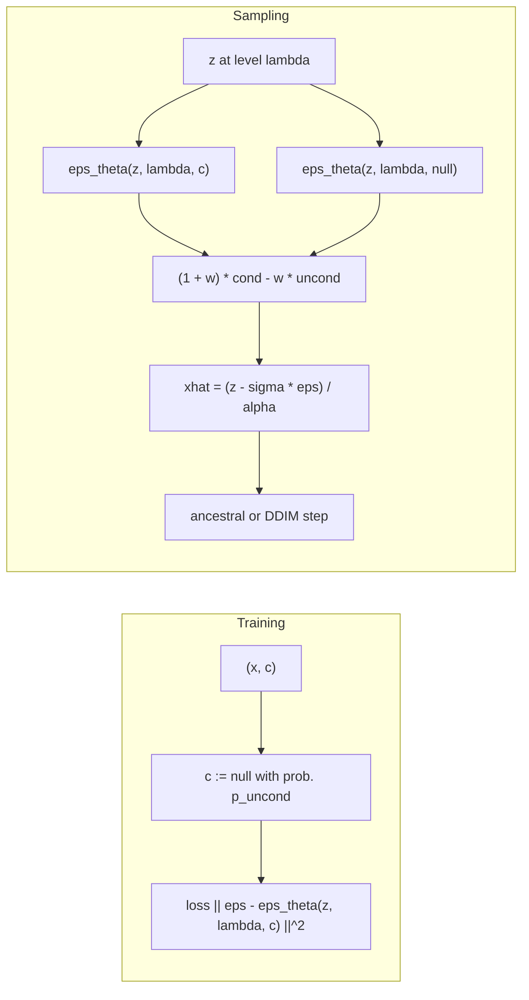

## Abstract

Classifier guidance gave diffusion models a way to exchange diversity for fidelity, but it needs a second network trained on noised inputs, and its gradient-following sampler looks uncomfortably like an adversarial attack on the very kind of classifier that FID and Inception Score are computed with. Ho and Salimans show the classifier is unnecessary. A single denoiser is trained with its conditioning replaced by a null token some fraction of the time, so it represents a conditional and an unconditional score at once. At sampling time the two predictions are combined linearly, pushing the sample along the direction in which the conditional score differs from the unconditional one. Sweeping one weight traces the same IS/FID frontier that classifier guidance and GAN truncation produce; on ImageNet 128×128 the method reaches FID 2.43, below classifier-guided ADM-G. The price is two denoiser evaluations per step, which is exactly what makes the compute-matched comparison go the other way.

**Keywords:** classifier-free guidance, conditional diffusion, implicit classifier, score extrapolation, fidelity–diversity trade-off, conditioning dropout

## 1 Introduction

GANs and flows have a simple dial for sample quality: truncate or cool the input noise. The obvious analogues for diffusion — scaling the score, or shrinking the noise injected during sampling — only produce blur. Classifier guidance ([ADM](/blog/diffusion-beats-gans/), two notes back in this series) was the first dial that worked: add the input-gradient of a classifier's log-probability to the score, and sweep its strength.

The authors raise three objections, and the third is the interesting one. It complicates the pipeline, since the classifier must be trained on noised data and no pretrained one can be plugged in. <mark>Following a classifier's gradient during sampling can be read as a gradient-based adversarial attack on a classifier</mark>, which makes improvements in classifier-based metrics hard to interpret — Inception Score is, by construction, a measure of classifier confidence. And stepping along classifier gradients resembles GAN training with a non-parametric generator, and GANs are already known to do well on exactly these metrics. So the question is whether a *pure* generative model, with no classifier gradient anywhere in the sampler, shows the same trade-off. The paper is explicit that its experiments answer that question and are not an attempt to top leaderboards.

## 2 Background

Models are trained in continuous time and indexed by the log signal-to-noise ratio $\lambda \in [\lambda_{\min}, \lambda_{\max}]$. The variance-preserving forward process is

$$
q(z_\lambda \mid x) = \mathcal{N}(\alpha_\lambda x,\; \sigma_\lambda^2 I),
\qquad \alpha_\lambda^2 = \frac{1}{1+e^{-\lambda}},
\quad \sigma_\lambda^2 = 1-\alpha_\lambda^2,
\tag{1}
$$

so that $\lambda = \log(\alpha_\lambda^2/\sigma_\lambda^2)$ and noising runs toward smaller $\lambda$. Re-indexing by $\lambda$ rather than by a step $t$ is what lets one guidance weight apply uniformly across noise levels; the discrete-time version of the same chain is in the [DDPM](/blog/ddpm/) note and its continuous limit in [Score-SDE](/blog/score-sde/). The network predicts noise and is trained with

$$
\mathbb{E}_{\epsilon,\lambda}\big[\lVert \epsilon_\theta(z_\lambda) - \epsilon \rVert_2^2\big],
\qquad z_\lambda = \alpha_\lambda x + \sigma_\lambda \epsilon,
\tag{2}
$$

with $\lambda$ drawn from $p(\lambda)$. That is denoising score matching at every noise level, so $\epsilon_\theta(z_\lambda) \approx -\sigma_\lambda \nabla_{z_\lambda}\log p(z_\lambda)$ — with the caveat, which the paper makes twice and later leans on, that an unconstrained network need not be the gradient of anything. Sampling is the ancestral sampler over an increasing sequence of $\lambda$; the reverse variance is a log-space interpolation between the two analytic bounds $\tilde\sigma^2_{\lambda'\mid\lambda}$ and $\sigma^2_{\lambda\mid\lambda'}$ with a *constant* exponent $v$ rather than the learned, input-dependent one of [Improved DDPM](/blog/improved-ddpm/). A conditional model simply takes $c$ as an extra input.

## 3 Method

> **Key idea.** By Bayes' rule a generative model already contains a classifier, $p(c \mid z) \propto p(z \mid c)/p(z)$, whose gradient is the difference of the conditional and unconditional scores. Train one network to output both, and guide with that difference instead of with a separate classifier.

### 3.1 Classifier guidance, restated

In this notation, classifier guidance with strength $w$ replaces the conditional noise prediction by

$$
\tilde\epsilon_\theta(z_\lambda, c) = \epsilon_\theta(z_\lambda, c) - w\,\sigma_\lambda \nabla_{z_\lambda} \log p_\theta(c \mid z_\lambda)
\approx -\sigma_\lambda\nabla_{z_\lambda}\big[\log p(z_\lambda\mid c) + w\log p_\theta(c\mid z_\lambda)\big],
\tag{3}
$$

which samples approximately from $\tilde p_\theta(z_\lambda \mid c) \propto p_\theta(z_\lambda \mid c)\, p_\theta(c \mid z_\lambda)^w$: mass moves toward points the classifier labels confidently, which is what IS rewards. A toy example with three isotropic Gaussian classes ([Fig. 2 in the paper](https://arxiv.org/pdf/2207.12598#page=2)) shows the guided conditionals becoming markedly non-Gaussian, concentrating, and moving away from each other as $w$ grows.

One identity is worth keeping. Since $p(z\mid c)p(c\mid z)^w \propto p(z)\,p(c\mid z)^{w+1}$, guiding an *unconditional* model with weight $w+1$ is in theory the same as guiding a conditional one with weight $w$. ADM nonetheless did best guiding an already conditional model, so that setting is kept here — <mark>an unexplained empirical fact that the theory says should not matter</mark>, and the first sign that these manipulations are not doing exactly what the algebra claims.

### 3.2 Joint training by conditioning dropout



One network parameterizes both models, with a null token standing in for "no condition": $\epsilon_\theta(z_\lambda) = \epsilon_\theta(z_\lambda, c=\varnothing)$. Training is ordinary conditional training except that for each example $c$ is replaced by $\varnothing$ with probability $p_\text{uncond}$. <mark>No extra parameters, no second model, no change to the loss.</mark> Training two separate models would work too; the authors choose joint training for simplicity and for keeping the parameter count fixed — which also means the conditional model has *less* capacity than a comparable ADM model plus classifier, not more.

### 3.3 Guided sampling

Each sampling step uses

$$
\tilde\epsilon_\theta(z_\lambda, c) = (1+w)\,\epsilon_\theta(z_\lambda, c) - w\,\epsilon_\theta(z_\lambda),
\tag{4}
$$

then forms $\tilde x = (z_\lambda - \sigma_\lambda \tilde\epsilon)/\alpha_\lambda$ and takes the usual ancestral (or DDIM) step. $w=0$ is the plain conditional model; $w>0$ extrapolates past it, away from the unconditional prediction. Note the order: <mark>guidance is applied to $\epsilon$, and $\tilde x$ is computed from the guided $\epsilon$</mark>, so the implied clean sample is an extrapolation too and can leave the data range.

### 3.4 Why it resembles, but is not, classifier guidance

With exact scores $\epsilon^*$, the implicit classifier $p^i(c\mid z_\lambda) \propto p(z_\lambda\mid c)/p(z_\lambda)$ has

$$
\nabla_{z_\lambda} \log p^i(c \mid z_\lambda) = -\frac{1}{\sigma_\lambda}\big[\epsilon^*(z_\lambda, c) - \epsilon^*(z_\lambda)\big],
\tag{5}
$$

and substituting this into Eq. (3) gives exactly the form of Eq. (4). The authors are careful not to claim equivalence, and the distinction carries their main argument. The learned $\epsilon_\theta$ come from unconstrained networks and need not be conservative vector fields, so in general <mark>no scalar potential exists whose gradient is the learned guidance direction</mark> — hence the sampler cannot be following any classifier's gradients, which is precisely the objection it was built to answer. They also note the converse caution: inverting a misspecified generative model by Bayes' rule can give an inconsistent classifier with no performance guarantee, so whether Eq. (4) helps at all is an empirical question.

### 3.5 Intuition: a Gaussian case with exact scores

Take one dimension, $p(x\mid c)=\mathcal{N}(m_c, s^2)$, with class means themselves spread as $\mathcal{N}(0,\tau^2)$ so that the marginal is $\mathcal{N}(0, s^2+\tau^2)$ — the continuum version of the paper's three-Gaussian figure, chosen because it keeps both scores linear. At level $\lambda$ write $S^2=\alpha^2s^2+\sigma^2$ and $U^2=S^2+\alpha^2\tau^2$, so $\epsilon^*(z,c)=\sigma(z-\alpha m_c)/S^2$ and $\epsilon^*(z)=\sigma z/U^2$. Substituting into Eq. (4) and matching to the form $\sigma(z-\tilde\mu)/\tilde S^2$:

$$
\tilde S^2 = \frac{S^2}{1+w-wr},
\qquad
\tilde\mu = \alpha m_c\,\frac{1+w}{1+w-wr},
\qquad r=\frac{S^2}{U^2}\in(0,1).
\tag{6}
$$

Both effects of guidance are in that line. The variance shrinks by $1+w-wr$, which is the diversity loss. The mean is multiplied by $g(w)=(1+w)/(1+w-wr)>1$, so the guided conditional does not merely sharpen around $m_c$ — <mark>it overshoots the class mean, moving away from the unconditional mean</mark>. As $w\to\infty$ the distribution collapses to a point at $m_c/(1-r)$, not at $m_c$.

Two readings follow. First, the overshoot is largest at high noise: as $\alpha\to0$, $r\to1$ and $g(w)\to1+w$, so guidance acts hardest early in sampling, where the sample's coarse identity is decided. Second, $g$ depends on class overlap. In the low-noise limit $g(\infty)=(s^2+\tau^2)/\tau^2$, which is near 1 for well-separated classes and large when within-class spread rivals between-class spread. This is, I think, the cleanest available explanation of the measured curves: a systematic mean shift and a variance collapse both raise FID, while a mean shift *away from other classes* monotonically raises classifier confidence and therefore IS. At small $w$ the variance shrink mostly removes low-density samples the model puts outside the data manifold, so FID improves; past that the shift dominates and FID turns around, while IS never does. The saturated colours the authors observe at $w=3.0$ are what an overshot mean looks like in pixels.

### 3.6 Algorithm

```
# Training (Algorithm 1)
for (x, c) in data:
    with probability p_uncond:  c = NULL
    lam = -2 * log(tan(a * u + b)),  u ~ U[0,1]        # cosine-like p(lambda)
    eps ~ N(0, I)
    z   = alpha(lam) * x + sigma(lam) * eps
    step on grad_theta || eps_theta(z, lam, c) - eps ||^2

# Sampling (Algorithm 2), increasing lambda_1 .. lambda_T
z = randn()
for t in 1..T:
    e = (1 + w) * eps_theta(z, lam[t], c) - w * eps_theta(z, lam[t], NULL)   # 2 passes
    xhat = (z - sigma(lam[t]) * e) / alpha(lam[t])
    if t < T:  z = ancestral_step(z, xhat, lam[t], lam[t+1], v)
    else:      z = xhat                                  # no noise on the last step
return z
```

## 4 Implementation notes

Everything below is from Sections 2 and 4; the architecture is inherited wholesale from [ADM](/blog/diffusion-beats-gans/).

| Item | ImageNet 64×64 | ImageNet 128×128 |
|---|---|---|
| Architecture / hyperparameters | ADM's, **tuned for classifier guidance** | same |
| Time parameterization | continuous $\lambda$ | continuous $\lambda$ |
| $\lambda$ range | $[-20, 20]$ | $[-20, 20]$ |
| $p(\lambda)$ | $\lambda=-2\log\tan(au+b)$, $u\sim U[0,1]$, $b=\arctan(e^{-\lambda_{\max}/2})$, $a=\arctan(e^{-\lambda_{\min}/2})-b$ | same |
| Variance exponent $v$ | 0.3 | 0.2 |
| Training steps | 400K | 2.7M |
| $p_\text{uncond}$ | 0.1 / 0.2 / 0.5 (swept) | not stated |
| Sampling steps $T$ | not stated | 128 / 256 / 1024 |
| Guidance sweep | $w\in\{0,0.1,\dots,4\}$ | same |
| Evaluation | FID and IS on 50,000 samples | same |
| Optimizer, LR, batch size, EMA, dropout, parameter count, hardware | not stated | not stated |

Easy to get wrong when reproducing:

- **The null token is an input value, not a separate head.** The same network, same weights, same loss; only $c$ changes.
- **$\lambda$ is spaced uniformly in $u$, not in $\lambda$.** The schedule is the hyperbolic-secant-like $p(\lambda)$ above restricted to a bounded interval, and the final sample is $x_\theta(z_{\lambda_{\max}})$ — the last step returns $\tilde x$ with no noise added.
- **$v$ matters only for finite $T$.** The two variance bounds coincide as $\lambda'\to\lambda$, so a $v$ tuned at $T=256$ is not neutral at $T=1024$.
- **Two forward passes per step.** Batching $c$ and $\varnothing$ together is the usual trick; the compute accounting in Section 4.3 depends on this doubling.
- **$\lambda_{\max}=20$ is a very low noise floor.** With $\sigma^2_\lambda\approx e^{-\lambda}$, the terminal state is almost noise-free; a discrete-time model ported to this recipe must map its $t$ grid onto $\lambda$ rather than reuse it.
- Whether $\tilde x$ is clipped to the data range during sampling is **not stated**, and with an extrapolated $\epsilon$ this is exactly where a reproduction can diverge.

One printing inconsistency: Section 4.3, Table 2 and the text all use $T\in\{128,256,1024\}$, but the legend of Fig. 5 labels the third curve $T=512$.

## 5 Experiments

**Setup.** Class-conditional ImageNet at 64×64 and 128×128, area-downsampled, the standard testbed for FID/IS trade-off curves since BigGAN.

**ImageNet 128×128** (Table 2, $T=256$ column):

| Model | FID ↓ | IS ↑ |
|---|---|---|
| BigGAN-deep | 5.7 | 124.5 |
| BigGAN-deep, max-IS truncation | 25 | 253 |
| CDM | 3.52 | 128.8 |
| LOGAN | 3.36 | 148.2 |
| ADM-G (classifier guidance) | 2.97 | – |
| Ours, $w=0.0$ | 7.27 | 82.45 |
| Ours, $w=0.1$ | 4.53 | 106.12 |
| **Ours, $w=0.3$** | **2.43** | 158.47 |
| Ours, $w=1.0$ | 7.86 | 297.98 |
| Ours, $w=4.0$ | 21.53 | **421.03** |

**ImageNet 64×64** (Table 1, as $p_\text{uncond}=0.1$ / $0.2$ / $0.5$):

| Model | FID ↓ | IS ↑ |
|---|---|---|
| ADM | 2.07 | – |
| CDM | 1.48 | 67.95 |
| Ours, $w=0.0$ | 1.8 / 1.8 / 2.21 | 53.71 / 52.9 / 47.61 |
| **Ours, $w=0.1$** | **1.55** / 1.62 / 1.91 | 66.11 / 64.58 / 56.1 |
| Ours, $w=0.3$ | 3.03 / 2.93 / 2.65 | 92.8 / 88.64 / 74.92 |
| Ours, $w=1.0$ | 12.6 / 11.21 / 9.13 | 170.1 / 158.29 / 131.1 |
| Ours, $w=4.0$ | 26.22 / 23.84 / 21.48 | 260.2 / 248.97 / **225.1** |

**Sampling steps** (Table 2, $w=0.3$): FID 3.04 at $T=128$, 2.43 at $T=256$, 2.43 at $T=1024$.

**Claim-by-claim reading.**

- *Classifier-free guidance trades IS against FID like classifier guidance and GAN truncation.* Directly supported, on two resolutions, with 41 points per curve. <mark>FID is best at small guidance ($w=0.3$ at 128×128, $w=0.1$ at 64×64) and degrades beyond it, while IS rises monotonically</mark>; at $w=4.0$ the model beats max-IS BigGAN-deep on both metrics at once (21.53/421.03 against 25/253). This is the paper's central claim and it is cleanly made — though Section 4.1 describes it as "FID monotonically decreasing and IS monotonically increasing with $w$", which the paper's own tables contradict: FID falls and then rises. Only IS is monotone.
- *The 128×128 results are state of the art.* Supported at face value — 2.43 against ADM-G's 2.97 — and then undercut by the authors themselves in Section 4.3: each step costs two network evaluations, so the speed-matched comparison is $T=128$, whose 3.04 loses to ADM-G. Both numbers are in the same table.
- *Only a small share of capacity need go to the unconditional task.* $p_\text{uncond}=0.5$ is worse "across the entire IS/FID frontier". At a fixed $w$ the table looks the opposite way round (at $w=1.0$, 0.5 gives FID 9.13 against 0.1's 12.6), so the claim only holds when read at matched IS: interpolating the $p=0.1$ curve to IS $\approx183$ gives FID near 14.6, against 16.16 for $p=0.5$ at $w=2.0$; at IS $\approx75$, about 1.9 against 2.65. <mark>Comparing guidance settings at equal $w$ rather than at equal IS reverses the conclusion</mark> — an easy mistake to make from the table alone.
- *Guidance is not adversarial against classifiers.* Argued, not measured. It rests entirely on the non-conservativeness of learned scores, which is asserted from the use of unconstrained networks. No experiment estimates how far $\epsilon_\theta$ is from a gradient field.
- *Increasing $w$ decreases variety and increases fidelity.* Figures 1, 3, 6–8 show it convincingly by eye, including the same-seed grids. There are no precision/recall numbers anywhere in the paper, so the diversity loss is quantified only indirectly, through FID.
- *Strong guidance saturates colours.* Observed in the Fig. 3 caption, not analysed. My §3.5 says this is what an overshot conditional mean should look like, but the paper offers nothing.
- *The behaviour is resolution-independent.* Not claimed, and the tables argue against it: at 64×64 FID degrades immediately past $w=0.1$ (1.55 → 2.04 at $w=0.2$), while at 128×128 there is a wide basin ($w=0.2$–$0.5$ give 3.03, 2.43, 2.49, 2.98). The two models also differ in training length by a factor of nearly seven, so the cause is not identified.

## 6 Limitations

**Stated by the authors**

- Sampling requires two denoiser passes per step; classifier guidance can be cheaper because classifiers are smaller. Injecting the conditioning late in the network to share computation is suggested and left untried.
- Hyperparameters were tuned for classifier guidance and may be suboptimal here.
- The method needs an unconditional model, which is avoidable only when the class set is small enough to average $\sum_c p(x\mid c)p(c)$ — as many passes as classes.
- Any method that raises fidelity by lowering diversity raises a deployment question about under-represented parts of the data; boosting quality *without* losing diversity is named as future work.

**My reading**

- The distribution actually sampled is never characterized. With exact scores Eq. (4) is the score of $p(z_\lambda\mid c)^{1+w}p(z_\lambda)^{-w}$ *at each noise level separately*, but that family is not the diffusion of any single sharpened data distribution, so the sampler has no stated target. The paper's Fig. 2 solves the guided density numerically at the data level, which is a different object from what Algorithm 2 produces.
- Two resolutions, one dataset, two classifier-based metrics, no error bars, no repeated seeds. Differences like 2.43 vs 2.48 carry no weight.
- The "no longer gaming the metrics" argument is only partial. The sampler still moves mass toward regions where the *implicit* classifier is confident, and IS rewards exactly that; what has been removed is the explicit gradient, not the mechanism.
- $w$ is constant across $\lambda$. My §3.5 says the effective distortion is strongly $\lambda$-dependent, so a constant $w$ is unlikely to be the right knob, and the paper does not ask.
- $p_\text{uncond}$ for the headline 128×128 model is never given, which is awkward for the one hyperparameter the paper studies.

## 7 Extensions

**What was built on this**

- [LDM](/blog/latent-diffusion/) uses it for both its headline results, and its guidance scale $s$ appears to follow the $\tilde\epsilon=\epsilon_u+s(\epsilon_c-\epsilon_u)$ convention, i.e. $s=1+w$ here — the LDM paper prints no formula, so treat the mapping as unverified.
- [DiT](/blog/dit/), [SiT](/blog/sit/) and [SD3](/blog/sd3-rectified-flow-transformers/) all report guided numbers; guidance strength has become a reported hyperparameter in the way learning rate is.
- [TSDiff](/blog/tsdiff/) self-guides a time-series diffusion model with its own observation likelihood rather than a null-token contrast, the closest thing in this collection to guidance outside the image setting.
- Distilling a guided sampler into a single network, so that guidance costs one pass instead of two, is the standard answer to the cost objection. *(from general knowledge, unverified)*
- Restricting guidance to an interval of noise levels, and guiding with a weaker model instead of an unconditional one, are the two best-known later repairs of the diversity loss. *(from general knowledge, unverified)*

**Open problems**

- What distribution the guided sampler targets, and whether a sampler exists whose stationary object is the normalized $p(x\mid c)^{1+w}p(x)^{-w}$.
- Why FID has an interior optimum in $w$ while IS does not, in terms of model error rather than of the exact-score algebra.
- Whether learned scores are measurably non-conservative, and whether guidance benefit correlates with that.
- How to raise fidelity without losing coverage — the authors' own closing question.

**Research directions**

*These are ideas, not results — none has been run.*

1. **A noise-level schedule for $w$.** *Hypothesis:* from Eq. (6) the mean overshoot factor grows toward $1+w$ as $\alpha\to0$, so a schedule that suppresses guidance at high noise and keeps it at low noise should move the FID/IS frontier outward rather than sliding along it. *Data:* ImageNet 64×64, the paper's own setting. *Baseline:* constant $w$, the full published sweep. *Metric:* the FID/IS frontier, plus precision/recall, which the paper omits. *Likely failure mode:* any monotone schedule is absorbed into an effective constant $w$ and the frontier does not move — which is testable cheaply by checking whether the schedule's curve lies on the constant-$w$ curve.
2. **Guided generation of conditional return paths, with dispersion as the metric.** *Hypothesis:* for path generation conditioned on a regime label or a macro state, a noise-aware classifier is rarely available while nulling the condition is trivial, so CFG is the natural conditioning knob — but the overshoot in Eq. (6) predicts that guidance systematically understates dispersion, so calibrated $w$ should be *near zero* even where image models want 0.3. *Data:* daily equity index returns with regime labels from a fitted hidden Markov model; condition on the label and a lagged window. *Baseline:* the same model at $w=0$, and [CSDI](/blog/csdi/)-style conditioning without guidance. *Metric:* CRPS and interval coverage as functions of $w$; realized-volatility and tail-quantile bias; the $w$ at which coverage first breaks. *Likely failure mode:* the conditional and unconditional scores are too close for low-dimensional conditioning, so guidance does nothing until $w$ is large enough to destroy calibration outright.
3. **Measuring non-conservativeness.** *Hypothesis:* the paper's central defence is that $\epsilon_\theta(\cdot,c)-\epsilon_\theta(\cdot)$ is not a gradient; the antisymmetric part of its Jacobian can be estimated with Hutchinson-style probes and should be non-negligible, and larger for weakly trained models. *Data:* any released class-conditional diffusion checkpoint. *Baseline:* a deliberately conservative score network parameterized as $\nabla_z f_\theta(z)$. *Metric:* relative Frobenius norm of the skew part of the Jacobian against noise level; the guided FID/IS frontier of each model. *Likely failure mode:* the skew part is large but irrelevant, so the correlation with guidance behaviour is null and the argument stays qualitative.

## 8 Takeaways

- Guidance needs only the difference between a conditional and an unconditional score; conditioning dropout at $p_\text{uncond}\approx0.1$–$0.2$ supplies both from one network with no extra parameters.
- $w$ is a temperature-like knob, but not a pure temperature: in the Gaussian case it both shrinks the conditional variance and *shifts* its mean away from the unconditional one, which is why IS climbs monotonically while FID has an interior optimum.
- Report $w$ with every result, and compare methods at matched IS rather than at matched $w$ — the $p_\text{uncond}$ ablation reverses if you do not.
- The cost is two network evaluations per step, and the paper is candid that the compute-matched comparison against ADM-G goes against it.
- The "not an adversarial attack" argument is an argument, not a measurement: it rests entirely on learned scores being non-conservative, which is asserted from the architecture.
- For conditional generation of financial paths, CFG is attractive because a noise-aware classifier over regimes or macro states rarely exists while nulling the condition is free. The overshoot result says the risk is not vagueness but false confidence: a guided sampler concentrates on typical conditional outcomes and will understate dispersion and tails unless $w$ is kept small or calibrated against realized distributions.

## References

1. J. Ho, T. Salimans. *Classifier-Free Diffusion Guidance.* arXiv:2207.12598.
2. P. Dhariwal, A. Nichol. *Diffusion Models Beat GANs on Image Synthesis.* arXiv:2105.05233.
3. J. Ho et al. *Cascaded Diffusion Models for High Fidelity Image Generation* (CDM). arXiv:2106.15282.
4. D. Kingma, T. Salimans, B. Poole, J. Ho. *Variational Diffusion Models.* arXiv:2107.00630.
5. R. Rombach et al. *High-Resolution Image Synthesis with Latent Diffusion Models.* arXiv:2112.10752.
