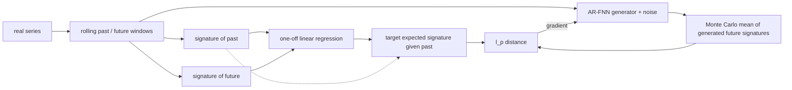

## Abstract

This paper targets the conditional law of a future path segment given a past segment, the object that autoregressive econometric models describe, and asks how to learn it without the instability of adversarial training. The authors lift paths to their signatures, a graded sequence of iterated integrals whose expectation characterises the law of a stochastic process under regularity conditions. Restricting the Wasserstein-1 critic to linear functionals of the signature gives a metric, Sig-$W_1$, that has an explicit formula: the norm of the difference of two expected signatures. No discriminator has to be trained. In the conditional setting the expected future signature under the data is estimated once by linear regression on the past signature, and the generator is then fitted by plain stochastic gradient descent against that target. With a shared autoregressive feed-forward generator, the method is competitive with or better than TimeGAN, RCGAN, GMMN and GARCH on VAR(1), S&P 500 / Dow Jones and Bitcoin data, and trains visibly more smoothly.

**Keywords:** conditional GAN, Wasserstein GAN, path signature, expected signature, rough path theory, autoregressive generator, synthetic financial data

## 1 Introduction

Synthetic time series are wanted for testing data-driven products and for sharing data under privacy constraints. Hand-built parametric models are risky in finance, where there is no physics to lean on, yet off-the-shelf deep generative models handle temporal dependence badly and the dimension of the joint law of a length-$T$ window grows with $T$.

The authors argue for learning the conditional law $\mathrm{Law}(X_{\text{future}}\mid X_{\text{past}})$ instead of the joint. For a stationary process with autoregressive structure the joint law factorises into identical conditionals, so <mark>one long trajectory yields on the order of $T$ training pairs for the conditional problem but a single sample for the joint one</mark>.

A conditional Wasserstein GAN (CWGAN) hits two obstacles. It is a min-max problem, and first-order descent-ascent may fail to converge even in convex-concave cases, making tuning fragile. Worse, the critic's expectation under the *data* conditional law, $\mathbb{E}[f(X_{\text{future}})\mid X_{\text{past}}]$, is not observed; with continuous conditioning variables it must be approximated by an extra regression that has to be redone every time the critic changes, adding bias and cost. In practice a one-sample estimate is used, which is noisy.

## 2 Background

With past window $\bar p$ and future window $\bar q$, write $x_{\text{past},t}=(x_{t-\bar p+1},\dots,x_t)$ and $x_{\text{future},t}=(x_{t+1},\dots,x_{t+\bar q})$. The generator $G(\theta,x_{\text{past}},z)$ induces a conditional law $\nu(\theta,x_{\text{past}})$ that should match the true $\mu(x_{\text{past}})$ in

$$
W_1(\mu,\nu)=\sup_{\|f\|_{\mathrm{Lip}}\le1}\ \mathbb{E}_{\mu}[f(X)]-\mathbb{E}_{\nu}[f(X)]. \tag{1}
$$

**Signature.** A discrete series is embedded as a continuous path by taking cumulative sums, interpolating linearly and adding time as an extra coordinate. For a path $X:[0,T]\to\mathbb{R}^d$ of bounded variation the signature is

$$
S(X)=\big(1,\mathbf{X}^{(1)},\mathbf{X}^{(2)},\dots\big),\qquad \mathbf{X}^{(n)}=\int_{0<t_1<\dots<t_n<T} dX_{t_1}\otimes\cdots\otimes dX_{t_n}, \tag{2}
$$

truncated in practice at degree $M$ to give $S_M(X)$. Level one is the increment; level two contains the signed areas between coordinates (illustrated in [Fig. 3 in the paper](https://arxiv.org/pdf/2006.05421#page=12)). Three properties are used. On the time-augmented path space the signature determines the path uniquely. It is *universal*: any continuous function on a compact set of signatures is uniformly approximated by a linear functional. And the *expected signature* $\mathbb{E}[S(X)]$, when it has infinite radius of convergence, determines the law of the process — the path-space counterpart of a moment generating function.

## 3 Method

> **Key idea.** If the critic is only allowed to be a linear functional of the signature, the supremum in the Wasserstein distance can be solved by duality. The "discriminator" collapses to a norm of a difference of expected signatures, and the unknown conditional expectation under the data becomes a linear regression that is fitted once.

### 3.1 The Sig-$W_1$ metric

Universality suggests replacing Lipschitz test functions on signature space by linear ones, $\text{Sig-}W_1(\mu,\nu)=\sup_{\|L\|_{\mathrm{Lip}}\le1}\mathbb{E}_\mu[L(S)]-\mathbb{E}_\nu[L(S)]$. Equipping signature space with the $\ell_p$ norm, the Lipschitz constant of a linear $L$ is its dual $\ell_q$ norm ($1/p+1/q=1$), and the supremum is attained in closed form:

$$
\text{Sig-}W_1(\mu,\nu)=\big\|\mathbb{E}_{X\sim\mu}[S(X)]-\mathbb{E}_{X\sim\nu}[S(X)]\big\|_p. \tag{3}
$$

This generalises the $\ell_2$ version from earlier Sig-WGAN work; for $p=2$ it equals the unnormalised signature MMD of Chevyrev and Oberhauser. The experiments use $p=2$ and truncation at degree $M$. The authors are explicit that Sig-$W_1$ is a proxy; they conjecture that in general it differs from $W_1$ on signature space.

### 3.2 Conditional version: regress once, then descend

Applying (3) to conditional laws needs $\mathbb{E}_\mu[S_{\text{future}}\mid S_{\text{past}}]$. It is a measurable function of $S_{\text{past}}$, and assuming continuity, universality says it is approximately linear in the past signature:

$$
\hat L=\arg\min_{L\ \text{linear}}\ \mathbb{E}\big\|S_{M_2}(X_{\text{future}})-L\big(S_{M_1}(X_{\text{past}})\big)\big\|^2, \tag{4}
$$

solved by ordinary least squares on rolling-window pairs, with truncation degrees $M_1,M_2$ chosen by cross-validation. The generator loss is then

$$
\ell(\theta)=\frac1N\sum_{i=1}^{N}\Big\|\hat L\big(S_{M_1}(x^{(i)}_{\text{past}})\big)-\frac{1}{n_{MC}}\sum_{j=1}^{n_{MC}}S_{M_2}\big(\hat x^{(i,j)}_{\text{future}}\big)\Big\|_p, \tag{5}
$$

where $\hat x^{(i,j)}_{\text{future}}$ are $n_{MC}$ generator samples given the $i$-th real past. <mark>The regression is done once before generative training, whereas a CWGAN would have to re-estimate a conditional expectation after every critic update</mark>, and minimising (5) is ordinary supervised-style optimisation with no inner maximisation.

The authors' flowchart is [Fig. 2 in the paper](https://arxiv.org/pdf/2006.05421#page=8).

### 3.3 AR-FNN generator

Assuming $X_{t+1}=g(X_{\text{past},t},\varepsilon_{t+1})$ with i.i.d. noise, the generator is a one-step map — a feed-forward network with residual connections and parametric ReLUs taking the $\bar p$ lags and a Gaussian noise vector — applied recursively to its own outputs to produce a future of any length. The same generator is used for every baseline so that only the training objective differs.

## 4 Experiments

**Setup.** Baselines: CWGAN, TimeGAN, RCGAN, GMMN (Gaussian-kernel MMD), and GARCH on the financial data, all neural ones sharing the 3-layer AR-FNN; 80/20 train/test split. Metrics: $\ell_1$ distance between histograms of marginals, absolute error of lag-1 autocorrelation, $\ell_1$ distance between cross-correlation matrices, the train-on-synthetic-test-on-real $R^2$ compared with train-on-real $R^2$, and Sig-$W_1$ itself. Data: (i) VAR(1) with $d\in\{1,2,3\}$, $T=40000$, $\bar p=\bar q=3$, signature degree 2; (ii) log return and log median realised volatility of SPX, and of SPX plus DJI, from the Oxford-Man realised library, windows of 3, signature degree 3 and 2 respectively; (iii) hourly BTC-USD, 2021 for training and 2022 for testing, 24 hours of past to 6 hours of future, degree 4.

Main financial result, Table 3 of the paper (left / right = SPX / SPX+DJI; lower is better; best per sub-column in bold, following the paper):

| Model | Marginal | Auto-corr. | Cross-corr. | $R^2$ rel. err. (%) | Sig-$W_1$ |
|---|---|---|---|---|---|
| **SigCWGAN** | 0.01730 / 0.01674 | 0.01342 / **0.01192** | **0.01079** / **0.07435** | 2.996 / 7.948 | **0.18448** / **4.36744** |
| TimeGAN | 0.02155 / 0.02127 | 0.05792 / 0.03035 | 0.12363 / 0.61488 | 5.955 / 8.586 | 0.58541 / 5.99482 |
| RCGAN | 0.02094 / **0.01655** | 0.03362 / 0.04075 | 0.04606 / 0.15353 | **2.788** / **7.190** | 0.47107 / 5.43254 |
| GMMN | 0.01608 / 0.02387 | **0.01283** / 0.02676 | 0.04651 / 0.22380 | 9.049 / 7.384 | 0.59073 / 6.23777 |
| GARCH | **0.01583** / 0.01670 | 0.13392 / 0.11337 | 0.15791 / 0.7290 | 12.1253 / 12.5686 | 0.64825 / 6.15344 |

<mark>SigCWGAN is best on cross-correlation by a wide margin and is never far behind where it loses</mark>. Summed over lags up to 100, its ACF discrepancy on SPX/DJI is 4.924 against 7.028 for GARCH and above 10 for the other three GANs ([Fig. 10 in the paper](https://arxiv.org/pdf/2006.05421#page=25)). On Bitcoin it has the best marginal (2.0532) and Sig-$W_1$ (0.0829), while RCGAN is slightly better on autocorrelation (0.0532 vs 0.091) and $R^2$ (0.3165 vs 0.3320).

On 3-dimensional VAR(1) with a fixed two-minute training budget, SigCWGAN has the best autocorrelation (0.0085) and Sig-$W_1$ (0.4286) but the worst marginal score (0.0314 vs 0.0084 for GMMN). Training curves show its loss and ACF score decaying smoothly while TimeGAN's and RCGAN's oscillate; GMMN's MMD loss converges but its ACF score does not ([Fig. 6 in the paper](https://arxiv.org/pdf/2006.05421#page=23)). A CWGAN fed a better Monte Carlo estimate of the conditional mean converges faster, supporting the diagnosis in Section 1.

## 5 Discussion

**Strengths.** The contribution is a genuine simplification: <mark>one closed-form identity removes both the adversary and the repeated conditional-expectation estimate</mark>. Sharing one generator across baselines isolates the effect of the loss, and the continuous-path view naturally covers irregular sampling.

**Weaknesses.** Sig-$W_1$ is reported as an evaluation metric although it is the quantity SigCWGAN optimises, so those columns favour it by construction. In the VAR(1) table the $R^2$ column is bolded at SigCWGAN's 0.0394, the largest value, while the neighbouring figure defines the predictive score as an absolute $R^2$ difference (lower better) under which GMMN's 0.0026 would win; the text and the table do not obviously agree, and I could not resolve this from the paper. Windows are very short ($\bar p=\bar q=3$ for equities), the dependence metric is lag-1 only, and no standard deviations over seeds are given. A truncated signature has $\sum_{k\le M} d^k$ terms, and the authors concede the method may suffer in high path dimension. The OLS step assumes the conditional expected signature is linear in a low-degree past signature, and, as a matching of conditional means in feature space, the loss constrains the conditional law only up to the truncation level.

**Not shown.** Tail behaviour or risk measures of generated paths, more than four channels, longer conditioning windows on real data, and any comparison with likelihood-based or diffusion models.

## 6 Takeaways

- Constraining the Wasserstein critic to linear functionals of the signature yields a closed-form distance between expected signatures; the GAN becomes a moment-matching problem on path space.
- In the conditional setting the hard part is the data-side conditional expectation; with signatures it is a single least-squares fit.
- Empirically the gain is stability and cross-series dependence, not uniformly better marginals.
- Cost scales exponentially in truncation degree and polynomially in channels, so the approach suits low-dimensional, short-window problems unless paired with a latent embedding, as the authors suggest.
- For diffusion or SDE-based financial generators, the expected-signature distance is a cheap, discriminator-free path-level statistic: usable as an evaluation metric for temporal structure, and a natural candidate for an auxiliary or guidance loss on sampled trajectories. The paper does not explore this; it is a direction, not a result.

## References

1. S. Liao, H. Ni, M. Sabate-Vidales, L. Szpruch, M. Wiese, B. Xiao. *Sig-Wasserstein GANs for Conditional Time Series Generation.* arXiv:2006.05421; Mathematical Finance, 2024.
2. H. Ni, L. Szpruch, M. Sabate-Vidales, B. Xiao, M. Wiese, S. Liao. *Sig-Wasserstein GANs for Time Series Generation.* 2021.
3. I. Chevyrev, H. Oberhauser. *Signature moments to characterize laws of stochastic processes.* JMLR, 2022.
4. J. Yoon, D. Jarrett, M. van der Schaar. *Time-series Generative Adversarial Networks.* NeurIPS 2019.
5. D. Levin, T. Lyons, H. Ni. *Learning from the past, predicting the statistics for the future, learning an evolving system.* 2013.
