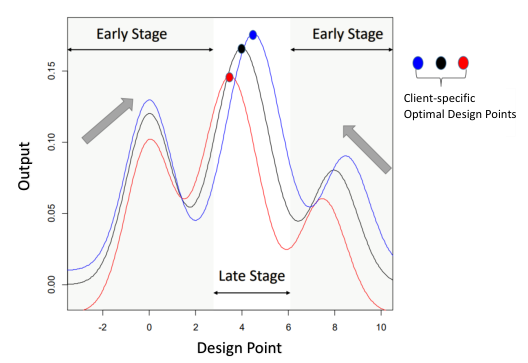
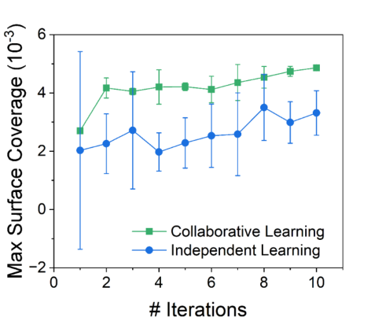

## Abstract

Labs, simulators or robots often optimise similar but not identical black-box functions on small budgets. Consensus BO (the authors' algorithm is called CBOC) lets them pool effort without pooling data. Each client runs its own Gaussian-process surrogate and acquisition function, then replaces its proposal with a weighted average of all proposals, using a doubly stochastic matrix that starts uniform and decays to the identity. Two schedules are given: a uniform linear decay and a "leader-driven" variant. For identical objectives with expected improvement, cumulative regret is shown to grow sublinearly. Collaboration beats independent BO and a federated Thompson-sampling baseline on shifted, rescaled test functions, and independent BO in a three-client finite-element biosensor study.

**Keywords:** Bayesian optimisation, collaborative design, consensus matrix, doubly stochastic matrices, federated BO, expected improvement, cumulative regret, heterogeneous clients

## 1 Introduction

Sequential optimal design, which the paper calls Bayesian optimisation (BO) once the surrogate is Bayesian, here a Gaussian process (GP), fits a surrogate, scores candidates with a utility (acquisition) function, runs the best one and repeats. The authors ask what changes when $K$ such loops run at once, on related but not identical functions, by parties who will share where they plan to experiment but not what they measured.

Two existing lines come close. **Batch BO** picks several designs from one surrogate and runs them in parallel: one objective, one centralised dataset, so neither heterogeneity nor privacy is handled. **Federated BO** (Dai et al., 2020; 2021) keeps raw data local by sharing random-Fourier-feature posterior samples, but still assumes a common objective, copes with heterogeneity only by reducing collaboration over time, and is tied to Thompson sampling.

The paper's requirements are to distribute the search, keep client-specific optima, and share designs instead of outcomes. It borrows from decentralised optimisation, where consensus methods (Nedić and Ozdaglar, 2009) mix local iterates through a doubly stochastic matrix until agents agree. The twist is that <mark>agreement is not the goal: the mixing matrix is deliberately driven to the identity, so collaboration is a transient that helps early and disappears late</mark>.

## 2 Background

GPs and EI are covered in the [BayesOpt tutorial note](/blog/bo-tutorial-frazier/); only what the proof uses is repeated here.

**GP surrogate.** Client $k$ observes $y_k=f_k(x)+\epsilon_k$ with Gaussian noise of variance $v_k^2$. Given data $D_k=\{X_k,y_k\}$ and kernel $\mathcal K$, the posterior at a test point has mean $\mu_k(x)=\mathcal K(x,X_k)[\mathcal K(X_k,X_k)+v_k^2I]^{-1}y_k$ and variance $\sigma_k^2(x)=\mathcal K(x,x)-\mathcal K(x,X_k)[\mathcal K(X_k,X_k)+v_k^2I]^{-1}\mathcal K(X_k,x)$.

**Expected improvement.** With incumbent $y_k^*=\max y_k$ and $z_k(x)=(\mu_k(x)-y_k^*)/\sigma_k(x)$,

$$
\mathrm{EI}_k(x)=\mathbb E\big[(\hat f_k(x)-y_k^*)_+\big]
=\sigma_k(x)\,\phi(z_k(x))+\big(\mu_k(x)-y_k^*\big)\,\Phi(z_k(x))
=\sigma_k(x)\,\tau(z_k(x)),
\tag{1}
$$

where $\phi,\Phi$ are the standard normal density and CDF and $\tau(z)=z\Phi(z)+\phi(z)$. The first term rewards uncertainty, the second a predicted gain; the regret proof works with the form $\sigma\tau(z)$.

**Regret.** $r_k^{(t)}=f_k(x_k^*)-f_k(x_k^{(t)\text{new}})$ is the shortfall of the design actually run; $R_{k,T}=\sum_{t\le T} r_k^{(t)}$ is sublinear if $R_{k,T}/T\to 0$.

**Doubly stochastic matrices** are non-negative with unit row and column sums. The paper says that for such $W$, $(W\otimes I_D)x_C=x_C$ exactly when all blocks of $x_C$ are equal; this needs a connected weight pattern, since $W=I$ fixes every $x_C$. By Birkhoff–von Neumann, $W$ is also a convex combination of permutation matrices.

## 3 Method

> **Key idea.** Every client solves its own acquisition problem; the $K$ proposals are then mixed by a doubly stochastic matrix that decays from uniform (full pooling) to the identity (independent BO), so early experiments are shared exploration and late ones personalised exploitation.

### 3.1 Local step

Each client keeps a budget of $T$ experiments, one per iteration, and an initial dataset $D_k^{(0)}$. At iteration $t$ the client computes its own acquisition maximiser,

$$
x_k^{(t)}=\arg\max_{x}\;\mathbb E_{\hat y_k\mid D_k^{(t)}}\big[U(\hat y_k(x))\big].
\tag{2}
$$

This is ordinary single-client BO with any utility $U$ (EI, knowledge gradient, …), an advantage over FedBO. Simply averaging utilities over clients would not couple anything, since $\max_{\{x_k\}}\frac1K\sum_k \mathbb E[U(\hat y_k(x_k))]$ separates into $K$ independent problems.

### 3.2 Consensus step

Stack the proposals as $x_C^{(t)}=[x_1^{(t)\top},\dots,x_K^{(t)\top}]^\top$. The design client $k$ actually runs is

$$
x_k^{(t)\text{new}}=\big[(W^{(t)}\otimes I_D)\,x_C^{(t)}\big]_k=\sum_{j=1}^K w_{kj}^{(t)}\,x_j^{(t)},
\tag{3}
$$

with $W^{(t)}$ symmetric, non-negative and doubly stochastic; row $k$ is how much client $k$ trusts each peer, applied identically to every coordinate.

Two consequences follow. **The centroid is preserved:** unit column sums give $\frac1K\sum_k x_k^{\text{new}}=\frac1K\sum_j x_j$, so consensus redistributes proposals around their mean without moving the group. **It is a soft assignment:** writing $W=\sum_l \eta_l P_l$, each permutation $P_l$ hands one client's proposal to another, as batch BO hands candidates to workers, and the consensus step is the $\eta$-weighted average of these hand-offs.

The consensus constraint $x_k=x_j$ is deliberately not imposed, since it would make everyone run the same experiment. The authors also argue that $W^{(t)}\to I$ is *necessary* under heterogeneity: once client $k$ sits at its optimum, any off-diagonal weight pulls it away.

### 3.3 Two schedules for $W^{(t)}$

**Uniform transitional.** Start from $W^{(0)}=\frac1K\mathbf 1\mathbf 1^\top$ and add $(K-1)/(TK)$ to the diagonal and $-1/(TK)$ off it each iteration (the paper's Eq. 5). Summing the increments gives an exact closed form the paper does not write down:

$$
W^{(t)}=\frac{t}{T}\,I+\Big(1-\frac{t}{T}\Big)\frac1K\mathbf 1\mathbf 1^\top
\quad\Longrightarrow\quad
x_k^{(t)\text{new}}=\lambda_t\,x_k^{(t)}+(1-\lambda_t)\,\bar x^{(t)},\qquad \lambda_t=\frac tT,
\tag{4}
$$

where $\bar x^{(t)}$ is the mean proposal. The uniform scheme is therefore <mark>linear shrinkage of each client's proposal toward the group mean, with a shrinkage weight that falls linearly from one to zero over the budget</mark>. $W^{(t)}$ reaches $I$ only at $t=T$, one step after the last experiment.

**Leader-driven.** Keep the uniform $W_1^{(t)}$ as a baseline. Each client also reports a scalar reward $S_k^{(t)}$, e.g. its maximal acquisition value, and the client with the largest reward becomes the leader $\ell$. A second matrix $W_2^{(t)}$ is built from $W_1^{(t)}$ by

$$
\begin{aligned}
w_{2,j\ell}=w_{2,\ell j}&=w_{1,j\ell}+\tfrac{K-1}{TK} && (j\neq\ell),\\
w_{2,ij}&=w_{1,ij}-\tfrac{1}{TK} && (i,j\neq\ell),\\
w_{2,\ell\ell}&=w_{1,\ell\ell}-\tfrac{(K-1)^2}{TK}.
\end{aligned}
\tag{5}
$$

Non-leaders shift weight toward the leader's proposal; the leader's own diagonal shrinks by whatever keeps the matrix doubly stochastic, which the authors read as pushing the leader to explore. Two heuristics: a client cannot lead twice running (the runner-up takes over), and a negative $w_{2,\ell\ell}$ is clipped to zero with the rest "reweighed" (how is not stated).

### 3.4 Regret under homogeneity

The theory assumes $f_1=\dots=f_K$, a squared-exponential kernel bounded by one, EI, two initial points per client, and a stop once EI falls below a small $\kappa>0$.

1. **Split the regret** at the incumbent: $r_k^{(t)}=\underbrace{f_k(x_k^*)-y_k^{*(t)}}_{A}+\underbrace{y_k^{*(t)}-f_k(x_k^{(t)\text{new}})}_{B}$. This is exact.
2. **Concentration (Lemma 1, from Srinivas et al.).** With probability $1-\delta$, $|\mu_k(x)-f_k(x)|\le\sqrt{\beta_k^{(t)}}\sigma_k(x)$ with $\beta^{(t)}\sim O((\log t/\delta)^3)$. From this, EI is at least the true improvement minus $\sqrt{\beta}\sigma$ (Lemma 2), so $A\le \mathrm{EI}_k(x_k^*)+\sqrt{\beta}\,\sigma_k(x_k^*)$.
3. **Pay for consensus.** Since $x_k^{(t)}$ maximises EI, $\mathrm{EI}_k(x_k^*)\le\mathrm{EI}_k(x_k^{(t)})$; the cost of running the consensus point instead is bounded through two *assumptions*. **(A3)** All clients' proposals lie within $\rho_t=O\big((\log(2+t))^{-(0.5+\epsilon)}\big)$ of each other. **(A4)** Posterior standard deviations at $x_k^{(t)}$ and at the consensus point differ by $O(\rho_t)$. With Lipschitz $\mu_k$ and $\tau$, this gives $\mathrm{EI}_k(x_k^{(t)})\le\mathrm{EI}_k(x_k^{\text{new}})+O(\rho_t)$.
4. **Bound $B$** by the same concentration, and bound $\tau(-z)\le 1+\sqrt C$ with $C=\log\frac{1}{2\pi\kappa^2}$, using the stopping rule and $\sigma\le 1$ (Lemma 3).
5. **Sum over $t$** with Cauchy–Schwarz and the information-gain bound $\sum_t\sigma^2(x^{\text{new}})\le 2\gamma_T/\log(1+v_k^{-2})$ (Lemma 4), with $\gamma_T=O((\log T)^{D+1})$ for the squared-exponential kernel quoted from Contal et al. (2014).

Steps 2, 4 and 5 are high-probability inequalities; step 3 rests on assumptions rather than derivation. The result, with probability at least $(1-\delta_1/T)^T$, is

$$
R_{k,T}\le\sqrt{\frac{6T\,[(\log T)^3+1+C]\,(\log T)^{D+1}}{\log(1+v_k^{-2})}}
+\sqrt{\frac{2T\,(\log T)^{D+4}}{\log(1+v_k^{-2})}}
+\sum_{t=1}^{T}O(\rho_t).
\tag{6}
$$

The first two terms are the usual GP-bandit price of learning $f$; the third is the price of running the consensus point instead of one's own maximiser, controlled entirely by Assumptions 3–4. <mark>The bound holds for any non-negative doubly stochastic $W^{(t)}$, including $W=I$, so it shows collaboration does no asymptotic harm, not that it helps</mark>.

### 3.5 Intuition

The paper's own 1-D example fits the closed form (4). Two clients propose $x_1=5$ and $x_2=7$, and the mixing matrix has $0.7$ on the diagonal and $0.3$ off it, giving designs $5.6$ and $6.4$. Under the uniform schedule with $K=2$ the off-diagonal weight is $(1-\lambda_t)/2$, so $0.3$ means $\lambda_t=0.4$, i.e. 40% of the way through the budget. The mean $6$ stays fixed and the deviations $\pm1$ shrink to $\pm0.4$.

The limits show the trade-off. At $\lambda=1$ the method is independent BO. At $\lambda=0$, iteration 0 of the uniform scheme, every client runs the same $\bar x$, the very duplication the authors cite against enforcing consensus. Averaging also happens in design space, not utility space: in Fig. 3 the curves peak near 0 and 4 with a trough near 2, so two clients proposing 0 and 4 would, under heavy mixing, both test near the trough.


*Source: Yue et al., arXiv:2306.14348, Fig. 3, CC BY 4.0.*

For the leader rule, take the paper's case $K=3$, $T=10$, uniform start, rewards $(1,5,4)$, so client 2 leads. The increments are $2/30$ toward the leader, $1/30$ off the other entries, and $4/30$ off the leader's own diagonal. Client 1 then runs $0.3x_1+0.4x_2+0.3x_3$, and the leader runs $0.4x_1+0.2x_2+0.4x_3$. <mark>The client with the most promising proposal gives that proposal the least weight</mark>, which fits the authors' "explore new regions" reading but is a strong design choice the paper never tests on its own.

### 3.6 Algorithm

```text
input : K clients, budget T, initial data D_k (k=1..K), schedule ∈ {uniform, leader}
init  : W1 ← (1/K)·11ᵀ ;  initial proposals x_k are an input (how they are chosen is not stated)

for t = 0 .. T-1:
    if schedule == leader:
        each client reports S_k = max_x EI_k(x)
        ℓ ← argmax_k S_k   (runner-up if ℓ led at t-1)
        W ← W1 adjusted by Eq. (5); clip w_ℓℓ at 0 and renormalise if needed
    else:
        W ← W1
    for each client k (in parallel, or via a coordinator):
        x_new_k ← Σ_j W[k,j] · x_j                 # consensus, Eq. (3)
        y ← run experiment f_k(x_new_k) + noise   # outcome stays local
        D_k ← D_k ∪ {(x_new_k, y)} ; refit GP_k
        x_k ← argmax_x EI_k(x)                    # local proposal, Eq. (2)
        broadcast x_k                             # (and S_k for leader)
    W1 ← W1 + (1/(T·K))·(K·I − 11ᵀ)               # Eq. (5) of the paper
return each client's best observed design
```

Only designs (plus one scalar per client for the leader variant) are exchanged; for a sparse communication graph the paper zeroes weights between unconnected clients and re-balances the rest.

## 4 Implementation notes

| Item | As reported |
|---|---|
| Surrogate | GP per client; kernel in experiments not stated (theory uses squared-exponential) |
| Utility | EI in the simulation studies (not stated for the case study); KG described as an alternative |
| GP hyperparameter fitting | not stated |
| Acquisition optimiser | not stated |
| Initial data | $5D$ random designs per client |
| Budget | $T=20D$ iterations per client |
| Clients | $K=5$ (Levy, homogeneous, Table 1), $K=10$ (Levy heterogeneous, Table 2; Branin, Ackley-5, Hartmann-6, Table 4), $K\in\{5,10,15,20\}$ (Shekel-10, Table 3) |
| Repetitions | 30 independent runs |
| $W^{(0)}$ | uniform $1/K$ |
| Baselines | Individual BO (same budget); FedBO (Dai et al., 2021, Thompson sampling) |
| Metric | Gap $G_k=\lvert y_k^{*(0)}-y_k^{*(T)}\rvert/\lvert y_k^{*(0)}-y_k^{*}\rvert$, averaged over clients and runs |
| Observation noise in test functions | not stated |
| Code | "available at this GitHub link"; the URL is not in the PDF text |
| Compute / wall-clock | not stated |

Heterogeneity is created as $f_k(x)=a_1 f(x+a_3\mathbf 1)+a_2$. For Levy and Branin, $a_1\sim U(0.5,1)$ and $a_2,a_3\sim\mathcal N(0,1)$. For Shekel-10, $a_2\sim\mathcal N(0,2)$ (variance or s.d. not stated). Hartmann-6 uses $a_1\sim U(0.5,2)$, and Ackley uses $a_1\sim U(1,2)$ with $a_2,a_3\sim\mathcal N(0.5,1)$.

Details that are easy to get wrong:

- **The Gap metric ignores $a_1>0$ and $a_2$.** As a ratio of differences it is unchanged by them, so in the score clients differ only through the shift $a_3$, the same in every coordinate.
- **The leader clip is active in the larger experiments.** By my arithmetic from (5), the leader's diagonal is $(T+t(K-1)-(K-1)^2)/(TK)$. For Shekel ($T=80$) it is negative for $t\le 14$ when $K=20$, for $t\le 8$ when $K=15$, and at $t=0$ when $K=10$. The unspecified "reweigh" rule therefore shapes the early iterations of Table 3.
- **$W_2$ never reaches $I$ inside the budget.** At $t=T-1$ every non-leader still gives weight $1/T$ to the leader.
- **Levy is minimised**; the paper maximises $-f$.
- **Case study:** a COMSOL convection–diffusion–reaction model in a $6\times1$ mm² channel; inputs inlet velocity $u_{in}\in[10^{-4},10^{-2}]$ m/s, site density $\rho_s\in[1.8,3.3]\times10^{-8}$ mol/m², injection-pulse s.d. $\in[0.5,3]$ min; output peak fractional surface coverage $\theta_{\max}$. Three clients per group, leader schedule, ten iterations. Initial designs, and whether the clients' simulators differ, are not stated.

## 5 Experiments

**Setup.** As in Section 4. The Gap is the fraction of the initial distance to the true optimum that was closed (1 = optimum found), averaged over clients and 30 runs. Table 1's caption calls the brackets standard deviations over runs; the others do not say.

**Levy-D, homogeneous ($K=5$) and heterogeneous ($K=10$).** Only CBOC-L is reported.

| Function | Setting | CBOC-L | Individual | FedBO |
|---|---|---|---|---|
| Levy-2 | homogeneous | **0.993 (±0.002)** | 0.931 (±0.004) | 0.990 (±0.002) |
| Levy-4 | homogeneous | **0.987 (±0.003)** | 0.926 (±0.007) | 0.951 (±0.006) |
| Levy-8 | homogeneous | **0.969 (±0.010)** | 0.925 (±0.013) | 0.938 (±0.009) |
| Levy-2 | heterogeneous | **0.990 (±0.001)** | 0.942 (±0.005) | 0.958 (±0.003) |
| Levy-4 | heterogeneous | **0.984 (±0.002)** | 0.933 (±0.012) | 0.940 (±0.009) |
| Levy-8 | heterogeneous | **0.949 (±0.008)** | 0.917 (±0.008) | 0.903 (±0.011) |

**Shekel-10 ($D=4$, heterogeneous), varying $K$.** This is the only place the two schedules are compared, so it serves as the ablation.

| $K$ | CBOC-L | CBOC-U | Individual | FedBO |
|---|---|---|---|---|
| 5 | **0.475 (±0.053)** | 0.462 (±0.052) | 0.350 (±0.055) | 0.370 (±0.047) |
| 10 | **0.516 (±0.049)** | 0.501 (±0.029) | 0.364 (±0.035) | 0.422 (±0.040) |
| 15 | **0.577 (±0.033)** | 0.553 (±0.036) | 0.356 (±0.022) | 0.496 (±0.053) |
| 20 | **0.592 (±0.036)** | 0.572 (±0.015) | 0.335 (±0.028) | 0.535 (±0.051) |

**Other functions ($K=10$, heterogeneous).**

| Function | CBOC-L | CBOC-U | Individual | FedBO |
|---|---|---|---|---|
| Branin | **0.992 (±0.000)** | 0.990 (±0.001) | 0.975 (±0.001) | 0.986 (±0.001) |
| Ackley-5 | **0.656 (±0.057)** | 0.641 (±0.053) | 0.501 (±0.039) | 0.632 (±0.041) |
| Hartmann-6 | **0.968 (±0.005)** | 0.959 (±0.002) | 0.941 (±0.001) | 0.955 (±0.003) |


*Source: Yue et al., arXiv:2306.14348, Fig. 4, CC BY 4.0.*


*Source: Yue et al., arXiv:2306.14348, Fig. 5, CC BY 4.0.*


*Source: Yue et al., arXiv:2306.14348, Fig. 7, CC BY 4.0.*

**Claim-by-claim reading.**

- *Collaboration beats working alone.* CBOC beats Individual in every row of all four tables, with large gaps on Shekel, for example $0.592$ against $0.335$ at $K=20$. The paper's broader wording, that collaborative methods in general beat isolation, has one exception: on heterogeneous Levy-8, FedBO ($0.903$) is below Individual ($0.917$). **Strong** for CBOC on these synthetic families.
- *CBOC beats FedBO.* CBOC-L leads every row, sometimes narrowly: homogeneous Levy-2 ($0.993$ vs $0.990$, $\pm0.002$ each, a gap of 1.5 s.d.) and Ackley-5 ($0.656\pm0.057$ vs $0.632\pm0.041$, less than one s.d.). If the brackets are s.d. over 30 runs, standard errors are about five times smaller and several gaps would survive, but no test is reported. **Moderate**.
- *Leader-driven beats uniform.* CBOC-L is above CBOC-U in all seven rows where both appear, by $0.002$–$0.024$; inside the reported spread on Shekel and Ackley, outside it only on the near-saturated Branin and Hartmann-6. Consistent but **weak**; CBOC-U is absent from Tables 1–2.
- *More collaborators help.* In Table 3 both CBOC variants and FedBO rise with $K$ while Individual stays flat; Fig. 5 agrees. <mark>Each client's budget is fixed, so a larger $K$ also means more total experiments in the pool, and part of the gain is simply more data</mark>. By eye, Fig. 5's curves end near 0.43, 0.53 and 0.59 for $K=5,10,15$, below Table 3's CBOC rows at $K=5$ and above them at 10 and 15; the figure names neither variant nor run count. **Moderate**.
- *It copes with heterogeneity.* Tables 2–4 and Fig. 4 support it, but the heterogeneity is one shape moved by a shared offset $a_3\sim\mathcal N(0,1)$, small next to Levy's $[-10,10]^D$ box. In Fig. 4 (one run, $K=2$, $T=40$) CBOC-L reaches both optimal neighbourhoods by about iteration 25; independent BO needs about 38 for client 1 and never gets there for client 2. **Supported for mild heterogeneity only.**
- *Sublinear regret.* Theorem 1, under homogeneity and Assumptions 3–4; see Section 6. **Partial.**
- *Collaboration helps in a real design problem.* Fig. 7 alone: three FEA clients per arm, ten iterations, error bars of unstated meaning; the collaborative curve is higher and tighter. <mark>"Real-world" here means a physics simulator, not a laboratory, and there is no table, test or repeat</mark>. **Weak but suggestive.**
- *Privacy and decentralisation.* Argued from the protocol (designs shared, plus $S_k$ for the leader variant); no experiment uses a sparse graph and no formal guarantee is given. **Unsupported empirically.**

## 6 Limitations

**Stated by the authors**

- The theory needs homogeneous objectives, EI and a squared-exponential kernel. A regret analysis with heterogeneity is called open, because it is unclear how similarity between the $f_k$ carries over to similarity between the EI surfaces.
- BO theory in general is hampered by EI being neither Lipschitz nor concave, and by the gap between GP error bounds and acquisition error.
- Open extensions: multi-objective and multi-fidelity consensus, resource-aware budgets, and conditions under which collaborating provably beats working alone.

**My reading**

- **The stated rate drops a term.** The last sum in (6) is $\sum_t(\log(2+t))^{-(0.5+\epsilon)}$, which grows like $T/(\log T)^{0.5+\epsilon}$. That is still $o(T)$, so sublinearity holds. But it dominates $\sqrt{T(\log T)^{D+4}}$, so the headline $O(\sqrt{T(\log T)^{D+4}})$ is not what the proof delivers.
- **Assumption 3 does much of the work.** It assumes the clients' EI maximisers converge together at a fixed rate, close to assuming collaboration cannot mislead. With "any $W$, including $I$", <mark>the theorem certifies safety, not benefit</mark>.
- **Averaging lives in design space.** It needs a convex, continuous design set; integer or categorical designs need rounding, and multimodal objectives can send mixed clients into troughs (Section 3.5).
- **The schedule is tied to the budget.** $W^{(t)}$ depends on $t/T$, so open-ended campaigns have no natural schedule, and the decay ignores how similar clients turn out to be.
- **Missing baselines.** There is no pooled multi-task GP (the obvious upper reference when privacy is waived), no batch BO, and no comparison at equal *total* budget across $K$.
- **Unspecified details**, namely the leader clip-and-reweigh rule, GP fitting and the acquisition optimiser, affect exactly the early iterations where consensus matters most.

## 7 Extensions

**What was built on this.** [LLINBO](/blog/llinbo/) (arXiv:2505.14756, co-authored by Raed Al Kontar) cites it as Yue et al. (2025), *IEEE Transactions on Automation Science and Engineering*, among the federated-BO work it draws on. Its LLINBO-Transient variant has the same early-borrow, late-own shape, with a language model in place of the peers. Instead of averaging, it picks the LLM's or the GP's design by a coin flip whose GP probability rises to 1, close to research direction 1 below. I list no other follow-ups, since I could not check them.

**Open problems.**

- Regret under bounded heterogeneity, and a proof that collaboration *reduces* regret relative to $W=I$.
- Similarity-adaptive mixing instead of a clock-driven schedule.
- Consensus over non-convex or mixed design spaces.
- Formal privacy: whether sharing proposals and acquisition maxima reveals the outcomes over many rounds.

**Research directions.** *These are ideas, not results — none has been run.*

1. **Sample the permutation instead of averaging.** Following the paper's Birkhoff reading, draw one permutation $P_l$ with probability $\eta_l$ each iteration, so each client runs *another client's exact proposal*.
   - *Hypothesis:* on multimodal functions this avoids averaged designs landing in troughs and raises the Gap.
   - *Data:* Shekel-10 and Ackley-5 with the paper's heterogeneity.
   - *Baseline:* CBOC-U and CBOC-L.
   - *Metric:* average Gap; share of experiments whose posterior mean is below both source proposals.
   - *Likely failure mode:* under real heterogeneity a peer's exact maximiser can be worse for you than a hedge, so gains may appear only near homogeneity.
2. **Similarity-gated weights.** Replace the $t/T$ clock with weights from agreement between clients' GP posterior means on shared probe points, so dissimilar clients decouple early.
   - *Hypothesis:* matches CBOC under the paper's mild shifts and beats it when $a_3$ spreads wider or clients use different base functions.
   - *Data:* the paper's generators with a wider $a_3$, and mixed Levy/Ackley populations.
   - *Baseline:* CBOC-L, Individual.
   - *Metric:* Gap, and the regret of the worst-off client.
   - *Likely failure mode:* the similarity estimates are noisiest in the first iterations, exactly when the weights matter.
3. **Connection to the owner's learned-prior project.** The [model-uncertainty-priors](/research/model-uncertainty-priors/) page checks a normalizing-flow prior against an exactly computable posterior on simulated panels of 120 to 3,840 months (total variation 0.0159 from the exact model posterior at the longest length), using one fixed setting ($g=100$, $a=3$, $h_{\max}=100$, six coupling layers) and stating that no robustness sweep has been run. That sweep is an expensive black-box problem whose optimum may differ by sample length, which is CBOC's setting: treat each sample length as a client.
   - *Hypothesis:* consensus reaches each length's best setting in fewer flow trainings than independent BO, while keeping per-length optima.
   - *Data:* the project's simulated panels, where the exact posterior is available as the objective.
   - *Baseline:* independent BO per sample length, and the fixed published setting.
   - *Metric:* total variation to the exact posterior against the number of flow trainings.
   - *Likely failure mode:* coupling-layer count is an integer and $g$ is naturally log-scaled, so raw averaging is the wrong operation; and with the published setting already this close, there may be little left to gain.

## 8 Takeaways

- Consensus BO is per-client BO in which each client tests a doubly stochastic mix of all proposals, keeping their mean fixed and shrinking the spread.
- Under the uniform schedule the mix is exactly $\lambda_t x_k+(1-\lambda_t)\bar x$ with $\lambda_t=t/T$, a linear hand-over from pooled to personal exploration.
- On shifted and rescaled benchmarks, collaboration beats isolation clearly. The margins over FedBO and between the two schedules are small and untested statistically.
- The regret theorem covers identical clients only, holds for any mixing matrix, and its stated rate omits the assumption-driven term that actually dominates.
- It suits several related, expensive, continuous design problems run in parallel without sharing outcomes; discrete knobs and multimodal objectives need care.

## References

- Yue, X., Liu, Y., Berahas, A. S., Johnson, B. N., & Al Kontar, R. (2023). *Collaborative and Distributed Bayesian Optimization via Consensus: Showcasing the Power of Collaboration for Optimal Design.* arXiv:2306.14348.
- Dai, Z., Low, B. K. H., & Jaillet, P. (2020). Federated Bayesian optimization via Thompson sampling. *NeurIPS 33*.
- Dai, Z., Low, B. K. H., & Jaillet, P. (2021). Differentially private federated Bayesian optimization with distributed exploration. *NeurIPS 34*.
- Srinivas, N., Krause, A., Kakade, S. M., & Seeger, M. (2009). Gaussian process optimization in the bandit setting: No regret and experimental design. arXiv:0912.3995.
- Nedić, A., & Ozdaglar, A. (2009). Distributed subgradient methods for multi-agent optimization. *IEEE Transactions on Automatic Control*, 54(1), 48–61.
