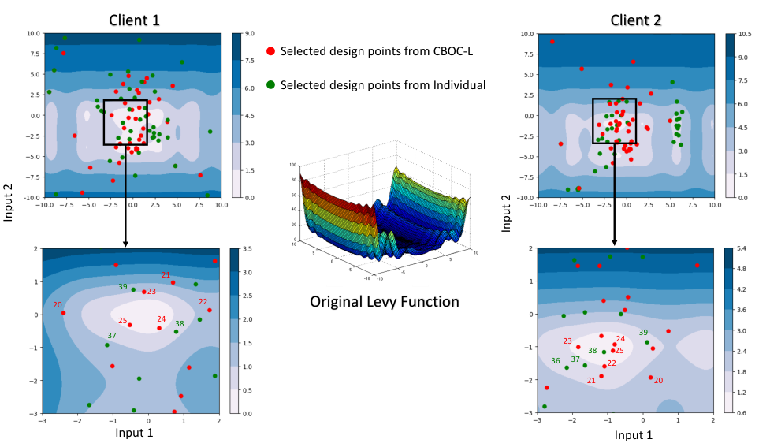
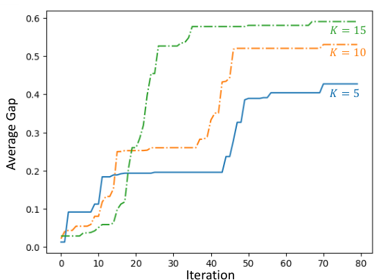

## Why I read it

This is the paper behind the Al Kontar group's line on collaborative Bayesian optimisation (BO), and it introduces a pattern I later found in two other papers of the group: borrow from others while data are scarce, then hand control back to your own data. I also have the situation it describes. My learned-prior project needs the same expensive tuning at several sample lengths, which is a set of related but not identical problems.

## The problem, in one paragraph

Several labs, simulators or robots optimise similar but not identical black-box functions, each on a small budget. They are willing to share where they plan to experiment, but not what they measured. Batch BO assumes one objective and one dataset. Federated BO keeps data local but still assumes a common objective and is tied to Thompson sampling. The question is how to pool effort without pooling data, while still letting each client end at its own optimum.

## The idea, as I understand it

Each client runs ordinary BO: its own Gaussian-process surrogate and its own expected-improvement maximiser. Then, instead of running its own proposal, it runs a weighted average of everyone's proposals, through a doubly stochastic mixing matrix that starts uniform and decays to the identity by the end of the budget.

With the uniform schedule this has a simple closed form, which the paper does not write down:
$$
x_k^{\text{run}}=\lambda_t\,x_k+(1-\lambda_t)\,\bar x,\qquad \lambda_t=t/T,
$$
where $x_k$ is client $k$'s own proposal and $\bar x$ the mean proposal. It is linear shrinkage towards the group mean, with the shrinkage falling from full to none over the budget. The leader-driven variant moves extra weight towards the client whose acquisition value is currently largest.

<mark>The point I took from this is that agreement is not the goal. The mixing matrix is driven to the identity on purpose, so collaboration is a transient: it helps early and disappears late.</mark> Under heterogeneity this is necessary, because once a client sits at its own optimum any weight on its peers pulls it away.

*Source: Yue et al., arXiv:2306.14348, Fig. 4, CC BY 4.0.*

The theory proves sublinear regret for identical clients with expected improvement and a squared-exponential kernel. Two things stood out when I worked through it. The bound holds for any mixing matrix, including the identity, so <mark>it certifies that consensus is safe, not that it helps</mark>. And the stated rate omits the term that actually dominates: one sum in the proof grows like $T/(\log T)^{0.5+\epsilon}$, which is still sublinear but larger than the headline $\sqrt{T(\log T)^{D+4}}$.

## What the results show

The metric is the fraction of the initial distance to the optimum that was closed, averaged over clients and 30 runs (1 means the optimum was found).

| test | consensus BO, leader | consensus BO, uniform | independent BO | federated BO |
|---|---|---|---|---|
| Levy, 2-D, 10 different clients | **0.990** | — | 0.942 | 0.958 |
| Levy, 8-D, 10 different clients | **0.949** | — | 0.917 | 0.903 |
| Shekel, 5 clients | **0.475** | 0.462 | 0.350 | 0.370 |
| Shekel, 20 clients | **0.592** | 0.572 | 0.335 | 0.535 |

How I read it:

- **Collaboration beats working alone, clearly.** Consensus BO is ahead of independent BO in every row, by a wide margin on Shekel.
- **The margin over federated BO is smaller.** Consensus BO leads every row, but sometimes within one reported standard deviation, and no test is run.
- **Leader versus uniform is consistent but small.** The leader variant is ahead by 0.002–0.024.
- **More clients help, partly because there is more data.** Each client has a fixed budget, so twenty clients also run four times as many experiments as five.

*Source: Yue et al., arXiv:2306.14348, Fig. 5, CC BY 4.0.*

The biosensor case study, three clients per arm over ten iterations on a finite-element simulator, points the same way. It is suggestive rather than conclusive.

## Where I am not convinced

- **The heterogeneity is mild.** Clients differ by a shared random offset that is small next to the search box, so the experiments say little about clients with genuinely different objectives.
- **An assumption does much of the work.** The proof assumes the clients' acquisition maximisers converge together at a fixed rate, which is close to assuming that collaboration cannot mislead.
- **Averaging lives in design space.** It needs a convex, continuous design set. Integer or categorical knobs need rounding, and on multimodal objectives an averaged design can land in a trough between two good proposals.
- **The schedule is a clock.** The weights depend on $t/T$, not on how similar the clients turn out to be, and an open-ended campaign has no natural schedule.
- **Some baselines are missing.** There is no pooled multi-task Gaussian process, which would be the natural upper reference when privacy is waived, and no comparison at equal total budget.

## What I take from it

- **Outside information should come with an exit.** This paper fades peer influence by a schedule; [LLINBO](/blog/llinbo/) fades an LLM's advice by a schedule or a test; the [language-induced priors](/blog/language-induced-priors/) paper fades a prior by tempering the evidence. Three papers from the same group make the same design choice, and I now think of it as a principle: borrowing should be strongest when data are scarce and should hand control back as evidence accumulates.
- **Earned trust beats a clock.** All three use a pre-set fade. Letting the fade depend on how useful the outside information has turned out to be, within the conditions the proofs need, is the open problem I find most interesting.
- **My own case needs care with averaging.** My [learned-prior project](/research/model-uncertainty-priors/) has an untested sweep over prior settings at several sample lengths, which is a natural set of related clients. But its knobs include an integer (coupling layers) and a log-scale parameter, so raw averaging of designs is the wrong operation there.

## What I would try next

*Ideas, not results.*

1. **Similarity-gated weights.** Replace the $t/T$ clock with weights from how closely the clients' posterior means agree on shared probe points, so dissimilar clients decouple early. The risk is that those similarity estimates are noisiest in the first iterations, exactly when the weights matter most.
2. **Sample instead of average.** A doubly stochastic matrix is a mixture of permutations. Drawing one permutation per iteration means each client runs another client's exact proposal instead of an average, which may avoid averaged designs falling into troughs on multimodal functions.

## References

- X. Yue, Y. Liu, A. S. Berahas, B. N. Johnson, R. Al Kontar. *Collaborative and Distributed Bayesian Optimization via Consensus: Showcasing the Power of Collaboration for Optimal Design.* IEEE Transactions on Automation Science and Engineering, 2025. doi:10.1109/TASE.2025.3529349. arXiv:2306.14348.
- A. Nedić, A. Ozdaglar. *Distributed subgradient methods for multi-agent optimization.* IEEE Transactions on Automatic Control 54(1), 2009.
- Z. Dai, B. K. H. Low, P. Jaillet. *Federated Bayesian optimization via Thompson sampling.* NeurIPS 2020.
- N. Srinivas, A. Krause, S. Kakade, M. Seeger. *Gaussian process optimization in the bandit setting: no regret and experimental design.* ICML 2010.
