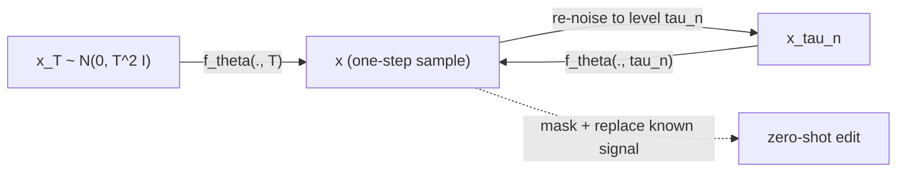

## Abstract

Diffusion models sample by integrating a differential equation, so one good image costs tens to thousands of network calls. Song et al. learn the *solution map* of that equation instead of its vector field: a network $f_\theta(x,t)$ that takes a noisy point at any level and returns the clean point at the start of the same probability-flow ODE trajectory. Since every point of a trajectory shares an origin, the training signal reduces to "two neighbouring points must agree", and a hard-wired boundary condition $f_\theta(x,\epsilon)=x$ rules out the constant solution. The adjacent pair comes either from one solver step of a pre-trained score model (consistency distillation, CD) or from re-using a single noise draw at two levels (consistency training, CT), which removes the teacher entirely. CD reaches FID 3.55 on CIFAR-10 and 6.20 on ImageNet 64×64 in one step, beating progressive distillation everywhere but one setting; CT reaches 8.70 on CIFAR-10 with no score model at all.

**Keywords:** probability flow ODE, self-consistency, solution map, distillation, one-step sampling, EMA target network, LPIPS, zero-shot editing

## 1 Introduction

The iterative sampler is both the strength and the weakness of diffusion models. It buys a compute–quality dial and it is what makes zero-shot inverse problems work, but the authors put the cost at 10–2000 times more compute per sample than a GAN, VAE or normalizing flow. Two lines of work attack it, and the paper is precise about where each one stops.

**Better solvers.** DDIM, DPM-Solver and DEIS integrate the probability-flow ODE more cleverly, but the paper's position is that they still need more than ten network evaluations for competitive samples: they are all still *integrating*, and no reparameterisation makes the trajectory's curvature vanish.

**Distillation.** Compressing the sampler into a student avoids integration at test time, but most methods (knowledge distillation, DFNO) must first run the slow teacher over many noise vectors to build a synthetic dataset, which is itself expensive. Progressive distillation (PD) is singled out as the only prior method that avoids this, and is therefore the baseline compared against everywhere.

The target is a model that is <mark>single-step by design yet keeps the compute–quality trade-off and the zero-shot editing</mark>, with no adversary and no pre-generated dataset. The move that gets there is small to state and large in consequence: stop learning the ODE's vector field and learn its solution map.

## 2 Background

The paper works entirely inside the EDM parameterisation — see [EDM](/blog/edm/) for the design-space argument and [Score-SDE](/blog/score-sde/) for the SDE/ODE correspondence. Data are perturbed by an SDE with zero drift and diffusion coefficient $\sqrt{2t}$, so $p_t = p_\text{data} * \mathcal N(0, t^2 I)$ and time *is* the noise standard deviation. The associated probability-flow (PF) ODE shares those marginals and, with a learned score $s_\phi(x,t)\approx\nabla\log p_t(x)$, collapses to

$$
\frac{dx_t}{dt} = -t\, s_\phi(x_t, t).
\tag{1}
$$

Sampling draws $\hat x_T\sim\mathcal N(0,T^2I)$ and solves Eq. (1) backwards, stopping at a small $\epsilon$ for numerical stability; pixels are rescaled to $[-1,1]$ with $T=80$, $\epsilon=0.002$. Every solver step is a network call — the whole bottleneck. [DDIM](/blog/ddim/) is the ancestor of this deterministic view.

## 3 Method

> **Key idea.** A PF ODE trajectory is determined by any single one of its points. So do not learn the velocity and integrate it — learn the map $f(x_t,t)=x_\epsilon$ from a point to its trajectory's origin, and supervise it by demanding that two adjacent points on one trajectory return the same answer.

### 3.1 The consistency function

For a trajectory $\{x_t\}_{t\in[\epsilon,T]}$ the consistency function is $f:(x_t,t)\mapsto x_\epsilon$, defined by *self-consistency*: $f(x_t,t)=f(x_{t'},t')$ for any two times on one trajectory. This is close to a neural flow with one relaxation — invertibility is not required, so the network may collapse different inputs onto the same output.

Self-consistency alone is satisfied by any constant function. What excludes that is the boundary condition $f(\cdot,\epsilon)=\mathrm{id}$, which the paper calls the most confining architectural constraint on the model and builds into the parameterisation:

$$
f_\theta(x,t) = c_\text{skip}(t)\,x + c_\text{out}(t)\,F_\theta(x,t),
\qquad c_\text{skip}(\epsilon)=1,\ c_\text{out}(\epsilon)=0,
\tag{2}
$$

with $F_\theta$ an unconstrained network. The skip term carries the identity at $t=\epsilon$ and the output term is switched off there, so the condition holds exactly rather than approximately. EDM's preconditioner has the same shape, which is why <mark>existing diffusion architectures can be reused essentially unchanged</mark>. The appendix gives the exact coefficients, which differ from EDM's by a shift that is easy to miss:

$$
c_\text{skip}(t)=\frac{\sigma_\text{data}^2}{(t-\epsilon)^2+\sigma_\text{data}^2},
\qquad
c_\text{out}(t)=\frac{\sigma_\text{data}\,(t-\epsilon)}{\sqrt{\sigma_\text{data}^2+t^2}},
\qquad \sigma_\text{data}=0.5 .
\tag{3}
$$

EDM uses $t$ where these use $t-\epsilon$; with $\epsilon\neq0$ the unshifted version fails the boundary condition. Differentiability at $\epsilon$ also matters for the continuous-time losses of Appendix B, which is why Eq. (2) is preferred over the simpler branch "$x$ if $t=\epsilon$, else $F_\theta$".

### 3.2 Consistency distillation, derived

Discretise $[\epsilon,T]$ into $N-1$ sub-intervals with boundaries $t_1=\epsilon<\dots<t_N=T$ using EDM's polynomial spacing $t_i=\big(\epsilon^{1/\rho}+\tfrac{i-1}{N-1}(T^{1/\rho}-\epsilon^{1/\rho})\big)^{\rho}$, $\rho=7$. Building a training pair then has two stages of very different status.

*Stage one is exact.* The forward SDE has zero drift and a Gaussian kernel, so $x_{t_{n+1}}\sim\mathcal N(x,t_{n+1}^2I)$ with $x\sim p_\text{data}$ is an exact draw from $p_{t_{n+1}}$ — no simulation is needed to land on the trajectory bundle.

*Stage two is an approximation.* One solver step walks that point down a level,

$$
\hat x^{\phi}_{t_n} = x_{t_{n+1}} + (t_n - t_{n+1})\,\Phi(x_{t_{n+1}},t_{n+1};\phi),
\qquad \Phi(x,t;\phi) = -t\,s_\phi(x,t)\ \text{for Euler},
\tag{4}
$$

so the pair lies on one trajectory only up to the solver's local error and the score model's own error. The loss asks the two outputs to agree:

$$
\mathcal L^{N}_\text{CD}(\theta,\theta^-;\phi)
= \mathbb E\Big[\lambda(t_n)\, d\big(f_\theta(x_{t_{n+1}},t_{n+1}),\ f_{\theta^-}(\hat x^{\phi}_{t_n},t_n)\big)\Big],
\tag{5}
$$

with $n\sim\mathcal U[\![1,N-1]\!]$, $d$ any metric with $d(x,y)=0\Leftrightarrow x=y$ ($\ell_1$, squared $\ell_2$, or LPIPS), $\lambda\equiv 1$ in all experiments, and $\theta^-$ an exponential moving average of $\theta$ held behind a stop-gradient:

$$
\theta^- \leftarrow \operatorname{stopgrad}\big(\mu\,\theta^- + (1-\mu)\,\theta\big).
\tag{6}
$$

The authors name $f_{\theta^-}$ the target network and $f_\theta$ the online network, after deep Q-learning and BYOL, and report that this is much more stable than setting $\theta^-=\theta$. One detail in Table 3 sharpens the claim: on CIFAR-10, CD uses $\mu=0$, so <mark>the target is a plain stop-gradient copy with no averaging at all — on that dataset the stabiliser is the stop-gradient, not the moving average</mark>. The averaging only turns on ($\mu=0.95$) at ImageNet and LSUN scale.

### 3.3 Why zero loss implies the right function

Theorem 1 is a numerical-analysis argument, and its structure explains why the boundary condition is load-bearing. Let $e_n = f_\theta(x_{t_n},t_n)-f(x_{t_n},t_n;\phi)$ be the error against the teacher ODE's true consistency function. Zero loss forces $f_\theta(x_{t_{n+1}},t_{n+1})=f_\theta(\hat x^{\phi}_{t_n},t_n)$ pointwise, and since $f(\cdot;\phi)$ is constant along a trajectory, the errors satisfy $e_{n+1}=f_\theta(\hat x^{\phi}_{t_n},t_n)-f_\theta(x_{t_n},t_n)+e_n$. With $f_\theta$ Lipschitz in $x$ with constant $L$ and a solver of local error $O((t_{n+1}-t_n)^{p+1})$,

$$
\|e_{n+1}\|_2 \le \|e_n\|_2 + L\,\big\|\hat x^{\phi}_{t_n}-x_{t_n}\big\|_2
= \|e_n\|_2 + O\big((t_{n+1}-t_n)^{p+1}\big).
\tag{7}
$$

The induction's base case is free: $e_1 = x_{t_1}-x_{t_1}=0$, precisely because the parameterisation forces $f_\theta(\cdot,\epsilon)=\mathrm{id}$. Telescoping with $\sum_k(t_{k+1}-t_k)\le T-\epsilon$ gives $\sup_{n,x}\|f_\theta(x,t_n)-f(x,t_n;\phi)\|_2=O((\Delta t)^p)$, so <mark>the model converges to the teacher's consistency function at the solver's global order, and a second-order solver should beat Euler at fixed $N$</mark> — a prediction the ablations confirm. What the theorem does *not* say: it bounds the gap to the *empirical* PF ODE of $s_\phi$, not to the data. The teacher's own error passes through untouched.

### 3.4 Consistency training: deleting the teacher

The score appears in Eq. (4) only through one Euler step. Lemma 1 gives an unbiased one-sample replacement for it,

$$
\nabla\log p_t(x_t) = -\,\mathbb E\!\left[\frac{x_t - x}{t^2}\,\Big|\,x_t\right],
\tag{8}
$$

which follows from Bayes' rule applied to $p_t(x_t)=\int p_\text{data}(x)\,\mathcal N(x_t;x,t^2I)\,dx$. Substituting the single-sample estimate $-(x_{t_{n+1}}-x)/t_{n+1}^2$ into the Euler step and writing $z=(x_{t_{n+1}}-x)/t_{n+1}\sim\mathcal N(0,I)$ makes the arithmetic collapse:

$$
\hat x^{\phi}_{t_n} \;\rightarrow\; x_{t_{n+1}} + (t_n-t_{n+1})\,z \;=\; x + t_n z .
\tag{9}
$$

The "previous point on the trajectory" becomes the *same data point with the same noise vector at a lower level*. No $\phi$ survives, and the objective is

$$
\mathcal L^{N}_\text{CT}(\theta,\theta^-)
= \mathbb E\Big[\lambda(t_n)\, d\big(f_\theta(x+t_{n+1}z,\,t_{n+1}),\ f_{\theta^-}(x+t_n z,\,t_n)\big)\Big],
\quad z\sim\mathcal N(0,I).
\tag{10}
$$

Theorem 2 makes this legitimate: under an Euler solver and a *perfect* score, a Taylor expansion of Eq. (5) in $\Delta t$ plus the law of total expectation gives $\mathcal L^N_\text{CD}=\mathcal L^N_\text{CT}+o(\Delta t)$, while $\mathcal L^N_\text{CT}\ge O(\Delta t)$ whenever $\inf_N \mathcal L^N_\text{CD}>0$, so the leading term dominates the remainder and <mark>CT is a standalone generative objective that never mentions a score model</mark>. The ledger: noising is exact; the score substitution is unbiased but single-sample, hence high-variance; the Euler step and the Taylor expansion are $O(\Delta t)$ approximations; and the assumption $s_\phi\equiv\nabla\log p_t$ behind the equivalence is, in any real run, false.

That leaves a bias–variance dial in $N$. Small $N$ gives a coarse, low-variance signal — fast early convergence, wrong fixed point; large $N$ gives the right target buried in noise. The remedy is to grow both $N$ and the target decay $\mu$ on a schedule.

### 3.5 Intuition: the Gaussian case, where one step is exact

Take $p_\text{data}=\mathcal N(0,\sigma^2)$ in one dimension. Then $p_t=\mathcal N(0,\sigma^2+t^2)$ and $\nabla\log p_t(x)=-x/(\sigma^2+t^2)$, so the PF ODE is $\dot x_t = t\,x_t/(\sigma^2+t^2)$, i.e. $\tfrac{d}{dt}\log x_t = \tfrac12\tfrac{d}{dt}\log(\sigma^2+t^2)$. Integrating gives $x_t = x_\epsilon\sqrt{\sigma^2+t^2}/\sqrt{\sigma^2+\epsilon^2}$, and therefore

$$
f(x,t) = \frac{\sqrt{\sigma^2+\epsilon^2}}{\sqrt{\sigma^2+t^2}}\;x .
\tag{11}
$$

Three things fall out. The consistency function is *linear in $x$*, so the skip branch of Eq. (2) realises it exactly with $c_\text{out}\equiv0$ — the network has nothing to do. The boundary condition is automatic. And one-step sampling is exact: $\hat x_T\sim\mathcal N(0,T^2)$ gives $f(\hat x_T,T)\sim\mathcal N\!\big(0,T^2(\sigma^2+\epsilon^2)/(\sigma^2+T^2)\big)\approx\mathcal N(0,\sigma^2)$ for $T\gg\sigma$.

So the entire difficulty sits in the departure of $p_\text{data}$ from a Gaussian: the trajectory bundle stops being a scaling family, $f$ stops being linear, and the structure the single evaluation must encode is exactly what the multi-step sampler used to build up gradually — which is also why the residual gap to the teacher looks structural rather than like a tuning problem.

### 3.6 Algorithm

```text
# Consistency distillation (CD)
init  theta from the pre-trained EDM weights;  theta_minus <- theta
repeat
    x  ~ dataset;  n ~ Uniform{1, ..., N-1}
    x_hi  <- x + t[n+1] * randn_like(x)                  # exact sample from p_{t_{n+1}}
    x_lo  <- x_hi + (t[n] - t[n+1]) * Phi(x_hi, t[n+1]; phi)   # one Heun step, teacher
    L     <- d( f(x_hi, t[n+1]; theta),  f(x_lo, t[n]; theta_minus) )
    theta <- theta - lr * grad(L, theta)
    theta_minus <- stopgrad( mu * theta_minus + (1 - mu) * theta )

# Consistency training (CT) -- no teacher, no solver
init  theta randomly;  theta_minus <- theta;  k <- 0
repeat
    x ~ dataset;  z ~ N(0, I);  n ~ Uniform{1, ..., N(k)-1}
    L <- d( f(x + t[n+1]*z, t[n+1]; theta),  f(x + t[n]*z, t[n]; theta_minus) )
    theta <- theta - lr * grad(L, theta)
    theta_minus <- stopgrad( mu(k) * theta_minus + (1 - mu(k)) * theta )
    k <- k + 1

# Sampling: one step, or M steps
x <- f(x_T, T; theta)                       # x_T ~ N(0, T^2 I)
for tau in [tau_1 > tau_2 > ... > tau_{M-1}]:
    x <- f( x + sqrt(tau^2 - eps^2) * randn_like(x),  tau;  theta )
```

The time points $\tau_n$ are not derived but chosen one at a time by ternary search directly on FID, assuming FID is unimodal in the next point. Replacing the known part of the signal inside the same loop — with a binary mask $\Omega$ and an invertible linear transform $A$ — gives zero-shot inpainting, colorization, super-resolution and stroke editing with no task-specific training.



## 4 Implementation notes

Architectures are borrowed wholesale: NCSN++ (from [Score-SDE](/blog/score-sde/)) for CIFAR-10, the ADM networks of [Diffusion Beats GANs](/blog/diffusion-beats-gans/) for ImageNet 64×64 and both LSUN sets. Teachers are EDMs trained in-house; for LSUN, where EDM published no hyperparameters, the authors reused the ImageNet settings with batch size cut from 4096 to 2048 and trained 600k (Bedroom) / 300k (Cat) iterations.

| Hyperparameter | CIFAR-10 CD | CIFAR-10 CT | ImageNet 64 CD | ImageNet 64 CT | LSUN 256 CD | LSUN 256 CT |
|---|---|---|---|---|---|---|
| Learning rate | 4e-4 | 4e-4 | 8e-6 | 8e-6 | 1e-5 | 1e-5 |
| Batch size | 512 | 512 | 2048 | 2048 | 2048 | 2048 |
| Target decay $\mu$ | **0** | schedule | 0.95 | schedule | 0.95 | schedule |
| $\mu_0$ (CT) | – | 0.9 | – | 0.95 | – | 0.95 |
| $s_0\to s_1$ (CT) | – | 2 → 150 | – | 2 → 200 | – | 2 → 150 |
| Discretisation $N$ (CD) | 18 | – | 40 | – | 40 | – |
| ODE solver (CD) | Heun | – | Heun | – | Heun | – |
| Weight EMA | 0.9999 | 0.9999 | 0.999943 | 0.999943 | 0.999943 | 0.999943 |
| Training iterations | 800k | 800k | 600k | 800k | 600k | 1000k |
| FP16 | No | No | Yes | Yes | Yes | Yes |
| Dropout | 0.0 | 0.0 | 0.0 | 0.0 | 0.0 | 0.0 |
| GPUs (A100) | 8 | 8 | 64 | 64 | 64 | 64 |

The CT schedules are explicit:

$$
N(k)=\left\lceil\sqrt{\tfrac{k}{K}\big((s_1+1)^2-s_0^2\big)+s_0^2}\;-1\right\rceil+1,
\qquad
\mu(k)=\exp\!\left(\frac{s_0\log\mu_0}{N(k)}\right),
\tag{12}
$$

so $N$ grows from $s_0$ to $s_1$ over the $K$ iterations and $\mu$ rises with it — the target is held loose while the signal is coarse and tightened as the grid refines.

Easy to get wrong when reproducing: the $(t-\epsilon)$ shift in Eq. (3); Rectified Adam with no warm-up, no decay, no weight decay; LPIPS inputs bilinearly upsampled to 224×224 for CIFAR-10 and ImageNet but fed at native resolution for LSUN; horizontal flips as the only augmentation; and the fact that the "weight EMA" row is the evaluation-time average, a different object from the target decay $\mu$ — the text says CD on LSUN Bedroom worked better with *zero* evaluation EMA, which sits awkwardly beside the table's 0.999943 and is the one internally unclear point in the appendix. Not stated: wall-clock training cost, and whether $N$ for CD differs between Bedroom and Cat (one column covers both).

## 5 Experiments

Datasets: CIFAR-10, ImageNet 64×64, LSUN Bedroom and Cat 256×256. Metrics: FID, IS, precision, recall. CD students start from the EDM teacher's weights; discrete-time CT models start randomly (continuous-time CT had to be initialised from EDM to be stable at all, which the authors attribute to the variance of the continuous objective).

**CIFAR-10 (Table 1, selected rows).**

| Method | NFE ↓ | FID ↓ | IS ↑ |
|---|---|---|---|
| EDM (teacher) | 35 | 2.04 | 9.84 |
| DDIM | 10 | 8.23 | – |
| Knowledge Distillation\* | 1 | 9.36 | – |
| DFNO\* | 1 | 4.12 | – |
| 2-Rectified Flow (+distill)\* | 1 | 4.85 | 9.01 |
| PD | 1 | 8.34 | 8.69 |
| **CD** | **1** | **3.55** | **9.48** |
| PD | 2 | 5.58 | 9.05 |
| **CD** | **2** | **2.93** | **9.75** |
| StyleGAN2-ADA | 1 | 2.92 | 9.83 |
| StyleGAN-XL | 1 | 1.85 | – |
| DC-VAE | 1 | 17.9 | 8.20 |
| Glow | 1 | 48.9 | 3.92 |
| DenseFlow | 1 | 34.9 | – |
| CT | 1 | 8.70 | 8.49 |
| CT | 2 | 5.83 | 8.85 |

\*requires building a synthetic dataset from the teacher first.

**ImageNet 64×64 and LSUN 256×256 (Table 2, selected rows).**

| Dataset | Method | NFE ↓ | FID ↓ | Prec. ↑ | Rec. ↑ |
|---|---|---|---|---|---|
| ImageNet 64 | PD | 1 | 15.39 | 0.59 | 0.62 |
| ImageNet 64 | **CD** | **1** | **6.20** | 0.68 | 0.63 |
| ImageNet 64 | PD | 2 | 8.95 | 0.63 | 0.65 |
| ImageNet 64 | **CD** | **2** | **4.70** | 0.69 | 0.64 |
| ImageNet 64 | EDM | 79 | 2.44 | 0.71 | 0.67 |
| ImageNet 64 | CT | 1 | 13.0 | 0.71 | 0.47 |
| Bedroom 256 | PD | 1 | 16.92 | 0.47 | 0.27 |
| Bedroom 256 | **CD** | **1** | **7.80** | 0.66 | 0.34 |
| Bedroom 256 | EDM | 79 | 3.57 | 0.66 | 0.45 |
| Bedroom 256 | CT | 1 | 16.0 | 0.60 | **0.17** |
| Cat 256 | PD | 1 | 29.6 | 0.51 | 0.25 |
| Cat 256 | **CD** | **1** | **11.0** | 0.65 | 0.36 |
| Cat 256 | EDM | 79 | 6.69 | 0.70 | 0.43 |
| Cat 256 | CT | 1 | 20.7 | 0.56 | 0.23 |

**Ablations (Fig. 3, CIFAR-10).** The paper plots these as FID-vs-iteration curves and prints no numbers, so the table below records directions only.

| Factor | Compared | Finding |
|---|---|---|
| Metric $d$ in CD | LPIPS vs $\ell_1$ vs $\ell_2$ | LPIPS wins by a large margin at every iteration count |
| Solver in CD | Heun vs Euler | Heun uniformly better at equal $N$ |
| $N$ in CD | 9, 12, 18, 36, 50, 60, 80, 120 | $N=18$ best; insensitive once $N$ is large enough |
| $N,\mu$ in CT | fixed vs adaptive schedule | adaptive schedule converges much faster and ends better |

**Claim by claim.**

1. *CD beats PD.* Strongly supported, on the cleanest possible footing: both distil the same in-house EDM teachers, and PD was even given the LPIPS metric, which improved it over its published $\ell_2$ setting. Fig. 4 covers four datasets and a sweep of step counts, with one exception — one-step Bedroom with $\ell_2$. The paper's best-evidenced claim.
2. *CD beats distillation methods that need synthetic data.* Supported on CIFAR-10 (3.55 against 9.36 and 4.12) but only there; DFNO appears once more for ImageNet (8.35) and nowhere else, and no dataset-construction cost is reported for any method.
3. *Higher-order solvers give lower estimation error.* Theorem 1 predicts it and Fig. 3b shows it, though $p$ is never measured — only the ordering is checked.
4. *CT beats one-step non-adversarial models.* Supported on CIFAR-10: 8.70 against 17.9 (DC-VAE) and 34.9–48.9 for the normalizing flows. It does not beat GANs, and the paper says so.
5. *CT roughly matches one-step PD without a teacher.* Supported on CIFAR-10 (8.70 vs 8.34) and Bedroom (16.0 vs 16.92); on ImageNet (13.0 vs 15.39) and Cat (20.7 vs 29.6) CT is actually ahead. "Comparable" is the honest summary, and is what the text says.
6. *CT does not mode-collapse.* The weakest link. The evidence is Fig. 5: CT and EDM samples from the same initial noise are structurally similar despite independent training. That is a statement about the *map*, not about coverage, and the recall column argues the other way — <mark>CT's one-step recall on LSUN Bedroom is 0.17 against 0.45 for the EDM teacher</mark>.
7. *Zero-shot editing survives.* Demonstrated qualitatively, with no quantitative metric anywhere; the editing grid is fixed at $N=40$ for Bedroom and stroke editing uses hand-picked $t_1=5.38$, $t_2=2.24$ with $N=2$.

## 6 Limitations

**Stated by the authors.**
- Only one-step ODE solvers are analysed; multistep solvers are left open.
- The continuous-time objectives need forward-mode autodiff for Jacobian-vector products, and the pseudo-objectives of Theorems 5–6 can be differentiated but not monitored.
- Continuous-time CT has high variance and needed EDM initialisation to train at all; variance reduction is future work.
- The greedy ternary search for the multistep time points assumes FID is unimodal in the next point, checked only empirically.
- Discrete-time CT carries a bias because $\Delta t>0$.

**My reading.**
- <mark>The gap to the teacher is large and does not close in the reported range</mark>: 3.55 vs 2.04 on CIFAR-10, 6.20 vs 2.44 on ImageNet, 7.80 vs 3.57 on Bedroom. The compression is lossy in a way the paper measures but does not explain.
- The best results depend on LPIPS, a learned image-specific metric whose backbone is trained with ImageNet supervision. That complicates FID comparisons — metric and evaluation share a feature lineage — and leaves no recipe at all for non-image data.
- Precision is high and recall is low across the board for the one-step models. The paper reports both and discusses neither.
- Everything is unconditional image generation: no text conditioning, no guidance, no non-image modality, and no training-cost comparison against PD despite PD being the headline baseline.
- Schedules for $N$ and $\mu$ are tuned per resolution and the multistep time points are optimised directly against the evaluation metric — legitimate, but a reproduction must repeat the search.

## 7 Extensions

**What was built on this.** Within this collection, [MeanFlow](/blog/mean-flows/) is the closest descendant in spirit: it also swaps "integrate the field" for "learn an integrated quantity", but parameterises the *average* velocity over an interval rather than the map to a fixed origin, which removes the target network. [Rectified Flow](/blog/rectified-flow/) attacks the same goal from the other side — straighten the trajectory until the solution map is trivial. Outside the collection and not cited in this PDF: latent consistency models applied the recipe to [latent diffusion](/blog/latent-diffusion/) with guidance folded in; consistency trajectory models generalised $f$ to map between two arbitrary times; and a follow-up by the same first author removed the EMA target and replaced LPIPS with a pseudo-Huber loss — *(from general knowledge, unverified)*.

**Open problems.**
- Why the teacher gap persists. Theorem 1 gives $O((\Delta t)^p)$ for *zero* loss, but the loss is never zero, and nothing relates a given non-zero loss to sample quality or separates optimisation error from the expressiveness of one evaluation.
- A metric $d$ for non-image data. LPIPS carries most of the empirical advantage, and nothing in the theory says why a perceptual metric should beat $\ell_2$ when both satisfy the theorem's requirements.
- Coverage: the recall numbers deserve direct investigation rather than the indirect Fig. 5 argument.
- Conditional generation and guidance, absent here and non-trivial because guidance modifies the very ODE $f$ is supposed to solve.

**Research directions.** *These are ideas, not results — none has been run.*

1. **A path metric in place of LPIPS for return paths.** *Hypothesis:* replacing $d=\ell_2$ with a truncated signature distance plays the role LPIPS plays for images — a metric aligned with the statistics that matter — and closes part of the CD/teacher gap. *Data:* windowed daily returns for a liquid equity universe; a [TimeGrad](/blog/timegrad/)- or [Diffusion-TS](/blog/diffusion-ts/)-style EDM teacher. *Baseline:* the same CD run with squared $\ell_2$. *Metric:* stylised-fact scores (autocorrelation of absolute returns, tail index, cross-sectional correlation) plus a discriminative score, as in [SigCWGAN](/blog/conditional-sig-wgan/). *Likely failure mode:* the signature distance's scale varies with path volatility, so $\lambda\equiv1$ silently reweights noise levels and may destabilise training.
2. **Tail-aware evaluation of one-step samplers.** *Hypothesis:* the low recall seen on LSUN transfers to scenario generation as systematic under-coverage of the tails — the one-step CT model keeps the bulk of the return distribution and shrinks the extremes. *Data:* simulated paths from a calibrated rough-volatility model (see [Rough volatility](/blog/volatility-is-rough/)), where the true tails are known by construction. *Baseline:* the teacher's multistep sampler, and [Tail-GAN](/blog/tail-gan/). *Metric:* VaR and expected-shortfall error at 1% and 0.1%, plus a recall estimate in a fixed feature space. *Likely failure mode:* if the teacher misses the tails the experiment measures the teacher, not the distillation — so simulated ground truth is essential, not decorative.
3. **One-step imputation via the zero-shot replacement loop.** *Hypothesis:* Algorithm 4's masked replacement makes a consistency model a one-step imputer competitive with [CSDI](/blog/csdi/) at a fraction of the sampling cost. *Data:* a multivariate time-series imputation benchmark with artificial missingness. *Baseline:* CSDI with its usual sampler, at matched NFE. *Metric:* CRPS and MAE, plus wall-clock per series. *Likely failure mode:* the loop assumes the known signal can be re-noised consistently with the model's own trajectory, an assumption that is weaker for per-channel masks on irregular series than for image masks.

## 8 Takeaways

- Learning the ODE's **solution map** rather than its vector field turns sampling into one forward pass. Self-consistency supplies the supervision and the hard-wired boundary condition supplies the anchor; without it both the objective and Theorem 1's induction collapse.
- CD is the practical recipe — EDM teacher, one Heun step, LPIPS, stop-gradient target — and it dominates progressive distillation at matched teacher and matched metric, the cleanest comparison in the paper.
- CT is the conceptually new part: one unbiased score estimate makes the teacher cancel algebraically, at the price of a bias–variance trade-off in $N$ that must be scheduled.
- The 1-D Gaussian case shows one-step generation is *exactly* achievable when $f$ is linear; everything hard about the method is the non-Gaussian remainder, which is also the likeliest explanation for the persistent teacher gap.
- In this series, this is the step from "solve the PF ODE faster" ([DDIM](/blog/ddim/), [EDM](/blog/edm/)) to "skip the solver", alongside [Rectified Flow](/blog/rectified-flow/)'s straightening and ahead of [MeanFlow](/blog/mean-flows/).
- For financial time series, one-step sampling is attractive whenever many scenario paths are needed. Two caveats are load-bearing: there is no LPIPS analogue for return paths, so $d$ must be designed rather than borrowed; and CT's low recall is a warning exactly where tail coverage is the point. The paper offers evidence on neither.

## References

1. Song, Y., Dhariwal, P., Chen, M., Sutskever, I. *Consistency Models.* ICML 2023. arXiv:2303.01469.
2. Karras, T., Aittala, M., Aila, T., Laine, S. *Elucidating the Design Space of Diffusion-Based Generative Models.* NeurIPS 2022. arXiv:2206.00364.
3. Song, Y. et al. *Score-Based Generative Modeling through Stochastic Differential Equations.* ICLR 2021. arXiv:2011.13456.
4. Salimans, T., Ho, J. *Progressive Distillation for Fast Sampling of Diffusion Models.* ICLR 2022. arXiv:2202.00512.
5. Zhang, R., Isola, P., Efros, A. A., Shechtman, E., Wang, O. *The Unreasonable Effectiveness of Deep Features as a Perceptual Metric (LPIPS).* CVPR 2018.
6. Liu, X., Gong, C., Liu, Q. *Flow Straight and Fast: Learning to Generate and Transfer Data with Rectified Flow.* arXiv:2209.03003.
