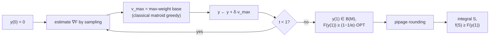

## Abstract

Greedy on a cardinality constraint gives $1-1/e$ and that is optimal. Greedy on a general matroid constraint gives only $1/2$, and whether $1-1/e$ was achievable there stayed open for thirty years. This paper closes it. The construction has three parts. **Multilinear extension**: define $F(y)=\mathbb{E}[f(\hat y)]$ where $\hat y$ independently rounds each coordinate, a smooth function on $[0,1]^X$ with $\partial F/\partial y_j\ge0$ (monotonicity) and $\partial^2F/\partial y_i\partial y_j\le0$ for $i\ne j$ (submodularity), concave along non-negative directions and neither convex nor concave overall. **Continuous greedy**: run $dy/dt=v_{\max}(y)$ with $v_{\max}(y)=\arg\max_{v\in P}v\cdot\nabla F(y)$ from $y(0)=0$ for $t\in[0,1]$; each step is a maximum-weight base computation, i.e. the *classical* matroid greedy, and the trajectory stays in $P$ because it is a convex combination of points of $P$. **Pipage rounding**: convert $y(1)$ into an integral independent set without losing value. The analysis is two lines: $dF/dt\ge\mathrm{OPT}-F$, so $F$ dominates the solution of $\phi'=\mathrm{OPT}-\phi$, $\phi(0)=0$, namely $(1-e^{-t})\mathrm{OPT}$. At $t=1$ that is $1-1/e$. The same result gives an optimal approximation for the Submodular Welfare Problem and $1-1/e-o(1)$ for the Generalized Assignment Problem.

**Keywords:** multilinear extension, continuous greedy, matroid polytope, pipage rounding, value oracle model, submodular welfare

## 1 Introduction

The problem is $\max_{S\in\mathcal{I}}f(S)$ for monotone submodular $f:2^X\to\mathbb{R}_+$ with $f(\emptyset)=0$ and $(X,\mathcal{I})$ a matroid. The state of knowledge the paper inherits:

- Greedy gives $1/2$ for a general matroid (Fisher, Nemhauser and Wolsey, Part II of [the 1978 paper](/blog/nemhauser-wolsey-fisher/)).
- For the uniform matroid $\max_{\lvert S\rvert\le k}f(S)$, greedy gives $1-1/e$.
- That constant is *optimal both in the value oracle model* (Nemhauser and Wolsey) *and also for explicitly posed instances assuming $P\ne NP$* (Feige).

So the target was known, the algorithm achieving it on a special case was known, and the general case was a gap of $1/2$ versus $1-1/e$ that resisted combinatorial attack for three decades.

**Theorem 1.1.** *There is a randomized algorithm which gives a $(1-1/e)$-approximation (in expectation) to the problem $\max\{f(S):S\in\mathcal{I}\}$*, working in the value oracle model.

The problem classes it covers are worth listing, because they are the reason anybody outside theory should care:

- **Coverage.** $f(S)=\lvert\bigcup_{i\in S}A_i\rvert$ and its weighted and multi-cover variants.
- **Weighted matroid rank functions and their sums.** $r_{M,w}(A)=\max\{w(S):S\subseteq A,S\in\mathcal{I}\}$ is submodular, and *submodularity is preserved by taking a sum*. The paper is careful: *the functions of coverage type mentioned above are captured by this class. However, the class does not include all monotone submodular functions.*
- **Partition matroids.** $X$ split into $X_1,\dots,X_\ell$ with quotas $k_i$, and $A$ independent iff $\lvert A\cap X_i\rvert\le k_i$. Described as *a simple matroid constraint that is of much importance in applications*, and it is the one that shows up whenever you want "at most $k_i$ items from category $i$" — at most two momentum factors, at most three value factors, at most one sensor per district. The uniform matroid is the case $\ell=1$.

The gap this paper closes is therefore the gap between "choose $k$ things" and "choose things subject to structure", which is the difference between a toy constraint and a real one.

## 2 Background: the multilinear extension

For $y\in[0,1]^X$, let $\hat y\in\{0,1\}^X$ round each coordinate independently to 1 with probability $y_j$, and set

$$
F(y)=\mathbb{E}[f(\hat y)]=\sum_{R\subseteq X}f(R)\prod_{i\in R}y_i\prod_{j\notin R}(1-y_j). \tag{1}
$$

This is the unique multilinear polynomial agreeing with $f$ on the cube's vertices, and its derivatives read off the two structural properties directly:

$$
\frac{\partial F}{\partial y_j}=\mathbb{E}[f(\hat y)\mid\hat y_j=1]-\mathbb{E}[f(\hat y)\mid\hat y_j=0]\ \ge\ 0
\quad\text{(monotonicity)}, \tag{2}
$$

$$
\frac{\partial^2F}{\partial y_i\partial y_j}=\mathbb{E}[f\mid\hat y_i{=}1,\hat y_j{=}1]-\mathbb{E}[f\mid\hat y_i{=}1,\hat y_j{=}0]-\mathbb{E}[f\mid\hat y_i{=}0,\hat y_j{=}1]+\mathbb{E}[f\mid\hat y_i{=}0,\hat y_j{=}0]\ \le\ 0 \tag{3}
$$

for $i\ne j$ (submodularity), and $\partial^2F/\partial y_j^2=0$ because $F$ is multilinear.

These three facts are the whole toolkit. (2) says $F$ increases in every coordinate. (3) says the mixed second derivatives are non-positive, which is exactly diminishing returns in continuous clothing. The vanishing pure second derivative says $F$ is *linear* along any coordinate axis, so all the curvature lives in the off-diagonal terms.

**$F$ is not concave.** Take $f(S)=\min\{\lvert S\rvert,1\}$; then $F(y)=1-\prod_i(1-y_i)$, which is not concave. The paper's characterisation is the useful one: *typically, it is concave in certain directions while convex in others. This will be actually useful both for treating the continuous problem and rounding its fractional solution.* Precisely, (3) makes $F$ concave along any *non-negative* direction — that is the property the analysis uses — while it can be convex along directions with mixed signs, which is what pipage rounding exploits.

**$F$ cannot be evaluated exactly** in the value-oracle model: (1) is a sum over $2^{\lvert X\rvert}$ terms. It can be estimated by sampling, with Chernoff bounds controlling the error, and §3 does the accounting.

## 3 Method

> **Key idea.** Do not commit to elements. Move fractionally inside the matroid polytope, always in the direction that maximises the local gain, for exactly one unit of time. Because the gain available is always at least the remaining deficit, the value follows the differential equation $\phi'=\mathrm{OPT}-\phi$ — and $1-1/e$ is just $\phi(1)$.

### 3.1 The continuous greedy process

Let $P$ be any down-monotone polytope (think: the matroid polytope $P(\mathcal{M})$) and $F$ smooth monotone submodular. Start a particle at $y(0)=0$ and flow:

$$
\frac{dy}{dt}=v_{\max}(y),
\qquad
v_{\max}(y)=\arg\max_{v\in P}\ v\cdot\nabla F(y),
\qquad t\in[0,1]. \tag{4}
$$

**Feasibility.** $y(t)=\int_0^tv_{\max}(y(\tau))\,d\tau$ is a convex combination of vectors in $P$ scaled by $t\le1$, hence lies in $P$. No projection, no constraint handling — the flow cannot leave.

**The claim: $F(y(1))\ge(1-1/e)\mathrm{OPT}$**, and the proof is four steps.

1. Fix the optimum $x^\ast\in P$ and set $v^\ast=(x^\ast\vee y)-y$, the coordinatewise positive part of $x^\ast-y$. It is non-negative; $v^\ast\le x^\ast\in P$ and $P$ is down-monotone, so $v^\ast\in P$.
2. By monotonicity, $F(y+v^\ast)=F(x^\ast\vee y)\ge F(x^\ast)=\mathrm{OPT}$.
3. Since $F$ is smooth submodular and $v^\ast\ge0$, the function $\xi\mapsto F(y+\xi v^\ast)$ is **concave**, so $F(y+v^\ast)-F(y)\le\frac{dF}{d\xi}\big\vert_{\xi=0}=v^\ast\cdot\nabla F(y)$. Concavity along non-negative directions is where (3) is spent.
4. $v_{\max}(y)$ maximises $v\cdot\nabla F(y)$ over $P$, and $v^\ast\in P$, so

$$
v_{\max}(y)\cdot\nabla F(y)\ \ge\ v^\ast\cdot\nabla F(y)\ \ge\ F(y+v^\ast)-F(y)\ \ge\ \mathrm{OPT}-F(y). \tag{5}
$$

Then the chain rule gives

$$
\frac{dF}{dt}=\sum_j\frac{\partial F}{\partial y_j}\frac{dy_j}{dt}=v_{\max}(y(t))\cdot\nabla F(y(t))\ \ge\ \mathrm{OPT}-F(y(t)), \tag{6}
$$

so $F(y(t))$ dominates the solution of $\phi'=\mathrm{OPT}-\phi$ with $\phi(0)=0$, which is $\phi(t)=(1-e^{-t})\mathrm{OPT}$. At $t=1$,

$$
\boxed{\ F(y(1))\ \ge\ \bigl(1-\tfrac1e\bigr)\mathrm{OPT}.\ } \tag{7}
$$

The sentence to keep: *the essence of our analysis is that the rate of increase in $F(y)$ is at least as much as the deficit $\mathrm{OPT}-F(y)$. **This kind of behavior always leads to a factor of $1-1/e$.*** That is the most satisfying explanation of the constant anywhere in this literature. In [NWF 1978](/blog/nemhauser-wolsey-fisher/) it emerges from a linear program; here it is the solution of a first-order ODE, and $(1-1/K)^K$ is visibly the Euler discretisation of $e^{-1}$ at step size $1/K$. Same constant, same mechanism, one continuous and one discrete.

### 3.2 Each step is the ordinary greedy algorithm

Finding $v_{\max}$ means maximising a *linear* function over $P(\mathcal{M})$. *We can assume that $v_{\max}(y)$ is a vertex of $P(\mathcal{M})$ and furthermore, since $\nabla F$ is a nonnegative vector, that this vertex corresponds to a base of $\mathcal{M}$. Hence, without loss of generality $v_{\max}(y)$ is the indicator vector of a base and it can be found by the greedy algorithm for maximum-weight base in a matroid.* So the inner loop is the classical matroid greedy, which is exact — the one place where matroid structure makes an optimisation easy rather than hard.

### 3.3 Why this beats discrete greedy, exactly

The remark that makes the contribution legible:

> Wolsey's continuous greedy algorithm can be viewed as a greedy process guided by $v_{\max}(y)=e_j$, where $\partial F/\partial y_j$ is the maximum partial derivative out of those where $y_j$ can still be increased. In other words, only one coordinate is being increased at a time. In our setting, with $F(y)=\mathbb{E}[f(\hat y)]$ and starting at $y(0)=0$, it can be seen that $y_j$ will increase up to its maximal possible value (which turns out to be 1) and then a new coordinate will be selected. **This is equivalent to the classical greedy algorithm which gives a $1/2$-approximation.**

So discrete greedy *is* this flow restricted to axis directions, driving each coordinate to 1 before moving on. The entire gap between $1/2$ and $1-1/e$ is the difference between moving along one axis at a time and moving along the best direction in $P$. Committing an element fully, immediately, is what costs you the constant.

### 3.4 Discretising

$$
\textbf{ContinuousGreedy}(f,\mathcal{M}):\quad \delta=\frac{1}{9d^2},\ d=r_\mathcal{M}(X),\ n=\lvert X\rvert,\ y(0)=0;
$$

at each $t$, draw $R(t)$ containing each $j$ with probability $y_j(t)$; estimate $\omega_j(t)\approx\mathbb{E}[f_{R(t)}(j)]$ by averaging $\tfrac{10}{\delta^2}(1+\ln n)$ independent samples; let $I(t)$ be a maximum-weight independent set under weights $\omega_j(t)$, found by greedy; set $y(t+\delta)=y(t)+\delta\cdot\mathbf{1}_{I(t)}$; repeat until $t=1$.

Since $y(1)=\delta\sum_t\mathbf{1}_{I(t)}$ is a convex combination of bases, $y(1)\in B(\mathcal{M})$.

Two lemmas carry the discrete analysis:

**Lemma 3.1** (the discrete version of (5)): $\mathrm{OPT}\le F(y)+\max_{I\in\mathcal{I}}\sum_{j\in I}\mathbb{E}[f_R(j)]$. Proof: fix an optimal $O$; submodularity gives $f(O)\le f(R)+\sum_{j\in O}f_R(j)$ for any $R$; take expectations. Three lines, and it is the same idea as NWF's key inequality with $\max_{I\in\mathcal{I}}$ replacing $K\rho_t$.

**Lemma 3.2** (sampling error): with high probability, $\sum_{j\in I(t)}\mathbb{E}[f_{R(t)}(j)]\ge(1-2d\delta)\mathrm{OPT}-F(y(t))$. Via Chernoff with $\lvert X_i\rvert\le1$ — which holds *because $\mathrm{OPT}\ge\max_jf(j)\ge\max_{R,j}f_R(j)$*, a neat use of submodularity to bound the summands — giving bad-estimate probability at most $1/(18n^5)$ per estimate, then a union bound over $n$ coordinates and $1/\delta=9d^2$ steps.

### 3.5 Pipage rounding

The fractional $y(1)\in B(\mathcal{M})$ must become an integral independent set. Pipage rounding (Ageev and Sviridenko, with randomised interpretations by Srinivasan and by Gandhi et al.) moves two fractional coordinates in opposite directions along a direction in which $F$ is *convex*, so that value does not decrease, until one hits an endpoint, staying in the polytope throughout. This gives $f(S)\ge F(y)\ge(1-1/e)\mathrm{OPT}$. Note the division of labour: the flow uses concavity along non-negative directions, the rounding uses convexity along mixed-sign directions, and both come from the same second-derivative sign pattern (3).

### 3.6 Algorithm

```text
CONTINUOUS GREEDY  (one unit of time, in steps of delta = 1/(9 d^2), d = matroid rank)
  y = 0
  for t = 0, delta, 2*delta, ..., 1-delta:
      R ~ independent rounding of y                       # each j present w.p. y_j
      for each j in X:
          w_j = average of (10/delta^2)(1 + ln n) samples of  f(R + j) - f(R)
          #      ^ this is an estimate of dF/dy_j at the current y
      I = max-weight independent set under weights w      # classical matroid greedy: exact
      y = y + delta * indicator(I)                        # move fractionally, commit nothing
  # y is now a convex combination of bases, with F(y) >= (1 - 1/e) OPT
  S = PipageRound(y)                                      # f(S) >= F(y); no further loss
  return S

CONTRAST: discrete greedy is this flow restricted to axis directions,
          pushing one coordinate all the way to 1 before moving on -> 1/2.
```



## 4 Implementation notes

- **The cost is the elephant.** From the stated parameters: $1/\delta=9d^2$ time steps, $n$ coordinates per step, $\tfrac{10}{\delta^2}(1+\ln n)=810\,d^4(1+\ln n)$ samples per coordinate. That is $9d^2\cdot n\cdot810\,d^4(1+\ln n)=7290\,n\,d^6(1+\ln n)$ oracle calls — *my arithmetic from the paper's constants, not a figure the paper states*. For a modest instance with $n=1000$ and rank $d=20$, that is on the order of $3\times10^{15}$ evaluations of $f$. This is a polynomial-time algorithm in the complexity-theoretic sense and an unrunnable one in every other sense.
- **The guarantee is in expectation and the algorithm is randomised**, both in the sampling of $\nabla F$ and in the rounding.
- **$\delta$ depends on the matroid rank $d$, not on $n$** — a small mercy, since the rank is the number of elements you will select.
- **Nothing is committed until the end.** The flow's iterates are fractional, so unlike discrete greedy there is no notion of a partial solution you could stop and use; the rounding is what produces a set.
- **No experiments.** This is a theory paper, start to finish; there is not a single computed instance in it.

## 5 Results

The theorems, and what each rests on:

| Result | Statement | Basis |
|---|---|---|
| **Thm 1.1** | randomised $(1-1/e)$ for monotone submodular $f$ over any matroid, value-oracle model | continuous greedy + pipage rounding |
| **Thm 1.2** | randomised $(1-1/e)$ for the Submodular Welfare Problem | reduction to a partition matroid |
| **Thm 1.3** | $(1-1/e-o(1))$ for the Generalized Assignment Problem | reduction with $\lvert X\rvert$ exponential in the input |

Three observations.

1. **$1-1/e$ is optimal, so this ends the problem.** Nemhauser and Wolsey's value-oracle lower bound and Feige's $P\ne NP$ hardness both apply already to the cardinality case, which is a special matroid. So the paper does not merely improve $1/2$; it reaches the ceiling, and no future work can do better under either assumption.
2. **Submodular Welfare becomes optimally approximable**, which the paper flags as *an optimal approximation for the Submodular Welfare Problem in the value oracle model* — a named open problem resolved as a corollary.
3. **The GAP result carries an honest asterisk.** *Although the reduction requires $\lvert X\rvert$ to be exponential in the original problem size, we are able to achieve a $(1-1/e-o(1))$-approximation for GAP, simplifying previously known algorithms.* An exponential ground set with a polynomial-time algorithm on top is legitimate only because the matroid and the oracle can be represented implicitly, and the paper says so rather than hiding it.

**What is not established.** Nothing empirical. Nothing about whether the $7290\,n\,d^6\log n$ can be reduced — later work did reduce it substantially, but that is not here. Nothing about non-monotone $f$, where the multilinear extension still exists but step 2 of the analysis (monotonicity giving $F(x^\ast\vee y)\ge F(x^\ast)$) fails. Nothing about intersections of several matroids beyond the discussion in §1.

## 6 Limitations

**Stated by the authors.** The GAP reduction's exponential ground set. That the class of sums of weighted matroid rank functions *does not include all monotone submodular functions*, so the earlier IPCO result needed the full generality this paper adds. That $F$ cannot be evaluated exactly in the value-oracle model and must be sampled.

**My reading.**

- **The constant hides a cost nobody would pay.** §4's arithmetic. In every application area that cites this paper — sensor placement, welfare, data selection — practitioners run [lazy greedy](/blog/celf/) and accept $1/2$ on a matroid, because the alternative is astronomically slower for a factor of $1.26$. The paper's value is that it settles the question, not that it supplies a tool.
- **The bound is in expectation, with no concentration statement** for the final output.
- **Pipage rounding is described at a conceptual level in §2.4** and its details deferred; a reader wanting to implement the second stage must work through §3 carefully, and the rounding is where the practical subtleties live.
- **Monotonicity is used in a specific, load-bearing place** — step 2 of §3.1 — and the paper does not say what happens without it, though it is exactly the step that fails for non-monotone $f$ and motivated a separate literature.
- **No discussion of when the gap between $1/2$ and $1-1/e$ actually materialises.** Greedy's $1/2$ on matroids is worst-case; on typical instances it may be indistinguishable from optimal. Nothing here, or anywhere I know of, characterises the instances where the extra $0.13$ is real.
- **The paper is a merge of two conference papers** (IPCO 2007 and STOC 2008) and reads like it: §2's overview and §3's proofs re-derive overlapping material, and the reader must track which contribution came from which.

## 7 Extensions

**What was built on this.** The multilinear extension became the standard continuous relaxation for submodular problems and opened the whole "continuous methods for discrete optimisation" line — measured continuous greedy for non-monotone objectives, the $1/e$ and later constants for unconstrained and constrained non-monotone maximisation, contention resolution schemes as a general rounding framework replacing ad-hoc pipage arguments, and extensions to knapsack and to constant numbers of matroid constraints (the paper itself notes the continuous greedy has *been extended to a constant number of knapsack constraints*). The running time was attacked repeatedly and is now far below the bound stated here. And conceptually, the ODE view of $1-1/e$ — value grows at least as fast as its deficit — has been reused to explain the constant in settings far from submodularity.

**Open problems.** Non-monotone objectives (resolved separately, with smaller constants). Intersections of $p$ matroids, where the best guarantee degrades with $p$. And the practical question the theory does not touch: when is the $1/2$-versus-$1-1/e$ gap real on instances people have?

**Research directions.** *These are ideas, not results — none has been run.*

1. **Measure the matroid gap empirically.** Hypothesis: on partition-matroid instances arising from real category-constrained selection problems, discrete greedy is within a few percent of optimal — far better than its $1/2$ worst case — and the gap grows with the *imbalance* of the quotas $k_i$ rather than with their number, because unbalanced quotas are what let greedy exhaust a category early. Data: partition-matroid coverage instances with controlled quota imbalance, at sizes where an integer program can find the optimum. Baseline: discrete greedy, and a coarsely discretised continuous greedy with a large $\delta$ (accepting a degraded guarantee for a runnable algorithm). Metric: ratio to optimum against quota imbalance. Likely failure mode: coarse discretisation breaks the guarantee entirely and the "continuous greedy" arm measures something that is no longer the algorithm analysed here.
2. **Category-constrained factor selection with an explicit matroid.** Hypothesis: imposing a partition matroid on factor selection — at most $k_i$ factors from each of value, momentum, quality, low-volatility — produces materially different and more robust out-of-sample selections than an unconstrained cardinality budget, because the cardinality-only greedy concentrates on one category whose in-sample signal happens to be strongest. Data: a factor panel with a documented category assignment and a held-out period. Baseline: cardinality-constrained greedy at the same total budget. Metric: out-of-sample performance of the selected subset and stability of the selection across rolling windows. Likely failure mode: the category labels are arbitrary enough that the constraint is just regularisation by another name, in which case the honest comparison is against explicit shrinkage rather than against unconstrained greedy.
3. **A cheap approximation to the flow.** Hypothesis: most of the $1/2\to1-1/e$ gain is recoverable by a heavily discretised continuous greedy with $\delta$ a small constant (a few dozen steps) and few gradient samples, well outside the regime where Lemma 3.2 applies, so that the empirical ratio tracks $1-1/e$ while the proof does not. Data: partition-matroid coverage instances with known optima. Baseline: discrete greedy; continuous greedy at several $(\delta,\text{sample count})$ settings. Metric: ratio to optimum and oracle-call count, as a frontier. Likely failure mode: with few samples the estimated $\nabla F$ is noisy enough that the max-weight base is essentially random early on, and the method is worse than greedy at any affordable budget — which would be a useful statement of why nobody runs this.

## 8 Takeaways

- The multilinear extension $F(y)=\mathbb{E}[f(\hat y)]$ turns a set function into a smooth one whose first derivatives are non-negative (monotonicity) and whose mixed second derivatives are non-positive (submodularity). It is not concave, and that is not a problem — it is concave along non-negative directions, which is all the analysis needs.
- Continuous greedy is a gradient flow constrained to a polytope, run for exactly one unit of time. Feasibility is automatic because the trajectory is a convex combination of points of the polytope.
- The inner step is a maximum-weight base computation — the classical matroid greedy, solved exactly. The hard part of the problem is handled by a subroutine that is easy.
- The proof is $dF/dt\ge\mathrm{OPT}-F$, hence $F(t)\ge(1-e^{-t})\mathrm{OPT}$, hence $1-1/e$ at $t=1$. Whenever a quantity grows at least as fast as its own deficit, you get this constant; NWF's $(1-1/K)^K$ is the Euler discretisation of the same equation.
- Discrete greedy *is* this flow restricted to coordinate axes, pushing each coordinate to 1 before moving on. The entire $1/2$-versus-$1-1/e$ gap is the cost of committing to an element instead of moving fractionally.
- The two signs in (3) do different jobs: concavity along non-negative directions drives the flow's guarantee, convexity along mixed-sign directions drives pipage rounding. One structural property, two uses.
- $1-1/e$ is optimal in the value-oracle model and under $P\ne NP$, so this closes the problem rather than improving on it.
- And it is not an algorithm anyone runs. On the paper's own constants it needs on the order of $7290\,n\,d^6\log n$ oracle calls. Practitioners take greedy's $1/2$ on a matroid; this paper tells them what they are giving up and that nothing better is possible in principle.

## References

1. Calinescu, G., Chekuri, C., Pál, M., Vondrák, J. *Maximizing a Monotone Submodular Function subject to a Matroid Constraint.* SIAM Journal on Computing 40(6):1740-1766, 2011.
2. Fisher, M. L., Nemhauser, G. L., Wolsey, L. A. *An analysis of approximations for maximizing submodular set functions—II.* Mathematical Programming Study 8, 1978.
3. Nemhauser, G. L., Wolsey, L. A., Fisher, M. L. *An analysis of approximations for maximizing submodular set functions—I.* Mathematical Programming 14, 1978.
4. Ageev, A. A., Sviridenko, M. I. *Pipage Rounding: A New Method of Constructing Algorithms with Proven Performance Guarantee.* Journal of Combinatorial Optimization 8, 2004.
5. Vondrák, J. *Optimal Approximation for the Submodular Welfare Problem in the Value Oracle Model.* STOC 2008.
6. Calinescu, G., Chekuri, C., Pál, M., Vondrák, J. *Maximizing a Submodular Set Function subject to a Matroid Constraint.* IPCO 2007.
7. Feige, U. *A Threshold of ln n for Approximating Set Cover.* Journal of the ACM 45(4), 1998.
8. Nemhauser, G. L., Wolsey, L. A. *Best Algorithms for Approximating the Maximum of a Submodular Set Function.* Mathematics of Operations Research 3(3), 1978.
