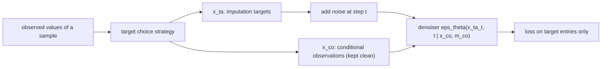

## Abstract

CSDI treats imputation of a multivariate time series as conditional generation: the missing entries come out of a reverse diffusion chain whose denoiser sees the observed entries clean and un-noised at every step. Earlier diffusion-based imputers reused an unconditional model and injected noised copies of the observations into the chain, destroying precisely the information the model should exploit. Because true missing values are never available, the authors train by hiding part of the observed values and reconstructing them, with four rules for choosing what to hide. The denoiser is a DiffWave-style residual stack whose convolutions are replaced by two one-layer Transformers, one over time and one over features. On an ICU dataset and a Beijing air-quality dataset it cuts CRPS by 40–65% against prior probabilistic imputers and MAE by 5–20% against deterministic ones; the same model, with a different mask, does interpolation and non-autoregressive forecasting.

**Keywords:** time series imputation, conditional diffusion, DDPM, self-supervised masking, two-dimensional attention, CRPS

## 1 Introduction

Real multivariate panels — clinical records, sensor networks, financial cross-sections — have holes. The dominant deep imputers at the time were recurrent: BRITS and its relatives, deterministic, with GP-VAE the main probabilistic alternative. Diffusion models already offered a recipe borrowed from image inpainting: run an *unconditional* reverse process over the whole grid and, at each step, overwrite the known coordinates with a correspondingly noised version of the observations.

The paper's objection to that recipe is the whole contribution, so it is worth stating carefully. The substitution approximates $p_\theta(\mathbf{x}^{ta}_{t-1}\mid\mathbf{x}^{ta}_t,\mathbf{x}^{co}_0)$ by the unconditional transition $p_\theta(\mathbf{x}_{t-1}\mid\mathbf{x}_t)$ evaluated at a grid whose observed half has been re-noised to level $t$. <mark>The network therefore never sees the observations at full precision; at the high-noise end of the chain, where the global shape of the sample is decided, it barely sees them at all.</mark> CSDI parameterizes the conditional transition directly and feeds the observations in clean.

That change creates a supervision problem: a conditional model needs (condition, target) pairs, but the targets of interest are by definition unobserved. The answer is lifted from masked language modelling — hide some of what you *do* observe and treat it as the target. [TimeGrad](/blog/timegrad/) is cited as the nearest diffusion predecessor and dismissed in one line: its RNN encoder needs a contiguous, complete past, which is exactly what an incomplete series does not provide.

## 2 Background

A sample is $\{\mathbf{X},\mathbf{M},\mathbf{s}\}$: values $\mathbf{X}\in\mathbb{R}^{K\times L}$ ($K$ features, $L$ time steps), an observation mask $\mathbf{M}\in\{0,1\}^{K\times L}$ with $m_{k,l}=1$ when $x_{k,l}$ is observed, and timestamps $\mathbf{s}\in\mathbb{R}^L$ that need not be evenly spaced. Interpolation (all features missing at some time points) and forecasting (all features missing at the last time points) are special cases of the same object.

The generative machinery is plain DDPM, covered in the [DDPM note](/blog/ddpm/); only the notation needs care. Here $t=1,\dots,T$ indexes the *diffusion* step, $\hat\alpha_t=1-\beta_t$, and $\alpha_t=\prod_{i\le t}\hat\alpha_i$ is the cumulative product that most papers write $\bar\alpha_t$. The forward marginal and the simplified loss are

$$
\mathbf{x}_t=\sqrt{\alpha_t}\,\mathbf{x}_0+\sqrt{1-\alpha_t}\,\boldsymbol\epsilon,\qquad \boldsymbol\epsilon\sim\mathcal{N}(\mathbf{0},\mathbf{I}),\tag{1}
$$

$$
\mathcal{L}(\theta)=\mathbb{E}_{\mathbf{x}_0,\boldsymbol\epsilon,t}\big\|\boldsymbol\epsilon-\epsilon_\theta(\mathbf{x}_t,t)\big\|_2^2 .\tag{2}
$$

The PDF prints the noise coefficient in (1) and in every equation derived from it as $(1-\alpha_t)$ rather than $\sqrt{1-\alpha_t}$ — a typo that propagates through Eqs. (4), (7), (9)–(12) of the paper. I use the form implied by the stated Gaussian marginal $q(\mathbf{x}_t\mid\mathbf{x}_0)=\mathcal{N}(\sqrt{\alpha_t}\mathbf{x}_0,(1-\alpha_t)\mathbf{I})$, which is the standard one.

## 3 Method

> **Key idea.** Split every sample into conditional observations $\mathbf{x}_0^{co}$ and imputation targets $\mathbf{x}_0^{ta}$. Diffuse only the targets; hand the denoiser the conditional part clean, plus a mask saying which entries are which. At training time, manufacture targets by hiding a subset of the observed values.



### 3.1 The conditional reverse process

Start from the DDPM reverse chain and restrict it to the target coordinates, conditioning every transition on the *clean* observations:

$$
p_\theta\!\left(\mathbf{x}^{ta}_{t-1}\mid\mathbf{x}^{ta}_t,\mathbf{x}^{co}_0\right)=\mathcal{N}\!\Big(\mathbf{x}^{ta}_{t-1};\ \mu_\theta(\mathbf{x}^{ta}_t,t\mid\mathbf{x}^{co}_0),\ \sigma_\theta(\mathbf{x}^{ta}_t,t\mid\mathbf{x}^{co}_0)\mathbf{I}\Big),\qquad \mathbf{x}^{ta}_T\sim\mathcal{N}(\mathbf{0},\mathbf{I}).\tag{3}
$$

The parameterization is then copied verbatim from DDPM with the conditioning threaded through the noise predictor — this step is exact, not an approximation, because nothing in Ho et al.'s algebra uses the fact that $\epsilon_\theta$ has only two arguments:

$$
\mu_\theta=\frac{1}{\sqrt{\hat\alpha_t}}\left(\mathbf{x}^{ta}_t-\frac{\beta_t}{\sqrt{1-\alpha_t}}\,\epsilon_\theta(\mathbf{x}^{ta}_t,t\mid\mathbf{x}^{co}_0)\right),\qquad \sigma_\theta=\tilde\beta_t^{1/2},\quad \tilde\beta_t=\frac{1-\alpha_{t-1}}{1-\alpha_t}\beta_t\ (t>1).\tag{4}
$$

Since the only change from (2) is the extra argument, the training objective is the same regression restricted to the targets:

$$
\mathcal{L}(\theta)=\mathbb{E}_{\mathbf{x}_0,\boldsymbol\epsilon,t}\big\|\boldsymbol\epsilon-\epsilon_\theta(\mathbf{x}^{ta}_t,t\mid\mathbf{x}^{co}_0)\big\|_2^2 .\tag{5}
$$

With an empty conditioning set the model degenerates to an ordinary unconditional generator, so CSDI is a strict generalization rather than a different object.

### 3.2 Why the clean conditioning matters — a 2-D Gaussian

Take $K=2$, $L=1$, $(x^{co},x^{ta})\sim\mathcal{N}(\mathbf{0},[[1,\rho],[\rho,1]])$, one coordinate observed and one missing. The exact answer is $\mathcal{N}(\rho x^{co},\,1-\rho^2)$. At the optimum of (5), $\epsilon_\theta$ is the conditional score of $q(x^{ta}_t\mid x^{co}_0)$, and the reverse chain reproduces that exact answer for every $t$.

Now run the replacement trick. It conditions on $x^{co}_t=\sqrt{\alpha_t}x^{co}_0+\sqrt{1-\alpha_t}\epsilon'$, a noisy measurement of the observation, and the implied posterior is

$$
q\!\left(x^{ta}_0\mid x^{co}_t\right)=\mathcal{N}\!\left(\sqrt{\alpha_t}\,\rho\,x^{co}_t,\ 1-\alpha_t\rho^2\right).\tag{6}
$$

Two things go wrong. The conditional mean is shrunk by $\sqrt{\alpha_t}$, and the conditional variance is inflated from $1-\rho^2$ to $1-\alpha_t\rho^2$. At the end of the chain $\alpha_t\to1$ and the damage vanishes; at the start $\alpha_t\to0$ and the model is imputing from the *prior*. <mark>The conditioning is weakest exactly at the high-noise steps that choose which mode the sample falls into, which is why later fine-grained steps cannot repair it.</mark> Equation (6) also predicts a qualitative finding buried in Appendix G: the unconditional model's intervals are systematically *wider* than CSDI's, which is what $1-\alpha_t\rho^2>1-\rho^2$ says.

> **My comment.** This is the choice CASE makes for continuing a history: every day carries its own noise level, observed days sit at level zero, and the observed prefix is re-clamped clean at every reverse step. Equation (6) is the cleanest argument I have seen for why that matters most at the high-noise end of the chain, which is, I suspect, where a twenty-day scenario's volatility level gets decided.

### 3.3 Self-supervised choice of targets

At sampling time the split is forced: all observed values condition, all missing values are targets. At training time <mark>a subset of the *observed* values is promoted to targets and the remainder conditions</mark>. Four rules, to be chosen from what is known about test-time missingness:

- **Random** — hide a fraction of the observed entries, the fraction itself drawn uniformly on $[0\%,100\%]$ per sample, so one model covers many missing rates.
- **Historical** — draw another training sample, and hide the entries that are observed here but missing there. Aimed at structured gaps such as consecutive outages.
- **Mix** — pick between the two above 1:1 per sample, trading pattern realism against overfitting to training patterns.
- **Test pattern** — when the test mask is known in advance (forecasting: the final $L_2$ steps), use it directly.

### 3.4 Fixed-shape inputs and the masked loss

Targets and conditions occupy sample-dependent index sets, which an attention stack cannot consume. Both are zero-padded to the full $K\times L$ grid, and the conditional mask $\mathbf{m}^{co}$ (1 on conditioning entries) is added as an input, so $\epsilon_\theta:(\mathbb{R}^{K\times L}\times\mathbb{R}\mid\mathbb{R}^{K\times L}\times\{0,1\}^{K\times L})\to\mathbb{R}^{K\times L}$.

Appendix D holds the detail that is easiest to get wrong. At sampling time the padding is harmless: every cell is a condition or a target, and $\mathbf{m}^{co}$ says which. At training time it is not, because the genuinely missing cells are neither and the network cannot tell them from real targets. The fix is to fold them into an *extended* target $\hat{\mathbf{x}}^{ta}_0$ with zeros in the missing cells, noise it with a masked noise vector $\boldsymbol\epsilon^{ta}:=(1-\mathbf{m}^{co})\odot\boldsymbol\epsilon$, and grade the regression only on the real targets:

$$
\mathcal{L}(\theta)=\mathbb{E}\big\|\big(\boldsymbol\epsilon-\epsilon_\theta(\hat{\mathbf{x}}^{ta}_t,t\mid\mathbf{x}^{co}_0,\mathbf{m}^{co})\big)\odot\mathbf{m}^{ta}\big\|_2^2,\qquad \mathbf{m}^{ta}=\mathbf{M}-\mathbf{m}^{co}.\tag{7}
$$

The network output is additionally multiplied by $(1-\mathbf{m}^{co})$. So the model is asked to denoise cells it is never scored on, and their zero fill is a small train/test mismatch the paper does not quantify.

### 3.5 Denoiser: attention along two axes

The backbone is DiffWave — gated residual layers with summed skip connections — with each layer's dilated convolution replaced by a **temporal Transformer layer** (a one-layer encoder attending over the $L$ steps of a single feature, input shape $(1,L,C)$) followed by a **feature Transformer layer** (attending over the $K$ features at a single time point, shape $(K,1,C)$). Both preserve shape, so layers stack freely, and because attention is length-agnostic, variable $L$ is handled with padding masks — the property that makes the irregular-sampling experiment possible at all. Side information is a 128-dimensional sinusoidal embedding of the timestamps $\mathbf{s}$ ($\tau=10{,}000$) and a 16-dimensional learned embedding per feature; the diffusion step gets its own 128-dimensional sinusoidal embedding. [Fig. 3 in the paper](https://arxiv.org/pdf/2107.03502#page=6) sketches the two attention passes, [Fig. 6](https://arxiv.org/pdf/2107.03502#page=16) the full network.

### 3.6 Algorithm

```text
train(data D, strategy S, steps T, cumulative schedule a[1..T]):
  repeat
    X, M    <- sample a series and its observation mask from D
    m_co    <- S(M)                          # 1 on entries kept as conditions
    m_ta    <- M - m_co                      # 1 on supervised targets
    t       <- Uniform{1..T};  e <- N(0, I)
    Xco     <- m_co * X                      # conditions, zero-padded
    Xta0    <- (1 - m_co) * X                # targets + unobserved cells (zeros)
    Xta_t   <- sqrt(a[t])*Xta0 + sqrt(1-a[t]) * ((1 - m_co) * e)
    step on grad_th || (e - eps_th(Xta_t, t | Xco, m_co)) * m_ta ||^2
  until converged

impute(X, M, T):
  m_co <- M;  Xco <- M * X
  Z    <- N(0, I) on the K x L grid
  for t = T down to 1:
    ehat <- eps_th(Z, t, Xco, m_co)
    mu   <- (Z - b[t]/sqrt(1-a[t]) * ehat) / sqrt(1 - b[t])
    Z    <- mu + (t > 1) * sqrt(bt[t]) * N(0, I)     # bt = posterior variance
  return (1 - M) * Z                                  # keep the missing cells only
```

Repeat `impute` 100 times for a predictive distribution; the median of those samples is the deterministic answer.

## 4 Implementation notes

| Item | As reported |
|---|---|
| Diffusion steps $T$ | 50 |
| Noise schedule | quadratic in $\sqrt{\beta}$, $\beta_{\text{min}}=10^{-4}$, $\beta_{\text{max}}=0.5$ |
| Residual layers / channels / heads | 4 / 64 / 8 |
| Parameters | ≈415,000 |
| Step and time embeddings | 128-d sinusoidal each; feature embedding 16-d |
| Optimizer | Adam, lr $10^{-3}$, decayed to $10^{-4}$ at 75% and $10^{-5}$ at 90% of epochs |
| Epochs / batch (imputation) | 200 / 16 |
| Batch / epochs (forecasting) | 8 / 50–300 by dataset |
| Samples per prediction | 100 (quantile grid of 0.05, 19 levels) |
| Preprocessing | per-feature zero mean, unit variance |
| Large-$K$ tricks | linear attention; random 64-feature subsets per batch |
| Compute / wall-clock | not stated |

The schedule is

$$
\beta_t=\left(\frac{T-t}{T-1}\sqrt{\beta_{\text{min}}}+\frac{t-1}{T-1}\sqrt{\beta_{\text{max}}}\right)^{2},\tag{8}
$$

quadratic spacing in $\sqrt\beta$, which decays $\alpha_t$ more gently than a linear schedule. Two reproduction traps: $\beta_{\text{max}}=0.5$ is far larger than the 0.02 typical of image DDPMs, and the layer count was chosen against validation loss and parameter size rather than copied from DiffWave. Splits: healthcare is cut into five parts, one used as test per run, the rest split 7:1 into train and validation; air quality uses months 3, 6, 9 and 12 as test, with months 1, 4, 7 and 10 excluded from the historical strategy's pattern pool because they generated the artificial ground truth.

## 5 Experiments

**Setup.** *Healthcare*: PhysioNet Challenge 2012, 4,000 ICU stays, 35 variables, binned to 48 hourly steps, ~80% missing; 10/50/90% of the observed test values are held out as ground truth; random strategy. *Air quality*: hourly PM2.5 from 36 Beijing stations over one year, windows of 36 steps, ~13% missing with structured gaps and structured artificial ground truth; mix strategy. Five runs each. Distributions come from 100 samples, scored by CRPS normalized by $\sum_{k,l}|x_{k,l}|$; the deterministic answer is the sample median, scored by MAE. The decisive control is an **unconditional** diffusion model with the same backbone, imputing by the replacement trick.

**Probabilistic imputation** (CRPS, lower is better; standard error over five trials):

| Method | Healthcare 10% | Healthcare 50% | Healthcare 90% | Air quality |
|---|---|---|---|---|
| Multitask GP | 0.489 (0.005) | 0.581 (0.003) | 0.942 (0.010) | 0.301 (0.003) |
| GP-VAE | 0.574 (0.003) | 0.774 (0.004) | 0.998 (0.001) | 0.397 (0.009) |
| V-RIN | 0.808 (0.008) | 0.831 (0.005) | 0.922 (0.003) | 0.526 (0.025) |
| Unconditional diffusion | 0.360 (0.007) | 0.458 (0.008) | 0.671 (0.007) | 0.135 (0.001) |
| **CSDI** | **0.238 (0.001)** | **0.330 (0.002)** | **0.522 (0.002)** | **0.108 (0.001)** |

**Two-axis attention ablation** (three trials; healthcare at 10% missing):

| Backbone | Healthcare MAE | Healthcare CRPS | Air MAE | Air CRPS |
|---|---|---|---|---|
| no temporal layer | 0.439 (0.004) | 0.475 (0.001) | 26.63 (0.23) | 0.292 (0.002) |
| no feature layer | 0.352 (0.001) | 0.386 (0.002) | 14.44 (0.11) | 0.162 (0.001) |
| flatten $K\times L$ to 1-D | 0.383 (0.002) | 0.418 (0.002) | 12.26 (0.09) | 0.139 (0.001) |
| Bi-RNN | 0.272 (0.001) | 0.301 (0.001) | 12.56 (0.26) | 0.142 (0.003) |
| dilated conv | 0.279 (0.002) | 0.305 (0.002) | 11.67 (0.11) | 0.130 (0.001) |
| **2-D attention** | **0.217 (0.001)** | **0.238 (0.001)** | **9.60 (0.04)** | **0.108 (0.001)** |

Reading the claims one at a time.

*"40–65% CRPS improvement over probabilistic baselines."* Supported; measured against the best non-diffusion baseline in each column it is 51%, 43%, 43% on healthcare and 64% on air quality. The top of the range comes from the dataset where the baselines are weakest.

*"Explicit conditioning is what helps."* The best-supported claim in the paper, because the control is right: same backbone, same schedule, same data. <mark>The unconditional row already beats every non-diffusion baseline, and conditioning then removes a further third of the error (0.360 → 0.238 at 10% missing).</mark> On MAE the split is starker — the unconditional model scores 0.326 at 10% missing, *worse* than BRITS at 0.284, while CSDI scores 0.217. A diffusion prior alone buys a good distribution; only the conditioning buys point accuracy.

*"5–20% MAE improvement over deterministic methods."* Supported but softer: the two strongest comparators (GLIMA at 0.265 and 10.54; BRITS at 0.278 and 11.56) are cited from their own papers rather than re-run, and the margin at 90% missing is only 7%.

*"Both attention axes matter."* Supported, with a twist: removing the temporal layer is about twice as damaging as removing the feature layer, and factorized attention beats attention over the flattened grid by a wide margin (0.238 vs 0.418) at matched parameter count.

> **My comment.** CASE factorises attention the same way, an asset pass and a time pass. The difference I care about is the feature axis: CSDI gives each feature a learned 16-d embedding, so a new sensor or a new stock is a new slot, whereas CASE describes each asset by six observable characteristics so an unseen name is just a new input. I would like to know how much of CSDI's feature-attention gain survives if the embedding is replaced by observable side information.

*"Competitive at interpolation and forecasting."* Interpolation on the irregularly sampled healthcare data is a clean win: CRPS 0.380 / 0.418 / 0.556 against mTANs 0.526 / 0.567 / 0.689 and Latent ODE 0.700 / 0.676 / 0.761. Forecasting is mixed on CRPS-sum — wins on electricity (0.017) and traffic (0.020, less than half TimeGrad's 0.044), a tie on wiki inside the error bars, a heavy loss on solar to TLAE (0.298 vs 0.124) and a narrow one on taxi to TimeGrad. The appendix is kinder: on per-series CRPS (Table 11) and on MSE (Table 12) CSDI leads four of five. <mark>The headline metric is the one where CSDI looks weakest, which is unusually honest.</mark> Those baselines are quoted, not re-run.

Three appendix results belong in the main text. **The historical strategy does not work**: <mark>on air quality it scores CRPS 0.113 / MAE 10.12 against 0.108 / 9.58 for the plain random strategy, on the very dataset whose structured gaps motivated it</mark> — training and test patterns differ enough to cancel the benefit. **ELBO is uninformative here**: <mark>across three schedules CRPS moves by 0.002 while the NLL bound moves from $<1.63$ to $<29.70$ to $<0.07$</mark>, because the smallest-noise steps are both hard to denoise on noisy series and irrelevant to sample quality. **100 samples is generous**: five or ten already beat the baselines, and the gain flattens past 50.

## 6 Limitations

**Stated by the authors.**

- Sampling is slow relative to other generative models; they point at ODE solvers and DDIM-style samplers as the fix, without running one.
- ELBO/NLL is not a usable proxy for sample quality under their schedule (Appendix F.2).
- The historical target strategy fails when training and test missing patterns differ (Appendix F.5).
- Downstream use (classification on imputed data) and non-time-series modalities are left as future work.
- Generative models of this kind can memorize private records and fabricate plausible data.

**My reading.**

- Both headline metrics are per-entry. CRPS and MAE score marginals; nothing in Tables 2 or 3 tests whether the joint law over the missing cells is right. The only joint-aware number in the paper is CRPS-sum in the forecasting table, where CSDI's advantage is smallest.
- No calibration diagnostics — no interval coverage, no PIT histogram — even though the conditional-vs-unconditional argument is fundamentally about interval width.
- The random strategy implicitly assumes missing-completely-at-random; historical addresses structure but not missingness that depends on the unobserved value, and Table 13 shows it barely helping.
- Cost is unquantified: 50 passes × 100 samples per imputation, feature attention quadratic in $K$, temporal attention quadratic in $L$, no wall-clock, no hardware. The forecasting workarounds (linear attention, 64-feature subsets) are themselves evidence that the vanilla model does not scale.
- The zero-filled missing cells inside the extended target (Eq. 7) are a quiet approximation: noised and denoised but never scored, with no ablation isolating their effect.

## 7 Extensions

**What was built on this.** The conditional-mask framing became the default for diffusion on incomplete time series. [TSDiff](/blog/tsdiff/) drops explicit conditioning and guides an unconditional model at sampling time — closer to what CSDI argues against, but with a real guidance term rather than naive replacement. [Diffusion-TS](/blog/diffusion-ts/) keeps mask-as-task and adds a trend/seasonality decomposition. SSSD swaps the two Transformers for structured state-space layers to cut the quadratic cost, and PriSTI adds a spatial prior for geo-sensor panels (both from general knowledge, unverified). The fast-sampler suggestions in the conclusion point at DDIM and Improved DDPM, both cited in the PDF.

**Open problems.** Evaluating the joint law of the imputed cells rather than their marginals. Missing-not-at-random mechanisms, where the mask carries information about the value. A model-selection criterion that is neither ELBO (useless here) nor a test-set score. Sub-quadratic attention that does not require subsampling features. Joint training with the downstream task.

**Research directions.** *These are ideas, not results — none has been run.*

1. **Mask-conditioned scenario generation for an asset panel.** *Hypothesis*: a CSDI-style model on daily returns of a liquid cross-section, with the test-pattern strategy set to "last $L_2$ days missing", produces scenarios with better cross-sectional dependence than a Gaussian or Student-$t$ copula fitted to the same window. *Data*: daily returns, a few hundred names, a decade. *Baseline*: copula simulation, plus the same architecture trained unconditionally and sampled with the replacement trick. *Metric*: energy and variogram scores (joint, unlike CRPS) plus tail coverage at 1% and 5%, following the evaluation logic of [Tail-GAN](/blog/tail-gan/). *Likely failure*: CRPS improves while dependence does not — the gap §6 identifies — and 50 steps × 100 paths × rebalancing dates is expensive for a backtest.
2. **Learning the mask instead of assuming it.** *Hypothesis*: replacing the four hand-written strategies with a learned generative model of $\mathbf{M}$, sampled per batch, improves robustness when test-time missingness differs from training-time missingness — the failure Table 13 exposes. *Data*: air quality with a deliberately shifted test mask (longer outages than in training). *Baseline*: the random, historical and mix strategies. *Metric*: CRPS as a function of train/test mask divergence. *Likely failure*: the mask model overfits training patterns and reproduces the historical strategy's problem one level up.
3. **Few-step CSDI.** *Hypothesis*: since Table 8 shows the small-noise end of the chain contributes almost nothing to sample quality, a DDIM-style deterministic sampler or a distilled student should match CSDI's CRPS in well under 10 steps. *Data*: healthcare and air quality, unchanged. *Baseline*: the published 50-step ancestral sampler. *Metric*: CRPS versus function evaluations. *Likely failure*: a deterministic sampler collapses the predictive spread, trading CRPS for a better median.

## 8 Takeaways

- Condition on clean observations *inside* the denoiser rather than patching an unconditional sampler. The 2-D Gaussian in §3.2 shows why: the replacement trick shrinks the conditional mean by $\sqrt{\alpha_t}$ and inflates the variance to $1-\alpha_t\rho^2$, and it does the most damage at the high-noise steps that decide the sample's shape.
- Hide-and-reconstruct training makes conditional diffusion trainable on data that is incomplete everywhere. What you hide is a modelling decision, and the paper's own ablation shows the clever choice (historical) losing to the naive one (random).
- A mask is a task. Imputation, interpolation and non-autoregressive forecasting are one model with three masks — the structural opposite of [TimeGrad](/blog/timegrad/), whose RNN state forbids all three but the last.
- Alternating time-wise and feature-wise attention is a strong, parameter-efficient denoiser for a $K\times L$ panel, at quadratic cost in whichever axis is long.
- Do not model-select this family by likelihood: the ELBO bound moves by an order of magnitude across schedules that produce identical CRPS.
- For financial panels the fit is natural — asynchronous trading, holidays, halts, staggered listings, and scenario generation conditioned on a partial path are all "fill in a masked grid" problems. <mark>The caveat is that market gaps are rarely random (halts and delistings correlate with the very values that go missing), and per-entry CRPS says nothing about cross-sectional dependence or tails</mark>, which is what a risk application actually needs checked.

## References

1. Tashiro, Y., Song, J., Song, Y., Ermon, S. *CSDI: Conditional Score-based Diffusion Models for Probabilistic Time Series Imputation.* NeurIPS 2021. [arXiv:2107.03502](https://arxiv.org/abs/2107.03502)
2. Ho, J., Jain, A., Abbeel, P. *Denoising Diffusion Probabilistic Models.* NeurIPS 2020. [arXiv:2006.11239](https://arxiv.org/abs/2006.11239)
3. Rasul, K., Seward, C., Schuster, I., Vollgraf, R. *Autoregressive Denoising Diffusion Models for Multivariate Probabilistic Time Series Forecasting.* ICML 2021. [arXiv:2101.12072](https://arxiv.org/abs/2101.12072)
4. Song, Y., Sohl-Dickstein, J., Kingma, D. P., Kumar, A., Ermon, S., Poole, B. *Score-Based Generative Modeling through Stochastic Differential Equations.* ICLR 2021.
5. Kong, Z., Ping, W., Huang, J., Zhao, K., Catanzaro, B. *DiffWave: A Versatile Diffusion Model for Audio Synthesis.* ICLR 2021.
6. Cao, W., Wang, D., Li, J., Zhou, H., Li, L., Li, Y. *BRITS: Bidirectional Recurrent Imputation for Time Series.* NeurIPS 2018.
