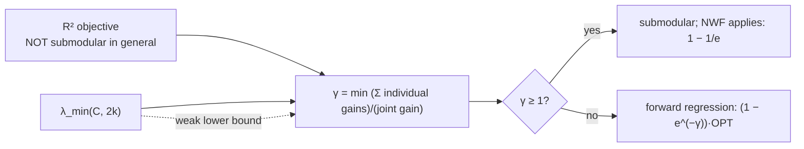

## Abstract

Select $k$ of $n$ variables to best predict a target by linear regression — feature selection, sparse approximation, the same problem. Forward selection is what everyone runs, and [the greedy guarantee](/blog/nemhauser-wolsey-fisher/) does not apply, because $R^2$ as a function of the selected set is **not submodular** in general: a variable can become *more* useful once others are present (a suppressor). Prior analyses handled this with spectral conditions — small sparse eigenvalues, restricted isometry — and the guarantees they give are weak. This paper's move is to stop asking whether the objective is submodular and start measuring how far from submodular it is. The **submodularity ratio**

$$
\gamma_{U,k}(f)=\min_{L\subseteq U,\ S:\lvert S\rvert\le k,\ S\cap L=\emptyset}\frac{\sum_{x\in S}\bigl(f(L\cup\{x\})-f(L)\bigr)}{f(L\cup S)-f(L)}
$$

equals 1 or more exactly when $f$ is submodular, and forward regression achieves $\bigl(1-e^{-\gamma}\bigr)\mathrm{OPT}$ — recovering $1-1/e$ at $\gamma=1$ and degrading continuously below it. Since $\gamma_{U,k}\ge\lambda_{\text{min}}(C,k+\lvert U\rvert)$, every spectral bound is a corollary, and *often a weak one*. Orthogonal matching pursuit gets $\bigl(1-e^{-\gamma\lambda_{\text{min}}(C,2k)}\bigr)\mathrm{OPT}$, dictionary selection gets similar ratios, and experiments on three small datasets show the predicted ordering — forward regression $\ge$ OMP $>$ Lasso $>$ oblivious — with $\gamma$ tracking performance better than the spectral parameters do.

**Keywords:** submodularity ratio, approximate submodularity, forward regression, orthogonal matching pursuit, sparse eigenvalue, dictionary selection

## 1 Introduction

The problem: *given pairwise covariances among $n$ variables $X_i$ … select a subset of $k\ll n$ of the variables and a linear prediction … that maximizes the $R^2$ fit.* Equivalently, in signal-processing language, *the input consists of a dictionary of $n$ feature vectors $x_i\in\mathbb{R}^m$, along with a target vector $z$, and the goal is to select at most $k$ vectors whose linear combination best approximates $z$* — the covariances are the inner products.

A distinction the paper is careful about: this is *not* sparse recovery. *In sparse recovery, it is generally assumed that the prediction vector is truly (almost) $k$-sparse, and the aim is to recover the exact coefficients of this truly sparse solution. However, finding a sparse solution is a well-motivated problem even if the true solution is not sparse.* That distinction matters enormously for anyone selecting factors: there is no reason to believe a true sparse model exists, and the goal is a good approximation under a budget, not recovery of a hidden truth. Restricted-isometry-style analyses target the recovery problem; this paper targets the approximation problem.

This is the paper that connects the whole submodular apparatus to statistical subset selection, and it does so by delivering bad news first. The objective people actually use is not submodular, so nothing in the preceding four reviews applies to it directly. What it then supplies — a continuous measure of the failure, and a guarantee that degrades continuously with it — is the template for every later "approximately submodular" result.

## 2 Background: why the existing answers were unsatisfying

Two prior routes.

**Assume submodularity.** Earlier work identified *a strong condition termed "absence of conditional suppressors" which ensures that the $R^2$ objective is actually submodular*. A suppressor is a variable that is useless alone but valuable in combination — precisely the situation where a marginal gain *increases* with the selected set. The condition rules them out by fiat, and real data has them.

**Assume spectral conditions.** Bound things by the smallest $k$-sparse eigenvalue $\lambda_{\text{min}}(C,k)$ — *the smallest eigenvalue of any $k\times k$ submatrix of $C$* — or the sparse condition number, which is closely related to the restricted isometry property. The paper's objection is that *applying [these] results to the subset selection problem adds a dependence on the largest $k$-sparse eigenvalue and only leads to* weaker guarantees, and more fundamentally that the relevant quantity is *not how singular the covariance matrix is, but rather how far the $R^2$ measure deviates from submodularity*.

That last sentence is the thesis. Singularity and non-submodularity are different things, they happen to be related by an inequality, and conditioning the analysis on the wrong one loses a lot.

## 3 Method

> **Key idea.** Submodularity says the sum of individual gains is at least the joint gain. Take the *ratio* of those two quantities and minimise it over all the configurations that could go wrong. You get a number that is $\ge1$ exactly when the function is submodular, and the greedy guarantee becomes a function of that number.

### 3.1 The submodularity ratio

**Definition 2.3.** For a non-negative set function $f$, a set $U$ and $k\ge1$,

$$
\gamma_{U,k}(f)=\min_{\substack{L\subseteq U,\ S:\lvert S\rvert\le k\\ S\cap L=\emptyset}}\ \frac{\sum_{x\in S}\bigl(f(L\cup\{x\})-f(L)\bigr)}{f(L\cup S)-f(L)}. \tag{1}
$$

*It captures how much more $f$ can increase by adding any subset $S$ of size $k$ to $L$, compared to the combined benefits of adding its individual elements to $L$.* The characterisation that makes it the right object:

> $f$ is submodular if and only if $\gamma_{U,k}\ge1$ for all $U$ and $k$.

So (1) is not an analogy to submodularity, it is a *measurement* of it, calibrated so that 1 is the boundary. $\gamma<1$ means some set of $k$ elements is worth more together than the sum of its parts — synergy, suppressors, the thing greedy cannot see.

For the $R^2$ objective it has a closed form. Writing $C^L$ and $b^L$ for the normalised covariance matrix and vector of the *residuals* $\mathrm{Res}(X_i,L)$,

$$
\gamma_{U,k}=\min_{L,S}\frac{\sum_{i\in S}\bigl(R^2_{Z,L\cup\{X_i\}}-R^2_{Z,L}\bigr)}{R^2_{Z,S\cup L}-R^2_{Z,L}}
=\min_{L,S}\frac{(b^L_S)^{\mathsf T}b^L_S}{(b^L_S)^{\mathsf T}(C^L_S)^{-1}b^L_S}. \tag{2}
$$

The right-hand form is a Rayleigh-quotient-like ratio, and reading it makes the connection to conditioning obvious: the denominator inflates exactly when $C^L_S$ has small eigenvalues, i.e. when the residualised selected variables are near-collinear.

**Lemma 2.4.** $\gamma_{U,k}\ge\lambda_{\text{min}}(C,k+\lvert U\rvert)\ge\lambda_{\text{min}}(C)$, so with $\lvert U\rvert=k$,

$$
\gamma_{U,k}\ \ge\ \lambda_{\text{min}}(C,2k). \tag{3}
$$

This is the "submodular meets spectral" of the title: every spectral condition becomes a *sufficient* condition for a bound on $\gamma$, so all previous results are corollaries. And the paper immediately says what it is buying: *the smallest $2k$-sparse eigenvalue is a lower bound on this submodularity ratio; as we show later, **it is often a weak lower bound***. A matrix can be badly conditioned while $R^2$ is nearly submodular.

### 3.2 The guarantees

**Theorem 3.2 (Forward Regression).** With $\mathrm{OPT}=\max_{\lvert S\rvert=k}R^2_{Z,S}$ and $S^{\mathrm{FR}}$ the forward-selection set,

$$
R^2_{Z,S^{\mathrm{FR}}}\ \ge\ \Bigl(1-e^{-\gamma_{S^{\mathrm{FR}},k}}\Bigr)\mathrm{OPT}
\ \ge\ \Bigl(1-e^{-\lambda_{\text{min}}(C,2k)}\Bigr)\mathrm{OPT}
\ \ge\ \Bigl(1-e^{-\lambda_{\text{min}}(C,k)}\Bigr)\Theta\!\left(\Bigl(\tfrac12\Bigr)^{1/\lambda_{\text{min}}(C,k)}\right)\mathrm{OPT}. \tag{4}
$$

Three bounds in decreasing strength, corresponding to three decreasing amounts of information: the true ratio, the $2k$-sparse eigenvalue, the $k$-sparse eigenvalue. At $\gamma=1$ the first is exactly $1-1/e$, so [NWF](/blog/nemhauser-wolsey-fisher/) is the special case — which is the mark of a correct generalisation.

Note the shape of the degradation. For small $\gamma$, $1-e^{-\gamma}\approx\gamma$, so the guarantee is essentially linear in how submodular the objective is. Half as submodular, half the guarantee; there is no cliff.

**Theorem 3.7 (Orthogonal Matching Pursuit).**

$$
R^2_{Z,S^{\mathrm{OMP}}}\ \ge\ \Bigl(1-e^{-\gamma_{S^{\mathrm{OMP}},k}\cdot\lambda_{\text{min}}(C,2k)}\Bigr)\mathrm{OPT}
\ \ge\ \Bigl(1-e^{-\lambda_{\text{min}}(C,2k)^2}\Bigr)\mathrm{OPT}. \tag{5}
$$

Strictly weaker than (4) — an extra factor of $\lambda_{\text{min}}(C,2k)\le1$ in the exponent, becoming a square in the spectral form. That is not an artefact: OMP picks the variable with the largest correlation with the current residual, which is a *proxy* for the actual $R^2$ improvement, and the proxy's quality is exactly what the extra eigenvalue factor measures. Forward regression computes the true gain, at more cost per step.

So the theory predicts a strict ordering, **FR $\ge$ OMP $>$ Oblivious**, and §5 checks it.

**Lemma 3.3** is the workhorse and worth stating because it shows where $\gamma$ enters:

$$
\frac{1}{\lambda_{\max}(C)}\sum_iR^2_{Z,X_i}\ \le\ R^2_{Z,\{X_1,\dots,X_n\}}\ \le\ \frac{1}{\gamma_{\emptyset,n}}\sum_iR^2_{Z,X_i}\ \le\ \frac{1}{\lambda_{\text{min}}(C)}\sum_iR^2_{Z,X_i}. \tag{6}
$$

The joint $R^2$ of a set is sandwiched between multiples of the sum of individual $R^2$s, with $1/\gamma$ the tight upper constant and $1/\lambda_{\text{min}}$ the loose spectral one.

### 3.3 Dictionary selection

The same machinery extends to choosing a *dictionary* $D$ of size $d$ such that, for each of several targets $Z_j$, some $k$-subset of $D$ fits it well: maximise $F(D)=\sum_j\max_{S\subseteq D,\lvert S\rvert=k}R^2_{Z_j,S}$. Two algorithms, $\mathrm{SDS}_{\mathrm{MA}}$ and $\mathrm{SDS}_{\mathrm{OMP}}$, get bounds of the form

$$
F(D^{\mathrm{MA}})\ \ge\ \frac{\gamma_{\emptyset,k}}{\lambda_{\max}(C,k)}\Bigl(1-\tfrac1e\Bigr)F(D^\ast)
\ \ge\ \frac{\lambda_{\text{min}}(C,k)}{\lambda_{\max}(C,k)}\Bigl(1-\tfrac1e\Bigr)F(D^\ast), \tag{7}
$$

so here a *condition number* $\lambda_{\text{min}}/\lambda_{\max}$ appears alongside $1-1/e$ — the nested maximisation costs an extra factor that the single-target problem does not pay.

### 3.4 Algorithm

```text
FORWARD REGRESSION                      # analysed guarantee: (1 - e^{-gamma}) * OPT
  S = {}
  for i = 1..k:
      X_m = argmax_{X not in S}  R2(Z, S + X)     # refit the regression for each candidate
      S = S + X_m
  return S

ORTHOGONAL MATCHING PURSUIT             # cheaper per step; guarantee has an extra lambda_min factor
  S = {}
  for i = 1..k:
      r   = residual of Z on span(S)
      X_m = argmax_{X not in S}  |corr(X, r)|     # proxy for the R2 gain, not the gain itself
      S = S + X_m
  return S

OBLIVIOUS                               # baseline: ignore interactions entirely
  return the k variables with largest individual R2(Z, X_i)
```



## 4 Implementation notes

- **Neither $\gamma$ nor $\lambda_{\text{min}}(C,k)$ is computable at scale.** $\lambda_{\text{min}}(C,k)$ is NP-hard — the paper says so and defers approximation to an appendix — and $\gamma_{U,k}$ is a minimum over exponentially many pairs $(L,S)$. So (4) is an *analysis* tool and a *predictor*, not something you evaluate before deciding whether to trust your greedy run. This is the central practical limitation and it is why the experiments are small.
- **Everything runs on a covariance matrix.** Inputs are $C$ and $b$; no raw data is needed by any algorithm, which is why the formulation covers both feature selection and sparse approximation.
- **$C$ is assumed non-singular on the selected sets**, with an extension to singular matrices via the Moore–Penrose inverse noted for some results.
- **The greedy algorithms themselves are cheap.** *We stress that the greedy algorithms themselves are very efficient, and the restriction on data set sizes is only intended to allow for an adequate evaluation of the results.* The $n\le30$, $k\le8$ limit is imposed by the *evaluation*, not the method.

## 5 Experiments

**Setup.** Forward Regression, OMP, Oblivious, Lasso (the Koh et al. implementation), against the exhaustive optimum. Alongside the algorithms, four diagnostics are computed: the submodularity ratio $\gamma_{S^{\mathrm{FR}},k}$; the sparse eigenvalues $\lambda_{\text{min}}(C,k)$ and $\lambda_{\text{min}}(C,2k)$ (*in some cases, computing $\lambda_{\text{min}}(C,2k)$ was not computationally feasible due to the problem size*); the sparse inverse condition number $\kappa(C,k)^{-1}$, *strongly related to the Restricted Isometry Property*; and $\lambda_{\text{min}}(C)$.

**Datasets**, all small by necessity, $n\le30$ and $k\le8$:

| | $n$ | $m$ | target |
|---|---|---|---|
| Boston Housing (UCI) | 15 | 516 | housing price |
| World Bank Development Indicators (2005–06) | 29 | 65 countries | average life expectancy |
| Synthetic (Gaussian, pairwise correlation 0.6) | 29 | 100 | linear with coefficients $\mathcal{U}(0,10)$, noise $\sigma^2=0.1$ |

The synthetic design is well chosen: *notice that the target vector is not truly sparse*, so it tests the approximation problem rather than recovery; correlation 0.6 puts it squarely in the regime where the spectral conditions are unfavourable; and results are averaged over 20 runs.

**Results.** *On all data sets, Forward Regression performs optimally or near-optimally, and OMP is only slightly worse. Lasso performs somewhat worse on all data sets, and, not surprisingly, the baseline Oblivious algorithm performs even worse. **The order of performance of the greedy algorithms match the order of the strength of the theoretical bounds we derived for them.*** That last clause is the paper's real claim — not that the bounds are tight, but that their *ordering* is informative.

And the headline diagnostic claim, from the abstract: *the submodularity ratio is a stronger predictor of the performance of greedy algorithms than other spectral parameters.* The parameter figures show $\gamma_{S^{\mathrm{FR}},k}$ sitting well above $\lambda_{\text{min}}(C,k)$, $\lambda_{\text{min}}(C,2k)$, $\kappa(C,k)^{-1}$ and $\lambda_{\text{min}}(C)$ — consistent with Lemma 2.4, and the gap is the point.

**A nice dataset-specific observation:** on the World Bank data *all algorithms perform quite well with just 2–3 features already. The main reason is that adolescent birth rate is by itself highly predictive of life expectancy* — i.e. when one variable dominates, every method finds it and the comparison is uninformative. Explaining away your own flat result is good practice.

**The caveat that changes how the results should be read**, stated by the authors in one sentence:

> We evaluate the performance of all algorithms in terms of their $R^2$ fit; thus, we implicitly treat $C$ and $b$ as the ground truth, and **also do not separate the data sets into training and test cases**.

Everything here is *in-sample*. "Forward regression performs optimally" means it matches the exhaustive in-sample optimum, which is the right benchmark for the optimisation question the paper poses and says nothing whatever about generalisation. For anyone doing feature or factor selection to predict out of sample, that is the question, and it is not asked. It also makes the Lasso comparison structurally unfair in a way the paper does not flag: the greedy methods optimise in-sample $R^2$ directly, which is precisely the reported metric, while Lasso deliberately does not.

## 6 Limitations

**Stated by the authors.** $\lambda_{\text{min}}(C,k)$ is NP-hard to compute. Dataset sizes are restricted to allow evaluation. No train/test separation. For Lasso, *it is not known whether strong multiplicative bounds, like the ones we proved for Forward Regression or OMP, can be obtained* — an honest statement of what is and is not known rather than a claim of superiority.

**My reading.**

- **The bounds are weak on the very data used to validate them.** With $\gamma$ around $0.3$–$0.5$ on these datasets, $1-e^{-\gamma}$ is roughly $0.26$–$0.39$ — a guarantee that forward regression achieves a quarter to two-fifths of the optimum, while empirically it achieves essentially all of it. The paper's defence is explicit and correct: $\gamma$ is offered as a *predictor* and a *relative ordering*, not as a tight bound. But a reader should not come away thinking the theory certifies the observed performance, because it does not, by a wide margin.
- **$\gamma$ is as uncomputable as the quantities it replaces.** It is a minimum over $\binom{n}{\le k}$ sets times all subsets $L$. On the experimental sizes it is computed by something close to enumeration; at $n=1000$ it is not available. So the practical recommendation the paper supports is "run forward regression", which is what everyone did anyway — the contribution is understanding *why* it works, not a new procedure or a usable certificate.
- **In-sample only**, as above, which is the gap between this paper and the use case that motivates it.
- **The $\gamma$ reported is $\gamma_{S^{\mathrm{FR}},k}$**, computed at the set forward regression actually selected. That is the quantity appearing in Theorem 3.2, so it is the right one, but it is also *a posteriori* — you cannot know it before running the algorithm, and it is not a property of the data alone.
- **Suppressors are the interesting case and are never exhibited.** The whole motivation is that $R^2$ fails submodularity because variables can help in combination. No experiment constructs such a case and shows greedy failing, which would have been the most informative negative result available.
- **Three small datasets, one of them synthetic**, with $k\le8$. The evaluation constraint is real and acknowledged, and the evidence base is correspondingly narrow.

## 7 Extensions

**What was built on this.** The submodularity ratio became the standard device for extending submodular guarantees to objectives that are not submodular: weak submodularity in sparse regression and in neural-network pruning, restricted strong convexity connections that lower-bound $\gamma$ by computable quantities, greedy guarantees for Bayesian A-optimal and D-optimal experimental design, column subset selection, and the adaptive analogue used in the sequel to [adaptive submodularity](/blog/adaptive-submodularity/). The general pattern — do not ask whether the property holds, measure the degree to which it fails, and carry that measure through the proof — is now standard, and this is where it starts for subset selection. The companion notion of *curvature*, which bounds greedy from the other side, plays the same role for objectives that are submodular but nearly modular.

**Open problems.** Computable lower bounds on $\gamma$ that are tighter than $\lambda_{\text{min}}(C,2k)$. Whether Lasso admits comparable multiplicative guarantees. And the question this paper's framing raises and cannot answer: does a high in-sample $\gamma$ say anything about out-of-sample behaviour?

**Research directions.** *These are ideas, not results — none has been run.*

1. **Does the submodularity ratio survive the train/test split?** Hypothesis: the in-sample $\gamma$ computed on a training covariance matrix is a poor predictor of *out-of-sample* $R^2$ of the greedy selection, because $\gamma$ measures an optimisation property and the out-of-sample gap is a statistical one — and the two can move in opposite directions, with highly collinear (low-$\gamma$) feature sets producing unstable but in-sample-excellent selections. Data: Boston Housing and the synthetic design, with proper train/test splits and repeated resampling. Baseline: forward regression, OMP, Lasso, oblivious, evaluated out of sample. Metric: correlation between training-set $\gamma$ and test-set $R^2$, against the correlation between $\gamma$ and training-set $R^2$. Likely failure mode: at $n\le30$ with $m$ in the hundreds the out-of-sample gap is small for every method and the comparison has no resolution, forcing a higher-dimensional design where $\gamma$ is not computable.
2. **Measure $\gamma$ on a factor panel.** Hypothesis: for equity factor selection, where factors within a family (several value measures, several momentum horizons) are strongly correlated and cross-family combinations can be complementary, $\gamma$ is well below 1 and materially above $\lambda_{\text{min}}(C,2k)$ — so the theory says forward selection has a weak guarantee while the ratio says it is far better than the spectral condition implies. Data: a standard factor panel restricted to $n\le25$ so that $\gamma$ and the exhaustive optimum are computable, predicting the cross-section of returns. Baseline: exhaustive selection, forward regression, OMP, Lasso. Metric: $\gamma_{S^{\mathrm{FR}},k}$ and the spectral parameters, alongside the realised in-sample gap to exhaustive. Likely failure mode: on a factor panel the answer is dominated by one or two factors — the World Bank phenomenon — and every method ties, so the panel has to be constructed to exclude the dominant factor, which changes the question.
3. **Construct the suppressor case the paper does not.** Hypothesis: there are realistic covariance structures — a variable uncorrelated with the target but correlated with the noise in another variable, the classical suppressor — where $\gamma$ is very small and forward regression's shortfall approaches the $1-e^{-\gamma}$ bound rather than sitting near optimal, so the bound is tight on a non-adversarial instance. Data: synthetic covariance matrices with a planted suppressor of tunable strength. Baseline: exhaustive optimum, forward regression, OMP, oblivious. Metric: realised ratio to optimum against $\gamma$, compared with the curve $1-e^{-\gamma}$. Likely failure mode: forward regression finds suppressors anyway once the first variable is in, because after one step the suppressor's marginal gain is visible — which would show that $\gamma$'s worst case is attained only at $L=\emptyset$ and would be a genuinely useful refinement.

## 8 Takeaways

- $R^2$ is not submodular. A suppressor variable — useless alone, valuable in combination — makes a marginal gain *increase* with the selected set, which is exactly what submodularity forbids. So the standard greedy guarantee does not cover the algorithm everyone actually runs.
- The submodularity ratio $\gamma$ is the ratio of the sum of individual gains to the joint gain, minimised over the configurations that could go wrong. It is $\ge1$ if and only if $f$ is submodular, so it is a measurement calibrated at the boundary rather than an analogy.
- Forward regression achieves $(1-e^{-\gamma})\mathrm{OPT}$, recovering $1-1/e$ at $\gamma=1$ and degrading roughly linearly in $\gamma$ below it. A correct generalisation contains the original as a special case, and this one does.
- Every spectral condition becomes a corollary through $\gamma\ge\lambda_{\text{min}}(C,2k)$ — and that lower bound is often weak, so conditioning the analysis on conditioning was the wrong choice.
- OMP's weaker bound has a mechanism: it selects on correlation with the residual, a proxy for the $R^2$ gain, and the extra eigenvalue factor in the exponent is the price of the proxy. The predicted ordering FR $\ge$ OMP $>$ oblivious holds in the experiments.
- The bounds are not tight. On the paper's own data they certify a quarter to two-fifths of optimal while greedy delivers essentially all of it. The contribution is that $\gamma$ *predicts* and *orders* performance better than any spectral quantity, not that it certifies it.
- Neither $\gamma$ nor the sparse eigenvalues can be computed at realistic scale, so this is an explanation of why forward selection works rather than a usable pre-run certificate.
- All results are in-sample, with no train/test split, stated plainly by the authors. For the optimisation question posed that is the right benchmark; for feature selection aimed at prediction it leaves the main question open.

## References

1. Das, A., Kempe, D. *Submodular meets Spectral: Greedy Algorithms for Subset Selection, Sparse Approximation and Dictionary Selection.* arXiv:1102.3975, 2011.
2. Nemhauser, G. L., Wolsey, L. A., Fisher, M. L. *An analysis of approximations for maximizing submodular set functions—I.* Mathematical Programming 14, 1978.
3. Das, A., Kempe, D. *Algorithms for Subset Selection in Linear Regression.* STOC 2008.
4. Tropp, J. A. *Greed is Good: Algorithmic Results for Sparse Approximation.* IEEE Transactions on Information Theory 50(10), 2004.
5. Koh, K., Kim, S.-J., Boyd, S. *An Interior-Point Method for Large-Scale L1-Regularized Logistic Regression.* JMLR 8, 2007.
6. Golovin, D., Krause, A. *Adaptive Submodularity.* arXiv:1003.3967.
7. Zhang, T. *Adaptive Forward-Backward Greedy Algorithm for Sparse Learning with Linear Models.* NeurIPS 2008.
