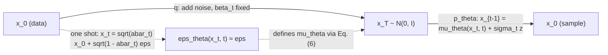

## Abstract

Diffusion probabilistic models had existed since 2015 as a tidy latent-variable construction without anyone showing they could produce good samples; this paper shows they can. The forward process is a fixed Markov chain that adds a little Gaussian noise at each of $T$ steps; the generative model is a chain of learned Gaussian transitions running the other way, trained with a variational bound. The decisive choice is to have the network predict the noise mixed into a sample rather than the mean of the reverse transition. Under that parameterization every term of the bound becomes a weighted denoising score matching loss and the sampler resembles annealed Langevin dynamics. Dropping the weights gives a simpler objective that reaches an Inception score of 9.46 and an FID of 3.17 on unconditional CIFAR-10. Log-likelihoods remain uncompetitive, which the authors explain as a lossy-compression property.

**Keywords:** diffusion probabilistic models, variational bound, noise prediction, denoising score matching, Langevin dynamics, progressive lossy compression

## 1 Introduction

By mid-2020 GANs, autoregressive models, flows and VAEs all had convincing image samples, and score-based models had just joined them ([NCSN](/blog/ncsn/), [NCSNv2](/blog/ncsnv2/)). Diffusion models, introduced by Sohl-Dickstein et al. in 2015, were easy to define and cheap to train per step, yet <mark>there had been no demonstration that they could generate high-quality samples</mark>; the only diffusion entry in the paper's CIFAR-10 table is a likelihood bound of 5.40 bits/dim with no sample-quality score at all.

The score-based line had good samples but a different weakness. NCSN trains a score network by denoising score matching and then bolts on an annealed Langevin sampler whose step sizes and noise scales are picked by hand after training. Nothing in the training loss says that this sampler, run for this many steps, lands on the data distribution. Appendix C adds that NCSN's largest noise level does not fully destroy the signal, so the sampler starts from a distribution the network never saw.

In DDPM the sampler *is* the model: a finite Markov chain whose marginal after $T$ steps is fitted by variational inference. With the right parameterization the resulting loss is the same denoising regression NCSN used, but the weights and sampler coefficients now follow from the forward process.

## 2 Background

A diffusion model is a latent-variable model $p_\theta(x_0)=\int p_\theta(x_{0:T})\,dx_{1:T}$ whose latents $x_1,\dots,x_T$ have the dimension of the data. The **reverse process** is a Markov chain started from $p(x_T)=\mathcal N(0,I)$ with learned Gaussian transitions:

$$
p_\theta(x_{t-1}\mid x_t)=\mathcal N\big(x_{t-1};\,\mu_\theta(x_t,t),\,\Sigma_\theta(x_t,t)\big).
\tag{1}
$$

$\mu_\theta$ and $\Sigma_\theta$ are network outputs and hold everything learnable.

The **forward process** is the approximate posterior, but it has nothing to learn. With a variance schedule $\beta_1,\dots,\beta_T$, $\alpha_t=1-\beta_t$ and $\bar\alpha_t=\prod_{s\le t}\alpha_s$,

$$
q(x_t\mid x_{t-1})=\mathcal N\big(x_t;\sqrt{1-\beta_t}\,x_{t-1},\,\beta_t I\big),
\qquad
q(x_t\mid x_0)=\mathcal N\big(x_t;\sqrt{\bar\alpha_t}\,x_0,\,(1-\bar\alpha_t)I\big).
\tag{2}
$$

The factor $\sqrt{1-\beta_t}$ shrinks the signal so that the total variance stays bounded, and the right-hand marginal, obtained by composing Gaussians, means $x_t$ can be drawn from $x_0$ in one shot.

Two facts are borrowed. Gaussian reverse transitions are adequate because forward and reverse kernels share a functional form when $\beta_t$ is small (Sohl-Dickstein et al.), an approximation that improves as the chain lengthens. Denoising score matching is covered in the [NCSN](/blog/ncsn/) note.

## 3 Method

> **Key idea.** Write $x_t=\sqrt{\bar\alpha_t}\,x_0+\sqrt{1-\bar\alpha_t}\,\epsilon$ and let the network predict $\epsilon$ from $(x_t,t)$. The variational bound then collapses, term by term, into a squared error between true and predicted noise: denoising score matching over a ladder of noise levels indexed by $t$, with a sampler whose coefficients are dictated by the forward chain.

### 3.1 From the ELBO to a sum of Gaussian KLs

Start from the standard bound, $\mathbb E[-\log p_\theta(x_0)]\le\mathbb E_q[-\log p_\theta(x_{0:T})/q(x_{1:T}\mid x_0)]=:L$. Both processes factorize over $t$, so $L$ is a sum of log-ratios $\log p_\theta(x_{t-1}\mid x_t)/q(x_t\mid x_{t-1})$. Each compares a reverse kernel with a forward kernel and needs a sampled pair $(x_{t-1},x_t)$: a high-variance estimator.

Appendix A (reproducing Sohl-Dickstein et al.) removes this with one application of Bayes' rule. Because the forward chain is Markov, $q(x_t\mid x_{t-1})=q(x_t\mid x_{t-1},x_0)=q(x_{t-1}\mid x_t,x_0)\,q(x_t\mid x_0)/q(x_{t-1}\mid x_0)$ for $t>1$. Substituting, the ratios $q(x_t\mid x_0)/q(x_{t-1}\mid x_0)$ telescope to $q(x_T\mid x_0)/q(x_1\mid x_0)$, and the $q(x_1\mid x_0)$ cancels against the $t=1$ term. What is left is

$$
L=\mathbb E_q\Big[\underbrace{D_{\mathrm{KL}}\big(q(x_T\mid x_0)\,\Vert\,p(x_T)\big)}_{L_T}
+\sum_{t>1}\underbrace{D_{\mathrm{KL}}\big(q(x_{t-1}\mid x_t,x_0)\,\Vert\,p_\theta(x_{t-1}\mid x_t)\big)}_{L_{t-1}}
\underbrace{-\log p_\theta(x_0\mid x_1)}_{L_0}\Big].
\tag{3}
$$

$L_T$ measures how far the fully noised data is from the prior, each $L_{t-1}$ asks the learned reverse step to match the *true* reverse step for a known $x_0$, and $L_0$ is a reconstruction term. The step is an exact rearrangement.

The forward posterior follows from multiplying the two Gaussians $q(x_t\mid x_{t-1})$ and $q(x_{t-1}\mid x_0)$ as functions of $x_{t-1}$ and completing the square. Precisions add, $\alpha_t/\beta_t+1/(1-\bar\alpha_{t-1})=(1-\bar\alpha_t)/\big(\beta_t(1-\bar\alpha_{t-1})\big)$, giving

$$
q(x_{t-1}\mid x_t,x_0)=\mathcal N\big(\tilde\mu_t,\tilde\beta_t I\big),\quad
\tilde\mu_t=\frac{\sqrt{\bar\alpha_{t-1}}\,\beta_t}{1-\bar\alpha_t}x_0+\frac{\sqrt{\alpha_t}\,(1-\bar\alpha_{t-1})}{1-\bar\alpha_t}x_t,\quad
\tilde\beta_t=\frac{1-\bar\alpha_{t-1}}{1-\bar\alpha_t}\beta_t.
\tag{4}
$$

The mean is a precision-weighted average of what $x_0$ and $x_t$ each say about $x_{t-1}$, and $\tilde\beta_t<\beta_t$ because knowing $x_0$ removes uncertainty. Every KL in Eq. (3) is now between Gaussians and has a closed form.

### 3.2 Fixing what need not be learned

Two simplifications, both choices rather than derivations. The $\beta_t$ are constants, so $L_T$ has no parameters and is dropped. The reverse covariance is untrained, $\Sigma_\theta=\sigma_t^2I$, with either $\sigma_t^2=\beta_t$ or $\sigma_t^2=\tilde\beta_t$; the paper reports similar results for both and describes them as optimal for $x_0\sim\mathcal N(0,I)$ and for $x_0$ a single point respectively. With fixed isotropic variance the Gaussian KL reduces to

$$
L_{t-1}=\mathbb E_q\Big[\frac{1}{2\sigma_t^2}\big\lVert\tilde\mu_t(x_t,x_0)-\mu_\theta(x_t,t)\big\rVert^2\Big]+C,
\tag{5}
$$

where $C$ collects the variance terms and does not depend on $\theta$. Given the fixed variance this is exact: a regression onto the posterior mean, weighted by the inverse reverse variance.

### 3.3 Noise-prediction parameterization

Now reparameterize $x_t=\sqrt{\bar\alpha_t}x_0+\sqrt{1-\bar\alpha_t}\,\epsilon$, solve for $x_0=(x_t-\sqrt{1-\bar\alpha_t}\,\epsilon)/\sqrt{\bar\alpha_t}$, and substitute into $\tilde\mu_t$. The coefficient on $x_t$ becomes $\big(\beta_t+\alpha_t-\bar\alpha_t\big)/\big(\sqrt{\alpha_t}(1-\bar\alpha_t)\big)=1/\sqrt{\alpha_t}$, and the coefficient on $\epsilon$ becomes $-\beta_t/\big(\sqrt{\alpha_t}\sqrt{1-\bar\alpha_t}\big)$. So the regression target is $\frac{1}{\sqrt{\alpha_t}}\big(x_t-\frac{\beta_t}{\sqrt{1-\bar\alpha_t}}\epsilon\big)$. Since $x_t$ is the network's input, the only unknown is $\epsilon$, which motivates

$$
\mu_\theta(x_t,t)=\frac{1}{\sqrt{\alpha_t}}\Big(x_t-\frac{\beta_t}{\sqrt{1-\bar\alpha_t}}\,\epsilon_\theta(x_t,t)\Big).
\tag{6}
$$

The $1/\sqrt{\alpha_t}$ undoes the forward shrinkage and the second term subtracts the network's estimate of the noise added so far, scaled to one step's worth. This is a change of variables for $\mu_\theta$, not an approximation. Plugging Eq. (6) into Eq. (5), the $x_t$ terms cancel and

$$
L_{t-1}-C=\mathbb E_{x_0,\epsilon}\Big[\underbrace{\frac{\beta_t^2}{2\sigma_t^2\,\alpha_t(1-\bar\alpha_t)}}_{w_t}\big\lVert\epsilon-\epsilon_\theta\big(\sqrt{\bar\alpha_t}x_0+\sqrt{1-\bar\alpha_t}\,\epsilon,\;t\big)\big\rVert^2\Big].
\tag{7}
$$

The squared error is a plain denoising loss at noise level $t$, and $w_t$ is the weight the likelihood bound assigns to that level.

Why this is score matching (the paper says "resembles"; the identity below is the standard one and the wording is mine): $\nabla_{x_t}\log q(x_t\mid x_0)=-\epsilon/\sqrt{1-\bar\alpha_t}$, so the minimizer of Eq. (7) is $\mathbb E[\epsilon\mid x_t]=-\sqrt{1-\bar\alpha_t}\,\nabla\log q(x_t)$. In score form the sampling step $x_{t-1}=\mu_\theta+\sigma_tz$ reads $x_{t-1}=\frac{1}{\sqrt{\alpha_t}}\big(x_t+\beta_t\,s_\theta(x_t,t)\big)+\sigma_tz$: a gradient step on the log-density plus fresh noise. Hence the paper's central statement: <mark>optimizing a loss of denoising-score-matching form is the same as variational inference on the finite-time marginal of a Langevin-like sampling chain</mark>. "Langevin-like" is the honest qualifier: with noise variance $\beta_t$ a true Langevin step would use drift $\beta_t/2$, not $\beta_t$. The extra half carries the marginal from level $t$ to $t-1$ rather than equilibrating at level $t$, a split [Score-SDE](/blog/score-sde/) makes explicit.

### 3.4 Discrete decoder and $L_0$

Images are integers in $\{0,\dots,255\}$ scaled to $[-1,1]$. The last transition integrates the Gaussian $\mathcal N(\mu_\theta(x_1,1),\sigma_1^2)$ over each pixel's bin of width $2/255$, open-ended at $\pm1$, independently per coordinate. The bound is then a genuine lossless codelength for discrete data, with no dequantization noise.

### 3.5 Simplified objective

The loss actually used discards $w_t$:

$$
L_{\text{simple}}(\theta)=\mathbb E_{t,x_0,\epsilon}\Big[\big\lVert\epsilon-\epsilon_\theta\big(\sqrt{\bar\alpha_t}x_0+\sqrt{1-\bar\alpha_t}\,\epsilon,\;t\big)\big\rVert^2\Big],
\qquad t\sim\mathrm{Uniform}\{1,\dots,T\}.
\tag{8}
$$

Every noise level contributes the same unweighted squared error. For $t>1$ this is Eq. (7) with $w_t\to1$. The $t=1$ term stands in for $L_0$, approximating the bin integral by density times bin width and ignoring $\sigma_1^2$ and edge effects. With these two approximations the result is <mark>a reweighted bound, no longer a bound on likelihood</mark>.

How large is the reweighting? With $\sigma_t^2=\beta_t$ the weight is $w_t=\beta_t/\big(2\alpha_t(1-\bar\alpha_t)\big)$. Under the paper's linear schedule this is $1/(2\alpha_1)\approx0.5$ at $t=1$, about $0.07$ at $t=10$, $0.01$ at $t=100$, a minimum near $0.005$ around $t\approx350$, and back to about $0.01$ at $t=T$ (my arithmetic from the stated schedule; the paper gives no numbers). The bound's weight is thus concentrated in the first few dozen steps, and setting all weights to one <mark>raises the relative weight of everything beyond $t\approx100$ by a factor of fifty to a hundred against $t=1$</mark>. That is the paper's qualitative argument made numeric: removing barely visible noise is easy, so capacity goes where denoising is hard.

### 3.6 Intuition: one-dimensional Gaussian data

Take scalar data $x_0\sim\mathcal N(0,s^2)$; everything is jointly Gaussian and can be checked by hand (this worked example is mine, not the paper's). The marginal variance is $v_t=\bar\alpha_ts^2+1-\bar\alpha_t$, obeying $v_t=\alpha_tv_{t-1}+\beta_t$. The exact reverse kernel $q(x_{t-1}\mid x_t)$ has

$$
\operatorname{Var}(x_{t-1}\mid x_t)=v_{t-1}-\frac{\alpha_tv_{t-1}^2}{v_t}=\frac{v_{t-1}}{v_t}\,\beta_t,
\qquad
\mathbb E[x_{t-1}\mid x_t]=\frac{\sqrt{\alpha_t}\,v_{t-1}}{v_t}\,x_t.
\tag{9}
$$

The data scale enters the reverse variance only through $v_{t-1}/v_t$. For $s^2=1$ every $v_t=1$, so the variance is exactly $\beta_t$ and the mean is $\sqrt{\alpha_t}x_t$. For $s^2=0$ (a point mass) $v_t=1-\bar\alpha_t$ and the variance is exactly $\tilde\beta_t$. For $0<s^2<1$ it lies strictly between, which is the content of the paper's "two extremes" remark for unit-variance-bounded data.

The mean can be checked the same way. For $s^2=1$ the optimal predictor is $\mathbb E[\epsilon\mid x_t]=\sqrt{1-\bar\alpha_t}\,x_t$; inserting it into Eq. (6) gives $\frac{1}{\sqrt{\alpha_t}}(x_t-\beta_tx_t)=\sqrt{\alpha_t}x_t$, matching Eq. (9). And $-\mathbb E[\epsilon\mid x_t]/\sqrt{1-\bar\alpha_t}=-x_t$ is the score of $\mathcal N(0,1)$. Here a perfectly trained reverse chain is exact for any $\beta_t$; for non-Gaussian data the true reverse kernel is not Gaussian and only small $\beta_t$ controls the error.

### 3.7 Algorithm

```text
# precompute: beta[1..T], alpha = 1 - beta, abar = cumprod(alpha), sigma[t] = sqrt(beta[t]) (or sqrt(beta_tilde[t]))

TRAIN
  loop:
    x0  <- minibatch of data, scaled to [-1, 1]
    t   <- integer uniform on {1, ..., T}, one per example
    eps <- N(0, I), same shape as x0
    xt  <- sqrt(abar[t]) * x0 + sqrt(1 - abar[t]) * eps
    loss <- mean( (eps - net(xt, t))^2 )
    Adam step on loss; update EMA copy of the weights

SAMPLE (use the EMA weights)
  x <- N(0, I)
  for t = T down to 1:
    z    <- N(0, I) if t > 1 else 0
    mean <- ( x - beta[t] / sqrt(1 - abar[t]) * net(x, t) ) / sqrt(alpha[t])
    x    <- mean + sigma[t] * z
  return x            # the final step returns the mean with no noise added
```



## 4 Implementation notes

All values below are from Section 4 and Appendix B.

| Item | CIFAR-10 ($32^2$) | CelebA-HQ / LSUN ($256^2$) |
|---|---|---|
| $T$ | 1000 (no sweep) | 1000 |
| $\beta_t$ | linear, $10^{-4}\to0.02$ (chosen among constant / linear / quadratic) | same |
| Backbone | U-Net after PixelCNN++ (Wide-ResNet blocks), group norm | same |
| Resolution levels | 4 ($32^2\to4^2$) | 6 |
| Residual blocks per level | 2 | 2 |
| Self-attention | at $16\times16$, between conv blocks | same |
| Time conditioning | sinusoidal embedding added into every residual block | same |
| Parameters | 35.7M | 114M (large LSUN Bedroom: ~256M) |
| Optimizer | Adam, default hyperparameters | same |
| Learning rate | $2\times10^{-4}$ | $2\times10^{-5}$ (higher was unstable) |
| Batch size | 128 | 64 |
| Dropout | 0.1 (swept over 0.1–0.4) | 0 (no sweep) |
| EMA decay | 0.9999 | 0.9999 |
| Horizontal flips | yes | yes, except LSUN Bedroom |
| Training steps | 800k | CelebA-HQ 0.5M; Bedroom 2.4M; Cat 1.8M; Church 1.2M; large Bedroom 1.15M |
| Hardware | TPU v3-8 | TPU v3-8 |
| Training speed | 21 steps/s (10.6 h total) | 2.2 steps/s |
| Sampling speed | 256 images in 17 s | 128 images in 300 s |
| LR warm-up, gradient clipping, channel widths, group-norm groups | not stated | not stated |

Easy to get wrong when reproducing:

- **No noise on the last step.** $z=0$ at $t=1$ and the displayed image is $\mu_\theta(x_1,1)$.
- **Data scaling.** Inputs in $[-1,1]$; the schedule was chosen for that scale.
- **The schedule must drive $\bar\alpha_T$ to nearly zero.** The reported $L_T\approx10^{-5}$ bits/dim is what licenses starting from pure noise; shortening $T$ without rescaling $\beta_t$ breaks it.
- **Dropout 0.1 on CIFAR-10**; without it the authors saw overfitting-like artifacts.
- **EMA weights for sampling**, decay 0.9999.
- **Model selection.** Each final model was trained once, and scores are reported at the checkpoint with minimum FID over training. The reported FID is a best-of-trajectory figure with no seed variance.
- **Metric protocol.** 50,000 samples; FID against the training set (TTUR code on CIFAR-10, StyleGAN2 code on LSUN).
- Whether $\hat x_0$ is clipped to $[-1,1]$ during sampling is not stated in the paper.

## 5 Experiments

**Setup.** Unconditional CIFAR-10, CelebA-HQ $256^2$ and LSUN $256^2$ (Bedroom, Church, Cat); hyperparameters were tuned on CIFAR-10 and transferred.

**Table 1 of the paper (unconditional CIFAR-10; NLL in bits/dim, test (train)).**

| Model | IS ↑ | FID ↓ | NLL |
|---|---|---|---|
| Diffusion (original) | – | – | ≤ 5.40 |
| Gated PixelCNN | 4.60 | 65.93 | 3.03 (2.90) |
| Sparse Transformer | – | – | 2.80 |
| PixelIQN | 5.29 | 49.46 | – |
| EBM | 6.78 | 38.2 | – |
| NCSNv2 | – | 31.75 | – |
| NCSN | 8.87 ± 0.12 | 25.32 | – |
| SNGAN | 8.22 ± 0.05 | 21.7 | – |
| SNGAN-DDLS | 9.09 ± 0.10 | 15.42 | – |
| StyleGAN2 + ADA (v1) | 9.74 ± 0.05 | 3.26 | – |
| DDPM ($L$, fixed isotropic $\Sigma$) | 7.67 ± 0.13 | 13.51 | ≤ 3.70 (3.69) |
| **DDPM ($L_{\text{simple}}$)** | 9.46 ± 0.11 | **3.17** | ≤ 3.75 (3.72) |

Among class-conditional models in the same table, BigGAN has FID 14.73 and StyleGAN2 + ADA 2.67.

**Table 2 of the paper (ablation, unconditional CIFAR-10; "–" = unstable training).**

| Parameterization | Objective | IS ↑ | FID ↓ |
|---|---|---|---|
| $\tilde\mu$ prediction | $L$, learned diagonal $\Sigma$ | 7.28 ± 0.10 | 23.69 |
| $\tilde\mu$ prediction | $L$, fixed isotropic $\Sigma$ | 8.06 ± 0.09 | 13.22 |
| $\tilde\mu$ prediction | unweighted $\lVert\tilde\mu-\tilde\mu_\theta\rVert^2$ | – | – |
| $\epsilon$ prediction | $L$, learned diagonal $\Sigma$ | – | – |
| $\epsilon$ prediction | $L$, fixed isotropic $\Sigma$ | 7.67 ± 0.13 | 13.51 |
| **$\epsilon$ prediction** | **$L_{\text{simple}}$** | **9.46 ± 0.11** | **3.17** |

**Table 3 of the paper (LSUN $256^2$ FID).**

| Model | Bedroom | Church | Cat |
|---|---|---|---|
| ProgressiveGAN | 8.34 | 6.42 | 37.52 |
| StyleGAN | **2.65** | 4.21 | 8.53 |
| StyleGAN2 | – | **3.86** | **6.93** |
| DDPM ($L_{\text{simple}}$) | 6.36 | 7.89 | 19.75 |
| DDPM ($L_{\text{simple}}$, large) | 4.90 | – | – |

**Table 4 of the paper (CIFAR-10 test set, progressive coding; selected rows).**

| Reverse steps taken | Cumulative rate (bits/dim) | Distortion (RMSE, 0–255) |
|---|---|---|
| 100 | 0.00000 | 67.60 |
| 300 | 0.00081 | 54.19 |
| 500 | 0.00716 | 38.03 |
| 700 | 0.02866 | 24.44 |
| 900 | 0.11994 | 12.02 |
| 1000 | 1.77581 | 0.95 |

**Claim-by-claim reading.**

- *Diffusion models can produce high-quality samples.* Strongly supported on CIFAR-10: <mark>FID 3.17 is the best unconditional entry in Table 1 and beats every conditional entry except StyleGAN2 + ADA</mark>; against the test set it is 5.24. At $256^2$ the support is weaker than the abstract suggests. Table 3 shows DDPM ahead of ProgressiveGAN on Bedroom and Cat but behind it on Church (7.89 vs 6.42), and <mark>well behind StyleGAN and StyleGAN2 on every LSUN category</mark>. CelebA-HQ is shown as samples only, with no FID.
- *The combination of $\epsilon$-prediction and $L_{\text{simple}}$ is what matters.* Table 2 supports it clearly in direction: under the true bound the two parameterizations are close (13.22 vs 13.51, with $\tilde\mu$ slightly ahead), and only $\epsilon$ with the unweighted loss reaches 3.17, while the unweighted $\tilde\mu$ loss diverges. Single runs, one dataset and checkpoint selection on FID limit its strength.
- *Fixed variances beat learned ones.* One learned-$\Sigma$ configuration trained (23.69) and one diverged. This shows that one way of learning $\Sigma$ fails, nothing more; [Improved DDPM](/blog/improved-ddpm/) later made learned variances work.
- *Equivalence with score matching and Langevin dynamics.* This is algebra (Section 3.3 above), not an experiment. Appendix C lists four differences from NCSN (architecture and time conditioning, signal rescaling, a forward process that truly destroys signal with small $\beta_t$, derived sampler coefficients), but none is ablated on its own, so the table cannot say which of them buys the jump from NCSN's 25.32 to 3.17.
- *No overfitting.* Train–test codelength gap at most 0.03 bits/dim, plus nearest-neighbour figures in Appendix D. Adequate.
- *Most of the codelength describes imperceptible detail.* Well supported. The best-sample model splits into 1.78 bits/dim of rate and 1.97 of distortion, the latter an RMSE of 0.95 on a 0–255 scale, and Table 4 shows that <mark>the first 900 reverse steps transmit only 0.12 bits/dim yet bring RMSE down to 12; the last 100 steps carry the remaining 1.66 bits/dim</mark>. The appendix concedes the code is a proof of concept, since minimal random coding is intractable in high dimension.
- *Gaussian diffusion is autoregression along a generalized ordering, and this is a helpful inductive bias.* The first half is a construction (a masking diffusion with $T$ equal to the data dimension is exactly autoregressive); the second is labelled speculation by the authors.
- *Coarse-to-fine generation and latent interpolation.* Qualitative figures only ([Fig. 6–8 in the paper](https://arxiv.org/pdf/2006.11239#page=7)).
- *Chains "can be made shorter for fast sampling".* No evidence; $T$ was never swept.

## 6 Limitations

**Stated by the authors**

- Log-likelihoods are not competitive with other likelihood-based models (3.70–3.75 vs 2.80 bits/dim for Sparse Transformer).
- The progressive compression scheme is not a practical codec.
- Learned diagonal variances were unstable; predicting $x_0$ directly gave worse samples in early experiments (no numbers given).
- $T=1000$ was set without a sweep, and learning rate, batch size and EMA decay were not swept either.
- A stronger $L_0$ decoder and other modalities are left to future work.

**My reading**

- Sampling costs 1,000 sequential network evaluations (300 s for 128 images at $256^2$ on a TPU v3-8), and no remedy is offered.
- $L_{\text{simple}}$ is justified by one ablation row. "Unweighted" is only meaningful relative to a schedule and a distribution over $t$; that interaction is not examined.
- The error of the Gaussian reverse step is never measured; that $\beta_t$ is "small enough" rests on sample quality alone.
- All headline numbers come from single training runs with the checkpoint chosen by minimum FID, so differences such as 13.22 vs 13.51 should not be read as significant.
- No precision/recall-style coverage metric, no conditional generation, no non-image data.

## 7 Extensions

**What was built on this**

- [Improved DDPM](/blog/improved-ddpm/) revisits the two things this paper fixed by hand, the variance and the schedule, with learned interpolated variances, a cosine schedule and a hybrid loss that recovers competitive likelihood.
- [DDIM](/blog/ddim/) shows that the same trained $\epsilon_\theta$ supports non-Markovian and deterministic samplers with far fewer steps, answering the "can be made shorter" remark.
- [Score-SDE](/blog/score-sde/) takes $T\to\infty$: DDPM's forward chain becomes the variance-preserving SDE and the ancestral sampler a discretization of its reverse.
- [ADM](/blog/diffusion-beats-gans/) and [classifier-free guidance](/blog/classifier-free-guidance/) add conditioning; [LDM](/blog/latent-diffusion/) moves the chain into an autoencoder latent space.
- [EDM](/blog/edm/) treats loss weighting, noise-level sampling and preconditioning as separate design axes, the systematic version of the $w_t\to1$ choice here.
- For time series, [TimeGrad](/blog/timegrad/), [CSDI](/blog/csdi/), [TSDiff](/blog/tsdiff/) and [Diffusion-TS](/blog/diffusion-ts/) reuse this training recipe with conditioning.

**Open problems**

- Why uniform weighting works: is there a principled weight, tied to the schedule, that is optimal for perceptual quality, and a different one for likelihood?
- How short the chain can be before the Gaussian reverse assumption fails, and how that depends on the data distribution.
- Whether coarse-to-fine generation transfers to data with no natural scale hierarchy.
- When each regression target ($\epsilon$, $x_0$, $\tilde\mu$) is preferable; the $x_0$ result is given without numbers.

**Research directions**

*These are ideas, not results — none has been run.*

1. **Loss weighting versus tail fidelity in return scenarios.** *Hypothesis:* for daily returns the low-noise levels, which $L_{\text{simple}}$ down-weights, are where tail shape and volatility clustering get resolved, so weights closer to the bound's $w_t$ improve tail risk measures even if a global distance gets worse. *Data:* multi-asset daily log-returns (index constituents), rolling windows. *Baseline:* the same network trained with $L_{\text{simple}}$; [Quant GANs](/blog/quant-gans/) and [Tail-GAN](/blog/tail-gan/) as external references. *Metric:* VaR/ES backtest errors at 1% and 5%, Hill tail-index error, ACF of squared returns. *Likely failure mode:* bound-like weights make optimization noisy, as the unstable rows of Table 2 hint, and seed variance swamps any gain.
2. **Reverse variance for non-unit-variance, heavy-tailed data.** *Hypothesis:* Eq. (9) shows the correct reverse variance is $\beta_tv_{t-1}/v_t$, which depends on the data scale; for standardized but heavy-tailed returns the best fixed choice is neither $\beta_t$ nor $\tilde\beta_t$, and the gap matters most when $T$ is cut to tens of steps. *Data:* synthetic Student-$t$ and GARCH series with known law, then real returns. *Baseline:* $\sigma_t^2\in\{\beta_t,\tilde\beta_t\}$ at $T=1000$ and at short $T$; learned variances as in [Improved DDPM](/blog/improved-ddpm/). *Metric:* exact KL or Wasserstein distance on the synthetic cases, kurtosis and quantile error on real data. *Likely failure mode:* at $T=1000$ all choices are indistinguishable, as the paper reports for images, and at short $T$ the Gaussian-step assumption fails first.

## 8 Takeaways

- The derivation is exact up to Eq. (7); the approximations are the Gaussian reverse kernel (needs small $\beta_t$), the fixed variance, and the dropped weights plus the $L_0$ shortcut in $L_{\text{simple}}$.
- $\epsilon$-prediction alone changes little (FID 13.51 vs 13.22 under the true bound); <mark>the gain comes from pairing it with the unweighted loss</mark>, which, by my arithmetic, lifts the weight of levels beyond $t\approx100$ fifty- to a hundred-fold relative to $t=1$ under this schedule.
- Sample quality and likelihood pull apart: the unweighted loss gives the best FID and the worst codelength of the paper's own variants, and nearly all the bits are spent in the last tenth of the chain; at $256^2$ the model still trails StyleGAN-family FIDs in the paper's own Table 3.
- For financial time series the appeal is the training recipe: a stable regression loss, a well-defined bound, no discriminator. Two caveats of mine: the Gaussian-step assumption needs a long chain, and "imperceptible detail" has no obvious analogue for returns, where small-scale structure such as tails may be what matters. The paper evaluates images only.

## References

1. J. Ho, A. Jain, P. Abbeel. *Denoising Diffusion Probabilistic Models.* NeurIPS 2020. arXiv:2006.11239.
2. J. Sohl-Dickstein, E. Weiss, N. Maheswaranathan, S. Ganguli. *Deep Unsupervised Learning using Nonequilibrium Thermodynamics.* ICML 2015.
3. Y. Song, S. Ermon. *Generative Modeling by Estimating Gradients of the Data Distribution.* NeurIPS 2019. arXiv:1907.05600.
4. Y. Song, S. Ermon. *Improved Techniques for Training Score-Based Generative Models.* NeurIPS 2020. arXiv:2006.09011.
5. P. Vincent. *A Connection Between Score Matching and Denoising Autoencoders.* Neural Computation, 2011.
