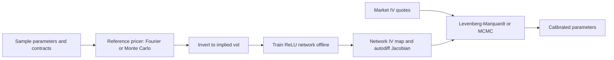

## Abstract

Rough volatility models reproduce the exploding short-maturity skew of equity implied volatility surfaces with three or four parameters, but their fractional driver is non-Markovian, so pricing falls back on Monte Carlo and calibration becomes prohibitively slow. Bayer and Stemper move that cost offline. They draw about one million synthetic samples of (model parameters, moneyness, maturity), label each with an implied volatility from the best reference pricer available, fit a fully connected ReLU network to the resulting map, and then run an unmodified Levenberg-Marquardt routine on the network, taking the Jacobian from automatic differentiation. One evaluation of implied volatility plus Jacobian takes about 36 ms on a 2015 laptop CPU for both Heston and rough Bergomi. Because the rough Bergomi parameters are not identifiable from a surface, the authors report MCMC posteriors rather than a fitted parameter vector: unimodal, centred at or near the reference values on synthetic data, and near previously published values on SPX quotes.

**Keywords:** rough volatility, rough Bergomi, Heston, model calibration, implied volatility map, neural network surrogate, Levenberg-Marquardt, Bayesian inference, parameter identifiability

## 1 Introduction

A pricing model earns its place on a desk only if it first reproduces the market prices of liquid vanillas. Those prices are quoted as Black-Scholes implied volatilities (IV) over log-moneyness $m = \log(K/S_0)$ and maturity $T$. The robust empirical feature of equity surfaces is that the at-the-money skew blows up as maturity shrinks; the paper quotes the law $|\partial_m \sigma_{iv}(m,T)| \sim T^{-0.4}$ as $T \to 0$. Diffusive two-factor models — Heston, SABR, Hull-White — predict a skew that flattens to a constant instead. Rough volatility models, in which the volatility driver has Hölder regularity below Brownian motion, produce the power law, and time-series evidence puts the regularity of log realised volatility near 0.1 (see [Rough volatility](/blog/volatility-is-rough/)).

The realism is paid for in compute. Fractional Brownian motion is not Markovian, so there is no low-dimensional PDE and no characteristic function; pricing means either an asymptotic expansion valid only in a limiting regime, or Monte Carlo. Calibration is a weighted non-linear least-squares problem solved by an iterative optimiser that evaluates the parameter-to-IV map and its derivatives over and over. <mark>With Monte Carlo inside the loop, each Levenberg-Marquardt iteration costs $N(m+1)$ simulation runs — one per quote for the residual, plus $m$ more per quote for a finite-difference Jacobian — before any rejected step is recomputed.</mark> Worse, those finite differences are taken on noisy output: a central difference with step $h$ divides Monte Carlo noise by $h$, so the Jacobian is the least reliable object in the loop precisely when it matters most.

The fix is a division of labour. Learn the forward map once, offline, at whatever accuracy the compute budget allows; then calibrate against the learned map with a classical optimiser. The paper contrasts this with Hernandez (2017), who trains a network to output calibrated parameters directly from market data — that is, to learn the whole calibration routine, weights and quote set included. Learning the forward map instead keeps the optimiser and its diagnostics under the user's control, and the surrogate survives a change of quote set.

## 2 Background

**Rough Bergomi.** With spot normalised to $S_0 = 1$ and rate $r = 0$, the asset $S$ and instantaneous variance $v$ follow

$$
\frac{dS_t}{S_t} = \sqrt{v_t}\; d\big(\rho W_t + \sqrt{1-\rho^2}\, W_t^{\perp}\big), \qquad
v_t = \xi_0(t)\,\exp\!\Big(\eta\, W_t^{H} - \tfrac{1}{2}\eta^2 t^{2H}\Big), \tag{1}
$$

where $W, W^\perp$ are independent Brownian motions, $\rho \in (-1,1)$ is the spot-volatility correlation, $\eta > 0$ the volatility of variance, $\xi_0(t) = \mathbb{E}(v_t)$ the forward variance curve recovered from market data, and $W^H_t = \sqrt{2H}\int_0^t (t-s)^{H-1/2}\,dW_s$ a Riemann-Liouville fractional Brownian motion with locally $(H-\varepsilon)$-Hölder paths. The compensator $-\tfrac12\eta^2 t^{2H}$ is what makes $v$ lognormal with mean exactly $\xi_0(t)$. The paper's model parameters are $\mu = (H,\eta,\rho)$ with market input $\xi = \xi_0$; the experiments take a flat curve $\xi_0 \equiv v_0$ and promote $v_0$ to a fourth parameter. Heston, with $\mu = (\lambda, \bar v, v_0, \rho, \eta)$ and no market input, is the control case because a fast Fourier pricer exists for it.

**The IV map.** Given $\mu$, $\xi$ and a contract $(M,T)$ with moneyness $M = K/S_0$, the model price is inverted through Black-Scholes to the volatility matching it; $\varphi : (\mu,\xi,M,T) \mapsto \sigma_{iv}$ is the implied volatility map. It is the only object a calibrator ever touches, which is why it is the right thing to learn. [Deep Learning Volatility](/blog/deep-learning-volatility/) makes the opposite architectural choice for the same map, emitting a whole grid of IVs at once rather than one contract at a time.

## 3 Method

> **Key idea.** Calibration is slow because the forward map is slow, not because the optimiser is bad. Replace $\varphi$ by a network $\varphi_{NN}$ trained offline on synthetic data, keep Levenberg-Marquardt exactly as it is, and take the Jacobian from automatic differentiation.



### 3.1 The objective, and where the cost sits

Given $N$ market quotes $Q \in \mathbb{R}^N$ and model quotes $\varphi(\mu,\xi)$ for the same contracts, the residual is $R(\mu) = \varphi(\mu,\xi) - Q$ and calibration solves

$$
\mu^\star = \arg\min_{\mu \in \mathcal{M}}\; \big\| W^{1/2} R(\mu) \big\|_2^2 , \tag{2}
$$

with $W = \mathrm{diag}[w_1,\dots,w_N]$ a diagonal weight matrix, typically liquidity weights. With $N > m$ this is an overdetermined non-linear least-squares problem, and Levenberg-Marquardt computes the step $\Delta\mu$ from the damped normal equations

$$
\big[J(\mu_k)^\top W J(\mu_k) + \lambda I_m\big]\,\Delta\mu = J(\mu_k)^\top W R(\mu_k), \tag{3}
$$

where $J_{ij} = \partial \varphi_i(\mu,\xi)/\partial\mu_j$ and $\lambda$ interpolates between Gauss-Newton ($\lambda \to 0$) and small-step gradient descent ($\lambda \to \infty$). The paper's Algorithm 1 accepts a step when the realised improvement in $\|R\|_2$, relative to the improvement the linearised model predicted, exceeds $\beta_1$, and halves $\lambda$; it rejects and doubles $\lambda$ when that ratio falls below $\beta_0$. Two things about (3) as printed are worth flagging before reproducing it. <mark>The right-hand side is missing a minus sign: with $\Delta\mu$ from (3) and the update $\mu \leftarrow \mu + \Delta\mu$, the iteration moves along $+J^\top W R$ and increases the objective</mark>; the Gauss-Newton step is $\Delta\mu = -[J^\top W J + \lambda I]^{-1} J^\top W R$. And the accept/reject test leaves a gap: for $\beta_0 < c_\mu < \beta_1$ nothing is accepted, nothing is rejected and $\lambda$ is unchanged, so the next line recomputes the same step from the same point. Both are transcription slips rather than errors of substance, but a reimplementation copying them will not converge.

Every iteration needs $\varphi$ and $J$ at all $N$ contracts. That is the whole cost, and it is what the surrogate removes.

### 3.2 The substitution, and what is exact in it

The method replaces $\varphi$ by $\varphi_{NN}$ everywhere in (3). The accounting matters:

- **Exact.** The Levenberg-Marquardt algebra is untouched, and the Jacobian $J_{NN}$ of the *surrogate* is exact to machine precision, because reverse-mode automatic differentiation differentiates the same graph the forward pass evaluates. <mark>No finite differences appear anywhere in the calibration loop, which removes the step-size dilemma entirely.</mark>
- **Approximate, measured.** $\varphi_{NN} \approx \tilde\varphi$, the reference pricer: the training error, reported on a held-out test set.
- **Approximate, unmeasured.** $\tilde\varphi \approx \varphi$. For Heston the Fourier pricer is accurate enough to ignore; for rough Bergomi $\tilde\varphi$ is itself a Monte Carlo estimate with bias and noise. The error that matters obeys $\|\varphi_{NN} - \varphi\|_\infty \le \|\varphi_{NN} - \tilde\varphi\|_\infty + \|\tilde\varphi - \varphi\|_\infty$, and only the first term is ever quantified. The Jacobian inherits the same split.

### 3.3 Designing the training distribution

Since the data is synthetic, the sampling distribution $G$ is a free design variable. It factorises as marginals over model parameters, times a distribution over market inputs, times a joint density over contracts,

$$
G_{\text{rBergomi}} = \mathcal{N}^{\otimes m}_{\text{trunc}}[a_i,b_i,\lambda_i,\sigma_i] \otimes K_\xi \otimes K_{(M,T)}, \tag{4}
$$

with uniform marginals in place of truncated normals for Heston, where no prior knowledge is assumed. The contract density $K_{(M,T)}$ is the interesting part: <mark>it is a Gaussian kernel density estimate over traded SPX contracts, weighted by inverse bid-ask spreads, so the network sees more samples exactly where the calibration objective (2) puts more weight.</mark> This is importance sampling of the training set towards the loss rather than towards the data — capacity is spent where errors will be measured.

Because labels carry Monte Carlo noise, $\tilde\varphi(\cdot) = \varphi(\cdot) + \varepsilon$ with $\mathbb{E}[\varepsilon] = 0$, $\mathrm{Var}[\varepsilon] = \sigma^2$, and the objective decomposes as

$$
\big\|f(X) - \tilde\varphi(X)\big\|^2_{L^2} = \big(\mathbb{E}[f(X) - \varphi(X)]\big)^2 + \mathrm{Var}[f(X)] + \sigma^2 . \tag{5}
$$

Only the bias and variance terms respond to training; $\sigma^2$ is a floor set by the label generator. That is the quantitative reason to spend the compute budget on accurate labels rather than on more of them, and also why the reported rough Bergomi errors cannot be read as pure network error.

> **My comment.** I used exactly this subtraction in roughvol-lab. The surrogate's test RMSE was 2.29 bp of volatility, the held-out targets themselves carried 2.15 bp of Monte Carlo noise, and only 0.81 bp was left for the network. Generating the held-out surfaces at ten times the training paths is what made the floor measurable, and I would ask for the same here before reading 4.42% as network error.

### 3.4 Intuition: the parameters are not identifiable

The most useful limiting case in the paper is not about the network at all. For rough stochastic volatility models a short-time expansion gives

$$
\sigma_{iv}\big(e^{k_t}, t\big) = \sqrt{v_0} + \tfrac{1}{2}\,\rho\,\eta\, C(H)\, k_t\, t^{\beta} + O(t), \qquad k_t = k\,t^{1/2 - H + \beta}, \tag{6}
$$

for a scaling exponent $\beta$ in the range where the expansion is valid and $C(H)$ a constant depending on $H$. Read the terms: $\sqrt{v_0}$ fixes the level of the smile, the product $\rho\eta$ fixes the slope, and $H$ enters only through $C(H)$ and the rate at which the moneyness window shrinks. <mark>At leading order $\rho$ and $\eta$ appear only as their product, so a decrease in $|\rho|$ offset by an increase in $\eta$ gives the same surface.</mark> Computing a distance between true and calibrated parameter vectors is therefore meaningless, and the authors say so.

The paper's own posteriors confirm it numerically. On synthetic data generated at $\rho = -0.9$, $\eta = 1.9$, the posterior medians are $-0.855$ and $2.041$ — individually 5% and 7% off — yet $\rho\eta = -1.745$ against a true $-1.71$, a 2% gap. The combination the surface pins down is recovered about three times more accurately than either factor.

> **My comment.** My own synthetic-to-synthetic recovery in roughvol-lab did not show a ridge this strong: over 2,000 held-out surfaces the mean absolute errors were 0.0033 for $\eta$ and 0.0013 for $\rho$. My surface runs out to two years, and (6) is a short-maturity statement, so I suspect the longer maturities break the $\rho\eta$ product. I have not tested that, and a point-estimate MAE is not a posterior, so this is a question to check rather than a disagreement.

### 3.5 Algorithm

```text
OFFLINE (once per model)
  1. estimate K_{(M,T)} by weighted KDE on traded SPX contracts,
     weights = inverse bid-ask spread
  2. for i = 1..n:  draw (mu_i, xi_i, M_i, T_i) ~ G
                    price with reference pricer; invert to IV -> y_i
  3. shuffle, split into train / valid / test
  4. standardise inputs with TRAIN mean and sd; apply to all three splits
  5. train 4 x 4096 ReLU net on MSE with Adam; early stopping on valid
     outer loop: propose (learning rate, batch size) by GP Bayesian
     optimisation (Matern kernel, LCB acquisition), retrain, score on valid
  6. save weights

ONLINE (per calibration)
  given quotes Q, weights W, start mu_0, damping lam, tolerance eps_tol
  repeat until ||d_mu|| < eps_tol or n = n_max:
      s     = phi_NN(mu, xi, contracts)          # one forward pass
      Jnn   = autodiff of s w.r.t. mu            # exact for the surrogate
      R     = s - Q
      solve (Jnn^T W Jnn + lam I) d_mu = -Jnn^T W R
      c     = (||R|| - ||R(mu + d_mu)||) / (||R|| - ||R + Jnn d_mu||)
      if c >= beta_1:  mu <- mu + d_mu;  lam <- lam / 2
      elif c <= beta_0: lam <- 2 lam
      else:             lam <- 2 lam             # gap in the printed version
```

For the uncertainty study the online loop is replaced by MCMC on the posterior $p(\mu \mid y) \propto p(y \mid \mu)\,p(\mu)$, with a Gaussian likelihood on (optionally liquidity-weighted) residuals of $\varphi_{NN}$ and the sampling distribution (4) reused as the prior.

## 4 Implementation notes

| Item | Heston | Rough Bergomi |
|---|---|---|
| Reference pricer | QuantLib Fourier | improved McCrickerd-Pakkanen Monte Carlo |
| IV inversion | Jäckel, *Let's be rational* | same |
| Samples (train / valid / test) | 990,000 (900,000 / 45,000 / 45,000) | 1,000,000 (90% / 5% / 5%) |
| Contract domain | $-0.1 \le m \le 0.28$, $1/365 \le T \le 0.2$ | $-3.163 \le m \le 0.391$, $0.008 \le T \le 2.589$ |
| SPX date for the contract KDE | 15 Feb 2018 | 19 May 2017 |
| Network | 4 hidden layers $\times$ 4096 ReLU, linear output | same |
| Initialisation | He: $w \sim \mathcal{N}(0, 2/n_{l-1})$, $b = 0$ | same |
| Input scaling | standardised with training mean and sd | same |
| Optimiser | Adam; learning rate and batch size by GP Bayesian optimisation | same |
| Regularisation | early stopping only; batch norm tried and rejected | same |
| Epochs, learning rate, batch size (values) | not stated | not stated |
| Hardware | CPU-only server for training; timings on an early-2015 MacBook, 2.9 GHz i5, no GPU | same |

Parameter priors (the paper's Table 1), with $\mathcal{N}_{\text{tr}}[a,b,\text{mean},\text{sd}]$ a truncated normal:

| Heston | Prior | Rough Bergomi | Prior |
|---|---|---|---|
| $\eta$ | $U[0,5]$ | $\eta$ | $\mathcal{N}_{\text{tr}}[1,4,2.5,0.5]$ |
| $\rho$ | $U[-1,0]$ | $\rho$ | $\mathcal{N}_{\text{tr}}[-1,-0.5,-0.95,0.2]$ |
| $\lambda$ | $U[0,10]$ | $H$ | $\mathcal{N}_{\text{tr}}[0.01,0.5,0.07,0.05]$ |
| $\bar v$, $v_0$ | $U[0,1]$ each | $v_0$ | $\mathcal{N}_{\text{tr}}[0.05,1,0.3,0.1]^{2}$ |

Details that are easy to get wrong. Validation and test inputs must be standardised with the *training* statistics, not their own. The rough Bergomi prior on $v_0$ is the **square** of a truncated normal. Batch normalisation was tried and switched off, its regularising effect costing expressiveness — what one should expect for a low-noise regression that is not overfitting. And since the network consumes standardised inputs, the autodiff Jacobian comes out in standardised units and must be divided componentwise by the training standard deviations before it enters (3); the paper does not mention this. The $4 \times 4096$ shape is not the outcome of a search: more than four layers did not consistently improve validation error, and 4096 was the local hardware ceiling.

## 5 Experiments

**Setup.** Accuracy is the relative error of $\varphi_{NN}$ against the reference pricer $\tilde\varphi$ on the held-out test set, with both model and contract parameters varying. For the surface plots and the skew plots, model parameters are fixed at the reference values of the paper's Table 2: Heston $(\eta,\rho,\lambda,\bar v,v_0) = (0.3877, -0.7165, 1.3253, 0.0354, 0.0174)$ from Gatheral (2011); rough Bergomi $(\eta,\rho,H,v_0) = (1.9, -0.9, 0.07, 0.01)$ from Bayer, Friz and Gatheral (2016).

| Model | Reference pricer | RE 90% quantile | RE 95% quantile | RE 99% quantile | IV + Jacobian |
|---|---|---|---|---|---|
| **Heston** | Fourier (QuantLib) | **2.30%** | **3.74%** | **8.64%** | about 36 ms |
| Rough Bergomi | Monte Carlo | 4.42% | 6.00% | 10.78% | about 36 ms |

Quantiles are those printed on the test-set histograms in [Fig. 4a](https://arxiv.org/pdf/1810.03399#page=15) and [Fig. 5a](https://arxiv.org/pdf/1810.03399#page=17). Rough Bergomi is harder, which the authors attribute to the complexity of a non-Markovian model; part of the gap is that its labels are noisy while Heston's are not. Heatmaps at fixed reference parameters show small errors over the liquid core and larger ones at the very short and very long ends, where the sampler drew few points. <mark>The rough Bergomi surrogate reproduces the power-law blow-up of the short-maturity ATM skew and the Heston surrogate reproduces the flat one</mark>, and the skew panels plot three agreeing curves: finite differences on the reference pricer, finite differences on the network, and the network's autodiff derivative.

**Bayesian calibration.** Posterior summaries from the corner plots in [Fig. 6](https://arxiv.org/pdf/1810.03399#page=19) (median, with the 2.5% and 97.5% quantiles):

| Parameter | Reference value | Synthetic surface (unweighted) | SPX 19 May 2017 (liquidity-weighted) |
|---|---|---|---|
| $v_0$ | 0.01 | **0.010** [0.009, 0.011] | 0.017 [0.016, 0.018] |
| $H$ | 0.07 | **0.069** [0.057, 0.084] | 0.094 [0.086, 0.101] |
| $\eta$ | 1.9 | 2.041 [1.924, 2.175] | 2.346 [2.271, 2.445] |
| $\rho$ | $-0.9$ | $-0.855$ [$-0.921$, $-0.801$] | $-0.906$ [$-0.927$, $-0.887$] |

For the SPX run, quotes with relative spread $s_i/m_i \ge 5\%$ are discarded and the remaining weights are $w_i = m_i/(a_i - m_i)$, that is, twice the reciprocal of the relative spread.

**Claim by claim.**

1. *Evaluation is fast enough for calibration.* Measured, but thinly reported: one number, 36 ms for IV and Jacobian together, with no spread, no dependence on contracts per call and — as the authors state — no comparison against existing pricers. The introduction says "about 40ms" where Section 5 says "about 36ms".
2. *The surrogate is accurate.* Supported for Heston, where the reference is essentially exact. For rough Bergomi the reference is itself Monte Carlo, so the errors mix network error with label noise in unknown proportion: by (5) the noise inflates them, so the network may be better than the table says, while label bias stays invisible either way.
3. *The surrogate learns each model's qualitative signature.* Supported, and the most convincing evidence here: a network that had merely memorised a cloud of points would not reproduce the short-maturity skew asymptotics of two different models.
4. *The parameters are not identifiable, so report posteriors.* Supported by (6), by the diagonal level sets in the $(\eta,H)$ and $(\eta,\rho)$ pair plots, and by the $\rho\eta$ arithmetic above.
5. *The posterior peaks at or close to the true values.* Partly. $v_0$ and $H$ land on the reference values and $\rho$ contains $-0.9$, but <mark>the 95% interval for $\eta$, $[1.924, 2.175]$, excludes the true $1.9$</mark> — consistent with the $\eta$ prior centred at 2.5 pulling upward, which matters because that prior is the sampling distribution. On SPX the agreement with Bayer, Friz and Gatheral (2016) is looser still: $H = 0.094$ against 0.07, $\eta = 2.35$ against 1.9, so $\rho\eta = -2.13$ against $-1.71$ — 25% apart in the one combination the surface should determine sharply.
6. *Deep calibration, i.e. Algorithm 1, works.* Not shown. <mark>No Levenberg-Marquardt run is reported anywhere: no iteration counts, no calibration times, no fitted-surface residuals.</mark> The empirical case rests entirely on surrogate accuracy and MCMC.

## 6 Limitations

**Stated by the authors.**
- No systematic comparison of speed or accuracy against existing methods; left to future research.
- The IV map is non-injective in the model parameters over large parts of the domain, so parameter-space error metrics are meaningless.
- Depth beyond four layers made training unstable rather than better and width was capped by hardware, so the architecture is not optimised; activations other than ReLU were not compared.
- Relative errors rise at the short and long maturity ends, attributed to fewer training samples there.
- Extending the Hernandez-style inverse map to equity models would need an architecture that consumes IV point clouds, e.g. a CNN; not attempted.

**My reading.**
- The forward variance curve is flat, $\xi_0 \equiv v_0$, which removes the very market input that lets rough Bergomi fit a real term structure — and it is the part of the design that does not scale, since a curve discretised at $k$ tenors adds $k$ input dimensions.
- The surrogate consumes one contract at a time, so nothing enforces smoothness or static no-arbitrage across the surface; the paper's own surface plots are stitched by a Delaunay triangulation it describes as not necessarily arbitrage-free.
- A 99% relative-error quantile of 9–11% is large next to a typical bid-ask spread, and since errors are quoted against the reference pricer it is a lower bound on the error that matters.
- <mark>The liquidity weighting is applied only to contracts.</mark> Heston parameters come from a uniform box with $\eta$ up to 5 and $\lambda$ up to 10 and no Feller condition $2\lambda\bar v > \eta^2$, so much of the budget trains regions no desk would calibrate to. Half the input space is importance-sampled and the other half is not.
- The rough Bergomi domain reaches $m = -3.163$, a strike near 4% of spot, where Monte Carlo IVs are extremely noisy; the heatmap's moneyness axis jumps from $-3.16$ straight to $-0.73$, so that stretch holds almost nothing.
- Nothing is held out across time: contract density and test set come from the same day, so the accuracy figures say nothing about a market whose liquid region has moved.
- Equation (3) as printed has the wrong sign and Algorithm 1 has an unhandled middle branch (§3.1).

## 7 Extensions

**What was built on this.** [Deep Learning Volatility](/blog/deep-learning-volatility/) takes the same offline-surrogate idea and changes two things that matter: the network outputs a whole IV grid at once, which couples neighbouring contracts, and the parameter set includes a piecewise-constant forward variance curve. A direct successor by an overlapping author group is Bayer, Horvath, Muguruza, Stemper and Tomas, *On deep calibration of (rough) stochastic volatility models* (arXiv:1908.08806, 2019). [Neural SDEs](/blog/neural-sde-pricing-hedging/) (arXiv:2007.04154) cites this paper and inverts the premise: instead of learning a surrogate for a fixed parametric model, it makes the model's own coefficients networks and calibrates them directly. Sig-SDE removes the Monte Carlo step algebraically rather than statistically, and [Deep Hedging](/blog/deep-hedging/) shows what one does with a fast, differentiable simulator once one has it.

**Open problems.**
- The two-stage error budget is never closed: the error against the reference pricer is measured, the reference pricer's own error is not, and no result relates surrogate error to calibrated-parameter error.
- Arbitrage-free surrogates. Nothing in a pointwise regression prevents the learned surface from admitting calendar or butterfly arbitrage.
- Amortisation across market inputs. Each forward variance curve shape, liquid region or model variant needs a fresh million-sample dataset and a fresh training run.
- Algorithm 1 itself remains unbenchmarked, which is odd given that it names the paper.

**Research directions.** *These are ideas, not results — none has been run.*

1. **Noise-aware label weighting.** *Hypothesis:* since each rough Bergomi label carries a Monte Carlo standard error that is computable at generation time, weighting the MSE by its reciprocal should improve test accuracy at fixed compute more than adding samples does, because by (5) the deep-OTM short-maturity labels contribute mostly $\sigma^2$. *Data:* the same synthetic generator, with per-label standard errors retained. *Baseline:* unweighted MSE at equal sample count and equal label compute. *Metric:* relative-error quantiles restricted to the liquid region, plus calibrated-posterior width. *Failure mode:* the weights concentrate training on easy near-the-money contracts and the wings degrade further.
2. **Surface-output surrogate with no-arbitrage penalties.** *Hypothesis:* predicting a fixed IV grid and adding penalties for negative butterfly and calendar spreads yields a surrogate whose calibrated surfaces are arbitrage-free at no accuracy cost. *Data:* the paper's rough Bergomi generator on a fixed $(m,T)$ grid. *Baseline:* the pointwise $4 \times 4096$ network of this paper, evaluated on the same grid. *Metric:* fraction of predicted surfaces with an arbitrage violation, plus grid RMSE. *Failure mode:* the penalties fight the data where the reference pricer itself produces slightly inconsistent prices, and the fit degrades without the violations disappearing.
3. **Differentiable summaries for a rough path generator.** *Hypothesis:* the same offline-surrogate pattern transfers to generative modelling of financial paths — train a network mapping simulator parameters, including a roughness exponent, to a vector of path statistics (realised-variance scaling exponents, autocorrelations, tail quantiles), then fit the simulator to observed statistics by gradient descent through the surrogate instead of by moment matching. *Data:* simulated rough paths for training the surrogate, index returns for the target statistics. *Baseline:* direct moment matching with finite-difference gradients, and a GAN-style discriminator as in [Quant GANs](/blog/quant-gans/). *Metric:* recovery of known parameters on simulated data, then held-out scenario calibration quality on real returns. *Failure mode:* the same non-identifiability as here — several parameter combinations reproduce the summary vector, so the fit must again be reported as a posterior rather than a point.

## 8 Takeaways

- Moving the expensive map offline converts rough Bergomi calibration into repeated forward passes of a fixed network: about 36 ms for implied volatility and Jacobian together on a 2015 laptop CPU, for both Heston and rough Bergomi.
- Learning the forward map rather than the inverse one keeps the optimiser, the weights and the diagnostics under the user's control, and keeps the surrogate valid when the quote set changes.
- Autodiff eliminates finite differences from the calibration loop, which is a bigger practical gain than the raw speed: the Jacobian is exact for the surrogate rather than a noisy difference of Monte Carlo prices.
- Where you sample is a modelling decision. A liquidity-weighted contract density aligns training error with the calibration objective; leaving the model-parameter marginals unweighted leaves half that gain on the table.
- Rough Bergomi parameters trade off inside the IV surface — only $\rho\eta$ and $\sqrt{v_0}$ are sharply determined at short maturities — so posteriors, not point estimates, are the honest output. The paper's own posterior recovers $\rho\eta$ to 2% while missing $\rho$ and $\eta$ individually by 5-7%.
- The pipeline's weakest link is what it does not report: the calibration algorithm the paper is named after is never run end to end.

## References

1. C. Bayer, B. Stemper. *Deep calibration of rough stochastic volatility models.* arXiv:1810.03399, 2018.
2. J. Gatheral, T. Jaisson, M. Rosenbaum. *Volatility is rough.* Quantitative Finance, 2018 (arXiv:1410.3394).
3. C. Bayer, P. K. Friz, J. Gatheral. *Pricing under rough volatility.* Quantitative Finance, 2016.
4. C. Bayer, P. K. Friz, A. Gulisashvili, B. Horvath, B. Stemper. *Short-time near-the-money skew in rough fractional volatility models.* arXiv, 2017.
5. R. McCrickerd, M. S. Pakkanen. *Turbocharging Monte Carlo pricing for the rough Bergomi model.* Quantitative Finance, 2018.
6. A. Hernandez. *Model calibration with neural networks.* Risk, 2017.
7. P. Jäckel. *Let's be rational.* Wilmott, 2015.
