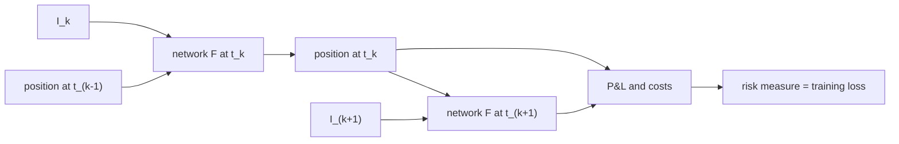

## Abstract

Buehler, Gonon, Teichmann and Wood replace the classical "compute Greeks in a complete-market model, then adjust by hand" workflow with a direct optimisation. A trading strategy is a sequence of neural networks that map market information and the previous position to new holdings; the networks are trained by stochastic gradient descent to minimise a convex risk measure of the terminal profit and loss, including transaction costs and trading constraints. The price of a derivative falls out as an indifference price: the cash that makes the hedged liability as acceptable as having no liability. The authors prove that the network strategies can approximate the optimal strategy arbitrarily well, and show in a simulated Heston market that the learned hedge reproduces the model hedge when there are no costs, adapts to risk aversion, recovers the known two-thirds power law of prices in the cost level, and scales to ten hedging instruments on a laptop.

**Keywords:** hedging, incomplete markets, convex risk measures, expected shortfall, indifference pricing, transaction costs, Heston model, neural network strategies

## 1 Introduction

Textbook hedging assumes a frictionless, complete market. There, every claim has a unique replicating strategy and a unique price, and both are linear in the book. Real desks face proportional and fixed costs, market impact, liquidity limits and capital limits. In that world replication fails, prices depend on the whole portfolio, and the trader overlays judgement on model Greeks.

The existing alternatives did not scale. Indifference pricing under proportional costs in even a Black-Scholes market leads to a multidimensional nonlinear free-boundary problem. Super-hedging under costs is degenerate in one dimension (the cheapest super-hedge of a call is the stock itself) and numerically intractable in many.

The paper's stance is that <mark>the modelling task should shrink to four ingredients: a scenario generator, a loss function, a description of frictions, and a list of tradable instruments</mark>. Everything else is optimisation. The method is "greek-free": no equivalent martingale measure is required, and no classical pricing model is ever used to value the liability.

## 2 Background

**Market.** Trading happens at dates $t_0 < \dots < t_n = T$ on a finite probability space. $I_k \in \mathbb{R}^r$ is the information arriving at $t_k$ (prices, signals, costs, limits), $S_k \in \mathbb{R}^d$ are mid-prices of $d$ hedging instruments, which may include liquid options, and $Z$ is the liability paid at $T$. A strategy $\delta = (\delta_k)$ holds $\delta_k$ units over $[t_k, t_{k+1})$, with $\delta_{-1} = \delta_n = 0$. Trading $n$ units at $t_k$ costs $c_k(n)$, for example $c_k(n) = \sum_i \varepsilon\, |n^i| S^i_k$ for proportional costs. Constraints are handled by a continuous map $H_k$ that projects an unconstrained action into the admissible set.

**Convex risk measures.** $\rho$ is monotone decreasing, convex, and cash-invariant, $\rho(X + c) = \rho(X) - c$, so $\rho(X)$ reads as the cash that makes position $X$ acceptable. Two members of the optimised-certainty-equivalent family matter here: the entropic measure $\rho(X) = \frac{1}{\lambda}\log \mathbb{E}[e^{-\lambda X}]$, which the authors show gives exactly the exponential-utility indifference price, and expected shortfall (CVaR), which corresponds to the loss $\ell(x) = \max(x,0)/(1-\alpha)$.

## 3 Method

> **Key idea.** Do not solve for a price and differentiate it. Parametrise the hedge itself with neural networks, simulate paths, and minimise the risk of the terminal P&L by gradient descent. The price is a by-product of the optimal risk.

### 3.1 The objective

With an initial cash injection $p_0$, the terminal wealth is

$$
\mathrm{PL}_T(Z, p_0, \delta) = -Z + p_0 + \sum_{k=0}^{n-1} \delta_k \cdot (S_{k+1} - S_k) - \sum_{k=0}^{n} c_k(\delta_k - \delta_{k-1}). \tag{1}
$$

The hedging problem and the resulting indifference price are

$$
\pi(X) = \inf_{\delta \in \mathcal{H}} \rho\big(X + (\delta \cdot S)_T - C_T(\delta)\big), \qquad p(Z) = \pi(-Z) - \pi(0). \tag{2}
$$

Subtracting $\pi(0)$ matters: under the statistical measure some instruments may carry positive expected return, so doing nothing is not the right reference point. When costs and constraints are convex, $\pi$ is itself a convex risk measure, and <mark>with no frictions and an attainable claim, $p(Z)$ collapses to the replication price</mark>. If $S$ is a martingale, $p(Z) \ge \mathbb{E}[Z]$.

### 3.2 Semi-recurrent network strategies

Each trading date gets its own feed-forward network,

$$
\delta_k^\theta = F^{\theta_k}(I_0, \dots, I_k, \delta_{k-1}^\theta), \tag{3}
$$

and in Markovian settings $F^{\theta_k}(I_k, \delta_{k-1})$ suffices. The previous position is an input because, with costs, the best new position depends on where you already are.

Proposition 4.9 states that as network capacity $M$ grows, $\pi^M(X) \to \pi(X)$. The proof rests on Hornik's universal approximation theorem. <mark>The infinite-dimensional search over adapted strategies becomes a finite-dimensional search over weights, with a convergence guarantee in capacity</mark> (though not in optimisation).

### 3.3 Training

For an OCE measure the infimum over the auxiliary scalar $w$ is folded into the parameters, giving a plain expectation that mini-batch SGD can handle:

$$
J(\theta) = w + \mathbb{E}\big[\ell\big(Z - (\delta^{\bar\theta}\cdot S)_T + C_T(\delta^{\bar\theta}) - w\big)\big], \qquad \theta = (w, \bar\theta). \tag{4}
$$

For the entropic measure $w$ is unnecessary and one minimises $\mathbb{E}[\exp(-\lambda\, \mathrm{PL}_T)]$ directly. For general convex risk measures the authors use the robust representation $\rho(X) = \max_Q (\mathbb{E}_Q[-X] - \alpha(Q))$, parametrise the log-density of $Q$ with a second network, and obtain a min–max problem whose gradient still decomposes over samples. That part is stated and justified but not tested numerically.

## 4 Experiments

**Setup.** Horizon of 30 trading days, daily rebalancing. Paths come from a Heston model

$$
dS^1_t = \sqrt{V_t}\, S^1_t\, dB_t, \qquad dV_t = a(b - V_t)\,dt + \sigma\sqrt{V_t}\, dW_t, \tag{5}
$$

with mean-reversion speed $a = 1$, $b = 0.04$, correlation $-0.7$, $\sigma = 2$, $v_0 = 0.04$, $s_0 = 100$. The second instrument is an idealised variance swap, so $d = 2$ and continuous trading would replicate any European payoff. Networks have two hidden layers of $d + 15$ ReLU units with batch normalisation; Adam, learning rate 0.005, batch size 256, TensorFlow. The benchmark "model hedge" uses the Heston deltas at the risk-neutral price, computed with QuantLib. Evaluation is out of sample on $10^6$ fresh paths.

**No costs, at-the-money call.** The risk-neutral price is $q = 1.69$. The 50%-CVaR deep hedge charges 1.94 and its hedging-error histogram is nearly indistinguishable from the model hedge ([Fig. 2 in the paper](https://arxiv.org/pdf/1802.03042#page=24)); the learned delta surface over spot and variance matches the model delta to within a few hundredths ([Fig. 3](https://arxiv.org/pdf/1802.03042#page=24)). Moving to 99%-CVaR raises the price to 3.49. With both strategies charged only $q$:

| Training criterion | Mean loss | Realized 0.5-CVaR | Realized 0.99-CVaR |
|---|---|---|---|
| 0.5-CVaR | **0.1514** | **0.2531** | 2.3631 |
| 0.99-CVaR | 0.2635 | 0.527 | **1.8034** |

Each strategy wins on the criterion it was trained for. For a tight call spread (strikes 100 and 101) the risk-averse hedge flattens its delta, which the authors read as the trader's familiar barrier shift ([Figs. 8–9](https://arxiv.org/pdf/1802.03042#page=27)).

**Architecture under costs.** With proportional costs $\varepsilon = 0.01$ and the 99%-CVaR criterion, feeding back the previous position is no longer optional:

| Network | Mean loss | Price |
|---|---|---|
| **Recurrent (uses $\delta_{k-1}$)** | **0.0018** | **5.5137** |
| Simpler (no $\delta_{k-1}$) | 0.0022 | 6.7446 |

**Price asymptotics.** Theory for one-dimensional models says the exponential-utility indifference price satisfies $p_\varepsilon - p_0 = O(\varepsilon^{2/3})$. Using $\lambda = 1$ and $\varepsilon_i = 2^{-i+5}$, $i = 1,\dots,5$, the log-log fit gives a slope of 0.67 in Black-Scholes and <mark>0.71 in the two-instrument Heston market, a case for which the authors say no numerical or theoretical result existed</mark> ([Figs. 10–11](https://arxiv.org/pdf/1802.03042#page=29)).

**Scaling.** Five independent Heston models ($d = 10$), a sum of five calls, quadratic loss, $2\times10^5$ training steps, hidden width $12 n_H$. Training took 5.75 hours against 2.1 hours for a single model on a laptop; realized losses were 1.13 and 0.20. Since the decoupled optimum is at most five times the single-model loss, <mark>the ten-instrument solution is about as close to optimal as the two-instrument one</mark>.

## 5 Discussion

**Strengths.** The formulation is the contribution. Risk preference, costs, constraints and the instrument set are all inputs, and the same code handles a call under CVaR and a basket under quadratic loss. Indifference pricing, usually a PDE exercise, becomes two training runs. The approximation result is clean, and the experiments are chosen so that a known answer exists to check against.

**Weaknesses.** Everything is simulated, and simulated under a risk-neutral Heston measure; the claim of model independence is structural, not empirical. The quality of a deep hedge on real markets is bounded by the quality of the path generator, which the paper leaves open. The convergence statement concerns capacity only; nothing guarantees SGD finds the minimiser, and no seed variance or confidence intervals are reported. The min–max scheme for general risk measures, fixed costs, market impact and hard constraints are described but not run. The slope of 0.71 is a regression through five points, and the scaling test uses independent assets, the easiest high-dimensional case.

**Not shown.** Comparison with a cost-aware classical heuristic such as a no-trade band around delta, sensitivity to the number of training paths, and behaviour when the test dynamics differ from the training dynamics.

## 6 Takeaways

- Hedging under frictions can be posed as risk minimisation over parametrised strategies; the price is $\pi(-Z) - \pi(0)$, not an expectation under a calibrated measure.
- The previous position must be a network input once trading is costly; without costs a memoryless network is enough.
- The risk measure is a genuine control: CVaR level changes both the price (1.94 versus 3.49 here) and the shape of the hedge.
- The network is trained through the simulator, so the method is only as good as the scenario generator. This is the hook for generative models of financial time series: a diffusion or other stochastic path model that captures tails, volatility clustering and cross-asset dependence is precisely the missing "market simulator" input, and hedging P&L under a fixed risk measure is a more decision-relevant evaluation of such a generator than distributional distances alone.

## References

1. H. Buehler, L. Gonon, J. Teichmann, B. Wood. *Deep Hedging*. arXiv:1802.03042, 2018.
2. H. Föllmer, A. Schied. *Stochastic Finance: An Introduction in Discrete Time*. De Gruyter, 2016.
3. A. E. Whalley, P. Wilmott. *An asymptotic analysis of an optimal hedging model for option pricing with transaction costs*. Mathematical Finance, 1997.
4. K. Hornik. *Approximation capabilities of multilayer feedforward networks*. Neural Networks, 1991.
5. A. Ilhan, M. Jonsson, R. Sircar. *Optimal static-dynamic hedges for exotic options under convex risk measures*. Stochastic Processes and their Applications, 2009.
