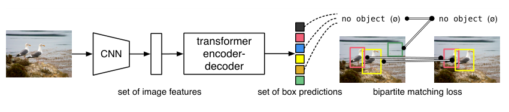
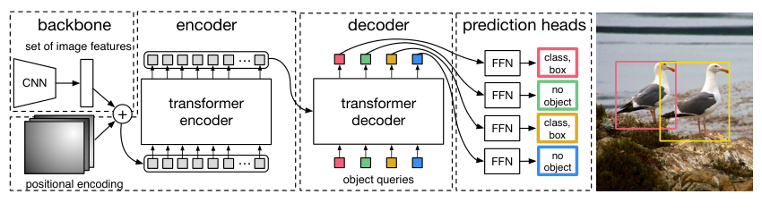
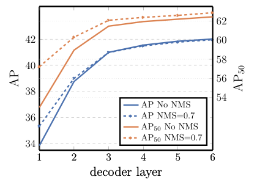

## Abstract

DETR treats object detection as the problem of predicting a *set* of (class, box) pairs in one shot, rather than as classification and regression over thousands of anchors or proposals. A CNN backbone feeds a transformer encoder-decoder; the decoder turns a small number of learned "object queries" into predictions in parallel, and a bipartite matching between predictions and ground truth defines the loss. Because each ground-truth object is assigned to exactly one prediction, duplicates are penalised during training and no non-maximum suppression is needed at test time. On COCO the model reaches the same accuracy as a carefully strengthened Faster R-CNN at similar parameter count, doing much better on large objects and clearly worse on small ones. The same model, with a light mask head, gives competitive panoptic segmentation. The price is a very long training schedule.

**Keywords:** object detection, set prediction, bipartite matching, Hungarian loss, transformer, object queries, panoptic segmentation

## 1 Introduction

A detector must output an unordered, variable-size collection of boxes with labels. Almost every detector before DETR approached this indirectly: tile the image with anchors, proposals or candidate centres, classify and refine each candidate, and then clean up the inevitable near-duplicates with non-maximum suppression (NMS). Each of these steps injects hand-designed prior knowledge, and the paper points out that final accuracy depends strongly on exactly how those initial guesses and assignment rules are configured.

The authors ask whether detection can instead be trained end to end, the way machine translation or speech recognition are. Earlier attempts at direct set prediction for detection existed, but they relied on recurrent, autoregressive decoders and were only validated on small datasets, never against a strong modern baseline. DETR's claim is that two ingredients, used together, close the gap: <mark>a loss built on a one-to-one matching between predictions and ground truth, and a transformer that decodes all objects in parallel</mark>.

*Source: Carion et al., arXiv:2005.12872, Fig. 1, CC0 1.0.*

## 2 Background

**Set prediction.** A loss for set-valued outputs must not depend on the order in which predictions are emitted, and it must discourage duplicates. The standard recipe is to find the minimum-cost assignment between predicted and target elements with the Hungarian algorithm and compute the loss along that assignment. This yields permutation invariance and guarantees that every target has a unique partner.

**Transformers and parallel decoding.** Self-attention lets every element of a sequence interact with every other one, which is precisely what is needed for outputs to "know about" each other and avoid predicting the same object twice. The original transformer generates tokens one at a time; DETR borrows the non-autoregressive variant, where all outputs are produced simultaneously. Since the matching loss does not care about output order, there is no reason to decode sequentially.

**Conventional detectors.** Two-stage models (Faster R-CNN) predict boxes relative to proposals; single-stage models predict relative to anchors or grid centres. Both use many-to-one assignment rules plus NMS. DETR instead predicts absolute box coordinates with respect to the whole image.

## 3 Method

> **Key idea.** Give the network $N$ output slots, force a one-to-one assignment between slots and ground-truth objects with the Hungarian algorithm, and let self-attention among the slots sort out who predicts what. Duplicate removal becomes something the model *learns*, not a post-processing rule.

### 3.1 Bipartite matching

DETR always outputs $N$ predictions, with $N$ chosen well above the number of objects an image typically contains. The ground-truth set $y$ is padded with a special "no object" label $\varnothing$ up to size $N$. Writing $y_i = (c_i, b_i)$ for the class and the normalised box (centre, height, width in $[0,1]^4$) of target $i$, the first step is to find the permutation of predictions with the lowest total cost:

$$
\hat{\sigma} = \arg\min_{\sigma \in \mathfrak{S}_N} \sum_{i=1}^{N} \mathcal{L}_{\text{match}}\big(y_i, \hat{y}_{\sigma(i)}\big) \tag{1}
$$

where $\mathfrak{S}_N$ is the set of permutations of $N$ elements and $\hat{y}_{\sigma(i)}$ is the prediction assigned to target $i$. The pairwise cost combines class confidence and box agreement, and is only non-trivial for real objects:

$$
\mathcal{L}_{\text{match}}\big(y_i, \hat{y}_{\sigma(i)}\big) = -\mathbb{1}_{\{c_i \neq \varnothing\}}\, \hat{p}_{\sigma(i)}(c_i) + \mathbb{1}_{\{c_i \neq \varnothing\}}\, \mathcal{L}_{\text{box}}\big(b_i, \hat{b}_{\sigma(i)}\big) \tag{2}
$$

Here $\hat{p}_{\sigma(i)}(c_i)$ is the probability the assigned prediction gives to the correct class and $\hat{b}_{\sigma(i)}$ is its box. The authors use raw probabilities rather than log-probabilities in the matching cost so that the class term lives on the same scale as the box term, and report that this worked better empirically. This matching plays the role that heuristic anchor/proposal assignment plays in older detectors, except that it is strictly one-to-one.

### 3.2 Hungarian loss

Given $\hat{\sigma}$, the training loss is a sum over matched pairs of a negative log-likelihood and the box loss:

$$
\mathcal{L}_{\text{Hungarian}}(y,\hat{y}) = \sum_{i=1}^{N} \Big[ -\log \hat{p}_{\hat{\sigma}(i)}(c_i) + \mathbb{1}_{\{c_i \neq \varnothing\}}\, \mathcal{L}_{\text{box}}\big(b_i, \hat{b}_{\hat{\sigma}(i)}\big) \Big] \tag{3}
$$

Because most slots are matched to $\varnothing$, the log-probability term for those slots is down-weighted by a factor of 10, which mirrors the positive/negative balancing of two-stage detectors.

Since boxes are regressed directly rather than as offsets from an anchor, a plain $\ell_1$ penalty would weight large boxes more than small ones for the same relative error. The box loss therefore mixes $\ell_1$ with the scale-invariant generalised IoU:

$$
\mathcal{L}_{\text{box}}\big(b_i, \hat{b}_{\sigma(i)}\big) = \lambda_{\text{iou}}\, \mathcal{L}_{\text{iou}}\big(b_i, \hat{b}_{\sigma(i)}\big) + \lambda_{L1}\, \big\lVert b_i - \hat{b}_{\sigma(i)} \big\rVert_1 \tag{4}
$$

with $\lambda_{\text{iou}}, \lambda_{L1}$ scalar hyperparameters, and both terms normalised by the number of objects in the batch.

### 3.3 Architecture

*Source: Carion et al., arXiv:2005.12872, Fig. 2, CC0 1.0.*

- **Backbone.** A ResNet maps the image to a feature map with $C = 2048$ channels at $1/32$ of the input resolution.
- **Encoder.** A $1\times1$ convolution reduces the channels to $d$; the map is flattened into a sequence of $HW$ tokens. Fixed positional encodings are added at *every* attention layer, since attention itself is permutation-invariant.
- **Decoder.** The inputs are $N$ learned embeddings, the *object queries*. They must differ from each other, otherwise a permutation-invariant decoder would give $N$ identical outputs. Through self-attention the queries negotiate among themselves; through cross-attention they read the image. All $N$ are decoded in parallel.
- **Heads.** A 3-layer MLP predicts the normalised box and a linear layer predicts the class (including $\varnothing$).
- **Auxiliary losses.** The shared heads and the Hungarian loss are applied after every decoder layer, which the authors found helps the model output the right number of objects per class.

The authors stress that there are no custom layers: inference fits in under 50 lines of PyTorch.

## 4 Experiments

**Setup.** COCO 2017 (118k training, 5k validation images; on average 7 instances per image, at most 63). AdamW, learning rate $10^{-4}$ for the transformer and $10^{-5}$ for the ImageNet-pretrained backbone, scale and random-crop augmentation, dropout 0.1. The comparison models use 6 encoder and 6 decoder layers of width 256 with 8 heads; the slot visualisation in the paper is for $N = 100$. The Faster R-CNN comparison uses a 500-epoch schedule; the 300-epoch ablation schedule takes 3 days on 16 V100 GPUs. The "DC5" variants dilate the last ResNet stage to double feature resolution, at roughly twice the total compute. Faster R-CNN baselines marked "+" were strengthened by the authors with GIoU loss, the same crop augmentation and a 9x schedule.

| Model | GFLOPS / FPS | #params | AP | AP50 | AP75 | APS | APM | APL |
|---|---|---|---|---|---|---|---|---|
| Faster RCNN-DC5 | 320 / 16 | 166M | 39.0 | 60.5 | 42.3 | 21.4 | 43.5 | 52.5 |
| Faster RCNN-FPN | 180 / 26 | 42M | 40.2 | 61.0 | 43.8 | 24.2 | 43.5 | 52.0 |
| Faster RCNN-R101-FPN | 246 / 20 | 60M | 42.0 | 62.5 | 45.9 | 25.2 | 45.6 | 54.6 |
| Faster RCNN-DC5+ | 320 / 16 | 166M | 41.1 | 61.4 | 44.3 | 22.9 | 45.9 | 55.0 |
| Faster RCNN-FPN+ | 180 / 26 | 42M | 42.0 | 62.1 | 45.5 | 26.6 | 45.4 | 53.4 |
| Faster RCNN-R101-FPN+ | 246 / 20 | 60M | 44.0 | 63.9 | 47.8 | 27.2 | 48.1 | 56.0 |
| DETR | 86 / 28 | 41M | 42.0 | 62.4 | 44.2 | 20.5 | 45.8 | 61.1 |
| DETR-DC5 | 187 / 12 | 41M | 43.3 | 63.1 | 45.9 | 22.5 | 47.3 | 61.1 |
| DETR-R101 | 152 / 20 | 60M | 43.5 | 63.8 | 46.4 | 21.9 | 48.0 | 61.8 |
| **DETR-DC5-R101** | 253 / 10 | 60M | **44.9** | **64.7** | 47.7 | 23.7 | **49.5** | **62.3** |

*COCO validation, retyped from Table 1 of the paper.*

At matched parameter count (about 41M), <mark>DETR ties Faster R-CNN-FPN+ at 42.0 AP, but the composition differs sharply: +7.7 APL and −6.1 APS</mark> by the table above (the paper's text quotes +7.8 and −5.5). The authors attribute the large-object gain to global attention and the small-object deficit to the single coarse feature map.

**Ablations** (ResNet-50, 300 epochs, 40.6 AP baseline):

- Removing the encoder entirely costs 3.9 AP overall and 6.0 APL; encoder attention maps already separate individual instances.
- <mark>AP improves after every decoder layer, by +8.2 AP (+9.5 AP50) from the first to the last.</mark> NMS helps only after the first layer, where queries have not yet communicated; by the last layers it slightly *hurts* by removing true positives.
- Dropping the FFN sub-layers loses 2.3 AP. Removing all spatial positional encodings loses 7.8 AP, yet the model still exceeds 32 AP.
- Loss: class + GIoU alone is only 0.7 AP below the full loss, while class + $\ell_1$ alone is 4.8 AP below (35.8 AP).

*Source: Carion et al., arXiv:2005.12872, Fig. 4, CC0 1.0.*

**Generalisation.** No training image contains more than 13 giraffes, yet DETR finds all 24 in a synthetic test image, which suggests that individual queries do not specialise by class. Slot visualisations show that each query instead specialises in image regions and box sizes.

**Panoptic segmentation.** A mask head computes attention maps between each decoder output and the encoder features, upsamples them with an FPN-style network, and merges masks by a pixel-wise argmax, so overlaps are impossible by construction. DETR-R101 reaches 45.1 PQ on COCO val against 44.1 for the authors' retrained PanopticFPN++ with the same backbone; the advantage is concentrated on "stuff" classes (PQst 37.0 vs 33.6), while mask AP on "things" is considerably lower than the baselines (33.0 vs 39.7).

## 5 Discussion

**Strengths.** The pipeline is conceptually minimal: no anchors, no proposals, no NMS, and no bespoke operators. The decoder-depth/NMS experiment is a neat piece of evidence that duplicate suppression really is learned by query self-attention rather than being an accident. <mark>The same architecture extends to panoptic segmentation with only a mask head trained for 25 epochs on top of a frozen DETR.</mark> The baseline comparison is fair-minded: the authors go out of their way to give Faster R-CNN the same loss, augmentation and a longer schedule.

**Weaknesses.** <mark>Training is slow: 500 epochs against 109 for the strengthened baseline</mark>, and even the short ablation schedule is 300 epochs. Small-object accuracy is clearly behind, and the fix the paper offers (DC5) makes encoder self-attention 16 times more expensive. At inference the authors replace each "no object" slot by its second-best class to gain 2 AP, which is an evaluation-specific trick that somewhat undercuts the "no post-processing" story. The output size is capped at $N$.

**Not shown.** The paper does not explain *why* convergence is slow, nor does it test multi-scale features. The loss ablation reuses one fixed weighting, as the authors acknowledge. Sensitivity to $N$ and the behaviour on images far denser than COCO (beyond the giraffe example) are not explored.

## 6 Takeaways

- Detection can be posed as direct set prediction; a one-to-one Hungarian matching loss plus parallel transformer decoding is enough to match a tuned Faster R-CNN on COCO.
- Duplicate removal is learned: self-attention among object queries makes NMS redundant after a few decoder layers.
- Global attention helps large objects and "stuff"; a single low-resolution feature map hurts small objects.
- The simplicity is paid for in training time, and the paper leaves the cause of slow convergence open.
- For time-series work the transferable piece is the loss, not the detector: whenever a model must output an unordered, variable-size set (for example a set of event or jump times with attributes), a padded one-to-one matching loss of the form (1)–(3) gives a permutation-invariant training signal. This is an analogy I find plausible, not something the paper tests.

## References

1. N. Carion, F. Massa, G. Synnaeve, N. Usunier, A. Kirillov, S. Zagoruyko. *End-to-End Object Detection with Transformers.* arXiv:2005.12872, 2020.
2. S. Ren, K. He, R. Girshick, J. Sun. *Faster R-CNN: Towards Real-Time Object Detection with Region Proposal Networks.* 2015.
3. A. Vaswani et al. *Attention Is All You Need.* NeurIPS 2017.
4. H. Rezatofighi et al. *Generalized Intersection over Union.* CVPR 2019.
5. A. Kirillov, K. He, R. Girshick, C. Rother, P. Dollár. *Panoptic Segmentation.* CVPR 2019.
