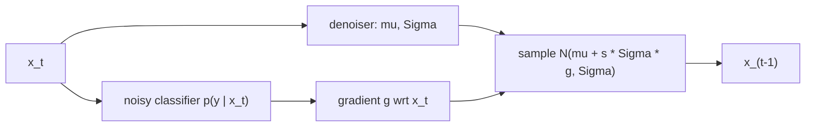

## Abstract

Before this paper, diffusion models were the likelihood-based family with good mode coverage and visibly weaker samples than GANs on hard datasets. Dhariwal and Nichol decompose that gap into two claims they can test separately: GAN architectures had simply received more tuning, and GANs have a cheap knob for trading diversity against fidelity that diffusion samplers lacked. The first is addressed by a U-Net ablation whose result they call ADM; the second by *classifier guidance*, which shifts each reverse step along the gradient of a classifier trained on noised images, with one scalar $s$ moving the sampler along a precision–recall curve. With both, the model reaches FID 2.97 / 4.59 / 7.72 on ImageNet 128 / 256 / 512 and 3.94 / 3.85 at 256 / 512 when guidance is combined with an upsampling stage — below BigGAN-deep at every resolution, and at close to twice its recall.

**Keywords:** diffusion models, classifier guidance, adaptive group normalization, fidelity–diversity trade-off, U-Net ablation, ImageNet

## 1 Introduction

GANs led image synthesis on FID, Inception Score and precision, but those metrics under-report diversity, and GANs are fragile to train. Likelihood-based models cover the distribution better and train against a fixed objective, yet their samples looked worse. Diffusion models already held the state of the art on CIFAR-10 and, after [Improved DDPM](/blog/improved-ddpm/), were known to improve predictably with compute — but on ImageNet $256\times256$ they still trailed BigGAN-deep even with an upsampling stack.

The hypothesis is deliberately unglamorous, and its value is that it is two claims rather than one. First, the diffusion U-Net had not received the architectural attention GAN generators had. Second, <mark>GANs can trade diversity for fidelity through the truncation trick while diffusion samplers had no comparable lever</mark>. Each claim gets its own mechanism and its own ablation, so the paper can say which half of the gap each closes: architecture alone suffices on LSUN and ImageNet $64\times64$, and guidance is what flips the ranking at 256 and above.

## 2 Background

The DDPM formulation — the noising process, the closed-form marginal, the $\epsilon$-prediction network and the Gaussian reverse kernel $\mathcal N(\mu_\theta(x_t,t),\Sigma_\theta(x_t,t))$ — is in the [DDPM](/blog/ddpm/) note, and the score-matching reading in [NCSN](/blog/ncsn/) and [Score-SDE](/blog/score-sde/). Two inherited improvements are used throughout and never re-ablated here: from [Improved DDPM](/blog/improved-ddpm/), the reverse variance learned as a log-space interpolation between $\beta_t$ and $\tilde\beta_t$ under a hybrid $L_\text{simple}+\lambda L_\text{vlb}$ loss, which is what keeps quality at reduced step counts; from [DDIM](/blog/ddim/), a deterministic sampler used whenever fewer than 50 steps are taken.

Evaluation is FID as the headline, sFID (spatial rather than pooled Inception features) for structure, IS and precision for fidelity, recall for coverage. Baseline metrics are recomputed from public samples or models in one codebase against the full training set as reference, because FID is sensitive to implementation details and to which subset of training data a paper compares against.

## 3 Method

> **Key idea.** Conditioning is Bayes' rule applied to scores: $\nabla\log p(x_t\mid y)=\nabla\log p(x_t)+\nabla\log p(y\mid x_t)$. Train the second term separately as a classifier on noised inputs, add it to the reverse step, and raise it to a power $s>1$ to sharpen the conditional. Nothing about the denoiser changes.

### 3.1 The architecture search (ADM)

All ablations run on ImageNet $128\times128$ at batch 256 with 250 sampling steps, from a baseline U-Net with 160 channels, depth 2, one attention head and attention only at $16\times16$. The search covers five axes: depth versus width at constant size; more attention heads; attention at $32$, $16$ and $8$ rather than $16$ alone; BigGAN residual blocks for up- and downsampling; and $1/\sqrt2$ rescaling of residual connections. Everything except the rescaling helps, and the gains compound rather than overlap.

Two of the choices are made on wall-clock rather than FID, which is easy to miss. Extra depth improves FID per iteration but is slower, so it is dropped. And although 32 channels per head gives the best FID in the head ablation, 64 is chosen because it reaches a given FID fastest — a decision that happens to align the model with standard transformer practice.

Timestep and class embeddings enter each residual block through adaptive group normalization,

$$
\text{AdaGN}(h,y)=y_s\,\text{GroupNorm}(h)+y_b ,
\tag{1}
$$

where $h$ is the activation after the block's first convolution and $(y_s,y_b)$ is a linear projection of the combined embedding. This is a multiplicative modulation in the style of FiLM and AdaIN, where the original DDPM merely added the embedding before normalising. The final ADM is: 2 residual blocks per resolution, 64 channels per head, attention at 32/16/8, BigGAN up/downsampling, AdaGN.

### 3.2 Conditioning is exact; the Gaussian form is not

The construction in Appendix H is worth separating from the approximation that follows, because only one of them is an approximation. Define a conditional noising process $\hat q$ with $\hat q(x_0)=q(x_0)$, a known label distribution $\hat q(y\mid x_0)$, and $\hat q(x_{t+1}\mid x_t,y):=q(x_{t+1}\mid x_t)$ — the noising is not allowed to depend on the label. Marginalising $y$ then gives $\hat q(x_{t+1}\mid x_t)=q(x_{t+1}\mid x_t)$ and $\hat q(x_t)=q(x_t)$, so the *unconditional* process is unchanged. It also gives $\hat q(y\mid x_t,x_{t+1})=\hat q(y\mid x_t)$: a noisier version of $x_t$ tells you nothing extra about the label. Applying Bayes' rule with that fact,

$$
\hat q(x_t\mid x_{t+1},y)=\hat q(x_t\mid x_{t+1})\,\frac{\hat q(y\mid x_t)}{\hat q(y\mid x_{t+1})}
= Z\,q(x_t\mid x_{t+1})\,\hat q(y\mid x_t),
\tag{2}
$$

since the denominator does not depend on $x_t$. <mark>Conditional sampling is exactly the unconditional reverse kernel reweighted by a noisy classifier</mark> — no approximation yet, only a normalising constant we cannot compute.

The approximation enters when we ask for a sampler. With $p_\theta(x_t\mid x_{t+1})=\mathcal N(\mu,\Sigma)$ and $g=\nabla_{x_t}\log p_\phi(y\mid x_t)\big|_{x_t=\mu}$, assume $\log p_\phi(y\mid x_t)$ has low curvature relative to $\Sigma^{-1}$ — reasonable when $\|\Sigma\|\to0$, i.e. in the many-step limit — and expand to first order:

$$
\log\!\big(p_\theta(x_t\mid x_{t+1})p_\phi(y\mid x_t)\big)
\approx -\tfrac12(x_t-\mu-\Sigma g)^{\!\top}\Sigma^{-1}(x_t-\mu-\Sigma g)+C .
\tag{3}
$$

Completing the square is exact; the Taylor truncation is not. The result is <mark>a Gaussian with the same covariance and its mean shifted by $\Sigma g$</mark>: the reverse step is pushed along the classifier gradient, preconditioned by the step's own covariance, so noisier steps (large $\Sigma$) move further. The denoiser is untouched, which is why guidance can be bolted onto any pre-trained model.

### 3.3 Intuition: a Gaussian class, where the error is computable

Take one dimension, a reverse step $\mathcal N(\mu,\sigma^2)$, and a class whose log-likelihood is quadratic, $\log p(y\mid x)=-\tfrac{(x-c)^2}{2\tau^2}+\text{const}$. Here the exact product of Eq. (2) is available: it is $\mathcal N\!\big(\mu+\tfrac{\sigma^2}{\sigma^2+\tau^2}(c-\mu),\ \tfrac{\sigma^2\tau^2}{\sigma^2+\tau^2}\big)$. The paper's approximation uses $g=(c-\mu)/\tau^2$ and gives $\mathcal N\!\big(\mu+\tfrac{\sigma^2}{\tau^2}(c-\mu),\ \sigma^2\big)$.

So the first-order sampler makes two errors, both of relative size $\sigma^2/\tau^2$: it **overshoots** the mean by a factor $1+\sigma^2/\tau^2$, and it **keeps the variance** where the exact product would contract it. This is exactly the "low curvature compared to $\Sigma^{-1}$" condition, now with a number attached — $1/\tau^2$ is the classifier's curvature and $\sigma^2$ the step's width. It also predicts that error grows as steps get coarser, which makes the 25-step DDIM results worth reading carefully: the tuned gradient scales there are *larger* than at 250 steps (2.5 against 1.0 at $256^2$, 9.0 against 4.0 at $512^2$), not smaller. The overshoot is evidently not the binding effect; what dominates is that guidance accumulates over steps, so a chain ten times shorter applies the shift ten times fewer times and the scale has to compensate.

### 3.4 Guided DDIM, and what the scale really is

The Gaussian argument needs a stochastic kernel, so deterministic [DDIM](/blog/ddim/) needs the score view instead. From $\nabla_{x_t}\log p_\theta(x_t)=-\epsilon_\theta(x_t)/\sqrt{1-\bar\alpha_t}$, the score of the joint $p(x_t)p(y\mid x_t)$ corresponds to the modified noise prediction

$$
\hat\epsilon(x_t)=\epsilon_\theta(x_t)-\sqrt{1-\bar\alpha_t}\;\nabla_{x_t}\log p_\phi(y\mid x_t),
\tag{4}
$$

which is then dropped into the ordinary DDIM update unchanged. Note the two routes are not the same approximation wearing different clothes: Eq. (3) perturbs a transition kernel, Eq. (4) perturbs a score, and only the latter survives a deterministic sampler.

The classifier itself is the downsampling trunk of the U-Net with an attention pool at $8\times8$, trained on the same noise distribution as the diffusion model, with random crops added against overfitting. With scale 1 on an unconditional model the classifier assigned the target class about 50% probability and the samples still did not look like the class. The fix, $s>1$, is not a fudge:

$$
s\,\nabla_x\log p(y\mid x)=\nabla_x\log\tfrac1Z p(y\mid x)^s .
\tag{5}
$$

Guiding with scale $s$ is guiding exactly with a *sharpened* classifier $p(y\mid x)^s$, which concentrates mass on its modes. <mark>$s$ is a temperature on the conditional, and it is the diffusion analogue of GAN truncation</mark>: raising it moves precision and IS up and recall down monotonically, while FID and sFID, which reward both, are minimised at an intermediate value ([Fig. 4](https://arxiv.org/pdf/2105.05233#page=9)). Appendix G checks the obvious alternative — sampling at reduced temperature, either by scaling the transition noise or by dividing $\epsilon_\theta$ — and finds it lowers precision *and* recall, producing blurry images: reduced temperature does not find the modes, guidance does.



### 3.5 Algorithm

```text
TRAIN
  1. diffusion model: standard ADM training (hybrid loss, learned Sigma), optionally class-conditional via AdaGN
  2. classifier p_phi(y | x_t, t): U-Net downsampling trunk + attention pool at 8x8,
     trained on the SAME noising distribution q(x_t | x_0), with random crops

SAMPLE, stochastic (>= 50 steps), scale s
  x <- N(0, I)
  for t = T down to 1:
    mu, Sigma <- diffusion(x, t)                 # class-conditional or not
    g <- grad_x log p_phi(y | x, t)              # one classifier backward pass
    x <- sample from N(mu + s * Sigma * g, Sigma)
  return x

SAMPLE, DDIM (< 50 steps), scale s
  x <- N(0, I)
  for t in the strided schedule, descending:
    eps_hat <- eps_theta(x, t) - s * sqrt(1 - abar[t]) * grad_x log p_phi(y | x, t)
    x0_hat  <- (x - sqrt(1 - abar[t]) * eps_hat) / sqrt(abar[t])
    x       <- sqrt(abar[t_prev]) * x0_hat + sqrt(1 - abar[t_prev]) * eps_hat
  return x
```

## 4 Implementation notes

From Appendix I (Tables 11–14) and Appendix A.

| Item | ImageNet 128 | ImageNet 256 | ImageNet 512 | LSUN 256 |
|---|---|---|---|---|
| Diffusion steps / schedule | 1000, linear | 1000, linear | 1000, linear | 1000, linear |
| Model size / channels | 422M / 256 | 554M / 256 | 559M / 256 | 552M / 256 |
| Channel multiples | 1,1,2,3,4 | 1,1,2,2,4,4 | 0.5,1,1,2,2,4,4 | 1,1,2,2,4,4 |
| Depth / attention | 2 / 32,16,8 | 2 / 32,16,8 | 2 / 32,16,8 | 2 / 32,16,8 |
| Heads | 64 ch/head | 64 ch/head | 64 ch/head | 4 heads |
| Dropout | 0.0 | 0.0 | 0.0 | 0.1 |
| Batch / lr / iterations | 256 / 1e-4 / 4360K | 256 / 1e-4 / 1980K | 256 / 1e-4 / 1940K | 256 / 1e-4 / 200–500K |
| Classifier size / iters | 43M / 300K | 54M / 500K | 54M / 500K | — |
| Gradient scale, 250 steps | 0.5 | 1.0 | 4.0 | — |
| Gradient scale, 25 DDIM steps | 1.25 | 2.5 | 9.0 | — |

ImageNet $64\times64$ is the exception: cosine schedule, 192 channels, depth 3, dropout 0.1, batch 2048, lr $3\times10^{-4}$, 540K iterations. The upsampling stacks (ADM-U) are 312M ($64\to256$, 500K iterations) and 309M ($128\to512$, 1050K), conditioned on the low-resolution image concatenated channel-wise after interpolation. All models use Adam/AdamW with $\beta=(0.9,0.999)$, EMA rate 0.9999, and 16-bit training with loss scaling but 32-bit weights, EMA and optimizer state. The $\lambda$ of the inherited hybrid loss, the warm-up schedule and total wall-clock per model are not stated.

Details that are easy to get wrong:

- **The classifier must see the model's own noise distribution.** It is trained on $q(x_t\mid x_0)$ with the same schedule, not on clean images, and it is queried at every step with its gradient taken with respect to the input.
- **Guidance costs a backward pass per step**, on top of the denoiser's forward pass — the classifier is small (43–54M against 422–559M) but the backward pass is not free.
- **The scale must be re-swept per resolution and per sampler.** The swept grids were $\{0.5,1,2\}$ at 128 and 256 and $\{1,2,3,3.5,4,4.5,5\}$ at 512, with separate and much wider grids for 25-step DDIM (up to 11 at $512^2$). A scale tuned at one resolution or one step count does not transfer.
- **Strides differ by sampler.** 250-step ImageNet sampling uses the uniform stride from [Improved DDPM](/blog/improved-ddpm/); 25-step DDIM uses the slightly different stride from [DDIM](/blog/ddim/).
- **LSUN is sampled with 1000 steps, not 250.** Appendix J reports the 250-step gap and closes most of it with a non-uniform schedule found by sweeping how many steps go to each fifth of the chain (best 90/60/60/20/20, FID 2.02 against 2.31 for the uniform 250-step schedule and 1.90 at 1000 steps). That sweep is itself an unreported tuning cost.
- **Only the low-resolution stage is guided** when guidance is combined with upsampling.
- **Naive PyTorch reaches 18–30% hardware utilisation**; the optimized version (larger per-GPU batch, fused GroupNorm-Swish and fused Adam) reaches 29–41%. Reported throughputs are therefore not a property of the architecture alone.

## 5 Experiments

**Architecture ablation (Table 1, ImageNet 128, FID deltas from a baseline of 15.33 at 700K / 13.21 at 1200K iterations).**

| Change | ΔFID @700K | ΔFID @1200K |
|---|---|---|
| 128 ch, depth 4 (constant size) | −0.21 | −0.48 |
| 4 attention heads | −0.54 | −0.82 |
| Attention at 32, 16, 8 | −0.72 | −0.66 |
| BigGAN up/downsampling | −1.20 | −1.21 |
| $1/\sqrt2$ residual rescaling | +0.16 | +0.25 |
| **Combined (heads + multi-res attention + BigGAN blocks)** | **−3.14** | **−3.00** |

Attention configuration (Table 2, baseline 1 head = 14.08): 2 heads −0.50, 4 heads −0.97, 8 heads −1.17, 32 ch/head **−1.36**, 64 ch/head −1.03, 128 ch/head −1.08. AdaGN (Table 3): 13.06 against 15.08 for DDPM-style additive conditioning.

**Guidance ablation (Table 4, ImageNet 256, 2M iterations, batch 256).**

| Model | Scale | FID ↓ | sFID ↓ | IS ↑ | Prec ↑ | Rec ↑ |
|---|---|---|---|---|---|---|
| Unconditional | – | 26.21 | 6.35 | 39.70 | 0.61 | 0.63 |
| Unconditional + guidance | 1.0 | 33.03 | 6.99 | 32.92 | 0.56 | 0.65 |
| Unconditional + guidance | 10.0 | 12.00 | 10.40 | 95.41 | 0.76 | 0.44 |
| Conditional | – | 10.94 | 6.02 | 100.98 | 0.69 | 0.63 |
| **Conditional + guidance** | **1.0** | **4.59** | **5.25** | 186.70 | 0.82 | 0.52 |
| Conditional + guidance | 10.0 | 9.11 | 10.93 | 283.92 | 0.88 | 0.32 |

**Against the GAN baselines (Tables 5 and 6; recall in parentheses).**

| ImageNet | BigGAN-deep | ADM | ADM-G (25 DDIM steps) | ADM-G | ADM-G + ADM-U |
|---|---|---|---|---|---|
| 128 | 6.02 (0.35) | 5.91 (0.65) | 5.98 (0.51) | **2.97** (0.59) | – |
| 256 | 6.95 (0.28) | 10.94 (0.63) | 5.44 (0.49) | 4.59 (0.52) | **3.94** (0.53) |
| 512 | 8.43 (0.29) | 23.24 (0.60) | 8.41 (0.47) | 7.72 (0.42) | **3.85** (0.53) |

**Claim-by-claim reading.**

- *Architecture alone closes the gap on easier tasks.* Well supported. LSUN bedrooms 1.90 against StyleGAN's 2.35, horses 2.57 against StyleGAN2's 3.84, cats 5.57 against 7.25, and ImageNet $64\times64$ 2.07 against BigGAN-deep's 4.06 — all without guidance, and all with higher recall. At 128 the unguided ADM already edges BigGAN-deep (5.91 vs 6.02).
- *Guidance is what flips the ranking at high resolution.* The clearest result in the paper: <mark>the unguided conditional model loses to BigGAN-deep at 256 (10.94 vs 6.95) and badly at 512 (23.24 vs 8.43), and guidance alone reverses both</mark>.
- *The win is not bought by collapsing modes.* Supported by recall, which stays far above the GAN's at every resolution (0.59 vs 0.35 at 128; 0.52 vs 0.28 at 256). The one place it weakens is $512^2$ ADM-G at scale 4.0, where recall falls to 0.42 — the two-stage ADM-G + ADM-U recovers 0.53 at a better FID, and that is the configuration reported as best.
- *25 steps suffice.* ADM-G with 25 DDIM steps matches or beats BigGAN-deep at all three resolutions (5.98/5.44/8.41), though at 128 and 512 the margin is within noise and recall drops relative to the 250-step version.
- *Guidance and upsampling are complementary.* Table 6 supports the mechanism claim cleanly: ADM-U raises precision at constant recall (0.69→0.72 at 256 with recall 0.63), guidance trades along the curve (0.82 / 0.52), and combining them, guiding only the low-resolution stage, gives the best FID at both resolutions.
- *"Same or lower compute than GANs."* This holds where the paper demonstrates it and not in general. At 128, ADM-G at 450K iterations costs 63 V100-days against BigGAN-deep's 64–128 and reaches FID 5.67 — a genuine win. But the headline ImageNet 256 model costs 962 V100-days against 128–256, four to seven times more; the best 512 result costs 1914. The compute-matched claim is about the early-stopped models in Appendix A, not the ones in the abstract.
- *Samples are not memorised.* Appendix C shows Inception-space nearest neighbours for a handful of samples at scales 1 and 2.5. A handful, qualitatively — weak evidence for a claim about the whole distribution, though nothing suggests otherwise.
- *Guidance beats truncation.* Partially supported. [Fig. 5](https://arxiv.org/pdf/2105.05233#page=9) shows guidance strictly better on the FID–IS trade-off, but on precision–recall it wins only up to a precision threshold, beyond which BigGAN-deep reaches values guidance cannot. The paper says so plainly.

## 6 Limitations

**Stated by the authors**

- Sampling still needs many sequential forward passes and remains slower than a GAN.
- Guidance requires labels; there is no fidelity–diversity lever for unlabeled data, only suggestions (synthetic labels by clustering, or a discriminator-like model).
- The sample-quality metrics used are not a perfect proxy for human judgement; better metrics are an open problem.
- The 250-step LSUN schedule sweep was not exhaustive, and better schedules likely exist.

**My reading**

- The Taylor argument assumes $\|\Sigma\|\to0$, yet the 25-step regime is used and reported without any measurement of the approximation error. §3.3 gives a case where that error is computable; the paper gives none.
- Nothing disentangles whether the gains come from genuinely better conditionals or partly from classifier gradients aligning with the very Inception features FID, sFID and IS are built on. Both the guidance signal and three of the four metrics pass through ImageNet classifiers.
- The $s=1$ failure on the unconditional model is reported and not explained: FID gets *worse* than no guidance at all (33.03 against 26.21), with precision down and recall up — guidance at unit scale appears to be adding noise rather than conditioning.
- ADM and BigGAN-deep are not compute-matched at the headline resolutions, as Appendix A's own compute table shows, yet the comparison is presented as though they were.
- The architecture ablation is on ImageNet 128 only, one run per configuration, with deltas as small as 0.16 FID treated as signal. Whether the same five axes rank the same way at 512 or on LSUN is untested.
- Each guidance scale is tuned on the metric it is then reported under, on the test distribution itself. The sweep grids are small, but the practice inflates every guided number slightly.

## 7 Extensions

**What was built on this**

- [Classifier-free guidance](/blog/classifier-free-guidance/) removes the second network entirely by jointly training a conditional and unconditional model and extrapolating between their predictions — the direct answer to this paper's main cost, and the version that survives in practice.
- [LDM](/blog/latent-diffusion/) keeps guidance but moves the whole chain into an autoencoder latent space, attacking the sampling cost the authors flag; the ADM U-Net with AdaGN is its starting architecture.
- [DiT](/blog/dit/) replaces that U-Net with a transformer and keeps AdaGN as adaLN, showing the conditioning mechanism outlived the backbone.
- [EDM](/blog/edm/) re-derives the sampler and schedule from scratch and makes several of ADM's tuned choices unnecessary.
- The guidance-as-gradient idea generalises to any differentiable function of $x_t$; the authors already anticipate steering with a noised CLIP model, which is the recipe later text-to-image systems adopt (from general knowledge, unverified).

**Open problems**

- A fidelity–diversity lever for unlabeled data, which the authors name and leave open.
- How much approximation error the first-order guidance step incurs at practical step counts, and whether a second-order or exact-product correction would let the scale be smaller.
- Whether the metric family and the guidance signal are entangled, which no experiment in the paper can rule out.
- Why guidance at $s=1$ hurts an unconditional model while $s=10$ helps it substantially.

**Research directions**

*These are ideas, not results — none has been run.*

1. **Regime guidance for scenario generation.** *Hypothesis:* an auxiliary classifier over market regimes (say high/low volatility, or crisis/calm), trained on noised return paths exactly as here, can steer an unconditional path generator at sampling time, giving conditional scenarios without retraining the generator per regime. *Data:* multi-asset daily returns with a regime label from a fitted HMM or realised-volatility quantiles. *Baseline:* a generator trained conditionally on the regime label from the start; [TimeGrad](/blog/timegrad/) and [Quant GANs](/blog/quant-gans/) as unguided references. *Metric:* per-regime moment and ACF match, plus transition realism across the regime boundary. *Likely failure mode:* $s>1$ deliberately under-represents the tails of the conditional, which is usually the part a risk application needs — the mechanism transfers, the default scale must not.
2. **Measuring the guidance approximation where the truth is known.** *Hypothesis:* the §3.3 Gaussian-class construction extends to a fully Gaussian toy model in which the exact conditional reverse kernel is available in closed form, so the overshoot and the missing variance contraction can be measured as functions of step size, and used to predict the scale a given step budget needs. *Data:* synthetic Gaussian mixtures and Student-$t$ mixtures with a linear or quadratic class boundary. *Baseline:* first-order guidance at the exact-product optimum versus the tuned-$s$ optimum. *Metric:* KL to the exact conditional, per step and accumulated. *Likely failure mode:* real classifiers on real data have curvature nothing like the toy's, so the calibration does not transfer even if the mechanism is confirmed.

## 8 Takeaways

- Split a performance gap into claims that can be tested separately. Half of this one was architecture, half was a missing knob, and the paper can say which half mattered where — architecture suffices on LSUN and $64^2$, guidance is decisive at $256^2$ and above.
- A diffusion model that looks behind may just be under-tuned: multi-resolution attention, more heads, BigGAN up/down blocks and AdaGN compound to a 3-FID gain before any new idea appears. Two of those choices were made on wall-clock, not on FID.
- <mark>Conditioning a trained denoiser costs one term: add $s\,\Sigma\nabla\log p_\phi(y\mid x_t)$ to the reverse mean, or edit $\hat\epsilon$ for DDIM.</mark> The reweighting in Eq. (2) is exact; only the Gaussian form is an approximation, and §3.3 puts a size on its error — the step's variance measured against the classifier's curvature scale.
- $s$ is a temperature on the conditional and belongs next to any reported FID, because FID's optimum over $s$ is interior — a guided number without its scale is not interpretable.
- The cost is a second network trained on noisy inputs plus labels, which is exactly what [classifier-free guidance](/blog/classifier-free-guidance/) removes; and the headline ImageNet 256 result is not compute-matched to the GAN it beats.
- For financial time series the mechanism transfers more readily than the numbers: a noise-aware model of a regime or scenario label could steer an unconditional path generator at sampling time. The caveat carries over with it, since $s>1$ deliberately thins the tails of the conditional, which is usually the part a risk application cares about most.

## References

1. P. Dhariwal, A. Nichol. *Diffusion Models Beat GANs on Image Synthesis.* NeurIPS 2021. arXiv:2105.05233.
2. J. Ho, A. Jain, P. Abbeel. *Denoising Diffusion Probabilistic Models.* NeurIPS 2020. arXiv:2006.11239.
3. A. Nichol, P. Dhariwal. *Improved Denoising Diffusion Probabilistic Models.* ICML 2021. arXiv:2102.09672.
4. J. Song, C. Meng, S. Ermon. *Denoising Diffusion Implicit Models.* ICLR 2021. arXiv:2010.02502.
5. A. Brock, J. Donahue, K. Simonyan. *Large Scale GAN Training for High Fidelity Natural Image Synthesis.* ICLR 2019. arXiv:1809.11096.
6. T. Kynkäänniemi, T. Karras, S. Laine, J. Lehtinen, T. Aila. *Improved Precision and Recall Metric for Assessing Generative Models.* NeurIPS 2019.
7. C. Nash, J. Menick, S. Dieleman, P. W. Battaglia. *Generating Images with Sparse Representations.* 2021. arXiv:2103.03841. (source of sFID)
