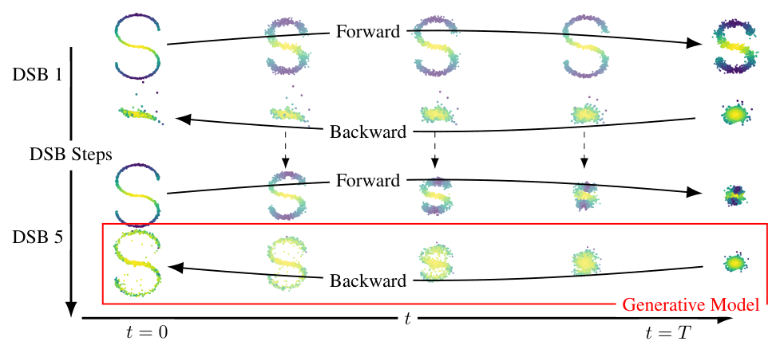
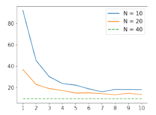
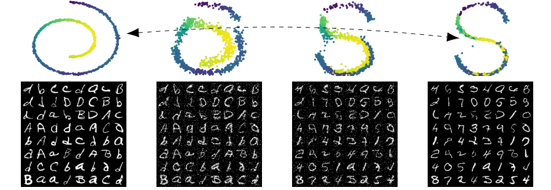

## Abstract

A score-based generative model only works if the forward noising process actually reaches its Gaussian prior, which forces a long time horizon and many small steps. This paper replaces that requirement with a boundary-value problem: find the diffusion closest to the reference noising process, in path-space KL divergence, that starts at the data distribution and ends exactly at the prior. That object is the Schrödinger bridge (SB), an entropy-regularised form of optimal transport. The authors solve it with Diffusion Schrödinger Bridge (DSB), a neural approximation of Iterative Proportional Fitting (IPF) in which forward and backward drifts are trained in alternation by a regression loss. <mark>The first DSB iteration is exactly the usual score-based model; later iterations correct the mismatch left by a horizon that is too short.</mark> The paper also gives a total-variation convergence bound for standard score-based sampling and new convergence results for IPF on non-compact spaces.

**Keywords:** Schrödinger bridge, iterative proportional fitting, entropic optimal transport, time reversal, score matching, Sinkhorn.

## 1 Introduction

In the SDE view of diffusion models, data are pushed through a noising SDE and a network learns the score of each intermediate marginal, which gives the drift of the reverse-time SDE. Sampling starts from the prior, not from the true terminal marginal of the forward process. The gap between those two distributions is an error that never goes away, and the only way to shrink it is to run the forward process longer. Longer horizons need more discretisation steps to keep the numerical error under control, so sampling is slow.

The authors' answer is to stop treating the prior as an approximation. They ask for a process whose two end marginals are pinned to the data and the prior in finite time $T$. Among all such processes they pick the one closest to the reference diffusion. Earlier SB solvers needed a discretised state space, regression on potential functions, or kernel density estimates, none of which survives image-scale dimensions. A concurrent method by Vargas et al. follows a similar alternating scheme but fits drifts with Gaussian processes instead of neural networks.

## 2 Background

The reference process is a Markov chain with Gaussian kernels, the Euler–Maruyama discretisation of $dX_t = f(X_t)\,dt + \sqrt{2}\,dB_t$ with step sizes $\gamma_{k+1}$:

$$
p_{k+1|k}(x_{k+1}\mid x_k) = \mathcal{N}\big(x_{k+1};\; x_k + \gamma_{k+1} f(x_k),\; 2\gamma_{k+1} I\big). \tag{1}
$$

The paper takes $f(x) = -\alpha x$, so $\alpha = 0$ gives Brownian motion (the NCSN setting) and $\alpha > 0$ an Ornstein–Uhlenbeck process (the DDPM setting). The continuous-time reversal $Y_t = X_{T-t}$ obeys

$$
dY_t = \{-f(Y_t) + 2\nabla \log p_{T-t}(Y_t)\}\,dt + \sqrt{2}\,dB_t, \tag{2}
$$

where $p_t$ is the marginal density of $X_t$ and the score $\nabla\log p_t$ is learned by denoising score matching.

Theorem 1 bounds the total-variation distance between the sampler's output and $p_{\text{data}}$, assuming the score network is uniformly within $M$ of the true score. For $\alpha > 0$ the bound is a term proportional to $(M + \bar\gamma^{1/2})e^{D_\alpha T}$, with $\bar\gamma$ the largest step size, plus a mixing term decaying like $e^{-\alpha^{1/2}T}$. The two terms pull in opposite directions in $T$, which is the trade-off the rest of the paper attacks. <mark>The mixing term depends only on the simple forward process, so the bound does not inherit the poor mixing times of Langevin samplers in high dimension.</mark>

## 3 Method

> **Key idea.** Treat the noising process as a reference path measure and look for the closest path measure with the right marginals at both ends. IPF solves this by alternately fixing one end at a time, and each half-step is nothing more than "time-reverse the current process and restart it from the correct marginal", which is precisely what score-based models already know how to learn.

### 3.1 The Schrödinger bridge problem

With $p(x_{0:N})$ the joint density of the reference chain over $N+1$ time points, the dynamic SB is

$$
\pi^\star = \arg\min\big\{\mathrm{KL}(\pi \mid p) : \pi_0 = p_{\text{data}},\ \pi_N = p_{\text{prior}}\big\}. \tag{3}
$$

The KL splits into an endpoint term plus a conditional term, so the solution is a static coupling of $(x_0, x_N)$ glued to the reference bridge in between. When the reference is pure Gaussian noise of total variance $\sigma^2$, the static problem is quadratic-cost optimal transport with an entropy penalty of weight $2\sigma^2$; as $\sigma \to 0$ it tends to the 2-Wasserstein plan. <mark>DSB is therefore a continuous-state analogue of the Sinkhorn algorithm.</mark>

### 3.2 IPF as repeated time reversal

IPF starts from $\pi^0 = p$ and alternates two KL projections:

$$
\pi^{2n+1} = \arg\min\{\mathrm{KL}(\pi\mid\pi^{2n}) : \pi_N = p_{\text{prior}}\},\qquad
\pi^{2n+2} = \arg\min\{\mathrm{KL}(\pi\mid\pi^{2n+1}) : \pi_0 = p_{\text{data}}\}. \tag{4}
$$

The usual representation updates potential functions, which are hard to estimate from samples. Proposition 2 gives another one: the odd iterate $q^n$ is $p_{\text{prior}}$ at step $N$ followed by the backward transitions of the current forward process $p^n$, and the next forward process $p^{n+1}$ is $p_{\text{data}}$ followed by the forward transitions of $q^n$. With $n = 0$ this is the standard score-based recipe.

*Source: De Bortoli et al., arXiv:2106.01357, Fig. 1, CC BY 4.0.*

### 3.3 Mean-matching instead of stacked scores

Writing each reversal with scores gives $f^{n+1}_k = f^n_k - 2\nabla\log p^n_{k+1} + 2\nabla\log q^n_k$, so the drift at iteration $n$ is a sum of all earlier score networks. The authors judge this too expensive in memory and compute. Proposition 3 sidesteps it by regressing the means of the Gaussian transitions directly. With $F^n_k(x) = x + \gamma_{k+1} f^n_k(x)$ the forward mean and $B^n_{k+1}$ the backward mean,

$$
B^n_{k+1} = \arg\min_B\; \mathbb{E}_{p^n_{k,k+1}}\big\|B(X_{k+1}) - \big(X_{k+1} + F^n_k(X_k) - F^n_k(X_{k+1})\big)\big\|^2, \tag{5}
$$

and the symmetric loss, with the roles of $F$ and $B$ swapped and the expectation under $q^n$, yields $F^{n+1}_k$. <mark>Each half-iteration therefore trains one network on trajectories simulated from the other, and no score is ever evaluated.</mark> Algorithm 1 loops this $L$ times; sampling draws $X_N \sim p_{\text{prior}}$ and iterates $X_{k-1} = B_{\beta_L}(k, X_k) + \sqrt{2\gamma_k}\,Z_k$. The first backward network can be trained the cheap, simulation-free way, and later networks are fine-tuned from their predecessors. The authors note that training both networks jointly would give a bridge, but not necessarily the Schrödinger one.

### 3.4 Convergence of IPF

Under a mild integrability assumption, Proposition 4 shows successive IPF iterates get monotonically closer in KL, total variation and Jeffreys divergence, and that $n\{\mathrm{KL}(\pi^n_0\mid p_{\text{data}}) + \mathrm{KL}(\pi^n_N\mid p_{\text{prior}})\} \to 0$, which improves on a previous $C/n$ rate. Proposition 5 shows convergence of the whole joint in total variation and identifies the limit with the SB without compact support. Proposition 6 shows that in continuous time each IPF iterate is itself a diffusion with drifts $b^n_t = -f^n_t + 2\nabla\log p^n_t$ and $f^{n+1}_t = -b^n_t + 2\nabla\log q^n_t$, so DSB is a time discretisation of a path-space IPF.

## 4 Experiments

The main body reports no numerical table; FID appears only as a curve. The table below collects the configurations stated in the text.

| Experiment | Dim. | Steps $N$ | Horizon $T$ | DSB iterations shown | Outcome reported |
|---|---|---|---|---|---|
| Gaussian, closed-form SB | 5 and 50 | 20 | $\gamma = 1/40$ per step | per-iteration curves | 30k-parameter net matches mean, variance, covariance at $d=5$ only; 240k-parameter net also at $d=50$ |
| 2D toy data | 2 | 20 | 0.2 | 1 vs 20 | iteration 1 fails, iteration 20 recovers the data |
| MNIST | — | 12 (also 10, 20, 40 in the FID curve) | — | 1 vs 8 | clear visual and FID gain |
| **CelebA 32×32** | **3072** | **50** | **0.63** | **10** | **first SB approximation at this dimension** |
| Swiss-roll → S-curve | 2 | 50 | 1 | 9 | non-Gaussian "prior" |
| EMNIST → MNIST | — | 30 | 1.5 | 10 | letters morph into digits |

The baseline for step counts is the original NCSN line of work, which the paper quotes at $N = 100$.

*Source: De Bortoli et al., arXiv:2106.01357, Fig. 6, CC BY 4.0.*

<mark>The curve for the fewest steps falls steeply over the first few iterations and then flattens</mark>, which fits the theory: most of the endpoint mismatch is removed early. Because the terminal distribution need not be Gaussian, the same code transports one dataset onto another.

*Source: De Bortoli et al., arXiv:2106.01357, Fig. 7, CC BY 4.0.*

## 5 Discussion

The strongest part of the paper is conceptual. It places score-based models inside a classical problem dating back to Schrödinger in the 1930s, shows that the existing method is one step of a known algorithm, and makes the next steps trainable with a loss no harder than score matching. The IPF results are of independent interest to the optimal-transport community.

The empirical side is modest, and the authors say so: the implementation "does not yet compete" with state-of-the-art image models. There is no comparison at equal compute. That comparison matters, because every DSB iteration after the first trains on simulated trajectories and cannot use the closed-form perturbation kernels that make ordinary diffusion training cheap. <mark>Steps saved at sampling time are paid for with many rounds of simulation-based training.</mark> The main body does not quantify how network error accumulates across iterations, although each network is fitted to samples from the previous imperfect one. Theorem 1 relies on a uniform score-error bound that the authors themselves call strong. Finally, $T$ cannot be pushed to zero: they observe quality loss when the first forward pass ends too far from the prior, since the score is then poorly learned near the prior's support.

## 6 Takeaways

- Standard score-based diffusion is IPF iteration one for a Schrödinger bridge between data and prior; more iterations fix the endpoint mismatch of a short horizon.
- The practical trick is mean-matching regression (Eq. 5), which avoids summing an ever-growing stack of score networks.
- The terminal distribution can be any distribution with samples, so the method doubles as a sample-based entropic optimal-transport solver in high dimension.
- The cost moves from sampling to training, and the paper does not show that the trade is favourable at scale.
- For financial time series the bridge view fits problems with two known marginals, such as calibrating a path model to distributions at two dates while staying close to a reference SDE. The paper tests nothing of the kind, so this is a direction, not a result.

## References

1. De Bortoli, V., Thornton, J., Heng, J., Doucet, A. *Diffusion Schrödinger Bridge with Applications to Score-Based Generative Modeling.* NeurIPS 2021. arXiv:2106.01357.
2. Song, Y. et al. *Score-Based Generative Modeling through Stochastic Differential Equations.* ICLR 2021. arXiv:2011.13456.
3. Song, Y., Ermon, S. *Generative Modeling by Estimating Gradients of the Data Distribution.* NeurIPS 2019. arXiv:1907.05600.
4. Ho, J., Jain, A., Abbeel, P. *Denoising Diffusion Probabilistic Models.* NeurIPS 2020. arXiv:2006.11239.
5. Cuturi, M. *Sinkhorn Distances: Lightspeed Computation of Optimal Transport.* NeurIPS 2013.
