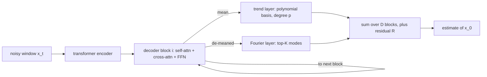

## Abstract

Diffusion-TS is an unconditional diffusion model for multivariate time series built on a structural assumption: every denoised output is assembled from a slowly varying trend, a handful of sinusoids, and a leftover term. The denoiser is an encoder–decoder transformer in which each decoder block emits a trend piece through a low-degree polynomial basis and a seasonal piece through the strongest Fourier modes of its hidden state. Instead of predicting noise, the network predicts the clean window at every step, and the loss compares prediction and target in the time domain and after an FFT. Forecasting and imputation need no retraining: each reverse step is nudged by the gradient of a reconstruction error on the observed part. On six datasets the model beats GAN, VAE and earlier diffusion generators on almost every reported metric. Two of the paper's printed equations do not match its own algorithms; I work through both below.

**Keywords:** time-series generation, seasonal-trend decomposition, Fourier synthetic layer, $\hat{x}_0$-prediction, FFT loss, reconstruction-guided sampling, Context-FID

## 1 Introduction

Diffusion work on time series had, by 2023, concentrated on conditional tasks. [CSDI](/blog/csdi/) and SSSD impute, [TimeGrad](/blog/timegrad/) forecasts autoregressively, and all of them see side information during both training and sampling. Unconditional synthesis — draw a fresh window that looks like the data, with nothing given — was left to GANs (TimeGAN, Cot-GAN) and VAEs (TimeVAE), or to diffusion models that were univariate ([TSDiff](/blog/tsdiff/), DiffWave) or built on recurrent backbones, which accumulate error over long horizons and cannot be parallelised.

The second objection is specific to diffusion and is the paper's actual motivation. Forward noising destroys trend, periodicity and local idiosyncrasy simultaneously and indiscriminately, and a generic denoiser is given nothing that encourages it to rebuild those pieces separately — when a series has a strong period, nothing makes the model lock onto that period rather than smear it. <mark>The bet is that a classical seasonal-trend decomposition, placed inside the denoiser's output head rather than applied to the data beforehand, both improves sample quality and produces components a person can look at.</mark> The third aim is practical: one trained unconditional generator should serve forecasting and imputation with no parameter updates, only a modified sampler.

## 2 Background

The setting is the DDPM of [Ho et al.](/blog/ddpm/). A clean window $x_0\in\mathbb{R}^{\tau\times d}$ ($\tau$ steps, $d$ channels) is corrupted by $q(x_t\mid x_{t-1})=\mathcal{N}(\sqrt{1-\beta_t}\,x_{t-1},\beta_t I)$, so that $x_t=\sqrt{\bar\alpha_t}x_0+\sqrt{1-\bar\alpha_t}\,\epsilon$ with $\alpha_t=1-\beta_t$ and $\bar\alpha_t=\prod_{s\le t}\alpha_s$. Training reduces to matching the posterior mean

$$
\mu(x_t,x_0)=\frac{\sqrt{\bar\alpha_{t-1}}\beta_t}{1-\bar\alpha_t}x_0+\frac{\sqrt{\alpha_t}(1-\bar\alpha_{t-1})}{1-\bar\alpha_t}x_t,
\qquad
\tilde\beta_t=\frac{1-\bar\alpha_{t-1}}{1-\bar\alpha_t}\beta_t, \tag{1}
$$

where $\tilde\beta_t$ is the posterior variance. The mean can be reached through a noise estimate $\epsilon_\theta$ or a clean-window estimate $\hat{x}_0$; Diffusion-TS takes the latter, and that choice is what makes the rest of the design possible. The data model behind the architecture is the additive one from classical decomposition,

$$
x_j=\zeta_j+\sum_{i=1}^{m}s_{i,j}+e_j,\qquad j=0,\dots,\tau-1, \tag{2}
$$

with $\zeta_j$ a trend, $s_{i,j}$ the $i$-th seasonal component and $e_j$ a remainder holding noise and outliers.

## 3 Method

> **Key idea.** Make the denoiser's output *be* a decomposition. If the network can only produce "polynomial trend + a few sinusoids + residual", then asking it to predict the clean window from a noisy one forces it to recover those parts, and the parts double as an explanation.

### 3.1 The decomposition decoder

An encoder of $M$ self-attention blocks reads the entire noisy window; a decoder of $D$ blocks produces the output ([Fig. 2 in the paper](https://arxiv.org/pdf/2403.01742#page=5)). Each decoder block is a transformer block (self-attention plus cross-attention onto the encoder output), a feed-forward block, and a $1\times1$ convolution. The block's output is then split: its temporal mean is peeled off and routed into the trend branch, and the de-meaned residue goes to the Fourier branch. The diffusion step $t$ enters through adaptive layer norm, $a_t\,\mathrm{LayerNorm}(w)+b_t$, the same conditioning mechanism as [DiT](/blog/dit/).

**Trend.** Write $w^{i,t}_{\text{tr}}$ for the trend input of block $i$ at diffusion step $t$. A linear map turns it into $p+1$ coefficients per channel, which multiply a fixed polynomial basis in normalised time:

$$
V^{t}_{\text{tr}}=\sum_{i=1}^{D}\Big(C\cdot\mathrm{Linear}\big(w^{i,t}_{\text{tr}}\big)+\mathcal{X}^{i,t}_{\text{tr}}\Big),
\qquad C=[\,\mathbf{1},c,\dots,c^{p}\,],\quad c=[0,1,\dots,\tau-1]^{\top}/\tau. \tag{3}
$$

$C\in\mathbb{R}^{\tau\times(p+1)}$ is the same for every block and every sample; only the coefficients are learned. $\mathcal{X}^{i,t}_{\text{tr}}$ is the mean that was peeled off block $i$'s output, so the trend branch also absorbs the level. With $p=3$ the trend has four degrees of freedom per channel per block — it can bend, but it cannot oscillate, which is exactly the constraint that makes it a trend and not just another free output.

**Seasonality.** The seasonal input $w^{i,t}_{\text{seas}}$ is transformed by a DFT $\mathcal{F}$; amplitudes $A^{(k)}=|\mathcal{F}(w^{i,t}_{\text{seas}})_k|$ and phases $\Phi^{(k)}=\phi(\mathcal{F}(w^{i,t}_{\text{seas}})_k)$ are read off, the $K$ indices $\kappa^{(1)},\dots,\kappa^{(K)}$ with largest amplitude are kept out of the $\lfloor\tau/2\rfloor+1$ candidates, and the component is resynthesised from those modes alone:

$$
S_{i,t}=\sum_{k=1}^{K}A^{(\kappa^{(k)})}_{i,t}\Big[\cos\!\big(2\pi f_{\kappa^{(k)}}\tau c+\Phi^{(\kappa^{(k)})}_{i,t}\big)+\cos\!\big(2\pi \bar f_{\kappa^{(k)}}\tau c+\bar\Phi^{(\kappa^{(k)})}_{i,t}\big)\Big]. \tag{4}
$$

Here $f_k=k/\tau$, so $2\pi f_k\tau c$ evaluates to $2\pi k n/\tau$ at step $n$; the bar denotes the conjugate index, and the second cosine is the conjugate partner that makes the sum real. Selection is per block, per channel and per sample, so nothing fixes the periods in advance — but note that the model can only ever place energy on the $\tau$-periodic Fourier grid, which is exact for a period dividing $\tau$ and leaky otherwise. The estimate adds both branches and $R$, the output of the last decoder block:

$$
\hat{x}_0(x_t,t,\theta)=V^{t}_{\text{tr}}+\sum_{i=1}^{D}S_{i,t}+R. \tag{5}
$$

$R$ is an unconstrained tensor. It carries everything the two structured branches cannot express, and — as the ablation in §5 shows — it carries a lot.

### 3.2 Clean-window prediction with a Fourier loss

Since (5) describes a signal and not a noise vector, the network must be trained to output $\hat{x}_0$, which the reverse step substitutes into (1). The objective is a reweighted two-domain squared error:

$$
\mathcal{L}_\theta=\mathbb{E}_{t,x_0}\Big[w_t\big(\lambda_1\lVert x_0-\hat{x}_0\rVert^2+\lambda_2\lVert \mathrm{FFT}(x_0)-\mathrm{FFT}(\hat{x}_0)\rVert^2\big)\Big],\qquad w_t=\frac{\lambda\,\alpha_t(1-\bar\alpha_t)}{\beta_t^{2}}, \tag{6}
$$

with $\lambda=0.01$ and $\lambda_1,\lambda_2$ balancing the two domains. The first term is the ordinary $\hat{x}_0$ loss. The second penalises the same error after an FFT, which puts weight on getting the spectrum right even when the pointwise error is small — a natural companion to a Fourier output head.

The weight deserves a second look, because the paper describes it as down-weighting small $t$. Read literally it does not: under the cosine schedule the paper uses, $\beta_t$ is minute for small $t$ and approaches its clipping value near $t=T$, so $w_t$ is large across the early and middle range and collapses at the very noisiest steps (my arithmetic on the printed formula, not a number in the paper). <mark>What is true is the comparison with $\epsilon$-prediction: an unweighted $\epsilon$-loss is equivalent to an $\hat{x}_0$-loss weighted by the signal-to-noise ratio $\bar\alpha_t/(1-\bar\alpha_t)$, which falls by four orders of magnitude across the schedule, whereas $w_t$ is nearly flat over most of it.</mark> Relative to the usual parameterisation, then, the reweighting does shift effort toward large $t$ — which is where the decomposition has to do its work.

One printing slip: the paper's reverse step multiplies the noise $z_t$ by the posterior **variance** $\tilde\beta_t$ rather than its square root. Taken literally the sampler would be almost deterministic. The correct step is $x_{t-1}=\mu(x_t,\hat{x}_0)+\sqrt{\tilde\beta_t}\,z_t$ with $\mu$ and $\tilde\beta_t$ from (1).

### 3.3 Reconstruction-guided conditional sampling

For imputation or forecasting, split the window into an observed part $x_a$ and a part to generate $x_b$. Classifier guidance would need $\nabla_{x_{t-1}}\log p(y\mid x_{t-1})$, which nobody has; the diffusion-posterior-sampling argument replaces it by evaluating the observation likelihood through the current clean estimate, $\nabla\log p(y\mid \hat{x}_0(x_t))$. Applied here, $y$ is "the observed entries equal $x_a$" and the log-likelihood is the negative reconstruction error. The paper prints

$$
\tilde{x}_0=\hat{x}_0+\eta\,\nabla_{x_t}\Big(\lVert x_a-\hat{x}_a(x_t,t,\theta)\rVert_2^2+\gamma\log p(x_{t-1}\mid x_t)\Big). \tag{7}
$$

<mark>This cannot be right as printed, and the paper's own pseudo-code shows why.</mark> Appendix F keeps the $+\eta\nabla$ but replaces the log-density by $\mathcal{L}_2=\lVert x_{t-1}-\mu(\hat{x}_0,x_t)\rVert_2^2/\Sigma$, which is $-2\log p(x_{t-1}\mid x_t)$ up to a constant. So the two printings disagree on the sign of the second term, and both ascend the gradient of a squared *error* in the first — a step that would push the sample away from the observations. The only internally consistent reading is a descent step on both penalties,

$$
\tilde{x}_0=\hat{x}_0-\eta\,\nabla_{x_t}\Big(\underbrace{\lVert x_a-\hat{x}_a\rVert_2^2}_{\text{agree with what is observed}}+\gamma\underbrace{\lVert x_{t-1}-\mu(\hat{x}_0,x_t)\rVert_2^2/\Sigma}_{\text{stay near the unconditional step}}\Big), \tag{8}
$$

with $\eta$ the step size and $\gamma=0.05$ in the experiments. A second discrepancy: the algorithm actually used for the reported numbers (Appendix F, right) does not correct $\hat{x}_0$ at all — it takes several gradient steps on $x_t$ itself, more at large $t$ and fewer as $t$ falls, then runs one ordinary reverse step. After each step the observed entries are overwritten with a correctly noised copy, $\sqrt{\bar\alpha_t}x_a+\sqrt{1-\bar\alpha_t}\,\epsilon$. Guidance plus overwrite is **Diffusion-TS-G**; overwrite alone is **Diffusion-TS-R**.

### 3.4 Intuition: what the Fourier head can and cannot see

Take one channel, $\tau=24$, and suppose the block's seasonal input is a clean sinusoid of period 8. Its DFT concentrates on $k=3$ and its conjugate; $K=1$ already recovers amplitude and phase exactly, and (4) reproduces the sinusoid with no error. Now let the period be 7. The energy spreads across neighbouring bins, top-$K$ keeps the largest few, and what is left over — the leakage — must be picked up by $R$. Now let the input be a random walk, which is what a price series looks like. Its periodogram falls like $1/f^2$ with no isolated peak, so top-$K$ selects the lowest frequencies not because they are periodic but because they are large. The seasonal branch then imposes spurious oscillation at the window scale, and the genuine structure ends up in $R$.

That is the honest boundary of the inductive bias: it helps exactly when the series really is trend-plus-a-few-periods, it is harmless when the residual can absorb the difference, and it is misleading when a practitioner reads the "seasonal" output of a non-seasonal series as if it meant something. The paper's own interpretability evidence (Appendix C.5) is a synthetic dataset built from a trend and a seasonality, where the learned components match the ground truth and the residual is near zero — a fair demonstration of the best case, and only of the best case.

### 3.5 Algorithm

```text
TRAIN
  repeat
    x0 ~ data;  t ~ Uniform{1..T};  eps ~ N(0, I)
    xt   = sqrt(abar[t]) * x0 + sqrt(1 - abar[t]) * eps
    x0h  = Vtrend(xt, t) + sum_i Season_i(xt, t) + R(xt, t)       # eq. (5)
    loss = w[t] * ( l1 * ||x0 - x0h||^2 + l2 * ||FFT(x0) - FFT(x0h)||^2 )
    step on grad(loss)
  until converged

SAMPLE (conditional; unconditional = drop lines marked *)
  xT ~ N(0, I)
  for t = T .. 1:
      for i = 1 .. K[t]:                                          # * more steps at large t
          x0h  = model(xt, t)
          L1   = ||xa - x0h[observed]||^2                          # *
          mu   = posterior_mean(x0h, xt);  S = posterior_var(t)
          xtm1 = mu + sqrt(S) * z,   z ~ N(0, I)
          L2   = ||xtm1 - mu||^2 / S                               # *
          xt   = xt - eta * grad_xt( L1 + gamma * L2 )             # * descent, see eq. (8)
      x0h  = model(xt, t)
      xtm1 = posterior_mean(x0h, xt) + sqrt(posterior_var(t)) * z
      xtm1[observed] = sqrt(abar[t-1]) * xa + sqrt(1-abar[t-1]) * eps   # *
      xt = xtm1
  return x0
```



## 4 Implementation notes

All values below are from Appendix C.6 and Table 8.

| | Sines | Stocks | ETTh | MuJoCo | Energy | fMRI |
|---|---|---|---|---|---|---|
| attention heads | 4 | 4 | 4 | 4 | 4 | 4 |
| head dimension | 16 | 16 | 16 | 16 | 24 | 24 |
| encoder layers | 1 | 2 | 3 | 3 | 4 | 4 |
| decoder layers $D$ | 2 | 2 | 2 | 2 | 3 | 4 |
| batch size | 128 | 64 | 128 | 128 | 64 | 64 |
| diffusion steps $T$ | 500 | 500 | 500 | 1000 | 1000 | 1000 |
| training steps | 12000 | 10000 | 18000 | 14000 | 25000 | 15000 |
| parameters | 232,177 | 291,318 | 350,459 | 357,214 | 1,135,144 | 1,382,290 |
| training time | 17 min | 15 min | 31 min | 25 min | 60 min | 44 min |
| sampling, per 2000 | 23 s | 26 s | 31 s | 50 s | 65 s | 72 s |

Cosine noise schedule throughout; Adam with $(\beta_1,\beta_2)=(0.9,0.96)$; learning rate 0.0008 with 500 warm-up iterations then linear decay; 90/10 train/test split; one RTX 3090. Conditional sampling uses 200 inference steps (not the 500–1000 of training) and $\gamma=0.05$. The searched ranges were batch size $\{32,64,128\}$, heads $\{4,8\}$, width $\{32,64,96,128\}$, steps $\{50,200,500,1000\}$, guidance strength $\{1,10^{-1},5\cdot10^{-2},10^{-2},10^{-3}\}$.

Easy to get wrong, or simply **not stated**: the polynomial degree $p$ is suggested as 3 in passing but never tabulated; the number of retained frequencies $K$ is called a hyperparameter and never given; $\lambda_1$ and $\lambda_2$ are never given, though $\lambda=0.01$ is; the gradient scale $\eta$ and the schedule $K[t]$ of inner gradient steps are described qualitatively only; whether the FFT loss is taken on the complex vector or its magnitude is unspecified. Anyone reproducing this is reading the released code for at least five numbers.

## 5 Experiments

**Setup.** Four real datasets — Stocks (daily Google price data 2004–2019, 6 features, 3,773 samples), ETTh (7 features, 17,420), Energy (28 features, 19,711), fMRI (50 features, 10,000) — and two simulated ones, Sines (5 features) and MuJoCo (14 features). Baselines: TimeGAN, TimeVAE, Cot-GAN, DiffWave, DiffTime (an unconditional [CSDI](/blog/csdi/)). Metrics, all lower-is-better: discriminative score $|\text{accuracy}-0.5|$ of a post-hoc GRU classifier; predictive score, the MAE of a GRU trained on synthetic and tested on real; Context-FID, an FID computed in TS2Vec representation space; and a correlational score on cross-correlation matrices. The main table uses length-24 windows.

Discriminative score (Table 1):

| Method | Sines | Stocks | ETTh | MuJoCo | Energy | fMRI |
|---|---|---|---|---|---|---|
| **Diffusion-TS** | **0.006±.007** | **0.067±.015** | **0.061±.009** | **0.008±.002** | **0.122±.003** | **0.167±.023** |
| TimeGAN | 0.011±.008 | 0.102±.021 | 0.114±.055 | 0.238±.068 | 0.236±.012 | 0.484±.042 |
| TimeVAE | 0.041±.044 | 0.145±.120 | 0.209±.058 | 0.230±.102 | 0.499±.000 | 0.476±.044 |
| Diffwave | 0.017±.008 | 0.232±.061 | 0.190±.008 | 0.203±.096 | 0.493±.004 | 0.402±.029 |
| DiffTime | 0.013±.006 | 0.097±.016 | 0.100±.007 | 0.154±.045 | 0.445±.004 | 0.245±.051 |
| Cot-GAN | 0.254±.137 | 0.230±.016 | 0.325±.099 | 0.426±.022 | 0.498±.002 | 0.492±.018 |

Ablation, discriminative score (Table 2 / Table 9):

| Variant | Sines | Stocks | ETTh | MuJoCo | Energy | fMRI |
|---|---|---|---|---|---|---|
| **Diffusion-TS (full)** | **0.006±.007** | **0.067±.015** | **0.061±.009** | **0.008±.002** | **0.122±.003** | 0.167±.023 |
| w/o FFT loss | 0.007±.006 | 0.127±.019 | 0.096±.007 | 0.010±.002 | 0.135±.004 | 0.177±.013 |
| w/o decomposition | 0.009±.006 | 0.101±.096 | 0.071±.010 | 0.021±.014 | 0.125±.003 | 0.267±.034 |
| w/o transformer (conv only) | 0.010±.007 | 0.104±.024 | 0.082±.006 | 0.039±.014 | 0.324±.015 | **0.123±.064** |
| $\epsilon$-prediction | 0.040±.011 | 0.131±.014 | 0.099±.010 | 0.023±.006 | 0.197±.001 | 0.168±.030 |

**Claim by claim.**

*"State of the art on almost all metrics."* Supported for discriminative and correlational score: Diffusion-TS is best on all six datasets in both. Context-FID is best on five; on Stocks TimeGAN wins, 0.103 against 0.147. Predictive score is nearly saturated — on Stocks, MuJoCo and Energy the model ties the score obtained from real training data (0.036, 0.007, 0.250) — so it separates nothing and should not be counted as evidence.

*"About 50% average improvement in discriminative score."* This checks out arithmetically. Against the best baseline per dataset the reductions are 45%, 31%, 39%, 95%, 48% and 32%, averaging 48%. But the average is carried by MuJoCo, where every baseline is far behind; the median improvement is nearer 40%, and on Stocks and fMRI it is about a third.

*"Larger margin on high-dimensional data."* <mark>Supported and the strongest result in the paper</mark>: on Energy, four of five baselines sit at 0.44–0.50, meaning the classifier separates real from synthetic almost perfectly, while Diffusion-TS is at 0.122.

*"Best overall on long windows, and degrades gracefully."* Partly supported. Over lengths 64/128/256 on ETTh and Energy (Table 3), Diffusion-TS wins most cells — Energy Context-FID 0.135/0.087/0.126 against TimeGAN's 1.230/2.535/5.032 is a rout. <mark>But TimeVAE beats it on the ETTh correlational score at every length (0.067/0.054/0.046 against 0.082/0.088/0.064), which "best overall" hides</mark>, and the Energy discriminative score does degrade, 0.078 → 0.143 → 0.290, so "changes quite steadily" is generous; it looks steady mainly because the baselines are pinned at their 0.499 ceiling.

*"Conditional generation without retraining."* Supported. On MuJoCo imputation (Table 4, MSE $\times10^{-3}$) Diffusion-TS scores 0.37 / 0.43 / 0.73 at 70 / 80 / 90% missing, against CSDI's 0.24 / 0.61 / 4.84 and SSSD's 0.59 / 1.00 / 1.90 — better everywhere except at 70%, where CSDI, a model trained for the task, wins. On Solar forecasting (Table 5) it reaches MSE $3.75\times10^2$ against SSSD's $5.03\times10^2$. <mark>The gradient-guided sampler beats the replace-only variant mainly where it matters — at 75% and 90% missing</mark>, which is the regime where the decomposition alone lets the window drift off the observations.

*"Interpretability with almost no accuracy loss."* Only half-supported. The decomposition ablation on MuJoCo imputation (Table 10) is more informative than the pictures: residual alone gives 0.51 / 0.59 / 0.85, adding season or trend improves it to roughly 0.45–0.50, and the full model reaches 0.37 / 0.43 / 0.73 — but season+trend *without* the residual is the worst configuration at 0.63 / 1.05 / 1.42. The uninterpretable term is doing the heaviest lifting, which is precisely what an interpretability claim needs to quantify and does not.

*"Each component matters."* Mostly. Dropping the FFT loss or the decomposition costs discriminative score on all six datasets, dropping the transformer on five; $\epsilon$-prediction is the single worst variant on Sines, Stocks and ETTh (Sines: 0.040 against 0.006). The exception is fMRI, where the convolution-only variant at 0.123 beats the full model's 0.167 — a 50-channel, high-frequency set on which self-attention apparently hurts. The paper notes this and does not explain it.

*Sensitivity.* Table 6 shows guidance is delicate: at 90% missing on MuJoCo, MSE is 0.73 at $\gamma=5\cdot10^{-2}$, 0.82 at $10^{-1}$, 1.07 at $10^{-2}$, 6.8 at $\gamma=1$ and 19.6 at $10^{-3}$ — a factor of 27 across a range the authors themselves searched.

## 6 Limitations

**Stated by the authors.** Inference cost: sampling needs hundreds of network evaluations, far more than a GAN, and the conditional sampler adds several backward passes on top of each; they name faster inference as the main open problem. They also note the fMRI ablation anomaly without accounting for it.

**My reading.**
- Interpretability is demonstrated on a synthetic series built to satisfy the assumption, plus reconstruction plots. There is no quantitative test on real data that the trend and seasonal outputs correspond to anything identifiable, and no reported variance decomposition across trend, season and $R$ — which Table 10 suggests would not flatter the claim.
- The benchmark protocol is inherited from TimeGAN: 24-step windows, small GRU judges. Predictive score is saturated, and discriminative score measures whether a two-layer GRU can tell the difference, not whether the distribution is right.
- Conditional results are MSE of point summaries. For a probabilistic model, CRPS or interval coverage would be the honest metric; the paper plots quantile bands but scores only the median.
- $K$ and $p$ are never tuned or ablated, yet they define the hypothesis class. There is no experiment on a series for which "smooth trend plus a few sinusoids" is plainly wrong.
- Two equations disagree with the accompanying algorithms (§3.2, §3.3), and the weight $w_t$ is described in a way the printed formula does not support. None of this changes the empirical result, but it means the paper cannot be reimplemented from the text alone.

## 7 Extensions

**What was built on this.** The lineage backwards is explicit and verifiable in the paper: the polynomial trend basis is N-BEATS's, the Fourier synthetic layer follows ETSformer and the TBATS trigonometric seasonality, the guidance argument is diffusion posterior sampling (Chung et al.), and the repeated inner gradient steps are borrowed from Diffusion-LM. Forwards, the closest sibling is [TSDiff](/blog/tsdiff/), which reaches the same "one unconditional model, many conditional tasks" conclusion by a different route — self-guidance with an observation likelihood rather than a decomposition head.

**Open problems.** Sampling cost is the authors' own; the obvious attacks are distillation or a consistency objective ([Consistency Models](/blog/consistency-models/)) and better solvers (EDM), neither tried here. How to choose $K$ and $p$ from data, rather than fixing them, is untouched. Whether the residual can be constrained — penalised, whitened, or given its own noise model — so that the decomposition is identifiable rather than merely visible is, to me, the more interesting question.

**Research directions.** *These are ideas, not results — none has been run.*

1. **Does the decomposition prior survive on returns?** *Hypothesis:* on log returns the trend and Fourier branches contribute almost no variance and $R$ carries everything, so the full model and the "w/o decomposition" ablation become statistically indistinguishable. *Data:* daily returns for a liquid index over two decades, 24- and 256-step windows. *Baseline:* the ablation itself, plus [Quant GANs](/blog/quant-gans/). *Metric:* variance share of each branch, plus the paper's own four scores and an ACF-of-$|r|$ score. *Failure mode:* the branches absorb variance without meaning anything, since nothing stops the trend basis from fitting low-frequency noise — which is why the variance share must be read together with a shuffled-data control.
2. **Swap the decomposition for a volatility factorisation.** *Hypothesis:* replacing "trend + seasonality + residual" with "conditional scale $\times$ innovation" — the structure [Quant GANs](/blog/quant-gans/) and stochastic volatility models use — gives a denoiser whose output head matches the stylised facts of returns the way the Fourier head matches periodic data. *Data:* as above. *Baseline:* unmodified Diffusion-TS and a GARCH(1,1). *Metric:* EMD of $h$-day marginals for $h\in\{1,5,20\}$, ACF of $|r|$, leverage correlation. *Failure mode:* a scale branch inside an $\hat{x}_0$ head has no obvious constraint keeping it positive and slowly varying, and may simply collapse to a constant.
3. **Guidance as a risk constraint.** *Hypothesis:* the reconstruction-guided sampler generalises from "match observed entries" to "match a target statistic", so the same trained model could generate scenarios conditioned on a realised volatility level or a drawdown, by replacing $\lVert x_a-\hat{x}_a\rVert^2$ with $\lVert s(\hat{x}_0)-s^\star\rVert^2$ for a differentiable statistic $s$. *Data:* index returns, conditioning on quintiles of realised volatility. *Baseline:* a model retrained per conditioning bucket; [Tail-GAN](/blog/tail-gan/) for the risk-scenario framing. *Metric:* hit rate of the target statistic, plus unconditional score degradation. *Failure mode:* the $\gamma$-sensitivity in Table 6 is already severe for a simple $L_2$ constraint, and a statistic computed over the whole window has a much flatter gradient, so the sampler may either ignore the constraint or collapse onto a single path.

## 8 Takeaways

- Putting a trend/Fourier basis inside the denoiser's output head, with $\hat{x}_0$-prediction so that the basis is applicable at all, gives a small (0.23M–1.4M parameter) unconditional generator that beats GAN, VAE and earlier diffusion baselines across six standard benchmarks.
- The two design choices interlock: a structural prior on the *signal* is meaningless in an $\epsilon$-parameterisation, and indeed $\epsilon$-prediction is the worst ablation on half the datasets. A frequency-domain loss term is cheap and consistently helps.
- Reconstruction-gradient guidance plus known-value overwrite turns the unconditional model into a forecaster and imputer with no retraining, and it is worth the backward passes only in the hard regime — 75% missing and above.
- Read the equations against the appendix. The reverse step confuses a variance with a standard deviation, and the guidance update as printed ascends the reconstruction error; the algorithms are the authority, and even they print the wrong sign.
- For financial series the fit is partial. The Stocks benchmark is one ticker's daily price features in 24-step windows — not a test of return distributions, volatility clustering or tails — and on returns most structure would land in the uninterpreted residual. The $\hat{x}_0$-prediction, the FFT loss and the guidance mechanism all transfer; the decomposition prior is the piece that would need replacing.

## References

1. Yuan, X., Qiao, Y. *Diffusion-TS: Interpretable Diffusion for General Time Series Generation.* ICLR 2024. [arXiv:2403.01742](https://arxiv.org/abs/2403.01742)
2. Ho, J., Jain, A., Abbeel, P. *Denoising Diffusion Probabilistic Models.* NeurIPS 2020. [arXiv:2006.11239](https://arxiv.org/abs/2006.11239)
3. Chung, H., Kim, J., McCann, M. T., Klasky, M. L., Ye, J. C. *Diffusion Posterior Sampling for General Noisy Inverse Problems.* [arXiv:2209.14687](https://arxiv.org/abs/2209.14687)
4. Oreshkin, B. N., Carpov, D., Chapados, N., Bengio, Y. *N-BEATS: Neural Basis Expansion Analysis for Interpretable Time Series Forecasting.* ICLR 2020.
5. Tashiro, Y., Song, J., Song, Y., Ermon, S. *CSDI: Conditional Score-based Diffusion Models for Probabilistic Time Series Imputation.* NeurIPS 2021. [arXiv:2107.03502](https://arxiv.org/abs/2107.03502)
6. Kollovieh, M. et al. *Predict, Refine, Synthesize: Self-Guiding Diffusion Models for Probabilistic Time Series Forecasting.* NeurIPS 2023. [arXiv:2307.11494](https://arxiv.org/abs/2307.11494)
