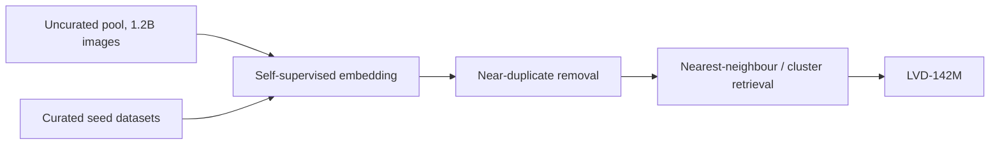

## Abstract

DINOv2 asks whether image-only self-supervision can produce features that work "out of the box", the way pretrained language models do, without finetuning and without captions. The answer the paper gives is yes, provided two things are fixed: the data and the training recipe. For data, the authors build LVD-142M, a 142M-image set retrieved from 1.2B crawled images by visual similarity to a handful of curated datasets, with no labels or metadata involved. For the recipe, they combine the DINO and iBOT objectives, add a feature-spreading regularizer and a short high-resolution phase, and engineer the training loop so that a 1.1B-parameter ViT can be trained stably. The large model is then distilled into smaller ViTs. With a linear probe on frozen features, the resulting family matches OpenCLIP-class encoders on ImageNet and clearly beats them on dense tasks such as segmentation and depth.

**Keywords:** self-supervised learning, self-distillation, masked image modeling, data curation, Vision Transformer, frozen features

## 1 Introduction

The target is a general-purpose visual encoder: one set of frozen features that serves classification, retrieval, segmentation and depth alike. At the time, the strongest candidates were text-guided models such as CLIP and OpenCLIP. The authors argue that captions are a lossy description of an image. They name the salient objects but say little about layout, geometry or texture, so pixel-level information is not pushed into the features. They also require paired text, which rules out learning from raw images.

Self-supervised learning avoids both problems, but it had mostly been developed on ImageNet-1k. Attempts to scale it used uncurated web images, and feature quality dropped. The paper's position is that <mark>the method was not the bottleneck; data quality and training stability at scale were</mark>. Most of the contribution is therefore engineering.

## 2 Background

Two earlier methods are the base. **DINO** trains a student network to match the output distribution of a teacher on a different crop of the same image; the teacher is an exponential moving average (EMA) of the student, and its outputs are centered and sharpened to avoid collapse. **iBOT** adds a patch-level version: some student patches are masked, and the student must predict the teacher's output for those patches from context. DINO shapes the global `[CLS]` token; iBOT shapes the local patch tokens.

Evaluation uses frozen features: the backbone is never updated, and a k-NN classifier or a linear layer is fitted on top.

## 3 Method

> **Key idea.** Keep the DINO + iBOT self-distillation objective almost unchanged, and instead fix what breaks at scale: curate the data by retrieval so that it is both large and balanced, regularize the feature space so it does not clump, and make training cheap enough to run a billion-parameter ViT, then distill that model down.

### 3.1 Data: LVD-142M by self-supervised retrieval

The raw pool is 1.2B unique web images after safety filtering and hash deduplication. A copy-detection model removes near-duplicates, including near-duplicates of any benchmark test image. Every image is then embedded with a self-supervised ViT-H/16, and curated datasets (ImageNet-22k, ImageNet-1k train, Google Landmarks, several fine-grained sets) act as queries. For large query sets, the $N=4$ nearest neighbours of each query image are kept; for small ones, images are sampled from the k-means cluster that the query falls in. The pipeline runs on 20 nodes of 8 V100 GPUs and finishes in under two days.

### 3.2 Objective

The image-level term is a cross-entropy between teacher and student prototype distributions computed from the class tokens of two different crops:

$$
\mathcal{L}_{\text{DINO}} = -\sum_{k} p_t^{(k)} \log p_s^{(k)} \tag{1}
$$

where $p_s$ is the softmax of the student head output, $p_t$ is the centered teacher output, and $k$ runs over prototypes. The patch-level term applies the same idea to masked positions:

$$
\mathcal{L}_{\text{iBOT}} = -\sum_{i \in \mathcal{M}} \sum_{k} p_{t,i}^{(k)} \log p_{s,i}^{(k)} \tag{2}
$$

where $\mathcal{M}$ is the set of patches masked for the student (the teacher sees them unmasked). Teacher weights follow $\theta_t \leftarrow m\,\theta_t + (1-m)\,\theta_s$ with momentum $m$.

Three changes are made relative to iBOT. The two losses use **separate projection heads**, because sharing them, which helped at small scale, hurt at large scale. Teacher centering is replaced by three iterations of **Sinkhorn-Knopp** normalization, as in SwAV. And a **KoLeo regularizer** is added:

$$
\mathcal{L}_{\text{KoLeo}} = -\frac{1}{n}\sum_{i=1}^{n} \log d_{n,i}, \qquad d_{n,i} = \min_{j \neq i} \lVert x_i - x_j \rVert \tag{3}
$$

with $x_1,\dots,x_n$ the $\ell_2$-normalized features in a batch. It comes from the Kozachenko–Leonenko nearest-neighbour estimator of differential entropy: penalising small nearest-neighbour distances pushes the batch toward a uniform spread on the sphere.

### 3.3 Resolution, efficiency, distillation

Resolution is raised to $518 \times 518$ only for a short final phase. An ablation shows this recovers most of the benefit of full high-resolution training, which costs roughly $3\times$ more compute.

On the systems side, the authors use a custom memory-efficient attention, sequence packing (crops of different sizes concatenated under a block-diagonal attention mask), a stochastic depth that skips dropped samples instead of zeroing them, and FSDP with mixed precision. Together, <mark>the code runs about $2\times$ faster than iBOT's with one third of the memory</mark>.

Smaller models (ViT-S/B/L) are not trained from scratch. They are distilled from the frozen ViT-g using the same loss, without masking or stochastic depth. <mark>A distilled ViT-L beats a ViT-L trained from scratch on all 12 benchmarks checked</mark>, and on a few it edges past the teacher.

## 4 Experiments

**Ablations.** Starting from iBOT with a ViT-L on ImageNet-22k, adding the components one by one lifts k-NN accuracy from 72.9 to 82.0 and linear accuracy from 82.3 to 84.5. KoLeo is the largest single step on k-NN (+2.3). Removing KoLeo from the final model drops Oxford-M retrieval from 63.9 to 55.6 mAP; removing the masked-patch loss drops ADE-20k from 47.1 to 44.2 mIoU. On data, <mark>a ViT-g trained on a random 142M uncurated sample loses to the curated set on most benchmarks</mark>, e.g. 68.0 vs 82.3 on iNaturalist 2018, while staying close on ImageNet-1k (83.3 vs 85.8).

**Main results.** The table collects frozen-feature numbers for the largest models (ImageNet-1k linear top-1 and ImageNet-V2 from Table 4; ImageNet-A from Table 6; ADE20k linear mIoU from Table 10; NYUd linear-1 RMSE from Table 11).

| Model | Text sup. | IN-1k linear | IN-V2 | IN-A | ADE20k mIoU (lin.) | NYUd RMSE ↓ (lin. 1) |
|---|---|---|---|---|---|---|
| MAE ViT-H/14 | no | 76.6 | 64.8 | 10.2 | 33.3 | 0.517 |
| DINO (ViT-S/8 for IN-1k, ViT-B/8 elsewhere) | no | 79.2 | 68.2 | 23.9 | 31.8 | 0.555 |
| iBOT ViT-L/16 | no | 82.3 | 72.4 | 41.5 | 44.6 | 0.417 |
| OpenCLIP ViT-G/14 | yes | 86.2 | 77.2 | 63.8 | 39.3 | 0.541 |
| DINOv2 ViT-L/14 (distilled) | no | 86.3 | 78.0 | 71.3 | 47.7 | 0.384 |
| **DINOv2 ViT-g/14** | no | **86.5** | **78.4** | **75.9** | **49.0** | **0.344** |

On ImageNet the gain over the previous self-supervised best is +4.2 points, and the model is level with OpenCLIP-G. The interesting column is the dense one: <mark>OpenCLIP-G, the strongest classifier among the baselines, is worse than iBOT ViT-L at linear segmentation and depth</mark>, which supports the claim that caption supervision does not teach local geometry. With a multi-scale linear head DINOv2-g reaches 53.0 mIoU on ADE20k, and with a frozen backbone inside a ViT-Adapter + Mask2Former pipeline it reaches 60.2, against a state of the art of 62.9.

Instance retrieval shows the widest margin: 52.3 mAP on Oxford-Hard for ViT-g against 19.7 for OpenCLIP-G. The model does fall behind OpenCLIP on some benchmarks where text helps, such as ImageNet-R (78.8 vs 87.8), Sketch (62.5 vs 66.4), SUN and Cars. Finetuning the backbone on ImageNet adds only about +2 points (88.5 at 224 px), so the frozen features already carry most of what is available.

Qualitatively, the first PCA component of patch features separates foreground from background, and the next components colour corresponding object parts consistently across images of different poses and styles ([Fig. 1 in the paper](https://arxiv.org/pdf/2304.07193#page=2)). The scaling curves across eight task families are in [Fig. 2](https://arxiv.org/pdf/2304.07193#page=3).

## 5 Discussion

**Strengths.** The ablation ladder is honest about what each ingredient buys, including steps that lower linear accuracy but were kept for stability. The evaluation is broad, and the frozen-probe protocol makes the comparison to text-supervised models hard to game. The cost accounting is also useful: one ViT-g pretraining is 22,016 A100 GPU-hours.

**Weaknesses.** The curation step is not label-free in a strict sense. The seed sets include ImageNet-22k and ImageNet-1k train, so the retrieved distribution is steered toward the evaluation benchmarks, and there is no ablation over which seed datasets matter. The paper also bundles many changes; the +1.2 from "batch size 3k" or +1.1 from warm-up tweaks are recipe tuning, not insight.

**Not shown.** There is no analysis of how retrieval depth $N$ or cluster count changes the outcome, and no study of non-natural images (medical, satellite, documents). The fairness section reports a 25.7% drop from Europe to Africa on Dollar Street, so "general-purpose" still means general across Western web imagery.

## 6 Takeaways

- Self-supervised features can match text-supervised ones at image level and beat them at pixel level, once data is curated and training is stabilised.
- Curation by embedding retrieval is cheap (under two days on 160 GPUs) and mattered more than raw volume: same size, uncurated, was clearly worse.
- KoLeo is a small, reusable trick: a nearest-neighbour entropy penalty that keeps embeddings spread out and mainly helps retrieval.
- Train one large model well, then distill. The distilled ViT-L beat the from-scratch ViT-L everywhere it was tested.
- For financial time series the transfer is indirect. The two ideas that carry over are (i) frozen self-supervised encoders as a test of representation quality, and (ii) entropy-style regularizers such as Eq. (3) to stop learned embeddings of market states from collapsing. Nothing in the paper concerns generative or stochastic-process modelling.

## References

1. Oquab, M., Darcet, T., Moutakanni, T., et al. *DINOv2: Learning Robust Visual Features without Supervision.* TMLR, 2024. arXiv:2304.07193.
2. Caron, M., et al. *Emerging Properties in Self-Supervised Vision Transformers* (DINO). 2021.
3. Zhou, J., et al. *iBOT: Image BERT Pre-Training with Online Tokenizer.* 2022.
4. Caron, M., et al. *Unsupervised Learning of Visual Features by Contrasting Cluster Assignments* (SwAV). 2020.
5. Sablayrolles, A., et al. *Spreading Vectors for Similarity Search* (KoLeo regularizer). 2019.
