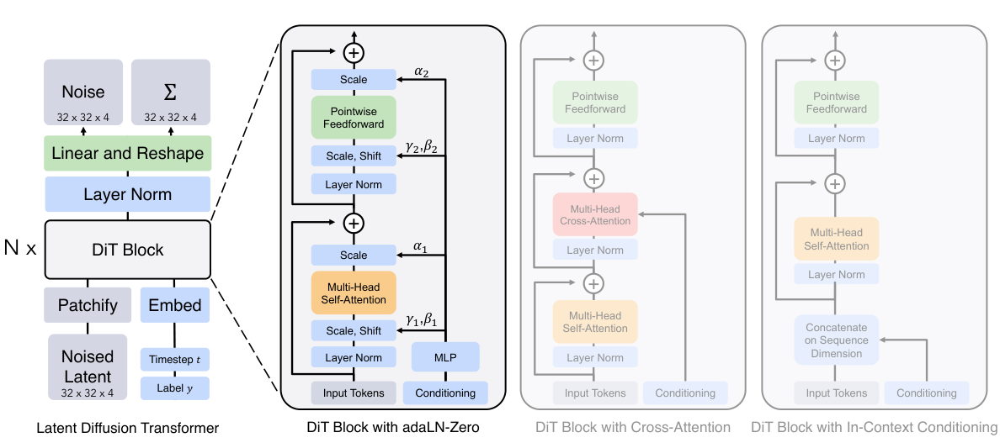
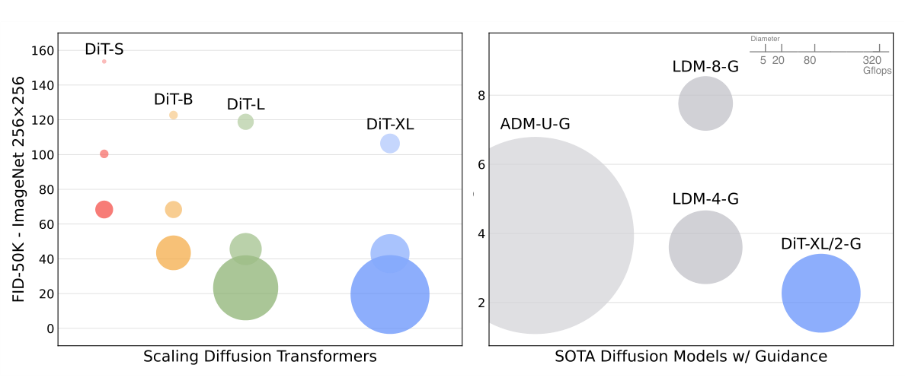
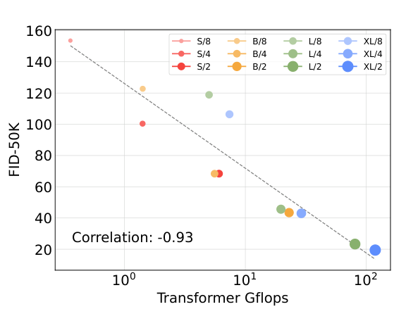

## Abstract

Until this paper every strong image diffusion model used a convolutional U-Net as its denoiser, a choice inherited from DDPM rather than argued for. Peebles and Xie ask whether that inductive bias matters. They keep the latent diffusion recipe — a frozen VAE plus a noise-prediction network — and replace only the network, with a transformer that reads the latent as a sequence of patches. The design space is small: patch size, model size, and how the timestep and class label enter each block. Across twelve models, <mark>FID falls steadily as forward-pass Gflops rise, whether the extra compute comes from a deeper and wider network or from more tokens</mark>. DiT-XL/2 reaches FID 2.27 on class-conditional ImageNet 256×256 and 3.04 at 512×512 with classifier-free guidance, better than all earlier diffusion models while costing an order of magnitude less compute per step than pixel-space U-Nets.

**Keywords:** diffusion transformer, latent diffusion, adaptive layer norm, scaling behaviour, Gflops, classifier-free guidance

## 1 Introduction

Transformers had taken over language, recognition and autoregressive image generation, yet diffusion models stayed with the U-Net that Ho et al. borrowed from PixelCNN++: ResNet blocks with a few self-attention layers at low resolution. [ADM](/blog/diffusion-beats-gans/) ablated details such as channel counts, head configuration and adaptive normalisation, but left the overall shape untouched. Nobody had shown whether that shape is necessary.

The paper's position is that it is not. If a standard transformer can do the job, diffusion models inherit the training recipes and, more importantly, the predictable scaling the architecture has shown elsewhere. The authors also argue that parameter count is a poor complexity measure for image models because it ignores resolution and sequence length, and measure complexity in theoretical forward-pass Gflops instead. That choice is load-bearing: <mark>the entire scaling claim is a claim about Gflops, and the paper's own numbers show that patch size and parameters are not interchangeable ways of buying them</mark>.

## 2 Background

The diffusion setup is [Improved DDPM](/blog/improved-ddpm/)'s. Data $x_0$ is noised by

$$
q(x_t \mid x_0) = \mathcal{N}\!\left(x_t;\ \sqrt{\bar\alpha_t}\,x_0,\ (1-\bar\alpha_t)I\right), \tag{1}
$$

so $x_t = \sqrt{\bar\alpha_t}x_0 + \sqrt{1-\bar\alpha_t}\,\epsilon_t$ with $\epsilon_t \sim \mathcal{N}(0, I)$ and $\bar\alpha_t$ a fixed schedule. The network predicts the noise under

$$
L_{\text{simple}}(\theta) = \lVert \epsilon_\theta(x_t) - \epsilon_t \rVert_2^2, \tag{2}
$$

while a second output, the diagonal reverse-process covariance $\Sigma_\theta$, is trained with the full variational bound. Sampling uses [classifier-free guidance](/blog/classifier-free-guidance/): the label $c$ is randomly replaced by a learned null embedding $\varnothing$ during training, and at test time the two predictions are extrapolated,

$$
\hat\epsilon_\theta(x_t, c) = \epsilon_\theta(x_t, \varnothing) + s\,\big(\epsilon_\theta(x_t, c) - \epsilon_\theta(x_t, \varnothing)\big), \tag{3}
$$

with $s>1$ the guidance scale and $s=1$ ordinary conditional sampling. Everything runs in the latent space of the Stable Diffusion VAE ([LDM](/blog/latent-diffusion/)): the encoder downsamples by 8, so a $256\times256\times3$ image becomes a $32\times32\times4$ latent $z=E(x)$, the diffusion model is trained on $z$, and samples are decoded with $D$. The VAE is frozen throughout and its 84M parameters are excluded from every count in the paper.

## 3 Method

> **Key idea.** Treat the noised latent as a ViT input, keep the transformer as standard as possible, and inject the timestep and label only through the scale and shift of layer norm plus a zero-initialised gate on every residual branch — conditioning that is almost free in flops because it is computed once per image rather than once per token.


*Source: Peebles and Xie, arXiv:2212.09748, Fig. 3, CC BY 4.0.*

### 3.1 Patchify, and where the compute goes

A latent of shape $I\times I\times C$ is cut into $p\times p$ patches, each linearly embedded into a $d$-dimensional token, with fixed sine–cosine positional embeddings added. The sequence length is

$$
T = (I/p)^2. \tag{4}
$$

The paper says halving $p$ quadruples $T$ and "at least quadruples" Gflops. It is worth making that precise, because the whole argument rests on it. Counting multiply–accumulates in an $N$-layer, width-$d$ transformer — $4d^2$ per token for the attention projections, $8d^2$ for the feedforward network, and $2Td$ per token for the attention scores and value mixing — gives

$$
\mathcal{C} \;\approx\; N\big(12\,T\,d^{2} \;+\; 2\,T^{2}d\big). \tag{5}
$$

For XL/2 ($N=28$, $d=1152$, $T=256$) this evaluates to 118.4 G against the paper's reported 118.64; for S/2, 6.04 against 6.06; for XL/8, 7.15 against 7.39. Both XL residuals are about 0.24 G, which is exactly the $6d^2$ adaLN MLP per block summed over 28 blocks — a per-image cost that does not scale with $T$, hence identical for $p=2$ and $p=8$. So Eq. (5) is the right accounting, and it says something the paper does not spell out: <mark>at $T=256$ the quadratic attention term is only about 3.6% of XL/2's cost</mark>, so halving $p$ multiplies Gflops by very nearly exactly four, and the "transformer scaling" being measured is mostly the scaling of a per-token MLP stack. Only at $512\times512$, where $T=1024$, does attention reach about 13% of the total.

Patch size is therefore a knob that changes compute without changing model size — total parameters actually decrease slightly, since the patchify and decoder projections shrink. Three values are tested, $p\in\{2,4,8\}$.

### 3.2 Conditioning blocks

Four ways of feeding $t$ and $c$ into a block are compared. The cost figures below are mine, derived from the paper's Table 4 for XL/2.

- **In-context:** append the two embeddings as extra tokens and use an unmodified ViT block. 119.37 G, 449M parameters.
- **Cross-attention:** an added cross-attention layer over the length-two conditioning sequence, as in LDM. The $q$ and output projections run over all $T$ tokens while $k$ and $v$ see only two, giving $2d^2T$ extra MACs per block — about 18 G, or the "roughly 15% overhead" the paper quotes — and $4d^2$ extra parameters per block, which is the observed $+149$M. 137.62 G, 598M.
- **adaLN:** the layer-norm scale $\gamma$ and shift $\beta$ are regressed by an MLP from the sum of the $t$ and $c$ embeddings, $4d$ outputs per block. Cheapest in flops, and the only mechanism that applies the *same* function to every token. 118.56 G, 600M.
- **adaLN-Zero:** the same MLP also emits a per-channel gate $\alpha$ applied just before each residual addition, $6d$ outputs per block, initialised so $\alpha=0$. 118.64 G, 675M.

For a block input $h$ and a sublayer $F$ (self-attention or the feedforward network),

$$
h \leftarrow h + \alpha(t,c) \odot F\big(\gamma(t,c) \odot \mathrm{LN}(h) + \beta(t,c)\big), \tag{6}
$$

so every block starts as the identity map, mirroring the zero-initialised final convolutions in diffusion U-Nets.

The parameter arithmetic is the part worth pausing on. The adaLN MLP maps $d\to6d$ once per block, costing $6d^2\approx8.0$M parameters per block, or 223M over 28 blocks — almost exactly the 226M gap between adaLN-Zero (675M) and in-context (449M). Those parameters are invisible in the Gflops column because they are applied to a single conditioning vector, not to 256 tokens. <mark>The block comparison is therefore matched on compute but not on parameters: adaLN-Zero carries 50% more weights than in-context conditioning and 12.5% more than plain adaLN</mark>, the latter being exactly the $2d^2$ per block spent on the gates. Since the paper's own headline is that parameters do not determine quality, this is a place where the two arguments pull against each other.

### 3.3 Intuition: why the zero gate matters here

Zero-initialised residual gates are an old trick, but the reason they help a *diffusion* transformer is specific, and the argument below is mine. At initialisation $\alpha=0$ makes the network output the zero vector for every input, so $\epsilon_\theta\equiv0$ and the loss equals $\mathbb{E}\lVert\epsilon\rVert^2$, the same value at every $t$: the network starts at the "predict nothing" solution rather than at a random function of $x_t$. A random function is actively harmful early on, because a single batch spans the whole timestep range and an untuned modulation produces gradients of wildly different magnitude across it. With the gate closed, the first thing the network can learn is *how much* of each branch to open as a function of $t$ — a one-dimensional problem — before it learns what to compute. That fits the paper's observation that DiTs need no warmup and show no loss spikes, unusual for ViTs at this scale, and it fits the size of the gap: plain adaLN and adaLN-Zero differ only in the gates, yet score 25.21 versus 19.47 at 400K steps.

### 3.4 Sizes, decoder and sampling

Four ViT configurations are used, following ViT's conventions: S (12 layers, width 384, 6 heads), B (12, 768, 12), L (24, 1024, 16) and XL (28, 1152, 16). Combined with three patch sizes they span 0.36 to 118.64 Gflops and 33M to 676M parameters. After the last block a final adaptive layer norm and a linear layer map each token to $p\times p\times 2C$ values, rearranged into a noise prediction and a diagonal covariance with the input's spatial shape.

```text
TRAIN
  x        <- image batch, random horizontal flip only
  z        <- E(x) / (VAE scaling)            # frozen encoder, 32x32x4 for 256x256
  t        <- Uniform{1..1000}
  eps      <- Normal(0, I)
  z_t      <- sqrt(abar[t]) * z + sqrt(1 - abar[t]) * eps
  c        <- class label, replaced by the null embedding with some probability   # value not stated
  h        <- patchify(z_t, p) + sincos_pos                 # T = (32/p)^2 tokens, width d
  cond     <- MLP(freq_embed_256(t)) + embed(c)             # one vector per image
  for each of N blocks:
    g1,b1,a1,g2,b2,a2 <- split(Linear_6d(SiLU(cond)))       # a* zero-initialised
    h <- h + a1 * SelfAttn( g1 * LN(h) + b1 )
    h <- h + a2 * MLP_gelu( g2 * LN(h) + b2 )
  out      <- Linear_2C( gz * LN(h) + bz )                  # -> eps_hat and Sigma_hat
  loss     <- ||eps_hat - eps||^2  +  VLB term on Sigma_hat
  AdamW(lr = 1e-4, no weight decay, no warmup); update EMA (0.9999)

SAMPLE
  z <- Normal(0, I)
  for t = 1000 down to 1 (250 strided DDPM steps):
    e_c, S <- DiT(z, t, c) ;  e_0, _ <- DiT(z, t, null)
    e      <- e_0 + s * (e_c - e_0)           # applied to the first 3 of 4 latent channels only
    z      <- ancestral_step(z, e, S, t)
  return D(z)                                  # frozen decoder
```

## 4 Implementation notes

| Item | Value |
|---|---|
| VAE | Stable Diffusion "f8", frozen; 84M params excluded from all counts |
| VAE decoder | ft-MSE for the scaling study, ft-EMA for Tables 2–3 |
| Optimiser | AdamW, constant lr $10^{-4}$, no weight decay, no warmup, Adam $\beta$ untuned (from ADM) |
| Batch size | 256, identical for every model |
| Augmentation | horizontal flips only |
| EMA | decay 0.9999; all reported results use the EMA weights |
| Diffusion | $t_{\max}=1000$, linear $\beta$ from $10^{-4}$ to $2\times10^{-2}$, ADM's $\Sigma_\theta$ parameterisation and $t$/label embeddings |
| Timestep embedding | 256-dim frequency embedding → 2-layer MLP of width $d$, SiLU |
| adaLN MLP | SiLU → linear to $4d$ (adaLN) or $6d$ (adaLN-Zero); core transformer uses tanh-approximated GELU |
| Initialisation | final linear layer zeroed, adaLN gate outputs zeroed, otherwise standard ViT init |
| Evaluation | FID-50K with 250 DDPM steps, exported samples scored by ADM's TensorFlow suite |
| Compute | JAX on TPU-v3 pods; XL/2 runs ~5.7 it/s on a v3-256 pod |
| Training length | 400K steps for the 12-model sweep; 7M for XL/2 at $256^2$, 3M at $512^2$ |

Easy to get wrong when reproducing:

- **Guidance is applied to the first three of the four latent channels only.** The appendix says three-channel guidance at scale $1+x$ is well approximated by four-channel guidance at $1+\tfrac34 x$; the headline 2.27 uses three-channel guidance at $s=1.5$, and four-channel at $s=1.375$ gives 2.20. Reproducing 2.27 with the obvious four-channel implementation at $s=1.5$ will not work.
- **The decoder is a free variable.** Table 5: the same XL/2-G weights score 2.46 with LDM's original decoder, 2.30 with ft-MSE and 2.27 with ft-EMA. <mark>About 0.19 FID of the headline number comes from the VAE decoder, not from the architecture.</mark>
- **EMA weights are what is evaluated**, and the models were never trained to FID saturation — the caption to Table 4 says training simply continued as long as possible.
- **Gflops exclude the VAE**, so a like-for-like comparison with a pixel-space model must add the encoder/decoder cost to DiT's side.
- **Not stated:** the classifier-free-guidance label-dropout probability, the VAE latent scaling factor, the number of seeds behind any number, and wall-clock or memory cost for anything other than XL/2.

## 5 Experiments

**Setup.** Class-conditional ImageNet at $256^2$ and $512^2$, identical hyperparameters for every model, 400K steps for the sweep. Training was stable for all twelve configurations with no warmup and no regularisation, and no loss spikes are reported.

**Table 4 of the paper — all twelve models at 400K steps, FID-50K without guidance (ft-MSE decoder).**

| Model | Gflops | Params | FID-50K | Model | Gflops | Params | FID-50K |
|---|---|---|---|---|---|---|---|
| S/8 | 0.36 | 33M | 153.60 | L/8 | 5.01 | 459M | 118.87 |
| S/4 | 1.41 | 33M | 100.41 | L/4 | 19.70 | 458M | 45.64 |
| S/2 | 6.06 | 33M | 68.40 | L/2 | 80.71 | 458M | 23.33 |
| B/8 | 1.42 | 131M | 122.74 | XL/8 | 7.39 | 676M | 106.41 |
| B/4 | 5.56 | 130M | 68.38 | XL/4 | 29.05 | 675M | 43.01 |
| B/2 | 23.01 | 130M | 43.47 | **XL/2** | **118.64** | 675M | **19.47** |

**Block design, XL/2 at 400K steps.**

| Block | Gflops | Params | FID-50K |
|---|---|---|---|
| In-context | 119.37 | 449M | 35.24 |
| Cross-attention | 137.62 | 598M | 26.14 |
| adaLN | 118.56 | 600M | 25.21 |
| **adaLN-Zero** | **118.64** | 675M | **19.47** |


*Source: Peebles and Xie, arXiv:2212.09748, Fig. 2, CC BY 4.0.*


*Source: Peebles and Xie, arXiv:2212.09748, Fig. 8, CC BY 4.0.*

**Table 2 of the paper — class-conditional ImageNet $256\times256$.**

| Model | FID ↓ | sFID ↓ | IS ↑ | Precision ↑ | Recall ↑ |
|---|---|---|---|---|---|
| BigGAN-deep | 6.95 | 7.36 | 171.4 | 0.87 | 0.28 |
| StyleGAN-XL | 2.30 | **4.02** | 265.12 | 0.78 | 0.53 |
| ADM-G, ADM-U | 3.94 | 6.14 | 215.84 | 0.83 | 0.53 |
| LDM-4 (no guidance) | 10.56 | – | 103.49 | 0.71 | 0.62 |
| LDM-4-G (cfg=1.50) | 3.60 | – | 247.67 | **0.87** | 0.48 |
| DiT-XL/2 (no guidance) | 9.62 | 6.85 | 121.50 | 0.67 | **0.67** |
| DiT-XL/2-G (cfg=1.25) | 3.22 | 5.28 | 201.77 | 0.76 | 0.62 |
| **DiT-XL/2-G (cfg=1.50)** | **2.27** | 4.60 | **278.24** | 0.83 | 0.57 |

At $512^2$ (1024 tokens, 524.6 Gflops, 3M steps) the guided FID is 3.04 against ADM-G+ADM-U's 3.85, with ADM at 1983 Gflops and ADM-U at 2813.

**Claim-by-claim reading.**

- *The U-Net inductive bias is not crucial.* Supported in the weak sense that a plain ViT beats published U-Net numbers at a fraction of the compute (118.6 G against LDM-4's 103.6, ADM-U's 742, ADM's 1120). Not supported in the strong sense, because <mark>no U-Net is trained under DiT's own recipe</mark>; every baseline is a published number with a different budget, decoder and tuning history. "A transformer is at least as good" is the honest reading.
- *Gflops predict FID, correlation $-0.93$.* Supported as a trend, with a structured residual the paper does not discuss. The example it gives — S/2 at 6.06 G scoring 68.40, B/4 at 5.56 G scoring 68.38 — is the best-behaved pair in the table. At the same compute L/8 (5.01 G) scores 118.87, nearly twice as bad; at ~1.4 G, S/4 scores 100.41 against B/8's 122.74; XL/8 at 7.39 G loses to S/2 at 6.06 G despite twenty times the parameters. <mark>Every $p=8$ model sits far above the trend line</mark>, so the accurate statement is that Gflops predict FID *given enough tokens*.
- *Parameter count does not determine quality.* Well supported, and the strongest result in the paper. S/2 (33M) ties B/4 (130M); XL/8 (676M) is beaten by S/2 (33M). Since patch size changes compute at fixed parameters, the confound is genuinely broken.
- *adaLN-Zero is the best block.* Supported at one model size, one training length and one seed, and — as §3.2 shows — matched on Gflops but not on parameters. The identity initialisation is worth 25.21 → 19.47 at a 12.5% parameter cost; in-context conditioning is worst (35.24) but is also 226M parameters lighter than adaLN-Zero.
- *Larger models use compute more efficiently.* Supported by Fig. 9: small models trained longer fall behind large models trained briefly, and XL/2 overtakes XL/4 after roughly $10^{10}$ training Gflops. Training compute is estimated as Gflops × batch × steps × 3, an approximation the paper states.
- *Sampling compute cannot substitute for model compute.* Supported for one pair: L/2 at 1000 steps spends 80.7 Tflops per image for FID-10K 25.9, while XL/2 at 128 steps spends 15.2 Tflops for 23.7. Only the DDPM sampler is tested, so this says nothing about whether a better solver — [DDIM](/blog/ddim/) or [EDM](/blog/edm/)'s Heun sampler — would change the trade-off.
- *State of the art.* True on FID, with three qualifications: it depends on guidance (unguided XL/2 is 9.62, barely ahead of LDM-4's 10.56), 0.19 of it comes from the fine-tuned VAE decoder, and StyleGAN-XL still wins on sFID (4.02 vs 4.60). Guidance also costs coverage — recall falls from 0.67 unguided to 0.57 at $s=1.5$ — which is the usual fidelity–diversity trade and is visible in the paper's own table.
- *The scaling trend generalises beyond FID.* Fig. 12 repeats the analysis for sFID, IS, precision and recall and reports the same direction, with IS and precision benefiting most from scale. Fig. 13 adds that training loss falls and saturates lower with more Gflops.

## 6 Limitations

**Stated by the authors**

- The "golden" complexity metric is unsettled; Gflops are a choice, made to align with the architecture-design literature.
- Why guidance on a channel subset works as well as guidance on all channels is left unexplained.
- Text-to-image and further scaling are named as future work; the paper suggests DiT as a drop-in backbone for DALL·E 2 and Stable Diffusion without testing it.
- Neither $256^2$ nor $512^2$ XL/2 had saturated in FID when training stopped.

**My reading**

- No U-Net control under the same recipe is the central gap. Everything else in the paper is beautifully controlled — one recipe, twelve models, identical hyperparameters — which makes the one uncontrolled comparison the one carrying the headline.
- Twelve points at a single training budget on a single dataset is a correlation, not a fitted scaling law, and the $p=8$ residual above shows the single-variable summary is lossy.
- The block ablation controls Gflops and not parameters, while the scaling analysis argues that parameters do not matter. Both cannot be fully true; at minimum, parameters spent on conditioning behave differently from parameters spent on width.
- Theoretical Gflops ignore memory bandwidth, kernel efficiency and activation memory. Only one wall-clock figure appears in the paper.
- Because attention is ~4% of cost at 256 tokens, the experiment mostly demonstrates that a stack of token-wise MLPs with modulation scales well. Whether *attention* is what replaces the U-Net's spatial prior is not isolated.
- adaLN applies one modulation to all tokens, which fits a class label and fits a sentence badly — a structural reason the text-conditioning extension is not a free step.

## 7 Extensions

**What was built on this**

- [SiT](/blog/sit/) keeps the DiT backbone unchanged and swaps the diffusion objective for an interpolant/flow one, isolating the architecture from the training formulation — the control experiment this paper does not run, in the other direction.
- [SD3](/blog/sd3-rectified-flow-transformers/) generalises the block into MMDiT, a two-stream design with separate weights for text and image tokens, precisely because a single adaLN vector is a poor channel for a sentence.
- [MeanFlow](/blog/mean-flows/) and much of the recent one-step-generation literature use DiT-XL/2 as the default backbone, which is why its Gflops figure has become a unit of account.
- [EDM](/blog/edm/) is orthogonal and complementary: DiT uses ADM's diffusion hyperparameters and 250 DDPM steps throughout, so every sampler-side improvement in that note is available to it untested here.
- PixArt-α, Lumina, Flux and the video models that followed all use DiT-style backbones with cross-attention or MMDiT text conditioning.

**Open problems**

- Whether the Gflops–FID relation is a genuine scaling law, with an exponent and an irreducible term, or an artefact of one budget and one dataset.
- What the systematic penalty for large patches really is: a resolution limit of the decoder input, a token-count floor for attention to matter, or something about the VAE latent.
- How to condition on long, structured inputs without abandoning adaLN's efficiency.
- Whether the conditioning parameters could be shared across blocks, recovering most of the 226M at no quality cost.

**Research directions**

*These are ideas, not results — none has been run.*

1. **Tokens versus width at matched compute for return panels.** *Hypothesis:* the "more tokens beat more width" residual in Table 4 reflects how much structure the sequence must resolve, so for a panel of assets over a window of days the analogous knob — time-patch length — has an optimum tied to the autocorrelation horizon rather than to compute. *Data:* daily log-returns for a fixed universe, 256-day windows, patch lengths 1/4/16. *Baseline:* the same Gflops spent on width, plus [Diffusion-TS](/blog/diffusion-ts/) and [TimeGrad](/blog/timegrad/). *Metric:* cross-sectional correlation error, ACF of squared returns, 1% VaR/ES backtest error. *Likely failure mode:* realistic panels sit far below the compute regime where the trend was measured, and the differences are seed noise.
2. **adaLN-Zero as a regime-conditioning mechanism.** *Hypothesis:* a regime label or a realised-volatility scalar is exactly the low-dimensional condition adaLN suits, and gating it closed at initialisation should let a generator learn the unconditional model first and specialise later, avoiding the collapse conditional generators show on rare regimes. *Data:* returns labelled by a fitted 2–3 state HMM, with crisis states deliberately rare. *Baseline:* label concatenation, and cross-attention conditioning. *Metric:* per-regime tail statistics and conditional coverage, especially in the rarest state. *Likely failure mode:* one global modulation per sequence is too coarse to move tail behaviour, so conditional and unconditional models stay indistinguishable where it matters.
3. **Decoupling backbone from diffusion recipe.** *Hypothesis:* at matched Gflops, retraining DiT-B/2 with [EDM](/blog/edm/) preconditioning, loss weighting and Heun sampling closes much of the gap to a larger model — meaning part of the measured "scaling" compensates for ADM's training and sampling choices. *Data:* ImageNet $256^2$ latents, unchanged. *Baseline:* DiT-B/2 as published, 400K steps, 250 DDPM steps. *Metric:* FID-50K at matched training and sampling Gflops. *Likely failure mode:* the latent space is already near-Gaussian, so EDM's $\sigma_{\text{data}}$-based preconditioning buys little and the comparison is uninformative.

## 8 Takeaways

- The U-Net is not essential to diffusion: a nearly unmodified ViT over latent patches matches or beats it at a fraction of the compute per step. The comparison is against published baselines, not a matched-recipe U-Net.
- Forward-pass compute predicts sample quality better than parameter count — S/2 with 33M parameters ties B/4 with 130M — but the prediction has a systematic residual: every $p=8$ model is far worse than its Gflops suggest, so tokens and width are not interchangeable.
- Conditioning is worth more than its cost. adaLN-Zero halves FID against in-context tokens at equal Gflops, though it also carries 226M more parameters, spent where the flop counter cannot see them.
- Sampling longer with a small model does not substitute for training a bigger one — shown for the DDPM sampler only.
- Roughly 0.19 FID of the headline 2.27 comes from the choice of VAE decoder, and the number depends on guidance applied to three of four latent channels. Both are worth knowing before citing it.
- For financial time series the transferable pieces are patch tokenisation of a window and adaLN-Zero as a cheap, stable way to inject the timestep and a low-dimensional condition such as a regime label. The scaling trend itself was measured on one dataset at one budget and should not be assumed for short, non-stationary market data.

## References

1. W. Peebles, S. Xie. *Scalable Diffusion Models with Transformers.* ICCV 2023. arXiv:2212.09748.
2. R. Rombach, A. Blattmann, D. Lorenz, P. Esser, B. Ommer. *High-Resolution Image Synthesis with Latent Diffusion Models.* CVPR 2022. arXiv:2112.10752.
3. P. Dhariwal, A. Nichol. *Diffusion Models Beat GANs on Image Synthesis.* NeurIPS 2021. arXiv:2105.05233.
4. A. Nichol, P. Dhariwal. *Improved Denoising Diffusion Probabilistic Models.* ICML 2021. arXiv:2102.09672.
5. J. Ho, T. Salimans. *Classifier-Free Diffusion Guidance.* 2022. arXiv:2207.12598.
6. A. Dosovitskiy et al. *An Image is Worth 16x16 Words: Transformers for Image Recognition at Scale.* ICLR 2021. arXiv:2010.11929.
