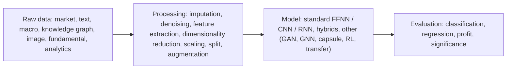

## Abstract

This single-author survey takes stock of deep learning for stock price and index prediction over a deliberately short window, 2017 to 2019. Rather than explaining architectures, it counts: which markets, which inputs, which model families, which metrics, which frameworks, and how many papers release data or code. The material is arranged along a four-step pipeline — raw data, data processing, prediction model, evaluation — so that any new study can be located in it. The picture that emerges is of a field dominated by daily-frequency prediction from price history with recurrent networks, scored mostly by accuracy or RMSE. Profitability analysis, statistical significance testing and open code are all rare. The survey closes with four directions: newer architectures, multi-source inputs, cross-market transfer, and turning predictions into realistic trading systems.

**Keywords:** survey, deep learning, stock market prediction, LSTM, reproducibility, evaluation metrics, alternative data

## 1 Introduction

Predicting stock prices sits awkwardly against the efficient market hypothesis, which says no analysis should earn consistent excess profit. The survey notes the disagreement and moves on to those who try anyway: first fundamental and technical analysis, then linear models such as ARIMA and GARCH, then classical machine learning, and now deep networks fed by web-scale data and GPUs.

The stated motivation is speed. New models, new data sources (news, tweets, knowledge graphs) and better tooling arrive faster than a newcomer can track, and earlier reviews either span many financial problems or stretch over decades. <mark>The distinguishing choice here is narrowness: only stock and index prediction, only roughly three years, and explicit attention to implementation and reproducibility</mark>, which the author says other surveys neglect. The closest prior review, by Sezer et al., covers financial time series in general over 2005–2019; readers interested in bonds, commodities or crypto are pointed there.

## 2 Background

Two distinctions organise everything. The **target** is either a price level (regression) or a movement direction (classification). The **frequency** is either daily or intraday, the latter including mid-price prediction on limit order books. Crossing them gives four problem types.

Two further terms recur. The *lag* is how much history forms one input; the *horizon* is how far ahead the prediction reaches. In my own notation, not the paper's, every surveyed model is some

$$
\hat y_{t+h}=f_\theta\bigl(x_{t-L+1},\dots,x_t\bigr) \tag{1}
$$

with lag $L$, horizon $h$, feature vector $x_t$ and learned parameters $\theta$. The survey reports lags from 2 to 252 periods, and horizons that are almost always one step (a day, five minutes), with a few studies at five or ten days.

## 3 Method

> **Key idea.** Treat the literature as a dataset. Fix one pipeline — raw data → processing → model → evaluation — tag each of 124 papers at every stage, and report counts and year-over-year trends instead of narrative summaries.

### 3.1 Corpus

Papers were collected from Google Scholar by keyword. Of 124, 115 appeared in 2017–2019; 56 are journal articles, 58 conference papers and 10 arXiv preprints. *Expert Systems with Applications* is the largest journal source with 12 papers, followed by *IEEE Access* with 5; IJCAI and IJCNN lead the conferences with 4 each.

### 3.2 The four-step workflow

**Raw data.** Seven types are defined. Market data dominates because it is the only source large enough for deep models; text comes second thanks to easy crawling. Fundamental data is rarely used — it is quarterly, and indexing by period-end rather than release date risks look-ahead. Analyst reports are never used. Satellite or CCTV imagery is mentioned as a possibility but appears in no surveyed paper.

**Processing.** Missing values matter mainly when aligning frequencies, where forward-filling is recommended to avoid leaking the future. Wavelets are the usual denoiser. Feature extraction means technical indicators for prices and, for text, a progression from bag-of-words to word2vec, GloVe and learned event embeddings. PCA, autoencoders, RBMs and empirical mode decomposition reduce dimension. For splitting, rolling (walk-forward) train/validation/test windows are common; [Fig. 6 in the paper](https://arxiv.org/pdf/2003.01859#page=25) contrasts a rolling training set with an expanding one. Data augmentation is barely explored.

**Models.** "Standard" means feed-forward, convolutional and recurrent families and their variants (stacking, attention, bidirectional LSTM/GRU, deep belief nets, seq2seq). Hybrids either pair a network with a traditional method (ARMA with sentiment, bagged weak ANNs, AdaBoost over LSTMs) or pair networks, most often CNN with RNN. A third bucket — GANs, graph neural networks, capsule networks, reinforcement learning, transfer learning — is described as early-stage.

**Evaluation.** Four metric groups: classification, regression, profit, and significance. For the profit group the survey singles out the Sharpe ratio as the measure combining return and risk,

$$
\mathrm{SR}=\frac{\mathbb E[R_p]-R_f}{\operatorname{std}[R_p]} \tag{2}
$$

where $R_p$ is the strategy return and $R_f$ the risk-free rate, with maximum drawdown and annualised volatility as the risk-side companions.

## 4 What the survey finds

**The problem is mostly daily.** 105 of 124 papers predict at daily frequency, 18 intraday, and one does both. The reason offered is data access: daily prices and headlines are free, while good intraday data is scarce in academia and most intraday studies use less than a year of it.

| Problem type | Papers (of 124) |
|---|---|
| Daily classification | 52 |
| **Daily regression** | **54** |
| Intraday classification | 8 |
| Intraday regression | 11 |

(The rows sum to 125 because one paper appears in both frequencies. [Fig. 1 in the paper](https://arxiv.org/pdf/2003.01859#page=9) breaks these down by year.)

**Markets.** By paper count the US leads with 73, then mainland China 36, Hong Kong 12, Japan 11, Korea 8 and India 6; a long tail of markets has one to four papers each ([Fig. 2 in the paper](https://arxiv.org/pdf/2003.01859#page=12)). Most studies test on a single market.

**Inputs.** The share of each input combination, from the paper's Figure 5:

| Input features | Share of papers |
|---|---|
| **Historical prices only** | **35.83%** |
| Prices + technical indicators | 25.00% |
| Prices + text | 13.33% |
| Prices + technical indicators + macroeconomics | 5.83% |
| Prices + technical indicators + text | 5.00% |
| Text only | 3.33% |
| Image only | 3.33% |
| All other combinations | 1.67% or less each |

<mark>More than 60% of the surveyed papers use nothing beyond price history and indicators derived from it.</mark> The year-by-year view ([Fig. 3 in the paper](https://arxiv.org/pdf/2003.01859#page=15)) shows input types diversifying in 2018–2019, which the author reads as a sign that price-only models have become hard to improve.

**Models and training.** <mark>RNN-family models are the most used, but their share falls in 2019 as newer model types appear</mark> ([Fig. 7 in the paper](https://arxiv.org/pdf/2003.01859#page=48)). Adam is the most common optimiser. Deep models are increasingly used as baselines, displacing linear and classical ML comparators.

**Metrics.** Accuracy and F1 lead for classification, followed by precision, recall and MCC; RMSE and MAPE lead for regression, followed by MAE and MSE. <mark>Formal significance tests such as Diebold–Mariano or Kruskal–Wallis are seldom applied, appearing in only a few 2019 studies.</mark>

**Implementation and reproducibility.** Python has become dominant, with Keras and TensorFlow the leading frameworks; no surveyed paper reports using cloud computing. Yahoo! Finance is named as a source in at least 25 of the 124 papers. The survey tabulates the papers that publish datasets and those that publish code, and states plainly that <mark>only a small number of studies release their code</mark>. It also reminds readers that in the M3 and M4 forecasting competitions statistical methods beat pure ML approaches — a reason for caution about the field's self-reported gains.

**Future directions.** (i) Newer architectures, with Transformer and BERT flagged as underused for financial news; (ii) multiple, less-explored data sources, since price-only work is crowded; (iii) cross-market analysis, citing a model trained only on US data and tested on 31 countries over 12 years; (iv) algorithmic trading, where the author notes that existing strategy evaluations are simplistic, often omit or simplify transaction costs, and ignore adaptation to changing market regimes, with deep reinforcement learning suggested as a way forward.

## 5 Discussion

**Strengths.** The article-list tables — by input combination, model, metric, framework, GPU, public data, public code — make it a working index for choosing baselines. Its emphasis on availability of data and code is rare in this genre and still relevant. The workflow framing also exposes quiet pitfalls, such as report-date leakage in fundamental data and forward-filling when mixing frequencies.

**Weaknesses.** It counts rather than judges. No reported results are compared, so a reader learns what is popular, not what works; the claim that deep learning outperforms classical ML rests on the surveyed papers' own assertions, which sits uneasily beside the M4 remark a few sections later. Selection is by Google Scholar keyword without stated inclusion criteria, so the counts describe a convenience sample. There is little on the methodological failures that most affect credibility in this area — look-ahead bias, survivorship bias, multiple testing, weak baselines such as buy-and-hold — beyond passing mentions. Models are treated as point predictors throughout: probabilistic forecasting, volatility, and distributional evaluation are outside its scope.

**Age.** The window closes in 2019. The Transformer appears only as a future direction, GANs get one short paragraph, and there is nothing on diffusion models, large language models or foundation models for time series. It is best read as a baseline map of the pre-2020 literature.

## 6 Takeaways

- The typical 2017–2019 paper predicts next-day price or direction for US stocks from price history with an LSTM-type model, and reports accuracy or RMSE.
- Profit metrics, transaction costs, significance tests and public code are the exception; this is the survey's most useful warning for anyone designing an evaluation.
- Input diversity (text, knowledge graphs, images) was growing, interpreted as diminishing returns from prices alone.
- The practical value is in the tables: lists of papers with open data and code, by model and metric, ready to mine for baselines.
- On generative or stochastic modelling of financial series the survey has almost nothing — GANs are filed under "other models" as early-stage, and everything is point prediction. That absence is itself informative: distributional forecasting and scenario generation were largely uncharted in this literature as of 2019.

## References

1. W. Jiang. *Applications of deep learning in stock market prediction: recent progress.* arXiv:2003.01859.
2. O. B. Sezer, M. U. Gudelek, A. M. Ozbayoglu. *Financial time series forecasting with deep learning: a systematic literature review: 2005–2019.* 2019.
3. S. Makridakis, E. Spiliotis, V. Assimakopoulos. *The M4 Competition: results, findings, conclusion and way forward.* International Journal of Forecasting, 2018.
4. T. Fischer, C. Krauss. *Deep learning with long short-term memory networks for financial market predictions.* European Journal of Operational Research, 2018.
5. A. Ntakaris et al. *Benchmark dataset for mid-price forecasting of limit order book data with machine learning methods.* 2017.
